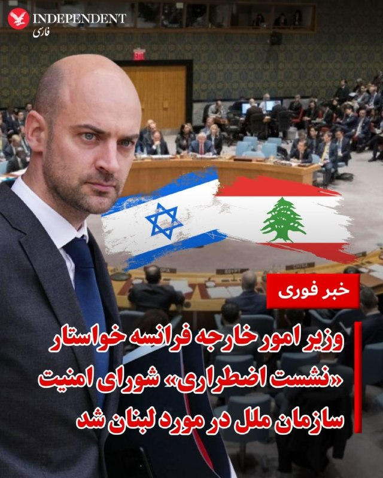
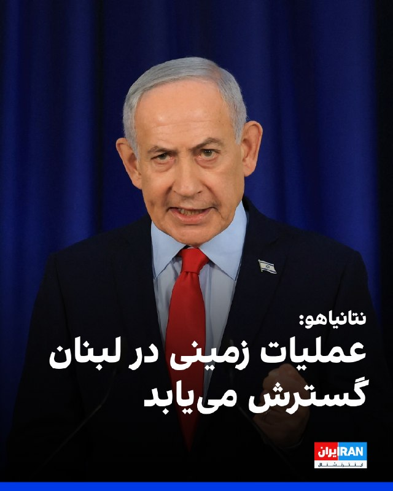
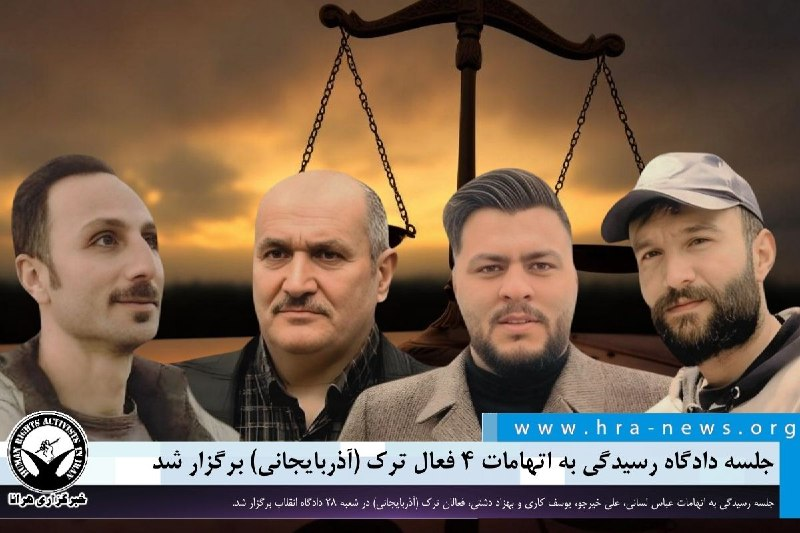
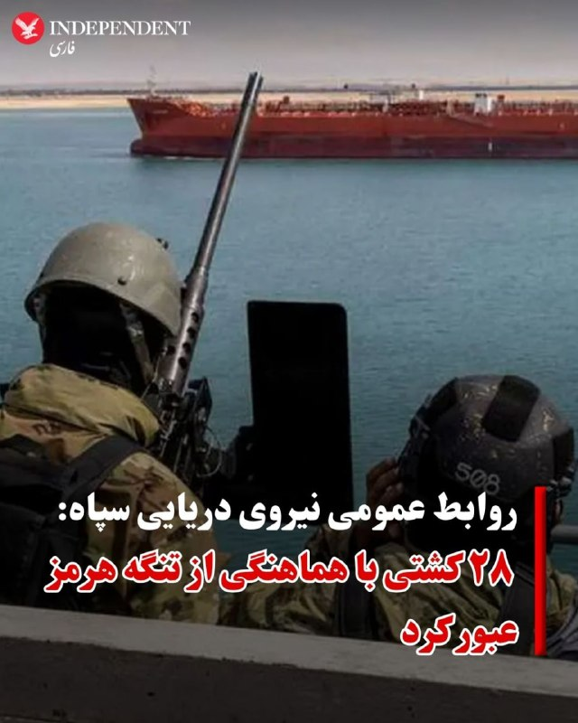
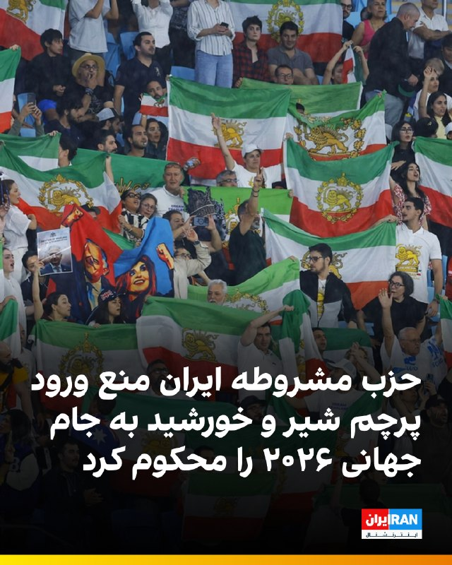
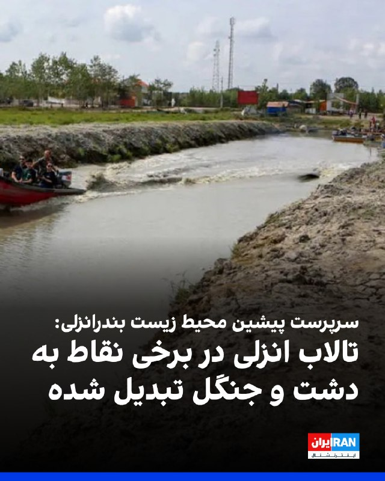
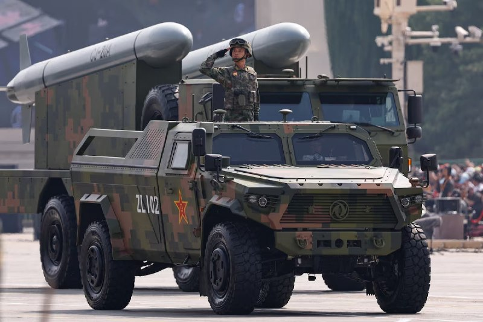
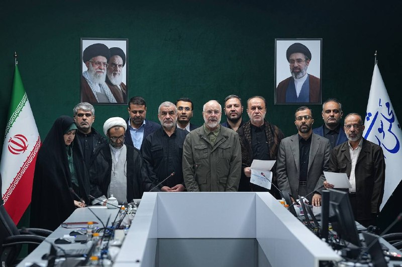
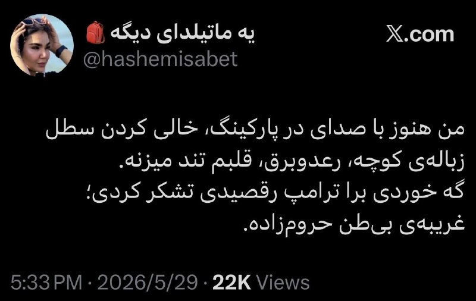

# خواننده تلگرام

<!-- TOP_NAV START -->

<a href="https://github.com/kaminarinokoky/aio-downloader/blob/main/telegram/content/archive_1.md" style="display:inline-block; padding:6px 12px; margin:0 4px; background-color:#2ea44f; color:white; text-decoration:none; border-radius:4px; font-weight:bold;">صفحه بعد</a>

<!-- TOP_NAV END -->

<!-- MSG START -->

---
📅 بروزرسانی: 1405/03/10 15:05
---

## VahidOOnLine — post 243041

  

خبرگزاری تسنیم، وابسته به سپاه پاسداران نوشت که تبادل پیام‌ها میان جمهوری اسلامی و آمریکا درباره متن تفاهم‌نامه احتمالی همچنان ادامه دارد و دو طرف به صورت متناوب اصلاحیه‌هایی را مطرح می‌کنند و تا این لحظه هیچ تفاهمی نهایی نشده و احتمال منتفی شدن هرگونه تفاهم نیز وجود دارد.

تسنیم اضافه کرد که اصل در مواجهه با آمریکا، عدم تفاهم و مذاکره است و اگر تفاهمی شکل بگیرد، باید نکات و چارچوب‌های بسیار محکمی در آن در نظر گرفته شود.

رسانه وابسته به سپاه افزود در وضعیتی که اکنون شکل گرفته، مسدود بودن تنگه هرمز فشار اقتصادی مهمی را به آمریکا و متحدانش وارد می‌کند و به یک «اهرم قدرت» برای جمهوری اسلامی تبدیل شده است.

خبرگزاری تسنیم ادامه داد اگر آمریکا بخواهد ماجرا را به نحوی ساماندهی کند که فشار انسداد تنگه هرمز را از روی خود برداشته و فشار را بر روی جمهوری اسلامی نگاه دارد و سپس با فراغ‌بال بیشتری به جنگ بازگردد، حتما توافق نکردن باز هم بهتر از هرگونه توافقی است.
‌🏁 🇬🇧 IranintlTV

🤖 @VahidOOnLine

## VahidOOnLine — post 243040

  <a href="telegram/content/VahidOOnLine_243040_1780227308.mp4" target="_blank">🎬 Download video</a>

ویدیوی منتشرشده، حمل پیکر جاویدنام محسن جبارزاده را نشان می‌دهد. جبارزاده، ۴۱ ساله و متاهل، ۱۹ دی‌ ۱۴۰۴ در خیابان سلسبیل تهران هدف گلوله جنگی ماموران قرار گرفت و کشته شد.
‌🏁 🇬🇧 IranintlTV

🤖 @VahidOOnLine

## VahidOOnLine — post 243039

  

⭕️نتانیاهو: عملیات زمینی اسرائیل در لبنان گسترش خواهد یافت

♦️بنیامین نتانیاهو، نخست‌وزیر اسرائیل روز یکشنبه دهم خرداد اعلام کرد که به ارتش این کشور دستور داده است حضور نیروها در مخفیگاه و مواضع حزب‌الله در شمال رود لیتانی را گسترش دهد و عملیات زمینی در لبنان را تعمیق کند.

نتانیاهو تصرف قلعه راهبردی بوفور (شقیف) را «تغییری بنیادین» در سیاست اسرائیل توصیف کرد و گفت: «ابتکار عمل در تمامی جبهه‌ها در اختیار اسرائیل قرار دارد».

اظهارات نخست‌وزیر اسرائیل در حالی مطرح می‌شود که درگیری‌ها میان ارتش این کشور و حزب‌الله در جنوب لبنان همچنان ادامه دارد و عملیات نظامی اسرائیل در این منطقه وارد مرحله تازه‌ای شده است.
‌🇸🇦 Indypersian

🤖 @VahidOOnLine

## VahidOOnLine — post 243038

  

♦️وزیر امور خارجه فرانسه روز یکشنبه ۱۰ خرداد گفت که پس از تصرف قلعه قرون وسطایی «بوفورت» در لبنان توسط نیروهای اسرائیلی، فرانسه درخواست جلسه اضطراری شورای امنیت سازمان ملل را داده است.

ژان نوئل بارو گفت: «من درخواست جلسه اضطراری شورای امنیت سازمان ملل را کرده‌ام زیرا در حالی که ما حق اسرائیل را مانند همه کشورها برای دفاع از خود به رسمیت می‌شناسیم، هیچ چیز نمی‌تواند ادامه عملیات نظامی اسرائیل در لبنان و اشغال روزافزون خاک لبنان توسط آن را توجیه کند.»

اسرائیل کاتس، وزیر دفاع اسرائیل روز یکشنبه دهم خرداد با انتشار پیامی در اکس اعلام کرد که نیروهای ارتش این کشور قلعه تاریخی و راهبردی شقیف (بوفورت) در جنوب لبنان را تصرف کرده‌اند.

خبرگزاری فرانسه روز یکشنبه تصاویری از برافراشته شدن پرچم ارتش اسرائیل بر فراز این قلعه را در حالی که صدای گلوله‌باران و ستون‌های دود در مناطق اطراف نیز مشاهده می‌شود، منتشر کرد.
‌🇸🇦 Indypersian

🤖 @VahidOOnLine

## VahidOOnLine — post 243037

  

خبرگزاری مهر از شنیده شدن صدای انفجار در محدوده جزیره قشم خبر داد و نوشت که ساکنان مناطق مرکزی و جنوبی این جزیره آن را تایید کرده‌اند اما ماهیت صدا هنوز مشخص نشده است.
همزمان صداوسیما اعلام کرد صداهای شنیده‌شده در قشم و بندرعباس، ناشی از «امحای مهمات باقی‌مانده از جنگ» است.
‌🏁 🇬🇧 IranintlTV

🤖 @VahidOOnLine

## VahidOOnLine — post 243036

  

بنیامین نتانیاهو، نخست‌وزیر اسرائیل، گفت دستور داده استقرار ارتش اسرائیل در مواضع حزب‌الله در شمال رود لیتانی گسترش یابد و عملیات زمینی در لبنان تعمیق شود. او تصرف قلعه بوفور را «تغییری بنیادین» در سیاست اسرائیل خواند و افزود ابتکار عمل در همه جبهه‌ها در دست اسرائیل است.
‌🏁 🇬🇧 IranintlTV

🤖 @VahidOOnLine

## VahidOOnLine — post 243035

  

⭕️وزیر دفاع اسرائیل: نیروهای ما قلعه راهبردی «شقیف» در جنوب لبنان را تصرف کردند

♦️اسرائیل کاتس، وزیر دفاع اسرائیل روز یکشنبه دهم خرداد با انتشار پیامی در اکس اعلام کرد که نیروهای ارتش این کشور قلعه تاریخی و راهبردی شقیف (بوفورت) در جنوب لبنان را تصرف کرده‌اند.
وزیر دفاع اسرائیل همچنین از گسترش عملیات زمینی ارتش این کشور علیه حزب‌الله خبر داد و گفت «نیروهای ما پس از عبور از رودخانه لیتانی، کنترل این موقعیت مهم را به دست گرفته‌اند».

کاتس در این پیام نوشت: «۴۴ سال پس از نبرد بوفورت، نیروهای ما بار دیگر به این قلعه بازگشتند و پرچم اسرائیل را بر فراز آن برافراشتند.»

تصاویر خبرگزاری فرانسه نیز برافراشته شدن پرچم ارتش اسرائیل بر فراز این قلعه را نشان می‌دهد؛ هرچند هم‌زمان صدای گلوله‌باران و ستون‌های دود در مناطق اطراف نیز مشاهده می‌شود.

قلعه «شقیف» به‌دلیل اشراف بر بخش‌های وسیعی از جنوب لبنان، یکی از مهم‌ترین مواضع راهبردی این منطقه محسوب می‌شود.
‌🇸🇦 Indypersian

🤖 @VahidOOnLine

## VahidOOnLine — post 243034

  

سایت هرانا گزارش داد زهرا شهباز طبری، زندانی سیاسی محبوس در زندان لاکان رشت، پس از نقض حکم پیشین در دیوان عالی کشور، بار دیگر از سوی شعبه دوم دادگاه انقلاب رشت به ریاست محمدعلی درویش‌گفتار، به اتهام «بغی از طریق عضویت و فعالیت در سازمان مجاهدین خلق» به اعدام محکوم شد.
این زندانی سیاسی ۶۸ ساله، در فروردین ۱۴۰۴ در منزل شخصی خود در رشت بازداشت شده بود.
‌🏁 🇬🇧 IranintlTV

🤖 @VahidOOnLine

## VahidOOnLine — post 243033

  

فاطمه مهاجرانی، سخنگوی دولت گفت: «فعلا خبری از افزایش مبلغ کالابرگ نیست، البته مطلوب دولت این است که بتواند مبلغ کالابرگ را افزایش دهد اما باید مطلوبات را با مقدورات هماهنگ کنیم.»

او ادامه داد: «اتفاقی که الان در جنوب کشور و دریا در حال رخ دادن است، روی اقتصاد ما تاثیر می‌گذارد.»
iranintl
‌🏁 🇬🇧 IranintlTV

🤖 @VahidOOnLine

## VahidOOnLine — post 243032

  

♦️محمدباقر قالیباف، رئیس‌ مجلس شورای اسلامی در جلسه مجازی روز یکشنبه مجلس گفت: «باید اصلاح برنامه‌ هفتم با تمرکز بر بازسازی خسارات جنگ در دستور کار کمیسیون‌های تخصصی قرار گیرد.»
قالیباف با اشاره به پیام مجتبی خامنه‌ای درخصوص توجه مجلس به مسائل پساجنگ از همۀ‌ ‌کمیسیون‌های‌ تخصصی ‌مرتبط مجلس خواست تا با هماهنگی با دولت طرح‌های لازم را برای اصلاح بندهای ناظر به «نوسازی و بازسازی خسارات جنگ تحمیلی دوم و سوم» به‌صورت «دقیق، قابل سنجش و زمان‌بندی‌شده» آماده کنند تا در اولین فرصتی که شورای‌عالی امنیت ملی به تقاضای هیئت‌رئیسۀ‌ مجلس برای تشکیل جلسات صحن علنی پاسخ مثبت داد، فرایند تصویب آنها آغاز شود.
رسانه‌های ایران گزارش دادند که روز یکشنبه ۱۰ خرداد جلسه مجازی صحن مجلس به ریاست قالیباف و مشارکت برخط ۱۸۷ نماینده و ۱۴ نماینده به‌صورت حضوری برگزار شد.
‌🇸🇦 Indypersian

🤖 @VahidOOnLine

## VahidOOnLine — post 243031

⭕️مراسم تولد جاویدنام مصطفی نوری شیرازی در کنار مزارش برگزار شد

♦️تصاویری که روز یکشنبه دهم خرداد در شبکه‌های اجتماعی منتشر شده نشان می‌دهد، جمعی از بستگان و آشنایان جاویدنام مصطفی نوری شیرازی با حضور بر مزار فرزندشان، مراسم سالروز تولد این جوان جان‌باخته را برگزار کردند.

مصطفی نوری شیرازی، جوان ۲۳ ساله اهل نور در استان مازندران، شامگاه جمعه ۱۹ دی‌ماه ۱۴۰۴ با شلیک مستقیم گلوله جنگی نیروهای سرکوبگر جمهوری اسلامی جان باخت.
به گفته نزدیکان این جوان، ابتدا او را به بیمارستان خمینی‌شهر نور منتقل کردند اما ساعاتی بعد در بیمارستان جان سپرد.
‌🇸🇦 Indypersian

🤖 @VahidOOnLine

## VahidOOnLine — post 243030

  

محمدعلی زلفی‌گل، وزیر علوم در دولت ابراهیم رئیسی گفت: «شما در مناظرات انتخاباتی دیدید که رئیسی هیچ‌گاه حاضر نبود دست به کاری بزند یا حرفی بزند که از منش انسانی، تقوا، ایمان و اخلاق به دور باشد؛ رئیسی شهادت‌گونه زندگی کرد و یک پهلوان سیاسی بود.»

او ادامه داد: «من شهادت می‌دهم که رئیسی فقط کارها را برای خدا، مردم و نظام جمهوری اسلامی انجام می‌داد.»
‌🏁 🇬🇧 IranintlTV

🤖 @VahidOOnLine

## VahidOOnLine — post 243029

  <a href="telegram/content/VahidOOnLine_243029_1780227315.mp4" target="_blank">🎬 Download video</a>

ویدیوهایی که تازه به دست ایران‌اینترنشنال رسیده، برگزاری مراسم چهلم جاویدنام احمد طراقیان را بر سر مزارش نشان می‌دهد.
طراقیان، ۳۲ ساله، شامگاه ۱۹ دی‌ ۱۴۰۴ در شهر کرج، با شلیک گلوله جنگی به ناحیه سر هدف قرار گرفت و جان باخت.
‌🏁 🇬🇧 IranintlTV

🤖 @VahidOOnLine

## WithYashar — post 13022

مردم ما هیچ اتحادی باهم ندارن اقایاشار از مردم کشورم خیلی دلخورم، من ی بلوچم، الان حتی توو همین مجازی هرکسی ک منو ببینه فقط توهین میشنوم فقط چون بلوچم واقعا خیلی دلم شکسته از هموطنای خودم اخه چرا مگ ماها ایرانی نیستیم مگ ما چیکارشون کردیم، ماهم سالهاست داره جوونامون بچه هامون کشته میشن سال هاست زیر ظلم این رژیم هستیم . اصلا قبل همه این داستانا با تمام بدبختی ک داریم تنهایی جلوشون وایسادیم هیچکس نبود، ازتون میخوام این پیاممو بزارین تو چنلتونن🙏🏼 تازمانی ک ماها از همدیگ بدمون میاد حتی این رژیمم عوض بشه این کشور هیچوقت درست نمیشه

## WithYashar — post 13021

روابط‌عمومی ۳پا : صدای انفجار در بندرعباس مربوط به خنثی‌سازی مهمات عمل‌نکرده است.
@withyashar

## WithYashar — post 13020

نیویورک‌تایمز: ترامپ شروط توافق احتمالی با جمهوری اسلامی رو سخت‌تر کرده و نسخه اصلاح‌شده رو برای بررسی دوباره به تهران فرستاده.

طبق این گزارش، اختلاف‌ها به‌ویژه بر سر آزادسازی منابع مالی ایران ادامه داره و واشینگتن تلاش می‌کنه با افزایش فشار، روند مذاکرات رو تسریع کنه.
@withyashar

## WithYashar — post 13019

Voice message

## WithYashar — post 13018

به عنوان خردادی میگم حالا که موضوعش پیش اومد😂
ما اخلاقمون دقیقاااا همون عربس که داره مسافر میبره قاهره
کار خودمونو میکنیما ولی پستی بلندی زیاد داره مسیرمون

## WithYashar — post 13017

دم کسایی‌که حمایت میکنند گرم 🙌🏾❤️‍🩹

## WithYashar — post 13016

ی روز درمیون ب صد نفر میفرستم

## WithYashar — post 13015

لینک کانال تلگرامتو

## WithYashar — post 13014

چیزی ‌نیست صدای
“واریز ناموفق: موجودی کافی نیسته!”
@withyashar 🤣

## WithYashar — post 13013

صدای انفجار در قشم🚨
@withyashar

## WithYashar — post 13012

چندین گزارش صدای مهیب در بندر عباس
@withyashar 🚨

## WithYashar — post 13011

🇺🇸 دونالد ترامپ ( ۷۹ سال )
۲۴ خرداد ۱۳۲۵
🇺🇸 مارکو روبیو ( ۵۵ سال )
۷ خرداد ۱۳۵۰
🇺🇸 پیت هگست ( ۴۵ سال )
۱۶ خرداد ۱۳۵۹
@withyashar 😃

## WithYashar — post 13010

یاشار در داخل ایران فاز مردم مثل آب و هوای خردادی هاست واقعا!!! مودی و اصلا مشخص نیست مردم هم خودشون چی میخوان!!!

## WithYashar — post 13009

## WithYashar — post 13008

https://youtu.be/tRWhvFylQtk

## mwarmonitor — post 9943

... ما مجبور نیستیم از، می‌دانید، سلاح‌های بزرگ استفاده کنیم؛ ما می‌توانیم آن‌ها را از طریق هوا، همان‌طور که داشتیم انجام می‌دادیم، شکست دهیم. اما ما حدود تقریباً دو ماه زمان را در این مذاکرات از دست داده‌ایم. و آن‌ها، آن‌ها این را به عنوان... و آن‌ها به بلند‌نظری…

## mwarmonitor — post 9942

🔴مارک لوین: «به برنامه خوش آمدید، آمریکا. همیشه مایه خرسندی است که مرد دانا و خردمندِ آمریکا را در برنامه داشته باشیم؛ "ویکتور دیویس هنسون". او یک دوست خوب، پژوهشگر ارشد اندیشکده "هوور" است و پادکست بسیار موفقی هم دارد. ویکتور، ممنون که به برنامه آمدی. خب،…

## mwarmonitor — post 9941

🔴مارک لوین: «به برنامه خوش آمدید، آمریکا. همیشه مایه خرسندی است که مرد دانا و خردمندِ آمریکا را در برنامه داشته باشیم؛ "ویکتور دیویس هنسون". او یک دوست خوب، پژوهشگر ارشد اندیشکده "هوور" است و پادکست بسیار موفقی هم دارد.
ویکتور، ممنون که به برنامه آمدی. خب، بگذار این سوال را از تو بپرسم: اگر بتوانی خودت را جای رژیم ایران بگذاری، فکر می‌کنی آن‌ها در حال حاضر چطور به این وضعیت نگاه می‌کنند؟»
🔵 ویکتور دیویس هنسون:
«خب، ما دقیقاً نمی‌دانیم، چون این یک جنگ بسیار غیرمعمول است. ما هیچ نیروی زمینی در آنجا نداریم و هیچ خبرنگار مستقری هم نیست؛ بنابراین میزان دقیق خسارت‌ها را نمی‌دانیم. اما به نظر من، آن‌ها از نظر اقتصادی به شدت آسیب دیده‌اند و ۹۰ درصد از توان نظامی‌شان بی‌تحرک و منفعل شده است.
اما آن‌ها فکر می‌کنند هنوز به اندازه کافی موشک در اختیار دارند. همچنین گمان می‌کنند که کشورهای حوزه خلیج [فارس] بسیار آسیب‌پذیر هستند و معتقدند که تردد در تنگه هرمز، جریان شکننده‌ای است که می‌توانند در آن آشوب و هرج‌ومرج ایجاد کنند. با این کار، فرآیندها را به تاخیر بیندازند، شاید به رکود اقتصادی جهانی دامن بزنند و وضعیت را تا زمان انتخابات میان‌دوره‌ای کش بدهند.
آن‌ها همچنین در حال انجام بازی بسیار عجیبی هستند. آن‌ها سیگنال‌هایی می‌فرستند مبنی بر اینکه افرادی که با ما گفتگو می‌کنند — یعنی همان به‌اصطلاح "رهبران منتخب" — با سپاه پاسداران اختلاف نظر دارند. ما به دلیل اینکه افراد زیادی را حذف کرده‌ایم، دقیقاً نمی‌دانیم این ادعا تا چه حد درست است، اما این شک و شبهه به وجود می‌آید که این گفتگوکنندگان نقش "پلیس خوب" را بازی می‌کنند و سپاه پاسداران و حکومت مذهبی که هر از گاهی تلاش می‌کنند به یک ناو حمله‌ور شوند یا به کویتی‌ها یا دیگران ضربه بزنند، نقش "پلیس بد" را دارند؛ در حالی که آن‌ها در واقع با یکدیگر هماهنگ و همسو هستند.
سپس مذاکره‌کنندگان به ما می‌گویند: "خب، ما نمی‌توانیم این افراد را کنترل کنیم، ما متاسفیم، ما نمی‌دانیم آن‌ها در خلیج [فارس] چه کار می‌کنند، مین‌گذاری می‌کنند و غیره... اما مذاکرات را خراب نکنید." و این رویکرد به هر کدام از آن‌ها در رقابت برای کسب قدرت، نوعی اعتبار می‌دهد.
اما در یک مقطعی، ما باید این روند را متوقف کنیم. و راه‌های زیادی برای متوقف کردن آن وجود دارد مارک؛ زیرا این موضوع از نظر نظامی مشکلی نیست، بلکه یک مسئله سیاسی است که با اقتصاد جهانی، انتخابات میان‌دوره‌ای و مسائل دیگر گره خورده است. اما من فکر می‌کنم رئیس‌جمهور می‌تواند راهی برای حل این معادله پیچیده پیدا کند، اگر به طور غیررسمی به آن‌ها بگوید که این حماقت‌ها یک ضرب‌الاجل و پایان مشخصی دارد و پشیمان خواهید شد. و اینکه ما آن‌قدر به اقتصاد و نیروی نظامی شما آسیب خواهیم زد که بهبود و بازسازی آن برای شما یک ربع قرن (۲۵ سال) طول بکشد؛ و ما یک نیروی باقی‌مانده را در آنجا حفظ خواهیم کرد که به همراه متحدانمان، آن تنگه را باز نگه دارد.
من فکر می‌کنم او (رئیس‌جمهور) می‌تواند این را به آن‌ها بگوید، چون ما نمی‌توانیم به این وضعیت ادامه دهیم. چرا که آن‌ها "بقاء" و دوام آوردن خود را به معنای "پیروزی" تفسیر می‌کنند. می‌دانم این حرف شبیه به دنیای رمان‌های اورول (تخیلی و عجیب) به نظر می‌رسد، اما واقعاً همین‌طور فکر می‌کنند. هر روزی که آن‌ها همچنان پابرجا هستند، می‌گویند: "ببینید، ما در برابر ابرقدرتِ تاریخ تمدن ایستادگی کردیم و هنوز اینجا هستیم و آن‌ها نتوانستند ما را متوقف کنند." آن‌ها این واقعیت را در نظر نمی‌گیرند که تمام خویشتن‌داری ما، در واقع محدودیتی است که خودمان بر خودمان اعمال کرده‌ایم؛ این خویشتن‌داری دلایل انسان‌دوستانه و سیاسی دارد، اما دلیل نظامی ندارد. و...»

@mwarmonitor

## mwarmonitor — post 9940

🔸ترامپ در سوشال تروث @mwarmonitor

## mwarmonitor — post 9939

  

🔸ترامپ در سوشال تروث

@mwarmonitor

## mwarmonitor — post 9938

انفجار در قشم

## mwarmonitor — post 9937

انفجار در قشم

## mwarmonitor — post 9936

🔸وزیر خارجه فرانسه: باز کردن تنگه هرمز یک اولویت اصلی است، چون ما قصد نداریم بهای جنگی را که جنگ ما نیست همچنان بپردازیم.

@mwarmonitor

## mwarmonitor — post 9935

🔴متحدان آمریکا در همه‌جا نگران هستند که ایالات متحده در ایستادگی در برابر استبداد، بیش از حد سکوت کرده است. بلومبرگ

@mwarmonitor

## mwarmonitor — post 9934

🔴ترامپ می‌گوید برای امضای توافق با ایران «عجله‌ای ندارد»: «هیچ سلاح هسته‌ای وجود نخواهد داشت». نیویورک پست

@mwarmonitor

## mwarmonitor — post 9933

🔹تری اینگست (خبرنگار فاکس نیوز در تل‌آویو):
«بله بچه‌ها، صبح بخیر. گزارش‌ها حاکی از آن است که رئیس‌جمهور ترامپ در مذاکرات با ایران بر مواضع خود پافشاری می‌کند و در جریان جلسه اواخر هفته گذشته در اتاق وضعیت (Situation Room)، خواستار چندین اصلاحیه در توافق پیشنهادی شده است. اکنون، رئیس‌جمهور در آخر هفته با فاکس نیوز گفتگو کرده و اشاره داشته که ایالات متحده به یک توافق خوب بسیار نزدیک است.»
🔸 دونالد ترامپ (رئیس‌جمهور آمریکا):
«بنابراین، ما داریم چیزی را که می‌خواهیم به آرامی به دست می‌آوریم. آن‌ها مذاکره‌کنندگان بسیار سرسختی هستند؛ زمان زیادی طول می‌کشد. من عجله‌ای ندارم. دوست دارم بگویم عجله دارم چون می‌دانید، قیمت بنزین به شدت کاهش خواهد یافت، اما اگر بخواهید عجله کنید، توافق خوبی به دست نخواهید آورد. و... آهسته اما مطمئن، فکر می‌کنم داریم به آنچه می‌خواهیم می‌رسیم. و اگر آنچه را که می‌خواهیم به دست نیاوریم، آن را به شکل دیگری پایان خواهیم داد.»
🔹تری اینگست :
«رئیس‌جمهور ترامپ به وضوح نشان داد که اگر ایران توافق او را امضا نکند، گزینه نظامی همچنان روی میز باقی می‌ماند. وزیر جنگ، پیت هگست به سنگاپور سفر کرد؛ جایی که او نیز خواسته رئیس‌جمهور ترامپ برای دستیابی به توافق با ایران را تکرار نمود و افزود که توانمندی‌های نظامی ایالات متحده، قوی‌ترین انگیزه برای ایران است تا از جاه‌طلبی‌های هسته‌ای خود دست بکشد.»
📌 پیت هگست (وزیر جنگ آمریکا):
«بنابراین ایران به وضوحِ هرچه تمام‌تر می‌داند که انتظارات ما چیست و این بر عهده تیم مذاکره‌کننده است که آن را محقق کند. آن‌ها دارند به سمت ما می‌آیند (به مواضع ما نزدیک می‌شوند)، گفتگوها سازنده بوده است. فکر می‌کنم آن‌ها... آن‌ها می‌دانند که این روند باید به کدام سمت برود.»
🔹تری اینگست:
«علاوه بر ایران، ما همچنین تحولات مربوط به درگیری میان اسرائیل و بزرگترین گروه نیابتی ایران، یعنی حزب‌الله را رصد می‌کنیم. پهپادها و راکت‌ها در طول آخر هفته آسمان شمال اسرائیل را در نوردیدند، در حالی که اسرائیل حملات هوایی جدیدی را آغاز کرد و نیروهای زمینی را به عمق بیشتری در جنوب لبنان فرستاد.»
🔸 بنیامین نتانیاهو (نخست‌وزیر اسرائیل):
«از اینجا، نبرد علیه حزب‌الله در شمال مدیریت می‌شود. و باید به شما بگویم که نتایج بسیار چشمگیری در اینجا به دست آمده است. نیروهای ما از (رودخانه) لیتانی عبور کرده‌اند؛ آن‌ها به سمت موقعیت‌های تحت کنترل پیشروی کرده‌اند.»
🔹 تری اینگست :
«بر باور اینجاست که اگر توافقی میان ایالات متحده و ایران حاصل شود، می‌تواند به درگیری‌ها در امتداد مرزهای شمالی اسرائیل پایان دهد. حتی در پنج دقیقه گذشته، آژیرهای خطر در بخش‌های شمالی این کشور در میان حملات جدید حزب‌الله به صدا درآمدند. بچه‌ها؟»
🔹 مجری استودیو فاکس نیوز:
«بسیار خب، تری اینگست، به صورت زنده از تل‌آویو. تری، ازت ممنونم.»

@mwarmonitor

## mwarmonitor — post 9932

  <a href="telegram/content/mwarmonitor_9932_1780227318.mp4" target="_blank">🎬 Download video</a>

🎬 Video

## mwarmonitor — post 9931

📌ارتش اوکراین اعلام کرد که پالایشگاه نفت «ساراتوف» متعلق به شرکت روس‌نفت (Rosneft PJSC) در جنوب‌غربی روسیه و همچنین یک واحد پمپاژ نفت در منطقه‌ای دیگر را هدف حمله قرار داده است، در حالی که مقام‌های محلی از وقوع آتش‌سوزی‌های ناشی از حمله پهپادی در طول شب خبر دادند. بلومبرگ

@mwarmonitor

## mwarmonitor — post 9930

  

🔸بردِ درگیری دوباره در حال گسترش است، آتش بی‌وقفه در شمال: ارتش اسرائیل (IDF) در حال حمله به اهداف حزب‌الله در جنوب لبنان است. کانال ۱۳ اسرائیل

@mwarmonitor

## mwarmonitor — post 9929

🔴یکی از مهم‌ترین شبه‌نظامیان مورد حمایت ایران در عراق (کتائب حزب الله) پیشنهاد داده است که «پهپادها و موشک‌ها را» از سایر گروه‌های شبه‌نظامی که «تصمیم گرفته‌اند سلاح‌های خود را زمین بگذارند» خریداری کند. جوروزالم پست

@mwarmonitor

## FoxNewsTwitter — post 342442

‌Fox News (Twitter/X)

👉 Full story here:

## FoxNewsTwitter — post 342441

  

Fox News (Twitter/X)

President Trump floats scrapping America's 250th anniversary concert for a massive MAGA rally after multiple artists pull out of the Great American State Fair lineup. Freedom 250 organizers later confirmed the president will personally kick off the celebration with an opening ceremony speech on June 24.

Artists who withdrew include Martina McBride, Bret Michaels, Young MC, Morris Day and The Time, and C+C Music Factory. Trump called them 'overpriced singers, who nobody wants to hear, whose music is boring.'

## pm_afshaa — post 91933

  <a href="telegram/content/pm_afshaa_91933_1780227321.webm" target="_blank">🎬 Download video</a>

🔴نتانیاهو: من به ارتش اسرائیل دستور دادم تا دامنه عملیات در لبنان رو گسترش بدن.

💧 Rainbet.com the #1 Non-KYC Crypto Casino & Sportsbook @rainbetcom

😁 @Pm_Afshaa

## pm_afshaa — post 91932

  <a href="telegram/content/pm_afshaa_91932_1780227321.webm" target="_blank">🎬 Download video</a>

🔴آکسیوس به نقل از یک مقام آمریکایی:
ترامپ به خطوط قرمز خود پایبند است و توافقی رو منعقد نخواهد کرد که تضمینی برای نداشتن ایران به سلاح هسته‌ای نباشه.

💧 Rainbet.com the #1 Non-KYC Crypto Casino & Sportsbook @rainbetcom

😁 @Pm_Afshaa

## pm_afshaa — post 91931

🔴الجزیره: روابط روسیه و ایران آنطور که به نظر می‌رسد نیست هدف مسکو تضمین عدم انزوا، فرسایش یا شکست استراتژیک ایران است

💧 Rainbet.com the #1 Non-KYC Crypto Casino & Sportsbook @rainbetcom

😁 @Pm_Afshaa

## pm_afshaa — post 91930

  <a href="telegram/content/pm_afshaa_91930_1780227322.webm" target="_blank">🎬 Download video</a>

🔴قالیباف: تا اطمینان پیدا نکنیم که حقوق ملت رو گرفتیم، توافق نخواهیم کرد.

💧 Rainbet.com the #1 Non-KYC Crypto Casino & Sportsbook @rainbetcom

😁 @Pm_Afshaa

## pm_afshaa — post 91929

  <a href="telegram/content/pm_afshaa_91929_1780227322.webm" target="_blank">🎬 Download video</a>

🔴آکسیوس: ترامپ هنوز توافق با ایران رو نهایی نکرده و خواهان اعمال اصلاحاتی در متن تفاهم، به‌ویژه درباره اورانیوم غنی‌شده ایران و تنگه هرمز شده. به گفته منابع آمریکایی، این درخواست دور جدیدی از مذاکرات رو آغاز کرده و احتمالا پاسخ جمهوری اسلامی چند روز زمان…

## pm_afshaa — post 91928

  <a href="telegram/content/pm_afshaa_91928_1780227323.webm" target="_blank">🎬 Download video</a>

🔴جلسه صحن مجلس به‌صورت مجازی و با حضور قالیباف برگزار شد.

💧 Rainbet.com the #1 Non-KYC Crypto Casino & Sportsbook @rainbetcom

😁 @Pm_Afshaa

## pm_afshaa — post 91927

  <a href="telegram/content/pm_afshaa_91927_1780227323.webm" target="_blank">🎬 Download video</a>

🔴روزنامه کیهان:
به دلیل نقض آتش‌بس در لبنان، میتونیم جنگ علیه اسرائیل رو آغاز کنیم.

💧 Rainbet.com the #1 Non-KYC Crypto Casino & Sportsbook @rainbetcom

😁 @Pm_Afshaa

## pm_afshaa — post 91926

  <a href="telegram/content/pm_afshaa_91926_1780227324.webm" target="_blank">🎬 Download video</a>

🔴آکسیوس: ترامپ هنوز توافق با ایران رو نهایی نکرده و خواهان اعمال اصلاحاتی در متن تفاهم، به‌ویژه درباره اورانیوم غنی‌شده ایران و تنگه هرمز شده.

به گفته منابع آمریکایی، این درخواست دور جدیدی از مذاکرات رو آغاز کرده و احتمالا پاسخ جمهوری اسلامی چند روز زمان خواهد برد.

💧 Rainbet.com the #1 Non-KYC Crypto Casino & Sportsbook @rainbetcom

😁 @Pm_Afshaa

## pm_afshaa — post 91925

  <a href="telegram/content/pm_afshaa_91925_1780227325.webm" target="_blank">🎬 Download video</a>

🔴خبرگزاری مهر: شنیده شدن صدای انفجار در محدوده جزیره قشم.

صدای یک انفجار در قشم از سوی چندین منبع محلی گزارش شده.

💧 Rainbet.com the #1 Non-KYC Crypto Casino & Sportsbook @rainbetcom

😁 @Pm_Afshaa

## DEJradio — post 5170

⭕️ ترامپ: ارتش جمهوری اسلامی را عامدانه هدف نگرفتیم تا اشتباه عراق تکرار نشود

دونالد ترامپ گفت آمریکا عامدانه از هدف قرار دادن کامل ارتش جمهوری اسلامی خودداری کرده است.
به گفتۀ رئیس جمهوری اسالات متحده، = نابود کردن کامل ساختارهای نظامی یک کشور می‌تواند پیامدهای بلندمدت داشته باشد.
او در گفت‌وگو با فاکس‌نیوز گفت این که در جنگ‌ همه چیز را نابود کنی اشتباه است، چون آن را به کشوری تبدیل می‌کنی که تا ۴۰ سال بعد هم توان بازسازی خود را ندارد.
ترامپ با اشاره به عراق گفت عملکرد آمریکا در آن جنگ «یک اشتباه بزرگ» بود.
رئیس جمهوری آمریکا افزود واشینگتن ارتش جمهوری اسلامی را «تا حدی به حال خود گذاشت.
ترامپ گفت ارتش به نسبت دیگر نیروهای مسلح جمهوری اسلامی، تا اندازه‌ای «میانه‌رو» محسوب می‌شود.
رئیس‌جمهوری آمریکا از سویی تکرار کرد توان دریایی و نیروی هوایی جمهوری اسلامی کاملا نابود شده‌ است.

#خبر #دژ #ترامپ
@DEJradio

## DEJradio — post 5169

  <a href="telegram/content/DEJradio_5169_1780227325.webm" target="_blank">🎬 Download video</a>

👑
🔺 حمایت ایرانیان مقیم مالمو - سوئد از انقلاب شیر و خورشید مردم ایران

#همبستگی #مالمو
@DEJradio

## IranIntlTV — post 339873

  

خبرگزاری تسنیم، وابسته به سپاه پاسداران نوشت که تبادل پیام‌ها میان جمهوری اسلامی و آمریکا درباره متن تفاهم‌نامه احتمالی همچنان ادامه دارد و دو طرف به صورت متناوب اصلاحیه‌هایی را مطرح می‌کنند و تا این لحظه هیچ تفاهمی نهایی نشده و احتمال منتفی شدن هرگونه تفاهم نیز وجود دارد.

تسنیم اضافه کرد که اصل در مواجهه با آمریکا، عدم تفاهم و مذاکره است و اگر تفاهمی شکل بگیرد، باید نکات و چارچوب‌های بسیار محکمی در آن در نظر گرفته شود.

رسانه وابسته به سپاه افزود در وضعیتی که اکنون شکل گرفته، مسدود بودن تنگه هرمز فشار اقتصادی مهمی را به آمریکا و متحدانش وارد می‌کند و به یک «اهرم قدرت» برای جمهوری اسلامی تبدیل شده است.

خبرگزاری تسنیم ادامه داد اگر آمریکا بخواهد ماجرا را به نحوی ساماندهی کند که فشار انسداد تنگه هرمز را از روی خود برداشته و فشار را بر روی جمهوری اسلامی نگاه دارد و سپس با فراغ‌بال بیشتری به جنگ بازگردد، حتما توافق نکردن باز هم بهتر از هرگونه توافقی است.
https://iranintl.com/202605316297

## IranIntlTV — post 339872

  <a href="telegram/content/IranIntlTV_339872_1780227326.mp4" target="_blank">🎬 Download video</a>

در پی راه‌اندازی کارزار ایران‌اینترنشنال برای شناسایی جاویدنامان شهر رشت، شهروندان ویدیوها و اطلاعات تازه‌ای درباره آتش‌سوزی بازار این شهر در ۱۸ دی ۱۴۰۴ ارسال کرده‌اند.

فرنوش فرجی، عضو تحریریه ایران‌اینترنشنال، گزارش می‌دهد
@iranintltv

## IranIntlTV — post 339871

  <a href="telegram/content/IranIntlTV_339871_1780227328.mp4" target="_blank">🎬 Download video</a>

ویدیوی منتشرشده، حمل پیکر جاویدنام محسن جبارزاده را نشان می‌دهد. جبارزاده، ۴۱ ساله و متاهل، ۱۹ دی‌ ۱۴۰۴ در خیابان سلسبیل تهران هدف گلوله جنگی ماموران قرار گرفت و کشته شد.

## IranIntlTV — post 339870

  <a href="telegram/content/IranIntlTV_339870_1780227330.mp4" target="_blank">🎬 Download video</a>

با توقف منچسترسیتی برابر بورنموث در لیگ برتر انگلیس، قهرمانی آرسنال یک هفته مانده به پایان فصل قطعی شد. هواداران این تیم خود را برای برپایی جشن قهرمانی در خیابان‌های لندن آماده می‌کنند.
آیدین مقیمی، خبرنگار ایران‌اینترنشنال، گزارش می‌دهد
@iranintltv

## IranIntlTV — post 339869

  

خبرگزاری مهر از شنیده شدن صدای انفجار در محدوده جزیره قشم خبر داد و نوشت که ساکنان مناطق مرکزی و جنوبی این جزیره آن را تایید کرده‌اند اما ماهیت صدا هنوز مشخص نشده است.
همزمان صداوسیما اعلام کرد صداهای شنیده‌شده در قشم و بندرعباس، ناشی از «امحای مهمات باقی‌مانده از جنگ» است.
https://iranintl.com/202605311776

## IranIntlTV — post 339868

  <a href="telegram/content/IranIntlTV_339868_1780227332.mp4" target="_blank">🎬 Download video</a>

یک شهروند با ارسال ویدیویی به ایران‌اینترنشنال می‌گوید نان سنگک در تهران گران شده است. نانوایی که در این ویدیو حضور دارد می‌گوید با گرانی گندم، سهمیه آرد را کم کرده‌اند.

## IranIntlTV — post 339867

  

بنیامین نتانیاهو، نخست‌وزیر اسرائیل، گفت دستور داده استقرار ارتش اسرائیل در مواضع حزب‌الله در شمال رود لیتانی گسترش یابد و عملیات زمینی در لبنان تعمیق شود. او تصرف قلعه بوفور را «تغییری بنیادین» در سیاست اسرائیل خواند و افزود ابتکار عمل در همه جبهه‌ها در دست اسرائیل است.
https://iranintl.com/202605313134

## IranIntlTV — post 339866

  

سایت هرانا گزارش داد زهرا شهباز طبری، زندانی سیاسی محبوس در زندان لاکان رشت، پس از نقض حکم پیشین در دیوان عالی کشور، بار دیگر از سوی شعبه دوم دادگاه انقلاب رشت به ریاست محمدعلی درویش‌گفتار، به اتهام «بغی از طریق عضویت و فعالیت در سازمان مجاهدین خلق» به اعدام محکوم شد.
این زندانی سیاسی ۶۸ ساله، در فروردین ۱۴۰۴ در منزل شخصی خود در رشت بازداشت شده بود.
https://iranintl.com/202605311737

## IranIntlTV — post 339865

  <a href="telegram/content/IranIntlTV_339865_1780227335.mp4" target="_blank">🎬 Download video</a>

سرخط خبرهای یکشنبه ۱۰ خرداد
@iranintltv

## IranIntlTV — post 339864

  

فاطمه مهاجرانی، سخنگوی دولت گفت: «فعلا خبری از افزایش مبلغ کالابرگ نیست، البته مطلوب دولت این است که بتواند مبلغ کالابرگ را افزایش دهد اما باید مطلوبات را با مقدورات هماهنگ کنیم.»

او ادامه داد: «اتفاقی که الان در جنوب کشور و دریا در حال رخ دادن است، روی اقتصاد ما تاثیر می‌گذارد.»
iranintl.com/202605312740

## IranIntlTV — post 339863

  <a href="telegram/content/IranIntlTV_339863_1780227337.mp4" target="_blank">🎬 Download video</a>

محمدباقر قالیباف، رییس مجلس، در نطق پیش از دستور نخستین جلسه سال سوم مجلس دوازدهم گفت علی خامنه‌ای در دوران رهبری خود پایه‌گذار «ایران قوی، مستقل و مقتدر» بود و آنچه امروز در عرصه‌های نظامی و در صحنه عمومی ایران دیده می‌شود، نتیجه مدیریت و رهبری اوست.
@iranintltv

## IranIntlTV — post 339862

  

محمدعلی زلفی‌گل، وزیر علوم در دولت ابراهیم رئیسی گفت: «شما در مناظرات انتخاباتی دیدید که رئیسی هیچ‌گاه حاضر نبود دست به کاری بزند یا حرفی بزند که از منش انسانی، تقوا، ایمان و اخلاق به دور باشد؛ رئیسی شهادت‌گونه زندگی کرد و یک پهلوان سیاسی بود.»

او ادامه داد: «من شهادت می‌دهم که رئیسی فقط کارها را برای خدا، مردم و نظام جمهوری اسلامی انجام می‌داد.»
https://iranintl.com/202605314899

## IranIntlTV — post 339861

  

🔻در پی قهرمانی پاری‌سن‌ژرمن مقابل آرسنال در فینال لیگ قهرمانان اروپا، درگیری میان هواداران فوتبال و پلیس در شهرهای مختلف فرانسه به بازداشت بیش از ۴۰۰ نفر انجامید.

🔹هزاران نیروی پلیس برای مهار ناآرامی‌هایی که موجب اختلال در خدمات اتوبوس، قطار و مترو در پاریس شد، در پایتخت مستقر بودند.

🔹وزارت کشور اعلام کرده است: «جشن‌ها در برخی شهرها، از جمله پاریس، با ناآرامی‌هایی همراه بود که مداخله نیروهای انتظامی را ضروری کرد.»

🔹گزارش‌ها حاکی است دامنه ناآرامی‌ها به شهرهای لو آور (غرب)، آژن (جنوب‌غرب)، مون‌پلیه (جنوب) و دیژون (شرق) نیز کشیده شده است. پیش‌تر نیز از درگیری میان هواداران و پلیس در چند شهر دیگر فرانسه خبر داده شده بود.

🔹با وجود اینکه این دومین قهرمانی پیاپی پاری‌سن‌ژرمن بود، برای دومین سال متوالی نیز جشن‌های فوتبالی به خشونت کشیده شد. سال ۲۰۲۵ نیز پس از قهرمانی این تیم، جشن‌ها به درگیری‌هایی مرگبار انجامیده بود.

🔹جزییات بیشتر را در سایت بخوانید.

@iranintltvsport

## IranIntlTV — post 339860

  <a href="telegram/content/IranIntlTV_339860_1780227339.mp4" target="_blank">🎬 Download video</a>

جاویدنامان انقلاب ملی ایرانیان
«کمیل جمشیدی» شامگاه ۱۹ دی‌ماه در شهرک اندیشه بر اثر اصابت گلوله ماموران خامنه‌ای از ناحیه‌ گردن جان باخت. نامش در حافظه‌ی این سرزمین می‌ماند و یادش چراغ راه آزادی‌خواهان است.
@iranintltv

## IranIntlTV — post 339859

  <a href="telegram/content/IranIntlTV_339859_1780227341.mp4" target="_blank">🎬 Download video</a>

ویدیوهایی که تازه به دست ایران‌اینترنشنال رسیده، برگزاری مراسم چهلم جاویدنام احمد طراقیان را بر سر مزارش نشان می‌دهد.
طراقیان، ۳۲ ساله، شامگاه ۱۹ دی‌ ۱۴۰۴ در شهر کرج، با شلیک گلوله جنگی به ناحیه سر هدف قرار گرفت و جان باخت.

## IranIntlTV — post 339858

  <a href="telegram/content/IranIntlTV_339858_1780227344.mp4" target="_blank">🎬 Download video</a>

وال‌استریت پس از حملات یازده سپتامبر، فقط شش روز تعطیل بود، اما روسیه پس از حمله به اوکراین، یک ماه بازار مسکو را تعطیل کرد. بورس‌های امارات پس از حملات موشکی و پهپادی جمهوری اسلامی فقط دو روز معاملات را متوقف کردند، در حالیکه بورس تهران، در یک رکورد تاریخی، بیش از هشتاد روز تعطیل بود. در این قسمت چرتکه، محمد ماشین‌چیان رویکرد آمریکایی و روسی به بازار را در مقیاس ایران و امارات بررسی می‌کند.

تماشای نسخه کامل «چرتکه» را در یوتیوب ایران‌اینترنشنال⁩:

https://youtu.be/gPWijjjbR5M
@iranintltv

## IranIntlTV — post 339857

  <a href="telegram/content/IranIntlTV_339857_1780227345.mp4" target="_blank">🎬 Download video</a>

مسعود پزشکیان، رییس‌جمهور دولت جمهوری اسلامی است، در نشستی با وزیر علوم گفت که صداوسیما با ارائه تحلیل‌ها و روایت‌های نادرست و فاقد پشتوانه علمی، تصویر غیرواقعی از وضعیت کشور ارائه می‌دهد.
گفت‌وگو با رضا علیجانی، تحلیل‌گر و فعال سیاسی
@iranintltv

## Shin_Persian — post 6323

  

Shin ✓ @hey_itsmyturn
Sun, 31 May 2026 10:49:34 UTC

State-owned Mehr News reports an explosion in Qeshm island, Hormozgan Province, #Iran

فارسی

خبرگزاری دولتی مهر از وقوع انفجاری در جزیره قشم، استان هرمزگان، #Iran گزارش می‌دهد.

𝕏 · @shin_persian

## Shin_Persian — post 6322

متد جدید فرانتینگ توسط Patterniha:

https://github.com/patterniha/MITM-DomainFronting

## FarsiVOA — post 219156

🔺قالیباف: «چک سفید امضا» نمی‌دهیم اما نباید در «درگیری‌های فرسایشی» بیفتیم

▪️محمدباقر قالیباف، رئیس مجلس شورای اسلامی و رئیس هیئت مذاکره‌کننده جمهوری اسلامی در مذاکرات با آمریکا ادعا کرد که جمهوری اسلامی «چک سفید امضا» به کسی نمی‌دهد اما نباید «در تله‌ درگیری‌های فرسایشی» نیز بیفتد.

▪️این اظهارات در شرایطی است که اکسیوس و نیویورک‌تایمز گزارش دادند دونالد ترامپ، خواستار سخت‌گیرانه‌تر شدن شروط چارچوب توافق احتمالی با جمهوری اسلامی شده و نسخه اصلاح‌شده را برای بررسی به تهران فرستاده است.

▪️پرزیدنت ترامپ و مقامات ارشد دولتش بارها تأکید کرده‌اند که واشنگتن ترجیح می‌دهد با تهران به توافق برسد، اما اگر خواست‌های آمریکا محقق نشود آماده بررسی دوباره گزینه نظامی هستند.

⬇️ بیشتر بخوانید:
https://ir.voanews.com/a/8155760.html

## FarsiVOA — post 219155

🔺اتحادیه اروپا توقف موقت افزایش سقف قیمت نفت روسیه را بررسی می‌کند

▪️اتحادیه اروپا در حال بررسی توقف موقت سازوکار بازنگری سقف قیمت نفت روسیه است. بلومبرگ این این موضوع را با تداوم جنگ خاورمیانه و جهش جهانی قیمت نفت مرتبط دانست.

▪️سازوکار فعلی اتحادیه اروپا هر شش ماه یک‌بار و به‌صورت خودکار سقف قیمت نفت خام روسیه را بازبینی می‌کند؛ به‌گونه‌ای که سقف قیمت همواره ۱۵ درصد پایین‌تر از میانگین قیمت نفت اورال روسیه در دوره مرجع تعیین شود.

▪️سقف فعلی ۴۴ دلار و ۱۰ سنت برای هر بشکه است و بازبینی بعدی آن برای تابستان امسال برنامه‌ریزی شده است.

▪️در این چارچوب، شرکت‌های اروپایی اجازه ندارند به نفتی که بالاتر از سقف مصوب فروخته می‌شود، خدمات بیمه و حمل‌ونقل دریایی ارائه کنند.

⬇️ بیشتر بخوانید:
https://ir.voanews.com/a/eu-weighs-temporary-freeze-on-russia-oil-price-cap-over-iran-war/8155759.html

## FarsiVOA — post 219154

🔺گزارش روزنامه شرق از بحران خاموش ترک درمان در ایران

▪️روزنامه شرق در گزارشی از گسترش پدیده‌ای نوشت که آن را «بحران خاموش ترک درمان» نامیده است؛ وضعیتی که در آن بیماران به دلیل افزایش هزینه‌ها، درمان‌‌ و مراقبت از بیماری‌های مزمن را به تعویق می‌اندازند یا به‌کلی کنار می‌گذارند.

▪️بر اساس این گزارش، فشار همزمان تورم درمانی، کاهش قدرت خرید خانوارها، رشد قیمت دارو و تجهیزات پزشکی و پوشش محدود بیمه‌ها باعث شده درمان برای بسیاری از خانواده‌ها از یک حق ضروری به کالایی وابسته به توان مالی تبدیل شود.

▪️در بخش دیابت، شرق به نقل از رئیس انجمن دیابت ایران نوشت قیمت نوار تست قند خون در ماه‌های اخیر چهار برابر شده است.

⬇️ بیشتر بخوانید:
https://ir.voanews.com/a/8155757.html

## FarsiVOA — post 219153

آغاز عملیات گسترده ارتش اسرائیل در محور «قلعه بوفور» و «وادی سلوقی» در جنوب لبنان؛

ارتش اسرائیل از آغاز یک عملیات لشکری گسترده توسط فرماندهی شمال در منطقه «قلعه بوفورت» و «دره سلوقی» در جنوب لبنان خبر داد. این عملیات با هدف انهدام زیرساخت‌های نظامی، از بین بردن نیروهای حزب‌الله، تقویت کنترل عملیاتی در جنوب لبنان و رفع تهدید مستقیم از منطقه «انگشت جلیل» و شهرک «مطله» آغاز شده است.

این تحرکات از چند روز گذشته آغاز شده و طی آن نیروهای پیاده و زرهی گسترده‌ای از جمله «تیپ گولانی»، «تیپ ۷»، «تیپ گیفعاتی»، «تیپ آتش» و «یگان چندبعدی» تحت فرماندهی لشکر ۳۶ و با هدایت اطلاعاتی سازمان اطلاعات نظامی (آمان)، عملیات تهاجمی خود را برای گسترش خط دفاعی پیش‌رو آغاز کرده‌اند.

تمرکز اصلی این فعالیت‌ها بر به دست گرفتن کنترل ارتفاعات بوفور و منطقه وادی سلوقی، ضربه سنگین به سازمان تروریستی حزب‌الله و انهدام زیرساخت‌های کلیدی این گروه است که تحت حمایت جمهوری اسلامی در این ارتفاعات ساخته شده بودند؛ مواضعی که حزب‌الله از آن‌ها برای هدایت نبردها و اجرای حملات متعدد استفاده می‌کرد.
@FarsiVOA

## DW_Farsi — post 125339

🔶 سفارت ایران در دانمارک گزارش جدید سازمان امنیت این کشور را رد کرد

سفارت جمهوری اسلامی در کپنهاگ با انتشار بیانیه‌ای ضمن رد گزارش سازمان اطلاعات و امنیت دانمارک (PET) گفت که حکومت ایران همواره و رسما هرگونه دخالت در فعالیت‌های ادعایی در خاک دانمارک را رد کرده است.

سفارت جمهوری اسلامی در بیانیه خود همچنین ادعا کرده که گزارش‌های سازمان اطلاعات و امنیت دانمارک "طی سال‌های گذشته تصویری تکراری و نادرست از تهدید ایران ارائه کرده‌اند، بدون آنکه اسناد قانع‌کننده‌ای برای اثبات این ادعاها منتشر کنند".

سازمان اطلاعات و امنیت دانمارک در ارزیابی جدید خود گزارش کرده است که جمهوری اسلامی در خلال تحولات اخیر، نقشی پررنگ‌تر در "تهدیدهای امنیتی علیه دانمارک" بازی می‌کند.

سفارت جمهوری اسلامی بدون ارائه هیچ مدرکی گزارش سازمان امنیت دانمارک را رد کرده و مدعی شده که "میان ادعاهای مطرح‌شده و مدارک ارائه‌شده فاصله قابل توجهی وجود دارد و همین امر اعتبار نتیجه‌گیری‌های PET را زیر سؤال می‌برد".

در این بیانیه با اشاره به دو پرونده ذکر شده در گزارش سازمان امنیت دانمارک ادعا شده که "هیچ‌یک از این پرونده‌ها مدارک مستندی که دخالت دولت ایران را اثبات کند ارائه نشده است".

این دو مورد، یک پرونده سال ۲۰۱۸ و تلاش برای ترور یکی از رهبران گروه الاحوازیه در دانمارک و دیگری پرونده حمله به سفارت اسرائیل در کپنهاگ در سال ۲۰۲۴ را شامل می‌شوند.

سفارت جمهوری اسلامی در عین حال مدعی شده که "خود گروه الاحوازیه بعدها به دریافت حمایت خارجی، فعالیت‌های جاسوسی و ارتباط با عملیات خشونت‌آمیز، متهم و محکوم شده است".

در این بیانیه همچنین به پرونده حمله به سفارت اسرائیل در کپنهاگ اشاره شده و آمده که در این مورد "نه تنها هیچ مدرک مستندی ارائه نشده، بلکه افراد محکوم نیز در جریان دادگاه خود در کپنهاگ، ادعایی را در مورد ارتباط با ایران مطرح نکردند".

در گزارش جدید سازمان امنیت دانمارک، سطح کلی تهدید از سوی جمهوری اسلامی برای دانمارک در سطح ۴ از ۵ باقی مانده اما مقام‌های اطلاعاتی این کشور می‌گویند سرشت این تهدیدها در سال‌های اخیر دگرگون شده و پیچیده‌تر شده است.

@dw_farsi

## DW_Farsi — post 125338

🔶 آژانس اتمی خواستار بازدید از نیروگاه هسته‌ای زاپوریژیا شد

آژانس بین‌المللی انرژی اتمی خواستار دسترسی به سالن توربین نیروگاه هسته‌ای زاپوریژیا شده است؛ سالنی که در جریان جنگ روسیه علیه اوکراین، اخیراً مورد اصابت یک پهپاد قرار گرفت.

این نهاد نظارتی سازمان ملل در شبکه ایکس اعلام کرد که از حمله‌ای مطلع شده که در نتیجه آن سوراخی در دیوار این سالن ایجاد شده است. به گفته آژانس، این نخستین حمله پهپادی در محوطه نیروگاه زاپوریژیا از آوریل ۲۰۲۴ به این سو بوده است.

نیروگاه زاپوریژیا با شش راکتور و ظرفیت اسمی شش هزار مگاوات، بزرگ‌ترین نیروگاه هسته‌ای اروپا به شمار می‌رود. این نیروگاه متعلق به اوکراین است، اما از مارس ۲۰۲۲ تحت کنترل روسیه قرار دارد.

این نیروگاه در حال حاضر برق تولید نمی‌کند و چندین تلاش اوکراین برای بازپس‌گیری آن نیز تاکنون ناکام مانده است.

@dw_farsi

## DW_Farsi — post 125337

  

🔶 بازداشت دو نفر در ارومیه به اتهام "ارتباط با اسرائیل"

اطلاعات سپاه با صدور بیانیه‌ای مدعی شد که دو فرد "مرتبط با اسرائیل" را در ارومیه شناسایی و دستگیر کرده است.

خبرگزاری دولتی ایرنا با انتشار این خبر ادعا کرد که افراد دستگیرشده "اقدام به ارسال اطلاعات و مختصات برخی اماکن از جمله مدارس، مساجد و حوزه‌های مقاومت بسیج از طریق پیام‌رسان تلگرام کرده بودند".

در بیانیه اطلاعات سپاه آمده است که این افراد، "پس از حملات صورت‌گرفته، از محل‌های آسیب‌دیده تصویربرداری کرده و تصاویر را برای عوامل مرتبط ارسال می‌کردند".

ارتباط با اسرائیل یا جاسوسی از جمله عناوین اتهامی رایج در جریان جنگ ۱۲ روزه و جنگ اخیر میان جمهوری اسلامی و آمریکا بوده است. محافل رسمی حکومت ایران، به رغم وجود صدها عکس و فیلم و سند از حمله به شهروندان، اعتراضات ۱۸ و ۱۹ دی ۱۴۰۴ و حتی کشتار هزاران نفر از شهروندان را نیز اغلب به اسرائیل و موساد نسبت می‌دهند.

@dw_farsi

## DW_Farsi — post 125336

  

🔶 پلمب یک کافه‌ در تهران به‌ اتهام عجیب "ترویج شیطان‌پرستی"

رسانه‌های ایران از پلمب یک کافه در منطقه ولیعصر تهران توسط پلیس نظارت بر اماکن عمومی تهران بزرگ خبر دادند.

پلیس اماکن، این کافه را به "ترویج فرقه‌های انحرافی" متهم کرده و گفته "این کافه با برگزاری برنامه‌هایی با ظاهر موسیقی غربی، بستری برای حرکات نابهنجار" و "تحرکات شیطانی" فراهم کرده بود.

بر اساس ادعای پلیس اماکن، مشتریان این کافه، "شامل دختران و پسران جوان، در وضعیتی غیرطبیعی و با حرکاتی عجیب و غریب مشاهده شده بودند".
طبق ادعای رسانه‌های حکومتی ایران، ماموران پلیس اماکن، "دستور پلمب واحد صنفی را صادر کردند".

ایجاد محدودیت‌ها و مقابله حکومت با آزادی‌های اجتماعی در هفته‌های اخیر به ویژه پس از برقراری آتش‌بس شکننده میان جمهوری اسلامی با آمریکا شدت گرفته است. جمهوری اسلامی در میانه جنگ، سعی کرده بود با سهل‌گیری‌های بی‌سابقه، از جمله گاهی با عدم مداخله در پوشش و حجاب اجباری، به ویژه در تجمعات حکومتی، از خود چهره‌ای معتدل نمایش دهد.

@dw_farsi

## Persian_Trend_Official — post 15388

صدای ۳ انفجار در مرکز شهر تهران شنیده شده 🫆: Ⓜ 🆔:@persian_trend_official پرشین ترند | متفاوت‌ترین کانال نظامی

## Persian_Trend_Official — post 15387

همه چیز از این روز لعنتی شروع شد !
7 اکتبر 2023

## RadioFarda — post 157742

پیگیری خانواده‌های جان‌باختگان پرواز ۷۵۲ به اصلاح مقررات هوایی بین‌المللی انجامید

🔸انجمن خانواده‌های جان‌باختگان پرواز پی‌اس۷۵۲ اعلام کرد که پس از شش سال و نیم پیگیری و رایزنی، ضمیمهٔ ۱۳ کنوانسیون شیکاگو، مربوط به تحقیقات ایمنی سوانح هوایی، اصلاح می‌شود، تغییری که به گفتهٔ این انجمن می‌تواند مانع تکرار وضعیتی شود که در آن کشور متهم یا دارای تضاد منافع، خود مسئول هدایت تحقیقات ایمنی شود.

🔸پرواز پی‌اس۷۵۲ هواپیمایی اوکراین بامداد ۱۸ دی ۱۳۹۸، دقایقی پس از برخاستن از فرودگاه تهران، با شلیک دو موشک سپاه پاسداران سرنگون شد و همهٔ ۱۷۶ سرنشین آن جان باختند.

🔸بر اساس مقررات موجود در ضمیمهٔ ۱۳ کنوانسیون شیکاگو، مسئولیت اصلی تحقیقات ایمنی بر عهدهٔ کشوری قرار گرفت که سانحه در قلمرو آن رخ داده بود؛ یعنی جمهوری اسلامی ایران.

🔸انجمن خانواده‌های جان‌باختگان در بیانیهٔ خود نوشت که این چارچوب حقوقی، که طی دهه‌ها برای رسیدگی به فجایع هوانوردی به کار می‌رفت، در پروندهٔ سرنگونی پرواز پی‌اس۷۵۲ «اَلکن و ناکافی» بود و عملاً «پروندهٔ تحقیقات دربارهٔ قتلی جمعی به دست قاتلان افتاد».

🔸بر اساس نامه‌ای که به گفتهٔ انجمن از سوی وزیر ترابری کانادا دریافت شده، اصلاحیهٔ تازه ایکائو برای نخستین بار به مسئله تضاد منافع در تحقیقات ایمنی پس از سرنگونی هواپیما پرداخته است.

🔸این اصلاحیه همچنین راهکارهایی برای حفظ استقلال تحقیقات پیشنهاد می‌دهد؛ از جمله واگذاری تحقیقات ایمنی به دولتی دیگر و ارائهٔ به‌موقع اطلاعات واقعی و تأییدشده به افکار عمومی.

🔸 گزارش کامل را در وب‌سایت رادیوفردا بخوانید.

@RadioFarda

## RadioFarda — post 157741

  

🔸نیروی دریایی سپاه پاسداران روز یک‌شنبه اعلام کرد که ۲۸ کشتی «با هماهنگی» این نیروی نظامی حکومت ایران از تنگه هرمز عبور کرده‌اند.

🔸این آمار عبور کشتی‌ها از این تنگه استراتژیک در یک شبانه‌روز گذشته است.

🔸در بیانیه سپاه آمده است:‌ «طی شبانه‌روز گذشته ۲۸ فروند کشتی اعم از نفتکش، کانتینربَر و سایر کشتی‌های تجاری پس از کسب مجوز با هماهنگی و تأمین امنیت نیروی دریایی سپاه از تنگه هرمز عبور کردند.»

🔸ساعتی پیشتر روزنامه اسرائیلی «اسرائیل هیوم» نوشته بود که ده‌ها نفتکش حامل نفت و گاز طبیعی مایع در هفتهٔ گذشته با اجازه آمریکا و پرداخت عوارض به ایران از تنگهٔ هرمز عبور کرده‌اند.

🔸این در حالی است که دولت آمریکا بارها اعلام کرده است با پرداخت عوارض به ایران برای عبور از تنگه هرمز مخالف است.

@RadioFarda

## RadioFarda — post 157740

🔸جلسه مجازی صحن مجلس شورای اسلامی به ریاست محمدباقر قالیباف و مشارکت آنلاین ۱۸۷ نماینده و حضور ۱۴ نماینده برگزار شد. 🔸در این جلسه که اولین جلسه از سومین سال مجلس دوازدهم بود، اعضای جدید هیئت رئیسه مجلس سوگند یاد کردند. 🔸جلسه روز یک‌شنبه، دهم خردادماه، همچون…

## RadioFarda — post 157739

  

🔸جلسه مجازی صحن مجلس شورای اسلامی به ریاست محمدباقر قالیباف و مشارکت آنلاین ۱۸۷ نماینده و حضور ۱۴ نماینده برگزار شد.

🔸در این جلسه که اولین جلسه از سومین سال مجلس دوازدهم بود، اعضای جدید هیئت رئیسه مجلس سوگند یاد کردند.

🔸جلسه روز یک‌شنبه، دهم خردادماه، همچون جلسات معدود گذشته در مکانی مخفی برگزار شد.

🔸محمدباقر قالیباف در همین جلسه تأکید کرد که «تا اطمینان پیدا نکنیم که حقوق ملت ایران را گرفته‌ایم، هیچ توافقی تأیید نمی‌شود».

🔸قالیباف که از او به عنوان رئیس هیئت مذاکره‌کننده ایران نیز یاد می‌شود در این جلسه بیانیه‌ای را قرائت کرد و در آن ادعا کرد که «در حال عقب نشاندن دشمن در یک جنگ تاریخ‌ساز هستیم».

@RadioFarda

## IranianMinds — post 21137

  

اشک شوق لاک‌پشت، نمی‌دونستم که سرعت من از سرعت اینترنت در ایران بیشتره.

@IranianMinds

## IranianMinds — post 21136

صدا سیما:
صداهای شنیده‌شده در قشم و بندرعباس ناشی از امحای مهمات باقی‌مانده از جنگ است

@IranianMinds

## IranianMinds — post 21126

  <a href="telegram/content/IranianMinds_21126_1780227351.mp4" target="_blank">🎬 Download video</a>

🔴عملیات ارتش اسرائیل در رشته کوه بوفور و منطقه وادی سلوکی در جنوب لبنان.

@IranianMinds

## IranianMinds — post 21125

  <a href="telegram/content/IranianMinds_21125_1780227353.mp4" target="_blank">🎬 Download video</a>

🔴قالیباف:
دشمن بعد از شکست نظامی، با فشارهای اقتصادی و جنگ رسانه‌ای به دنبال ایجاد تفرقه و وارد کردن ایران به تسلیم شدن است، اما مردم ما با اتحاد نقشه‌هایشان را خنثی کردند.

ای حرومزاده جنایتکار.

@IranianMinds

## IranianMinds — post 21124

  

🔴اکانت اسرائیل به فارسی:

رهبر کشته شده و رهبر مفقودالاثر جمهوری اسلامی در یک قاب😂😂😂

@IranianMinds

## IranianMinds — post 21123

🔴ترامپ به فاکس نیوز:

ایران پرچم سفید تسلیم را بالا خواهد برد

ما در ایران در حال پیروزی هستیم. ما یک پیروزی کامل و تمام‌عیار داشته‌ایم.

@IranianMinds

## IranianMinds — post 21122

🔴مجلس جمهوری اسلامی امروز به صورت مجازی برگزار شد.

@IranianMinds

## BBCPersian — post 282493

  <a href="telegram/content/BBCPersian_282493_1780227355.mp4" target="_blank">🎬 Download video</a>

🔻محمد باقر قالیباف در نطق پیش از دستور آغاز سومین سال مجلس گفت پیام رهبر جمهوری اسلامی به نمایندگان مجلس «چراغ راه آینده و نقشه راه مجلس دوازدهم» است.
رئیس مجلس گفت «هم‌افزایی با دولت و سایر دستگاه‌ها در عین استقلال قوه‌ مقننه» وظیفه مجلس است و اقدامات مجلس باید «نسبت مستقیم و مشهود» با مسائل اصلی کشور و نیازهای مردم داشته باشد.
او تاکید کرد که «ما چک سفید امضا به کسی نمی دهیم اما در تله‌ درگیری‌های فرسایشی نیز نباید بیفتیم.»
او همچنین گفت که «هیچ اعتمادی به حرف‌ها و وعده‌های دشمن» نیست و «آنچه برای ما ملاک است دستاوردهای عینی است که باید کسب کنیم.»
رئیس مجلس تاکید کرد که «تا اطمینان پیدا نکنیم که حقوق ملت ایران را گرفته‌ایم، هیچ توافقی را تأیید نخواهیم کرد.»
جلسه مجازی صحن مجلس امروز برگزار شد و اعضای هیئت رئیسه سوگند خوردند. در این جلسه «۱۸۷ نماینده برخط و ۱۴ نماینده حضوری» شرکت کردند.

https://trib.al/IVF8y7w
@BBCPersian

## BBCPersian — post 282492

  <a href="telegram/content/BBCPersian_282492_1780227358.mp4" target="_blank">🎬 Download video</a>

هشت دانش‌آموز دبیرستانی از یک ترن هوایی که بیش از دو ساعت متوقف شده بود، نجات داده شدند. 

آنها همراه اردوی مدرسه به اسکله «پلژر پیر» در شهر ساحلی گالوستون در ایالت تگزاس آمریکا رفته بودند که دچار این حادثه شدند. 

این ترن هوایی در ارتفاع ۳۰ متری پرشیب‌ترین بخش ریل متوقف شد. نیروهای امدادی با استفاده از یک بالابر متحرک، هر هشت دانش‌آموز را نجات دادند. 

هیچ مصدومیتی از این حادثه گزارش نشد.

@bbcpersian

## idfinfarsi — post 11684

  <a href="telegram/content/idfinfarsi_11684_1780227359.mp4" target="_blank">🎬 Download video</a>

مستند از حملات ارتش اسرائیل در صور: نیروی هوایی در این لحظات مقرهای سازمان تروریستی حزب‌الله را هدف قرار می‌دهد

## Dirty_Kids — post 390626

  <a href="telegram/content/Dirty_Kids_390626_1780227361.mp4" target="_blank">🎬 Download video</a>

طرفداران پاریسن ژرمن. دیروز. آدم یک سری حرفها دوست داره در موردشون بزنه حیف که جرم حساب میشه! قحبه‌زاده‌های...

@Dirty_Kids 👻

## Dirty_Kids — post 390625

  <a href="telegram/content/Dirty_Kids_390625_1780227362.mp4" target="_blank">🎬 Download video</a>

خیلی خوب بود این ویدیو :)))

@Dirty_Kids 👻

## Dirty_Kids — post 390624

  <a href="telegram/content/Dirty_Kids_390624_1780227364.mp4" target="_blank">🎬 Download video</a>

این شما و این پاریس و مسلمانان افراطی!
یادمان باشد که مسائل داخلی فرانسه فقط به مردم فرانسه مربوط میشود .
این صحنه‌ها هم بخشی از فرهنگ پاریسی است.
#فرانسه

@Dirty_Kids 👻

## Dirty_Kids — post 390623

  <a href="telegram/content/Dirty_Kids_390623_1780227366.mp4" target="_blank">🎬 Download video</a>

در جریان تجمعات شبانه، یه آخوند وقتی دختر دید کنترلشو از دست داد و از ماتریکس خارج شد!

@Dirty_Kids 👻

## Dirty_Kids — post 390622

  <a href="telegram/content/Dirty_Kids_390622_1780227367.webm" target="_blank">🎬 Download video</a>

🆕 اپلیکیشن MelBet 
✅

🎁 کد هدیه 100 دلاری: Sport100

🌀 کاملترین برنامه موبایل

🤝 اسپانسر رسمی لالیگا

🥇صرافی معتبر

🌐 ربات راهنما

🇮🇷 برای تغییر زبان برنامه، زبان موبایل خود را تغییر دهید.

✅ ورود به اپلیکیشن بدون فیلترشکن

## Dirty_Kids — post 390621

⚠️ خیلیا نمیدونن که اگه ثبت‌نامشون رو با لینک زیر انجام بدن... 
⁉️

💥 بونوس خوش‌آمد گویی تا %220 بیشتر میگیرن!
فقط کافیه به لینک زیر مراجعه کنید و وارد ملبت بشید و به راحتی ثبتنام کنید! 👌

🌐 لینک بدون فیلتر سایت معتبر ملبت 👇

🌐 www.MelBet1.com

🎁 بعد از ثبتنام، وارد حسابت شو و توی بخش "بونوس‌ها" فعالش کن 
🎚️

نکته: فقط این هفته فعاله، پس از دستش نده 
🙂

🎁 کد هدیه 100 دلاری فراموش نشه: Sport100

✅ معرفی سایت و اپلیکیشن مل‌بت

💯 ورود به سایت مل‌بت (بدون فیلترشکن)

## Hranews — post 113268

امروز یکشنبه ۱۰ خردادماه، جمعی از بازنشستگان تامین اجتماعی در مقابل ساختمان این سازمان در شهرستان شوش دست به راهپیمایی و #تجمع اعتراضی زدند.

این بازنشستگان خواستار اجرای کامل ماده ۵۴ قانون تامین اجتماعی و ارتقای درمانگاه این شهر به پلی کلینیک، بازگشت امتیاز خلع شده تامین اجتماعی و رسیدگی به مشکلات معیشتی هستند.

↘️
@hranews_bot تماس ✉️ -  @Hranews  کانال هرانا 🆑

## Hranews — post 113267

  

جلسه دادگاه رسیدگی به اتهامات ۴ فعال ترک (آذربایجانی) برگزار شد

❗️
❗️
❗️
❗️
❗️ – جلسه رسیدگی به اتهامات عباس لسانی، علی خیرجو، یوسف کاری و بهزاد دشتی، فعالان ترک (آذربایجانی) روز گذشته در شعبه ۲۸ دادگاه انقلاب برگزار شد.

به گزارش خبرگزاری هرانا، ارگان خبری مجموعه فعالان حقوق بشر در ایران، روز شنبه ۹ خرداد ۱۴۰۵، جلسه دادگاه رسیدگی به اتهامات عباس لسانی، علی خیرجو، یوسف کاری و بهزاد دشتی، فعالان ترک (آذربایجانی) برگزار شد.

این جلسه در شعبه ۲۸ دادگاه انقلاب تهران به ریاست قاضی عموزاده برگزار شد و آقایان لسانی، خیرجو و کاری در اعتراض به آنچه «روند دادرسی غیرعادلانه» عنوان کرده‌اند، از حضور در جلسه خودداری کردند.

ادامه مطلب

#عباس_لسانی
#علی_خیرجو
#یوسف_کاری
#بهزاد_دشتی

↘️
@hranews_bot تماس ✉️ -  @Hranews  کانال هرانا 🆑

## Hranews — post 113266

اجرای حکم اعدام ۵ زندانی در زندان عادل آباد شیراز

❗️
❗️
❗️
❗️
❗️– سحرگاه امروز، حکم #اعدام پنج زندانی که پیشتر از بابت جرائم غیر سیاسی از جمله اتهامات مرتبط با جرائم مواد مخدر به اعدام محکوم شده بودند، در زندان عادل‌آباد شیراز به اجرا در آمد.

ادامه مطلب

↘️
@hranews_bot تماس ✉️ -  @Hranews  کانال هرانا 🆑

## Hranews — post 113265

  

در پی نقض حکم؛ زهرا شهباز طبری مجددا به اعدام محکوم شد

❗️
❗️
❗️
❗️
❗️ – زهرا شهباز طبری، زندانی سیاسی محبوس در زندان لاکان رشت، پس از نقض حکم اعدام پیشین در دیوان عالی کشور، بار دیگر توسط شعبه دوم دادگاه انقلاب این شهر به #اعدام محکوم شد.

به گزارش خبرگزاری هرانا، ارگان خبری مجموعه فعالان حقوق بشر در ایران، زهرا شهباز طبری مجددا به اعدام محکوم شد.

شعبه دوم دادگاه انقلاب رشت به ریاست محمدعلی درویش‌گفتار، مجددا وی را با اتهام بغی از طریق عضویت و فعالیت در سازمان مجاهدین خلق ایران، به اعدام محکوم کرده است. این حکم در تاریخ ۲۵ فروردین‌ماه ۱۴۰۵ علیه این زندانی سیاسی صادر و اخیرا به او ابلاغ شده است.

ادامه مطلب

#زهرا_شهباز_طبری

↘️
@hranews_bot تماس ✉️ -  @Hranews  کانال هرانا 🆑

## alonews — post 123922

  <a href="telegram/content/alonews_123922_1780227368.webm" target="_blank">🎬 Download video</a>

👈گزارش ها از حملات هوایی در سراسر جنوب لبنان، بمباران بی وقفه در شهرهای بزرگ جنوب لبنان ادامه دارد.

✅ @AloNews خبر جنگ

## alonews — post 123921

  <a href="telegram/content/alonews_123921_1780227368.webm" target="_blank">🎬 Download video</a>

👈دسترسی دیتاسنتر همراه اول به اینترنت برقرار شد

🔴اولین نشانه بازگشت اینترنت به دیتاسنتر ها باید منتظر باشیم و وضعیت بقیه دیتاسنتر ها رو هم ببینیم

✅ @AloNews خبر جنگ

## alonews — post 123920

  <a href="telegram/content/alonews_123920_1780227368.webm" target="_blank">🎬 Download video</a>

👈منابع عبری: عملیات در جنوب لبنان بیش از یک سال پیش برنامه‌ریزی شده بود

✅ @AloNews خبر جنگ

## alonews — post 123919

  <a href="telegram/content/alonews_123919_1780227368.webm" target="_blank">🎬 Download video</a>

👈تسنیم: تبادل پیام‌ها میان ایران و آمریکا درباره متن تفاهم‌نامه احتمالی همچنان ادامه دارد و دو طرف به صورت متناوب اصلاحیه‌هایی را مطرح می‌کنند.

🔴 تا این لحظه هیچ تفاهمی نهایی نشده و احتمال منتفی شدن هرگونه تفاهم نیز قاعدتاً وجود دارد.

✅ @AloNews خبر جنگ

## alonews — post 123918

  <a href="telegram/content/alonews_123918_1780227369.webm" target="_blank">🎬 Download video</a>

👈وزیر خارجه فرانسه: باز کردن تنگه هرمز یک اولویت اصلی است زیرا ما قصد نداریم همچنان بهای جنگی را بپردازیم که جنگ ما نیست

✅ @AloNews خبر جنگ

## alonews — post 123917

  <a href="telegram/content/alonews_123917_1780227369.webm" target="_blank">🎬 Download video</a>

👈سرباز ارتش دفاعی اسرائیل، گروهبان مایکل تایویکین، ۲۱ ساله، از واحد شناسایی تیپ گیواتی، در حمله پهپاد انفجاری حزب‌الله در جنوب لبنان کشته شد و چهار نفر دیگر به طور سطحی زخمی شدند.

🔴 تایویکین، فرزند تنها، در سال ۲۰۲۰ همراه با مادرش از اوکراین به اسرائیل مهاجرت کرده بود.

✅ @AloNews خبر جنگ

## alonews — post 123916

  <a href="telegram/content/alonews_123916_1780227369.webm" target="_blank">🎬 Download video</a>

👈آرتی: حمله اوکراین به تأسیسات جانبی نیروگاه زاپوروژیه و افزایش ریسک ایمنی

🔴 شبکه آرتی (RT) از حمله جدید اوکراین به محوطه نیروگاه اتمی زاپوروژیه خبر داد که در آن، گاراژ و خودروهای خدماتی این مجموعه هدف قرار گرفتند.

🔴این حمله تلفات جانی نداشت اما به انهدام ۸ خودرو (۶ اتوبوس و ۲ ون) منجر شد و به گفته این رسانه، خطرات برای عملکرد ایمن و باثبات بزرگترین نیروگاه هسته‌ای اروپا را افزایش داده است

✅ @AloNews خبر جنگ

## alonews — post 123915

📱لطفا توییتر الونیوز رو دنبال کنین 
🔴پست های انگلیسی در رابطه با جنایت های حکومت به انگلیسی نوشته شده و افراد مهم منشن و هشتگ های مهم قرار داده شده. 
🔴ریپست کنین. مهمترین کمک این روزها جلوگیری از پروپاگاندا حکومت علیه این قتل عام مردم هستش. خونشون نباید پایمال…

## alonews — post 123914

  <a href="telegram/content/alonews_123914_1780227369.webm" target="_blank">🎬 Download video</a>

👈صدای یک انفجار در محدوده شهرستان قشم از سوی چندین منبع محلی گزارش شده است. ساکنان مناطق مرکزی و جنوبی جزیره، وقوع این صوت ناگهانی را تأیید کرده‌اند. 
🔴 بر اساس این گزارش، هنوز ماهیت این صداها به طور دقیق مشخص نیست. 
✅ @AloNews خبر جنگ

## alonews — post 123913

  <a href="telegram/content/alonews_123913_1780227369.webm" target="_blank">🎬 Download video</a>

👈صدای یک انفجار در محدوده شهرستان قشم از سوی چندین منبع محلی گزارش شده است. ساکنان مناطق مرکزی و جنوبی جزیره، وقوع این صوت ناگهانی را تأیید کرده‌اند.

🔴 بر اساس این گزارش، هنوز ماهیت این صداها به طور دقیق مشخص نیست.

✅ @AloNews خبر جنگ

## alonews — post 123912

  <a href="telegram/content/alonews_123912_1780227370.webm" target="_blank">🎬 Download video</a>

👈نتانیاهو: به ارتش اسرائیل دستور داده‌ام دامنه عملیات نظامی در لبنان را گسترش دهد

✅ @AloNews خبر جنگ

## alonews — post 123911

  <a href="telegram/content/alonews_123911_1780227370.webm" target="_blank">🎬 Download video</a>

👈آکسیوس مدعی شد: یک مقام ارشد در دولت ترامپ اعلام کرد که احتمال دارد تا پایان هفته آینده وضعیت توافق احتمالی میان آمریکا و ایران روشن شود و واشنگتن برای دریافت پاسخ تهران آماده صبر کردن است

✅ @AloNews خبر جنگ

## alonews — post 123910

  <a href="telegram/content/alonews_123910_1780227370.webm" target="_blank">🎬 Download video</a>

👈رادیوی ارتش اسرائیل: حزب‌الله حدود ۱۰ موشک به سمت کریات شمونه، مطله و چندین شهرک در جلیل علیا پرتاب کرد.

🔴آژیرهای هشدار در طول یک ساعت گذشته به طور مداوم در جلیل علیا به صدا درآمده است

✅ @AloNews خبر جنگ

## alonews — post 123909

  <a href="telegram/content/alonews_123909_1780227370.webm" target="_blank">🎬 Download video</a>

👈حزب‌الله: مناطق زیربنایی ارتش اسرائیل را در منطقه کریوت در شمال شهر حیفا را با موشک بمباران کردیم

✅ @AloNews خبر جنگ

## alonews — post 123908

  <a href="telegram/content/alonews_123908_1780227370.webm" target="_blank">🎬 Download video</a>

👈قالیباف: سربازان دیپلماسی هیچ اعتمادی به وعده‌های دشمن ندارند؛ ملاک برای ما دستاورد‌های عینی است

🔴 تا اطمینان پیدا نکنیم که حقوق ملت ایران را گرفته‌ایم، هیچ توافقی را تأیید نخواهیم کرد؛ تضمین این راهبرد جان ما است که کف دست گرفته‌ایم

🔴 خود و همکارانم را به پرهیز از اختلافات پوچ سیاسی توصیه می‌کنم

✅ @AloNews خبر جنگ

## alonews — post 123907

  <a href="telegram/content/alonews_123907_1780227371.webm" target="_blank">🎬 Download video</a>

👈جبهه داخلی اسرائیل: به صدا درآمدن آژیرهای هشدار در کریات شمونه و حومه آن در جلیل علیا به دنبال پرتاب موشک از لبنان.

✅ @AloNews خبر جنگ

## alonews — post 123906

  <a href="telegram/content/alonews_123906_1780227371.webm" target="_blank">🎬 Download video</a>

👈قیمت طلا و سکه امروز‌ ۱۰ خردادماه ۱۴۰۵

✅ @AloNews خبر جنگ

## alonews — post 123905

  <a href="telegram/content/alonews_123905_1780227371.webm" target="_blank">🎬 Download video</a>

👈آشوب و درگیری شبانه در پاریس پس از قهرمانی پاری ‌سن‌ژرمن؛ پلیس ۴۰۰ نفر را بازداشت کرد

🔴پلیس فرانسه بیش از ۴۰۰ نفر را که در درگیری‌های خشونت‌آمیز پاریس و دیگر شهرهای فرانسه دست داشتند، بازداشت کرد؛ ناآرامی‌هایی که شامگاه شنبه پس از قهرمانی تیم پاری سن‌ژرمن در لیگ قهرمانان اروپا آغاز شد.

✅ @AloNews خبر جنگ

## alonews — post 123904

  <a href="telegram/content/alonews_123904_1780227371.mp4" target="_blank">🎬 Download video</a>

👈بحث چالشی مجری صداوسیما و سخنگوی دولت درباره تشکیل ستاد فضای مجازی و موضوع اینترنت

✅ @AloNews خبر جنگ

## alonews — post 123902

  <a href="telegram/content/alonews_123902_1780227373.webm" target="_blank">🎬 Download video</a>

🔴تأیید هویت یک دانشجوی کشته‌شده دی‌ماه؛ جاویدنام شهاب خورشید، دانشجوی معماری

🔴«شهاب خورشید» ۲۲ ساله و دانشجوی رشته معماری، شامگاه ۱۹ دی‌ماه حوالی ساعت ۲۲ در جریان اعتراضات میدان کاج سعادت‌آباد تهران هدف شلیک گلوله نیروهای امنیتی قرار گرفت و در همان محل جان باخت.

🔴طبق گزارش ها گلوله از ناحیه پشت کتف به او اصابت کرده و همچنین دو گلوله جنگی قلب و ریه‌های او را هدف قرار داده است. بنا بر اطلاعات دریافتی، پیکر شهاب روز بعد در کهریزک به خانواده تحویل داده شد.

🔴بر اساس روایت‌های منتشرشده، شهاب پیش از پیوستن به تجمعات گفته بود: «یا همه‌چیز عوض می‌شه یا من می‌میرم». او ساکن فاز یک شهرک غرب تهران و اصالتاً اهل اهواز معرفی شده و بنا بر گفته نزدیکان، از بدو تولد با دیابت درگیر بوده و انسولین مصرف می‌کرده است.

🔴همچنین گزارش‌ها حاکی است پس از کشته‌شدن او، فشارها و محدودیت‌هایی بر خانواده اعمال شده و خانواده اجازه نیافته‌اند برای او مزار جداگانه‌ای در نظر بگیرند. بنا بر همین گزارش‌ها، پیکر شهاب در بهشت زهرا، قطعه ۲۱۱، ردیف ۲۳، شماره ۱۱ به خاک سپرده شده و گفته می‌شود در قبر خانوادگی سه‌طبقه دفن شده است.

🤔عرزشی های حرام زاده این تروریست بود که بهش شلیک کردین؟ داعش ما ایرانی ها شمایین

✅@AloNews

---
📅 بروزرسانی: 1405/03/10 13:20
---

## VahidOOnLine — post 243028

  <a href="telegram/content/VahidOOnLine_243028_1780221041.mp4" target="_blank">🎬 Download video</a>

ویدیوی رسیده به ایران‌اینترنشنال، برگزاری مراسم تولد جاویدنام مصطفی نوری شیرازی را بر سر مزارش نشان می‌دهد.
مصطفی نوری، جوان ۲۳ ساله اهل شهر نور در استان مازندران، جمعه ۱۹ دی‌ماه ۱۴۰۴ با شلیک مستقیم نیروهای سرکوبگر جان باخت. او را به بیمارستان خمینی‌شهر نور بردند اما جان باخت.
‌🏁 🇬🇧 IranintlTV

🤖 @VahidOOnLine

## VahidOOnLine — post 243027

  

♦️ارتش اسرائیل روز یکشنبه ۱۰ خرداد به غیرنظامیان لبنانی ساکن جنوب رودخانه زهرانی هشدار داد که منطقه را تخلیه کنند و اعلام کرد که عملیات علیه حزب‌الله را تشدید می‌کند.

آویخای ادرعی، سخنگوی عرب زبان ارتش اسرائیل در شبکه‌های اجتماعی نوشت: «ساکنان جنوب لبنان، شما باید فوراً به شمال زهرانی نقل مکان کنید.»

به گزارش خبرگزاری فرانسه، در حالی که تلاش‌ها برای برای دستیابی به آتش‌بس در لبنان ادامه دارد، اسرائیل روز جمعه حملات سنگین خود به جنوباین کشور را ادامه داد.
‌🇸🇦 Indypersian

🤖 @VahidOOnLine

## VahidOOnLine — post 243026

  <a href="telegram/content/VahidOOnLine_243026_1780221043.mp4" target="_blank">🎬 Download video</a>

⭕️انقلاب ملی ایران؛ جاوید نام محسن نمازی به ضرب گلوله سرکوبگران در تهران کشته شد

♦️تصاویری که روز شنبه نهم خرداد در شبکه‌های اجتماعی منتشر شده، جاوید نام محسن نمازی را نشان می‌دهد که در کلاس مدرسه درحال گذراندن شور و حال جوانی است.
محسن نمازی ۱۸ ساله، شامگاه پنجشنبه ۱۸ دی‌ماه ۱۴۰۴ در جریان انقلاب ملی ایرانیان به‌ضرب گلوله جنگی نیروهای سرکوبگر جمهوری اسلامی در منطقه بهارستان تهران کشته شد.
‌🇸🇦 Indypersian

🤖 @VahidOOnLine

## VahidOOnLine — post 243025

  

محمدباقر قالیباف، رییس مجلس در سخنانی با اشاره به مذاکرات با آمریکا، گفت: «تا اطمینان پیدا نکنیم که حقوق ملت ایران را گرفته‌ایم، هیچ توافقی را تایید نخواهیم کرد.»

او افزود: «سربازان میدان مبارزه دیپلماسی، هیچ اعتمادی به حرف‌ها و وعده‌های دشمن ندارند. آنچه برای ما ملاک است دستاوردهای عینی است که باید کسب کنیم.»

قالیباف اضافه کرد: «تضمین این راهبرد، جان ماست که کف دست گرفته‌ایم تا نثار مردم ایران کنیم.»
‌🏁 🇬🇧 IranintlTV

🤖 @VahidOOnLine

## VahidOOnLine — post 243024

  <a href="telegram/content/VahidOOnLine_243024_1780221046.mp4" target="_blank">🎬 Download video</a>

⭕️نهم اسفند و آغاز جنگ؛ تصاویر جدید از لحظه اصابت موشک به بیت رهبر جمهوری اسلامی

♦️تصاویری که روز یکشنبه و پس از وصل شدن اینترنت در ایران در شبکه‌های اجتماعی منتشر شده، لحظه اصابت موشک‌های «تاماهاک» به بیت علی خامنه‌ای، رهبر پیشین جمهوری اسلامی را نشان می‌دهد.

علی خامنه‌ای، به همراه جمعی از فرماندهان ارشد نظامی جمهوری اسلامی ظهر نهم اسفند ۱۴۰۴ و همزمان با آغاز جنگ توسط ارتش‌های اسرائیل و آمریکا کشته شد.
‌🇸🇦 Indypersian

🤖 @VahidOOnLine

## VahidOOnLine — post 243023

  

محمدباقر قالیباف، رییس مجلس شورای اسلامی گفت: «سومین سال مجلس دوازدهم را در حالی آغاز می‌کنیم که یاد و خاطره رهبر شهید با ماست و هنوز فقدان رهبر و پدر امت را باور نمی‌کنیم.»

او ادامه داد: «رهبرمان به ما آموخت مقابل زورگویی و تهدید، ذره‌ای سر خم نکنیم و با مشت‌های گره کرده مقابل خصم تا آخرین قطره خون مبارزه کنیم.»

قالیباف اضافه کرد: «دیدن جای خالی رهبری برایمان جانکاه است، ولی دلگرم به مدیریت و رهبری جدید هستیم.»
‌🏁 🇬🇧 IranintlTV

🤖 @VahidOOnLine

## VahidOOnLine — post 243022

  

♦️روابط عمومی نیروی دریایی سپاه روز یکشنبه ۱۰ خرداد در اطلاعیه‌ای اعلام کرد که طی شبانه روز گذشته ۲۸ کشتی اعم از نفتکش، باری و سایر کشتی‌های تجاری «پس از کسب مجوز با هماهنگی و تامین امنیت نیروی دریایی سپاه» از تنگه هرمز عبور کردند.
در اطلاعیه منتشر شده روابط عمومی نیروی دریایی سپاه آمده : «کنترل هوشمند تنگه هرمز به طور مستمر و با صلابت و اقتدار در حال انجام است.»
سپاه همچنین حضور آمریکا در اطراف تنگه هرمز را دلیل ناامنی آن خوانده و اعلام کرده است: «خلیج فارس یک پهنه آبی متعلق به کشورهای مسلمان منطقه بوده است.»
دونالد ترامپ، رئیس‌جمهوری ایالات متحده، روز شنبه در گفتگوی اختصاصی با شبکه خبری «فاکس‌نیوز» گفت: «تنگه هرمز باید فورا باز شود و این مسیر باید آزاد و بدون عوارضی باشد.»
پیشتر مارکو روبیو، وزیر خارجه ایالات متحده آمریکا نیز تاکید کرده بود هیچ کشوری، از جمله چین و روسیه، با ایجاد محدودیت یا دریافت عوارض برای عبور کشتی‌ها از این شاهراه مهم انرژی جهان موافق نیستند.
‌🇸🇦 Indypersian

🤖 @VahidOOnLine

## VahidOOnLine — post 243021

🗣روایت شما از زندگی پس از جنگ - یکشنبه ۱۰ خرداد

🔹کی این کابوس‌ها تموم میشه؟ ۴۷ سال وعده‌های دروغ دادن. اکثر پدرهای خانواده شرمنده خانواده‌شون شدن. شهر مرده و مردم فقط دارن نفس می‌کشن.

🔹خواستم بگم ما به خاک نشستن خامنه‌ای ضحاک رو دیدیم. رویای ایران آزاد فاصله چندانی با ما نداره، پس امیدتون رو از دست ندید.

🔹من سرآشپز یه رستوران هستم. ما روزانه ۳۰۰ پرس ناهار و ۷۰۰ پرس شام (جوجه، کوبیده یا زرشک‌پلو) برای سپاه می‌پزیم و برای پخش بین کسانی که میان شعار میدن. قیمت هر پرس غذایی که میدیم ۶۰۰ هزار تومان میشه.

🔹میگن اینترنت وصل شده، در صورتی‌که فقط باید فیلترشکن‌هاتون رو اینقدر امتحان کنید تا شاید وصل بشه و یک‌ساعت صبر کنیم تا یه سرور بهمون بده.

🔹واقعا خسته شدیم از این وضعیت گرونی و سردرگمی. هر روزمون شده منتظر نتیجه توافق یا شاید حمله نظامی موندن. جوونی‌مون حروم شد این وسط.

🔹بعد از آتش‌بس روحیه‌ای برای ادامه زندگی ندارم و هر روز حس می‌کنم با وجود جمهوری اسلامی، زندگی در ایران جریان نخواهد داشت.

🔹بعد از سه‌ماه با بدبختی به اینترنت جهانی وصل شدیم که ای‌کاش نمی‌شدیم چون عزیزانی که از بین ما رفتن، دیگه هیچ‌وقت آنلاین نمیشن.

🔹آزادی نزدیکه مردم عزیزم. من هم مثل شما زیر فشار زیادی هستم و فشار مالی، روانی خیلی اذیتم می‌کنه اما به خاطر خون جاویدنامان ناامید نشین.

🔹بعد از ۳ ماه وصل شدم و می‌خواستم بگم منتظر نشینیم تا یک کشور دیگه بخواد بهمون کمک کنه. ترامپ روز اول یه حرفی زد ولی ما مردم ایران نباید به این وضعیت عادت کنیم.

🔹هر شب اینجا مرگ بر اسرائیل و مرگ بر آمریکا میگن، آخرش هم دامن خودشون رو گرفت. اما بازم درس نگرفتن و هنوز تکرار می‌کنن.

🔹این‌قدر خشم درون من نهفته است که با کوچک‌ترین حرکت و فراخوان دوباره به خیابون میام، حتی اگر کشته شم.
‌🏁 🇬🇧 IranintlTV

🤖 @VahidOOnLine

## VahidOOnLine — post 243020

  

دیده‌بان ایران گزارش داد شورای شهر تهران تعرفه خدمات بهشت‌زهرا را برای سال ۱۴۰۵ افزایش داده است. بر اساس این مصوبه، هزینه‌های تدفین و به‌طور میانگین حدود ۴۰ درصد و در برخی موارد تا ۵۰ درصد افزایش یافته و خدمات برگزاری مراسم تدفین نیز بین ۳۰ تا ۵۰ درصد افزایش یافته است.
بر پایه این گزارش، هزینه انتقال هر متوفی تا شعاع ۱۰ کیلومتری به ۹ میلیون و ۷۵۰ هزار تومان است و قیمت سنگ مزار، قاب بتنی، سردخانه و خدمات مراسم نیز رشد قابل توجهی داشته است.
‌🏁 🇬🇧 IranintlTV

🤖 @VahidOOnLine

## VahidOOnLine — post 243019

  

♦️رسانه‌های ایران گزارش دادند روز یکشنبه ۱۰ خرداد نخستین جلسه سومین سال فعالیت مجلس دوازدهم به‌صورت مجازی و به ریاست محمدباقر قالیباف برگزار شد.
بنا بر گزارش‌ها، این جلسه با حضور ۱۸۷ نماینده به‌صورت مجازی و ۱۴ نماینده به‌صورت حضوری برگزار شد و  اعضای جدید هیئت‌رئیسه مجلس سوگند یاد کردند.
 پیشترعباس گودرزی، سخنگوی هئیت رئیسه مجلس شورای اسلامی، اعلام کرده بود که نخستین جلسه صحن علنی مجلس از آغاز جنگ جاری روز یکشنبه به صورت «ویدئو کنفرانس» برگزار خواهد شد.
گودرزی گفت این نشست به دلیل تدابیر امنیتی و شرایط موجود، به‌صورت وبیناری و ویدئوکنفرانس برگزار می‌شود.
آخرین جلسه علنی مجلس شورای اسلامی روز ۲۸ بهمن ماه سال گذشته برگزار شد.
‌🇸🇦 Indypersian

🤖 @VahidOOnLine

## VahidOOnLine — post 243018

  <a href="telegram/content/VahidOOnLine_243018_1780221050.mp4" target="_blank">🎬 Download video</a>

ویدیوی رسیده به ایران‌اینترنشنال، لحظه کشته شدن جاویدنام مجید فرخزاد را در شامگاه ۱۸ دی ۱۴۰۴ در خیابان پیروزی تهران نشان می‌دهد. فرخزاد، ۳۷ ساله و پدر یک فرزند پنج ساله بود که با اصابت گلوله جان باخت.
‌🏁 🇬🇧 IranintlTV

🤖 @VahidOOnLine

## VahidOOnLine — post 243017

  

مسعود پزشکیان در نشستی با وزیر علوم و جمعی از معاونان و مدیران این وزارتخانه گفت: «در برخی موارد شاهد ارائه تحلیل‌ها و روایت‌هایی از صدا و سیما هستیم که می‌تواند تصویری غیرواقعی از شرایط کشور ایجاد کند و این موضوع نیازمند بازنگری جدی است.»

او افزود: «نباید اجازه داد فضای عمومی جامعه تحت تاثیر اطلاعات غیرمستند و برداشت‌های فاقد پشتوانه علمی قرار گیرد. حقیقت مستقل از اشخاص است و در زبان علم، حقانیت بر پایه شواهد، استدلال و مستندات تعریف می‌شود.»
‌🏁 🇬🇧 IranintlTV

🤖 @VahidOOnLine

## VahidOOnLine — post 243016

  

نرگس فلاح، سرپرست پیشین اداره محیط زیست بندرانزلی به سایت رویداد ۲۴ گفت: «تالاب انزلی امروز از یک اکوسیستم آبی، در برخی نقاط به دشت و جنگل تبدیل شده است.»

او افزود: «آنچه امروز در انزلی رخ می‌دهد، حاصل دهه‌ها مدیریت ناهماهنگ و نگاه پروژه‌ای به محیط زیست است.»

او ادامه داد: ««تالاب انزلی مثل بیماری است که رگ‌های قلبش گرفته؛ ابتدا باید راه تنفسش باز شود و بعد سراغ برنامه‌های بلندمدت رفت.»
‌🏁 🇬🇧 IranintlTV

🤖 @VahidOOnLine

## VahidOOnLine — post 243015

  

♦️فداحسین مالکی عضو کمیسیون امنیت ملی و سیاست خارجی مجلس شورای اسلامی روز یکشنبه ۱۰ خرداد با اشاره به تحولات پس از برقراری آتش‌بس و روند مذاکرات میان ایران و آمریکا، گفت: «جمهوری اسلامی ایران از همان ابتدا نسبت به آتش‌بس و همچنین مذاکرات با آمریکا نگاه خوش‌بینانه‌ای نداشته است.»
او دلیل این مسئله را «‌بدعهدی‌های» آمریکا دانست و افزود: «سابقه بدعهدی‌های واشنگتن همچنان در ذهن مسئولان و مردم ایران باقی مانده و این بدبینی هرگز از بین نرفته است.»
فداحسین مالکی با تاکید بر اینکه «جمهوری اسلامی نه مذاکره را کنار گذاشته و نه به آن دل بسته است» درباره روند مذاکرات گفت: «آخرین گفتگوی جدی در این زمینه همزمان با سفر فرمانده ارتش پاکستان به ایران انجام شد. در جریان این مذاکرات، طرف پاکستانی بسته پیشنهادی آمریکا در خصوص مطالبات جمهوری اسلامی ایران را ارائه کرد و درباره جزئیات آن گفت‌و‌گو‌های مفصلی صورت گرفت.»
این نماینده مجلس اضافه کرد: «جمهوری اسلامی نسبت به ورود موضوعاتی همچون تنگه هرمز و غنی‌سازی به مذاکرات، ملاحظات جدی داشته است.»
‌🇸🇦 Indypersian

🤖 @VahidOOnLine

## VahidOOnLine — post 243014

  <a href="telegram/content/VahidOOnLine_243014_1780221054.mp4" target="_blank">🎬 Download video</a>

⭕️تنگه‌ای که قرن‌هاست قلب تپنده دریانوردی، تجارت و سیاست است؛ تنگه هرمز

📌پادکست

♦️در کرانه‌های جنوبی ایران، آنجا که خلیج همیشگی فارس به سوی آب‌های آزاد جهان آغوش می‌گشاید، تنگه‌ای قرار دارد که از قرن‌ها پیش تاکنون، قلب تپنده دریانوردی، تجارت و سیاست بوده و نبض اقتصاد جهان را در پهنای نیلگون خود به شماره انداخته است.

لینک پخش
‌🇸🇦 Indypersian

🤖 @VahidOOnLine

## VahidOOnLine — post 243013

  

بر اساس اطلاعات رسیده به ایران‌اینترنشنال، علی داوری، ۲۱ ساله، روز ۱۹ دی‌ماه در جریان اعتراضات در خیابان جی اصفهان، هنگامی که برای کمک به مجروحان رفته بود، با شلیک مستقیم گلوله به قلبش جان باخت.

به گفته یک منبع آگاه، پس از مجروح شدن علی، دو نفر او را به درمانگاهی در منطقه «خانه‌اصفهان» منتقل کردند، اما به پزشکان اجازه داده نشد او را درمان کنند.

این منبع گفت پس از آن، مردم، علی داوری را به بیمارستان منتقل کردند، اما شدت جراحات ناشی از اصابت گلوله به قلب او باعث شد جانش را از دست بدهد.

‌🏁 🇬🇧 IranintlTV

🤖 @VahidOOnLine

## VahidOOnLine — post 243012

  

اقتصادنیوز گزارش داد همزمان با افزایش پرداخت‌های اقساطی در ایران، خدمات ارتباطی نیز به جمع خریدهای قسطی پیوسته است. بر اساس این گزارش، همراه اول و ایرانسل امکان پرداخت مرحله‌ای قبض، بسته اینترنت و برخی خدمات اپراتوری را برای مشترکان فراهم کرده‌اند.
ایرانسل از سرویس اعتباری با بازپرداخت چهارماهه خبر داده و همراه اول نیز برای مشترکانی با بدهی بالاتر از سقف مشخص، امکان تقسیط فراهم کرده است.
‌🏁 🇬🇧 IranintlTV

🤖 @VahidOOnLine

## VahidOOnLine — post 243011

  

رسانه‌های ایران گزارش دادند نخستین جلسه سومین سال فعالیت مجلس دوازدهم به‌صورت مجازی برگزار شد و در آن ۱۸۷ نماینده به‌صورت مجازی و ۱۴ نماینده به‌صورت حضوری سوگند یاد کردند.
بنا بر این گزارش، این جلسه با حضور محمدباقر قالیباف و شماری از اعضای هیات رییسه مجلس برگزار شد.
‌🏁 🇬🇧 IranintlTV

🤖 @VahidOOnLine

## VahidOOnLine — post 243010

🗣روایت شما از زندگی پس از جنگ - یکشنبه ۱۰ خرداد

🔹دخترم مبتلا به بیماری سلیاک است. هزینه مواد غذایی بدون‌گلوتن، مکمل‌ها و آزمایش‌های ضروری بسیار بالا رفته و فشار زیادی به خانواده‌ها وارد می‌کند.

🔹گرونی بیداد می‌کنه، یه موتور معمولی شده ۴۰۰ تا ۵۰۰ میلیون تومان. ما جوان‌ها نباید موتور برامون آرزو شه.

🔹واقعا گرونی خسته‌مون کرده. چقدر باید کار کنیم و پول نداشته باشیم. نودل ۴۰ هزار تومانی شده ۱۰۸ هزار تومان.

🔹سه ماهه به پدرم حقوق ندادن و ما از پس‌اندازی که داشتیم استفاده می‌کنیم که چیز کمی ازش باقی مونده. سر کار هم بهش میگن همینه که هست و اگر نمی‌خواین، استعفا بدین.

🔹همین الان در خونه‌مون رو یک پسر خیلی جوان زد و گفت اومدم خونه‌تون رو تمیز کنم. رندوم در خونه‌ها رو می‌زد. دلم سوخت، کی این‌قدر کمبود شغل و فقر زیاد شد.

🔹این‌قدر اجناس گرون شده و حقوق‌ها کم هستن که من می‌ترسم یه کیک ساده بگیرم و از اون طرف یه جای دیگه کم بیارم. ما فقط یه زندگی عادی خواستیم.
‌🏁 🇬🇧 IranintlTV

🤖 @VahidOOnLine

## VahidOOnLine — post 243009

⭕️وزیر دفاع ژاپن انتقادهای چین را رد کرد؛ «ما تهدیدی برای جهان نیستیم»

♦️شینجیرو کویزومی، وزیر دفاع ژاپن، در نشست امنیتی «شانگری‌لا» در سنگاپور، انتقادهای چین از سیاست‌های دفاعی توکیو را رد کرد و گفت توصیف ژاپن به‌عنوان نمونه‌ای از «نظامی‌گری جدید» با واقعیت همخوانی ندارد.

زیر دفاع ژاپن بدون نام بردن از کشور چین افزود: «کشوری وجود دارد که زرادخانه عظیم هسته‌ای و بمب‌افکن‌های راهبردی در اختیار دارد، اما ژاپن هیچ‌کدام از این تسلیحات را ندارد. با این حال، ژاپن به نظامی‌گری جدید متهم می‌شود.»

کویزومی همچنین از افزایش توان نظامی چین و نبود شفافیت کافی در برنامه‌های دفاعی پکن ابراز نگرانی کرد و تأکید کرد ژاپن به تقویت توانمندی‌های دفاعی خود در حوزه‌هایی مانند هوش مصنوعی، سامانه‌های بدون سرنشین، دفاع سایبری و فضایی ادامه خواهد داد.
‌🇸🇦 Indypersian

🤖 @VahidOOnLine

## WithYashar — post 13007

سلام خواهشا بگید مگه چندسالتونه ک جام جهانی 1997 هم دیدید..نمیخوره بهتون ک سن بالا باشد

## WithYashar — post 13006

سلام خواهشا بگید مگه چندسالتونه ک جام جهانی 1997 هم دیدید..نمیخوره بهتون ک سن بالا باشد

## WithYashar — post 13005

الجزیره: [جنگ آمریکا و اسراییل علیه ایران]، فضایی را ایجاد کرده است که در آن هر دو طرف احساس پیروزی می‌کنند و بنابراین تمایل دارند در مذاکرات احتمالی برای امتیازات بیشتر تلاش کنند و این امر تلاش‌ها برای کاهش تنش را پیچیده می‌کند.
@withyashar

## WithYashar — post 13004

حالا چرا اینا الان نشون دادم ولی کم میذارم؟ یکی این که نگن پس فردا یاشار اومد اینجا، نمیدونم فلان جا بهش پول داد… بدون اینا رو داشت و ول کرد تازه و درس دوم این که بدونن که میتونست بره برای خودش عشقشو کنه کنه، ولی نکرد و قید همه چیز رو زد حتی‌سلامتیشو …. اونایه دیگه خون مردم رو تو شیشه میکنند و هزار جور کار می کنند که تهش شاید بشن این ! شاید !

## WithYashar — post 13003

حس میکنم تریدری🌚

## WithYashar — post 13002

حس میکنم تریدری🌚

## WithYashar — post 13001

فعلا میرم بیرون یه کاری دارم به اخبار‌ ادامه میدیم منم یه هوایی بخورم انقدر عصبی نشم…

## WithYashar — post 13000

  

اینم SVR و G63 البته یه بنتلی GTC W12 و یه مازراتی MC و یه لیموزین بنز ۶ در و یه SL fabdesign هم دارم ، ۶ تا کلا 🥹 حالا به وقتش‌میبینید

## WithYashar — post 12999

مشروب یه کالای‌ مصرفیه ! کل اون مشروبا ۱۵۰۰$ بشه پول یه ماه یه کارگر معمولی اینجا ، البته نه کل مشروبام تو کمد هم باز‌ هست 🤣…

## WithYashar — post 12998

یاشار میشه شغل اصلیت بگی خواهش میکنم‌جواب پیام بده خیلی مشتاقم بدونم اون همه مشروب چطوری کار کردی خریدی💔

## WithYashar — post 12997

  <a href="telegram/content/WithYashar_12997_1780221058.mp4" target="_blank">🎬 Download video</a>

🎬 Video

## WithYashar — post 12996

## WithYashar — post 12995

نیویورک تایمز: ایران خواسته های واشنگتن برای تسلیم کردن ذخایر اورانیوم غنی‌شده‌اش را رد کرده است.
@withyashar

## WithYashar — post 12994

## WithYashar — post 12993

## WithYashar — post 12992

یاشار خیلی حرف های درست و حسابی میزنی دردش اینکه هنوز یکسری هستن که حرفاتو قبول ندارن چقدر باید هزینه بدیم تا همه بیدار شن؟

## WithYashar — post 12991

## WithYashar — post 12990

داداش ما باید فحشت بدم جواب بدی

## WithYashar — post 12989

## WithYashar — post 12988

## DEJradio — post 5167

📢
⭕️ یکی از سرکوبگرانی که در جنگ ۴۰ روزه کشته شد سردار بهرام حسینی مطلق رئیس اداره طرح و عملیات معاونت عملیات ستاد کل نیروهای مسلح بود.
هرچند او در واپسین سال‌های خدمت مسئولیت‌های رزمی داشت اما یکی از عناصر اصلی سرکوب بود.
حسینی مطلق در جریان سرکوب اعتراضات ۸۸ به عنوان فرمانده سـ.ـپاه سيدالشهدا استان تهران چماق بدست با حضور مستقیم در خیابان و قتل و شکنجه معترضان مرتکب نقض حقوق بشر شد.
او در اردیبهشت‌ماه ۱۳۹۰ با اشاره به نقش محوری سـ.ـپاه سيدالشهدا در سرکوب اعتراضات سال ۸۸، گفت: «سـ.ـپاه سيدالشهدا قبل از تفكيک يكی از سـ.ـپاه‌های محوری بود و در جريان فتنه سال ۸۸ خوش درخشيد. عملكرد اين سـ.ـپاه مورد تأييد مسئولان قرار گرفت و دشمنان با وجود اين سپاه احساس خطر كردند و نام آن را در ليست سی و دو گزينه‌ای خود ثبت كردند.»
اتحادیه اروپا در ۲۳ فروردین ۱۳۹۰ (۱۳ آوریل ۲۰۱۱)، ۳۲ مقام ایرانی از جمله بهرام حسینی مطلق را به دلیل نقشی که در نقض گسترده و شدید حقوق شهروندان ایرانی داشته‌اند از ورود به کشورهای این اتحادیه محروم کرد. کلیه دارایی‌های این مقامات نیز در اروپا توقیف خواهد شد. بر اساس بیانیه اتحادیه اروپا بهرام حسینی مطلق در مقام فرماندهی لشکر سیدالشهدا استان تهران در سرکوب معترضان انتخاباتی نقشی کلیدی داشت.
او در تیم امنیتی که پیگیر دلایل سقوط هلی‌کوپتر ابراهیم رئیسی بود نیز حضور فعال داشت.

#سرکوبگران #حذف_هدفمند
@DEJradio

## DEJradio — post 5166

  <a href="telegram/content/DEJradio_5166_1780221060.webm" target="_blank">🎬 Download video</a>

⭕️
🔺 بعد از یک وقفه کوتاه در دوران جنگ ۴۰ روزه، حکومت دوباره به جان محیط زیست و منابع طبیعی کشور افتاده است.
یک شهروند از گرگان در ویدیویی با اشاره به نابودی جنگل‌های هیرکانی می‌گوید دشمن واقعی مملکت خود اینها هستند که مثل تروریست‌ها به جان ایران افتاده‌اند.

#گرگان #مازندران #هیرکانی
@DEJradio

## DEJradio — post 5165

  <a href="telegram/content/DEJradio_5165_1780221060.mp4" target="_blank">🎬 Download video</a>

🚀
🚨 براساس ویدیویی از جزیره خارک مربوط به جنگ ۴۰ روزه، نیروهای مسلح جمهوری اسلامی یک لانچر موشک را در پوشش کامیون در کنار جاده مستقر کردند و هنگام عبور وسایل نقلیه شخصی اقدام به شلیک می‌کنند، کاری که آشکار استفاده از سپرانسانی است.

#خارک #سپرانسانی
@DEJradio

## DEJradio — post 5164

  <a href="telegram/content/DEJradio_5164_1780221062.webm" target="_blank">🎬 Download video</a>

🚨
🔺 با کشف یک مین ۳۰۰ کیلوگرمی که احتمالاً نیروهای مسلح جمهوری اسلامی در تنگه هرمز بر سر راه کشتی‌ها قرار داده بودند، مرکز امنیت دریایی عمان روز شنبه نهم خرداد، از دریانوردان، ماهیگیران و شناورها خواست تا در مسیرهای حرکتی خود نهایت احتیاط را به کار بندند.
گفته می‌شود این مین مدل «مهام ۳» است؛ یک مین مهارشده (لنگرشده) مجهز به حسگرهای آکوستیکی که کشتی‌های عبوری را از طریق الگوی صوتی آن‌ها شناسایی می‌کند.
جمهوری اسلامی ایران در نقاط مختلف تنگه هرمز مین مستقر کرده است، از جمله مین چسبان «مهام ۷» که روی بستر دریا که در انتظار هدف می‌ماند.
طبق توافق ترامپ، ایران باید تک‌تک این مین‌ها را پاک‌سازی کند. هنوز دست‌کم یک دوجین یا بیشتر از آن‌ها در آن منطقه وجود دارند.
نیروی دریایی سـ.ـپاه پاسداران ۲۰فروردین ۱۴۰۵ با انتشار اطلاعیه‌ای، از تعیین مسیرهای جایگزین برای تردد کشتی‌ها در تنگه هرمز خبر داد.

#مین_دریایی #تنگه_هرمز
@DEJradio

## IranIntlTV — post 339856

  <a href="telegram/content/IranIntlTV_339856_1780221063.mp4" target="_blank">🎬 Download video</a>

🔻عباس جدیدی، قهرمان پیشین کشتی ایران در گفتگویی با خبرآنلاین، با انتقاد به علیرضا دبیر، رییس فدراسیون کشتی به دلیل فعالیت‌های عوام‌فریبانه، گفت: «ما با همین زیرساختهایی که داشتیم همین نتایجی که الان گرفتیم و خیلی‌ها دارند به آن می‌نازند. همین نتایج را با همان زیرساخت‌ها به دست آوردیم، پس مشکل ما زیرساخت نبود. آقا ساخته‌اید! دستتان هم درد نکند، اما یک‌سری ناترازی‌ها و ایرادات اصل کاری و بنیادی را بخواهید پشت زیرساخت‌ها پنهان کنید، برای کاستی‌ها ویریت درست کنید، این یعنی دروغ گفتن به مردم.»

@iranintltvsport

## IranIntlTV — post 339855

  <a href="telegram/content/IranIntlTV_339855_1780221064.mp4" target="_blank">🎬 Download video</a>

ویدیوی رسیده به ایران‌اینترنشنال، برگزاری مراسم تولد جاویدنام مصطفی نوری شیرازی را بر سر مزارش نشان می‌دهد.
مصطفی نوری، جوان ۲۳ ساله اهل شهر نور در استان مازندران، جمعه ۱۹ دی‌ماه ۱۴۰۴ با شلیک مستقیم نیروهای سرکوبگر جان باخت. او را به بیمارستان خمینی‌شهر نور بردند اما جان باخت.

## IranIntlTV — post 339854

  

محمدباقر قالیباف، رییس مجلس در سخنانی با اشاره به مذاکرات با آمریکا، گفت: «تا اطمینان پیدا نکنیم که حقوق ملت ایران را گرفته‌ایم، هیچ توافقی را تایید نخواهیم کرد.»

او افزود: «سربازان میدان مبارزه دیپلماسی، هیچ اعتمادی به حرف‌ها و وعده‌های دشمن ندارند. آنچه برای ما ملاک است دستاوردهای عینی است که باید کسب کنیم.»

قالیباف اضافه کرد: «تضمین این راهبرد، جان ماست که کف دست گرفته‌ایم تا نثار مردم ایران کنیم.»
https://iranintl.com/202605315968

## IranIntlTV — post 339853

  

محمدباقر قالیباف، رییس مجلس شورای اسلامی گفت: «سومین سال مجلس دوازدهم را در حالی آغاز می‌کنیم که یاد و خاطره رهبر شهید با ماست و هنوز فقدان رهبر و پدر امت را باور نمی‌کنیم.»

او ادامه داد: «رهبرمان به ما آموخت مقابل زورگویی و تهدید، ذره‌ای سر خم نکنیم و با مشت‌های گره کرده مقابل خصم تا آخرین قطره خون مبارزه کنیم.»

قالیباف اضافه کرد: «دیدن جای خالی رهبری برایمان جانکاه است، ولی دلگرم به مدیریت و رهبری جدید هستیم.»
https://iranintl.com/202605312532

## IranIntlTV — post 339852

  <a href="telegram/content/IranIntlTV_339852_1780221067.mp4" target="_blank">🎬 Download video</a>

روزنامه شرق در گزارشی از افزایش موارد ترک درمان در ایران به دلیل رشد تورم و بالا رفتن هزینه‌های پزشکی خبر داده است. در این گزارش، افزایش تعرفه‌ها، گرانی دارو و تجهیزات و ضعف پوشش بیمه‌ای از عوامل اصلی فشار بر بیماران و نظام درمان عنوان شده است.
ارزیابی بیشتر با بابک خطی، پزشک و متخصص کودکان
@iranintltv

## IranIntlTV — post 339851

🗣روایت شما از زندگی پس از جنگ - یکشنبه ۱۰ خرداد

🔹کی این کابوس‌ها تموم میشه؟ ۴۷ سال وعده‌های دروغ دادن. اکثر پدرهای خانواده شرمنده خانواده‌شون شدن. شهر مرده و مردم فقط دارن نفس می‌کشن.

🔹خواستم بگم ما به خاک نشستن خامنه‌ای ضحاک رو دیدیم. رویای ایران آزاد فاصله چندانی با ما نداره، پس امیدتون رو از دست ندید.

🔹من سرآشپز یه رستوران هستم. ما روزانه ۳۰۰ پرس ناهار و ۷۰۰ پرس شام (جوجه، کوبیده یا زرشک‌پلو) برای سپاه می‌پزیم و برای پخش بین کسانی که میان شعار میدن. قیمت هر پرس غذایی که میدیم ۶۰۰ هزار تومان میشه.

🔹میگن اینترنت وصل شده، در صورتی‌که فقط باید فیلترشکن‌هاتون رو اینقدر امتحان کنید تا شاید وصل بشه و یک‌ساعت صبر کنیم تا یه سرور بهمون بده.

🔹واقعا خسته شدیم از این وضعیت گرونی و سردرگمی. هر روزمون شده منتظر نتیجه توافق یا شاید حمله نظامی موندن. جوونی‌مون حروم شد این وسط.

🔹بعد از آتش‌بس روحیه‌ای برای ادامه زندگی ندارم و هر روز حس می‌کنم با وجود جمهوری اسلامی، زندگی در ایران جریان نخواهد داشت.

🔹بعد از سه‌ماه با بدبختی به اینترنت جهانی وصل شدیم که ای‌کاش نمی‌شدیم چون عزیزانی که از بین ما رفتن، دیگه هیچ‌وقت آنلاین نمیشن.

🔹آزادی نزدیکه مردم عزیزم. من هم مثل شما زیر فشار زیادی هستم و فشار مالی، روانی خیلی اذیتم می‌کنه اما به خاطر خون جاویدنامان ناامید نشین.

🔹بعد از ۳ ماه وصل شدم و می‌خواستم بگم منتظر نشینیم تا یک کشور دیگه بخواد بهمون کمک کنه. ترامپ روز اول یه حرفی زد ولی ما مردم ایران نباید به این وضعیت عادت کنیم.

🔹هر شب اینجا مرگ بر اسرائیل و مرگ بر آمریکا میگن، آخرش هم دامن خودشون رو گرفت. اما بازم درس نگرفتن و هنوز تکرار می‌کنن.

🔹این‌قدر خشم درون من نهفته است که با کوچک‌ترین حرکت و فراخوان دوباره به خیابون میام، حتی اگر کشته شم.

## IranIntlTV — post 339850

  <a href="telegram/content/IranIntlTV_339850_1780221069.mp4" target="_blank">🎬 Download video</a>

ترکیه اعلام کرد در صورت برآورده شدن خواسته‌هایش در غزه، آماده عادی‌سازی روابط با اسرائیل است.

نرگس هورخش، خبرنگار ایران‌اینترنشنال، گزارش می‌دهد
@iranintltv

## IranIntlTV — post 339849

  <a href="telegram/content/IranIntlTV_339849_1780221071.mp4" target="_blank">🎬 Download video</a>

ارتش اسرائیل گزارش داد در عملیاتی استراتژیک، از رودخانه لیتانی عبور کرده و قلعه باستانی بوفور در جنوب لبنان را تصرف کرده است. پس از خروج بیست سال پیش اسرائیل از لبنان، این بیشترین پیشروی اسرائیل در خاک این کشور است.

اشکان صفایی، خبرنگار ایران‌اینترنشنال، گزارش می‌دهد
@iranintltv

## IranIntlTV — post 339848

  

دیده‌بان ایران گزارش داد شورای شهر تهران تعرفه خدمات بهشت‌زهرا را برای سال ۱۴۰۵ افزایش داده است. بر اساس این مصوبه، هزینه‌های تدفین و به‌طور میانگین حدود ۴۰ درصد و در برخی موارد تا ۵۰ درصد افزایش یافته و خدمات برگزاری مراسم تدفین نیز بین ۳۰ تا ۵۰ درصد افزایش یافته است.
بر پایه این گزارش، هزینه انتقال هر متوفی تا شعاع ۱۰ کیلومتری به ۹ میلیون و ۷۵۰ هزار تومان است و قیمت سنگ مزار، قاب بتنی، سردخانه و خدمات مراسم نیز رشد قابل توجهی داشته است.
https://iranintl.com/202605314185

## IranIntlTV — post 339847

  <a href="telegram/content/IranIntlTV_339847_1780221073.mp4" target="_blank">🎬 Download video</a>

ویدیوی رسیده به ایران‌اینترنشنال، لحظه کشته شدن جاویدنام مجید فرخزاد را در شامگاه ۱۸ دی ۱۴۰۴ در خیابان پیروزی تهران نشان می‌دهد. فرخزاد، ۳۷ ساله و پدر یک فرزند پنج ساله بود که با اصابت گلوله جان باخت.

## IranIntlTV — post 339845

  

مسعود پزشکیان در نشستی با وزیر علوم و جمعی از معاونان و مدیران این وزارتخانه گفت: «در برخی موارد شاهد ارائه تحلیل‌ها و روایت‌هایی از صدا و سیما هستیم که می‌تواند تصویری غیرواقعی از شرایط کشور ایجاد کند و این موضوع نیازمند بازنگری جدی است.»

او افزود: «نباید اجازه داد فضای عمومی جامعه تحت تاثیر اطلاعات غیرمستند و برداشت‌های فاقد پشتوانه علمی قرار گیرد. حقیقت مستقل از اشخاص است و در زبان علم، حقانیت بر پایه شواهد، استدلال و مستندات تعریف می‌شود.»
https://iranintl.com/202605312340

## IranIntlTV — post 339844

  

🔻ﺣﺰب ﻣﺸﺮوﻃﻪ اﯾﺮان (ﻟﯿﺒﺮال دﻣﻮﮐﺮات) در اعلامیه‌ای ﻣﻨﻊ ورود ﭘﺮﭼﻢ ﺷﯿﺮ و ﺧﻮرﺷﯿﺪ ﺑﻪ ورزﺷﮕﺎه‌ﻫﺎی ﺟﺎم‌ﺟﻬﺎﻧﯽ ٢٠٢۶ را محکوم کرد و آن را «بی‌اﺣﺘﺮاﻣﯽ ﺑﻪ ﻫﻮﯾﺖ ﺗﺎرﯾﺨﯽ، ﻣﻠﯽ و ﻓﺮﻫﻨﮕﯽ ﻣﻠﺖ اﯾﺮان» دانست: «از فیفا اﻧﺘﻈﺎر دارﯾﻢ ﮐﻪ ﺑﻪ اﺻﻮل ﺑﯽ ﻃﺮﻓﯽ، آزادی ﺑﯿﺎن و اﺣﺘﺮام ﺑﻪ ﻫﻮﯾﺖ ﻣﻠﺖﻫﺎ ﭘﺎﯾﺒﻨﺪ ﺑﺎﺷﺪ.»

🔹ﺣﺰب ﻣﺸﺮوﻃﻪ اﯾﺮان (ﻟﯿﺒﺮال دﻣﻮﮐﺮات) گفته که «ﺑﺎ ﻧﮕﺮاﻧﯽ ﻋﻤﯿﻖ» ﮔﺰارش‌ﻫﺎی ﻣﺮﺑﻮط ﺑﻪ ﻣﺤﺪودﯾﺖ ﯾﺎ ﻣﻨﻊ ورود ﭘﺮﭼﻢ ﺗﺎرﯾﺨﯽ ﺷﯿﺮ و ﺧﻮرﺷﯿﺪ اﯾﺮان ﺑﻪ ورزﺷﮕﺎه‌ﻫﺎی ﺟﺎم ﺟﻬﺎﻧﯽ ﻓﻮﺗﺒﺎل را دﻧﺒﺎل ﻣﯽ‌ﮐﻨﺪ.

🔹دو هفته پیش، وبسایت اتلتیک به نقل از منابعی، گزارش داد که راهنمای رسمی فیفا برای ورزشگاه‌ها در جام جهانی، ممنوعیت این پرچم خواهد بود.

🔹ﺣﺰب ﻣﺸﺮوﻃﻪ اﯾﺮان در اعلامیه‌ اعتراضی خود به این تصمیم فیفا نوشته: «ﭘﺮﭼﻢ ﺷﯿﺮ و ﺧﻮرﺷﯿﺪ، ﻧﻤﺎد ﭼﻨﺪ ﺻﺪ ﺳﺎﻟﻪ ﻣﻠﺖ اﯾﺮان و ﺑﺨﺸﯽ ﺟﺪاﯾﯽ ﻧﺎﭘﺬﯾﺮ از ﺗﺎرﯾﺦ، ﺗﻤﺪن و ﻫﻮﯾﺖ ﻫﺰاران ﺳﺎﻟﻪ ﻣﻠﯽ اﯾﺮاﻧﯿﺎن اﺳﺖ. در ﺳﺎلﻫﺎی اﺧﯿﺮ، ده ﻫﺎ ﻫﺰ ار ﺗﻦ از ﻓﺮزﻧﺪان اﯾﺮان در راه آزادی، ﻋﺪاﻟﺖ و رﻫﺎﯾﯽ از اﺳﺘﺒﺪاد ﺟﺎن ﺧﻮد را از دﺳﺖ داده‌اﻧﺪ.»

🔹جزییات بیشتر را در سایت بخوانید.

@iranintltvsport

## IranIntlTV — post 339843

  

نرگس فلاح، سرپرست پیشین اداره محیط زیست بندرانزلی به سایت رویداد ۲۴ گفت: «تالاب انزلی امروز از یک اکوسیستم آبی، در برخی نقاط به دشت و جنگل تبدیل شده است.»

او افزود: «آنچه امروز در انزلی رخ می‌دهد، حاصل دهه‌ها مدیریت ناهماهنگ و نگاه پروژه‌ای به محیط زیست است.»

او ادامه داد: ««تالاب انزلی مثل بیماری است که رگ‌های قلبش گرفته؛ ابتدا باید راه تنفسش باز شود و بعد سراغ برنامه‌های بلندمدت رفت.»
https://iranintl.com/202605312955

## IranIntlTV — post 339842

  

بر اساس اطلاعات رسیده به ایران‌اینترنشنال، علی داوری، ۲۱ ساله، روز ۱۹ دی‌ماه در جریان اعتراضات در خیابان جی اصفهان، هنگامی که برای کمک به مجروحان رفته بود، با شلیک مستقیم گلوله به قلبش جان باخت.

به گفته یک منبع آگاه، پس از مجروح شدن علی، دو نفر او را به درمانگاهی در منطقه «خانه‌اصفهان» منتقل کردند، اما به پزشکان اجازه داده نشد او را درمان کنند.

این منبع گفت پس از آن، مردم، علی داوری را به بیمارستان منتقل کردند، اما شدت جراحات ناشی از اصابت گلوله به قلب او باعث شد جانش را از دست بدهد.

https://iranintl.com/202605313073

## IranIntlTV — post 339841

ایرانیان ساکن ملبورن با برگزاری تجمعی در مرکز این شهر، یاد جان‌باختگان اعتراضات را گرامی داشتند و بر حمایت از زندانیان سیاسی و مخالفت با اعدام و سرکوب تاکید کردند. شرکت‌کنندگان این تجمع را در راستای همبستگی با مردم ایران و ادامه مسیر دادخواهی عنوان کردند.

گزارش علیرضا محبی، خبرنگار ایران‌اینترنشنال
@iranintltv

## IranIntlTV — post 339840

  

اقتصادنیوز گزارش داد همزمان با افزایش پرداخت‌های اقساطی در ایران، خدمات ارتباطی نیز به جمع خریدهای قسطی پیوسته است. بر اساس این گزارش، همراه اول و ایرانسل امکان پرداخت مرحله‌ای قبض، بسته اینترنت و برخی خدمات اپراتوری را برای مشترکان فراهم کرده‌اند.
ایرانسل از سرویس اعتباری با بازپرداخت چهارماهه خبر داده و همراه اول نیز برای مشترکانی با بدهی بالاتر از سقف مشخص، امکان تقسیط فراهم کرده است.
https://iranintl.com/202605312783

## IranIntlTV — post 339839

  <a href="telegram/content/IranIntlTV_339839_1780221078.mp4" target="_blank">🎬 Download video</a>

ایرانیان ساکن ملبورن با برگزاری تجمعی در مرکز این شهر، یاد جان‌باختگان اعتراضات دی‌ماه را گرامی داشتند. یکی از شرکت‌کنندگان با در دست داشتن پلاکاردی به یاد جان‌باختگان «انقلاب ملی» به علیرضا محبی، خبرنگار ایران‌اینترنشنال، گفت صدای دادخواهی خانواده‌های جاویدنامان هستیم.
@iranintltv

## IranIntlTV — post 339838

  

رسانه‌های ایران گزارش دادند نخستین جلسه سومین سال فعالیت مجلس دوازدهم به‌صورت مجازی برگزار شد و در آن ۱۸۷ نماینده به‌صورت مجازی و ۱۴ نماینده به‌صورت حضوری سوگند یاد کردند.
بنا بر این گزارش، این جلسه با حضور محمدباقر قالیباف و شماری از اعضای هیات رییسه مجلس برگزار شد.
https://iranintl.com/202605317783

## IranIntlTV — post 339837

🗣روایت شما از زندگی پس از جنگ - یکشنبه ۱۰ خرداد

🔹دخترم مبتلا به بیماری سلیاک است. هزینه مواد غذایی بدون‌گلوتن، مکمل‌ها و آزمایش‌های ضروری بسیار بالا رفته و فشار زیادی به خانواده‌ها وارد می‌کند.

🔹گرونی بیداد می‌کنه، یه موتور معمولی شده ۴۰۰ تا ۵۰۰ میلیون تومان. ما جوان‌ها نباید موتور برامون آرزو شه.

🔹واقعا گرونی خسته‌مون کرده. چقدر باید کار کنیم و پول نداشته باشیم. نودل ۴۰ هزار تومانی شده ۱۰۸ هزار تومان.

🔹سه ماهه به پدرم حقوق ندادن و ما از پس‌اندازی که داشتیم استفاده می‌کنیم که چیز کمی ازش باقی مونده. سر کار هم بهش میگن همینه که هست و اگر نمی‌خواین، استعفا بدین.

🔹همین الان در خونه‌مون رو یک پسر خیلی جوان زد و گفت اومدم خونه‌تون رو تمیز کنم. رندوم در خونه‌ها رو می‌زد. دلم سوخت، کی این‌قدر کمبود شغل و فقر زیاد شد.

🔹این‌قدر اجناس گرون شده و حقوق‌ها کم هستن که من می‌ترسم یه کیک ساده بگیرم و از اون طرف یه جای دیگه کم بیارم. ما فقط یه زندگی عادی خواستیم.

## IranIntlTV — post 339836

  <a href="telegram/content/IranIntlTV_339836_1780221081.mp4" target="_blank">🎬 Download video</a>

در پی راه‌اندازی کارزار مردمی رشت از سوی ایران‌اینترنشنال، ویدیوهایی از آتش‌سوزی بازار این شهر در ۱۸ دی ۱۴۰۴ به دست ما رسیده است. در این شب ماموران اجازه مهار آتش به آتش‌نشان‌ها ندادند، معترضان در میان شعله‌های آتش گرفتار شدند و کسانی که راه فرار پیدا می‌کردند با گلوله ماموران کشته می‌شدند.

## reutersworldchannel — post 151526

  

The great Indo-Pacific hedge - deeper defence ties as US doubts grow and China ascends

Caught between China's rapid military rise and growing doubts about the U.S. ​focus on a region it has long dominated, Indo-Pacific nations are racing to arm themselves, and each other.

At Asia's premier defence forum ‌on Saturday, U.S. Defense Secretary Pete Hegseth pressed regional partners to shoulder more of the security burden. Yet, he faced persistent concerns that U.S. priorities may be drifting, with conflict in Iran competing for attention. read more

## FarsiVOA — post 219152

  

روزنامه «اسرائیل هیوم» با استناد به سه منبع دیپلماتیک از عبور «دهها» کشتی حامل نفت و گاز مایع قطر از تنگه هرمز با هماهنگی آمریکا و جمهوری اسلامی طی هفته گذشته خبر داد.

بر اساس این گزارش، برخی از کشتی‌های حامل نفت و گاز قطر برای گذشتن از تنگه هرمز به جمهوری اسلامی عوارض پرداخت کرده‌اند.

پیشتر ایالات متحده آمریکا هشدار داده بود هرگونه «باج‌دهی دریایی» به جمهوری اسلامی ریسک تحریمها را در پی دارد و محاصره دریایی امکان عبور این کشتیی‌ها به بازارهای جهانی را نخواهد داد. اما اسرائیل هیوم می‌نویسد آمریکا مانع عبور کشتی‌های حامل ال‌ان‌جی و نفت قطر که به جمهوری اسلامی عوارض پرداخت کرده‌اند، نشده است.

معاون نخست‌وزیر قطر روز گذشته اعلام کرده بود که با دریافت عوارض دائمی جمهوری اسلامی برای عبور کشتی‌ها از تنگه هرمز مخالف است، اما به‌صورت مقطعی می‌شود درباره این موضوع مذاکره کرد تا آرامش به بازارهای جهانی انرژی بازگردد.

قطر یک پنجم گاز مایع مصرفی جهان را تامین می‌کند.
@FarsiVOA

## FarsiVOA — post 219151

  

بر اساس مصوبه جدید شورای شهر تهران، هزینه خدمات مرتبط با خاکسپاری در بهشت‌زهرا به‌طور میانگین حدود ۴۰ درصد افزایش یافته و در برخی موارد رشد تعرفه‌ها به ۵۰ درصد رسیده است.

روزنامه دنیای اقتصاد گزارش داد نرخ خدماتی از جمله حمل متوفی، تغسیل، تکفین، تدفین و برگزاری مراسم افزایش یافته است. بر اساس این مصوبه، هزینه انتقال هر متوفی از سطح شهر تهران تا شعاع ۱۰ کیلومتری ۵۰ درصد افزایش داشته است.

این افزایش تعرفه‌ها در شرایطی اعمال می‌شود که خانوارهای ایرانی، به‌ویژه در تهران، با فشار همزمان هزینه مسکن، خوراک، درمان، حمل‌ونقل و خدمات عمومی روبه‌رو هستند.

افزایش هزینه خاکسپاری نشان می‌دهد بحران اقتصادی و کاهش قدرت خرید، حتی آخرین مراحل زندگی و هزینه‌های پس از مرگ را نیز برای خانواده‌ها سنگین‌تر کرده است.
@FarsiVOA

## FarsiVOA — post 219150

  

هزاران کودک اسرائیلی که در مناطق واقع در امتداد مرز لبنان زندگی می‌کنند، به دلیل حملات راکتی و پهپادی حزب‌الله مجبور شدند در خانه بمانند.

فرماندهی جبهه داخلی اسرائیل به‌دلیل این حملات اعلام کرد که مؤسسات آموزشی در این مناطق تعطیل خواهند بود.

بر اساس این اعلام، با این حال، در برخی مناطق شمال اسرائیل، فعالیت‌های آموزشی فقط در داخل ساختمان یا در منطقه‌ای که بتوان در زمان مناسب به پناهگاه رسید، مجاز است.

هم‌زمان با گسترش عملیات ارتش اسرائیل در جنوب لبنان، حزب‌الله لبنان چندین راکت و پهپاد به سوی شمال اسرائیل شلیک کرده است.

ارتش اسرائیل اعلام کرده است که با گسترش عملیات خود در جنوب لبنان، برای افزایش احتمالی حملات گروه تروریستی حزب‌الله آماده می‌شود.
@FarsiVOA

## FarsiVOA — post 219149

🔺بازگشت اینترنت در ایران؛ اتصال هست، اعتماد و دسترسی آزاد نه

▪️با وجود اعلام رسمی بازگشت اینترنت بین‌الملل، گزارش‌های داخلی و خارجی روزهای اخیر تصویر متفاوتی نشان می‌دهند: فیلترینگ سنگین، اختلال در پیام‌رسان‌ها، محدودیت اپ‌استورها و ناپایداری ارتباط دیتاسنترها همچنان ادامه دارد. ترافیک اینترنت ایران هنوز به نصف سطح عادی هم نرسیده است.

▪️نت‌بلاکس در آخرین ارزیابی خود اعلام کرده شرایط فعلی به دوران میان اعتراضات دی‌ماه و جنگ اخیر شباهت دارد و نه به وضعیت پیش از بحران.

▪️در همین حال وبسایت دیجیاتو سطح دسترسی را حدود ۸۶ درصد برآورد کرده، اما شرکت کنتیک حجم ترافیک واقعی را تنها ۴۰ درصد وضعیت پیش از قطعی ارزیابی می‌کند.

⬇️ بیشتر بخوانید:
https://ir.voanews.com/a/internet-returns-to-iran-but-there-is-no-trust-and-no-free-access/8155756.html

## FarsiVOA — post 219148

🔺جمهوری چک احتمالاً به هدف هزینه دفاعی ناتو نمی‌رسد؛ افزایش فشار بر ناتو

▪️نخست‌وزیر جمهوری چک می‌گوید کشورش احتمالاً امسال به هدف ناتو برای رساندن هزینه‌های نظامی به دو درصد تولید ناخالص داخلی نخواهد رسید.

▪️آندری بابیش در گفت‌وگو با فایننشال‌تایمز گفت دولتش «تمام تلاش خود را» برای تحقق تعهدات ناتو انجام می‌دهد، اما با کسری بودجه ناشی از هزینه‌های دولت پیشین روبه‌رو است.

▪️ناتو در نشست لاهه در سال ۲۰۲۵ توافق کرد اعضا تا سال ۲۰۳۵ سالانه پنج درصد تولید ناخالص داخلی خود را برای دفاع و امنیت اختصاص دهند؛ سه‌ونیم درصد برای نیازهای اصلی دفاعی و یک‌ونیم درصد برای حوزه‌هایی مانند زیرساخت، امنیت سایبری، آمادگی غیرنظامی و تقویت صنایع دفاعی.

⬇️ بیشتر بخوانید:
https://ir.voanews.com/a/czech-republic-likely-to-miss-nato-defence-spending-target-pm-tells-ft/8155755.html

## FarsiVOA — post 219147

🔺آیا جنگ عامل اصلی دو برابر شدن کسری گاز ایران است؟

▪️معاون رئیس‌جمهوری ایران می‌گوید آسیب به زیرساخت‌های گاز ایران در جنگ ۳۹ روزه، کسری گاز کشور را بیش از دو برابر کرده است.

▪️به گفته اسماعیل سقاب اصفهانی، با احتساب کسری ۴۵ میلیارد متر مکعبی گاز در سال گذشته، در حال حاضر با ناترازی ۱۰۰ میلیارد متر مکعبی گاز مواجه هستیم.

▪️این رقم عظیم کسری گاز، معادل تقریباً دو برابر کل مصرف گاز ترکیه است. ایران دومین دارنده بزرگ ذخایر گازی جهان، به خاطر تاخیر در توسعه پروژه‌های گازی، هدررفت گسترده انرژی و عدم توسعه انرژی‌های جایگزین با بحران شدید کسری گاز مواجه است.

▪️وابستگی بسیار زیاد به سوخت گاز به همراه رشد اندک تولید باعث شده کسری گاز ایران هر سال افزایش یابد.

⬇️ بیشتر بخوانید:
https://ir.voanews.com/a/is-war-the-main-factor-in-iran-s-doubling-of-gas-deficit/8155754.html

## FarsiVOA — post 219146

  

نیروی انتظامی تهران کافه‌ای در خیابان ولیعصر را که در آن برنامه‌های موسیقی اجرا می‌شد، به بهانه آن چه «فعالیت‌های مروج فرقه‌های انحرافی» خواند، پلمب کرد.

مرکز اطلاع‌رسانی پلیس جمهوری اسلامی در اطلاعیه‌ای نوشت: «این کافه با برگزاری برنامه‌هایی با ظاهر موسیقی غربی، بستری برای حرکات نابهنجار، و آنچه که ماموران توصیف کرده‌اند "تحرکات شیطانی" فراهم آورده بود.»

نیروی انتظامی جمهوری اسلامی نام این کافه را ذکر نکرد اما ادعا کرد که «مشتریان این کافه، شامل دختران و پسران جوان، در وضعیتی غیرطبیعی و با حرکاتی عجیب و غریب، که از آن به عنوان “شیطانی” یاد شده، مشاهده گردیدند.»

پیشتر نیز بسیاری از کافه‌ها و اماکن کسب و کار به اتهام‌های مشابه پلمب شده‌ بودند اما جمهوری اسلامی سرکوب‌ شهروندان را از زمان اعتراضات دی‌ماه گذشته تاکنون شدت بیشتری داده است.

موج تازه اعدام‌ها، صدور احکام سنگین و بازداشت‌ها نگرانی فعالان و نهادهای حقوق بشری را برانگیخته است.
@FarsiVOA

## DW_Farsi — post 125335

🔶 قوه قضائیه از توقیف اموال ۷۵ نفر از همکاران شبکه‌های معاند در استان مرکزی خبر داد

خبرگزاری دولتی ایرنا به نقل از دادستان عمومی و انقلاب مرکز استان مرکزی، از صدور دستور قضایی برای توقیف اموال ۷۵ نفر از همکاران "شبکه‌های معاند" خبر داد.

مرکز اطلاع‌رسانی قوه قضائیه در بیانیه خود این افراد را "عناصر حامی دشمن" خوانده و مدعی شده که "تاکنون ۷۵ پرونده قضایی برای تعدادی از همکاران و مرتبطین مستقیم با شبکه‌های معاند خارج از کشور در دادسرای اراک تشکیل شده است".

دادستان مرکز استان مرکزی همکاری با "رسانه‌های معاند" را "جرمی نابخشودنی" توصیف کرده و شهروندان را تهدید به برخورد قضایی کرده است.

پیش از این قوه قضائیه استان گلستان نیز از توقیف اموال ۷۴ ایرانی خارج از کشور به اتهام "خیانت به وطن" خبر داده بود. رئيس‌ کل دادگستری خراسان جنوبی نیز گفته بود، اموال ۳۴ نفر در این استان به اتهام "حمایت از دشمن" ضبط شده است.

خبرگزاری ایرنا روز شنبه نهم خرداد (۳۰ مه) به نقل از قوه قضائيه نوشت، به دستور مقام قضايی، اموال ۷۴ نفر در استان گلستان که از " خائنین به وطن و افراد تأثیرگذار در شبکه همکاران دشمن" و ساکن خارج از کشور هستند در راستای "حفظ حقوق عامه و اجرای قانون تشدید مجازات جاسوسی و همکاری" با اسرائيل توقیف شد.

قوه قضائيه می‌‌گوید، اموال این افراد شامل حساب‌های بانکی، خودرو و املاک ثبتی است که شناسایی و همه توقیف شده است. در ضمن، هرگونه نقل و انتقال مالی برای آن‌ها ممنوع و پرونده این افراد در دادسرای مرکز استان در حال رسیدگی است.

@dw_farsi

## DW_Farsi — post 125334

🔶 عقب‌نشینی دولت آمریکا از طرح سختگیرانه دریافت گرین‌کارت

پس از موجی از اعتراض‌های عمومی، دولت آمریکا از شدت برنامه‌های خود برای محدود کردن دستیابی به اقامت دائم این کشور، موسوم به گرین‌کارت، کاسته است.

وزارت امنیت داخلی آمریکا به روزنامه "نیویورک تایمز" گفته است مقررات جدید، که بر اساس آن گرین‌کارت فقط از خارج از ایالات متحده قابل درخواست بود، در نهایت شامل همه متقاضیان نخواهد شد. در عوض، قرار است این مقررات "به صورت موردی" اعمال شود.

این وزارتخانه توضیح داده که این مقررات صرفاً به منظور یادآوری به مأموران بوده است تا از اختیارات تشخیصی خود استفاده کنند. بنابراین مأموران می‌توانند تصمیم بگیرند که آیا متقاضیان را برای ثبت درخواست‌شان ملزم به ترک آمریکا کنند یا نه.

اداره خدمات شهروندی و مهاجرت آمریکا (USCIS) هفته گذشته اعلام کرده بود که متقاضیان گرین‌کارت از این پس در بیشتر موارد باید درخواست خود را از خارج از آمریکا ارائه کنند و نباید هنگام درخواست در این کشور حضور داشته باشند. بر اساس آن طرح، تنها در "شرایط فوق‌العاده" استثناهایی در نظر گرفته می‌شد.

@dw_farsi

## DW_Farsi — post 125333

🔶 جام‌های ۱۹۹۴ تا ۲۰۰۶ ؛ رونالدو، توپچی موفق برزیل

نخستین بار در سال ۱۹۹۴ بود که رونالدو عنوان‌های خبری رسانه‌های ورزشی جهان را به خود اختصاص داد. رونالدوی ۱۷ ساله به همراه تیم ملی فوتبال برزیل قدم به رقابت‌های جام جهانی ۱۹۹۴ آمریکا گذاشت و اگر چه حتی یک ثانیه نیز در بازی‌های تیمش در این مسابقات در زمین بازی نکرد، اما دست کم طعم شیرین قهرمانی را چشید.

رونالدو که به "پدیده‌" بزرگ فوتبال (Il fenomeno) شهرت یافته، در سال‌های ۱۹۹۶ و ۱۹۹۷ دو بار پیاپی از سوی فیفا به عنوان بهترین بازیکن جهان برگزیده شد.

او در جام جهانی ۱۹۹۸ فرانسه این فرصت را داشت که قابلیت‌های خود را به نمایش بگذارد و نقشی بزرگ در دفاع برزیل از عنوان قهرمانی جهان ایفا کند. اما آسیب‌دیدگی‌های پی‌درپی، به ویژه از ناحیه‌ زانو، سبب شد که این "پدیده" بزرگ فوتبال نتواند آن‌طور که باید و شاید بدرخشد.

برزیلی‌ها او را به‌رغم شرایط بدنی نسبتا نامطلوب، در فینال جام جهانی ۹۸ فرانسه برای رویارویی با میزبان بازی‌ها روانه‌ میدان کردند، اما برزیل در پی درخشش زیدان، ستاره‌ فرانسوی‌ها ۳ بر صفر به زانو درآمد و رونالدو و یارانش تنها به عنوان نایب‌قهرمانی بسنده کردند.

@dw_farsi

## DW_Farsi — post 125332

🔶 یک سرباز اسرائیلی در حمله پهپادی حزب‌الله کشته شد

گزارش‌ها حاکی است که سرباز ارتش اسرائیل که شب گذشته در حمله پهپادی حزب‌الله در جنوب لبنان کشته شد، تنها فرزند خانواده بود و در سال ۲۰۲۰ همراه با مادرش از اوکراین به اسرائیل مهاجرت کرده بود.

مایکل تیوکین، گروهبان یکم ۲۱ ساله از یگان شناسایی «تیپ گیواتی» و ساکن اشکلون، زمانی کشته شد که یک پهپاد دید اول شخص ((FPV که حزب‌الله آن را هدایت می‌کرد، به موضعی اصابت کرد که نیروهای اسرائیلی در آن مشغول عملیات بودند.

در لبنان در حال حاضر آتش‌بسی برقرار است، اما این آتش‌بس از سوی حزب‌الله مورد حمایت جمهوری اسلامی رد شده و دو طرف بار دیگر به‌طور روزانه به یکدیگر حمله می‌کنند.

در تازه‌ترین تحولات پنتاگون اعلام کرد که میزبان هیئت‌های اسرائیل و لبنان بوده و گفت‌وگوهای نظامی "سازنده‌ای" میان طرفین انجام شده است.

روز گذشته ارتش اسرائیل پس از چند حمله از سوی حزب‌الله لبنان، از ساکنان ۱۰ روستای این کشور خواست تا خانه‌های خود را تخلیه کنند. یک سخنگوی ارتش اسرائيل گفت، این اقدام در پاسخ به نقض مداوم آتش‌بس از سوی حزب‌الله صورت گرفت است.

@dw_farsi

## DW_Farsi — post 125331

  

📸 عکس روز: دفاع از عنوان قهرمانی

در مسابقه فینال لیگ قهرمانان باشگاه‌های اروپا تیم پاری‌سن‌ژرمن در یک بازی نفس‌گیر سرانجام موفق شد در ضربات پنالتی تیم آرسنال را با نتیجه ۴ بر ۳ شکست دهد. بازی در وقت قانونی و اضافی با نتیجه یک بر یک به پایان رسید و سرانجام ضربات پنالتی قهرمان این دوره را مشخص کرد.

@dw_farsi

## Persian_Trend_Official — post 15385

  <a href="telegram/content/Persian_Trend_Official_15385_1780221086.mp4" target="_blank">🎬 Download video</a>

انهدام دست کم 6 آشیانه جنگنده و پهپاد اماراتی در پایگاه هوایی الصفران

تصاویر ماهواره ای جدید ولی بی کیفیت از پایگاه هوایی الصفران امارات تایید میکند که نیروی‌های مسلح ایران در جواب به مشارکت نیروی هوایی امارات در حمله به مواضع نظامی و صنعتی ایران، در روزهای پایانی جنگ 40 روزه محل استقرار جنگنده های میراژ-2000 و پهپادهای وینگ لونگ در پایگاه هوایی الصفران را مورد حمله موشکی و پهپادی خود قرار داده.

طبق این تصاویر دست کم انهدام 6 آشیانه جنگنده‌های میراژ-2000 و وینگ لونگ اماراتی که نقش پررنگی در حملات به ایران داشتند تایید میشود.

📝 Amir

📌 @persian_trend_official
پرشین ترند | متفاوت‌ترین کانال نظامی

## Persian_Trend_Official — post 15383

  <a href="telegram/content/Persian_Trend_Official_15383_1780221087.webm" target="_blank">🎬 Download video</a>

لاشه رادار TPY-2 پدافند تاد مستقر در پایگاه موفق السلطی اردن

👺Phantom

📌 @persian_trend_official
پرشین ترند | متفاوت‌ترین کانال نظامی

## Persian_Trend_Official — post 15382

  

به گزارش تایمز اسرائیل، نیروهای ارتش اسرائیل قلعه استراتژیک بوفورت در جنوب لبنان را به عنوان بخشی از عملیات مداوم علیه حزب‌الله تصرف کرده‌اند. این قلعه متعلق به دوران صلیبیون که مشرف به رودخانه لیتانی است و ارزش تاکتیکی و نمادین قابل توجهی دارد، در بحبوحه…

## Persian_Trend_Official — post 15381

  <a href="telegram/content/Persian_Trend_Official_15381_1780221088.mp4" target="_blank">🎬 Download video</a>

به گزارش تایمز اسرائیل، نیروهای ارتش اسرائیل قلعه استراتژیک بوفورت در جنوب لبنان را به عنوان بخشی از عملیات مداوم علیه حزب‌الله تصرف کرده‌اند.

این قلعه متعلق به دوران صلیبیون که مشرف به رودخانه لیتانی است و ارزش تاکتیکی و نمادین قابل توجهی دارد، در بحبوحه عملیات گسترده‌تر اسرائیل برای راندن نیروهای حزب‌الله به سمت شمال و از بین بردن زیرساخت‌های آنها در منطقه تصرف شد. ارتش اسرائیل هنوز جزئیاتی در مورد تلفات یا دامنه مقاومت‌های صورت گرفته در جریان این عملیات منتشر نکرده است.

📝 Amir

📌 @persian_trend_official
پرشین ترند | متفاوت‌ترین کانال نظامی

## Persian_Trend_Official — post 15380

  

اکسیوس: رئیس جمهور ترامپ در جلسه اتاق وضعیت روز جمعه درخواست چندین تغییر در پیش نویس توافق ایالات متحده و ایران را کرد و دور دیگری از مذاکرات را آغاز کرد که ممکن است چند روز طول بکشد.

ترامپ خواهان لحن قوی‌تری در مورد مسائل کلیدی، به ویژه مدیریت و انتقال ذخایر اورانیوم غنی شده ایران و همچنین برخی از مفاد مربوط به بازگشایی تنگه هرمز است.

تفاهمنامه فعلی شامل تعهد ایران به عدم پیگیری سلاح هسته‌ای و یک دوره 60 روزه برای مذاکره در مورد محدودیت‌های هسته‌ای و لغو تحریم‌ها است، اما ترامپ به دنبال شرایط خاص‌تری است.

ایران هنوز متن نهایی را تأیید نکرده است و مقامات آمریکایی انتظار دارند که پاسخ تهران ممکن است چند روز طول بکشد. یک مقام ارشد دولت گفت: توافق حاصل خواهد شد اما خاطرنشان کرد که جدول زمانی همچنان نامشخص است و می‌تواند از چند روز تا بیش از یک هفته متغیر باشد.

📝 Amir

📌 @persian_trend_official
پرشین ترند | متفاوت‌ترین کانال نظامی

## Persian_Trend_Official — post 15379

  <a href="telegram/content/Persian_Trend_Official_15379_1780221090.webm" target="_blank">🎬 Download video</a>

تاریخ توییت ۷ اسفند ۱۴۰۴

## Persian_Trend_Official — post 15378

  

نیویورک تایمز: ترامپ سعی دارد جنگ ایران را تقریباً تمام شده و یک موفقیت کامل جلوه دهد، اما روایت او با واقعیت مطابقت ندارد و پس از سال‌ها تحمیل روایت خود از وقایع، اکنون با بحرانی روبرو است که با روایت او در تضاد است.

در بهترین حالت، تغییری در رهبری رخ داده است، اما اینکه حامیان جنگ آن را به عنوان یک تغییر مثبت ارائه دهند، نادرست است.

📝 Amir

📌 @persian_trend_official
پرشین ترند | متفاوت‌ترین کانال نظامی

## Persian_Trend_Official — post 15375

  <a href="telegram/content/Persian_Trend_Official_15375_1780221091.mp4" target="_blank">🎬 Download video</a>

جنگ شهری در پاریس پس از قهرمانی پاری‌سن‌ژرمن!

براساس گزارش گاردین، در این درگیری‌ها که ۶ ساعت طول کشید، بیش از ۵۰ مغازه تخریب و غارت شد و حدود ۵۰ نفر زخمی و مجروح شدند. ۴۱۶نفر بازداشت شدند.
.
🔹لوران نونز، وزیر کشور، گزارش داد که غارت فروشگاه‌ها، غارت اموال و درگیری با نیروهای امنیتی در تقریباً ۱۵ شهر رخ داده است.

🔹️ خیابان شانزه لیزه به عنوان داغ‌ترین نقطه نامگذاری شد، جایی که گروهی از هواداران تلاش کردند به یک ایستگاه پلیس حمله کنند.

👺Phantom

📌 @persian_trend_official
پرشین ترند | متفاوت‌ترین کانال نظامی

## Persian_Trend_Official — post 15374

  <a href="telegram/content/Persian_Trend_Official_15374_1780221093.mp4" target="_blank">🎬 Download video</a>

یک کافه در تهران پلمب شد؛ استناد پلیس به ادعاهایی درباره «تحرکات شیطانی»

پلیس نظارت بر اماکن عمومی تهران از پلمب یک کافه در محدوده خیابان ولیعصر خبر داد. این اقدام بر اساس ادعاهایی درباره آنچه «تحرکات شیطانی» و «رفتارهای نابهنجار» مشتریان عنوان شده، صورت گرفته است.

👺Phantom

📌 @persian_trend_official
پرشین ترند | متفاوت‌ترین کانال نظامی

## Persian_Trend_Official — post 15373

  

🏦 اسامی 30 ابر بدهکار ارز صادراتی منتشر شد.........

👺Phantom

📌 @persian_trend_official
پرشین ترند | متفاوت‌ترین کانال نظامی

## RadioFarda — post 157738

🔸در ادامه اقدامات قضایی برای توقیف و مصادره اموال مخالفان حکومت در ایران، دادستان عمومی و انقلاب مرکز استان مرکزی روز یک‌شنبه از «توقیف اموال ۷۵ نفر»‌ دیگر در این استان خبر داد. 🔸خبرگزاری میزان در خبر خود از این افراد که به هویت‌شان اشاره‌ای نشده به عنوان…

## RadioFarda — post 157737

  

🔸در ادامه اقدامات قضایی برای توقیف و مصادره اموال مخالفان حکومت در ایران، دادستان عمومی و انقلاب مرکز استان مرکزی روز یک‌شنبه از «توقیف اموال ۷۵ نفر»‌ دیگر در این استان خبر داد.

🔸خبرگزاری میزان در خبر خود از این افراد که به هویت‌شان اشاره‌ای نشده به عنوان «عناصر حامی دشمن» و «خائنین به کشور» یاد کرده است، عباراتی که در پی آغاز جنگ در ایران بر اساس اقدامات تبلیغاتی حکومت بسیار از مقامات حکومت شنیده می‌شود.

🔸در خبر رسمی میزان این افراد «همکاران و مرتبطین مستقیم با شبکه‌های معاند خارج از کشور»‌ معرفی شده‌اند.
با این حال روند قضایی که پرونده آنها طی کرده تا به حکم توقیف اموال منجر شود مشخص نیست.

@RadioFarda

## RadioFarda — post 157736

🔸ارتش اسرائیل روز یک‌شنبه ۱۰ خرداد اعلام کرد عملیات زمینی خود در جنوب لبنان را به مناطق بیشتری گسترش داده و نیروهایش برای تقویت مواضع نظامی اسرائیل در این منطقه از رود لیتانی عبور کرده‌اند. 🔸ارتش اسرائیل در بیانیه‌ای گفت «شمار قابل توجهی» از نیروهای زمینی…

## RadioFarda — post 157735

  

🔸ارتش اسرائیل روز یک‌شنبه ۱۰ خرداد اعلام کرد عملیات زمینی خود در جنوب لبنان را به مناطق بیشتری گسترش داده و نیروهایش برای تقویت مواضع نظامی اسرائیل در این منطقه از رود لیتانی عبور کرده‌اند.

🔸ارتش اسرائیل در بیانیه‌ای گفت «شمار قابل توجهی» از نیروهای زمینی این کشور عملیات تهاجمی را برای گسترش «خط دفاعی پیشرو» آغاز کرده‌اند و این عملیات اکنون به مناطق بیشتری کشیده شده است.

@RadioFarda

## RadioFarda — post 157734

ترامپ خواستار «تغییراتی با شرایط سخت‌تر» در متن تفاهم‌نامه با ایران شده است

🔸دونالد ترامپ، رئیس‌جمهور آمریکا، می‌گوید از جمهوری اسلامی تضمین‌هایی گرفته است که ایران سلاح هسته‌ای تولید نخواهد کرد. همزمان گزارش‌هایی منتشر شده از این که او تفاهم‌نامه را با شرایطی «سخت‌تر» دوباره به تهران فرستاده است.

🔸هرگونه تغییر در متنن پیشنهادی تفاهم‌نامه می‌تواند توافق برای پایان رسمی جنگ در خاورمیانه و بازگشایی مسیر دریایی تنگه هرمز را، پس از هفته‌ها تلاش برای دستیابی به توافق در میانهٔ لحن‌های تند و درگیری‌های پراکنده، باز هم به تأخیر بیندازد.

🔸چند رسانه در آمریکا از جمله روزنامه نیویورک تایمز و وب‌سایت اکسیوس خبر داده‌اند که رئیس جمهور آمریکا در آخرین جلسه خود درباره مذاکرات با جمهوری اسلامی خواستار اعمال تغییراتی در متن تفاهم‌نامه با تهران شده است.

🔸اکسیوس بامداد یک‌شنبه، دهم خردادماه، نوشت که انتظار می‌رود که تفاهم‌نامه بین واشینگتن و تهران خیلی زود نهایی شود، اما دونالد ترامپ تمایل دارد که «چند نکته که از نظر او حائز اهمیت بیشتر است» تقویت شود، از جمله در مورد اورانیوم غنی‌شده ایران.

🔸جلسه دونالد ترامپ با مشاوران ارشدش در روز جمعه، هشتم خردادماه، که طبق وعده او قرار بود نتیجه چند هفته مذاکره را روشن کند پس از بیش از دو ساعت بدون اعلام نتیجه به پایان رسید.

🔸 گزارش کامل را در وب‌سایت رادیوفردا بخوانید.

@RadioFarda

## RadioFarda — post 157733

دونالد ترامپ، رئیس‌جمهور آمریکا، می‌گوید از جمهوری اسلامی تضمین‌هایی گرفته است که ایران سلاح هسته‌ای تولید نخواهد کرد. همزمان گزارش‌هایی منتشر شده از این که او تفاهم‌نامه را با شرایطی «سخت‌تر» دوباره به تهران فرستاده است.
https://www.radiofarda.com/a/33769377.html

## RadioFarda — post 157732

  

🔸سفارت ایران در کپنهاگ، پایتخت دانمارک، روز شنبه به گزارش بسیار منفی سازمان اطلاعات این کشور درباره فعالیت‌های جمهوری اسلامی در اروپا پاسخ داد.

🔸سفارت ایران در بیانیه‌ خود نوشته است: اتهامات مطرح‌شده علیه جمهوری اسلامی ایران در ارزیابی اخیر سازمان اطلاعات و امنیت دانمارک (PET) «عمدتاً بر ارزیابی‌ها و ادعاهای کلی استوار است، نه بر شواهد و مدارک مستند و غیرقابل‌انکار».

🔸این سفارتخانه در ادمه می‌گوید که جمهوری اسلامی «همواره و به‌طور رسمی هرگونه دخالت در فعالیت‌های ادعایی در خاک دانمارک را رد کرده است».

🔸سازمان اطلاعات دانمارک روز جمعه، هشتم خردادماه، در بیانیه‌ای اعلام کرد که ایران، در پی تحولات جهانی اخیر، در حال حاضر نقش پررنگ‌تری در تهدید تروریستی علیه این کشور اسکاندیناوی ایفا می‌کند.

🔸رئیس سازمان امنیت و اطلاعات ملی دانمارک گفت که سطح کلی تهدید از طرف ایران برای کشورش همچنان چهار از مقیاسی پنج درجه‌ای است، اما در عین حال تأکید کرد که در سال‌های اخیر ماهیت این تهدیدها «به‌طور قابل‌توجهی تغییر کرده است».

@RadioFarda

## IranianMinds — post 21121

🛑دونالد ترامپ:

در حال حاضر هم به توافق نزدیکیم هم به جنگ.

@IranianMinds

## IranianMinds — post 21120

  

شاخص اشعه UV به عدد ۱۰ در تهران رسید.

@IranianMinds

## IranianMinds — post 21119

🔴سخنگوی شهرداری تهران:

مترو و بی‌آرتی تا زمان تعیین‌تکلیف توسط شورای شهر، رایگان می‌ماند.

@IranianMinds

## IranianMinds — post 21118

  

🔴 نیویورک تایمز به نقل از یک مقام آمریکایی:

ترامپ خواسته‌های ایران رو رد کرده و یک پیشنهاد متقابل سخت‌تر به ایران ارسال کرده !

این اقدام با هدف تسریع روند و فشار به ایران برای موافقت با پیشنهاد فعلی انجام شده .

@IranianMinds

## IranianMinds — post 21117

🔺 بانس‌های فوق خفن مل‌بت 
🔺

🫴 100 درصد پاداش اولین واریز

😀 100 درصد بانس یکشنبه ها

🎁 100 درصد بانس چهارشنبه ها

🔹 هر روز 1 چرخش گردونه 1 یورویی

😀 3 درصد باز پرداخت نقدی

😀 بانس شرط رایگان 30 دلاری

🎩 10 درصد باز پرداخت نقدی کازینو

🎆 بانس هدیه روز تولد

💵 و چندین بانس دیگر از جمله بانس خوش‌آمد گویی، بانس شرطبندی طولانی مدت، بانس 1750 یورویی کازینو و...

💰 هنگام ثبت‌نام با وارد کردن کد هدیه Sport100 بانس 100 دلاری رایگان دریافت کنید!

✅ معرفی سایت و اپلیکیشن مل‌بت

💛 ورود به سایت مل‌بت (فیلترشکن خاموش)

## IranianMinds — post 21116

  <a href="telegram/content/IranianMinds_21116_1780221097.mp4" target="_blank">🎬 Download video</a>

پلیس تهران با انتشار این ویدئو، از پلمپ کافه‌ای تو تهران به‌جرم «ترویج شیطان‌پرستی» خبر داد. 😐😐

@IranianMinds

## IranianMinds — post 21115

🔴روزنامه کیهان:

به دلیل نقض آتش‌بس در لبنان، میتونیم جنگ علیه اسرائیل رو آغاز کنیم.

+ هرکی نکنه

@IranianMinds

## IranianMinds — post 21114

  

🔴نیویورک تایمز:

ترامپ خواسته‌های ایران رو رد کرده و یک پیشنهاد متقابل سخت‌تر به ایران ارسال کرده!

+باز شروع شد

@IranianMinds

## IranianMinds — post 21113

  

هیئت رئیسه مجلس جمهوری اسلامی

تو قیافه های اینارو ببین خدایی
یکی از یکی وحشتناک تر

@IranianMinds

## IranianMinds — post 21112

حزب‌الله فروخته شد. جمهوری اسلامی در ظاهر هنوز از حزب‌الله دفاع می‌کند و مدام از لزوم در نظر گرفتن لبنان در مذاکرات حرف می‌زند؛ اما واقعیت پشت پرده چیز دیگری است. اگر قرار بود حمایتی در کار باشد، امروز حزب‌الله در این وضعیت قرار نداشت. آنچه می‌بینیم بیشتر…

## IranianMinds — post 21111

🔴 ارتش اسرائیل منطقه تاریخی کوه بو فور در جنوب لبنان را تصرف کرد @IranianMinds

## IranianMinds — post 21107

🔴 ارتش اسرائیل منطقه تاریخی کوه بو فور در جنوب لبنان را تصرف کرد

@IranianMinds

## IranianMinds — post 21106

  <a href="telegram/content/IranianMinds_21106_1780221099.mp4" target="_blank">🎬 Download video</a>

🔴 آزادی بیانِ بیش از اندازه این بلارو سر کشورا میاره چون تروریستِ مارکسیست/چپ معنی آزادی رو نمیفهمه

یارو معلوم نیس از کدوم خراب شده پاشده رفته آلمان و اون کشور پذیرفتتش بعد توی همون کشور داره شعار Fuck Germany میده

@IranianMinds

## BBCPersian — post 282491

  

🔻وزیر دفاع اسرائیل گفت که قلعه تاریخی و استراتژیک شقیف (بوفورت) در جنوب لبنان تصرف شده است.

اسرائیل کاتس همچنین گفت عملیات زمینی ارتش اسرائیل علیه حزب‌الله در جنوب لبنان در حال گسترش است.

او در کانال تلگرامش نوشت: «چهل‌وچهار سال پس از نبرد قهرمانانه بوفورت و در روزی که یادآور سربازان کشته‌ شده در جنگ اول لبنان (۱۹۸۲) است، نیروهای ما بار دیگر به این قلعه بازگشتند و پرچم اسرائیل را در آنجا برافراشتند.»

اوافزود: «با هدایت نخست‌وزیر، بنیامین نتانیاهو و با دستور من، ارتش اسرائیل عملیات خود را در لبنان گسترش داد، از رود لیتانی عبور کرد و بوفورت را تصرف کرد که یکی از مهم‌ترین نقاط استراتژیک برای دفاع از شهرک‌های منطقه جلیل و تأمین امنیت نیروهایمان است.»

تصاویر خبرگزاری فرانسه از صبح یکشنبه نشان می‌دهد که پرچم ارتش اسرائیل بر فراز این قلعه برافراشته شده اما صدای گلوله‌باران شنیده و ستون دود در مناطق اطراف دیده می‌شود.

این قلعه دید وسیعی بر جنوب لبنان دارد و از نظر نظامی بسیار مهم محسوب می‌شود.

📸Reuters
https://trib.al/my6F6l6
@BBCPersian

## BBCPersian — post 282483

🔻حتی اگر چشم‌اندازی برای برقراری صلح میان ایران و آمریکا وجود داشته باشد، تهران با گسترش جنگ به سطح منطقه، اکنون با فضایی خصمانه در خلیج فارس روبه‌رو است.

به طور خاص امارات متحده عربی بیشترین آسیب را از حملات موشکی و پهپادی ایران دیده است که در واکنش به حملات آمریکا و اسرائیل به ایران در ۲۸ فوریه انجام شد. امارات اکنون از دیگر شرکای خود در خلیج فارس فاصله گرفته و موضعی تقابلی‌تر در برابر جمهوری اسلامی در پیش گرفته است.

با وجود آتش‌بس شکننده‌ای که در ماه آوریل برقرار شد و تلاش دیگر کشورهای خلیج فارس برای جلوگیری از آغاز دوباره جنگ، خصومت میان ایران و امارات به مجامع دیپلماتیک بین‌المللی نیز کشیده شده و حتی ممکن است به اقدامات نظامی پنهانی نیز منجر شده باشد.

بیشتر بخوانید:
https://trib.al/BympRd5
📸Getty/BBC
@BBCPersian

## BBCPersian — post 282482

🔻توقیف اموال «۷۵ نفر» در استان مرکزی به دستور مقامات قضایی

دادستان اراک از صدور دستور قضایی برای توقیف اموال «۷۵ نفر» در استان مرکزی خبر داده است.

حجت‌اله درودگر از این افراد به عنوان « همکاران و مرتبطین مستقیم با شبکه‌های معاند خارج از کشور» نام برده است.

پس از جنگ اخیر، قوه قضائیه ایران شمار زیادی را با عنوان «همکاری» یا «همراهی» یا ارتباط با رسانه‌های «معاند» بازداشت و با روندهای دادرسی نامشخص، آنها را به زندان انداخته است یا از حقوق محروم و اموالشان را توقیف و مصادره کرده است.

از زمان اعتراضات دی‌ماه و کشتار معترضان، شمار زیادی از شهروندان ایرانی در خارج از کشور در تجمعات اعتراضی در شهرهای مختلف شرکت کردند که این اعتراضات در هفته‌های منتهی به جنگ و بعد از آن هم ادامه یافت.

قوه قضائیه پس از جنگ آمریکا و اسرائیل با ایران، با استناد به قانون «تشدید مجازات جاسوسی» معترضان و مخالفان را به «همراهی با دشمن» متهم کرد.

اما این توقیف‌ها به موضوع جنگ محدود نیست؛ در زمان اعتراضات دی‌ماه هم اموال بعضی از چهره‌های شناخته شده در داخل ایران ضبط شد.

فعالان مجازی حامی جمهوری اسلامی در جریان جنگ اخیر، اقدام به فراخوان‌هایی برای معرفی مخالفان جمهوری اسلامی که آنها را «حامی جنگ» نامیدند، کردند.

https://trib.al/XacbgQK
@BBCPersian

## idfinfarsi — post 11675

## idfinfarsi — post 11665

  <a href="telegram/content/idfinfarsi_11665_1780221101.mp4" target="_blank">🎬 Download video</a>

‼️مستندهای اولیه از عملیات در رشته‌کوه بوفور و منطقه وادی سلوکی در جنوب لبنان

## Dirty_Kids — post 390620

  <a href="telegram/content/Dirty_Kids_390620_1780221103.mp4" target="_blank">🎬 Download video</a>

🔴 دخترا جدیدا با این ترفند یه کاری میکنن که دوس پسرشون تو خیابون حتما دستشو بگیره:

@Dirty_Kids 👻

## Dirty_Kids — post 390619

  <a href="telegram/content/Dirty_Kids_390619_1780221104.mp4" target="_blank">🎬 Download video</a>

عادی ترین عرزشی😂

@Dirty_Kids 👻

## Dirty_Kids — post 390618

  <a href="telegram/content/Dirty_Kids_390618_1780221106.mp4" target="_blank">🎬 Download video</a>

یه دختر به مامان ایرانیش میگه قبل عروسی حامله شدم و حالا واکنش مامانش که خیلی مودبانه جوابشو داد:

+ هندزفری لازم🔞

@Dirty_Kids 👻

## Dirty_Kids — post 390617

  

🌎با بهبود نسبی وضعیت اینترنت و بازگشت محدود دسترسی به شبکه بین‌الملل، موفق شدیم ضمن حفظ کیفیت و پایداری سرویس‌ها، قیمت را تا هر گیگابایت 20 هزار تومان کاهش دهیم
🖥

🟣با وجود اینکه شرایط اینترنت همچنان ناپایدار است و وضعیت پهنای باند بین‌الملل به ثبات کامل نرسیده، تیم فنی بادبان با توسعه زیرساخت‌ها و بهره‌گیری از سرورهای جدید از سرویس‌دهندگان معتبر، توانسته هزینه‌ها را بهینه کرده و سرویس‌ها را با قیمت مناسب‌تری ارائه دهد
⛵️
R10
از همراهی و اعتماد شما سپاسگزاریم
💜

🛡@BadBan_VPN | کانال 

🤖@BadBan_VPNBot | ربات 

📞@BadBan_VPNSupport | پشتیبانی

## Dirty_Kids — post 390616

  

نمیدونم چجوری بگم ولی این مدل ضجه‌ها حالمو شاد میکنه

@Dirty_Kids 👻

## Dirty_Kids — post 390615

  

مامانش موهاشو عروسکی شونه کرده

@Dirty_Kids 👻

## Dirty_Kids — post 390614

  <a href="telegram/content/Dirty_Kids_390614_1780221108.mp4" target="_blank">🎬 Download video</a>

ویدئو بسیار با کیفیت و ساخته شده توسط AI، لحظه هولناکی را بازسازی کرده است که در آن، حرارت چند میلیون درجه‌ای بمب اتمی آمریکا در کسری از ثانیه، 10 ها هزار انسان را تبخیر کرد و از آن‌ها تنها سایه‌ای سیاه بر دیوارهای شهر باقی گذاشت.

@Dirty_Kids 👻

## Dirty_Kids — post 390613

  <a href="telegram/content/Dirty_Kids_390613_1780221110.mp4" target="_blank">🎬 Download video</a>

اوضاع خراب بوده تو قطعی اینترنت، ملت مجبور بودن اینجوری افشاگری کنن:

@Dirty_Kids 👻

## Hranews — post 113264

  

گزارشی از آخرین وضعیت فرهان عزیزی در زندان تهران بزرگ

❗️
❗️
❗️
❗️
❗️ – فرهان (امیررضا) عزیزی، کارگردان و بازیگر تئاتر دوران محکومیت خود را در زندان تهران بزرگ سپری می‌کند. وی پیش‌تر، توسط دادگاه انقلاب تهران به ۱۵ ماه سال #حبس تعلیقی و هشت ماه حبس تعزیری محکوم شده بود.

به گزارش خبرگزاری هرانا، ارگان خبری مجموعه فعالان حقوق بشر در ایران، فرهان (امیررضا) عزیزی، زندانی سیاسی دوران محکومیت خود را در زندان تهران بزرگ سپری می‌کند.

یک منبع مطلع نزدیک به خانواده این بازیگر تئاتر ضمن تایید این خبر به هرانا گفت: “آقای عزیزی توسط شعبه هفتم دادگاه انقلاب تهران محاکمه شد. اواسط اردیبهشت ماه امسال با رای صادره توسط شعبه قضایی مذکور، این زندانی سیاسی از بابت اتهاماتی همچون اجتماع و تبانی و تبلیغ علیه نظام به ۱۵ ماه حبس تعلیقی و هشت ماه حبس تعزیری محکوم شده است.”

ادامه مطلب

#فرهان_عزیزی
#امیررضا_عزیزی

↘️
@hranews_bot تماس ✉️ -  @Hranews  کانال هرانا 🆑

## Hranews — post 113263

  

بابک اسلامی فارسانی، وکیل دادگستری به دادسرا احضار شد

❗️
❗️
❗️
❗️
❗️ – بابک اسلامی فارسانی، وکیل دادگستری با دریافت ابلاغیه‌ای به شعبه چهار بازپرسی دادسرای عمومی و انقلاب ناحیه ۳۳ تهران #احضار شد.

به گزارش خبرگزاری هرانا، ارگان خبری مجموعه فعالان حقوق بشر در ایران، بابک اسلامی فارسانی، وکیل دادگستری احضار شد.

براساس احضاریه‌ای که روز شنبه ۹ خردادماه، توسط شعبه چهار بازپرسی دادسرای عمومی و انقلاب ناحیه ۳۳ تهران صادر شده، این وکیل دادگستری باید ظرف مدت پنج روز جهت دفاع از اتهام انتسابی در شعبه مذکور حاضر شود.

ادامه مطلب

#بابک_اسلامی_فارسانی

↘️
@hranews_bot تماس ✉️ -  @Hranews  کانال هرانا 🆑

## Hranews — post 113262

دو نفر توسط ماموران سپاه پاسداران در ارومیه بازداشت شدند

❗️
❗️
❗️
❗️
❗️ – روابط عمومی سپاه پاسداران از #بازداشت دو تن در ارومیه خبر داد و مدعی شد که این افراد با نهادهای وابسته به اسرائیل در ارتباط بوده‌اند.

ادامه مطلب

↘️
@hranews_bot تماس ✉️ -  @Hranews  کانال هرانا 🆑

## Hranews — post 113261

  

در پی کشته‌شدن میثم و مجتبی ویسی، دو برادر پیرو آئین یارسان، مراسم بزرگداشت آنان روز گذشته در محله دره‌دریژ کرمانشاه برگزار شد. این دو شهروند روز پنجشنبه ۷ خردادماه در پی تیراندازی نیروهای اطلاعات سپاه در شهرستان دالاهو جان خود را از دست دادند. بی‌بی‌سی فارسی به نقل از یک منبع نزدیک به خانواده ویسی نوشت که «پیکر آنان تاکنون به خانواده تحویل داده نشده است.» این دو برادر در ارتباط با اعتراضات سراسری ۱۴۰۴ تحت تعقیب نهادهای امنیتی قرار داشتند.

سجاد و شایان ویسی، دو عضو دیگر این خانواده که در جریان همان اعتراضات بازداشت شده‌اند، با اتهام محاربه مواجه شده و در خطر صدور احکام سنگین قرار دارند. عدم انتشار اطلاعات درباره وضعیت حقوقی و دسترسی این افراد به وکیل، بر نگرانی‌ها درباره روند رسیدگی قضایی و رعایت حقوق متهمان افزوده است.

↘️
@hranews_bot تماس ✉️ -  @Hranews  کانال هرانا 🆑

## Hranews — post 113260

  

حبس بدون تصمیم؛ تداوم بلاتکلیفی فخرالدین جعفرآقایی در زندان زاهدان

❗️
❗️
❗️
❗️
❗️– فخرالدین جعفرآقایی، شهروند ساکن زابل، ۵۴ روز است که بازداشت شده و همچنان به صورت بلاتکلیف در زندان زاهدان نگهداری می‌شود.

به گزارش خبرگزاری هرانا، ارگان خبری مجموعه فعالان حقوق بشر در ایران، فخرالدین جعفرآقایی کماکان در بازداشت به‌ سر می‌برد.

یک منبع مطلع نزدیک به خانواده این شهروند ضمن تایید این خبر به هرانا گفت: “با وجود گذشت ۵۴ روز از زمان بازداشت، فخرالدین جعفرآقایی کماکان به صورت بلاتکلیف در زندان زاهدان محبوس است. علت بازداشت این شهروند فعالیت او در فضای مجازی پیش از جنگ اخیر عنوان شده است. همچنین، علیرغم پیگیری‌های مکرر خانواده وی، تاکنون دادگاهی برای او تشکیل نشده و امکان آزادی موقت با وثیقه نیز برای این شهروند فراهم نشده است.”

ادامه مطلب

#فخرالدین_جعفرآقایی

↘️
@hranews_bot تماس ✉️ -  @Hranews  کانال هرانا 🆑

## Hranews — post 113259

دستور توقیف اموال ۷۵ شهروند در استان مرکزی صادر شد

❗️
❗️
❗️
❗️
❗️– دادستان عمومی و انقلاب مرکز استان مرکزی از صدور دستور #توقیف_اموال ۷۵ نفر در این استان به دلیل آنچه «همکاری با رسانه‌های معاند» عنوان کرده، خبر داد.

ادامه مطلب

↘️
@hranews_bot تماس ✉️ -  @Hranews  کانال هرانا 🆑

## Hranews — post 113258

یک کافه در تهران پلمب شد؛ استناد پلیس به ادعاهایی درباره «تحرکات شیطانی»

❗️
❗️
❗️
❗️
❗️ – پلیس نظارت بر اماکن عمومی تهران از #پلمب یک کافه در محدوده خیابان ولیعصر خبر داد. این اقدام بر اساس ادعاهایی درباره آنچه «تحرکات شیطانی» و «رفتارهای نابهنجار» مشتریان عنوان شده، صورت گرفته است.

ادامه مطلب

↘️
@hranews_bot تماس ✉️ -  @Hranews  کانال هرانا 🆑

## Hranews — post 113257

فروزان نوجوان از زندان ارومیه آزاد شد

❗️
❗️
❗️
❗️
❗️ – فروزان نوجوان (اسلامی)، مدرس زبان انگلیسی و اهل ارومیه، روز گذشته با تودیع وثیقه از زندان این شهرستان آزاد شد.

ادامه مطلب

#فروزان_نوجوان
#فروزان_اسلامی

↘️
@hranews_bot تماس ✉️ -  @Hranews  کانال هرانا 🆑

## alonews — post 123895

  <a href="telegram/content/alonews_123895_1780221113.mp4" target="_blank">🎬 Download video</a>

👈ویدیوِ وایرال شده از ذوق کردن یه پسر بچه، بعد از وصل شدنِ اینترنت

✅ @AloNews خبر جنگ

## alonews — post 123894

  <a href="telegram/content/alonews_123894_1780221114.webm" target="_blank">🎬 Download video</a>

👈قالیباف: چک سفید امضا به کسی نمی‌دهیم

🔴رئیس‌مجلس: ما فراموش نمی کنیم که در شرایط کنونی کشور، دولت در میانه‌ میدان مدیریت مسائل و مشکلات ایستاده و نیاز به کمک همه از جمله مجلس دارد.

✅ @AloNews خبر جنگ

## alonews — post 123893

🔥 همراه با ساب + حجم مصرفی، فقط 9T! 🚀 ❌ آفر فقط تا پایان امشب ❌ 🔥 اگه دنبال یه VPN پایدار و بدون دردسر می‌گردی، این پلن مخصوص خودته! @Netaazaadbot @NetAazaadBot ✅ همراه با ساب + حجم مصرفی ✅ 15 سرور اختصاصی پرسرعت ✅ اتصال پایدار و بدون قطعی ✅ سرعت بالا…

## alonews — post 123892

  

🔥 همراه با ساب + حجم مصرفی، فقط 9T! 🚀

❌ آفر فقط تا پایان امشب ❌

🔥 اگه دنبال یه VPN پایدار و بدون دردسر می‌گردی، این پلن مخصوص خودته!

@Netaazaadbot
@NetAazaadBot
✅ همراه با ساب + حجم مصرفی
✅ 15 سرور اختصاصی پرسرعت
✅ اتصال پایدار و بدون قطعی
✅ سرعت بالا حتی در ساعات شلوغ

@Netaazaadbot
@NetAazaadBot
💎 کیفیتی که بعد از استفاده متوجه تفاوتش میشی!

📩 برای خرید و دریافت سرویس استارت رو بزن✅

## alonews — post 123891

  <a href="telegram/content/alonews_123891_1780221115.webm" target="_blank">🎬 Download video</a>

👈امسال ۷۷درصد بیشتر از پارسال بارندگی داشتیم و سدهای کشور ۲۹درصد بیشتر از پارسال آب دارند

✅ @AloNews خبر جنگ

## alonews — post 123890

  <a href="telegram/content/alonews_123890_1780221115.webm" target="_blank">🎬 Download video</a>

👈الجزیره: [جنگ آمریکا و اسراییل علیه ایران]، فضایی را ایجاد کرده است که در آن هر دو طرف احساس پیروزی می‌کنند و بنابراین تمایل دارند در مذاکرات احتمالی برای امتیازات بیشتر تلاش کنند و این امر تلاش‌ها برای کاهش تنش را پیچیده می‌کند.

✅ @AloNews خبر جنگ

## alonews — post 123889

  <a href="telegram/content/alonews_123889_1780221115.webm" target="_blank">🎬 Download video</a>

👈الجزیره: از آغاز جنگ، فقدان شفافیت داخلی در آمریکا در مورد اهداف مورد نظر، منجر به عدم قطعیت جهانی شده و به متحدان و دشمنان کمک کرده است تا جایگاه و رهبری آمریکا در نظام بین‌الملل را زیر سوال ببرند.

🔴تمایل ایالات متحده برای آغاز درگیری با ایران، ارزش درک شده سلاح‌های هسته‌ای را به عنوان یک عامل بازدارنده در برابر متجاوزان تقویت کرد.

🔴این جنگ انگیزه معکوسی ایجاد کرده است که کشورها را به سمت دستیابی به برنامه‌های خود و توسعه سلاح‌های هسته‌ای خود به عنوان عامل بازدارنده نهایی سوق می‌دهد.

✅ @AloNews خبر جنگ

## alonews — post 123888

  <a href="telegram/content/alonews_123888_1780221115.webm" target="_blank">🎬 Download video</a>

👈الجزیره: کوتاهی ایالات متحده در مشورت با متحدان و شرکای سنتی خود یا جلب نظر کشورهای خلیج فارس که مستقیماً تحت تأثیر تصمیم به جنگ قرار می‌گیرند، پیامدهای بلندمدتی برای کیفیت و ماهیت برخی از قوی‌ترین روابط و اتحادهای آمریکا از زمان جنگ جهانی دوم خواهد داشت.

✅ @AloNews خبر جنگ

## alonews — post 123886

  <a href="telegram/content/alonews_123886_1780221116.webm" target="_blank">🎬 Download video</a>

👈هاآرتص: غنی‌سازی ایران دیگر موضوع اصلی طرح‌های توافق نیست
 

🔴یک رسانه اسراییلی نوشت غنی سازی ایران دیگر موضوع اصلی طرح‌های توافق نیست و بازگشایی تنگه هرمز و ارائه غرامت به تهران موضوع اصلی آنها هستند.

✅ @AloNews خبر جنگ

## alonews — post 123885

  <a href="telegram/content/alonews_123885_1780221116.mp4" target="_blank">🎬 Download video</a>

👈ترامپ : ما ارتش ایران رو تقریباً دست‌نخورده گذاشتیم؛ خیلی‌ها از شنیدن این موضوع تعجب می‌کنن!

✅ @AloNews خبر جنگ

## alonews — post 123884

  <a href="telegram/content/alonews_123884_1780221117.mp4" target="_blank">🎬 Download video</a>

👈ترامپ : ما اصلاً نباید درگیر ایران می‌شدیم

✅ @AloNews خبر جنگ

## alonews — post 123883

  <a href="telegram/content/alonews_123883_1780221119.webm" target="_blank">🎬 Download video</a>

👈سخنگوی شهرداری تهران: مترو و بی‌آرتی تا زمان تعیین‌تکلیف توسط شورای شهر، رایگان می‌ماند.

✅ @AloNews خبر جنگ

## alonews — post 123882

  <a href="telegram/content/alonews_123882_1780221119.mp4" target="_blank">🎬 Download video</a>

👈ترامپ : بزرگ‌ترین سرمایه ایران، «رسانه‌های فیک‌نیوز» هستن که مدام موفقیت‌های آمریکا رو کوچک جلوه میدن

🔴شما یه پیروزی بزرگ توی یه نبرد به دست میارید

🔴 ولی اونا میگن شکست خوردید... این واقعاً چیز بدیه برای کشور ما

✅ @AloNews خبر جنگ

## alonews — post 123881

  <a href="telegram/content/alonews_123881_1780221120.webm" target="_blank">🎬 Download video</a>

👈ارتش اسرائیل بار دیگر هشدار تخلیه کامل جنوب لبنان تا رودخانه الزهرانی را صادر کرد

✅ @AloNews خبر جنگ

## alonews — post 123880

  <a href="telegram/content/alonews_123880_1780221121.webm" target="_blank">🎬 Download video</a>

👈سخنگوی کمیسیون امنیت ملی: برخی اخبار حاکی از موافقت آمریکا با شرایط ایران است

🔴 ابراهیم رضایی: همه موارد به تصمیم آمریکایی‌ها بستگی دارد. جمهوری اسلامی ایران چارچوب و خطوط قرمزی دارد که به هیچ‌وجه از آن کوتاه نمی‌آید. این آمریکا است که باید تصمیم بگیرد، تسلیم دیپلمات‌های ما خواهد شد یا تسلیم موشک‌های ما.

🔴مواضع آمریکایی‌ها متناقض است. برخی اخبار حاکی از موافقت با شرایط ایران است و گاهی هم گفته می‌شود که آمریکایی‌ها مواضع خود را تغییر دادند. برآورد دقیقی نداریم

✅ @AloNews خبر جنگ

## alonews — post 123879

  <a href="telegram/content/alonews_123879_1780221121.webm" target="_blank">🎬 Download video</a>

👈سخنگوی حکومت سرپرست افغانستان: توافق فنی‌ـ‌نظامی اخیر طالبان با مسکو برای حفظ امنیت و تقویت توان دفاعی امضا شده و کابل برای همکاری دفاعی مشابه با سایر کشورها نیز آمادگی گفت‌وگو دارد.

✅ @AloNews خبر جنگ

## alonews — post 123878

  <a href="telegram/content/alonews_123878_1780221121.webm" target="_blank">🎬 Download video</a>

👈رسانه‌های اسرائیلی گزارش می‌دهند که آمریکا به اسرائیل اجازه داده است تا فراتر از جنوب لبنان عملیات و حمله انجام دهد.

✅ @AloNews خبر جنگ

## alonews — post 123877

  <a href="telegram/content/alonews_123877_1780221121.mp4" target="_blank">🎬 Download video</a>

👈ویدیویی از برافرایشته شدن پرچم ارتش اسرائیل در قلعه تاریخی و استراتژیک بوفور، لبنان

✅ @AloNews خبر جنگ

## alonews — post 123876

  <a href="telegram/content/alonews_123876_1780221122.webm" target="_blank">🎬 Download video</a>

👈اتحادیه اروپا در حالی که جنگ در خاورمیانه وارد چهارمین ماه خود می‌شود، در حال بررسیِ تعلیقِ موقتِ سقف قیمتِ نفت روسیه است.

✅ @AloNews خبر جنگ

## alonews — post 123875

  <a href="telegram/content/alonews_123875_1780221123.webm" target="_blank">🎬 Download video</a>

👈 نمای نزدیک‌تری از بخش دم هواپیمای سوخت‌رسان KC-135 با شماره 63-8028 متعلق به نیروی هوایی ایالات متحده که هنگام حضور روی زمین در عربستان سعودی بر اثر ترکش‌های پهپاد/موشک بالستیک ایرانی دچار آسیب شده ولی کماکان در حال خدمت است.

✅ @AloNews خبر جنگ

<!-- MSG END -->

<!-- NAV START -->

<a href="https://github.com/kaminarinokoky/aio-downloader/blob/main/telegram/content/archive_1.md" style="display:inline-block; padding:6px 12px; margin:0 4px; background-color:#2ea44f; color:white; text-decoration:none; border-radius:4px; font-weight:bold;">صفحه بعد</a>

<!-- NAV END -->
