# خواننده تلگرام

<!-- TOP_NAV START -->

<a href="https://github.com/kaminarinokoky/aio-downloader/blob/main/telegram/content/archive_1.md" style="display:inline-block; padding:6px 12px; margin:0 4px; background-color:#2ea44f; color:white; text-decoration:none; border-radius:4px; font-weight:bold;">صفحه بعد</a>

<!-- TOP_NAV END -->

<!-- MSG START -->

---
📅 بروزرسانی: 1405/03/02 09:23
---

## VahidOOnLine — post 241649

  

⭕️ فرانسه: هرگونه اقدام نظامی برای بازگشایی تنگه هرمز تنش‌ها را تشدید می‌کند

♦️فرانسه با هشدار نسبت به هرگونه اقدام نظامی برای بازگشایی تنگه هرمز اعلام کرد استفاده از زور تنها به تشدید تنش‌ها در منطقه منجر خواهد شد. وزارت خارجه فرانسه در گفتگو با «العربیه» بستن تنگه هرمز را «سابقه‌ای خطرناک» توصیف کرد، اقدامی که می‌تواند امنیت آبراه‌های راهبردی جهان، تجارت بین‌المللی و بازار انرژی را با تهدیدی جدی روبه‌رو کند.
پاریس همزمان از آماده‌سازی یک ابتکار دیپلماتیک در شورای امنیت سازمان ملل خبر داده، طرحی که هدف آن تشکیل چارچوبی بین‌المللی برای تضمین آزادی دریانوردی و بازگشایی مسالمت‌آمیز تنگه هرمز است.
در همین حال، عبور ناو هواپیمابر فرانسوی «شارل دوگل» از کانال سوئز، از سوی وزارت خارجه فرانسه «پیامی سیاسی بسیار قوی» توصیف شده است، اقدامی که در اوج تنش‌های منطقه‌ای، حامل هشدار و نمایش آمادگی نظامی پاریس و متحدان غربی ارزیابی می‌شود. این ناو قرار است در دریای سرخ و خلیج عدن مستقر شود تا در چارچوب ابتکار مشترک فرانسه و بریتانیا برای حفاظت از آزادی کشتیرانی در منطقه ایفای نقش کند.
‌🇸🇦 Indypersian

🤖 @VahidOOnLine

## VahidOOnLine — post 241648

  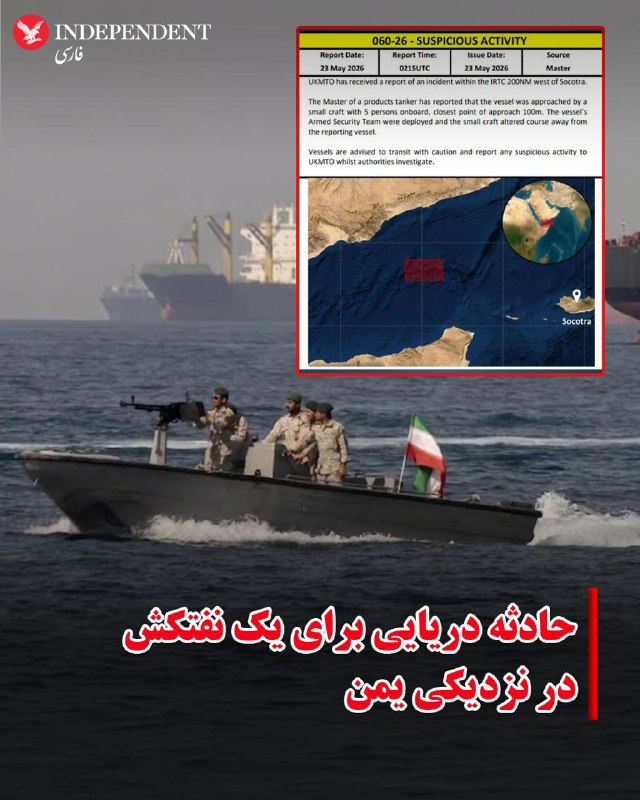

♦️سازمان عملیات تجارت دریایی بریتانیا (UKMTO) اعلام کرد یک قایق کوچک حامل پنج سرنشین به یک نفتکش حامل فرآورده‌های نفتی در غرب جزیره سقطری یمن نزدیک شده است.
بر اساس اعلام این نهاد، این نفتکش در فاصله حدود ۳۷۰ کیلومتری در غرب جزیره سقطری در حال حرکت بود که قایق مذکور به آن نزدیک شد.
سازمان عملیات تجارت دریایی بریتانیا افزود تیم امنیتی مسلح مستقر روی نفتکش وارد عمل شد و در پی آن، قایق مسیر خود را تغییر داد و از نفتکش دور شد.
جزئیات بیشتری درباره هویت افراد حاضر در قایق یا انگیزه نزدیک شدن آن‌ها منتشر نشده است.
‌🇸🇦 Indypersian

🤖 @VahidOOnLine

## VahidOOnLine — post 241647

  

♦️فیلد مارشال عاصم منیر، فرمانده ارتش پاکستان که برای رایزنی با مقام‌های جمهوری اسلامی ایران به تهران سفر کرده است، روز جمعه یکم خرداد ماه با عباس عراقچی دیدار کرد.

به گزارش کانال اطلاع‌رسانی وزارت امور خارجه در تلگرام، در این دیدار که «تا پاسی از شب ادامه داشت، طرفین درباره آخرین تلاشها و ابتکارات دیپلماتیک برای جلوگیری از تشدید تنش و خاتمه جنگ و همچنین راهکارهای تقویت صلح، ثبات و امنیت در منطقه غرب آسیا تبادل نظر کردند.»
فرمانده ارتش پاکستان، روز جمعه در جریان تلاش‌های اسلام‌آباد برای جلوگیری از جنگ و برقراری توافق میان تهران و واشگتن، وارد ایران شده است.
‌🇸🇦 Indypersian

🤖 @VahidOOnLine

## VahidOOnLine — post 241646

  

عراقچی و عاصم منیر، فرمانده ارتش پاکستان، در دیداری در تهران درباره آخرین تلاش‌های دیپلماتیک برای پایان جنگ ایران و مسائل امنیتی غرب آسیا گفت‌وگو کردند. منیر جمعه در چارچوب تلاش‌ها برای دستیابی به توافقی میان جمهوری اسلامی و آمریکا وارد تهران شد.
‌🏁 🇬🇧 IranintlTV

🤖 @VahidOOnLine

## VahidOOnLine — post 241645

  

شاهزاده رضا پهلوی در پیامی در ایکس با اشاره به دیدارش با دریک ون اوردن، عضو جمهوری‌خواه مجلس نمایندگان آمریکا، در کنگره، بر عزم خود برای ادامه رایزنی‌هایش در کنگره آمریکا درباره «طرح ایران آزاد» تاکید کرد.
شاهزاده پهلوی تاکید کرد «طرح ایران آزاد» می‌تواند پیامدهای مثبتی برای آمریکا و جهان داشته باشد.
او با انتشار تصاویری از دیدار خود با دریک ون اوردن گفت این قانون‌گذار آمریکایی از نزدیک با «رفتارهای جمهوری اسلامی علیه ایرانیان و آمریکایی‌ها» آشناست.

‌🏁 🇬🇧 IranintlTV

🤖 @VahidOOnLine

## VahidOOnLine — post 241644

♦️به گزارش رویترز، جمعه‌شب، اول خردادماه، بیست‌وسومین دوره جشنواره سالانه «ویوید سیدنی» آغاز شد و به‌رغم بارش شدید باران، سالن اپرای سیدنی و دیگر بناهای نمادین این شهر را غرق در رنگ و نور کرد. در شب افتتاحیه این رویداد، بادبان‌های اپرای سیدنی میزبان اثر گرافیکی هنرمند فرانسوی با الهام از حیات وحش بودند و هم‌زمان، نمای موزه هنرهای معاصر و ساختمان گمرک نیز با طرح‌های هندسی و الگوهای برگرفته از طبیعت سراسر جهان نورباران شدند. این جشنواره بزرگ هنر و فناوری که پایتخت ساحلی استرالیا را دگرگون کرده است، به مدت ۲۳ روز ادامه دارد و در ۲۳ خرداد (۱۳ ژوئن) به کار خود پایان می‌دهد.
‌🇸🇦 Indypersian

🤖 @VahidOOnLine

## VahidOOnLine — post 241643

  

♦️فیلم «تمرین‌هایی برای یک انقلاب» به کارگردانی پگاه آهنگرانی، بازیگر و فیلم‌ساز ایرانی، جایزه معتبر «چشم طلایی» (L'Oeil d'or) را به عنوان بهترین مستند هفتادونهمین دوره جشنواره فیلم کن از آن خود کرد. این مستند که به بررسی چندین دهه سرکوب سیاسی در ایران در قالب شش فصل از زندگی کارگردان می‌پردازد، توسط هیئت داورانی به ریاست مستیسلاف چرنوف، کارگردان برنده اسکار، از میان ۲۱ اثر انتخاب شد؛ هیئت داوران در بیانیه خود ساختار شاعرانه، فیلم‌نامه استادانه و روایت زنده و فوری فیلم از امواج خروشان تاریخ را ستودند. پگاه آهنگرانی هنگام دریافت این جایزه پنج هزار یورویی در حضور تیری فرمو، دبیر جشنواره، جایزه خود را به مردم ایران تقدیم کرد و در گفتگو با رسانه‌ها ابراز امیدواری کرد که این دستاورد بزرگ بتواند به دیده شدن هرچه بیشتر مبارزات مردم ایران برای آزادی و دموکراسی کمک کند.
‌🇸🇦 Indypersian

🤖 @VahidOOnLine

## VahidOOnLine — post 241642

♦️وزیر امور خارجه ایالات متحده روز شنبه، دوم خردادماه، در آغاز سفری رسمی وارد هند شد. مارکو روبیو که به همراه همسرش، جنت دوسدبس روبیو، مستقیم از سوئد و پس از شرکت در نشست وزرای ناتو در هلسینگبوری عازم هند شد، در فرودگاه مورد استقبال سرجیو گور، سفیر ایالات متحده در دهلی‌نو، قرار گرفت. به گزارش رویترز، بر اساس برنامه اعلام‌شده از سوی وزارت امور خارجه آمریکا، روبیو در ادامه این سفر چهار روزه عازم دهلی‌نو خواهد شد تا با نارندرا مودی، نخست‌وزیر هند، دیدار و گفتگو کند؛ ماموریتی کلیدی که هدف اصلی آن ترمیم روابط دوجانبه‌ای است که به دلیل سیاست‌های تعرفه‌ای دولت ترامپ و نزدیکی مجدد واشنگتن به رقبای دهلی‌نو یعنی پاکستان و چین، با چالشی جدی روبه‌رو شده است.
‌🇸🇦 Indypersian

🤖 @VahidOOnLine

## VahidOOnLine — post 241641

  

♦️سازمان هواپیمایی کشوری روز جمعه، با صدور اطلاعیه هوانوردی برای حریم هوایی ایران، اعلام کرد تمامی مجوزهای قبلی پروازهای مسافری در فرودگاه‌های بخش غربی منطقه اطلاعات پروازی تهران، از اول خرداد تا دوشنبه، چهارم خرداد‌، لغو شده و تنها هشت فرودگاه از جمله مهرآباد، خمینی، اصفهان و یزد مجاز به فعالیت هستند. براساس این تصمیم، این فرودگاه‌ها فقط از طلوع تا غروب آفتاب پذیرای پروازهای تجاری هستند و شرکت‌های هواپیمایی برای هرگونه پرواز باید مجوز جدید دریافت کنند.
‌🇸🇦 Indypersian

🤖 @VahidOOnLine

## VahidOOnLine — post 241640

♦️یک گاومیش «آلبینو» در بنگلادش به دلیل فرم خاص موهای طلایی، مورد توجه عمومی قرار گرفته و تصاویر آن در شبکه‌های اجتماعی بازتاب گسترده‌ای داشته است. به گزارش خبرگزاری فرانسه، مردم برای مشاهده این حیوان ۴ ساله به مزرعه‌ای در شهر «نارایان‌گانج» مراجعه می‌کنند. ضیاءالدین مریدا، مالک این گاومیش ۷۰۰ کیلویی، می‌گوید به دلیل شباهت مدل موی این گاومیش با رئیس‌جمهوری آمریکا، نام «دونالد ترامپ» برایش انتخاب شده است.
بر اساس این گزارش مالک این گاومیش اعلام کرد که هجوم بازدیدکنندگان و ازدحام جمعیت باعث شده است این حیوان دچار استرس شده و وزن کم کند؛ از این رو محدودیت‌هایی برای بازدید عمومی اعمال شده است. این گاومیش در روزهای آتی و همزمان با عید قربان ذبح خواهد شد.
‌🇸🇦 Indypersian

🤖 @VahidOOnLine

## VahidOOnLine — post 241639

  

حسن حسن‌زاده، فرمانده سپاه «محمد رسول‌الله» تهران بزرگ، از نهادهای اصلی مسئول سرکوب اعتراضات در پایتخت، در یک مصاحبه تلویزیونی گفت: «اگر احیانا دشمن اشتباه کند، نیروهای مسلح سخت‌تر از گذشته، دردناک‌تر از گذشته و سهمگین‌تر از گذشته پاسخ سخت و پشیمان‌کننده و تمام‌کننده می‌دهند.»
‌🏁 🇬🇧 IranintlTV

🤖 @VahidOOnLine

## WithYashar — post 12104

بزرگترین نمایشگاه هوایی نظامی بریتانیا لغو شد، زیرا گزارش شده است که از این فرودگاه برای ماموریت‌های مرتبط(احتمالا حمله) با ایران استفاده می‌شود.
@withyashar

## WithYashar — post 12103

از دیشب تا الان نخوابیدم سربازم الانم دارم میرم سر شیفتم جنگ قبلی ام توی شیفتم شروع شد اموزشیمم جنگ 12 روزه بود دعا کنین زنده برگردم 🥲💔😂

## WithYashar — post 12102

از دیشب تا الان نخوابیدم سربازم الانم دارم میرم سر شیفتم جنگ قبلی ام توی شیفتم شروع شد اموزشیمم جنگ 12 روزه بود دعا کنین زنده برگردم 🥲💔😂

## WithYashar — post 12101

  <a href="telegram/content/WithYashar_12101_1779515632.mp4" target="_blank">🎬 Download video</a>

ویدیو مربوطه … 😬
@withyashar

## WithYashar — post 12100

لارا لومر از معتمد ترین افراد نزد ترامپ ، خبر آماده شدن آمریکا برای حملات دوباره رو ریتوییت کرده.
@withyashar

## WithYashar — post 12099

پست دن اسکاوینو از مشاوران ترامپ در شبکه اجتماعی X @withyashar

## WithYashar — post 12098

  

پست دن اسکاوینو از مشاوران ترامپ در شبکه اجتماعی X
@withyashar

## WithYashar — post 12097

تمام کنفرانس های خبری کاخ سفید لغو شد
@withyashar

## mwarmonitor — post 9512

🔴اسرائیل برآورد می‌کند که در نهایت هیچ توافقی با ایران حاصل نخواهد شد و بر همین اساس، ارتش دفاعی اسرائیل (IDF) اکنون خود را طوری آماده می‌کند که گویی حمله‌ای قرار است در روزهای آینده انجام شود.— کانال ۱۲ اسرائیل

@mwarmonitor

## FoxNewsTwitter — post 342153

  <a href="telegram/content/FoxNewsTwitter_342153_1779515634.mp4" target="_blank">🎬 Download video</a>

Fox News (Twitter/X)

NEW VIDEO: Surveillance footage shows the moment a school bus carrying children crashes into a car at a busy Massachusetts intersection.

Officials say 11 children were on board the bus when the collision happened.

Nine children were taken to nearby hospitals for observation, but authorities say none of the injuries were serious.

The cause of the crash is under investigation.

## VahidOnline — post 75633

  

رسانه‌ها در ایران از دیدار فیلد مارشال عاصم منیر، فرمانده ارتش پاکستان با عباس عراقچی، وزیر امور خارجه ایران در شامگاه جمعه یکم خرداد خبر دادند.

بر اساس این خبر، دیدار این دو مقام تا پاسی از شب ادامه یافته و محور گفت‌وگوها «تلاش‌ها برای جلوگیری از تشدید تنش و خاتمه جنگ» و «راهکارهای تقویت صلح، ثبات و امنیت در منطقه غرب آسیا» بوده است.

جزئیات بیشتری از این دیدار منتشر نشده است.
@VahidHeadline

📡 @VahidOnline

## VahidOnline — post 75632

  

دولت دونالد ترامپ اعلام کرد که سیاست‌های مهاجرت به آمریکا تغییر می‌کند.

در یک تغییر اساسی در سیاست‌های مهاجرتی آمریکا، دولت این کشور اعلام کرد خارجی‌هایی که قصد دریافت اقامت دائم یا همان گرین کارت را دارند، باید خاک ایالات متحده را ترک و از طریق کنسولگری یا سفارت آمریکا اقدام نمایند.

زک کالر، سخنگوی دفتر مهاجرت دولت آمریکا، گفت که این سیاست «نیاز به یافتن و اخراج» کسانی را کاهش می‌دهد که درخواست اقامتشان رد شده است.

از سوی دیگر وکلای مهاجرت و گروه‌های امدادی می‌گویند که این تغییر احتمالا به «جدایی بیش‌ازپیش خانواده‌ها» منجر خواهد شد و قربانیان قاچاق انسان هم مجبور خواهند شد «به کشورهای خطرناکی بازگردند که از آن گریخته‌اند.»

این تغییر سیاست تازه‌ترین اقدام آقای ترامپ در محدود کرد مهاجرت به آمریکا است.
@VahidHeadline

📡 @VahidOnline

## IranIntlTV — post 338523

  <a href="telegram/content/IranIntlTV_338523_1779515637.mp4" target="_blank">🎬 Download video</a>

دیوان بین‌المللی دادگستری در یک رای مشورتی تایید کرد حق اعتصاب کارگران تحت پوشش و حمایت مقاوله‌نامه شماره ۸۷ سازمان بین‌المللی کار درباره آزادی انجمن و حمایت از حق تشکل‌یابی قرار دارد.
روزبه بوالهری، عضو تحریریه ایران‌اینترنشنال، گفت این رای می‌تواند شرایطی فراهم کند تا تشکل‌های کارگری حامی کارگران ایران، از طریق نهادهای بین‌المللی، جمهوری اسلامی را درباره حق تشکل‌یابی کارگران تحت فشار قرار دهند و علیه آن شکایت کنند.
@iranintltv

## IranIntlTV — post 338522

  <a href="telegram/content/IranIntlTV_338522_1779515638.mp4" target="_blank">🎬 Download video</a>

محمد قائدی، مدرس روابط بین‌الملل، گفت در صورت ازسرگیری حملات آمریکا، این بار بسیار گسترده‌تر و جدی‌تر خواهد بود و نقاطی در تنگه هرمز نیز هدف قرار خواهند گرفت. او درباره اهداف احتمالی اسرائیل در ایران نیز گفت زیرساخت‌هایی مانند صنایع پتروشیمی و چاه‌های نفتی می‌توانند در فهرست اهداف این کشور باشند.
@iranintltv

## IranIntlTV — post 338521

  <a href="telegram/content/IranIntlTV_338521_1779515640.mp4" target="_blank">🎬 Download video</a>

حکم دادگاه تجدیدنظر، کنگره سال ۲۰۲۳ حزب جمهوری‌خواه خلق، بزرگ‌ترین حزب مخالف دولت در ترکیه را باطل و اوزگور اوزل، رهبر این حزب را از سمتش برکنار کرد.
@iranintltv

## IranIntlTV — post 338520

  <a href="telegram/content/IranIntlTV_338520_1779515641.mp4" target="_blank">🎬 Download video</a>

سرخط خبرهای شنبه ۲ خرداد
@iranintltv

## IranIntlTV — post 338519

  

عراقچی و عاصم منیر، فرمانده ارتش پاکستان، در دیداری در تهران درباره آخرین تلاش‌های دیپلماتیک برای پایان جنگ ایران و مسائل امنیتی غرب آسیا گفت‌وگو کردند. منیر جمعه در چارچوب تلاش‌ها برای دستیابی به توافقی میان جمهوری اسلامی و آمریکا وارد تهران شد.
https://iranintl.com/202605235118

## IranIntlTV — post 338518

  

شاهزاده رضا پهلوی در پیامی در ایکس با اشاره به دیدارش با دریک ون اوردن، عضو جمهوری‌خواه مجلس نمایندگان آمریکا، در کنگره، بر عزم خود برای ادامه رایزنی‌هایش در کنگره آمریکا درباره «طرح ایران آزاد» تاکید کرد.
شاهزاده پهلوی تاکید کرد «طرح ایران آزاد» می‌تواند پیامدهای مثبتی برای آمریکا و جهان داشته باشد.
او با انتشار تصاویری از دیدار خود با دریک ون اوردن گفت این قانون‌گذار آمریکایی از نزدیک با «رفتارهای جمهوری اسلامی علیه ایرانیان و آمریکایی‌ها» آشناست.

https://iranintl.com/202605235387

## IranIntlTV — post 338517

  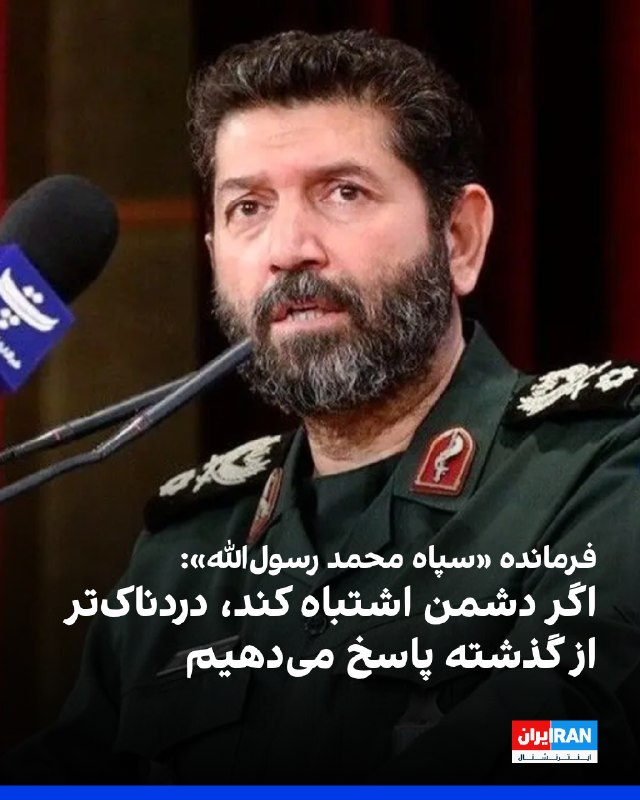

حسن حسن‌زاده، فرمانده سپاه «محمد رسول‌الله» تهران بزرگ، از نهادهای اصلی مسئول سرکوب اعتراضات در پایتخت، در یک مصاحبه تلویزیونی گفت: «اگر احیانا دشمن اشتباه کند، نیروهای مسلح سخت‌تر از گذشته، دردناک‌تر از گذشته و سهمگین‌تر از گذشته پاسخ سخت و پشیمان‌کننده و تمام‌کننده می‌دهند.»
https://iranintl.com/202605235001

## FarsiVOA — post 218407

  

سازمان عملیات تجارت دریایی بریتانیا اعلام کرد گزارشی تازه درباره «فعالیت مشکوک» علیه یک تانکر حامل فرآورده‌های نفتی در کریدور بین‌المللی کشتیرانی در مسیر خلیج عدن دریافت کرده است.

بر اساس این گزارش کاپیتان کشتی اعلام کرده یک قایق کوچک با پنج سرنشین به این تانکر نزدیک شده و فاصله آن در نزدیک‌ترین نقطه به حدود ۱۰۰ متر رسیده است.

به گفته این نهاد، تیم امنیتی مسلح کشتی مستقر شد و قایق پس از آن مسیر خود را تغییر داد و از شناور فاصله گرفت.

این دومین گزارش مشابه در دو روز اخیر در آب‌های نزدیک یمن است و در شرایطی منتشر می‌شود که ناامنی مسیرهای کشتیرانی اطراف خلیج عدن و دریای سرخ همچنان نگرانی شرکت‌های حمل‌ونقل را افزایش داده است.
@FarsiVOA

## FarsiVOA — post 218406

  

مارکو روبیو، وزیر خارجه آمریکا، روز شنبه در آغاز سفری چهارروزه وارد هند شد؛ سفری که به گزارش رویترز، نشانه تلاش واشنگتن برای ترمیم روابط با دهلی‌نو پس از ماه‌ها تنش تجاری و دیپلماتیک است.

بر اساس این گزارش، تعرفه‌های دولت دونالد ترامپ، نبود توافق تجاری جامع و هم‌زمانی تلاش آمریکا برای نزدیکی به پاکستان و چین، روابط واشنگتن و دهلی‌نو را تحت فشار قرار داده است.

روبیو قرار است در جریان این سفر به کلکته، آگرا، جیپور و دهلی‌نو برود و درباره تجارت، انرژی و همکاری‌های دفاعی گفت‌وگو کند.

رویترز می‌نویسد آمریکا سال‌هاست هند را وزنه‌ای مهم در برابر نفوذ چین و روسیه در منطقه هند-اقیانوس آرام می‌داند، اما اختلاف‌های اخیر این مسیر را پیچیده‌تر کرده است.

دهلی نو خواستار سفر ترامپ به هند همزمان با اجلاس گروه چهار شامل ایالات متحده، هند، ژاپن و استرالیا شده است، اما تحلیلگران می‌گویند این سفر به دلیل تنش‌های تجاری و عوامل دیگر از جمله جنگ ایالات متحده و اسرائیل با جمهوری اسلامی، به تعویق افتاده است.
@FarsiVOA

## FarsiVOA — post 218405

🔺گزارش نیویورک تایمز از اهداف احتمالی در صورت آغاز دوباره کارزار نظامی آمریکا علیه جمهوری اسلامی

◾️نیویورک تایمز جمعه شب در گزارشی نوشت که دونالد ترامپ، رئیس‌جمهوری آمریکا، صبح این روز (۱ خرداد) به همراه وزیر جنگ خود، پیت هگست، در دفتر بیضی کاخ سفید حضور داشت.

⬇️ بیشتر بخوانید:
https://ir.voanews.com/a/8153014.html
@FarsiVOA

## Persian_Trend_Official — post 14716

  <a href="telegram/content/Persian_Trend_Official_14716_1779515644.mp4" target="_blank">🎬 Download video</a>

دن اسکاوینو معاون رئیس دفتر کاخ سفید و دستیار ترامپ،ویدیویی از بمب‌افکن‌های مخفی‌کار B-2 را بدون هیچ زمینه‌ای منتشر کرد،

فکت مهم:
آخرین باری که او این پست را منتشر کرد،
چند ساعت بعد آمریکا و اسرائیل به ایران حمله کردند.

👩‍💻@PhantomDirective

🆔@persian_trend_official
پرشین ترند | متفاوت‌ترین کانال نظامی

## Persian_Trend_Official — post 14715

  <a href="telegram/content/Persian_Trend_Official_14715_1779515645.webm" target="_blank">🎬 Download video</a>

بولتن خبری۲۴ ساعت گذشته
آرشیو تحریریه پرشین ترند.

۲ خرداد ۱۴۰۵

🇮🇷ایران

◾️ فرمانده ارتش پاکستان، ژنرال عاصم منیر، وارد تهران شد و با عراقچی وزیر خارجه ایران تا پاسی از شب دیدار و گفتگو کرد

◾️ وزیر کشور پاکستان نیز برای سومین روز متوالی در تهران حضور داشت و پیش از ورود فرمانده ارتش، پایتخت را ترک کرد

◾️ سخنگوی وزارت خارجه: تمرکز مذاکرات بر خاتمه جنگ در همه جبهه‌هاست؛ مباحث هسته‌ای در این مرحله مورد بحث نیست

◾️ سخنگوی وزارت خارجه: اختلاف‌نظرها بین ایران و آمریکا آن‌قدر عمیق است که نمی‌توان گفت ظرف چند هفته باید به نتیجه رسید

◾️ سخنگوی هیئت مذاکره‌کننده: میانجی اصلی مذاکرات پاکستان است؛ هیئت قطری نیز برای رایزنی به تهران آمد و سپس پایتخت را ترک کرد

◾️ منبع نزدیک به تیم مذاکره‌کننده: پیشرفت‌هایی در برخی موضوعات حاصل شده اما تا جمع‌بندی همه موضوعات توافقی رخ نخواهد داد

◾️ ایران پیشنهاد جدید آمریکا را دریافت کرده و در حال بررسی آن است؛ ایران تأکید کرد چندین دور ارتباط بر اساس چارچوب ۱۴ ماده‌ای ایران انجام شده

◾️ ایران بخشی از حریم هوایی غرب کشور را برای پروازهای شبانه تا روز دوشنبه بست

◾️ نیروی دریایی سپاه: ۳۵ فروند کشتی تجاری در شبانه‌روز گذشته با هماهنگی و مجوز سپاه از تنگه هرمز عبور کردند

◾️ اختلالات گسترده GPS در تنگه هرمز، سواحل جنوبی ایران، امارات، قطر و کویت گزارش شده است

◾️ نیروهای مسلح جمهوری اسلامی در بالاترین سطح آماده‌باش قرار گرفته‌اند؛ فعالیت بالای جنگنده‌ها بر فراز کردستان عراق و غرب ایران ثبت شده

◾️ حمید رسایی مدعی شد مجلس توسط دبیر شورای امنیت ملی عملاً پلمب شده و جلسات صحن علنی برگزار نمی‌شود

🇮🇱 اسرائیل و خاورمیانه

◾️ العربیه: توافق احتمالی ایران و آمریکا «بیانیه اسلام‌آباد» نامگذاری خواهد شد و شامل آغاز مذاکرات درباره مسائل حل‌نشده ظرف ۷ روز و لغو تدریجی تحریم‌ها خواهد بود

◾️ بلومبرگ: امارات، عربستان و قطر از ترامپ خواسته‌اند به جای اقدام نظامی، به دیپلماسی با ایران فرصت دهد

◾️ امارات ظرفیت خط لوله انتقال نفت به بندر فجیره برای دور زدن تنگه هرمز را تا ۲۰۲۷ دو برابر می‌کند

◾️ مدیر اجرایی آژانس بین‌المللی انرژی هشدار داد بازار نفت تا تابستان با کاهش ذخایر وارد «منطقه قرمز» می‌شود؛ قیمت نفت برنت در حال حاضر حدود ۱۰۷ دلار در هر بشکه معامله می‌شود

◾️ FBI رهبر حزب‌الله عراق، محمدباقر السعدی، را به اتهام هماهنگی حداقل ۲۰ حمله تروریستی در اروپا و کانادا بازداشت کرد

◾️ اسرائیل از تلاش‌های ترامپ برای امضای توافق با ایران خشمگین است؛ تماس تلفنی «دراماتیک» میان ترامپ و نتانیاهو گزارش شده

◾️ تحلیلگران از احتمال بستن تنگه باب‌المندب توسط انصارالله و حملات به زیرساخت‌های انرژی عربستان در صورت بازگشت جنگ هشدار دادند

◾️ گزارش‌هایی از وقوع انفجار در ابوظبی منتشر شد؛ جزئیات تأیید نشده است

🇺🇸
🗺آمریکا و جهان

◾️ ترامپ: مذاکرات در «مراحل نهایی» است اما اگر توافق نشود «اوضاع می‌تواند کمی ناخوشایند شود»؛ آمریکا حاضر است چند روز بیشتر منتظر «پاسخ‌های درست» از تهران بماند

◾️ روبیو: پیشرفت‌هایی در مذاکرات با ایران حاصل شده؛ موضوع غنی‌سازی اورانیوم و تنگه هرمز همچنان محل اختلاف است

◾️ آکسیوس: ترامپ با مشاوران ارشد امنیت ملی برای بررسی احتمال حملات نظامی جدید علیه ایران دیدار کرده؛ تصمیم نهایی اتخاذ نشده؛ ترامپ اواخر هفته گذشته یک حمله برنامه‌ریزی‌شده را پس از درخواست قطر، عربستان و امارات متوقف کرد

◾️ سی بی اس: چندین عضو ارتش و جامعه اطلاعاتی آمریکا تعطیلات Memorial Da. را لغو کرده‌اند

◾️ وال‌استریت ژورنال: واسطه‌ها در تلاش برای یک توافق موقت هستند؛ هدف تمدید آتش‌بس و ادامه مذاکرات گسترده‌تر است؛ در صورت شکست مذاکرات آمریکا و اسرائیل احتمالاً زیرساخت‌های انرژی ایران را هدف قرار می‌دهند

◾️ سی‌ان‌ان: آمریکا پیشنهاد اقتصادی بزرگی شامل لغو تمام تحریم‌ها و طرح بازسازی اقتصادی به ایران ارائه داده؛ مسائل دشوار به مذاکرات بعدی موکول می‌شود

◾️ گاردین: پاکستان در تلاش است چین را به عنوان ضامن هرگونه توافق وارد کند؛ نخست‌وزیر شریف راهی پکن می‌شود

◾️ تولسی گابارد، مدیر اطلاعات ملی آمریکا که از مخالفان جنگ با ایران بود، استعفای خود را از ۳۰ ژوئن اعلام کرد

◾️ بلومبرگ: ایران بیش از ۲۴ پهپاد MQ-9 آمریکا به ارزش نزدیک به یک میلیارد دلار را از ابتدای جنگ منهدم کرده؛ این رقم حدود ۲۰ درصد از موجودی پیش از جنگ پنتاگون است

◾️ ناتو: دبیرکل مارک روته اعلام کرد ناتو می‌تواند به آمریکا در بازگشایی تنگه هرمز کمک کند.

👩‍💻@PhantomDirective

🆔 @persian_trend_official
پرشین ترند | متفاوت‌ترین کانال نظامی

## Persian_Trend_Official — post 14714

🔴مدیرکل فرودگاه‌های خوزستان: پروازهای فرودگاه‌های اهواز و ماهشهر از سر گرفته شد

🔹اولین پرواز مسیر تهران به اهواز، امروز در فرودگاه اهواز به زمین نشست. برنامۀ پروازی به‌تدریج افزایش خواهد یافت.

🫆:Tony

📌 @persian_trend_official
پرشین ترند | متفاوت‌ترین کانال نظامی

## Persian_Trend_Official — post 14713

  

🔴دیدار و گفتگوی فرمانده ارتش پاکستان با عراقچی در تهران

💢فیلد مارشال عاصم منیر که به‌منظور رایزنی و تبادل نظر با مقام‌های جمهوری اسلامی به تهران سفر کرده است، روز گذشته با عراقچی دیدار و گفتگو کرد.

💢در این دیدار که تا پاسی از شب ادامه داشت، طرفین درباره آخرین تلاش‌ها و ابتکارات دیپلماتیک برای جلوگیری از تشدید تنش و خاتمه جنگ آمریکا و اسرائیل علیه جمهوری اسلامی و همچنین راهکارهای تقویت صلح، ثبات و امنیت در منطقه غرب آسیا تبادل نظر کردند.
🫆:Tony

📌 @persian_trend_official
پرشین ترند | متفاوت‌ترین کانال نظامی

## Persian_Trend_Official — post 14712

  

💢وقوع حادثه برای یک نفتکش نزدیک یمن

💢سازمان عملیات دریایی انگلیس امروز از دریافت گزارش‌هایی درباره حادثه امنیتی برای یک فروند نفتکش در آب‌های نزدیک جزیره «سقطری» خبر داد.

💢ناخدا یک نفتکش گزارش داده که کشتی توسط یک قایق کوچک حامل ۵ نفر در فاصله ۲۰۰ مایل دریایی غرب سوکوترا مورد قرار گرفته است. نزدیک‌ترین فاصله ۱۰۰ متر بوده.

💢تیم امنیت مسلح کشتی مستقر شد و قایق کوچک مسیر خود را تغییر داد و دور شد.

🫆:Tony

📌 @persian_trend_official
پرشین ترند | متفاوت‌ترین کانال نظامی

## Persian_Trend_Official — post 14711

  <a href="telegram/content/Persian_Trend_Official_14711_1779515647.webm" target="_blank">🎬 Download video</a>

تولسی گابارد رئیس اطلاعات ملی ايالات متحده آمریکا که دیروز استعفا داد. 📌 @persian_trend_official پرشین ترند | متفاوت‌ترین کانال نظامی

## Persian_Trend_Official — post 14710

  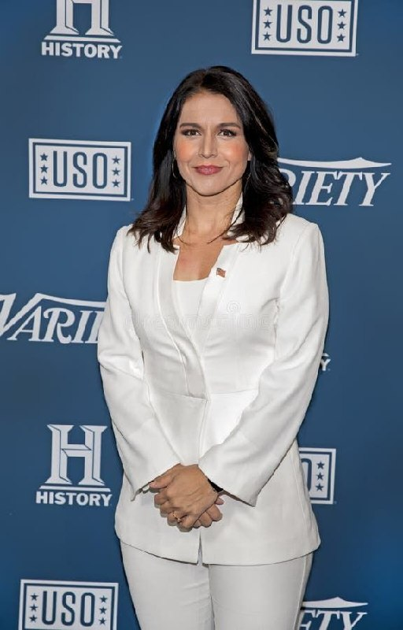

تولسی گابارد رئیس اطلاعات ملی ايالات متحده آمریکا که دیروز استعفا داد.

📌 @persian_trend_official
پرشین ترند | متفاوت‌ترین کانال نظامی

## Persian_Trend_Official — post 14709

  

نسخه اسپاتیفای لایو دیشب :
https://open.spotify.com/episode/70QUNKnopM1uSLbBaXBi39?si=HwP7TUp5R22jaAYdynjUtw

## Persian_Trend_Official — post 14707

  <a href="telegram/content/Persian_Trend_Official_14707_1779515648.mp4" target="_blank">🎬 Download video</a>

🤑
🚀 انفجار مگاروکت اسپیس‌ایکس هنگام فرود
❌

دلیل اینکه این انفجارها زیاد دیده می‌شوند این است که اسپیس‌ایکس برخلاف روش سنتی ناسا، موشک‌ها را سریع آزمایش می‌کند، حتی اگر احتمال شکست بالا باشد؛ چون هدفش این است که با هر انفجار، داده جمع کند و طراحی را بهتر کند.

👩‍💻:@PhantomDirective

🆔:@persian_trend_official
پرشین ترند | متفاوت‌ترین کانال نظامی

## Persian_Trend_Official — post 14706

  

🔴نیویورک پست

♦️تبعه عراقی آموزش‌دیده سپاه می‌خواست ایوانکا ترامپ را به تلافی کشته‌شدن قاسم سلیمانی ترور کند

💢روزنامه «نیویورک‌پست» به نقل از منابع آگاه افشا کرد که ایوانکا ترامپ، دختر ۴۴ ساله دونالد ترامپ، هدف یک طرح ترور پیچیده از سوی یک تروریست تحت آموزش سپاه پاسداران انقلاب اسلامی قرار گرفته که با انگیزه انتقام‌جویی از کشته شدن قاسم سلیمانی طراحی شده بود.

💢بر اساس این گزارش، متهم که یک تبعه عراقی ۳۲ ساله به نام «محمد باقر سعد داوود الساعدی» است و به تازگی دستگیر شده، عهد کرده بود برای «به آتش کشیدن خانه ترامپ»، دختر رئیس‌جمهوری آمریکا را به قتل برساند.

🫆:Tony

📌 @persian_trend_official
پرشین ترند | متفاوت‌ترین کانال نظامی

## Persian_Trend_Official — post 14705

  <a href="telegram/content/Persian_Trend_Official_14705_1779515654.mp4" target="_blank">🎬 Download video</a>

صبحتون‌ بخیر ☕️🔥

📝 Nick
📌 @persian_trend_official
پرشین ترند | متفاوت‌ترین کانال نظامی

## RadioFarda — post 157468

🔸ویدئویی در رسانه‌های اجتماعی به اشتراک گذاشته شده که لحظه‌ حمله هوایی اسرائیل به امدادگران و یک آمبولانس را در دیر قانون‌ النهر در جنوب لبنان در روز جمعه یکم خرداد نشان می‌دهد.

🔸این حمله زمانی واقع شده که این امدادگران در حال بررسی اجساد قربانیان حمله هوایی قبل اسرائیل در منطقه بودند.

🔸خبرگزاری ملی لبنان اعلام کرد که شش نفر ازجمله دو امدادگر که در حال انتقال مجروحان بودند، در حمله هوایی اسرائیل به دیر قانون کشته شده‌اند.

@RadioFarda

## RadioFarda — post 157467

  

🔸شبکه سی‌بی‌اس در آمریکا بامداد شنبه دوم خرداد خبر داد که دولت دونالد ترامپ برای انجام دور تازه‌ای از حملات علیه ایران آماده می‌شود.

🔸این شبکه خبری به نقل از منابعی که به نام‌شان اشاره نکرد نوشت که تدارکات و آمادگی برای انجام حملات تازه روز جمعه انجام شده است.

🔸با این حال در این خبر آمده است که تا بعدازظهر روز جمعه به وقت آمریکا برای انجام قطعی حمله دوباره به خاک ایران تصمیمی گرفته نشده است.

🔸همزمان یک خبرنگار روزنامه آمریکایی وال استریت جورنال در گزارشی نوشت که رئیس جمهور آمریکا به همراه مشاورانش در زمینه امنیت ملی در ساعات پایانی روز جمعه جلسه‌ای داشته، اما تصمیمی قطعی در این جلسه گرفته نشده است.

🔸به نوشته این خبرنگار از کاخ سفید، ترامپ در جلسه موافق بوده است که دیپلماسی نیاز به زمان بیشتری دارد، و در عین حال مسئله بازگشت به جنگ نیز هم‌چنان روی میز است.

🔸پیشتر اسماعیل بقایی همین نکته را گفته بود: «اختلاف‌نظرها بین ایران و آمریکا آن‌قدر عمیق و زیاد است که نمی‌شود گفت با چندبار رفت‌وآمد یا مذاکرات ظرف چند هفته ما باید حتماً به نتیجه برسیم.»

@RadioFarda

## RadioFarda — post 157466

  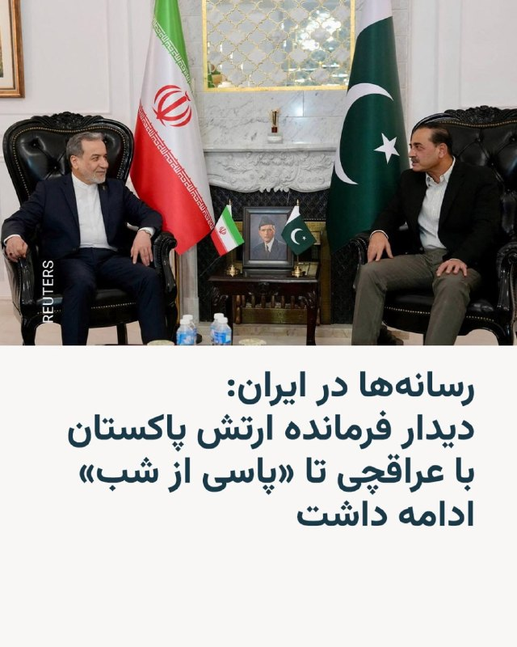

🔸رسانه‌ها در ایران از دیدار فیلد مارشال عاصم منیر، فرمانده ارتش پاکستان با عباس عراقچی، وزیر امور خارجه ایران در شامگاه شنبه یکم خرداد خبر دادند.

🔸بر اساس این خبر، دیدار این دو مقام تا پاسی از شب ادامه یافته و محور گفت‌وگوها «تلاش‌ها برای جلوگیری از تشدید تنش و خاتمه جنگ» و «راهکارهای تقویت صلح، ثبات و امنیت در منطقه غرب آسیا» بوده است.

🔸جزئیات بیشتری از این دیدار منتشر نشده است.

🔸برخی رسانه‌ها پیش از این، سفر عاصم منیر به تهران را نشانه «پیشرفت» مذاکرات دانسته بودند. در همین حال وزیر خارجه آمریکا نیز از برخی پیشرفت‌ها در گفت‌وگوهای آمریکا و ایران خبر داده و در عین حال افزوده بود که هنوز توافق نهایی نشده است.

🔸پاکستان از زمان برقراری آتش‌بس بعد از ۴۰ روز جنگ آمریکا و اسرائیل با ایران، در نقش میانجی ظاهر شده است.

@RadioFarda

## RadioFarda — post 157465

  <a href="https://t.me/radiofarda/157465" target="_blank">📎 Download file</a>

📻بشنوید: سرخط خبرها با رادیوفردا، دوم خرداد ۱۴۰۵‌

@RadioFarda

## IranianMinds — post 20582

  

وضعیت رسانه ها :

@IranianMinds

## BBCPersian — post 281844

🔻سازمان هواپیمایی ایران: فرودگاه‌های اهواز و ماهشهر از امروز بازگشایی می‌شود

سازمان هواپیمایی ایران اعلام‌کرد که فرودگاه‌های اهواز و ماهشهر از امروز شنبه، ۲ خرداد بازگشایی می‌شوند.

روابط عمومی این سازمان می‌گوید که با «تکمیل موفقیت‌آمیز فرآیند ارزیابی‌ها، این دو فرودگاه به چرخه عملیاتی کشور بازخواهند گشت و تمامی شرکت‌های هواپیمایی می‌توانند پروازهای عادی خود را در این مسیرها از سر بگیرند.»

دو روز پیش حمدرضا موالی‌زاده استاندار خوزستان گفته بود که مجوز نهایی برای عملیاتی شدن مجدد فرودگاه بین‌المللی اهواز، صادر شده است.

آقای موالی‌زاده همچنین گفت که با تلاش مدیریت فرودگاه‌های استان و تیم‌های فنی، تمامی آسیب‌های ناشی از حملات هوایی آمریکا و اسرائیل «به سرعت بازسازی، تعمیر و ایمن‌سازی شده است.»

این سازمان ابراز امیدواری کرده است که «پس از ارزیابی امنیتی و ایمنی به تدریج سایر فرودگاه‌های ایران نیز به چرخه عملیاتی» اضافه شوند.

https://bbc.in/4tP59vG
@BBCPersian

## BBCPersian — post 281843

  

🔻فیلد مارشال عاصم منیر، فرمانده ارتش پاکستان که به تهران سفر کرده با عباس عراقچی، وزیر خارجه ایران دیدار و گفتگو کرده است.

به گزارش منابع خبری در ایران در این گفت‌‌گوها که تا پاسی از شب گذشته ادامه داشت، دو طرف درباره آخرین تلاش‌های دیپلماتیک برای خاتمه جنگ و همچنین درباره راه‌های تقویت صلح و امنیت در منطقه غرب آسیا گفت‌و‌گو کردند.

این دومین سفر آقای منیر در چند هفته گذشته به ایران است.

وزیر کشور پاکستان هم برای دومین بار در چند روز گذشته به تهران رفته و در حال گفت‌وگو با مقامات ایرانی است.

📸TASNIM
https://bbc.in/4fCcg7e
@BBCPersian

## BBCPersian — post 281842

🔻بر اساس سندی داخلی که رویترز مشاهده کرده، از زمان آغاز جنگ ایران، ۲۷ کشور اقدام‌هایی را برای دسترسی سریع به منابع مالی موجود در برنامه‌های بانک جهانی آغاز کرده‌اند تا بتوانند با پیامدهای بحران مقابله کنند.

این سند نام کشورها یا میزان دقیق منابع مالی درخواستی را ذکر نکرده و بانک جهانی نیز از اظهارنظر در این باره خودداری کرده است.

بر اساس این گزارش، سه کشور از زمان آغاز درگیری‌ها در ۲۸ فوریه ابزارهای جدید مالی را تصویب کرده‌اند و بقیه کشورها همچنان در حال تکمیل روند اداری هستند.

جنگ و اختلال ناشی از آن در بازار جهانی انرژی، زنجیره‌های تامین را تحت فشار قرار داده و مانع ارسال محموله‌های حیاتی کود شیمیایی به کشورهای در حال توسعه شده است.

مقام‌های کنیا و عراق تایید کرده‌اند که برای مقابله با پیامدهای جنگ، از جمله افزایش شدید قیمت سوخت در کنیا و کاهش گسترده درآمدهای نفتی عراق، به دنبال دریافت حمایت مالی فوری از بانک جهانی هستند.

این ۲۷ کشور بخشی از ۱۰۱ کشوری هستند که به نوعی از سازوکارهای تامین مالی اضطراری بانک جهانی دسترسی دارند؛ از جمله ۵۴ کشوری که به برنامه «واکنش سریع» پیوسته‌اند و می‌توانند تا ۱۰ درصد منابع مالی تخصیص‌نیافته خود را در شرایط بحران استفاده کنند.

آجی بانگا، رئیس بانک جهانی، ماه گذشته گفته بود ابزارهای بحران این نهاد امکان دسترسی کشورها به حدود ۲۰ تا ۲۵ میلیارد دلار منابع مالی را فراهم می‌کند.

او افزود که بانک جهانی می‌تواند با تغییر اولویت بخشی از پروژه‌های خود، این رقم را طی شش ماه به ۶۰ میلیارد دلار و در بلندمدت به حدود ۱۰۰ میلیارد دلار برساند.

در همان زمان، کریستالینا جورجیوا، رئیس صندوق بین‌المللی پول، گفته بود که انتظار دارد تا حدود ۱۲ کشور برای دریافت ۲۰ تا ۵۰ میلیارد دلار کمک فوری درخواست بدهند، اما به گفته سه منبع آگاه، تاکنون درخواست‌های اندکی ثبت شده است.

https://bbc.in/4dAln5O
@BBCPersian

## BBCPersian — post 281841

🔻مارکو روبیو، وزیر خارجه آمریکا، امروز برای سفری چهارروزه وارد هند می‌شود؛ سفری که در بحبوحه بحران جهانی انرژی ناشی از جنگ ایران انجام می‌شود.

انتقال انرژی از طریق تنگه هرمز تقریبا متوقف شده است، آبراه باریکی که پس از حملات اسرائیل و آمریکا به ایران به کانون تنش تبدیل شده است.

ایران از بسته شدن این تنگه به‌عنوان اهرم فشار در مذاکرات شکننده صلح با آمریکا استفاده کرده است.

هند که بیش از ۸۰ درصد نیاز انرژی خود را وارد می‌کند، از جمله کشورهایی است که بیشترین آسیب را دیده‌اند؛ زیرا زندگی روزمره جمعیت بیش از یک میلیارد و ۴۰۰ میلیون نفری آن به واردات سوخت، از جمله گاز مایع و فرآورده‌های نفتی، وابسته است.

پیشتر آقای روبیو به چالش‌های پیش‌روی سومین اقتصاد بزرگ آسیا اشاره کرد و گفت: «ما می‌خواهیم هر میزان انرژی که هند مایل به خرید آن باشد، به آن کشور بفروشیم. همان‌طور که می‌بینید، تولید و صادرات انرژی آمریکا در سطوح تاریخی قرار دارد.»

در دهلی‌نو نیز تمایل برای افزایش واردات انرژی از آمریکا وجود دارد چراکه این موضوع می‌تواند به کاهش مازاد تجاری هند با آمریکا کمک کند، مسئله‌ای که همواره موجب نارضایتی دونالد ترامپ بوده است.

کسری تجاری آمریکا با هند در سال ۲۰۲۵ به ۵۸ میلیارد و ۲۰۰ میلیون دلار رسید که نسبت به سال قبل ۲۷/۱ درصد افزایش نشان می‌دهد.

با این حال، کارشناسان می‌گویند که جایگزینی کمبود فعلی انرژی هند با واردات از آمریکا راه‌حل ساده‌ای نیست چون که انتقال انرژی از آمریکا به هند طولانی‌تر و پرهزینه‌تر است و از نظر اقتصادی نیز چندان منطقی به نظر نمی‌رسد.

https://bbc.in/4dAln5O
@BBCPersian

## BBCPersian — post 281839

  

🔻دولت دونالد ترامپ اعلام کرد که سیاست‌های مهاجرت به آمریکا تغییر می‌کند.

در یک تغییر اساسی در سیاست‌های مهاجرتی آمریکا، دولت این کشور اعلام کرد خارجی‌هایی که قصد دریافت اقامت دائم یا همان گرین کارت را دارند، باید خاک ایالات متحده را ترک و از طریق کنسولگری یا سفارت آمریکا اقدام نمایند.

زک کالر، سخنگوی دفتر مهاجرت دولت آمریکا، گفت که این سیاست «نیاز به یافتن و اخراج» کسانی را کاهش می‌دهد که درخواست اقامتشان رد شده است.

از سوی دیگر وکلای مهاجرت و گروه‌های امدادی می‌گویند که این تغییر احتمالا به «جدایی بیش‌ازپیش خانواده‌ها» منجر خواهد شد و قربانیان قاچاق انسان هم مجبور خواهند شد «به کشورهای خطرناکی بازگردند که از آن گریخته‌اند.»

این تغییر سیاست تازه‌ترین اقدام آقای ترامپ در محدود کرد مهاجرت به آمریکا است.

📷Getty Images
@BBCPersian

## BBCPersian — post 281838

  

🔻جامعه جهانی بهائی در اطلاعیه‌ای از وضعیت سلامت بشری مصطفوی، زن باردار بهائی از شهر رفسنجان که «از زمان آغاز اعتراضات دی‌‎ماه» دستگیر و زندانی شد، ابراز نگرانی کرده است.

گفته می‌شود که مقام‌های قضایی ایران با درخواست‌های او برای دسترسی به مراقبت‌های پزشکی ضروری، از جمله آزمایش‌های حیاتی دوران بارداری، مخالفت کرده‌اند.

در اطلاعیه جامعه جهانی بهائی از جمله آمده است که خانم مصطفوی «یکی از حدود ۸۰ بهائی است که طی ماه‌های اخیر، همزمان با تشدید کارزار بی‌رحمانه جمهوری اسلامی برای آزار و سرکوب این اقلیت دینی، بازداشت و زندانی شده‌اند.»

جامعه جهانی بهائی می‌گوید که تاکنون بیش از ۴۰۰ مورد نقض حقوق بشر با حمایت حکومت ایران علیه بهائیان در سراسر آن کشور را گزارش کرده است؛ «مواردی از قبیل دستگیری‌ها و بازداشت‌ها، یورش‌های خشونت‌آمیز به منازل، مصادره غیرقانونی اموال و ممانعت از اجرای عدالت از سوی مقامات قضائی ایران.»

📷 BahaiDE
https://bbc.in/4dsL61e
@BBCPersian

## BBCPersian — post 281828

🖋برند دبوسمن جونیور
خبرنگار کاخ سفید

آمریکا، رائول کاسترو، رئیس‌جمهور سابق ۹۴ ساله کوبا را به قتل متهم کرده است؛ اقدامی که گمانه‌زنی‌ها را درباره این ‌که آیا هاوانا مقصد بعدی فهرست تغییر رژیم واشنگتن خواهد بود یا نه، افزایش داده است.

در بحبوحه کارزار «فشار حداکثری» که شدیدترین کمبودهای سوخت و انرژی کوبا در چند دهه اخیر را رقم زده است، شماری از مقام‌های آمریکایی به شکل مداوم خواستار پایان دادن به حکومت کمونیستی ۶۶ ساله این جزیره شده‌اند.

در حالی که دونالد ترامپ، رئیس‌جمهور آمریکا، گفته است معتقد است نیازی به «تشدید تنش» نخواهد بود، کاخ سفید نیز تاکید کرده که وجود یک «دولت سرکش» در نزدیکی سواحل آمریکا را تحمل نخواهد کرد.

این ‌که در ادامه چه رخ خواهد داد، برای هیچ ‌کس روشن نیست؛ فروپاشی اقتصادی، آشوب داخلی یا مداخله نظامی آمریکا. در ادامه سه سناریوی احتمالی بررسی می‌شود.

آلبوم را ورق بزنید و ادامه مطلب را از لینک زیر در وبسایت بی‌بی‌سی فارسی بخوانید.

📸GettyImages/ Reuters/ Anadolu via Getty Images/ EPA/Shutterstock/ AFP via Getty Images/ Bloomberg via Getty Images
https://bbc.in/43oAVVv
@BBCPersian

## Dirty_Kids — post 389992

  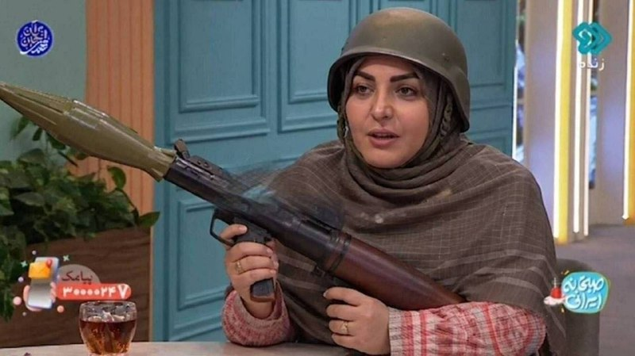

المیرا کصو

@Dirty_Kids 👻

## Dirty_Kids — post 389988

  <a href="telegram/content/Dirty_Kids_389988_1779515658.mp4" target="_blank">🎬 Download video</a>

یه چالش دیگه‌ای که جدیدا مد شده ولی در راستای همون چالش قبلی روسی یعنی «Booty transition» قرار داره؛

اینطوریه که مردم با آهنگ «Set me free» میان از خودشون فیلم میگیرن و یهو دوربین رو میبرن سمت باسن🍑 مبارکشون و ادامه ماجرا…

@Dirty_Kids 👻

## alonews — post 121922

  <a href="telegram/content/alonews_121922_1779515659.webm" target="_blank">🎬 Download video</a>

👈روبیو وارد هند شد

✅ @AloNews خبر جنگ

## alonews — post 121920

  <a href="telegram/content/alonews_121920_1779515659.webm" target="_blank">🎬 Download video</a>

👈محمدباقر السعدی، فرمانده ارشد گردان‌های حزب‌الله عراق، قصد داشت به ایوانکا ترامپ، دختر رئیس‌جمهور آمریکا برای انتقام ترور قاسم سلیمانی حمله کند. او نقشه خانه ایوانکا در فلوریدا را در اختیار داشت. السعدی اخیراً در ترکیه بازداشت شده و در آمریکا علیه او کیفرخواست صادر شده است

✅ @AloNews خبر جنگ

## alonews — post 121919

  <a href="telegram/content/alonews_121919_1779515660.webm" target="_blank">🎬 Download video</a>

👈ایران با صدور اطلاعیه‌ای، پرواز در بخش غربی حریم هوایی خود را تا صبح دوشنبه ممنوع اعلام کرد

✅ @AloNews خبر جنگ

## alonews — post 121918

  <a href="telegram/content/alonews_121918_1779515660.webm" target="_blank">🎬 Download video</a>

👈گفت وگوی تلفنی عراقچی با وزیران خارجه ترکیه، قطر و عراق

✅ @AloNews خبر جنگ

## alonews — post 121917

  <a href="telegram/content/alonews_121917_1779515660.webm" target="_blank">🎬 Download video</a>

👈سازمان ملل خواستار پاسخگویی درباره رفتار تحقیرآمیز با فعالان کاروان غزه شد

✅ @AloNews خبر جنگ

## alonews — post 121916

  <a href="telegram/content/alonews_121916_1779515660.webm" target="_blank">🎬 Download video</a>

👈عراقچی و فرمانده ارتش پاکستان با هم تو تهران دیدار کردن

✅ @AloNews خبر جنگ

## alonews — post 121915

  <a href="telegram/content/alonews_121915_1779515660.webm" target="_blank">🎬 Download video</a>

👈سازمان تجارت دریایی بریتانیا: گزارشی از یک حادثه در فاصله ۲۰۰ مایل دریایی (۳۷۰ کیلومتر) غرب جزیره سقطری یمن دریافت کردیم

🔴یک تانکر حامل فرآورده‌های نفتی گفته است یک شناور کوچک با پنج سرنشین به آن نزدیک شده است.

🔴این شناور تا فاصله ۱۰۰ متری (۳۲۸ فوت) تانکر نزدیک شده بوده، اما پس از استقرار تیم امنیتی مسلح تانکر، مسیر خود را تغییر داده است.

✅ @AloNews خبر جنگ

## alonews — post 121914

  <a href="telegram/content/alonews_121914_1779515660.webm" target="_blank">🎬 Download video</a>

👈وال‌استریت ژورنال: ترامپ در جلسه روز جمعه به دستیارانش گفته که می‌خواهد به دیپلماسی زمان بیشتری بدهد

✅ @AloNews خبر جنگ

## alonews — post 121913

  <a href="telegram/content/alonews_121913_1779515660.webm" target="_blank">🎬 Download video</a>

👈پیرس مورگان: جای تعجب نیست که اعتبار اسرائیل در سراسر جهان در حال سقوط است

🔴 پیرس مورگان، مجری انگلیسی خطاب به بن‌گویر نوشت: تو یک بیمار روانی هستی. با وجود افرادی مثل تو در دولت اسرائیل، جای تعجب نیست که اعتبار آن‌ها در سراسر جهان در حال سقوط است.

✅ @AloNews خبر جنگ

## alonews — post 121912

  <a href="telegram/content/alonews_121912_1779515660.webm" target="_blank">🎬 Download video</a>

👈یک منبع عالی‌رتبه به العربیه گفت: فضای مذاکرات مثبت است و پیش‌نویس توافق آماده، ولی توافق نهایی حاصل نشده؛ تهران خواستار تضمین روشن برای آزادی دارایی‌های مسدودشده و رفع تحریم‌های نفتی است.

✅ @AloNews خبر جنگ

---
📅 بروزرسانی: 1405/03/02 05:47
---

## VahidOOnLine — post 241638

  

♦️به گزارش نیویورک پست، دونالد ترامپ جوان و بتینا اندرسون پیش از برگزاری مراسم عروسی در باهاما، ازدواج رسمی خود را ثبت کردند.
این زوج ۴۸ و ۳۹ ساله با ثبت سند رسمی ازدواج خود در «پالم بیچ» فلوریدا، پیوندشان را قانونی کردند. طبق گزارش‌ها، آن‌ها قصد دارند در تعطیلات آخر هفته، مراسمی خصوصی را در جزیره‌ای اختصاصی در باهاما برگزار کنند.
دونالد ترامپ، رئیس‌جمهور آمریکا، درباره احتمال حضورش در این مراسم کوچک گفته است که به دلیل جنگ در ایران، زمان مناسبی نیست، اما تلاش می‌کند در آن شرکت کند. او به شوخی گفته است: «اگر شرکت کنم کشته می‌شوم، اگر شرکت نکنم هم کشته می‌شوم.»
‌🇸🇦 Indypersian

🤖 @VahidOOnLine

## VahidOOnLine — post 241637

♦️اول خردادماه، مصادف با زادروز استاد بی‌بدیل و نوازنده بی‌تکرار تار، جلیل شهناز است؛ نابغه‌ای که در سال ۱۳۰۰ در خانواده‌ای هنردوست در اصفهان چشم به جهان گشود و تحت آموزش‌های برادرش، علی شهناز، قدم در راه موسیقی گذاشت. او با خلاقیت منحصر‌به‌فرد، جمله‌بندی‌های بدیع و جواب‌آوازهای جادویی‌اش، به یکی از برجسته‌ترین و تاثیرگذارترین چهره‌های موسیقی سنتی ایران تبدیل شد و در طول چندین دهه فعالیت درخشان، در برنامه‌های ماندگاری چون «گل‌ها» به نواختن پرداخت و در کنار بزرگانی چون محمدرضا شجریان، حسن کسایی و فرامرز پایور، آثاری جاودانه را در تاریخ فرهنگ ایران ثبت کرد؛ به طوری که استاد شجریان به پاس تکنوازی‌های کم‌نظیرش، لقب «خداوندگار تار» را به او اعطا کرد. سرانجام این شهسوار موسیقی ایران، پس از یک عمر بی‌انتهای هنری و تربیت شاگردان پرشمار، در ۲۷ خرداد ۱۳۹۲ در سن ۹۲ سالگی در تهران دار فانی را وداع گفت و در قطعه هنرمندان بهشت زهرا به خاک سپرده شد، اما طنین مضراب‌های جادویی‌اش برای همیشه در حافظه جمعی ایران زنده خواهد ماند.
‌🇸🇦 Indypersian

🤖 @VahidOOnLine

## VahidOOnLine — post 241636

  

سی‌بی‌اس‌نیوز به نقل از منابع آگاه گزارش داد دولت ترامپ روز جمعه در حال آماده‌سازی برای دور تازه‌ای از حملات نظامی علیه ایران بوده است، اما هم‌زمان دیپلماسی ادامه دارد و تا عصر جمعه تصمیم نهایی درباره انجام حملات اتخاذ نشده بود.
به گفته منابع مطلع، برخی اعضای ارتش و جامعه اطلاعاتی آمریکا برنامه‌های تعطیلات خود را لغو کرده‌اند و مقام‌های دفاعی و اطلاعاتی در حال به‌روزرسانی فهرست‌های فراخوان نیروها در پایگاه‌های آمریکا در خارج از کشور هستند.
هم‌زمان ترامپ اعلام کرد به دلیل «شرایط مربوط به امور دولت» در مراسم ازدواج پسرش شرکت نخواهد کرد و به‌جای گذراندن تعطیلات روز یادبود در نیوجرسی، به کاخ سفید بازمی‌گردد.
این تحرکات در حالی صورت می‌گیرد که بخشی از نیروهای آمریکایی در خاورمیانه در حال گشت‌زنی هستند و نگرانی از احتمال تلافی از سوی جمهوری اسلامی وجود دارد.

‌🏁 🇬🇧 IranintlTV

🤖 @VahidOOnLine

## VahidOOnLine — post 241635

  

تام کاتن، سناتور جمهوری‌خواه، از اسکات بسنت، وزیر خزانه‌داری آمریکا، خواست نهادهای مسئول دریافت هزینه عبور از تنگه هرمز برای جمهوری اسلامی، از جمله «نهاد مدیریت آبراه خلیج فارس» مرتبط با سپاه پاسداران را تحریم کند.
کاتن همچنین خواستار تحریم هر شرکت خارجی شد که این هزینه‌ها را به جمهوری اسلامی پرداخت می‌کند یا در پردازش و تسهیل آن نقش دارد. او تاکید کرد آمریکا باید همه بازیگرانی را که جمهوری اسلامی را توانمند می‌کنند، پاسخگو کند.
او گفت در حال آماده‌سازی طرحی قانونی برای حمایت از این اقدامات است و از استفاده از اختیارات فعلی برای اعمال تحریم علیه این نهاد، مدیران آن و هر طرف خارجی دخیل در پرداخت عوارض عبور از تنگه هرمز حمایت می‌کند.

‌🏁 🇬🇧 IranintlTV

🤖 @VahidOOnLine

## VahidOOnLine — post 241634

  

♦️روزنامه «نیویورک‌پست» به نقل از منابع آگاه افشا کرد که ایوانکا ترامپ، دختر ۴۴ ساله دونالد ترامپ، هدف یک طرح ترور پیچیده از سوی یک تروریست تحت آموزش سپاه پاسداران انقلاب اسلامی قرار گرفته که با انگیزه انتقام‌جویی از کشته شدن قاسم سلیمانی طراحی شده بود. بر اساس این گزارش، متهم که یک تبعه عراقی ۳۲ ساله به نام «محمد باقر سعد داوود الساعدی» است و به تازگی دستگیر شده، عهد کرده بود برای «به آتش کشیدن خانه ترامپ»، دختر رئیس‌جمهوری آمریکا را به قتل برساند. منابع اطلاعاتی اعلام کرده‌اند که الساعدی حتی نقشه و جزئیات معماری عمارت ۲۴ میلیون دلاری ایوانکا ترامپ و همسرش جارد کوشنر در فلوریدا را در اختیار داشته و پیش از این با انتشار تصویری از موقعیت این خانه در شبکه اجتماعی اکس (توییتر سابق)، به زبان عربی تهدید کرده بود که «نه کاخ‌ها و نه سرویس مخفی آمریکا» نمی‌توانند از آن‌ها محافظت کنند و انتقام تنها مسئله زمان است.
وزارت دادگستری ایالات متحده اعلام کرده است که الساعدی از مهره‌های بلندپایه در حلقه‌های تروریستی وابسته به ایران و کتائب حزب‌الله عراق به شمار می‌رود که در تاریخ ۱۵ مه در ترکیه بازداشت و به آمریکا مسترد شد. او در ایالات متحده با اتهاماتی سنگین پیرامون هدایت و اجرای ۱۸ حمله و تلاش برای ترور در سراسر اروپا و آمریکا مواجه است؛ پرونده‌ای که شامل بمب‌گذاری در یک بانک در آمستردام، حمله با چاقو به دو شهروند یهودی در لندن، تیراندازی به ساختمان کنسولگری آمریکا در تورنتو و آتش‌سوزی عمدی در معابد یهودیان در بلژیک و هلند می‌شود. این متهم که به دلیل وابستگی به قاسم سلیمانی او را مانند پدر خود می‌دانست، پس از کشته شدن سلیمانی در حمله پهپادی شش سال پیش آمریکا در بغداد، تحت آموزش‌های نظامی و اطلاعاتی ویژه سپاه پاسداران در تهران قرار گرفت و ارتباط نزدیکی نیز با جانشین او، سردار اسماعیل قاآنی، برای تامین مالی شبکه‌های تروریستی خود داشته است.
اطلاعات فاش‌شده نشان می‌دهد الساعدی با وجود نقش برجسته‌اش در شبکه‌های تروریستی، حضور بسیار فعالی در شبکه‌های اجتماعی نظیر «اسنپ‌چت» و «اکس» داشته و تصاویری از رایزنی‌های نظامی خود با قاسم سلیمانی را نیز به اشتراک گذاشته بود. او با تاسیس یک آژانس مسافرتی مذهبی و با سوءاستفاده از یک «گذرنامه خدمت عراقی» که سفر بدون تشریفات امنیتی و اخذ آسان ویزا را برای او ممکن می‌ساخت، به راحتی به کشورهای مختلف سفر کرده و با گروه‌های تروریستی ارتباط می‌گرفت. الیزابت تسورکوف، پژوهشگر انستیتو «نیولینز» که خود ۹۰۳ روز در اسارت کتائب حزب‌الله بود، تایید کرده که روابط الساعدی با سلیمانی و قاآنی فرصت بزرگی برای گروه‌های شبه‌نظامی عراقی ایجاد کرده بود. الساعدی که در زمان دستگیری در ترکیه در حال سفر به روسیه بود، هم‌اکنون در سلول انفرادی بازداشتگاه متروپولیتن بروکلین، در کنار دیگر زندانیان سرشناس نگهداری می‌شود.
‌🇸🇦 Indypersian

🤖 @VahidOOnLine

## VahidOOnLine — post 241633

♦️به گزارش خبرگزاری فرانسه، فضاپیمای غول‌پیکر «استارشیپ» متعلق به شرکت «اسپیس‌اکس»، روز جمعه پس از انجام یک پرواز آزمایشی با جدیدترین نسخه این راکت پهن‌پیکر، طبق برنامه بر سطح آب‌های اقیانوس هند فرود آمد (Splashdown) و لحظاتی بعد منفجر شد. از آنجا که این فضاپیما سامانه بازیابی برای فرود سالم روی آب ندارد، وقوع این انفجار پس از برخورد با سطح دریا کاملا پیش‌بینی‌شده و بخشی از ماهیت این آزمایش مهندسی بود؛ به همین دلیل، موفقیت استارشیپ در عبور از لایه‌های جو و فرود در نقطه تعیین‌شده، تشویق و شادی گسترده کارکنان اسپیس‌اکس را در پخش زنده اینترنتی به همراه داشت. این آزمایش موفق در مقطع زمانی بسیار حساسی برای شرکت ایلان ماسک رقم خورد؛ چرا که این کمپانی خود را برای یک عرضه اولیه سهام (IPO) تاریخی و احتمالا رکوردشکن در بازار بورس آماده می‌کند و دستاورد امروز استارشیپ، برگ برنده بزرگی برای جلب اعتماد سرمایه‌گذاران خواهد بود.
‌🇸🇦 Indypersian

🤖 @VahidOOnLine

## VahidOOnLine — post 241632

  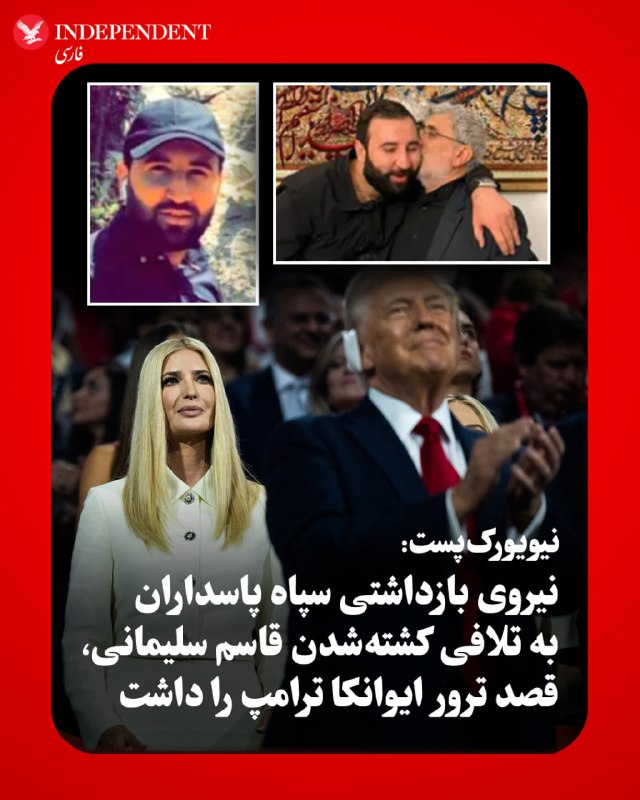

♦️روزنامه «نیویورک‌پست» به نقل از منابع آگاه افشا کرد که ایوانکا ترامپ، دختر ۴۴ ساله دونالد ترامپ، هدف یک طرح ترور پیچیده از سوی یک تروریست تحت آموزش سپاه پاسداران انقلاب اسلامی قرار گرفته که با انگیزه انتقام‌جویی از کشته شدن قاسم سلیمانی طراحی شده بود. بر اساس این گزارش، متهم که یک تبعه عراقی ۳۲ ساله به نام «محمد باقر سعد داوود الساعدی» است و به تازگی دستگیر شده، عهد کرده بود برای «به آتش کشیدن خانه ترامپ»، دختر رئیس‌جمهوری آمریکا را به قتل برساند. منابع اطلاعاتی اعلام کرده‌اند که الساعدی حتی نقشه و جزئیات معماری عمارت ۲۴ میلیون دلاری ایوانکا ترامپ و همسرش جارد کوشنر در فلوریدا را در اختیار داشته و پیش از این با انتشار تصویری از موقعیت این خانه در شبکه اجتماعی اکس (توییتر سابق)، به زبان عربی تهدید کرده بود که «نه کاخ‌ها و نه سرویس مخفی آمریکا» نمی‌توانند از آن‌ها محافظت کنند و انتقام تنها مسئله زمان است.
وزارت دادگستری ایالات متحده اعلام کرده است که الساعدی از مهره‌های بلندپایه در حلقه‌های تروریستی وابسته به ایران و کتائب حزب‌الله عراق به شمار می‌رود که در تاریخ ۱۵ مه در ترکیه بازداشت و به آمریکا مسترد شد. او در ایالات متحده با اتهاماتی سنگین پیرامون هدایت و اجرای ۱۸ حمله و تلاش برای ترور در سراسر اروپا و آمریکا مواجه است؛ پرونده‌ای که شامل بمب‌گذاری در یک بانک در آمستردام، حمله با چاقو به دو شهروند یهودی در لندن، تیراندازی به ساختمان کنسولگری آمریکا در تورنتو و آتش‌سوزی عمدی در معابد یهودیان در بلژیک و هلند می‌شود. این متهم که به دلیل وابستگی به قاسم سلیمانی او را مانند پدر خود می‌دانست، پس از کشته شدن سلیمانی در حمله پهپادی شش سال پیش آمریکا در بغداد، تحت آموزش‌های نظامی و اطلاعاتی ویژه سپاه پاسداران در تهران قرار گرفت و ارتباط نزدیکی نیز با جانشین او، سردار اسماعیل قاانی، برای تامین مالی شبکه‌های تروریستی خود داشته است.
اطلاعات فاش‌شده نشان می‌دهد الساعدی با وجود نقش برجسته‌اش در شبکه‌های تروریستی، حضور بسیار فعالی در شبکه‌های اجتماعی نظیر «اسنپ‌چت» و «اکس» داشته و تصاویری از رایزنی‌های نظامی خود با قاسم سلیمانی را نیز به اشتراک گذاشته بود. او با تاسیس یک آژانس مسافرتی مذهبی و با سوءاستفاده از یک «گذرنامه خدمت عراقی» که سفر بدون تشریفات امنیتی و اخذ آسان ویزا را برای او ممکن می‌ساخت، به راحتی به کشورهای مختلف سفر کرده و با گروه‌های تروریستی ارتباط می‌گرفت. الیزابت تسورکوف، پژوهشگر انستیتو «نیولینز» که خود ۹۰۳ روز در اسارت کتائب حزب‌الله بود، تایید کرده که روابط الساعدی با سلیمانی و قاانی فرصت بزرگی برای گروه‌های شبه‌نظامی عراقی ایجاد کرده بود. الساعدی که در زمان دستگیری در ترکیه در حال سفر به روسیه بود، هم‌اکنون در سلول انفرادی بازداشتگاه متروپولیتن بروکلین، در کنار دیگر زندانیان سرشناس نگهداری می‌شود.
‌🇸🇦 Indypersian

🤖 @VahidOOnLine

## VahidOOnLine — post 241631

  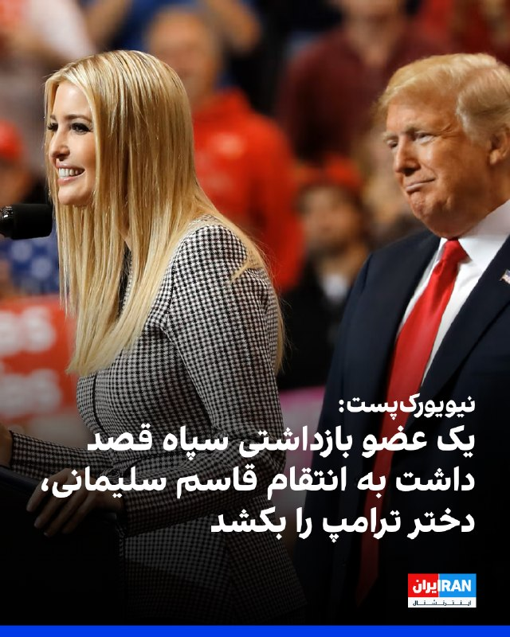

روزنامه نیویورک‌پست به نقل از منابع آگاه گزارش داد یک فرد عراقی عضو سپاه و کتائب حزب‌الله که به تازگی بازداشت شده است، قصد داشت به انتقام قاسم سلیمانی برای کشتن ایوانکا ترامپ، دختر بزرگ ترامپ، اقدام کند و حتی نقشه خانه ایوانکا و همسرش جرد کوشنر در فلوریدا را در اختیار داشت.
این تبعه عراقی ۳۲ ساله که محمد باقر سعد داوود الساعدی نام دارد، ۲۵ اردیبهشت در ترکیه بازداشت و به آمریکا مسترد شد و بنابر اعلام وزارت دادگستری آمریکا، به انجام ۱۸ حمله در سراسر اروپا و آمریکا متهم شده است.
انتیفاض قنبر، معاون پیشین وابسته نظامی سفارت عراق در واشینگتن، به نیویورک‌پست گفت: «پس از کشته شدن قاسم سلیمانی، الساعدی به دیگران می‌گفت باید ایوانکا را بکشیم تا خانه ترامپ را همان‌گونه که او خانه ما را سوزاند، بسوزانیم.»
بر اساس اعلام وزارت دادگستری آمریکا، او در حمله به اهداف آمریکایی و یهودی، از جمله پرتاب بمب آتش‌زا به ساختمان بانک نیویورک ملون در آمستردام در ماه مارس، حمله با چاقو به دو قربانی یهودی در لندن در آوریل و تیراندازی به ساختمان کنسولگری آمریکا در تورنتو در ماه مارس دست داشته است.
‌🏁 🇬🇧 IranintlTV

🤖 @VahidOOnLine

## VahidOOnLine — post 241630

♦️به‌دنبال تشدید تنش‌ها در خاورمیانه و مهلت چندروزه واشنگتن به تهران برای پذیرش «پیشنهاد نهایی»، دونالد ترامپ با لغو برنامه‌های آخر هفته خود در نیوجرسی، به کاخ سفید بازگشت. هم‌زمان، «سی‌بی‌اس نیوز» گزارش داد که مقامات ارشد اطلاعاتی و نظامی ایالات متحده نیز مرخصی‌های روز یادبود (Memorial Day) خود را لغو کرده و در وضعیت آماده‌باش کامل قرار گرفته‌اند. تحرکات منطقه‌ای و نیز امنیتی در واشنگتن، در کنار گزارش‌های اخیر مبنی بر آماده‌سازی پنتاگون برای دور جدیدی از حملات به اهداف نظامی ایران و هشدار متقابل سپاه پاسداران درباره گسترش جنگ به خارج از منطقه، گمانه‌زنی‌ها درباره قریب‌الوقوع بودن یک رویارویی نظامی یا تحول بزرگ دیپلماتیک را به اوج خود رسانده است.
‌🇸🇦 Indypersian

🤖 @VahidOOnLine

## VahidOOnLine — post 241621

جاویدنامان انقلاب ملی ایرانیان؛ هشت جوان دیگر، هشت زندگی ناتمامی که هرکدام می‌توانستند بخشی از آینده این سرزمین باشند، اما جمهوری سرکوب و خشونت، زندگی را از آنان گرفت.
حیدر کریمی، عباس برزوخانی، مجتبی رضوانی میشامندی، محمدابراهیم داداشی، عرفان خضریان، محمد شاکرمی چگنی، امیرحسین حیدر دوست و فرهاد امین؛ هشت نام از میان ده‌ها هزار زندگی ناتمام.
این روایت‌های کوتاه‌ برای ثبت حقیقت و برای زنده نگه داشتن نام‌هایی که با گلوله، شکنجه و سرکوب از مردم ایران گرفته شدند، اما از حافظه جمعی پاک نخواهند شد.
#جاویدنامان_انقلاب_ملی_ایرانیان
‌🏁 🇬🇧 IranintlTV

🤖 @VahidOOnLine

## VahidOOnLine — post 241620

  

♦️«سی‌بی‌اس نیوز» به نقل از منابع آگاه گزارش داد که دولت ترامپ به‌رغم تداوم رایزنی‌های دیپلماتیک، در حال آماده‌سازی مقدمات دور جدیدی از حملات نظامی علیه ایران است؛ هرچند تا بعدازظهر جمعه تصمیم نهایی در این زمینه اتخاذ نشده است. دونالد ترامپ با انتشار پیامی در شبکه‌های اجتماعی اعلام کرد که به دلیل «شرایط مربوط به دولت» از شرکت در مراسم عروسی پسرش، دونالد ترامپ جونیور، خودداری کرده و با لغو برنامه تفریحی خود در نیوجرسی به کاخ سفید بازمی‌گردد. در همین راستا، گزارش‌ها از لغو مرخصی آخر هفته برخی از اعضای ارتش و جامعه اطلاعاتی آمریکا حکایت دارد و مقامات دفاعی در حال به‌روزرسانی لیست آماده‌باش پایگاه‌های خارجی خود هستند. آنا کلی، سخنگوی کاخ سفید، با تأکید بر اینکه ترامپ خطوط قرمز خود را مبنی بر عدم دست‌یابی ایران به سلاح هسته‌ای و غنی‌سازی اورانیوم صراحتاً روشن کرده است، به سی‌بی‌اس گفت: «رئیس‌جمهوری همواره تمام گزینه‌ها را روی میز نگه می‌دارد و وظیفه پنتاگون آمادگی برای اجرای هرگونه تصمیم فرمانده کل قواست؛ ترامپ درباره عواقب عدم دستیابی به توافق کاملاً شفاف بوده است.»
این تحرکات نظامی در شرایطی صورت می‌گیرد که تهران در حال بررسی آخرین پیشنهاد ایالات متحده برای پایان دادن به جنگ سه‌ماهه اخیر است؛ پیشنهادی که روز چهارشنبه به همراه یک هشدار جدی به ایران ابلاغ شد مبنی بر اینکه رد این «پیشنهاد نهایی» به معنای ازسرگیری حملات نظامی خواهد بود. دونالد ترامپ روز جمعه با بیان اینکه «ایران برای رسیدن به توافق دست‌وپا می‌زند و باید دید چه رخ خواهد داد»، ضرب‌الاجلی چند روزه برای پاسخ تهران تعیین کرد؛ پاسخی که انتظار می‌رود به زودی از طریق پاکستان به عنوان میانجی منتقل شود. در همین حال، مارکو روبیو، وزیر امور خارجه آمریکا، با اشاره به پیشرفت‌های دیپلماتیک اعلام کرد که ترامپ دیپلماسی را به حمله ترجیح می‌دهد، اما هم‌زمان به گفتگوهای خود با اعضای ناتو در سوئد برای بازگشایی اجباری تنگه هرمز تحت عنوان «نقشه ب» اشاره کرد. این در حالی است که سپاه پاسداران نیز پیش از این هشدار داده بود که هرگونه حمله جدید از سوی آمریکا یا اسرائیل می‌تواند جنگ را به خارج از خاورمیانه بکشاند و با «ضربات کوبنده در مکان‌هایی که حتی فکرش را نمی‌کنید» همراه خواهد بود.
‌🇸🇦 Indypersian

🤖 @VahidOOnLine

## VahidOOnLine — post 241619

  

♦️سفارت جمهوری اسلامی ایران در ارمنستان با بازنشر نامه کناره‌گیری «تولسی گابارد» از سمت مدیریت اطلاعات ملی ایالات متحده، واکنش متفاوتی به این رویداد نشان داد و برای او آرزوی موفقیت و بهبودی کرد.
در بخشی از این نامه که توسط سفارت بازنشر شده، آمده است: «ما برای آبراهام (همسر گابارد) آرزوی بهبودی سریع و کامل داریم. شما پیش از این نشان داده‌اید که گاهی برای منافع آمریکا کار می‌کنید و نه برای اسرائیل، و حقایقی را درباره ایران بیان کردید که ترامپ از آن متنفر بود. جای تاسف است که فردی مثل شما با این دولت همکاری کرد؛ دولتی که آمریکا را به حاشیه رانده و به نیابت از اسرائیل عمل می‌کند.»
پیش‌تر نیز تولسی گابارد در نامه استعفای خود خطاب به دونالد ترامپ اعلام کرده بود به دلیل شرایط خانوادگی از سمتش کناره‌گیری می‌کند. او نوشته بود همسرش، آبراهام، به نوعی بسیار نادر از سرطان استخوان مبتلا شده و به همین دلیل تصمیم گرفته است برای همراهی و حمایت از او، از مسئولیت خود در مدیریت اطلاعات ملی آمریکا کنار برود.
‌🇸🇦 Indypersian

🤖 @VahidOOnLine

## WithYashar — post 12096

خوب تا ۵ ایران نزد میریم برای ۹ صبح به بعد ، حالا خوابمم نمیبره 🥴🤣

## WithYashar — post 12095

## WithYashar — post 12094

## WithYashar — post 12093

## WithYashar — post 12092

## WithYashar — post 12091

  

📷 Photo

## WithYashar — post 12090

## WithYashar — post 12089

## WithYashar — post 12088

درود داداش شما میدونی چه اتفاقی افتاده این همه تفرقه تو پادشاهی خواها افتاده؟
چمونه اینا الان ۹۰روزه اتحاد دارن هر شب میان راه پیمایی پس ماهایی که هدفمون نابودی ایناست چرا اینقدر اختلاف داریم...

## WithYashar — post 12087

## WithYashar — post 12086

شبکه الحدث به نقل از منابع مطلع گزارش داد فضای مذاکرات میان تهران و واشینگتن «مثبت» ارزیابی می‌شود، اما دو طرف هنوز به توافق نهایی نرسیده‌اند.
@withyashar

## WithYashar — post 12085

نیروی دریایی اسرائیل در حال ارسال پیام های رادیویی است.
@withyashar

## WithYashar — post 12084

ارتباطات رادیویی ارتش روسیه از کار افتاده است.
@withyashar

## WithYashar — post 12083

ایوانکا ترامپ، دختر اول، هدف ترور توسط یک تروریست آموزش‌دیده سپاه پاسداران انقلاب اسلامی (IRGC) قرار گرفت، در یک نقشه پیچیده برای انتقام‌گیری از رئیس‌جمهور به خاطر حذف مربی‌اش

نیویورک پست : محمد باقر سعد داوود السعدی، ۳۲ ساله، که اخیراً دستگیر شده است، «تعهد» کرده بود که ایوانکا را بکشد و حتی نقشه خانه‌اش در فلوریدا را داشت.
این شهروند عراقی ظاهراً خانواده رئیس‌جمهور دونالد ترامپ را هدف قرار داده بود در پاسخ به کشته شدن فرمانده نظامی ایرانی، قاسم سلیمانی، در حمله پهپادی آمریکا در بغداد شش سال پیش.»
@withyashar

## WithYashar — post 12082

## WithYashar — post 12081

دوستانی که فوحش خاستن تست کردن و خوردن و بلاک کردم 😃 دیکتاتور خشن یاشار

## WithYashar — post 12080

دایرکت بی مورد ندید مخوصوصا کسی بپرسه امشب میزنه یا بپرسه بخوابم یا نه …. خستم و با شدیدترین پاسخ ممکن جواب میدم !

## WithYashar — post 12079

## WithYashar — post 12078

منابع دولتی گزارش می‌دهند که ارتش جمهوری اسلامی به بالاترین سطح هشدار رسیده است.
@withyashar

## WithYashar — post 12077

  

نقشه فعلی اختلالات مداوم GPS در خلیج فارس

GPS Jamming
یعنی فرستادن پارازیت روی سیگنال ماهواره‌ای تا پهپاد، موشک، هواپیما یا موبایل نتواند موقعیت دقیقش را پیدا کند.
این کار را معمولاً اطراف مناطق حساس نظامی انجام می‌دهند تا سلاح‌ها و پهپادهای دشمن دقتشان کم شود یا مسیر را گم کنند.
نوع پیشرفته‌ترش «Spoofing» است که موقعیت جعلی نشان می‌دهد و هدف را به مسیر اشتباه می‌برد.
@withyashar

## FoxNewsTwitter — post 342152

  <a href="telegram/content/FoxNewsTwitter_342152_1779502658.mp4" target="_blank">🎬 Download video</a>

Fox News (Twitter/X)

A fire and explosion injured more than 30 people and killed one person at a Staten Island shipyard, officials said Friday.

The explosion happened after first responders arrived to battle a fire in the basement of a 150-by-150-foot metal building near the shipping docks.

The injured include civilians and first responders. One fire marshal is in critical condition, Mayor Mamdani said.

## FoxNewsTwitter — post 342151

  <a href="telegram/content/FoxNewsTwitter_342151_1779502661.mp4" target="_blank">🎬 Download video</a>

Fox News (Twitter/X)

FOX NEWS REPORT: Tulsi Gabbard announced Friday she’s stepping down as Director of National Intelligence after her husband was diagnosed with an extremely rare form of bone cancer. Her last day is expected to be June 30.

@BillMelugin_ has the latest.

## FoxNewsTwitter — post 342150

  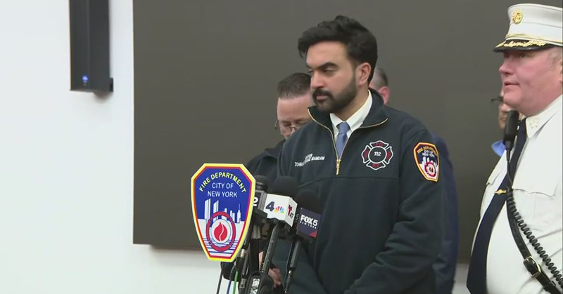

Fox News (Twitter/X)

WATCH LIVE: Press conference after massive explosion injures 16, including firefighters https://twitter.com/i/broadcasts/1jxXggegoRLJZ

## VahidOnline — post 75631

  

روزنامه «نیویورک‌پست» به نقل از منابع آگاه افشا کرد که ایوانکا ترامپ، دختر ۴۴ ساله دونالد ترامپ، هدف یک طرح ترور پیچیده از سوی یک تروریست تحت آموزش سپاه پاسداران انقلاب اسلامی قرار گرفته که با انگیزه انتقام‌جویی از کشته شدن قاسم سلیمانی طراحی شده بود.

بر اساس این گزارش، متهم که یک تبعه عراقی ۳۲ ساله به نام «محمد باقر سعد داوود الساعدی» است و به تازگی دستگیر شده، عهد کرده بود برای «به آتش کشیدن خانه ترامپ»، دختر رئیس‌جمهوری آمریکا را به قتل برساند.

منابع اطلاعاتی اعلام کرده‌اند که الساعدی حتی نقشه و جزئیات معماری عمارت ۲۴ میلیون دلاری ایوانکا ترامپ و همسرش جارد کوشنر در فلوریدا را در اختیار داشته و پیش از این با انتشار تصویری از موقعیت این خانه در شبکه اجتماعی اکس (توییتر سابق)، به زبان عربی تهدید کرده بود که «نه کاخ‌ها و نه سرویس مخفی آمریکا» نمی‌توانند از آن‌ها محافظت کنند و انتقام تنها مسئله زمان است.

وزارت دادگستری ایالات متحده اعلام کرده است که الساعدی از مهره‌های بلندپایه در حلقه‌های تروریستی وابسته به ایران و کتائب حزب‌الله عراق به شمار می‌رود که در تاریخ ۱۵ مه در ترکیه بازداشت و به آمریکا مسترد شد. او در ایالات متحده با اتهاماتی سنگین پیرامون هدایت و اجرای ۱۸ حمله و تلاش برای ترور در سراسر اروپا و آمریکا مواجه است؛ پرونده‌ای که شامل بمب‌گذاری در یک بانک در آمستردام، حمله با چاقو به دو شهروند یهودی در لندن، تیراندازی به ساختمان کنسولگری آمریکا در تورنتو و آتش‌سوزی عمدی در معابد یهودیان در بلژیک و هلند می‌شود.

این متهم که به دلیل وابستگی به قاسم سلیمانی او را مانند پدر خود می‌دانست، پس از کشته شدن سلیمانی در حمله پهپادی شش سال پیش آمریکا در بغداد، تحت آموزش‌های نظامی و اطلاعاتی ویژه سپاه پاسداران در تهران قرار گرفت و ارتباط نزدیکی نیز با جانشین او، سردار اسماعیل قاانی، برای تامین مالی شبکه‌های تروریستی خود داشته است.

اطلاعات فاش‌شده نشان می‌دهد الساعدی با وجود نقش برجسته‌اش در شبکه‌های تروریستی، حضور بسیار فعالی در شبکه‌های اجتماعی نظیر «اسنپ‌چت» و «اکس» داشته و تصاویری از رایزنی‌های نظامی خود با قاسم سلیمانی را نیز به اشتراک گذاشته بود.

او با تاسیس یک آژانس مسافرتی مذهبی و با سوءاستفاده از یک «گذرنامه خدمت عراقی» که سفر بدون تشریفات امنیتی و اخذ آسان ویزا را برای او ممکن می‌ساخت، به راحتی به کشورهای مختلف سفر کرده و با گروه‌های تروریستی ارتباط می‌گرفت.

الیزابت تسورکوف، پژوهشگر انستیتو «نیولینز» که خود ۹۰۳ روز در اسارت کتائب حزب‌الله بود، تایید کرده که روابط الساعدی با سلیمانی و قاانی فرصت بزرگی برای گروه‌های شبه‌نظامی عراقی ایجاد کرده بود. الساعدی که در زمان دستگیری در ترکیه در حال سفر به روسیه بود، هم‌اکنون در سلول انفرادی بازداشتگاه متروپولیتن بروکلین، در کنار دیگر زندانیان سرشناس نگهداری می‌شود.

@VahidOOnLine

📡 @VahidOnline

## VahidOnline — post 75630

  

سی‌بی‌اس گزارش داد که آمریکا در حالی خود را برای دور تازه‌ای از حملات نظامی علیه ایران آماده می‌کند که تلاش‌های دیپلماتیک همچنان ادامه دارد.

به گزارش سی‌بی‌اس نیوز، منابعی که مستقیم در جریان برنامه‌ریزی‌ها قرار دارند می‌گویند که دولت ترامپ روز جمعه در حال آماده‌سازی برای حملات تازه بود هرچند تا عصر جمعه تصمیم نهایی گرفته نشد.

آقای ترامپ در پیامی در شبکه‌های اجتماعی اعلام کرد که «مسائل مربوط به دولت» مانع از حضور او در مراسم ازدواج پسرش، دونالد ترامپ جونیور در روز شنبه خواهد شد.
او قرار بود تعطیلات آخر هفته را در مجموعه گلف خود در ایالت نیوجرسی بگذراند، اما اکنون به کاخ سفید بازمی‌گردد.

چند منبع نیز گفته‌اند که برخی اعضای ارتش و جامعه اطلاعاتی آمریکا برنامه‌های تعطیلات خود را لغو کرده‌اند؛ اقدامی که در انتظار احتمال حملات تازه انجام شده است.

به گفته این منابع، مقام‌های دفاعی و اطلاعاتی آمریکا در حال به‌روزرسانی فهرست نیروهای آماده‌باش در پایگاه‌های خارج از کشور هستند؛ همزمان با خروج بخشی از نیروهای مستقر در خاورمیانه، در چارچوب تلاش برای کاهش حضور نظامی آمریکا در منطقه و نگرانی از واکنش احتمالی ایران.
@VahidHeadline

📡 @VahidOnline

## IranIntlTV — post 338516

  

سی‌بی‌اس‌نیوز به نقل از منابع آگاه گزارش داد دولت ترامپ روز جمعه در حال آماده‌سازی برای دور تازه‌ای از حملات نظامی علیه ایران بوده است، اما هم‌زمان دیپلماسی ادامه دارد و تا عصر جمعه تصمیم نهایی درباره انجام حملات اتخاذ نشده بود.
به گفته منابع مطلع، برخی اعضای ارتش و جامعه اطلاعاتی آمریکا برنامه‌های تعطیلات خود را لغو کرده‌اند و مقام‌های دفاعی و اطلاعاتی در حال به‌روزرسانی فهرست‌های فراخوان نیروها در پایگاه‌های آمریکا در خارج از کشور هستند.
هم‌زمان ترامپ اعلام کرد به دلیل «شرایط مربوط به امور دولت» در مراسم ازدواج پسرش شرکت نخواهد کرد و به‌جای گذراندن تعطیلات روز یادبود در نیوجرسی، به کاخ سفید بازمی‌گردد.
این تحرکات در حالی صورت می‌گیرد که بخشی از نیروهای آمریکایی در خاورمیانه در حال گشت‌زنی هستند و نگرانی از احتمال تلافی از سوی جمهوری اسلامی وجود دارد.

https://iranintl.com/202605236613

## IranIntlTV — post 338515

  

تام کاتن، سناتور جمهوری‌خواه، از اسکات بسنت، وزیر خزانه‌داری آمریکا، خواست نهادهای مسئول دریافت هزینه عبور از تنگه هرمز برای جمهوری اسلامی، از جمله «نهاد مدیریت آبراه خلیج فارس» مرتبط با سپاه پاسداران را تحریم کند.
کاتن همچنین خواستار تحریم هر شرکت خارجی شد که این هزینه‌ها را به جمهوری اسلامی پرداخت می‌کند یا در پردازش و تسهیل آن نقش دارد. او تاکید کرد آمریکا باید همه بازیگرانی را که جمهوری اسلامی را توانمند می‌کنند، پاسخگو کند.
او گفت در حال آماده‌سازی طرحی قانونی برای حمایت از این اقدامات است و از استفاده از اختیارات فعلی برای اعمال تحریم علیه این نهاد، مدیران آن و هر طرف خارجی دخیل در پرداخت عوارض عبور از تنگه هرمز حمایت می‌کند.

https://iranintl.com/202605233320

## IranIntlTV — post 338514

  

روزنامه نیویورک‌پست به نقل از منابع آگاه گزارش داد یک فرد عراقی عضو سپاه و کتائب حزب‌الله که به تازگی بازداشت شده است، قصد داشت به انتقام قاسم سلیمانی برای کشتن ایوانکا ترامپ، دختر بزرگ ترامپ، اقدام کند و حتی نقشه خانه ایوانکا و همسرش جرد کوشنر در فلوریدا را در اختیار داشت.
این تبعه عراقی ۳۲ ساله که محمد باقر سعد داوود الساعدی نام دارد، ۲۵ اردیبهشت در ترکیه بازداشت و به آمریکا مسترد شد و بنابر اعلام وزارت دادگستری آمریکا، به انجام ۱۸ حمله در سراسر اروپا و آمریکا متهم شده است.
انتیفاض قنبر، معاون پیشین وابسته نظامی سفارت عراق در واشینگتن، به نیویورک‌پست گفت: «پس از کشته شدن قاسم سلیمانی، الساعدی به دیگران می‌گفت باید ایوانکا را بکشیم تا خانه ترامپ را همان‌گونه که او خانه ما را سوزاند، بسوزانیم.»
بر اساس اعلام وزارت دادگستری آمریکا، او در حمله به اهداف آمریکایی و یهودی، از جمله پرتاب بمب آتش‌زا به ساختمان بانک نیویورک ملون در آمستردام در ماه مارس، حمله با چاقو به دو قربانی یهودی در لندن در آوریل و تیراندازی به ساختمان کنسولگری آمریکا در تورنتو در ماه مارس دست داشته است.
https://iranintl.com/202605236458

## IranIntlTV — post 338505

جاویدنامان انقلاب ملی ایرانیان؛ هشت جوان دیگر، هشت زندگی ناتمامی که هرکدام می‌توانستند بخشی از آینده این سرزمین باشند، اما جمهوری سرکوب و خشونت، زندگی را از آنان گرفت.
حیدر کریمی، عباس برزوخانی، مجتبی رضوانی میشامندی، محمدابراهیم داداشی، عرفان خضریان، محمد شاکرمی چگنی، امیرحسین حیدر دوست و فرهاد امین؛ هشت نام از میان ده‌ها هزار زندگی ناتمام.
این روایت‌های کوتاه‌ برای ثبت حقیقت و برای زنده نگه داشتن نام‌هایی که با گلوله، شکنجه و سرکوب از مردم ایران گرفته شدند، اما از حافظه جمعی پاک نخواهند شد.
#جاویدنامان_انقلاب_ملی_ایرانیان

## FarsiVOA — post 218404

🔺نیویورک پست به نقل از چند منبع: تبعه عراقی آموزش‌دیده سپاه می‌خواست ایوانکا ترامپ را به تلافی کشته‌شدن قاسم سلیمانی ترور کند

◾️روزنامه نیویورک پست روز جمعه ۱ خرداد گزارش داد که ایوانکا ترامپ، دختر دونالد ترامپ رئیس جمهوری آمریکا، هدف طرح ترور فردی قرار گرفته بود که گفته می‌شود سپاه پاسداران او را آموزش داده بود.

⬇️ بیشتر بخوانید:
https://ir.voanews.com/a/8153013.html
@FarsiVOA

## FarsiVOA — post 218403

🔺گزارش سی‌بی‌اس از تحرکات تازه جامعه نظامی و اطلاعاتی آمریکا با محوریت ایران؛ برخی اعضای ارتش مرخصی‌های خود را لغو کردند

◾️شبکه آمریکایی سی‌بی‌اس به نقل از منابع مطلع گزارش داد که دولت دونالد ترامپ، رئیس‌جمهوری آمریکا، روز جمعه ۱ خرداد و هم‌زمان با ادامه تلاش‌های دیپلماتیک، خود را برای دور تازه‌ای از حملات نظامی به جمهوری اسلامی ایران آماده می‌کرد.

⬇️ بیشتر بخوانید:
https://ir.voanews.com/a/8152870.html
@FarsiVOA

## FarsiVOA — post 218402

⚡️پشت پرده سفر پنج روزه ژنرال پترائوس به بغداد؛ قطع نفوذ جمهوری اسلامی شرط واشنگتن برای عراق
@FarsiVOA

## Persian_Trend_Official — post 14704

  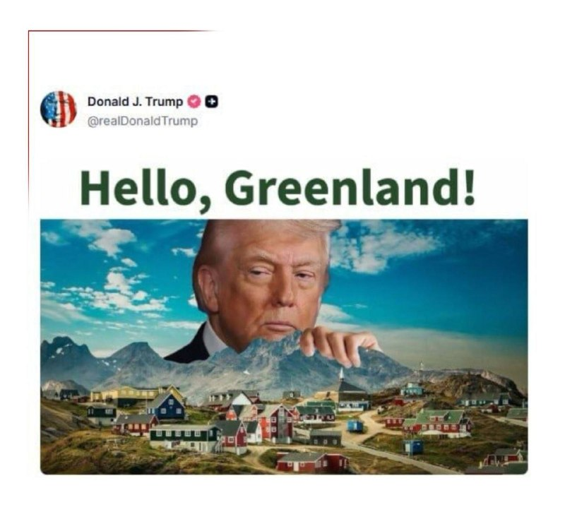

🔴ترامپ تصویری از خود با گرینلند منتشر کرد

💢 رئیس جمهوری آمریکا در اقدامی جنجالی دیگر تصویری از خود را در فضای مجازی منتشر کرده که  دست وی را روی گرینلند نشان می دهد.

🫆:Tony

📌 @persian_trend_official
پرشین ترند | متفاوت‌ترین کانال نظامی

## Persian_Trend_Official — post 14703

💢نیروهای مسلح جمهوری اسلامی در بالاترین سطح آماده‌باش قرار گرفته‌اند.

▪️همزمان، فعالیت بالای جنگنده‌ها بر فراز کردستان عراق و همچنین فعالیت جنگنده‌های ایرانی در غرب ایران ثبت شده است. همچنین سطح بالایی از اختلال در سیستم GPS در امارات، قطر، کویت و ایران گزارش شده است.

🫆:Tony

📌 @persian_trend_official
پرشین ترند | متفاوت‌ترین کانال نظامی

## Persian_Trend_Official — post 14702

  <a href="telegram/content/Persian_Trend_Official_14702_1779502669.webm" target="_blank">🎬 Download video</a>

🔴 الحدث: فضای مذاکرات ایران و آمریکا مثبت است اما توافق نهایی حاصل نشده

💢شبکه الحدث به نقل از منابع مطلع گزارش داد فضای مذاکرات میان تهران و واشینگتن «مثبت» ارزیابی می‌شود، اما دو طرف هنوز به توافق نهایی نرسیده‌اند.

💢بر اساس این گزارش:
▪️ پیش‌نویس یک توافق آماده شده و اکنون نیازمند تأیید نهایی دو طرف است

▪️ مذاکرات فعلی بر روی نهایی‌کردن متن و حل اختلافات باقی‌مانده متمرکز شده

▪️ طرف‌های میانجی منطقه‌ای همچنان در تلاش برای نزدیک‌کردن مواضع تهران و واشینگتن هستند
💢همزمان گزارش‌ها حاکی است:
▪️ هنوز اختلافاتی بر سر برنامه هسته‌ای، تحریم‌ها و نحوه اجرای توافق وجود دارد

▪️ برخی منابع ایرانی ادعای رسیدن به «پیش‌نویس نهایی» را رد کرده‌اند

▪️باوجودفضاینسبتاًمثبت،خطربازگشتتنشنظامیهمچنانپابرجاست

🫆:Tony

📌 @persian_trend_official
پرشین ترند | متفاوت‌ترین کانال نظامی

## Persian_Trend_Official — post 14701

  <a href="telegram/content/Persian_Trend_Official_14701_1779502670.webm" target="_blank">🎬 Download video</a>

🔴 نقشه اختلالات GPS در خلیج فارس

💢گزارش‌ها و داده‌های ناوبری نشان می‌دهد اختلالات گسترده GPS همچنان در بخش‌های مختلف خلیج فارس ادامه دارد.

▪️ بیشترین اختلال‌ها در اطراف تنگه هرمز، سواحل جنوبی ایران و مسیرهای کشتیرانی بین‌المللی ثبت شده است
▪️ این اختلالات می‌تواند بر ناوبری کشتی‌ها، پهپادها و برخی پروازهای عبوری تأثیر بگذارد
▪️ طی هفته‌های اخیر بارها گزارش‌هایی از «اسپوفینگ» و اخلال الکترونیکی در منطقه منتشر شده است

🫆:Tony

📌 @persian_trend_official
پرشین ترند | متفاوت‌ترین کانال نظامی

## IranianMinds — post 20580

🔴 اکسیوس: ترامپ بیش از پیش به اقدام نظامی علیه ایران متمایل شده است

اکسیوس به نقل از منابع آگاه گزارش داد دونالد ترامپ طی شش هفته گذشته چند بار تا آستانه ازسرگیری اقدام نظامی علیه ایران پیش رفته، اما در نهایت عقب‌نشینی کرده است.

طبق این گزارش، افرادی که از روند تصمیم‌گیری ترامپ اطلاع دارند میگویند او اکنون بیش از قبل به اجرای حمله نظامی متمایل شده؛ مگر اینکه مذاکرات به شکل غیرمنتظره‌ای به پیشرفت جدی برسد.

منابع آمریکایی همچنین گفته‌اند فضای مذاکرات همچنان پیچیده و فرسایشی است و متن‌های پیشنهادی به طور مداوم میان دو طرف رد و بدل میشود، اما پیشرفت ملموسی حاصل نشده است.

این گزارش در حالی منتشر میشود که همزمان تلاش‌های دیپلماتیک قطر، پاکستان و برخی کشورهای منطقه برای جلوگیری از تشدید درگیری ادامه دارد.

@IranianMinds

## IranianMinds — post 20579

💯 اگر هنوز ۵۰۰ هزارتومان رو نگرفتی همین الان عضو شو‌ و جایزتو بگیر
نیازی هم به واریز نیست

👍 تنها سایت مورد #تایید ما با بونوس های واقعی

🌐 Winro.io

## IranianMinds — post 20578

  <a href="telegram/content/IranianMinds_20578_1779502671.webm" target="_blank">🎬 Download video</a>

💩 
⚠️ دیگه #فریب بونوس های الکی سایت های سودجو رو نخورید
❌

💲بیا توی سایت مورد تایید ما یعنی #وینرو و با عضویت 500 هزار تومان اعتبار بی قیدو شرط بگیر
👏

🤩با عضویت 
🤩 
🤩 
🤩 هزار تومان اعتبار رایگان بگیر!

⌛ پشتیبانی 24 ساعته

🌐 Winro.io

🌐 Winro.io
کانال بونوس های رایگان a1

📱 @winro_io

## IranianMinds — post 20577

  

🔴وضعیت پروازهای نظامی در منطقه.

@IranianMinds

## BBCPersian — post 281827

🔻ولادیمیر پوتین، رئیس‌جمهور روسیه، از ارتش خواست تا برای «گزینه‌های تلافی‌جویانه» علیه اوکراین آماده شود. او این دستور را پس از حمله پهپادی کی‌یف به یک خوابگاه دانشجویی در منطقه شرقی تحت اشغال روسیه در اوکراین، صادر کرد. روسیه می‌گوید که در این حمله شش…

## BBCPersian — post 281826

  

🔻ولادیمیر پوتین، رئیس‌جمهور روسیه، از ارتش خواست تا برای «گزینه‌های تلافی‌جویانه» علیه اوکراین آماده شود.

او این دستور را پس از حمله پهپادی کی‌یف به یک خوابگاه دانشجویی در منطقه شرقی تحت اشغال روسیه در اوکراین، صادر کرد.

روسیه می‌گوید که در این حمله شش دانشجو کشته شدند.

رئیس‌جمهور روسیه ضمن متهم کردن اوکراین به «تروریسم» گفت که بیانیه وزارت خارجه مسکو کافی نبوده و به ارتش دستور داده تا «طرح‌ حملات» متقابل را ارائه کنند.

از سوی دیگر اوکراین می‌گوید که ساختمان هدف حمله، «مقر فرماندهی پهپادی ارتش روسیه» بود.

خبرگزاری رویترز هم از قول مقام‌های محلی تحت امر روسیه نوشت که این ساختمان، «دانشکده تربیت معلم دانشگاه لوهانسک» بود.

با وجود انتشار تصاویر عملیات امداد گروه‌های نجات روسی از رسانه‌ دولتی روسیه، هنوز مشخص نیست چه کسانی در این حمله کشته شده‌اند.

📷 Reuters
@BBCPersian

## BBCPersian — post 281825

🔻سی‌بی‌اس شریک خبری بی‌بی‌سی گزارش داد که آمریکا در حالی خود را برای دور تازه‌ای از حملات نظامی علیه ایران آماده می‌کند که تلاش‌های دیپلماتیک همچنان ادامه دارد. به گزارش سی‌بی‌اس نیوز، منابعی که مستقیم در جریان برنامه‌ریزی‌ها قرار دارند می‌گویند که دولت ترامپ…

## BBCPersian — post 281824

  

🔻سی‌بی‌اس شریک خبری بی‌بی‌سی گزارش داد که آمریکا در حالی خود را برای دور تازه‌ای از حملات نظامی علیه ایران آماده می‌کند که تلاش‌های دیپلماتیک همچنان ادامه دارد.

به گزارش سی‌بی‌اس نیوز، منابعی که مستقیم در جریان برنامه‌ریزی‌ها قرار دارند می‌گویند که دولت ترامپ روز جمعه در حال آماده‌سازی برای حملات تازه بود هرچند تا عصر جمعه تصمیم نهایی گرفته نشد.

آقای ترامپ در پیامی در شبکه‌های اجتماعی اعلام کرد که «مسائل مربوط به دولت» مانع از حضور او در مراسم ازدواج پسرش، دونالد ترامپ جونیور در روز شنبه خواهد شد.

او قرار بود تعطیلات آخر هفته را در مجموعه گلف خود در ایالت نیوجرسی بگذراند، اما اکنون به کاخ سفید بازمی‌گردد.

چند منبع نیز گفته‌اند که برخی اعضای ارتش و جامعه اطلاعاتی آمریکا برنامه‌های تعطیلات خود را لغو کرده‌اند؛ اقدامی که در انتظار احتمال حملات تازه انجام شده است.

📷EPA
https://bbc.in/4tNcI6h
@BBCPersian

## BBCPersian — post 281823

🔻دو مقام آمریکایی به شبکه خبری اکسیوس گفتند که دونالد ترامپ، نشستی را با اعضای ارشد تیم امنیت ملی خود درباره جنگ با ایران برگزار کرده است. این گزارش حاکیست که رئیس جمهور آمریکا در صورت شکست مذاکرات در آخرین لحظات، به‌طور جدی در حال بررسی انجام حملات تازه…

## BBCPersian — post 281822

  

🔻دو مقام آمریکایی به شبکه خبری اکسیوس گفتند که دونالد ترامپ، نشستی را با اعضای ارشد تیم امنیت ملی خود درباره جنگ با ایران برگزار کرده است.

این گزارش حاکیست که رئیس جمهور آمریکا در صورت شکست مذاکرات در آخرین لحظات، به‌طور جدی در حال بررسی انجام حملات تازه علیه ایران است.

گفته می‌شود که این نشست همزمان با سفر عاصم منیر، فرمانده ارتش پاکستان، به تهران برگزار شده است، سفری که ظاهرا آخرین تلاش‌ها برای کاهش اختلاف‌ها و جلوگیری از شروع دوباره جنگ به شمار می‌رود.

همزمان یک هیئت از قطر هم با «هماهنگی آمریکا» در تهران به‌سر می‌برد.

برپایه گزارش آکسیوس همچنین در این جلسه، جی‌دی ونس، معاون رئیس‌جمهور، پیت هگست، وزیر دفاع، جان رتکلیف، رئیس سازمان سیا، سوزی وایلز، رئیس دفتر کاخ سفید، و شماری دیگر از مقام‌ها در کنار دونالد ترامپ حضور داشتند.

گفته شده که مارکو روبیو، وزیر خارجه آمریکا، و ژنرال دن کین، رئیس ستاد مشترک ارتش، در جلسه حضور نداشتند؛ زیرا اولی در اروپا بود و دومی در مراسم فارغ‌التحصیلی آکادمی نیروی دریایی شرکت داشت.

📷 Bloomberg via Getty Image
https://bbc.in/4f2mcqz
@BBCPersian

---
📅 بروزرسانی: 1405/03/02 03:10
---

## VahidOOnLine — post 241617

  

امیر سعید ایروانی، نماینده جمهوری اسلامی در سازمان ملل، در نامه‌ای به شورای امنیت با اشاره به مشارکت قطر، بحرین، کویت، عربستان سعودی، امارات متحده عربی و اردن در حملات آمریکا و اسرائیل علیه جمهوری اسلامی، خواستار جبران کامل خسارات شد.
او گفت در اختیار گذاشتن پایگاه‌ها، پشتیبانی لجستیکی، اطلاعات و هماهنگی پدافند هوایی، این کشورها را از نظر حقوق بین‌الملل مسئول می‌کند.
ایروانی افزود با وجود آن‌که شورای امنیت این کشورها را پاسخگو نکرده است، دولت‌های یادشده موظف‌اند تمامی خسارات مادی و معنوی ناشی از «اقدامات غیرقانونی» خود را به‌طور کامل به جمهوری اسلامی جبران کنند.

‌🏁 🇬🇧 IranintlTV

🤖 @VahidOOnLine

## VahidOOnLine — post 241616

  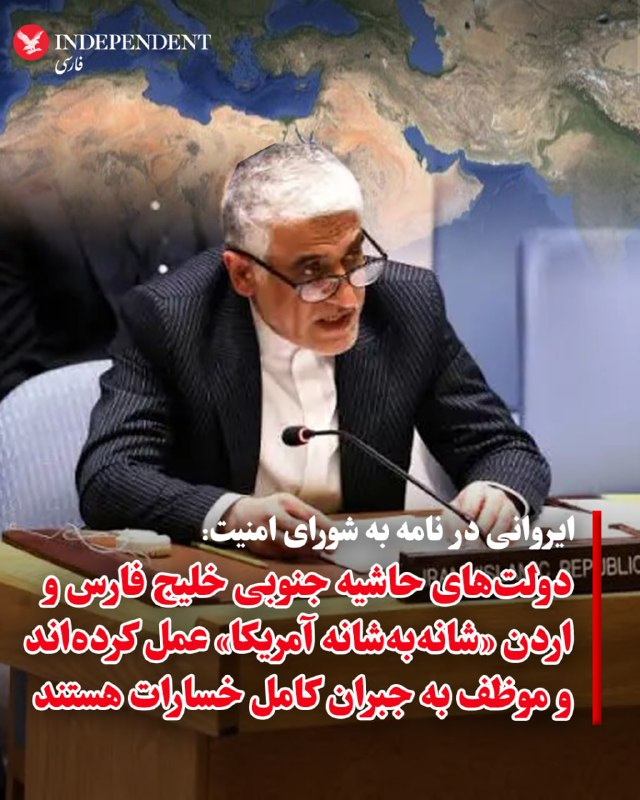

♦️امیرسعید ایروانی، نماینده دایم جمهوری اسلامی در سازمان ملل، روز جمعه در نامه‌ای به شورای امنیت، ضمن متهم کردن همسایگان جنوبی خلیج فارس و اردن  به داشتن نقش فعال در حمله آمریکا علیه ایران، گفت: «این کشورها عملا شانه‌به‌شانه آمریکا عمل کرده‌اند و با در اختیار گذاشتن پایگاه‌ها و تاسیسات نظامی، حمایت‌های لجستیکی و عملیاتی، تبادل اطلاعات، هماهنگی پدافند هوایی، اعطای دسترسی به حریم هوایی و مشارکت در فعالیت‌های نظامی علیه سرزمین و منافع ایران مسئول هستند». ایروانی در ادامه گفت با وجود آن‌که شورای امنیت این کشورها را پاسخگو نکرده، دولت‌های قطر، بحرین، کویت، عربستان سعودی، امارات متحده عربی و اردن موظف‌اند تمامی خسارات مادی و معنوی ناشی از «اقدامات غیرقانونی» خود را به‌طور کامل به جمهوری اسلامی ایران جبران کنند.
‌🇸🇦 Indypersian

🤖 @VahidOOnLine

## VahidOOnLine — post 241615

♦️فیلم سینمایی «طهران ۵۷» به کارگردانی ایمان یزدی، سال ۱۴۰۴ پس از اکران در سینماها، طی روزهای گذشته با اعمال «حذفیات» وارد شبکه نمایش خانگی شده و مورد توجه کاربران شبکه‌های اجتماعی قرار گرفته است. این فیلم طنز با بازی احمد مهران‌فر، حامد آهنگی و پژمان جمشیدی، داستان خیالیِ ورود دونالد ترامپ در دوران جوانی‌اش به همراه دو ستاره هالیوود یعنی جک نیکلسون و وارن بیتی به ایران در اوایل سال ۱۳۵۷ را روایت می‌کند که قصد تاسیس یک کازینو در شمال کشور را دارند. یکی از سکانس‌های این فیلم که در فضای مجازی دست‌به‌دست می‌شود، رقص معروف «وای‌ام‌سی‌ای» (YMCA) ترامپ با ترانه قدیمی «بعد از تو» از حسن شماعی‌زاده است؛ سوژه‌ای که ریشه در یک شایعه قدیمی و جنجالی در فضای مجازی ایران دارد.
پایه و اساس داستان این فیلم، یک ادعای نادرست است که سال‌هاست هم‌زمان با مناسبت‌های سیاسی آمریکا در شبکه‌های اجتماعی فارسی، انگلیسی و عربی مورد توجه قرار می‌گیرد. در این شایعه، با انتشار یک عکس، ادعا می‌شود ترامپ در ۳۷ سالگی برای خرید «هتل قدیم رامسر» و راه‌اندازی کازینو به تهران آمده بود؛ ادعایی که حتی یک‌بار توسط یک توریست آلمانی در بازدید از رامسر نیز تکرار شد. با این حال، بررسی‌های دقیق نشان می‌دهد این عکس دستکاری‌شده نیست، بلکه ده سال بعد از انقلاب ایران (۲۷ ژوئن ۱۹۸۸) توسط «ران گاللا» در جریان مسابقه بوکس مایک تایسون در هتل برج ترامپ در آتلانتیک سیتی ثبت شده و هیچ سند، گزارش یا فکتی مبنی بر سفر دونالد ترامپ به ایران در قبل یا بعد از انقلاب وجود ندارد.
‌🇸🇦 Indypersian

🤖 @VahidOOnLine

## VahidOOnLine — post 241614

  

سفارت جمهوری اسلامی در ارمنستان با بازنشر نامه کناره‌گیری تولسی گبرد از مدیریت اطلاعات ملی آمریکا به دلیل ابتلای همسرش به سرطان، برای همسر گبرد سلامتی و برای این مقام آمریکایی «بهترین‌ها» را آرزو کرد و مواضع او را درباره مواردی همچون اسرائیل و جمهوری اسلامی مورد تحسین قرار داد.
این سفارت‌خانه خطاب به گبرد در ایکس نوشت: «تو پیش‌تر در مقاطعی نشان دادی که برای آمریکا کار می‌کنی نه اسرائیل، و گاهی درباره ایران واقعیت‌هایی را بیان کردی که ترامپ از آن‌ها خوشش نمی‌آمد. تاسف‌آور بود که فردی مانند تو با این دولت همکاری کرد؛ دولتی که آمریکا را به حاشیه رانده و به نیابت از اسرائیل عمل می‌کند.»

‌🏁 🇬🇧 IranintlTV

🤖 @VahidOOnLine

## VahidOOnLine — post 241613

  

♦️به گزارش رویترز، سازمان خدمات شهروندی و مهاجرت ایالات متحده در دستورالعملی جدید اعلام کرد متقاضیانی که در خاک آمریکا حضور دارند و به دنبال تغییر وضعیت مهاجرتی خود برای دریافت «کارت سبز» (گرین‌کارت) هستند، دیگر نمی‌توانند این فرایند را از داخل آمریکا پیگیری کنند. طبق این سیاست، متقاضیان ملزم هستند برای تکمیل مراحل قانونی، به کشور مبدا بازگشته و از طریق وزارت امور خارجه اقدام کنند.
وزارت امنیت داخلی آمریکا هدف از این تصمیم را جلوگیری از سوءاستفاده از خلأهای قانونی و اصلاح عملکرد سیستم مهاجرتی طبق قانون اعلام کرده است. بر اساس این گزارش سازمان‌های حقوق بشری و حامیان پناهجویان به شدت به این تصمیم اعتراض کرده‌اند.  به گزارش رویترز، این سیاست، قربانیان قاچاق انسان و کودکان آسیب‌دیده‌ای را که از شرایط خطرناک کشورهای خود گریخته‌اند، مجبور می‌کند برای دریافت اقامت دائم، دوباره به همان محیط‌های ناامن بازگردند.
‌🇸🇦 Indypersian

🤖 @VahidOOnLine

## VahidOOnLine — post 241612

  

♦️دونالد ترامپ، رئیس‌جمهوری آمریکا، با انتشار تصویری گرافیکی با عبارت «گنبد طلایی برای کاخ سفید» در شبکه اجتماعی «تروث سوشال»، بار دیگر بر ایده خود مبنی بر ایجاد یک سپر دفاع موشکی همه‌جانبه تاکید کرد. ترامپ که از زمان مبارزات انتخاباتی خود بارها بر لزوم ساخت یک چتر پدافندی بزرگ برای کل خاک آمریکا (مشابه گنبد آهنین اسرائیل اما بسیار پیشرفته‌تر) تاکید کرده، در این تصویر مفهومی، کاخ سفید را زیر یک پوشش حفاظتی درخشان مجهز به سیستم‌های راداری و ماهواره‌های مداری به تصویر کشیده است. به گزارش منابع آگاه، پروژه ۱۸۵ میلیارد دلاری «گنبد طلایی» به عنوان یک سپر فضامحور با تکیه بر هوش‌مصنوعی برای رهگیری موشک‌های بالستیک، کروز و هایپرسونیک طراحی شده و صدها شرکت برای مشارکت در آن رقابت می‌کنند. بر اساس گزارش‌ها، غول‌های فناوری نظامی مانند «اندوریل» و «پالانتیر» در حال همکاری برای ارتقای نرم‌افزاری این سامانه هستند و پیش از این نیز در بخش‌هایی از پروژه با شرکت «اسپیس‌اکس» متعلق به ایلان ماسک مشارکت داشته‌اند.
‌🇸🇦 Indypersian

🤖 @VahidOOnLine

## VahidOOnLine — post 241611

  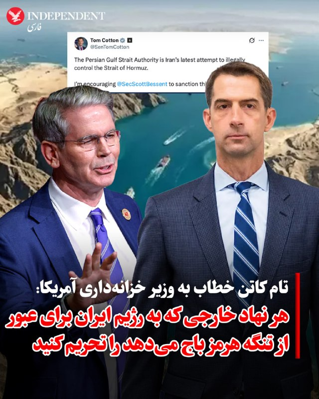

♦️تام کاتن، سناتور جمهوری‌خواه، در نامه‌ای رسمی به اسکات بسنت، وزیر خزانه‌داری ایالات متحده، ضمن هشدار درباره راه‌اندازی «عوارضی تهران» توسط سپاه پاسداران خواستار اعمال تحریم‌های تنبیهی فوری علیه حامیان این طرح شد. کاتن با مواضع تند خود علیه اقدام غیرقانونی ایران در ایجاد «سازمان تنگه خلیج فارس» (PGSA) نوشت: «این سازمان که مستقیما زیر نظر سپاه پاسداران (به عنوان یک سازمان تروریستی) فعالیت می‌کند، حق حاکمیت برای تنظیم تردد و دریافت عوارض تا سقف ۲ میلیون دلار برای هر کشتی را ادعا کرده است؛ بنابراین هر دلار جمع‌آوری‌شده، مستقیما برای تأمین مالی تروریسم هزینه می‌شود.» این سناتور آمریکایی با تأکید بر اینکه این اقدام آزادی کشتیرانی بین‌المللی را به خطر می‌اندازد، صراحتا اعلام کرد: «این سازمان بدون رضایت سایر کشورها نمی‌تواند فعالیت کند و ایالات متحده باید اطمینان حاصل کند که هر بازیگری که به رژیم تروریستی ایران کمک می‌کند، پاسخگو خواهد شد؛ به همین دلیل من از به کارگیری اختیارات موجود برای اعمال تحریم بر این سازمان، مقامات آن و هر نهاد خارجی که این باج‌ها را به ایران پرداخت، پردازش یا تسهیل می‌کند، کاملا حمایت می‌کنم.»
‌🇸🇦 Indypersian

🤖 @VahidOOnLine

## VahidOOnLine — post 241610

  

♦️به گزارش فارس، خبرگزاری وابسته به سپاه پاسداران، عباس عراقچی، وزیر امور خارجه جمهوری اسلامی روز جمعه در تماس تلفنی با نیچروان بارزانی، رئیس اقلیم کردستان عراق، درباره روابط دوجانبه ایران و عراق و آخرین تحولات منطقه گفتگو کرد. براساس این گزارش، محورهای اصلی و مهم این تبادل نظر بر مناسباتی از جمله توسعه مراودات اقتصادی-تجاری، تقویت هماهنگی‌ها برای حفظ امنیت مرزهای مشترک و مقابله با تروریسم متمرکز بود. فارس نوشت، دو طرف همچنین در خصوص تحولات منطقه‌ای رایزنی کرده و بر اهمیت اهتمام و هم‌گرایی کشورهای منطقه جهت تقویت امنیت درون‌زا تأکید کردند.
‌🇸🇦 Indypersian

🤖 @VahidOOnLine

## WithYashar — post 12076

  <a href="telegram/content/WithYashar_12076_1779493264.mp4" target="_blank">🎬 Download video</a>

ترامپ به کاخ سفید رسیده است و به تیم خبری رسماً اطلاع داده شده که ترامپ در بقیه روز هیچ حضور عمومی، بیانیه یا فرصت عکسبرداری نخواهد داشت.
@withyashar

## WithYashar — post 12075

طبق گزارش CBS نیوز: دولت ترامپ در حال آماده‌سازی برای دور جدیدی از حملات علیه ایران است، علی‌رغم تلاش‌های دیپلماتیک در جریان، در حالی که چندین مقام نظامی و اطلاعاتی ایالات متحده برنامه‌های آخر هفته روز یادبود خود را لغو کرده‌اند با انتظار اینکه اقدام نظامی ممکن است دستور داده شود.

@withyashar

## WithYashar — post 12074

## WithYashar — post 12073

  <a href="telegram/content/WithYashar_12073_1779493265.mp4" target="_blank">🎬 Download video</a>

پست جدید ترامپ 🤣
@withyashar

## WithYashar — post 12072

تعطیلی مراسم یادبود آخر هفته(دوشنبه) برای برخی از نیروهای نظامی آمریکایی لغو شد.
@withyashar

## WithYashar — post 12071

  <a href="telegram/content/WithYashar_12071_1779493267.mp4" target="_blank">🎬 Download video</a>

🎬 Video

## WithYashar — post 12070

مهدی طارمی نمیدونم کیه ولی میگن به اردوی آنتالیا تیم‌ملی اضافه شد
@withyashar

## WithYashar — post 12069

## WithYashar — post 12068

جت های جنگی اسرائیلی به صورت گسترده در حال پرواز به سمت آسمان عراق و عربستان مشاهده شدند.
@withyashar

## WithYashar — post 12067

توجه کنید این خبر فعلا فقط توسط رسانه های اسرائیل گفته شده هنوز تایید نشده

## WithYashar — post 12066

گزارشها حاکی از این است که هیئت پاکستانی با عجله تهران را ترک کردند. @withyashar

## WithYashar — post 12065

کلاً یه دونه تانکر سوخت رسان تو آسمون اسرائیله. من نمیدونم چرا یه خبر فیک میزنن همه هم همونو کپی میکنن همه جا پخش میکنن.

## WithYashar — post 12064

کلاً یه دونه تانکر سوخت رسان تو آسمون اسرائیله. من نمیدونم چرا یه خبر فیک میزنن همه هم همونو کپی میکنن همه جا پخش میکنن.

## WithYashar — post 12063

یه هم زبون افغان نیست اینجا ؟😃

## WithYashar — post 12062

گزارشها حاکی از این است که هیئت پاکستانی با عجله تهران را ترک کردند.
@withyashar

## WithYashar — post 12061

خبر‌ فورررریییییییی 🚨🚨🚨🚨🚨

## WithYashar — post 12060

## WithYashar — post 12059

یاشار حاجی استیکر حامله رو چیکار کنیم آزاد کنی؟😂

## WithYashar — post 12058

## WithYashar — post 12057

## mwarmonitor — post 9511

  

✈️نیروهای آمریکایی در آسمان بیابان سماوه در جنوب عراق فعال شده‌اند و با استقرار هواپیماهای سوخت‌رسان هوایی فعالیت می‌کنند؛ موضوعی که نشان می‌دهد پروازهای جنگی دیگری نیز در آسمان عراق حضور دارند.

@mwarmonitor

## mwarmonitor — post 9510

  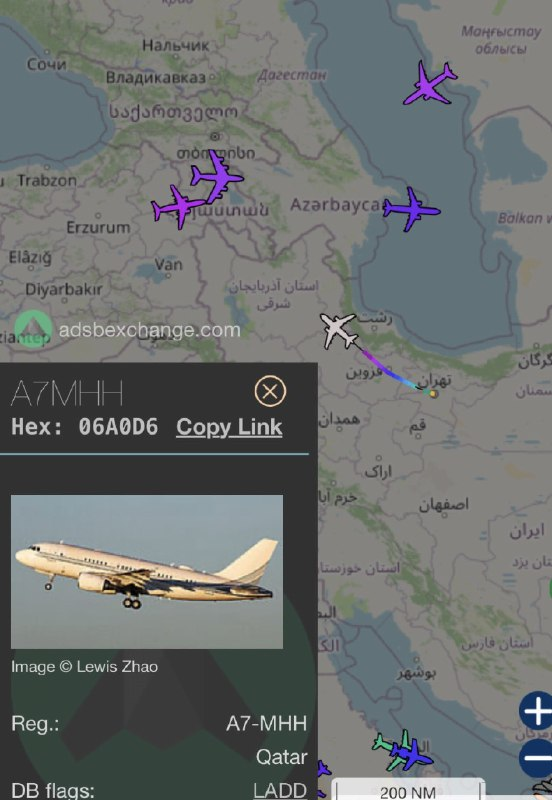

🔴در میان گزارش‌هایی مبنی بر اینکه ایران با صدور اطلاعیه هوانوردان (NOTAM) حریم هوایی خود را تا روز دوشنبه بسته است، یک هواپیمای قطری که به‌عنوان هواپیمای تشریفاتی (VIP) دولت قطر شناخته می‌شود، در حال ترک تهران مشاهده شده است.

🔸این پرواز پس از سفر هیأت قطری به تهران برای تسهیل دستیابی به توافقی میان آمریکا و ایران انجام می‌شود.

🔹در حالی که Asim Munir، تصمیم‌گیرنده اصلی پاکستان، قرار است فردا با همتایان ایرانی خود دیدار کند.

@mwarmonitor

## mwarmonitor — post 9509

🔴 یک منبع آمریکایی به Al Jazeera گفت:

🔸رئیس ستاد مشترک ارتش آمریکا در نشست شورای امنیت ملی شرکت کرده و گزینه‌هایی را در صورت شکست مذاکرات با ایران به رئیس‌جمهور ارائه داده است.

@mwarmonitor

## mwarmonitor — post 9508

🔴بر اساس گزارش CBS News به نقل از چند منبع، برخی از مقامات نظامی و اطلاعاتی آمریکا برنامه‌های آخر هفته تعطیلات روز یادبود (Memorial Day) را لغو کرده‌اند؛ این اقدام در پی انتظار برای احتمال حملات علیه ایران صورت گرفته است.

🔸دولت ترامپ در حال آماده‌سازی برای دور تازه‌ای از حملات نظامی است، هرچند تا بعدازظهر جمعه هیچ تصمیم نهایی در این‌باره اتخاذ نشده بود.

@mwarmonitor

## FoxNewsTwitter — post 342149

  

Fox News (Twitter/X)

BREAKING: President Trump announces that 9/11 hero Welles Crowther will posthumously receive the Presidential Medal of Freedom.

Known as “The Man in the Red Bandana,” Crowther repeatedly ran back into the South Tower on 9/11 to help others escape, saving as many as 18 lives before losing his own.

Allison Crowther said her son’s legacy continues to endure nearly 25 years later: “Welles’ light still shines brightly.”

## DEJradio — post 4858

  <a href="telegram/content/DEJradio_4858_1779493270.webm" target="_blank">🎬 Download video</a>

👑
🔺 شاهزاده رضا پهلوی روز آدینه ابتدای خرداد، در کنگره آمریکا، با دریک ون اوردن و دن میوزر، دو نفر از نمایندگان مجلس ایالات متحده دیدار کرد.

دریک ون اوردن با انتشار تصاویری از این دیدار در ایکس، بر حمایت از مبارزه مردم ایران برای آزادی تاکید کرد و نوشت: «آن‌ها به پایان دادن به جنگی که ملایان رادیکال ۴۷سال پیش علیه آمریکا و جهان آزاد آغاز کردند، کمک می‌کنند.» دن میوزر نیز با قدردانی از ایستادگی شاهزاده رضا پهلوی در برابر رژیم حاکم، پایداری او در دفاع از هموطنانش را که نزدیک به ۵۰سال تحت ستم بوده‌اند، ستود.

شاهزاده رضا پهلوی نیز در ایکس نوشت، «خوشحالم که دن مویزر دیدار کردم. از حمایت او از مردم ایران در مبارزه برای بازپس‌گیری کشورمان از رژیم اشغالگر و بازگرداندن ایران به صلح، رفاه و جامعه جهانی سپاسگزارم».

#شاهزاده_رضا_پهلوی
@DEJradio

## kianmeli1 — post 87570

  <a href="telegram/content/kianmeli1_87570_1779493270.mp4" target="_blank">🎬 Download video</a>

🔴ترامپ سوار هواپیمای نیروی هوایی در نیویورک شد، اقامت آخر هفته خود در نیوجرسی را لغو کرد و به کاخ سفید بازگشت.
https://t.me/kianmeli1

## kianmeli1 — post 87569

  

🔴هیئت قطر تهران را ترک کرد.
https://t.me/kianmeli1

## IranIntlTV — post 338504

  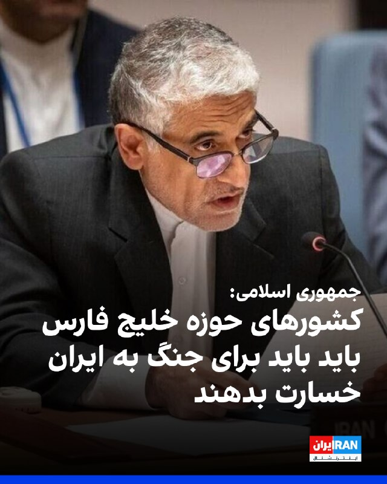

امیر سعید ایروانی، نماینده جمهوری اسلامی در سازمان ملل، در نامه‌ای به شورای امنیت با اشاره به مشارکت قطر، بحرین، کویت، عربستان سعودی، امارات متحده عربی و اردن در حملات آمریکا و اسرائیل علیه جمهوری اسلامی، خواستار جبران کامل خسارات شد.
او گفت در اختیار گذاشتن پایگاه‌ها، پشتیبانی لجستیکی، اطلاعات و هماهنگی پدافند هوایی، این کشورها را از نظر حقوق بین‌الملل مسئول می‌کند.
ایروانی افزود با وجود آن‌که شورای امنیت این کشورها را پاسخگو نکرده است، دولت‌های یادشده موظف‌اند تمامی خسارات مادی و معنوی ناشی از «اقدامات غیرقانونی» خود را به‌طور کامل به جمهوری اسلامی جبران کنند.

https://iranintl.com/202605227902

## IranIntlTV — post 338503

  

سفارت جمهوری اسلامی در ارمنستان با بازنشر نامه کناره‌گیری تولسی گبرد از مدیریت اطلاعات ملی آمریکا به دلیل ابتلای همسرش به سرطان، برای همسر گبرد سلامتی و برای این مقام آمریکایی «بهترین‌ها» را آرزو کرد و مواضع او را درباره مواردی همچون اسرائیل و جمهوری اسلامی مورد تحسین قرار داد.
این سفارت‌خانه خطاب به گبرد در ایکس نوشت: «تو پیش‌تر در مقاطعی نشان دادی که برای آمریکا کار می‌کنی نه اسرائیل، و گاهی درباره ایران واقعیت‌هایی را بیان کردی که ترامپ از آن‌ها خوشش نمی‌آمد. تاسف‌آور بود که فردی مانند تو با این دولت همکاری کرد؛ دولتی که آمریکا را به حاشیه رانده و به نیابت از اسرائیل عمل می‌کند.»

https://iranintl.com/202605227176

## IranIntlTV — post 338502

  <a href="telegram/content/IranIntlTV_338502_1779493273.mp4" target="_blank">🎬 Download video</a>

وال‌استریت ژورنال گزارش داد پر شدن مخازن نفت و فشارهای آمریکا، جمهوری اسلامی را با بحران نفتی روبه‌رو کرده است. کارشناسان هشدار داده‌اند تهران ممکن است ناچار به تعطیلی برخی چاه‌های نفت شود؛ اقدامی که می‌تواند به صنعت نفت ایران آسیب بزند.

گفت‌وگو با مهدی مصلحی، کارشناس بازار نفت
@iranintltv

## IranIntlTV — post 338501

  <a href="telegram/content/IranIntlTV_338501_1779493275.mp4" target="_blank">🎬 Download video</a>

مشاور رییس دولت امارات متحده عربی گفت حملات جمهوری اسلامی باعث تغییر نگاه امنیتی کشورهای منطقه شده و برخی دولت‌های عربی اکنون تهران را تهدیدی بزرگ‌تر از اسرائیل می‌دانند.

گفت‌وگو با امیرحسین میراسماعیلی، روزنامه‌نگار
@iranintltv

## IranIntlTV — post 338500

  <a href="telegram/content/IranIntlTV_338500_1779493277.mp4" target="_blank">🎬 Download video</a>

همزمان با سفر فرمانده ارتش پاکستان به ایران، رویترز از اعزام تیم مذاکره‌کننده قطری به تهران با هماهنگی آمریکا خبر داد. رسانه‌های عربی نیز گزارش دادند پیش‌نویس توافق اولیه شامل آتش‌بس، توقف حملات و آغاز مذاکرات در هفت روز آینده است.

گفت‌وگو با جمشید برزگر، روزنامه‌نگار
@iranintltv

## IranIntlTV — post 338499

  <a href="telegram/content/IranIntlTV_338499_1779493278.mp4" target="_blank">🎬 Download video</a>

همزمان با تشدید تنش‌ها میان تهران و واشینگتن و گمانه‌زنی‌ها درباره احتمال توافق، ترامپ گفت آمریکا رفتاری مشابه آنچه در ونزوئلا رخ داد، با جمهوری اسلامی انجام می‌دهد. او گفت ایران بی‌صبرانه به‌دنبال رسیدن به توافق با آمریکا است.

گفت‌وگو با امیر گیتی، عضو تحریریه ایران‌اینترنشنال
@iranintltv

## FarsiVOA — post 218401

  <a href="telegram/content/FarsiVOA_218401_1779493280.mp4" target="_blank">🎬 Download video</a>

⚡️مخالفت جمهوری‌خواهان با تلاش دموکرات‌ها برای محدود کردن اختیارات جنگی رئیس جمهوری آمریکا
@FarsiVOA

## FarsiVOA — post 218400

⚡️اعزام ۵ هزار نیروی آمریکا به لهستان؛ تقویت حضور نظامی در جناح شرقی ناتو
@FarsiVOA

## FarsiVOA — post 218399

  

⚡️به گزارش‌ سایت نوتیافی، سازمان هواپیمایی کشوری جمهوری اسلامی با صدور اطلاعیه هوانوردی برای حریم هوایی ایران، اعلام کرد که همه فرودگاه‌های بخش غربی منطقه اطلاعات پروازی تهران به‌جز چند فرودگاه، از (جمعه) ۲۲ مه تا ۲۵ مه بسته خواهند بود و فرودگاه‌های باز در آن محدوده نیز فقط از طلوع تا غروب آفتاب پذیرای پروازهای تجاری هستند.
@FarsiVOA

## FarsiVOA — post 218398

🔺هواپیماهای ای-۱۰ آمریکا در خاورمیانه مجهز به سامانه جدید سوخت‌گیری شدند

◾️بر اساس تصاویر تازه‌منتشرشده، نیروی هوایی آمریکا هواپیماهای تهاجمی «ای-۱۰ تاندر بولت ۲» را با یک سامانه جدید سوخت‌گیری هوایی که پیشتر آزمایش‌شده است به خاورمیانه اعزام کرده است.

⬇️ بیشتر بخوانید:
https://ir.voanews.com/a/8152863.html
@FarsiVOA

## Persian_Trend_Official — post 14699

⭕️ ساعتی پیش، تولسی گابارد، از سمت خود به‌عنوان مدیر اطلاعات ملی کابینه دونالد ترامپ، استعفا داد.
در نامه استعفای خود، گابارد گفته است که همسرش، آبراهام، اخیراً به «نوعی بسیار نادر از سرطان استخوان» مبتلا شده و او برای حمایت از همسرش در این مبارزه، تصمیم گرفته از خدمت عمومی کناره‌گیری کند. استعفای او از ۳۰ ژوئن اجرایی می‌شود.

گابارد از جمله کسانی بود که مانند معاونش، جو، با جنگ با ایران مخالف بود.

📝 Nick

📌 @persian_trend_official
پرشین ترند | متفاوت‌ترین کانال نظامی

## Persian_Trend_Official — post 14698

  <a href="telegram/content/Persian_Trend_Official_14698_1779493281.mp4" target="_blank">🎬 Download video</a>

💢متبرک کردن سربند با پهپاد شاهد ۱۳۶ ...

🫆:Tony

📌 @persian_trend_official
پرشین ترند | متفاوت‌ترین کانال نظامی

## Persian_Trend_Official — post 14696

  <a href="telegram/content/Persian_Trend_Official_14696_1779493283.webm" target="_blank">🎬 Download video</a>

🔴 سی‌بی‌اس: دولت ترامپ در حال آماده‌سازی برای حملات جدید به ایران است

💢شبکه CBS News گزارش داد دولت ترامپ امروز در حال آماده‌سازی برای دور جدیدی از حملات نظامی علیه ایران بوده است، هرچند تاکنون تصمیم نهایی اتخاذ نشده است.

بر اساس این گزارش‌ها:

▪️ چندین عضو ارتش و جامعه اطلاعاتی آمریکا برنامه‌های تعطیلات Memorial Day خود را لغو کرده‌اند

▪️ این اقدام در پی احتمال انجام حملات جدید علیه ایران صورت گرفته است

▪️ ترامپ همزمان جلسات فشرده‌ای با مشاوران امنیت ملی و فرماندهان نظامی برگزار کرده است

همچنین گزارش شده:

▪️ کاخ سفید همچنان در حال بررسی گزینه‌های نظامی و پیامدهای احتمالی تشدید درگیری است
▪️ مذاکرات غیرمستقیم با ایران هنوز ادامه دارد اما پیشرفت قابل‌توجهی حاصل نشده
▪️ برخی منابع آمریکایی می‌گویند در صورت شکست دیپلماسی، گزینه نظامی دوباره فعال خواهد شد

🫆:Tony

📌 @persian_trend_official
پرشین ترند | متفاوت‌ترین کانال نظامی

## Persian_Trend_Official — post 14694

🔴 آکسیوس: ترامپ در حال بررسی حملات نظامی جدید علیه ایران است

💢آکسیوس به نقل از مقام‌های آمریکایی گزارش داد دونالد ترامپ روز جمعه با مشاوران ارشد امنیت ملی خود دیدار کرده تا درباره احتمال انجام حملات نظامی جدید علیه ایران گفت‌وگو کند.

💢بر اساس این گزارش:

▪️ ترامپ به‌شدت در حال بررسی ازسرگیری حملات در صورت شکست مذاکرات است

▪️ جلسه با حضور مقام‌های ارشد امنیتی و اطلاعاتی آمریکا برگزار شده

▪️ همزمان تلاش‌های میانجیگرانه پاکستان و قطر برای جلوگیری از بازگشت جنگ ادامه دارد

💢آکسیوس همچنین نوشته:

▪️ ترامپ طی روزهای اخیر از روند مذاکرات با ایران ناراضی‌تر شده است

▪️ هنوز تصمیم نهایی برای حمله اتخاذ نشده

▪️ برخی منابع معتقدند در صورت عدم پیشرفت ناگهانی در مذاکرات، گزینه نظامی دوباره فعال خواهد شد

🫆:Tony

📌 @persian_trend_official
پرشین ترند | متفاوت‌ترین کانال نظامی

## IranianMinds — post 20576

🔴با تعطیلی ۹۰ ساعت آینده بورس آمریکا ، وارد حساس‌ترین فاز زمانی شدیم.

@IranianMinds

## IranianMinds — post 20575

🔴سی‌بی‌اس نیوز:

دولت ترامپ برای دور جدیدی از حملات علیه ایران آماده شده است.
چندین عضو ارتش و جامعه اطلاعاتی ایالات متحده، برنامه‌های روز یادبود خود را به دلیل پیش‌بینی حملات احتمالی لغو کرده‌اند.

@IranianMinds

## IranianMinds — post 20574

  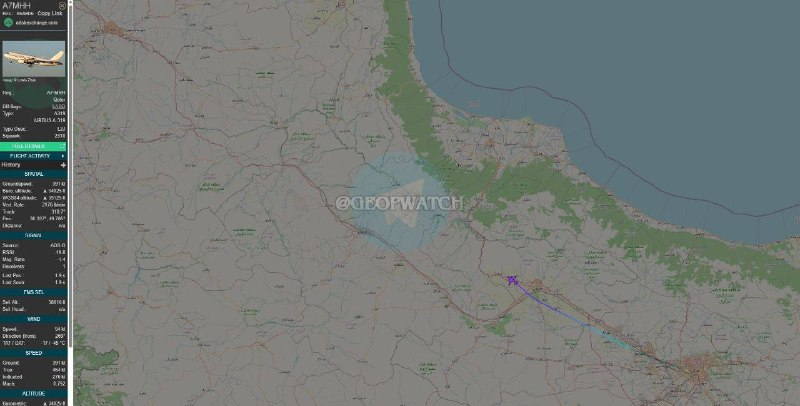

🔴هیئت ارسالی قطر که برای ارسال پیام و میانجی به تهران آمده بودند، تهران را ترک کردند.

@IranianMinds

## BBCPersian — post 281815

🖋سوچیرا مگوایر و رها کانسارا
واحد جهانی مقابله با اطلاعات نادرست، بی‌بی‌سی

داخل یک دکه کوچک بامبویی در میانمار، مین مشغول آماده کردن مغازه‌اش برای آغاز روز است.

کابل‌های درهم‌پیچیده، سامانه برق خورشیدی و مستقل از شبکه برق را به چند پریز متصل کرده‌اند. چند صندلی پلاستیکی برای مشتریان چیده شده و روی منوی دست‌نویس، نام خوراکی‌هایی نوشته شده است.

مین، که به دلایل نگرانی‌های امنیتی نامش را تغییر داده‌ایم، می‌داند مشتری‌ها قرار است مدت زیادی اینجا بمانند. آن‌ها فقط برای یک چیز به این کافه می‌آیند: اینترنت.

او می‌گوید هر روز حدود ۳۰ نفر به کافه‌اش مراجعه می‌کنند. زمانی که بیش از دو سال پیش کارش را آغاز کرد، چنین کافه‌هایی کمیاب بودند و روزانه بین ۳۰۰ تا ۴۰۰ نفر به آنجا می‌آمدند. او می‌گوید: «تقاضا سرسام‌آور بود.»

آلبوم را ورق بزنید و ادامه مطلب را از لینک زیر در وبسایت بی‌بی‌سی فارسی بخوانید.

📸BBC/ GettyImages/ LightRocket via Getty Images/ AFP via Getty Images/ Future Publishing via Getty Images/ NurPhoto via Getty Images
https://bbc.in/4ulh4m2
@BBCPersian

## BBCPersian — post 281814

  

🔻مقامات ایالت بلوچستان پاکستان در حال تحقیق درباره دزدیده شدن بیش از ۴۰۰ گوسفند ممتاز از یک دامداری تحت نظارت دولت هستند.

کارکنان این دامداری می‌گویند که گروهی از مردان مسلح سوار بر موتورسیکلت این گوسفندها را که از نژاد قره‌قل هستند، دزدیدند.

پشم گوسفند قره‌قل که به گوسفند پرشین یا ایرانی هم معروف است، ضخیم، چین‌دار، مخملی، درخشنده و بسیار قیمتی است.

این گونه از پشم لوکس محسوب می‌شود و تجارت آن سودآور است. پشم قره‌قل در صنایع مختلفی از جمله منسوجات و فرشبافی استفاده دارد. نخ حاصل از این پشم در لباس‌های ضخیم زمستانی با دوام بالا استفاده می‌شود و به‌علت تاب‌آوری بالا، پشم قره‌قل از مواد با دوام بافت قالی در پاکستان، افغانسان و ایران است.

مقامات محلی بلوچستان پاکستان می‌گویند که گوسفندها برای تحقیقات و بره‌کشی در آن مرکز نگهداری می‌شدند. آن‌ها می‌گویند که سرقتی در این ابعاد از یک مرکز دولتی کم‌سابقه است.

📷 NurPhoto via Getty Images
@BBCPersian

## Dirty_Kids — post 389987

  <a href="telegram/content/Dirty_Kids_389987_1779493284.webm" target="_blank">🎬 Download video</a>

☢️خفن ترین و‌ قدیمی ترین  انالیزور  ایران ینی دکتر بت 
👍 
🔴هیچ سایت بتی دوست نداره شما کانال دکتر بت رو پیدا کنین چون خیلی سود میکنید🤷‍♂ رایگان بهترین شرط هارو براتون میذاره حتی هزار تومن هم دریافت نمیکنه روزانه میتونی از پیش بینی فوتبال باهاش پول در بیاری…

## Dirty_Kids — post 389986

  <a href="telegram/content/Dirty_Kids_389986_1779493284.webm" target="_blank">🎬 Download video</a>

☢️خفن ترین و‌ قدیمی ترین  انالیزور  ایران ینی دکتر بت 
👍

🔴هیچ سایت بتی دوست نداره شما کانال دکتر بت رو پیدا کنین چون خیلی سود میکنید🤷‍♂

رایگان بهترین شرط هارو براتون میذاره
حتی هزار تومن هم دریافت نمیکنه
روزانه میتونی از پیش بینی فوتبال باهاش پول در بیاری 👌
A1
اگ اهل پیش بینی فوتبالی این کانال اصلا از دست ندین👇

✅https://t.me/+4_ADqwB9e-QwYjlk

✅https://t.me/+4_ADqwB9e-QwYjlk

## Dirty_Kids — post 389985

  

#بخوابیم

@Dirty_Kids 👻

## Dirty_Kids — post 389984

  

سریال (Rooster) با میانگین بیننده ۶.۵ میلیون نفر برای هر قسمت، موفق ترین سریال شبکه HBO در ۱۵ سال اخیر شده! یعنی خییییلی خفنه

این سریال در فصل اولش به یکی از ۳ سریال کمدی پربیننده تاریخ این شبکه تبدیل شده. موفقیتی خارق‌العاده به لطف استیو کارل عزیز.

@Dirty_Kids 👻

## Dirty_Kids — post 389983

  

ببخشین این سایز بزرگتر نداره؟
مثلا اندازه یه دختر ۲۳ ساله؟؟؟؟؟

@Dirty_Kids 👻

## Dirty_Kids — post 389982

به فرزندان خود راهنما زدن، دنگ دادن، حرمت نون و نمک نگه داشتن، با دهن بسته غذا خوردن و متعهد بودن رو بیاموزید.

@Dirty_Kids 👻

## Dirty_Kids — post 389981

‏جمهوری اسلامی هم مملکتمو ازم گرفت، هم زندگیمو، هم آینده‌مو، هم سلامت روانمو و هم عفّت کلاممو.

@Dirty_Kids 👻

## Dirty_Kids — post 389980

  <a href="telegram/content/Dirty_Kids_389980_1779493286.mp4" target="_blank">🎬 Download video</a>

🔴 پشماتون بریزه؛ این صحبتای مراد ویسی مربوط به ۴ سال پیشه که مو به مو اتفاقات فعلی رو پیش بینی کرده بود!

به محض اینکه ایران بره سمت بمب اتم، اسرائیل بهش حمله می‌کنه. آمریکا چه بخواد چه نخواد مجبور میشه پشت دست اسرائیل بازی کنه.
اگه جنگ بشه، آسیبی که ایران می‌بینه خیلی بیشتر از جنگ ایران و عراقه. زیرساخت های کشور نابود و ایران تقریبا ویران میشه!
متاسفانه توی جنگ چه بخواین چه نخواین، مردم عادی و غیر نظامیام کشته میشن...

@Dirty_Kids 👻

## Dirty_Kids — post 389979

  <a href="telegram/content/Dirty_Kids_389979_1779493287.mp4" target="_blank">🎬 Download video</a>

🔴 همه منتظرن ترامپ در مورد حمله به ایران صحبت کنه، ترامپ تو سخنرانی امشبش:

باور کنین من یه نابغه‌م، من تونستم این معادله رو حل کنم.
(203 × 9 ÷ 2 + 1324 − 1292) × 19‌‌

@Dirty_Kids 👻

## alonews — post 121911

  <a href="telegram/content/alonews_121911_1779493288.webm" target="_blank">🎬 Download video</a>

👈حمله هوایی اسرائیل به ساختمانی در صور در جنوب لبنان

✅ @AloNews خبر جنگ

---
📅 بروزرسانی: 1405/03/02 01:35
---

## VahidOOnLine — post 241609

  <a href="telegram/content/VahidOOnLine_241609_1779487506.mp4" target="_blank">🎬 Download video</a>

⭕️«صبحانه زنان»؛ بنیاد زنان نیویورک ۱۵۰۰ زن تاثیرگذار را در نیویورک گرد هم آورد

📌یکی از نمادهای مشهور این مراسم اهدای جایزه «عصای راه‌پیمایی» است؛ تندیسی نمادین که مفاهیمی چون قدرت، خرد و حرکت روبه‌جلو را نمایندگی می‌کند

♦️برگزارکنندگان این مراسم تاکید کردند این بنیاد طی سال‌ها توانسته است زنان آمریکایی را، فارغ از وابستگی‌های حزبی و تفاوت‌های سیاسی، کنار یکدیگر گرد آورد و از طریق فعالیت‌های مدنی، آموزشی و اقتصادی، بر جامعه آمریکا تاثیر بگذارد.

یکی از نمادهای این مراسم «عصای راه‌پیمایی» (Walking Stick Award) است؛ هدیه‌ای نمادین و دست‌ساز که با الهام از هنرهای بومی، مختص به هر فرد ساخته و تزیین و به زنان تاثیرگذار، فعالان اجتماعی و رهبران مدنی اهدا می‌شود و مفاهیمی چون قدرت، خرد و حرکت روبه‌جلو را نمایندگی می‌کند.
ایده ساخت و اهدای این عصای تزیین‌شده که گوناگونی و جمعیت رنگارنگ آمریکا را به تصویر می‌کشد، یکی از سازمان‌های تحت‌حمایت بنیاد که در حوزه توانمند سازی زنان فعالیت می‌کند، مطرح و اجرا کرد.

بیشتر بخوانید...
‌🇸🇦 Indypersian

🤖 @VahidOOnLine

## VahidOOnLine — post 241608

  

♦️بر اساس گزارش‌های تحلیلی آژانس رتبه‌بندی مودیز (Moody's)، رتبه اعتباری بلندمدت عربستان سعودی با وجود انسداد تنگه هرمز، همچنان «پایدار» است. مودیز در گزارش روز جمعه خود اعلام کرد که این تصمیم بازتاب‌دهنده اقتصاد بزرگ، ثروتمند و جایگاه رقابتی بالا و هزینه پایین تولید هیدروکربن در این کشور، در کنار بهبود اثربخشی سیاست‌ها و پیشرفت در چارچوب چشم‌انداز ۲۰۳۰ است. این آژانس تایید کرد که رشد بخش خصوصی غیرنفتی عربستان سعودی با نرخ پیش‌بینی‌شده ۴ تا ۵ درصد پس از فروکش کردن تنش‌ها، از قوی‌ترین‌ها در میان کشورهای شورای همکاری خلیج فارس خواهد بود. اگرچه اقتصاد پادشاهی سعودی به دلیل درگیری‌های جاری در خاورمیانه و انسداد عملی تنگه هرمز از اوایل ماه مارس، با کاهش ۱۰ درصدی تولید هیدروکربن و انقباض ۱.۷ درصدی کلِ جی‌دی‌پی (GDP) در سال ۲۰۲۶ مواجه است، اما مودیز پیش‌بینی می‌کند که در سال ۲۰۲۷ و با عادی‌سازی جریان تجارت، رشد اقتصادی عربستان سعودی جهش چشمگیر ۸ درصدی را تجربه کند.
طبق تحلیل سناریوی مرکزی این آژانس رتبه‌بندی، ساختار اعتباری عربستان سعودی در برابر اختلالات طولانی‌مدت و انسداد تنگه هرمز تا پایان سال ۲۰۲۶ تاب‌آور خواهد بود. این ثبات و انعطاف‌پذیری به دلیل توانایی ریاض در تغییر مسیر بخش عمده‌ای از صادرات نفت خود از طریق خط لوله شرق به غرب به سمت پایانه‌های دریای سرخ است؛ به‌طوری‌که این بنادر اکنون قادر به بارگیری تا ۵ میلیون بشکه در روز معادل نفت (دو‌سوم سطوح پیش از نزاع منطقه) هستند. علاوه بر این، جهش قیمت نفت به محدوده ۹۰ تا ۱۱۰ دلار در هر بشکه در سال ۲۰۲۶ و وجود دارایی‌های مالی قدرتمند دولت (معادل ۱۸ درصد جی‌دی‌پی در سال ۲۰۲۵)، ظرفیت بالایی را برای جذب نوسانات ایجاد کرده و درآمدها را فراتر از پیش‌بینی‌های قبل از جنگ برده است.
‌🇸🇦 Indypersian

🤖 @VahidOOnLine

## VahidOOnLine — post 241607

  

ترامپ در یک سخنرانی در سوفرن نیویورک گفت: «با عملیات خشم حماسی، رزمندگان ما اطمینان حاصل خواهند کرد که جمهوری اسلامی به عنوان بزرگ‌ترین حامی «تروریسم» دولتی در جهان، هرگز به سلاح هسته‌ای دست نخواهد یافت و خودشان هم این را می‌دانند.»
ترامپ گفت: حکومت ایران به عنوان بزرگ‌ترین حامی تروریسم دولتی، به سراسر جهان پول می‌فرستد تا مشکل ایجاد کند.

‌🏁 🇬🇧 IranintlTV

🤖 @VahidOOnLine

## VahidOOnLine — post 241606

  

خبرگزاری تسنیم، وابسته به سپاه پاسداران، به نقل از یک منبع نظامی گزارش داد نیروهای مسلح جمهوری اسلامی «به‌طور کامل» تحولات را زیر نظر دارند و در صورت آنچه «حماقت دشمن» و هرگونه بهانه‌جویی از سوی آمریکا و متحدانش خوانده شده، سناریوهای تازه‌ای آماده کرده‌اند.

به گفته این منبع، در صورت اقدام نظامی احتمالی آمریکا، «نسخه سوم مبارزه جمهوری اسلامی» اجرا خواهد شد؛ نسخه‌ای که به ادعای او در حوزه تجهیزات جدید، اهداف نوین، تاکتیک‌ها و راهبردهای جنگی نمود خواهد داشت و حتی می‌تواند جبهه‌های جدیدی در سطح فرامنطقه‌ای ایجاد کند.

این منبع نظامی همچنین مدعی شد آمریکا در صورت «زیاده‌خواهی و اقدام نظامی»، «تنبیه بزرگ سوم» را در کمتر از یک سال تجربه خواهد کرد؛ تنبیهی که به گفته او «به شکلی خاص‌تر و جدیدتر» خواهد بود.
‌🏁 🇬🇧 IranintlTV

🤖 @VahidOOnLine

## VahidOOnLine — post 241605

  

♦️تسنیم، خبرگزاری وابسته به سپاه پاسداران، روز جمعه به نقل از «یک منبع نظامی» نوشت: «نیروهای مسلح جمهوری اسلامی کاملا اوضاع را زیر نظر دارند و در صورت حماقت دشمن با هرگونه بهانه جویی، سناریوهای تازه‌ای برای آمریکا و متحدانش آماده کرده‌اند. این منبع نظامی در گفتگو با تسنیم ضمن اشاره به اینکه اگر دشمن حماقت کند، «نسخه سوم مبارزه ایران» را مشاهده خواهد کرد مدعی شد: «این نسخه سوم هم در حوزه تجهیزات جدید و هم در حوزه اهداف نوین و نیز در حوزه تاکتیک‌ها و استراتژی جنگ نمایان خواهد شد. به نحوی که جبهه‌های جدید فرامنطقه‌ای نیز آنها را پشیمان‌تر خواهد کرد. آمریکا در صورت زیاده‌خواهی و بهانه‌جویی و اقدام نظامی احتمالی، تنبیه بزرگ سوم خود را در کمتر از یکسال تجربه خواهد کرد؛ این بار به شکل خاص‌تر و جدیدتر».
‌🇸🇦 Indypersian

🤖 @VahidOOnLine

## VahidOOnLine — post 241604

  

♦️فرماندهی مرکزی آمریکا، سنتکام، با انتشار تصاویری از یک  هلیکوپتر «یو‌اچ-۱‌وای ونوم» (UH-1Y Venom) متعلق به نیروی دریایی آمریکا، جزئیاتی از عملیات‌های اخیر در چارچوب محاصره بنادر جمهوری اسلامی را به نمایش گذاشت.
سنتکام اعلام کرد این هلیکوپتر در جریان عملیات محاصره دریایی علیه بنادر جمهوری اسلامی به کار گرفته شده و توانایی اجرای ماموریت‌های مختلف از جمله رهگیری دریایی، شناسایی و پشتیبانی نزدیک رزمی را دارد.
‌🇸🇦 Indypersian

🤖 @VahidOOnLine

## VahidOOnLine — post 241603

  <a href="telegram/content/VahidOOnLine_241603_1779487511.mp4" target="_blank">🎬 Download video</a>

یک شهروند در پیامی صوتی به ایران اینترنشنال از فشار شدید در ایران و بلاتکلیفی و استرس به دلیل اظهارات دونالد ترامپ درباره امکان پایان جنگ و آتش‌بس می‌گوید. صدای او برای حفظ امنیتش با هوش مصنوعی بازخوانی شده است.
‌🏁 🇬🇧 IranintlTV

🤖 @VahidOOnLine

## VahidOOnLine — post 241602

  

♦️به گزارش اکسیوس، دونالد ترامپ، رئیس‌جمهوری آمریکا، روز جمعه با تیم ارشد امنیت ملی خود در کاخ سفید دیدار کرد تا سناریوهای مختلف در صورت شکست مذاکرات و احتمال آغاز حملات جدید علیه ایران را بررسی کند. در این نشست حساس که با حضور مقامات کلیدی از جمله جِی‌دی ونس، معاون رئیس‌جمهوری، پیت هگست، وزیر جنگ و جان راتکلیف، رئیس سی‌آی‌ای، برگزار شد، ترامپ در جریان آخرین وضعیت دیپلماسی قرار گرفت. نشانه‌های جدی از تغییر برنامه آخر هفته رئیس‌جمهوری، از جمله لغو سفر به باشگاه گلف بدمینستر، بازگشت به واشنگتن و حتی عدم شرکت در مراسم عروسی پسرش، دونالد ترامپ جوان، نشان‌دهنده وضعیت اضطراری در کاخ سفید است. منابع نزدیک به ترامپ می‌گویند او از روند کند مذاکرات ناامید شده و به سمت گزینه نظامی متمایل شده است، هرچند هنوز تصمیم قطعی برای از سرگیری جنگ اتخاذ نشده است.
در همین حال، تهران به کانون تلاش‌های دیپلماتیک «لحظه آخری» برای جلوگیری از شعله‌ور شدن دوباره جنگ تبدیل شده است. عاصم منیر، فرمانده کل ارتش پاکستان، به عنوان میانجی اصلی، در سفری حساس وارد تهران شده و قرار است با احمد وحیدی، از فرماندهان کلیدی سپاه پاسداران دیدار کند. هم‌زمان، یک هیئت قطری نیز برای پشتیبانی از این میانجی‌گری وارد پایتخت ایران شده است. با این حال، یک مقام آمریکایی روند تبادل پیش‌نویس‌ها میان طرفین را «زجرآور» و بدون پیشرفت ملموس توصیف کرده است؛ امری که نشان می‌دهد شکاف‌های موجود میان دو طرف چقدر عمیق است.
در طرف مقابل، وزارت امور خارجه ایران و رسانه‌های نزدیک به سپاه پاسداران تایید کرده‌اند که گفتگوها در جریان است اما هنوز هیچ نتیجه نهایی حاصل نشده و توافق نزدیکی در کار نیست. مقامات ایرانی تاکید دارند که تمرکز فعلی مذاکرات صرفا بر «پایان دادن به جنگ» است و تا زمانی که این هدف محقق نشود، درباره هیچ موضوع دیگری گفتگو نخواهد شد. ناظران معتقدند با وجود اینکه ترامپ در هفته‌های گذشته چندین بار تا آستانه از سرگیری جنگ پیش رفته و عقب‌نشینی کرده، اما ساعات پیش رو و احتمال رخ دادن یک گشایش ناگهانی در ۲۴ ساعت آینده، تعیین‌کننده مسیر نهایی (جنگ یا دیپلماسی) خواهد بود.
‌🇸🇦 Indypersian

🤖 @VahidOOnLine

## VahidOOnLine — post 241601

  

دونالد ترامپ، رییس جمهوری ایالات متحده، در سخنرانی خود در نیویورک درباره جنگ ایران اعلام کرد: «این ماجرا به‌زودی پایان خواهد یافت.»

او همچنین گفت که ما جمهوری اسلامی را متوقف کرده‌ایم؛ آن‌ها هرگز به سلاح هسته‌ای دست نخواهند یافت.
‌🏁 🇬🇧 IranintlTV

🤖 @VahidOOnLine

## WithYashar — post 12049

  

همکنون هواپیمای گشت دریایی چندمنظوره (بویینگ P-8 پوزایدن) و یک پهپاد ناشناس بدون شک آمریکایی بر فراز خلیج فارس !
@withyashar

## WithYashar — post 12048

هیئت قطری تهران را ترک کرد

گزارش‌ها حاکی است هیئت قطری پس از رایزنی‌های دیپلماتیک، تهران را ترک کرده است.

این سفر در حالی انجام شد که قطر در کنار پاکستان و چند کشور منطقه، در تلاش برای میانجیگری میان ایران و آمریکا جهت دستیابی به توافقی برای پایان جنگ و ادامه مذاکرات هسته‌ای بود.
@withyashar

## WithYashar — post 12047

گزارش‌های متعددی درباره برخاستن اضطراری (اسکرامبل) جنگنده‌ها از فرودگاه مهرآباد، تهران دریافت شده است.
@withyashar
جنگنده های خود رژیمن از ترسه …. شانه کسکم

## WithYashar — post 12046

کردان سمت هشتگرد صدای جنگنده میاد

## WithYashar — post 12045

یاشار جان کرج صدای جنگنده میاد
ساعت 01:06

## WithYashar — post 12044

  

فضای هوایی غرب ایران طبق یک NOTAM جدید تا صبح روز دوشنبه بسته شده است، به‌جز پروازهای روزانه (در ساعات روشنایی روز)
@withyashar

## WithYashar — post 12043

۸۹ ساعت و ۳۰ دقیقه دقیقا الان خوبه ؟
چون ویس و حتی تکست ها رو که بالا هست نمیری ‌نگاه کنی …🤬۵۰ بار گفتم

## WithYashar — post 12042

چرا ۹۰ساعت؟

## WithYashar — post 12041

دقایقی پیش بازار بورس آمریکا برای حدود ۹۰ ساعت آینده بسته شد.
@withyashar
رفتیم تو وضعیت قرمز 💥

## WithYashar — post 12040

  <a href="telegram/content/WithYashar_12040_1779487515.mp4" target="_blank">🎬 Download video</a>

یاد این سکانس افتادم 😔
@withyashar

## WithYashar — post 12039

این دوتا غذا آخری که گفتی چی هست اصن🥲🙁

## WithYashar — post 12038

## WithYashar — post 12037

ترامپ: «مسئله‌ی ایران خیلی زود تمام می‌شود و همه‌چیز به‌‌ سرعت به حالت عادی بازمی‌گردد.»
@withyashar

## WithYashar — post 12036

اتاق جنگ با شما : تهران/ولنجک صدای رد شدن پهباد میاد سمت ۰۰:۳۰
@withyashar

## WithYashar — post 12035

اتاق جنگ با شما : پدافند مشهد جای فرودگاه فعال شده
@withyashar

## WithYashar — post 12034

اکسیوس: منابع نزدیک به مذاکرات میگن توی ۲۴ ساعت آینده امکان پیشرفت وجود داره ترامپ ساعاتی پیش جلسه‌ای با تیم ارشد امنیت ملی درباره‌ی جنگ با ایران تشکیل داده بود
@withyashar

## WithYashar — post 12033

اتاق جنگ با شما : سلام داداشم پدافند اصفهان چند دقیقس فعاله
@withyashar

## WithYashar — post 12032

## WithYashar — post 12031

سلام داداش یاشار
بنظرت الان ک مقامات پاکستان تو ایرانن
بازم ممکنه امشب بزنه یا اصلا فردا؟
امکانش هست؟

## mwarmonitor — post 9507

ترامپ حرکت جدید به رقص معروف خودش اضافه کرد 🏌 @mwarmonitor

## mwarmonitor — post 9506

  <a href="telegram/content/mwarmonitor_9506_1779487517.mp4" target="_blank">🎬 Download video</a>

ترامپ حرکت جدید به رقص معروف خودش اضافه کرد 🏌

@mwarmonitor

## mwarmonitor — post 9505

  

🔴فضای هوایی غرب ایران طبق یک NOTAM جدید تا صبح روز دوشنبه بسته شده است، به‌جز پروازهای روزانه (در ساعات روشنایی روز).

@mwarmonitor

## FoxNewsTwitter — post 342148

  <a href="telegram/content/FoxNewsTwitter_342148_1779487519.mp4" target="_blank">🎬 Download video</a>

Fox News (Twitter/X)

WATCH: President Trump breaks out his staple 'YMCA' dance moves — with a bonus golf swing — as he wraps up a midterm campaign event in upstate New York.

## FoxNewsTwitter — post 342147

  <a href="telegram/content/FoxNewsTwitter_342147_1779487521.mp4" target="_blank">🎬 Download video</a>

Fox News (Twitter/X)

NEW: Tom Gorman, father of slain Sheridan Gorman, shared the devastating reality his family faces following his daughter’s murder at the hands of an illegal immigrant.

Gorman addressed the agonizing grief he and his wife endure, describing a heartbreaking moment on Mother’s Day that underscores the human cost of the border crisis.

“I am a husband who had to hold his wife on Mother’s Day when she asked the question no mother should ever have to ask. Through tears, Jess looked at Maddy and me and asked, ‘Am I still the mother of two?’ There’s no answer big enough for that pain.”

“All I could do was hold her and tell her the truth: ‘Yes, Jess. You’re still the mother of two because Sheridan will always be our daughter.’”

## FoxNewsTwitter — post 342146

  <a href="telegram/content/FoxNewsTwitter_342146_1779487523.mp4" target="_blank">🎬 Download video</a>

Fox News (Twitter/X)

BREAKING: President Trump blasts Democrats as “bulls**** artists” for trying to blame his admin for rising costs just days after he took office:

“The Democrats are the ones that caused all the costs.”

“They would constantly come out with the word ‘affordability.’ I said they’re the ones that caused the problem.”

“I’m in office two days, and the costs have gone through the roof under four years of Sleepy Joe or Crooked Joe — or both — Biden.”

“They’re the greatest ‘bulls**** artists.’”

## FoxNewsTwitter — post 342145

Fox News (Twitter/X)

BREAKING: Jessica Gorman, the mother of slain Sheridan Gorman, delivers a powerful rebuke of far-left sanctuary policies, saying that her daughter’s life was stolen by an illegal migrant who should have never been released into the community:

“No mother should ever have to wonder if her child called out for her in her final moments.”

“No mother should ever have to imagine her baby lying alone and bleeding on the cold pavement.”

“No family should ever have to bury a child because public officials failed to put innocent American lives first.”

“Please, please support leaders and policies that protect your child and mine. Because a city, a state, or a country that does not protect its children has lost its way. And together, we must be brave enough to demand that it find its way back.”

## FoxNewsTwitter — post 342144

Fox News (Twitter/X)

BREAKING: The mother of Welles Crowther — the 9/11 hero known for the red bandana he wore as he repeatedly ran back into the South Tower to save as many as 18 lives — joins President Trump on stage as he announces that Welles will posthumously receive the Presidential Medal of Freedom.

TRUMP: “I just want to congratulate his great mother on doing a phenomenal job raising that young man. Boy, what bravery. He saved those people and became a legend, in a sense. Nobody else would have done what he did.”

ALLISON CROWTHER: “It’s such a beautiful thing that even 25 years later, Welles’ light still shines brightly.”

## VahidOnline — post 75629

  

به گزارش اکسیوس، دونالد ترامپ، رئیس‌جمهوری آمریکا، روز جمعه با تیم ارشد امنیت ملی خود در کاخ سفید دیدار کرد تا سناریوهای مختلف در صورت شکست مذاکرات و احتمال آغاز حملات جدید علیه ایران را بررسی کند.

در این نشست حساس که با حضور مقامات کلیدی از جمله جِی‌دی ونس، معاون رئیس‌جمهوری، پیت هگست، وزیر جنگ و جان راتکلیف، رئیس سی‌آی‌ای، برگزار شد، ترامپ در جریان آخرین وضعیت دیپلماسی قرار گرفت.

نشانه‌های جدی از تغییر برنامه آخر هفته رئیس‌جمهوری، از جمله لغو سفر به باشگاه گلف بدمینستر، بازگشت به واشنگتن و حتی عدم شرکت در مراسم عروسی پسرش، دونالد ترامپ جوان، نشان‌دهنده وضعیت اضطراری در کاخ سفید است.
منابع نزدیک به ترامپ می‌گویند او از روند کند مذاکرات ناامید شده و به سمت گزینه نظامی متمایل شده است، هرچند هنوز تصمیم قطعی برای از سرگیری جنگ اتخاذ نشده است.

در همین حال، تهران به کانون تلاش‌های دیپلماتیک «لحظه آخری» برای جلوگیری از شعله‌ور شدن دوباره جنگ تبدیل شده است.
عاصم منیر، فرمانده کل ارتش پاکستان، به عنوان میانجی اصلی، در سفری حساس وارد تهران شده و قرار است با احمد وحیدی، از فرماندهان کلیدی سپاه پاسداران دیدار کند.
@VahidOOnLine

📡 @VahidOnline

## kianmeli1 — post 87568

🔴جمهوری اسلامی تهدیدات حمله را کاملا جدی گرفته است و تمام پایگاه ها آماده باش کامل است

باید دید آیا برنامه ترامپ حمله است یا خیر
https://t.me/kianmeli1

## kianmeli1 — post 87567

  

🔴امشب ایران آماده جنگ احتمالی شد

فضای هوایی غرب ایران طبق یک NOTAM جدید تا صبح روز دوشنبه بسته شده است، به‌جز پروازهای روزانه (در ساعات روشنایی روز).
https://t.me/kianmeli1

## kianmeli1 — post 87566

🔴دقایقی پیش بازار بورس آمریکا برای حدود ۹۰ ساعت آینده بسته شد.

اگر قرار است ترامپ فرمان حمله صادر کند امشب یا فرداشب صادر میشود
https://t.me/kianmeli1

## kianmeli1 — post 87565

🔴خبرگزاری تسنیم، وابسته به سپاه پاسداران، به نقل از یک منبع نظامی می‌گوید نیروهای مسلح ایران در حال آماده شدن برای از سرگیری احتمالی جنگ با آمریکا هستند و طرح جدیدی برای «مبارزه سوم» آماده کرده‌اند که آمریکا و متحدان آمریکا را به شیوه‌ای «جدید و خاص» هدف قرار خواهد داد.
https://t.me/kianmeli1

## kianmeli1 — post 87564

🔴طرفداران نظام در میدان انقلاب خطاب به ترامپ

حمله امشب چی شد منتظریم
https://t.me/kianmeli1

## IranIntlTV — post 338498

  

ترامپ در یک سخنرانی در سوفرن نیویورک گفت: «با عملیات خشم حماسی، رزمندگان ما اطمینان حاصل خواهند کرد که جمهوری اسلامی به عنوان بزرگ‌ترین حامی «تروریسم» دولتی در جهان، هرگز به سلاح هسته‌ای دست نخواهد یافت و خودشان هم این را می‌دانند.»
ترامپ گفت: حکومت ایران به عنوان بزرگ‌ترین حامی تروریسم دولتی، به سراسر جهان پول می‌فرستد تا مشکل ایجاد کند.

https://iranintl.com/202605221757

## IranIntlTV — post 338497

  

خبرگزاری تسنیم، وابسته به سپاه پاسداران، به نقل از یک منبع نظامی گزارش داد نیروهای مسلح جمهوری اسلامی «به‌طور کامل» تحولات را زیر نظر دارند و در صورت آنچه «حماقت دشمن» و هرگونه بهانه‌جویی از سوی آمریکا و متحدانش خوانده شده، سناریوهای تازه‌ای آماده کرده‌اند.

به گفته این منبع، در صورت اقدام نظامی احتمالی آمریکا، «نسخه سوم مبارزه جمهوری اسلامی» اجرا خواهد شد؛ نسخه‌ای که به ادعای او در حوزه تجهیزات جدید، اهداف نوین، تاکتیک‌ها و راهبردهای جنگی نمود خواهد داشت و حتی می‌تواند جبهه‌های جدیدی در سطح فرامنطقه‌ای ایجاد کند.

این منبع نظامی همچنین مدعی شد آمریکا در صورت «زیاده‌خواهی و اقدام نظامی»، «تنبیه بزرگ سوم» را در کمتر از یک سال تجربه خواهد کرد؛ تنبیهی که به گفته او «به شکلی خاص‌تر و جدیدتر» خواهد بود.
https://iranintl.com/202605226156

## IranIntlTV — post 338496

  <a href="telegram/content/IranIntlTV_338496_1779487527.mp4" target="_blank">🎬 Download video</a>

یک شهروند در پیامی صوتی به ایران اینترنشنال از فشار شدید در ایران و بلاتکلیفی و استرس به دلیل اظهارات دونالد ترامپ درباره امکان پایان جنگ و آتش‌بس می‌گوید. صدای او برای حفظ امنیتش با هوش مصنوعی بازخوانی شده است.

## Shin_Persian — post 6162

  

Faytuks Network ✓ @FaytuksNetwork
Fri, 22 May 2026 21:32:12 UTC

Details of the NOTAM

فارسی

جزئیات نوتام (NOTAM):

𝕏 · @shin_persian

## Shin_Persian — post 6161

  

Shin ✓ @hey_itsmyturn
Fri, 22 May 2026 21:37:46 UTC

Jet activity over Karaj, Alborz Province, #Iran

فارسی

فعالیت جنگنده‌ها بر فراز کرج، استان البرز، #Iran

𝕏 · @shin_persian

## Shin_Persian — post 6160

  

Shin ✓ @hey_itsmyturn
Fri, 22 May 2026 21:33:16 UTC

Received multiple reports regarding jet scramble from Mehrabad airport, Tehran
Tehran Province, #Iran

فارسی

گزارش‌های متعددی درباره برخاستن اضطراری (اسکرامبل) جنگنده‌ها از فرودگاه مهرآباد، تهران دریافت شده است.
استان تهران، #Iran

𝕏 · @shin_persian

## FarsiVOA — post 218397

🔺سناتور آمریکایی به‌دنبال تحریم کشورهای همکار با طرح عوارض‌گیری جمهوری اسلامی در تنگه هرمز

◾️به گزارش «واشنگتن فری‌بیکن»، تام کاتن، سناتور جمهوری‌خواه آمریکا، در حال تهیه طرحی قانونی است که بر اساس آن هر کشوری که به جمهوری اسلامی برای اجرای طرح دریافت عوارض در تنگه هرمز کمک کند، به‌سرعت تحریم خواهد شد.

⬇️ بیشتر بخوانید:
https://ir.voanews.com/a/8152861.html
@FarsiVOA

## FarsiVOA — post 218396

⚡️قتل شهروند مازندرانی با شلیک مستقیم مامور نیروی انتظامی؛ دو هزار ساعت خاموشی دیجیتال در ایران
@FarsiVOA

## FarsiVOA — post 218395

⚡️جزئیات ناپدید شدن مشکوک ٣ خدمه عراقی کشتی «بریج ۱ و ۲» در حوالی جزیره کیش
@FarsiVOA

## FarsiVOA — post 218394

  

⚡️دونالد ترامپ، رئیس‌جمهوری آمریکا، روز جمعه ۱ خرداد در یک سخنرانی در شهر سافرن ایالت نیویورک، با اشاره به اینکه آمریکا «بهترین و قدرتمندترین ارتش جهان» را دارد گفت «با عملیات خشم حماسی، نیروهای ما دارند اطمینان حاصل می‌کنند که [جمهوری اسلامی] ایران، بزرگ‌ترین حامی حکومتی تروریسم در جهان» و حکومت حامی تروریسم «شماره یک» در جهان دیگر هرگز موفق نشود.

او گفت جمهوری اسلامی «پولش را به سراسر دنیا می‌فرستد تا مشکل‌تراشی کند.»

آقای ترامپ گفت: «آن‌ها هرگز به سلاح هسته‌ای دست پیدا نخواهند کرد، و خودشان هم این را می‌دانند. می‌دانند. و آمریکا دوباره در حال پیروزی است.»
@FarsiVOA

## Persian_Trend_Official — post 14693

  <a href="telegram/content/Persian_Trend_Official_14693_1779487530.webm" target="_blank">🎬 Download video</a>

🔴 هیئت قطری تهران را ترک کرد

💢گزارش‌ها حاکی است هیئت قطری پس از رایزنی‌های دیپلماتیک، تهران را ترک کرده است.

💢این سفر در حالی انجام شد که قطر در کنار پاکستان و چند کشور منطقه، در تلاش برای میانجیگری میان ایران و آمریکا جهت دستیابی به توافقی برای پایان جنگ و ادامه مذاکرات هسته‌ای بود.

🫆:Tony

📌 @persian_trend_official
پرشین ترند | متفاوت‌ترین کانال نظامی

## Persian_Trend_Official — post 14692

  <a href="telegram/content/Persian_Trend_Official_14692_1779487530.mp4" target="_blank">🎬 Download video</a>

💢 ترامپ

💢باور کنید من توانستم این معادله را حل‌ کنم
!
‌‌(203 × 9 ÷2+ 1324 − 1292) × 19

🫆:Tony

📌 @persian_trend_official
پرشین ترند | متفاوت‌ترین کانال نظامی

## Persian_Trend_Official — post 14691

  <a href="telegram/content/Persian_Trend_Official_14691_1779487531.webm" target="_blank">🎬 Download video</a>

🔴 ایران بخشی از حریم هوایی غرب کشور را تا دوشنبه بست

💢گزارش‌ها حاکی است ایران بخشی از حریم هوایی غرب کشور را برای پروازهای شبانه از غروب تا طلوع خورشید تا روز دوشنبه بسته است.

🫆:Tony

📌 @persian_trend_official
پرشین ترند | متفاوت‌ترین کانال نظامی

## Persian_Trend_Official — post 14689

  <a href="telegram/content/Persian_Trend_Official_14689_1779487532.mp4" target="_blank">🎬 Download video</a>

🔥هم اکنون بندر نووروسییسک، روسیه مورد حمله موشکی پهپادی اوکراینی ها قرارگرفت،

👩‍💻☆Phantom☆

🆔 @persian_trend_official
پرشین ترند | متفاوت‌ترین کانال نظامی

## IranianMinds — post 20573

  

🔴فضای هوایی غرب ایران طبق یک NOTAMجدید تا صبح روز دوشنبه بسته شده است.

@IranianMinds

## BBCPersian — post 281813

  

🔻تولسی گابارد اعلام کرد که از سمت خود به‌عنوان مدیر اطلاعات ملی ایالات متحده آمریکا در دولت دونالد ترامپ کناره‌گیری خواهد کرد. او دلیل این تصمیم را تشخیص سرطان استخوان همسرش عنوان کرده است.

خانم گابارد در نامه استعفای خود که به دست شبکه سی‌بی‌اس نیوز رسیده، نوشته است: «قدرت و عشق او در همه چالش‌ها پشتیبان من بوده است. نمی‌توانم با وجدان آسوده از او بخواهم این مبارزه را به تنهایی پشت سر بگذارد، در حالی که من همچنان در این مسئولیت دشوار و پرمشغله باقی بمانم.»

دونالد ترامپ، رئیس جمهور آمریکا نیز در پیامی در شبکه‌های اجتماعی نوشت که گابارد «کار فوق‌العاده‌ای انجام داده و دلتنگش خواهیم شد.»

استعفای او از ۳۰ ژوئن، ۹ تیر ۱۴۰۵، اجرایی می‌شود و به گفته آقای ترامپ، آرون لوکاس، معاون اصلی مدیر اطلاعات ملی، به‌طور موقت این سمت را برعهده خواهد گرفت.

ادامه خبر را از لینک زیر در وبسایت بی‌بی‌سی فارسی بخوانید.

📷 Bloomberg via Getty Images
https://bbc.in/4dqxAv9
‌@BBCPersian

## BBCPersian — post 281812

🔻مارکو روبیو، وزیر خارجه آمریکا درحاشیه نشست وزرای خارجه کشورهای عضو ناتو با هاکان فیدان، وزیر خارجه ترکیه گفت‌وگو کرد.

آقای روبیو با اشاره به این دیدار در شبکه ایکس نوشت: «در دیدار با هاکان فیدان درباره ضرورت پایبندی همه متحدان به تعهدات دفاعی و همچنین برنامه‌های مربوط به نشست آینده ناتو در ترکیه گفت‌و‌گو کردیم.»

او همچنین گفت که در این دیدار درباره بازگشایی تنگه هرمز و تلاش برای دستیابی به ثبات در منطقه با آقای فیدان مذاکره کرده است.

نشست وزرای خارجه عضو ناتو امروز در سوئد برگزار شده است.

https://bbc.in/4nNPWtx
@BBCPersian

## Dirty_Kids — post 389978

  <a href="telegram/content/Dirty_Kids_389978_1779487535.mp4" target="_blank">🎬 Download video</a>

پرزیدنت ترامپ خطاب به شخصی که داشت در سخنرانیش شلوغ میکرد گفت “برو خونه پیش مامانت!”

@Dirty_Kids 👻

## Dirty_Kids — post 389977

  <a href="telegram/content/Dirty_Kids_389977_1779487536.mp4" target="_blank">🎬 Download video</a>

این شما و این دلقک بازی جدید ترامپ، رئیس جمهور ایالات متحده:

@Dirty_Kids 👻

## alonews — post 121910

👈عراقچی هم اکنون:
زیاده‌خواهی آمریکا مانع اصلی در روند گفتگوها است

✅ @AloNews خبر جنگ

## alonews — post 121909

  <a href="telegram/content/alonews_121909_1779487538.mp4" target="_blank">🎬 Download video</a>

👈ترامپ به سمت کاخ سفید رفت

✅ @AloNews خبر جنگ

## alonews — post 121908

  <a href="telegram/content/alonews_121908_1779487539.webm" target="_blank">🎬 Download video</a>

👈فضای هوایی غرب ایران طبق یک NOTAM جدید تا صبح روز دوشنبه بسته شده است، به‌جز پروازهای روزانه (در ساعات روشنایی روز).

✅ @AloNews خبر جنگ

## alonews — post 121907

  <a href="telegram/content/alonews_121907_1779487540.webm" target="_blank">🎬 Download video</a>

👈دقایقی پیش بازار بورس آمریکا برای حدود ۹۰ ساعت آینده بسته شد.

اگر قرار است ترامپ فرمانی صادر کند امشب یا فرداشب صادر میشود

✅ @AloNews خبر جنگ

## alonews — post 121906

  <a href="telegram/content/alonews_121906_1779487540.webm" target="_blank">🎬 Download video</a>

👈منبعی عالی‌رتبه به العربیه: فضای مذاکرات مثبت است، اما تاکنون به توافق نهایی نرسیده‌اند.

🔴«پیش‌نویس توافق آماده است که نیاز به موافقت تهران و واشنگتن دارد.»

🔴«تهران خواستار تضمین‌های روشن در مورد آزادی دارایی‌های مسدودشده و تحریم‌های نفتی است.»

🔴کار برای کاهش فاصله بین خواسته‌های مشروع ما و خواسته‌های واشنگتن در جریان است

✅ @AloNews خبر جنگ

## alonews — post 121905

  <a href="telegram/content/alonews_121905_1779487540.mp4" target="_blank">🎬 Download video</a>

👈کسشرهای ترامپ تموم؛ آخرش هم یه رقص معروفشو زد قمار باز

‎
✅ @AloNews خبر جنگ

## alonews — post 121904

  <a href="telegram/content/alonews_121904_1779487542.webm" target="_blank">🎬 Download video</a>

👈 ترامپ: «مسئله‌ی ایران خیلی زود تمام می‌شود و همه‌چیز به‌‌ سرعت به حالت عادی بازمی‌گردد.»

✅ @AloNews خبر جنگ

## alonews — post 121903

  <a href="telegram/content/alonews_121903_1779487542.webm" target="_blank">🎬 Download video</a>

👈یک مقام ایرانی به المانیتور گفت که «برخی ایده‌ها و متون جدید بین دو طرف مبادله شده است.»

🔴این مقام افزود: «این فقط می‌تواند مبنایی برای گفتگو بین ایران و ایالات متحده باشد. به معنای توافقی نیست که بتوان آن را اعلام کرد.»

✅ @AloNews خبر جنگ

---
📅 بروزرسانی: 1405/03/02 00:26
---

## VahidOOnLine — post 241600

  

اکسیوس به نقل از دو مقام آمریکایی اعلام کرد که ترامپ صبح جمعه نشستی با اعضای ارشد تیم امنیت ملی خود درباره جنگ ایران برگزار کرد.
اکسیوس نوشت به گفته منابعی که مستقیما با ترامپ گفت‌وگو کردند، او در حال بررسی حملات جدید است، مگر اینکه پیشرفتی در مذاکرات در آخرین لحظه حاصل شود.
‌🏁 🇬🇧 IranintlTV

🤖 @VahidOOnLine

## VahidOOnLine — post 241599

  

♦️دونالد ترامپ روز جمعه، اول خردادماه، طی سخنرانی در نیویورک درباره جنگ با ایران گفت که «این ماجرا به‌زودی تمام خواهد شد». رئیس‌جمهوری آمریکا گفت: «اگر جلوی ایران را نگیریم، آنها به سلاح هسته‌ای دست پیدا می‌کنند. مجبوریم این کار را بکنیم، و ما جلوی آنها را گرفتیم. آنها هرگز به سلاح هسته‌ای دست پیدا نخواهند کرد».
‌🇸🇦 Indypersian

🤖 @VahidOOnLine

## VahidOOnLine — post 241598

  

آسوشیتدپرس به نقل از یک مقام آمریکایی اعلام کرد ارتش آمریکا تاکنون هیچ مین انفجاری در تنگه هرمز کشف یا خنثی نکرده است.
این مقام آمریکایی افزود عملیات جست‌وجو در این گذرگاه حیاتی نفتی همچنان ادامه دارد، اما تاکنون هیچ مین دریایی پیدا نشده است.

این در حالی است که محاصره دریایی بنادر جنوب ایران همچنان ادامه دارد.
‌🏁 🇬🇧 IranintlTV

🤖 @VahidOOnLine

## VahidOOnLine — post 241597

♦️ویدیوی منتشرشده در شبکه‌های اجتماعی، جشن تولد خانواده امیرمحمد خیاط بر سر مزار او را نشان می‌دهد؛ جایی که پدر این قهرمان تکواندو با چهره‌ای اندوهگین و بغض‌آلود، بر مزار فرزندش رقصی سوگوارانه انجام می‌دهد.
امیرمحمد خیاط ۱۸ دی‌ماه ۱۴۰۴ در اطراف میدان خیام نیشابور با شلیک نیروهای سرکوب جمهوری اسلامی کشته شد.
او متولد ۲۶ اردیبهشت ۱۳۸۲ بود و از نوجوانی در رشته تکواندو فعالیت می‌کرد. امیرمحمد طی سال‌های اخیر بیش از ۲۰ عنوان قهرمانی، نایب‌قهرمانی و مقام سوم رقابت‌های استانی و باشگاهی را به دست آورده بود.
‌🇸🇦 Indypersian

🤖 @VahidOOnLine

## VahidOOnLine — post 241596

  

♦️عباس عراقچی، وزیر خارجه جمهوری اسلامی روز جمعه با آنتونیو گوترش، دبیرکل سازمان ملل متحد، تلفنی گفتگو کرد. به گزارش ایرنا، در این گفتگو، علاوه بر بررسی آخرین وضعیت منطقه‌، دو طرف روند تحولات مرتبط با دیپلماسی میان تهران و واشنگتن با میانجی‌گری اسلام‌آباد را بررسی کردند.
هم‌زمان با این گفتگو، عاصم منیر، فرمانده کل ارتش پاکستان و محسن نقوی، وزیر کشور این کشور در سفری از پیش اعلام‌نشده وارد تهران شدند؛ سفری که هدف اصلی آن، حل اختلافات میان تهران و واشنگتن برای امضای تفاهم‌نامه اولیه شروع مذاکرات عنوان شده است. همچنین سخنگوی وزارت خارجه ایران از حضور یک هیئت قطری در تهران در چارچوب «مساعی جمیله» برای کاهش تنش‌ها خبر داد، هرچند تاکید کرد که پاکستان همچنان میانجی رسمی این گفتگوهاست. با وجود این تحرکات، اسماعیل بقایی با «عمیق و جدی» خواندن شکاف‌های میان ایران و آمریکا اعلام کرد که تمرکز فعلی مذاکرات بر پایان دادن به جنگ است، مسئله هسته‌ای هنوز در دستور کار نیست و نمی‌توان گفت که توافق در هفته‌ها یا ماه‌های آینده نزدیک خواهد بود.
‌🇸🇦 Indypersian

🤖 @VahidOOnLine

## VahidOOnLine — post 241595

  

خبرگزاری تسنیم، رسانه‌ها وابسته به سپاه، به نقل از یک منبع نزدیک به هیات مذاکره‌کننده، نوشت: «گفت‌وگوها و رایزنی‌ها بر سر موارد اختلافی همچنان ادامه دارد و هنوز نتیجه نهایی حاصل نشده است.»

این رسانه وابسته به سپاه افزود: «میانجی پاکستانی همچنان در حال رد و بدل موضوعات است.»

تسنیم ادامه داد تمرکز در حال حاضر بر سر مسئله «پایان جنگ» است و تا وقتی این موضوع نهایی نشود، هیچ مساله دیگری مذاکره نخواهد شد.
‌🏁 🇬🇧 IranintlTV

🤖 @VahidOOnLine

## VahidOOnLine — post 241594

  <a href="telegram/content/VahidOOnLine_241594_1779483415.mp4" target="_blank">🎬 Download video</a>

یک شهروند در پیامی به ایران اینترنشنال از اوضاع اقتصادی در کشور روایت می‌کند و می‌گوید به دلیل کمبود آرد نانوایی‌ها با اختلال در فعالیت و صف‌های طولانی مواجه‌اند. پیام او با هوش مصنوعی خوانده شده است.
‌🏁 🇬🇧 IranintlTV

🤖 @VahidOOnLine

## VahidOOnLine — post 241593

  

♦️ راجر ویکر از ایالت می‌سی‌سی‌پی، سناتور جمهوری‌خواه، روز جمعه اول خرداد پیشنهاد کرد که ایالات متحده نباید به دنبال توافق با جمهوری اسلامی باشد، بلکه باید اقدامات نظامی خود را از سر بگیرد. او افزود: «ما باید کاری را که شروع کرده‌ایم تمام کنیم.»

ویکر که ریاست کمیته نیروهای مسلح سنای آمریکا را بر عهده دارد، در شبکه اجتماعی ایکس نوشت که به دونالد ترامپ «مشاوره‌های غلطی داده می‌شود تا به دنبال توافقی برود که ارزش کاغذی که روی آن نوشته می‌شود را هم نخواهد داشت.»

او در ادامه نوشت: «فرمانده کل قوای ما باید به نیروهای مسلح ماهر آمریکا اجازه دهد تا نابودی توانمندی‌های نظامی متعارف ایران را کامل کرده و تنگه [هرمز] را بازگشایی کنند.»

ویکر همچنین هشدار داد: «تلاش بیشتر برای دستیابی به توافق با رژیم اسلام‌گرای ایران، خطر برداشتِ ضعف [از سوی آمریکا] را به همراه دارد. ما باید کاری را که آغاز کرده‌ایم به پایان برسانیم. زمان عمل فرارسیده است.»
‌🇸🇦 Indypersian

🤖 @VahidOOnLine

## VahidOOnLine — post 241592

  <a href="telegram/content/VahidOOnLine_241592_1779483418.mp4" target="_blank">🎬 Download video</a>

♦️دونالد ترامپ، رئیس‌جمهوری ایالات متحده، روز جمعه اول خردادماه با ورود به نیویورک برای حضور در یک رویداد اقتصادی در کالج راکلند راهی نیوجرسی دراین ایالت شد.
در ویدیوی منتشرشده، ترامپ از داخل خودرو رئیس جمهوری به خبرنگاران دت تکان می دهد.
بر اساس برنامه اعلام‌شده، ترامپ قرار است به‌زودی در این مرکز آموزشی درباره وضعیت اقتصاد آمریکا سخنرانی کند.
‌🇸🇦 Indypersian

🤖 @VahidOOnLine

## VahidOOnLine — post 241591

  

قاسم رضایی، جانشین فرمانده کل انتظامی جمهوری اسلامی گفت: «دیگر تمرکز صرف بر فعالیت‌های پلیسی نیست و نظام دفاعی و آمادگی برای مواجهه با جنگ نامتقارن در اولویت قرار گرفته است.»

او افزود: «نیروها باید آموزش عملی ببینند و تمرینات میدانی داشته باشند. پلیس راه و راهور علاوه بر وظایف ترافیکی، آموزش دفاعی و آمادگی عملی می‌بیند.»

او افزود: «تمرین در خیابان و شرایط واقعی باعث افزایش توانمندی نیروها می‌شود.»
‌🏁 🇬🇧 IranintlTV

🤖 @VahidOOnLine

## WithYashar — post 12030

پرزیدنت ترامپ:

من از ناهار خوردن با کسی که واقعاً واقعاً موفق است متنفرم، زیرا او مدام در مورد اینکه چقدر عالی هستند لاف می زند و این باعث می شود در مورد اینکه رئیس جمهور شدم صحبت نکنم.

ترامپ : ما جلوی ایران رو گرفتیم اونها هرگز نباید سلاح هسته ای داشته باشن
@withyashar

## WithYashar — post 12029

## WithYashar — post 12028

## WithYashar — post 12027

  <a href="https://t.me/withyashar/12027" target="_blank">📎 Download file</a>

کتابی از دونالد ترامپ یکی از بحث برانگیز ترین شخصیت های سیاسی جهان.
رئیس جمهور آمریکا دونالد جی ترامپ ، جهان بینی حرفه ای و شخصی خود را در این کتاب جذاب و خواندنی بیان می کند، روایتی دست اول از ظهور مهمترین معامله گر آمریکا.

دونالد ترامپ : هنر معامله گری

🌐 @withyashar

🌐 instagram.com/yashar

## WithYashar — post 12026

  <a href="telegram/content/WithYashar_12026_1779483420.mp4" target="_blank">🎬 Download video</a>

من باهوش‌ترین آدمی هستم که تا حالا باهاش روبه‌رو می‌شید✌🏾
@withyashar
یاشار : چقدر بجا و به موقع این حرف رو زد !!!

## WithYashar — post 12025

@withyashar حسود هرگز نیاسود

## WithYashar — post 12024

  <a href="telegram/content/WithYashar_12024_1779483421.mp4" target="_blank">🎬 Download video</a>

ترامپ : اعتراض کردن تو تجمع‌های من خطرناکه من چیزای خطرناک دوست ندارم دوست ندارم ببینم کسی کتک می‌خوره پس این کارو نکنید
@withyashar

## WithYashar — post 12023

  <a href="telegram/content/WithYashar_12023_1779483422.mp4" target="_blank">🎬 Download video</a>

ترامپ شاکی شد 😬 از اونی که اومد فحش داد
@withyashar

## WithYashar — post 12022

  <a href="telegram/content/WithYashar_12022_1779483424.mp4" target="_blank">🎬 Download video</a>

ترامپ به یک معترض:

برو خونه، پیش ننت
@withyashar

## WithYashar — post 12021

  <a href="telegram/content/WithYashar_12021_1779483425.mp4" target="_blank">🎬 Download video</a>

دونالد ترامپ در‌ نیویورک:

من ۹۹٪ رأی نیروهای اجرای قانون را گرفتم می‌توانید باور کنید؟
هنوز داریم تلاش می‌کنیم بفهمیم آن ۱٪ چه کسی بوده است.
@withyashar

## WithYashar — post 12020

داداشی میشه جریان علی کریمی رو یکم باز کنی الا از شاهزاده حمایت نمیکنه ؟

## WithYashar — post 12019

داداشی میشه جریان علی کریمی رو یکم باز کنی
الا از شاهزاده حمایت نمیکنه ؟

## WithYashar — post 12018

@withyashar

## WithYashar — post 12017

پنتاگون ویدئویی از بشقاب پرنده انتشار داده که چند سال پیش با فاصله ای بسیار نزدیک از کنار قایقهای تندروی سپاه عبور میکند … @withyashar یاشار : این سپاهی ها آدم فضایی هم دیدند ولی اون دوستمون این جمعه هم نیامد😬

## WithYashar — post 12016

آدم فضایی دیدیم ولی موشتبی رو ندیدیم

## WithYashar — post 12015

بذار تریاکامو بفروشم ۱۰۰دلار برات میزنم

## WithYashar — post 12014

بذار تریاکامو بفروشم ۱۰۰دلار برات میزنم

## WithYashar — post 12013

## WithYashar — post 12012

## WithYashar — post 12011

آکسیوس، به نقل از یک منبع نزدیک به ترامپ: رئیس جمهور احتمال آغاز یک عملیات نظامی بزرگ دیگر، اعلام پیروزی و پایان دادن به جنگ را مطرح کرد
@withyashar

## mwarmonitor — post 9504

🔴اکسیوس: ترامپ در بحبوحه بررسی احتمال بازگشت به جنگ، با مشاوران ارشد خود درباره ایران تشکیل جلسه داد

📝نویسنده: باراک راوید

🔰به گفته دو مقام آمریکایی به «اکسیوس»، پرزیدنت ترامپ صبح روز جمعه جلسه‌ای را با تیم امنیت ملی ارشد خود درباره جنگ با ایران برگزار کرد.

📌چرا این موضوع اهمیت دارد؟
منابعی که مستقیماً با رئیس‌جمهور گفتگو کرده‌اند می‌گویند ترامپ در صورت عدم دستیابی به یک گشایش ناگهانی و دقیقه‌نودی در مذاکرات، به‌طور جدی در حال بررسی آغاز حملات جدید علیه ایران است.

نمای دوقاب (تحولات هم‌زمان):
نشست ترامپ درباره ایران در حالی برگزار شد که رئیس ارتش پاکستان، فیلد مارشال عاصم منیر، در تلاشی آشکار و دقیقه‌نودی برای پر کردن شکاف‌ها و جلوگیری از سرگیری جنگ، به تهران سفر کرده است.
یک هیئت قطری نیز روز جمعه برای حمایت از تلاش‌های میانجی‌گرانه وارد تهران شد.
انتظار می‌رود عاصم منیر روز شنبه با سردار احمد وحیدی، از فرماندهان سپاه پاسداران و مهره‌ای کلیدی در فرآیند تصمیم‌گیری ایران، دیدار کند.
یک مقام آمریکایی که در جریان تلاش‌های دیپلماتیک قرار گرفته است، روند مذاکرات را «طاقت‌فرسا» توصیف کرد. این مقام آمریکایی گفت که پیش‌نویس‌ها «هر روز بین طرفین رد و بدل می‌شوند» اما پیشرفت چندانی حاصل نشده است.
حاضران در اتاق جلسه:
به گفته منابع آگاه، در این نشست علاوه بر ترامپ، جی‌دی ونس (معاون رئیس‌جمهور)، پیت هگست (وزیر دفاع)، جان راتکلیف (رئیس سی‌آی‌ای)، سوزی وایلز (رئیس کارکنان کاخ سفید) و دیگر مقامات حضور داشتند.
مارکو روبیو (وزیر امور خارجه) و ژنرال دن کین (رئیس ستاد مشترک ارتش) در این جلسه حضور نداشتند؛ چرا که روبیو در اروپا بود و ژنرال کین در مراسم فارغ‌التحصیلی آکادمی نیروی دریایی حضور داشت.
در طول این جلسه، گزارشی از آخرین وضعیت مذاکرات و سناریوهای مختلف در صورت فروپاشی گفتگوها به ترامپ ارائه شد.
نکات جالب و پشت‌پرده:
چند ساعت پس از این دیدار، کاخ سفید از تغییر در برنامه آخر هفته ترامپ خبر داد.
او پس از سخنرانی برنامه‌ریزی‌شده خود در غروب جمعه در نیویورک، به جای اقامت در باشگاه گلف خود در بد مینستر، به واشنگتن بازخواهد گشت.
ترامپ همچنین در حساب کاربری خود در شبکه اجتماعی «تروث سوشال» نوشت که به دلیل «مسائل مربوط به دولت و عشق به ایالات متحده آمریکا» در مراسم عروسی پسرش، دان جونیور، در این آخر هفته شرکت نخواهد کرد.
او نوشت: «احساس می‌کنم برای من مهم است که در این بازه زمانی حساس، در واشنگتن دی‌سی و در کاخ سفید بمانم.»
در پشت صحنه چه می‌گذرد؟
یک منبع نزدیک به ترامپ و منبع دوم دیگری که از شرایط آگاهی دارد به اکسیوس گفتند که ترامپ طی چند روز گذشته به شدت از روند مذاکرات با ایران ناامید و کلافه شده است.
به گفته این دو منبع، او روز سه‌شنبه به بنیامین نتانیاهو، نخست‌وزیر اسرائیل گفت که می‌خواهد شانس دیگری به دیپلماسی بدهد، اما تا پنجشنبه‌شب، نظرش بیشتر به سمت صدور فرمان حمله متمایل شده بود.
یک منبع نزدیک به ترامپ گفت رئیس‌جمهور احتمال یک عملیات نظامی بزرگ و «تعیین‌کننده» نهایی را مطرح کرده است تا پس از آن بتواند اعلام پیروزی کند و به جنگ پایان دهد.
با این حال، هنوز هیچ نشانه‌ای مبنی بر اینکه ترامپ تصمیم قطعی برای سرگیری جنگ گرفته باشد، وجود ندارد.
موضع طرف مقابل:
وزارت امور خارجه ایران روز جمعه اعلام کرد که گفتگوها در جریان است اما توافق نزدیکی در کار نیست.
خبرگزاری نیمه‌رسمی تسنیم، وابسته به سپاه پاسداران، روز جمعه به نقل از یک منبع نزدیک به تیم مذاکره‌کننده ایران نوشت: «گفتگوها پیرامون موضوعات مورد اختلاف همچنان ادامه دارد و هنوز نتیجه نهایی حاصل نشده است.»
🔹این منبع مدعی شد که تمرکز فعلی بر «پایان دادن به جنگ» است و تا زمانی که این هدف محقق نشود، در مورد هیچ موضوع دیگری مذاکره نخواهد شد.

🔸تحلیل واقعیتِ میان خطوط:
ترامپ طی شش هفته گذشته چندین بار تا آستانه سرگیری جنگ پیش رفته اما در نهایت از آن صرف‌نظر کرده است.
برخی منابع نزدیک به مذاکرات همچنان بر این باورند که در ۲۴ ساعت آینده فرصتی برای نوعی گشایش وجود دارد.
با این حال، دو منبع آگاه از طرز تفکر ترامپ می‌گویند او تمایل دارد اقدام نظامی را پیش ببرد، مگر اینکه اتفاق غیرمنتظره‌ای در گفتگوها رخ دهد.

@mwarmonitor

## mwarmonitor — post 9503

🔴وال‌استریت ژورنال:

🔸میانجی‌ها به‌شدت در تلاش هستند تا به یک توافق موقت میان ایران و ایالات متحده دست پیدا کنند تا از انجام حملات جدید آمریکا–اسرائیل جلوگیری شود؛ حملاتی که مقام‌ها هشدار داده‌اند ممکن است ظرف چند روز آینده رخ دهند.

🔹پاکستان، قطر و دیگر بازیگران منطقه‌ای در حال تلاش برای پر کردن شکاف‌ها درباره برنامه هسته‌ای ایران، کاهش تحریم‌ها و امنیت منطقه‌ای هستند.

🔸هدف، رسیدن به یک توافق کامل نیست، بلکه ایجاد یک چارچوب موقت است که آتش‌بس را تمدید کند و اجازه دهد مذاکرات گسترده‌تر ادامه پیدا کند.

@mwarmonitor

## FoxNewsTwitter — post 342143

  <a href="telegram/content/FoxNewsTwitter_342143_1779483426.mp4" target="_blank">🎬 Download video</a>

Fox News (Twitter/X)

JUST IN: President Trump rips the Biden admin’s electric vehicle mandate, warning that the power grid cannot support a forced transition to EVs:

“We ended Joe Biden’s insane electric vehicle mandate. That’s where they wanted everybody to buy an electric car.”

“If we would build the charging booths, right? It would cost the country $4 trillion. No country can afford that.”

“We love electric cars. I have to say that because of Elon.”

“Not everybody wants to have an electric car. And I ended that whole nonsense. By 2030, you’re all going to have electric cars? I don’t think so.”

## FoxNewsTwitter — post 342142

  <a href="telegram/content/FoxNewsTwitter_342142_1779483428.mp4" target="_blank">🎬 Download video</a>

Fox News (Twitter/X)

NEW: President Trump praises his admin's move to bring automotive manufacturing jobs back to the U.S. from overseas.

“They were all made in Germany and other countries. Now they're making them here because if they don't, they have to pay a big penalty."

"They're stamping them at my instruction 'Made in the USA.'"

## FoxNewsTwitter — post 342141

  <a href="telegram/content/FoxNewsTwitter_342141_1779483430.mp4" target="_blank">🎬 Download video</a>

Fox News (Twitter/X)

NEW: President Trump slams Democrats for spending millions on a political “autopsy” before asking a roaring crowd which nickname for Joe Biden they like best:

“They spent $10 million for the autopsy. It was called an autopsy. And they had typos. They had typos in every other sentence. They had misspelled words. They had commas in the wrong locations.”

“I could have given them the autopsy without any charge at all.”

“I said you had one candidate named Sleepy Joe Biden.”

## FoxNewsTwitter — post 342140

  

Fox News (Twitter/X)

WATCH LIVE: President Trump lands in New York to deliver remarks https://twitter.com/i/broadcasts/1wGWjjaaqyZKQ

## FoxNewsTwitter — post 342139

  <a href="telegram/content/FoxNewsTwitter_342139_1779483432.mp4" target="_blank">🎬 Download video</a>

Fox News (Twitter/X)

NOW: Crowd erupts with “USA” chants as a protester is kicked out for interrupting President Trump’s midterm campaign event in upstate New York.

“Take him home to mommy.”

## FoxNewsTwitter — post 342138

  <a href="telegram/content/FoxNewsTwitter_342138_1779483434.mp4" target="_blank">🎬 Download video</a>

Fox News (Twitter/X)

NEW: President Trump torches Democrats’ progressive agenda, slamming open borders, sanctuary cities, and gender policies targeting minors:

“We don’t want open borders where prisoners pour in from other countries all over the world.”

“We don’t want sanctuary cities where you have sanctuary for criminals. We don’t want it.”

“We don’t want transgender mutilation of your children, if that’s okay. We don’t want it.”

## FoxNewsTwitter — post 342137

  <a href="telegram/content/FoxNewsTwitter_342137_1779483436.mp4" target="_blank">🎬 Download video</a>

Fox News (Twitter/X)

NOW: New York crowd chants "4 more years" for President Trump.

"We have a hat. The hat says '4 more years.' It drives the radical left lunatics crazy."

## FoxNewsTwitter — post 342136

  <a href="telegram/content/FoxNewsTwitter_342136_1779483438.mp4" target="_blank">🎬 Download video</a>

Fox News (Twitter/X)

BREAKING: President Trump tells a New York crowd that he's working to bring his home state back to greatness:

“I was born and raised in New York State. My heart has always been here. I love this place, and we’ve got to straighten it out.”

“From the beginning, this was a symbol of American excellence and American grit — and really, the American Dream.”

“Unfortunately, in recent years, the state’s been held back by bad policies, bad politicians, and foolish radical left idiocy."

## FoxNewsTwitter — post 342135

  <a href="telegram/content/FoxNewsTwitter_342135_1779483440.mp4" target="_blank">🎬 Download video</a>

Fox News (Twitter/X)

NOW: New York Giants quarterback Jaxson Dart introduces President Trump before his speech in New York.

## FoxNewsTwitter — post 342134

  

Fox News (Twitter/X)

WATCH LIVE: President Trump lands in New York to deliver remarks https://twitter.com/i/broadcasts/1aJbdbjjmbqKX

## pm_afshaa — post 91231

  

🚀 آبان‌نت؛ سرعت بی‌مرز، بدون تاریخ انقضا!

⚡دنبال کیفیتی می‌گردی که حجمت رو بی‌دلیل تموم نکنه؟

💎 ویژگی‌های طلایی:
• 
✅ بدون محدودیت زمان و کاربر: تا آخرین کیلوبایت حجمت معتبره!
• 
✅ مصرف واقعی (۱ به ۱): بدون ضریب مصرف و دزدی حجم.
• 
✅ پینگ عالی: مخصوص گیمرهای حرفه‌ای و یوتیوب.
• 
☄️ تنوع سرویس: V2ray، OpenVPN،L2tp و Wireguard.

💳 پرداخت راحت بصورت ریالی و ارزی

💰 قیمت‌های ما را مقایسه کنید!
برای استعلام قیمت استثنایی و مشاوره به آیدی زیر پیام دهید:

🆔 @itsmammad10
🔗 کانال اصلی ما:

🆔 @AbanVpn10

## pm_afshaa — post 91230

  <a href="telegram/content/pm_afshaa_91230_1779483443.webm" target="_blank">🎬 Download video</a>

🔴تمام امتحانات سال جاری دانشگاه پیام نور در سراسر کشور مجازی شد.

💧 Rainbet.com the #1 Non-KYC Crypto Casino & Sportsbook @rainbetcom

😁 @Pm_Afshaa

## pm_afshaa — post 91229

  <a href="telegram/content/pm_afshaa_91229_1779483443.mp4" target="_blank">🎬 Download video</a>

🔴ترامپ: من ۹۹٪ رأی نیروهای اجرای قانون رو گرفتم میتونید باور کنید؟ هنوز داریم تلاش می‌کنیم بفهمیم آن ۱٪ چه کسی بوده.

💧 Rainbet.com the #1 Non-KYC Crypto Casino & Sportsbook @rainbetcom

😁 @Pm_Afshaa

## pm_afshaa — post 91228

  <a href="telegram/content/pm_afshaa_91228_1779483445.webm" target="_blank">🎬 Download video</a>

🔴منابع نزدیک به کاخ سفید:
با داغ‌تر شدن درگیری‌های نظامی تو ایران، ترامپ برنامه‌هاشو عوض کرده و قراره آخر هفته رو تو کاخ سفید بمونه.

💧 Rainbet.com the #1 Non-KYC Crypto Casino & Sportsbook @rainbetcom

😁 @Pm_Afshaa

## pm_afshaa — post 91227

  <a href="telegram/content/pm_afshaa_91227_1779483445.webm" target="_blank">🎬 Download video</a>

🔴اکسیوس به نقل از یک منبع نزدیک به ترامپ: ترامپ احتمال اجرای یک عملیات نهایی و گسترده رو مطرح کرده؛ عملیاتی که بعدش بتونه اعلام پیروزی کنه و بگه جنگ تموم شده. 
💧 Rainbet.com the #1 Non-KYC Crypto Casino & Sportsbook @rainbetcom 
😁 @Pm_Afshaa

## pm_afshaa — post 91226

  <a href="telegram/content/pm_afshaa_91226_1779483446.webm" target="_blank">🎬 Download video</a>

🔴اکسیوس به نقل از یک منبع نزدیک به ترامپ: ترامپ احتمال اجرای یک عملیات نهایی و گسترده رو مطرح کرده؛ عملیاتی که بعدش بتونه اعلام پیروزی کنه و بگه جنگ تموم شده.

💧 Rainbet.com the #1 Non-KYC Crypto Casino & Sportsbook @rainbetcom

😁 @Pm_Afshaa

## kianmeli1 — post 87563

‏🔴اکسیوس به نقل از دو مقام آمریکایی اعلام کرد که دونالد ترامپ صبح جمعه نشستی با اعضای ارشد تیم امنیت ملی خود درباره جنگ ایران برگزار کرد
https://t.me/kianmeli1

## kianmeli1 — post 87562

  

🔴سایت انصاف‌نیوز از دسترس خارج شد.

این سایت روز گذشته نوشته بود:
« شنیده‌ی انصاف نیوز حاکی است که سعید جلیلی مدتی است در جلسات شعام شرکت نمی‌کند.»
https://t.me/kianmeli1

## kianmeli1 — post 87561

🔴ترامپ درباره تست شناختی : بایدن حتی سوال اول رو هم نمی‌تونست جواب بده

فکر نمی‌کنم بتونه بگیره اینا رو
کدوم خرسه کدوم اسبه
https://t.me/kianmeli1

## kianmeli1 — post 87560

  <a href="telegram/content/kianmeli1_87560_1779483447.mp4" target="_blank">🎬 Download video</a>

🔴ترامپ:من باهوش‌ترین آدمی هستم که شما ممکن است ببینید
https://t.me/kianmeli1

## kianmeli1 — post 87559

  <a href="telegram/content/kianmeli1_87559_1779483448.mp4" target="_blank">🎬 Download video</a>

🔴ترامپ: ما اینقدر نفت از ونزوئلا استخراج کرده‌ایم(چاپیدیم) که هزینه جنگ را حدود ۲۵ برابر پرداخت کرده‌ایم.
https://t.me/kianmeli1

## kianmeli1 — post 87558

  

🔴سناتور گراهام:

من معتقدم آزادی مردم شگفت‌انگیز کوبا از چنگال کمونیسم نزدیک است.

(ایران رو آباد کردن رفتن سراغ کوبا)
https://t.me/kianmeli1

## kianmeli1 — post 87557

  

🔴منبع نزدیک به کاخ سفید :
با داغ‌تر شدن درگیری‌های نظامی با رژیم ملاها، پرزیدنت ترامپ برنامه‌هایش را عوض کرده و قرار است آخر هفته را در کاخ سفید بماند
https://t.me/kianmeli1

## IranIntlTV — post 338495

  

دونالد ترامپ، رییس جمهوری ایالات متحده، در سخنرانی خود در نیویورک درباره جنگ ایران اعلام کرد: «این ماجرا به‌زودی پایان خواهد یافت.»

او همچنین گفت که ما جمهوری اسلامی را متوقف کرده‌ایم؛ آن‌ها هرگز به سلاح هسته‌ای دست نخواهند یافت.
https://iranintl.com/202605220706

## IranIntlTV — post 338494

  

اکسیوس به نقل از دو مقام آمریکایی اعلام کرد که ترامپ صبح جمعه نشستی با اعضای ارشد تیم امنیت ملی خود درباره جنگ ایران برگزار کرد.
اکسیوس نوشت به گفته منابعی که مستقیما با ترامپ گفت‌وگو کردند، او در حال بررسی حملات جدید است، مگر اینکه پیشرفتی در مذاکرات در آخرین لحظه حاصل شود.
https://iranintl.com/202605229907

## IranIntlTV — post 338493

  

آسوشیتدپرس به نقل از یک مقام آمریکایی اعلام کرد ارتش آمریکا تاکنون هیچ مین انفجاری در تنگه هرمز کشف یا خنثی نکرده است.
این مقام آمریکایی افزود عملیات جست‌وجو در این گذرگاه حیاتی نفتی همچنان ادامه دارد، اما تاکنون هیچ مین دریایی پیدا نشده است.

این در حالی است که محاصره دریایی بنادر جنوب ایران همچنان ادامه دارد.
https://iranintl.com/202605224264

## IranIntlTV — post 338492

  <a href="telegram/content/IranIntlTV_338492_1779483452.mp4" target="_blank">🎬 Download video</a>

مشاور رییس دولت امارات متحده عربی گفت برخی کشورهای عربی اکنون جمهوری اسلامی را تهدیدی بزرگ‌تر از اسرائیل می‌بینند.

به گفته او، حملات جمهوری اسلامی نگاه امنیتی منطقه را تغییر داده و باعث شده همکاری برخی دولت‌های عربی با اسرائیل اهمیت بیشتری پیدا کند.
@iranintltv

## IranIntlTV — post 338491

  <a href="telegram/content/IranIntlTV_338491_1779483454.mp4" target="_blank">🎬 Download video</a>

پیام‌های رسیده به ایران‌اینترنشنال نشان می‌دهد مشکلات در تامین برخی کالاهای ضروری و اساسی در ایران همچنان ادامه دارد.

شهروندان در شهرهای مختلف همچنین از کمبود بنزین خبر می‌دهند.

گفت‌وگو با معصومه طاهرخانی، تحلیل‌گر اقتصادی
@iranintltv

## IranIntlTV — post 338490

  <a href="telegram/content/IranIntlTV_338490_1779483456.mp4" target="_blank">🎬 Download video</a>

همزمان با سفر هیاتی از پاکستان به ریاست فرمانده ارتش و رییس اطلاعات این کشور به تهران برای پیشبرد مذاکرات، قطر نیز در هماهنگی با آمریکا تیمی مذاکره‌کننده به تهران اعزام کرد.

رییس‌جمهوری آمریکا در تروث سوشال نوشت به‌دلیل شرایط حساس فعلی، ترجیح داده در کاخ سفید و واشینگتن بماند. ترامپ همچنین گفت ایران بی‌صبرانه به‌دنبال دستیابی به توافق با آمریکا است.
@iranintltv

## IranIntlTV — post 338489

  <a href="telegram/content/IranIntlTV_338489_1779483457.mp4" target="_blank">🎬 Download video</a>

سخنگوی وزارت خارجه جمهوری اسلامی گفت با درخواست آمریکا برای تحویل اورانیوم با غنای بالا، مذاکرات به نتیجه نمی‌رسد.

همزمان، گزارش‌ها از اعزام تیم مذاکره‌کننده قطر به تهران و سفر فرمانده ارتش و رییس اطلاعات پاکستان به ایران خبر می‌دهند.

دونالد ترامپ نیز گفت به‌دلیل شرایط حساس کنونی در واشینگتن مانده است.

گفت‌وگو با امید معماریان، تحلیل‌گر سیاسی در موسسه دان، و حسین علیزاده، دیپلمات پیشین
@iranintltv

## IranIntlTV — post 338488

  <a href="telegram/content/IranIntlTV_338488_1779483459.mp4" target="_blank">🎬 Download video</a>

سخنگوی وزارت خارجه جمهوری اسلامی گفت با درخواست آمریکا برای تحویل اورانیوم با غنای بالا، مذاکرات به نتیجه نمی‌رسد.

همزمان، گزارش‌ها از اعزام تیم مذاکره‌کننده قطر به تهران و سفر فرمانده ارتش و رییس اطلاعات پاکستان به ایران خبر می‌دهند.

دونالد ترامپ نیز گفت به‌دلیل شرایط حساس کنونی در واشینگتن مانده است.

گفت‌وگو با امید معماریان، تحلیل‌گر سیاسی در موسسه دان، و حسین علیزاده، دیپلمات پیشین
@iranintltv

## IranIntlTV — post 338487

سخنگوی وزارت خارجه جمهوری اسلامی: نمی‌توانیم بگوییم توافق نزدیک است

اسماعیل بقایی، سخنگوی وزارت امور خارجه جمهوری اسلامی، اختلافات میان تهران و واشینگتن را «عمیق» خواند و تاکید کرد نمی‌توان انتظار داشت روند مذاکرات تنها با «چند بار رفت‌وآمد» به نتیجه نهایی و حل‌وفصل چالش‌ها منجر شود.

بقایی شامگاه جمعه اول خرداد در مصاحبه با صداوسیمای جمهوری اسلامی، با اشاره به سفر مقام‌های ارشد پاکستان به ایران گفت: «نمی‌توانیم بگوییم که به جایی رسیدیم که توافق نزدیک است. ضرورتا خیر، این‌طور نیست. روند ادامه‌دار است.»

او اضافه کرد: «اختلاف‌نظرها بین ایران و آمریکا آن‌قدر عمیق و زیاد است، به‌ویژه بعد از جنایاتی که در دو سه ماه اخیر مرتکب شده‌اند، که نمی‌توان گفت با چند بار رفت‌و‌آمد یا مذاکرات ظرف چند هفته یا چند ماه حتما به نتیجه خواهیم رسید. دیپلماسی زمان‌بر است.»

اظهارات بقایی در حالی مطرح می‌شوند که عاصم منیر، فرمانده ارتش پاکستان، برای گفت‌وگو با مقام‌های جمهوری اسلامی به تهران سفر کرده است.

پیش‌تر نیز شبکه العربیه از سفر عاصم مالک، رییس سازمان اطلاعات پاکستان، به ایران خبر داده بود.

تایید سفر هیات قطری به تهران
سخنگوی وزارت امور خارجه جمهوری اسلامی گزارش خبرگزاری رویترز درباره سفر هیات قطری به تهران را تایید کرد و گفت نمایندگان دوحه اول خرداد با عباس عراقچی دیدار و گفت‌وگو کردند.

بقایی ادامه داد: «بسیاری از کشورها، چه کشورهای منطقه و چه کشورهای خارج از منطقه، تلاش می‌کنند تا به پایان جنگ و جلوگیری از تشدید تنش‌ها کمک کنند. این تلاش‌ها از نظر ما ارزشمند است.»

او در عین حال خاطرنشان کرد اسلام‌آباد همچنان «میانجی رسمی» مذاکرات میان تهران و واشینگتن محسوب می‌شود.

رویترز پیش‌تر از سفر یک هیات مذاکره‌کننده قطری به تهران خبر داد و نوشت هدف از این سفر که با هماهنگی واشینگتن انجام گرفت، کمک به تلاش‌ها برای دستیابی به توافقی جهت خاتمه جنگ ایران است.

بقایی: در این مرحله وارد «جزییات» پرونده هسته‌ای نخواهیم شد
سخنگوی وزارت خارجه جمهوری اسلامی اعلام کرد مذاکرات جاری با واشینگتن بر پایان جنگ متمرکز است و «جزییات» پرونده هسته‌ای در این مرحله وارد دستور کار گفت‌وگوها نخواهد شد.

بقایی گفت خاتمه جنگ در همه جبهه‌ها، از جمله لبنان، وضعیت تنگه هرمز و محاصره دریایی آمریکا، از محورهای اصلی گفت‌وگوهای حکومت ایران و ایالات متحده به شمار می‌روند.

او ادامه داد: «دلیل اینکه در مورد جزییات مباحث مرتبط با موضوع [هسته‌ای] صحبت نمی‌کنیم، مشخص است. ما دو بار این کار را کردیم و زیاده‌خواهی طرف مقابل باعث شد وارد جنگ شویم.»

بقایی افزود ورود به «سایر موضوعات» در مذاکرات با آمریکا تنها پس از پایان جنگ و رفع «نگرانی‌های» تهران امکان‌‎پذیر خواهد بود.

خبرگزاری رویترز ۳۱ اردیبهشت به نقل از مقام‌های اسرائیلی نوشت دونالد ترامپ، رییس‌جمهوری آمریکا، به اورشلیم اطمینان داده که ذخایر اورانیوم با غنای بالا از ایران خارج خواهد شد و این موضوع بخشی از هرگونه توافق احتمالی صلح خواهد بود.

بنیامین نتانیاهو، نخست‌وزیر اسرائیل، بارها تاکید کرده که پایان جنگ منوط به خروج اورانیوم غنی‌شده از ایران، توقف حمایت تهران از گروه‌های نیابتی و برچیده شدن توان موشکی جمهوری اسلامی است.

کانال ۱۱ اسرائیل ۳۱ اردیبهشت گزارش داد در پی ارزیابی‌های اطلاعاتی جدید، ارتش و نهادهای امنیتی این کشور مجموعه‌ای از اقدامات مهم را برای احتمال جدی ازسرگیری نبرد با جمهوری اسلامی آغاز کرده‌‌اند و آمادگی خود را به بالاترین سطح افزایش داده‌اند.
 
🔗وب‌سایت ایران‌اینترنشنال
@iranintltv

## IranIntlTV — post 338486

بنزین در زاهدان، کرمان و بندرعباس تا لیتری ۲۰۰ هزار تومان فروخته می‌شود

🖋سبا حیدرخانی

گزارش‌های رسیده به ایران‌اینترنشنال از شهرهای مختلف ایران، از تشدید بحران تامین بنزین، محدودیت‌ در عرضه سوخت، صف‌های طولانی در جایگاه‌ها و افزایش شدید قیمت بنزین حتی تا لیتری ۲۰۰ هزار تومان در بازار غیررسمی حکایت دارد.

بیشترین روایت‌ها مربوط به استان‌های هرمزگان، سیستان و بلوچستان، کرمان، بوشهر، خراسان جنوبی، اصفهان و خراسان رضوی است.

بر اساس پیام‌های مردمی، وضعیت عرضه سوخت در جیرفت، عنبرآباد و شهرهای جنوبی استان کرمان بحرانی شده است.

به گفته یک شهروند، در این مناطق قیمت بنزین در بازار آزاد به لیتری ۱۰۰ هزار تومان رسیده است.

او افزود: «اکنون دغدغه ما بنزین شده است. پمپ‌بنزین‌ها بیشتر از ۱۵ لیتر نمی‌دهند و شب‌ها باید در صف‌های کیلومتری بایستیم تا صبح نوبتمان شود. واقعا کلافه شده‌ایم.»

در بیرجند نیز سوخت جیره‌بندی و سهمیه کارت‌ها نصف شده و بنزین آزاد تنها در دو جایگاه، از ساعت شش صبح تا شش عصر و فقط به مقدار ۱۰ لیتر عرضه می‌شود.

در بوشهر هم به گفته یک مخاطب، ‌بنزین تقریبا «نایاب» شده است؛ دکه‌های کنار جاده، سوخت را در دبه‌های ۵ لیتری و با قیمت هر لیتر ۱۰ هزار تومان می‌‌فروشند.

شهروند دیگری از کرمان با اشاره به شکل‌گیری بازار سیاه سوخت گفت بنزین را لیتری ۸۰ هزار تومان خریده است.

او افزود مردم شب‌ها تا صبح در صف می‌ایستند و نوبت می‌گیرند تا صبح که جایگاه باز شد، اگر خوش‌شانس بودند، بتوانند سوخت گیر بیاورند.

جیره‌بندی عرضه رسمی سوخت و گسترش بازار غیررسمی
پیام‌های رسیده از بندرعباس حاکی از شرایط «فاجعه‌بار» جایگاه‌های سوخت در این شهر است.

یکی از مخاطبان ایران‌اینترنشنال گفت: «صف‌های چندکیلومتری بنزین مردم را کلافه کرده است، آن‌هم در گرمایی که کولر خودرو ضرورت است نه انتخاب. شهری که بخش بزرگی از بنزین کشور را تولید می‌کند، سهمش شده آلودگی، بیماری و ساعت‌ها تحقیر در صف سوخت، بدون کوچک‌ترین پاسخ‌گویی مسئولان.»

شهروند دیگری از بندرعباس گفت از ساعت ۸:۵۵ شب در صف پمپ‌بنزین ترنج منتظر بوده‌، اما ساعت ۱۰:۱۰ به خودروها اعلام شده که سوخت تمام شده است.

رمضان‌علی سنگدوینی، عضو کمیسیون انرژی مجلس، پیش‌تر گفته بود بحث تغییر سهمیه‌بندی بنزین «صرفا در حد طرح شخصی» بوده و هیچ تصمیم رسمی درباره آن اتخاذ نشده است.

این موضوع اما با روایت‌های گسترده شهروندان از محدودیت‌های عملی در عرضه سوخت، تناقض دارد.

شهروندان در مشهد از طولانی‌تر شدن صف‌ها و افزایش مداوم قیمت‌ها خبر دادند.

مخاطبی در همین زمینه گفت برای پر کردن یک باک باید ساعت‌ها در صف جایگاه سوخت منتظر ماند: «قبلا هر چند ماه یک‌بار افزایش قیمت داشتیم، اما اکنون هر روز گران‌تر می‌شود.»

شهروند دیگری نیز در پیامی کوتاه نوشت: «امروز سه لیتر بنزین زدم شد ۲۰۰ هزار تومان.»

این گزارش‌ها در حالی منتشر می‌شود که مسعود پزشکیان، رییس دولت جمهوری اسلامی، ۳۰ اردیبهشت با تایید آسیب دیدن بخشی از زیرساخت‌های انرژی در جنگ اخیر، از ناتوانی دولت در تامین و واردات بنزین خبر داد.

او گفت در پی «محاصره دریایی آمریکا»، صادرات نفت ایران متوقف شده و کشور روزانه با کمبود ۵۰ میلیون لیتر بنزین روبه‌رو است، اما «دلاری برای واردات آن وجود ندارد».
ساعاتی پس از انتشار این سخنان، رسانه‌های دولتی از جمله ایرنا بخش‌هایی از اظهارات پزشکیان را حذف کردند.

فساد و رانت در جایگاه‌ها
در کنار بحران کمبود سوخت و توزیع نامناسب آن، برخی مخاطبان از افزایش فساد و رانت در برخی جایگاه‌ها و ناکارآمدی کارت‌های سوخت خبر دادند.

شهروندی از اصفهان با اشاره به ناکارآمدی حکومت در مدیریت بحران سوخت گفت کارت‌ها بدون دلیل خطا می‌دهند و باید سه هفته در انتظار کارت جدید ماند.

مخاطب دیگری از اصفهان از تشدید بی‌نظمی در جایگاه‌ها خبر داد و گفت: «علاوه بر اینکه صف‌های جایگاه سوخت کیلومتری شده و سهمیه بنزین بعضی‌ها را سوزانده‌اند، تعدادی از نیروهای بسیجی هم با اسلحه می‌آیند و بدون نوبت بنزین می‌زنند؛ آن هم نه یک یا دو لیتر، بلکه ۱۵ لیتر بنزین داخل موتورهایشان می‌زنند و می‌روند.»

یک شهروند از استان هرمزگان با انتقاد از «رانت و تبعیض در توزیع سوخت» گفت مردم ساعت‌ها در صف می‌مانند اما ماشین‌های سپاه با گالن‌های ۷۰ لیتری، شبانه از ساعت ۱۸ تا ۴ صبح نزدیک به ۱۰ بار سوخت‌گیری می‌کنند و آن را برای فروش به کاروان‌ها یا قاچاقچیان سوخت می‌برند.

به گفته او، هر گالن ۷۰ لیتری تا پنج میلیون تومان فروخته می‌شود.
 
🔗متن کامل گزارش را اینجا بخوانید
@iranintltv

## IranIntlTV — post 338485

  <a href="https://t.me/IranintlTV/338485" target="_blank">📎 Download file</a>

🎧نسخه صوتی ۲۴ با فرداد فرحزاد:ترامپ: تهران بی‌صبرانه به‌دنبال توافق است
@iranintlTV

## IranIntlTV — post 338483

  

خبرگزاری تسنیم، رسانه‌ها وابسته به سپاه، به نقل از یک منبع نزدیک به هیات مذاکره‌کننده، نوشت: «گفت‌وگوها و رایزنی‌ها بر سر موارد اختلافی همچنان ادامه دارد و هنوز نتیجه نهایی حاصل نشده است.»

این رسانه وابسته به سپاه افزود: «میانجی پاکستانی همچنان در حال رد و بدل موضوعات است.»

تسنیم ادامه داد تمرکز در حال حاضر بر سر مسئله «پایان جنگ» است و تا وقتی این موضوع نهایی نشود، هیچ مساله دیگری مذاکره نخواهد شد.
https://iranintl.com/202605227080

## IranIntlTV — post 338482

  <a href="telegram/content/IranIntlTV_338482_1779483462.mp4" target="_blank">🎬 Download video</a>

یک شهروند در پیامی به ایران اینترنشنال از اوضاع اقتصادی در کشور روایت می‌کند و می‌گوید به دلیل کمبود آرد نانوایی‌ها با اختلال در فعالیت و صف‌های طولانی مواجه‌اند. پیام او با هوش مصنوعی خوانده شده است.

## IranIntlTV — post 338481

  <a href="telegram/content/IranIntlTV_338481_1779483464.mp4" target="_blank">🎬 Download video</a>

فداحسین مالکی، عضو کمیسیون امنیت ملی مجلس، در صداوسیما گفت جمهوری اسلامی در صورت لزوم می‌تواند آتش‌بس را نقض کند. هم‌زمان برخی امامان جمعه نیز هشدار دادند اگر «تعرض‌ها» ادامه پیدا کند، تهران جنگ را بین‌المللی خواهد کرد.

ارزیابی نجات بهرامی، تحلیل‌گر سیاسی
@iranintltv

## IranIntlTV — post 338480

  <a href="telegram/content/IranIntlTV_338480_1779483465.mp4" target="_blank">🎬 Download video</a>

وال‌استریت ژورنال گزارش داد جمهوری اسلامی با پر شدن مخازن نفت و افزایش فشارهای آمریکا، با بحرانی جدی در صنعت نفت روبه‌رو شده است. بر اساس این گزارش، تهران برای جلوگیری از توقف کامل صنعت نفت، ناچار شده از نفتکش‌های شناور و حتی مخازن فرسوده استفاده کند.

گفت‌وگو با همایون فلک‌شاهی، کارشناس نفت و انرژی در موسسه کپلر
@iranintltv

## IranIntlTV — post 338479

  

قاسم رضایی، جانشین فرمانده کل انتظامی جمهوری اسلامی گفت: «دیگر تمرکز صرف بر فعالیت‌های پلیسی نیست و نظام دفاعی و آمادگی برای مواجهه با جنگ نامتقارن در اولویت قرار گرفته است.»

او افزود: «نیروها باید آموزش عملی ببینند و تمرینات میدانی داشته باشند. پلیس راه و راهور علاوه بر وظایف ترافیکی، آموزش دفاعی و آمادگی عملی می‌بیند.»

او افزود: «تمرین در خیابان و شرایط واقعی باعث افزایش توانمندی نیروها می‌شود.»
https://iranintl.com/202605222099

## Shin_Persian — post 6158

افيخاي ادرعي ✓ @AvichayAdraee Fri, 22 May 2026 19:40:50 UTC #عاجل ‼️ إنذار عاجل إلى سكان لبنان وتحديدًا سكان منطقتيْ صور وزقوق المفدي 🔸في ضوء قيام حزب الله الارهابي بخرق اتفاق وقف اطلاق النار يضطر جيش الدفاع للعمل ضده بقوة. جيش الدفاع لا ينوي المساس بكم.…

## Shin_Persian — post 6157

افيخاي ادرعي ✓ @AvichayAdraee
Fri, 22 May 2026 19:40:50 UTC

#عاجل ‼️ إنذار عاجل إلى سكان لبنان وتحديدًا سكان منطقتيْ صور وزقوق المفدي

🔸في ضوء قيام حزب الله الارهابي بخرق اتفاق وقف اطلاق النار يضطر جيش الدفاع للعمل ضده بقوة. جيش الدفاع لا ينوي المساس بكم.

🔸نحث سكان المبنييْن المحدديْن بالأحمر في الخريطتيْن المرفقتيْن والمباني المجاورة لهما: أنتم تتواجدون بالقرب من مبنييْن يستخدمهما حزب الله الإرهابي فحرصًا على سلامتكم عليكم اخلائها فورًا والابتعاد عنها لمسافة لا تقل عن 500 متر

🔸البقاء في منطقة المباني المحددة يعرضكم للخطر

English

#Urgent ‼️ Urgent warning to the residents of Lebanon, specifically the residents of the Tyre (Sour) and Zghoq al-Mafdi areas.

🔸In light of the terrorist Hezbollah's violation of the ceasefire agreement, the IDF (Israel Defense Forces) is compelled to act against it forcefully. The IDF does not intend to harm you.

🔸We urge the residents of the two buildings marked in red on the attached maps and the buildings adjacent to them: You are located near two buildings used by the terrorist Hezbollah. For your safety, you must evacuate them immediately and move at least 500 meters away from them.

🔸Remaining in the vicinity of the designated buildings puts you in danger.

𝕏 · @shin_persian

## Shin_Persian — post 6156

🔁 Quoting above tweet:
Shin ✓ @hey_itsmyturn
Fri, 22 May 2026 20:14:51 UTC

#UAE 🇦🇪 was smart enough to learn it quickly: UAVs matter! UCAVs even more!

فارسی

#امارات 🇦🇪 به اندازه کافی هوشمند بود که این را به سرعت بیاموزد: پهپادها (UAV) مهم هستند! پهپادهای رزمی (UCAV) حتی بیشتر!

𝕏 · @shin_persian

## Shin_Persian — post 6155

  

↩️ Quoted tweet: De Faakto MENA ✓ @DeFaakto Wed, 20 May 2026 19:30:01 UTC 🧵 من يملك المسيرات يتحكم في حرب المستقبل تحليل OSINT 🔴 سؤال بسيط يعيد تعريف الحرب.. 🔴تخيل أنك تدفع مليون دولار لتُسقط طائرة كلفت صانعها عشرين ألفا فقط..؟ 🔴تخسر 50 ضعفا في كل اشتباك…

## Shin_Persian — post 6154

↩️ Quoted tweet:
De Faakto MENA ✓ @DeFaakto
Wed, 20 May 2026 19:30:01 UTC

🧵 من يملك المسيرات يتحكم في حرب المستقبل
تحليل OSINT

🔴 سؤال بسيط يعيد تعريف الحرب..

🔴تخيل أنك تدفع مليون دولار لتُسقط طائرة كلفت صانعها عشرين ألفا فقط..؟

🔴تخسر 50 ضعفا في كل اشتباك - وتسمي ذلك "نجاحاً دفاعيا"..
هذه ليست مفارقة نظرية، هذه هي حرب اليوم.

🟥في أبريل 2024،

↩️ Quoted tweet — see the post below for the reply.

English

🧵 Whoever owns the drones controls the war of the future
OSINT (Open-Source Intelligence) Analysis

🔴 A simple question that redefines warfare..

🔴 Imagine paying a million dollars to shoot down an aircraft that cost its maker only twenty thousand..?

🔴 You lose 50 times the cost in every engagement — and you call that a "defensive success"..
This is not a theoretical paradox; this is the war of today.

🟥 In April 2024,

𝕏 · @shin_persian

## Shin_Persian — post 6153

  

Shin ✓ @hey_itsmyturn
Fri, 22 May 2026 19:46:10 UTC

Intense jet activity over Eastern Iraq, near Iranian western borders.
#Iraq 🇮🇶

فارسی

فعالیت شدید جت‌های جنگنده برفراز شرق عراق، در نزدیکی مرزهای غربی ایران.
#Iraq 🇮🇶

𝕏 · @shin_persian

## FarsiVOA — post 218393

🔺دونالد ترامپ: جمهوری اسلامی به‌شدت خواهان توافق است؛رهبرانشان از بین رفته‌اند

◾️دونالد ترامپ، رئیس‌جمهوری آمریکا، روز جمعه ۱ خرداد در یک سخنرانی در شهر سافرن ایالت نیویورک، با اشاره به جنبش حامیانش گفت «این جنبش بر پایه عقل سلیم شکل گرفته؛ ما مرزهای قدرتمند می‌خواهیم، آموزش خوب می‌خواهیم، مالیات پایین می‌خواهیم، و یک ارتش قدرتمند می‌خواهیم.»

⬇️ بیشتر بخوانید:
https://ir.voanews.com/a/8152854.html
@FarsiVOA

## FarsiVOA — post 218392

⚡️تشدید سرکوب شهروندان ایران و نگرانی از اعدام‌های بیشتر؛ گفت‌وگو با شیوا محبوبی
@FarsiVOA

## FarsiVOA — post 218391

  <a href="telegram/content/FarsiVOA_218391_1779483468.mp4" target="_blank">🎬 Download video</a>

⚡️محمد قائدی در برنامه تفسیر خبر: روسیه جرئت نمی‌کند به کشورهای عضو ناتو حمله کند
@FarsiVOA

## FarsiVOA — post 218390

⚡️جایزه انجمن جهانی جمهوری خواهان به مردم ایران؛ گفتگو با سردار پاشایی قهرمان و مربی پیشین کشتی ایران
@FarsiVOA

## FarsiVOA — post 218389

⚡️آیا جمهوری اسلامی شروط آمریکا را خواهد پذیرفت؟ گفت‌وگو با درویش رنجبر

@FarsiVOA

## FarsiVOA — post 218388

⚡️گفت‌و‌گو با محمود فرهمند، عضو پارلمان نروژ از حزب محافظه‌کار، درباره قطع‌نامه پارلمان اروپا در محکومیت جمهوری اسلامی به دلیل نقض حقوق بشر
@FarsiVOA

## FarsiVOA — post 218387

  <a href="telegram/content/FarsiVOA_218387_1779483469.mp4" target="_blank">🎬 Download video</a>

⚡️نیک‌آهنگ کوثر در برنامه تفسیر خبر: جمهوری اسلامی از ابتدا یک ساختار گروگانگیر بوده
@FarsiVOA

## FarsiVOA — post 218386

⚡️فیلم «دادگاه تاریخ»؛ روایت محکمه‌ای برای رسیدگی به جنایات جمهوری اسلامی گفت‌وگو با سعید دهقان
@FarsiVOA

## DW_Farsi — post 125028

  

🔶 مارکو روبیو: شاید به "طرح B" برای گشودن تنگه هرمز نیاز باشد

تنگه هرمز همچنان یکی از کانون‌های اصلی تنش در منازعه با ایران است. اکنون مارکو روبیو، وزیر امور خارجه ایالات متحده، به صراحت از یک "طرح B" (نقشه دوم) سخن می‌گوید؛ این طرح دوم برای زمانی است که این آبراه حیاتی همچنان مسدود بماند یا بار دیگر هدف حمله قرار گیرد.

مارکو روبیو در جریان نشست وزرای امور خارجه ناتو در سوئد، خواستار بررسی یک "طرح B" برای بازگشایی تنگه هرمز شد. روبیو در شهر هلسینگبوری اظهار داشت که همگان از توافقی با ایران که شامل بازگشایی این تنگه، به عنوان شاهراهی حیاتی برای بازار جهانی نفت و گاز، باشد، استقبال می‌کنند. اما اگر ایران از بازگشایی این آبراه امتناع کند و تصمیم بگیرد کنترل آن را حفظ کرده و برای عبور و مرور عوارض دریافت کند، به یک "طرح B" نیاز خواهد بود.

روبیو در ادامه افزود: «من امروز این موضوع را مطرح کردم و با موافقت‌های زیادی روبه‌رو شدم، (...) اما امروز خبر یا بیانیه رسمی برای اعلام به شما (خبرنگاران) ندارم.»
@edw_farsi

## DW_Farsi — post 125027

  

🔶 ورود عاصم منیر به تهران؛ بقایی: اختلافات با آمریکا زیاد است

محمدباقر قالیباف، رئیس هیات مذاکره‌کننده جمهوری اسلامی با آمریکا، اسماعیل بقایی سخنگوی وزارت امور خارجه را به عنوان سخنگوی این هیات منصوب کرد.

در حکم انتصاب بقایی آمده است: «بدین وسیله جنابعالی را که یکی از نیروهای انقلابی و متخصص در حقوق بین الملل هستید و تجربیات مناسب در حوزه دیپلماسی داشته و مسئولیت سخنگویی وزارت امور خارجه را هم برعهده دارید، به عنوان سخنگوی هیات مذاکراتی میناب ۱۶۸ منصوب می‌کنم.»

همزمان با اعلام بقایی به عنوان سخنگوی هیات مذاکره‌کننده ایران، او در مصاحبه‌ای از آخرین جزئیات مربوط به تلاش‌های پاکستان برای نزدیک‌کردن دیدگاه‌های تهران و واشنگتن خبر داد.

در حالی که در تداوم حضور وزیر کشور پاکستان در تهران برای پیشبرد هر چه فشرده مذاکرات عصر پنجشنبه ۱ خرداد، عاصم منیر، فرمانده ارتش این کشور نیز وارد تهران شد، اما به گفته بقایی "اختلاف‌نظرها بین ایران و آمریکا آن‌قدر عمیق و زیاد است که نمی‌شود گفت با چندبار رفت‌وآمد یا مذاکرات ظرف چند هفته ما باید حتماً به نتیجه برسیم".
@dw_farsi

## Persian_Trend_Official — post 14687

  

شبتون بخیر 🔥❤️

توضیح عکس:
یک مرد آمریکایی موقع طوفان فلوریدا از داخلش خونه‌ش این عکس رو گرفته، چند تن فشار رو این درب و شیشه‌ها تحمل کردن!!!

این یعنی کارخانه شیشه، قاب، گسکت، نصاب، استراکچر، ریل و... همه کارشون رو به نحو احسن انجام دادند.

📝 Nick
📌 @persian_trend_official
پرشین ترند | متفاوت‌ترین کانال نظامی

## Persian_Trend_Official — post 14686

https://youtube.com/live/D0LvFYIUbgw?feature=share

## Persian_Trend_Official — post 14685

  <a href="https://t.me/persian_trend_official/14685" target="_blank">📎 Download file</a>

فایل صوتی لایو اول
نسخه کم حجم - 5.94 مگابایت

اتاق جنگ جمعه 1 خرداد | عاصم منیر در تهران برای التیماتوم یا توافق؟

📝 Nick

📌 @persian_trend_official
پرشین ترند | متفاوت‌ترین کانال نظامی

## RadioFarda — post 157464

  <a href="https://t.me/radiofarda/157464" target="_blank">📎 Download file</a>

📻بشنوید: خبرهای ساعت ۲۱ با رادیوفردا، اول خرداد ۱۴۰۵‌

@RadioFarda

## RadioFarda — post 157463

  

🔸مدیر اطلاعات ملی ایالات متحده روز جمعه اول خردادماه از تصمیمش برای کناره‌گیری خبر داد.

🔸تولسی گابارد این موضوع را با انتشار مطلبی در شبکۀ ایکس اعلام کرد. خانم گابارد در نامه‌اش خطاب به دونالد ترامپ، دلیل تصمیمش را، مراقبت از همسرش که اخیراً مبتلا به «نوعی بسیار نادر از سرطان استخوان» تشخیص داده شده، عنوان کرده است.

🔸از سوی دیگر رویترز به نقل از یک منبع آگاه از موضوع، نوشته که او ادعا کرده کاخ سفید خانم گابارد را برای کناره‌گیری «تحت فشار» قرار داده بود.

🔸پیشتر اختلاف دیدگاه‌هایی بین رئیس‌جمهور ایالات متحده و مدیر امنیت ملی‌اش، بخصوص در قبال ایران بروز کرده بود. دونالد ترامپ در فروردین‌ماه هم اشاره کرده بود که از نظر او، تولسی گابارد در قبال برچیده‌شدن بلندپروازی‌های هسته‌ای ایران، «موضع نرم‌تری» دارد.

🔸خانم گابارد بیش از یک سال پیش، پنجم فروردین‌ماه ۱۴۰۴ به کنگره گفته بود که ایران در حال ساخت سلاح هسته‌ای نیست.

@RadioFarda

## IranianMinds — post 20572

🔴 ترامپ :

من این محاسبه را درست انجام دادم

(203 × 9 ÷ 2 + 1324 − 1292) × 19

@IranianMinds

## IranianMinds — post 20571

🔴اکسیوس به نقل از یک منبع نزدیک به ترامپ نوشت:

رئیس جمهوری آمریکا در روزهای اخیر بسیار خسته شده و احتمال انجام یک عملیات نظامی نهایی و گسترده را اعلام کرده است.
عملیاتی که پس از آن بتواند اعلام پیروزی کرده و به جنگ پایان بدهد.

@IranianMinds

## BBCPersian — post 281811

  

🔻ایرنا، خبرگزاری رسمی ایران می‌گوید که محمدباقر قالیباف،‌ رئیس هیئت مذاکره کننده ایرانی،‌ اسماعیل بقایی،‌ سخنگوی وزارت خارجه را به عنوان سخنگوی «هیئت میناب ۱۶۸» منصوب کرده است.

پیشتر در سفرهیئت ایرانی به پاکستان گفته شده بود که نام هیئت مذاکره کننده ایران به یادبود کشته شدگان مدرسه میناب «هیئت میناب ۱۶۸» نام دارد.

آقای قالیباف در حکمی که ایرنا آن را منتشر کرد نوشت: «امیدوارم با دقت و مسئولیت‌پذیری که از شما سراغ دارم، در این سنگر مبارزه بتوانید در روشنگری و تبین مواضع جمهوری اسلامی ایران در جهان» موفق باشید.

جزئیاتی از مذاکرات منتشر نشده است اما در حال حاضر وزیر کشور و فرمانده ارتش پاکستان و یک هیئت قطری در تهران به سر می‌برند.

پیشتر مقامات آمریکایی گفته بودند که مذاکرات در جریان است.

همچنین اقای بقایی عصر امروز گفت که این مرحله از مذاکرات بر خاتمه جنگ تمرکز دارد و جزئیات مباحث مرتبط با موضوع هسته‌ای قرار نیست مورد بحث قرار گیرد.

این در حالی است که آقای ترامپ بارها تاکید کرده است که اولویتش پرونده هسته‌ای ایران است.

📷 AFP via Getty Images
https://bbc.in/4tKarbL
@BBCPersian

## BBCPersian — post 281810

  <a href="telegram/content/BBCPersian_281810_1779483473.mp4" target="_blank">🎬 Download video</a>

🔻آخرین خبرهای مهم جمعه ۱ خرداد ۱۴۰۵
@BBCPersian

## Dirty_Kids — post 389976

  <a href="telegram/content/Dirty_Kids_389976_1779483475.mp4" target="_blank">🎬 Download video</a>

ترامپ از حضار خواستن با تشویق هاشون نشون بدن لقب “اسلیپی جو بایدن” رو بیشتر دوس دارن یا “کروکد جو بایدن”…

@Dirty_Kids 👻

## Dirty_Kids — post 389975

  

همه‌ی امتحانات نیم‌سال جاری دانشگاه پیام‌نور، غیرحضوری و مجازی شد.

@Dirty_Kids 👻

## Dirty_Kids — post 389974

  <a href="telegram/content/Dirty_Kids_389974_1779483476.mp4" target="_blank">🎬 Download video</a>

توی انگلیس دو تا مسلمون جلوى چشم عموم، داخل اتوبوس دو طبقه شهرى رابطه جنسی برقرار میکنن!

@Dirty_Kids 👻

## Dirty_Kids — post 389973

  <a href="telegram/content/Dirty_Kids_389973_1779483476.mp4" target="_blank">🎬 Download video</a>

سوشا مکانی میگه تو جام‌جهانی نرید استادیوم پول بیلط‌ها میره تو جیب جمهوری اسلامی!!!!!!!!!!!!! 😐

این نظر منه فقط، نسخه برا کسی نیست 👇

آقای مکانی اجازه بده قانع نشیم، چص مثقال پول بلیط تخم ج.ا نیست، ضمن اینکه درآمد از حضور تو بازی‌هاس و تیم‌ها هرچی برن بالاتر پول بیشتری میگیرن، پر بودن و خالی بودن استادیوم هیچ تاثیری نداره تو پولی که بهش میرسه، بلیط فروشی برای فیفاس
و فیفا پول‌های ج.ا رو بلوکه میکنه

جمهوری اسلامی میلیارد دلاری داره خرج پرپاگانداش میکنه تا چهره خوبی بسازه برای رسانه‌ها لَنگِ چص‌تومن پول بلیطه!

از ترس کونش ۲سال استادیوم آزادی بسته مردم نرن شعار بدن
۱ساله بازی‌هاشو بدون تماشاچی کرده بعد الان تو قلب امریکا فرصت استثنایی پیدا شده تا خارشو گایید جلوی دوربین‌های تمام کشورها میایی میگی نرید!!

نرن مردم تمام پرستوها و مزدوراش از سراسر دنیا جمع میشن میرن امریکا با پاسپورت اروپایی پرچم خرچنگ نشون میدن عشق میکنن

البته من نظرمو گفتم اگه تصمیم به نرفتن باشه خود شاهزاده میگه بایکوت کنید وقتی نگفته تیپیکال باید برن مردم شما هم با این حرفا فقط دو دسته میکنید و کمتر میرن مردم، مثل فراخوان‌های ۴۰۱ یکی میگفت برید یکی میگفت نرید

@Dirty_Kids 👻

## alonews — post 121902

  <a href="telegram/content/alonews_121902_1779483477.webm" target="_blank">🎬 Download video</a>

🔴فوری / اکسیوس: ترامپ امروز با افسران ارشد جلسه داشت به شدت درحال بررسی بازگشت به جنگه! 
✅ @AloNews خبر جنگ

## alonews — post 121901

  <a href="telegram/content/alonews_121901_1779483477.webm" target="_blank">🎬 Download video</a>

👈اکسیوس:برخی منابع نزدیک به مذاکرات همچنان بر این باورند که طی ۲۴ ساعت آینده فرصتی برای نوعی پیشرفت وجود دارد

✅ @AloNews خبر جنگ

## alonews — post 121900

  <a href="telegram/content/alonews_121900_1779483477.webm" target="_blank">🎬 Download video</a>

🔴فوری / اکسیوس: ترامپ امروز با افسران ارشد جلسه داشت به شدت درحال بررسی بازگشت به جنگه!

✅ @AloNews خبر جنگ

## alonews — post 121899

  <a href="telegram/content/alonews_121899_1779483478.mp4" target="_blank">🎬 Download video</a>

👈ترامپ : ما جلوی ایران رو گرفتیم اونها هرگز نباید سلاح هسته ای داشته باشن

✅ @AloNews خبر جنگ

## alonews — post 121898

  <a href="telegram/content/alonews_121898_1779483479.mp4" target="_blank">🎬 Download video</a>

👈 ترامپ می‌گوید این محاسبه را درست انجام داده است:(203 × 9 ÷ 2 + 1324 − 1292) × 19

✅ @AloNews خبر جنگ

## alonews — post 121897

  <a href="telegram/content/alonews_121897_1779483481.mp4" target="_blank">🎬 Download video</a>

👈ترامپ درباره تست شناختی : بایدن حتی سوال اول رو هم نمی‌تونست جواب بده

🔴 فکر نمی‌کنم بتونه بگیره اینا رو کدوم خرسه کدوم اسبه

✅ @AloNews خبر جنگ

## alonews — post 121896

  <a href="telegram/content/alonews_121896_1779483483.webm" target="_blank">🎬 Download video</a>

👈ترامپ: «از ناهار خوردن با کسی که واقعاً، واقعاً موفق است متنفرم، چون او مدام درباره‌ی عالی بودن خودش لاف میزند و این مانع از این می‌شود که من درباره‌ی این حرف بزنم که رئیس‌جمهور شدم.»

✅ @AloNews خبر جنگ

## alonews — post 121895

  <a href="telegram/content/alonews_121895_1779483483.mp4" target="_blank">🎬 Download video</a>

👈 ترامپ: من مشکلی ندارم که به من بگویند یک دیکتاتور درخشان و تمام عیار، اما نمی‌خواهم احمق خطاب شوم.

✅ @AloNews خبر جنگ

## alonews — post 121894

  <a href="telegram/content/alonews_121894_1779483485.mp4" target="_blank">🎬 Download video</a>

👈ترامپ : ما عاشق ماشین‌های برقی هستیم باید اینو بگم به خاطر "ایلان ماسکه"

✅ @AloNews خبر جنگ

## alonews — post 121893

  

قیمت استثنایی گیگی
9️⃣
8️⃣
1️⃣

تحویل زیر یک دقیقه
✅
دارای لینک سابسکریشن جهت دیدن حجم و کنترل مصرف
✅
بدون قطعی 
✅
بدون محدودیت کاربر و زمان
✅
جمینایو چت جی بی تی و... کامل اوکیه با سرورامون
✅

🏪پشتیبانی کامل
✅
شروع فعالیت از سال 2022 
✅
پرداخت ریالی
✅

ضریب و این چیزا ندارن و تا آخرین مگابایت برای پشتیبانیش درختمتیم
🥂

💤این تخفیف فقط تا ۱۲ شب فعاله
💤

⭐️ @Napsternetiran_bot
〰️〰️〰️〰️〰️〰️〰️

🔶 @Napsternetvirani

## alonews — post 121892

  <a href="telegram/content/alonews_121892_1779483487.mp4" target="_blank">🎬 Download video</a>

👈 ترامپ: ما اینقدر نفت از ونزوئلا استخراج کرده‌ایم که هزینه جنگ را حدود ۲۵ برابر پرداخت کرده‌ایم.

✅ @AloNews خبر جنگ

## alonews — post 121891

  <a href="telegram/content/alonews_121891_1779483489.mp4" target="_blank">🎬 Download video</a>

👈 پرزیدنت ترامپ: من باهوش‌ترین فردی هستم که تا به حال ملاقات کردید.

✅ @AloNews خبر جنگ

## alonews — post 121889

  <a href="telegram/content/alonews_121889_1779483490.webm" target="_blank">🎬 Download video</a>

👈 سناتور گراهام: من معتقدم که آزادی مردم شگفت‌انگیز کوبا از چنگال کمونیسم نزدیک است.

✅ @AloNews خبر جنگ

## alonews — post 121888

  <a href="telegram/content/alonews_121888_1779483490.webm" target="_blank">🎬 Download video</a>

👈منبع نزدیک به تیم مذاکره کننده به تسنیم گفت: گفتگوها و رایزنی‌ها بر سر موارد اختلافی همچنان ادامه دارد و هنوز نتیجه نهایی حاصل نشده است.

🔴وی تاکید کرد: پیشرفتهایی نسبت به قبل در برخی موضوعات حاصل شده

✅ @AloNews خبر جنگ

## alonews — post 121887

👈حرکات عجیب ترامپ در سخنرانی امشب

✅ @AloNews خبر جنگ

## alonews — post 121886

  <a href="telegram/content/alonews_121886_1779483491.mp4" target="_blank">🎬 Download video</a>

👈ترامپ : اعتراض کردن تو تجمع‌های من خطرناکه من چیزای خطرناک دوست ندارم دوست ندارم ببینم کسی کتک می‌خوره پس این کارو نکنید

✅ @AloNews خبر جنگ

## alonews — post 121885

  <a href="telegram/content/alonews_121885_1779483492.mp4" target="_blank">🎬 Download video</a>

👈یه معترض که علیه ترامپ شعار داد، تو تجمع انداختنش بیرون

✅ @AloNews خبر جنگ

## alonews — post 121884

  <a href="telegram/content/alonews_121884_1779483494.mp4" target="_blank">🎬 Download video</a>

👈ترامپ : ۲۵ تا از بدترین شهرها دست دموکرات‌هاست آبی یعنی داموکرات احمق

✅ @AloNews خبر جنگ

## alonews — post 121883

  <a href="telegram/content/alonews_121883_1779483495.mp4" target="_blank">🎬 Download video</a>

👈ترامپ : دارم به جکسون نگاه میکنم به اون پاهاش نگاه کن این پسر خوشتیپه پاهاش مثل تنه درخته این اصلا برای زنا چیز خوبی نیست

✅ @AloNews خبر جنگ

## alonews — post 121882

  <a href="telegram/content/alonews_121882_1779483497.mp4" target="_blank">🎬 Download video</a>

👈ترامپ : «من رای ۹۹ درصد نیروهای پلیس را به دست آوردم. باورتان می‌شود؟ هنوز داریم تلاش کنیم بفهمیم آن یک درصد چه کسانی هستند؟

✅ @AloNews خبر جنگ

<!-- MSG END -->

<!-- NAV START -->

<a href="https://github.com/kaminarinokoky/aio-downloader/blob/main/telegram/content/archive_1.md" style="display:inline-block; padding:6px 12px; margin:0 4px; background-color:#2ea44f; color:white; text-decoration:none; border-radius:4px; font-weight:bold;">صفحه بعد</a>

<!-- NAV END -->
