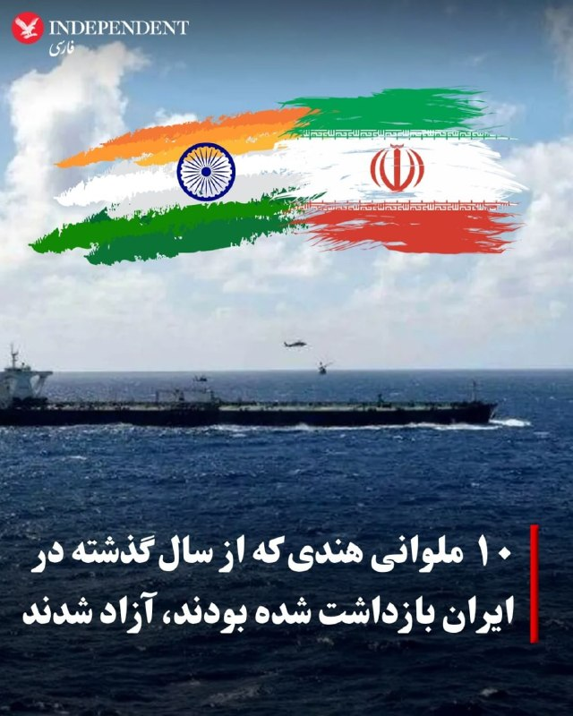
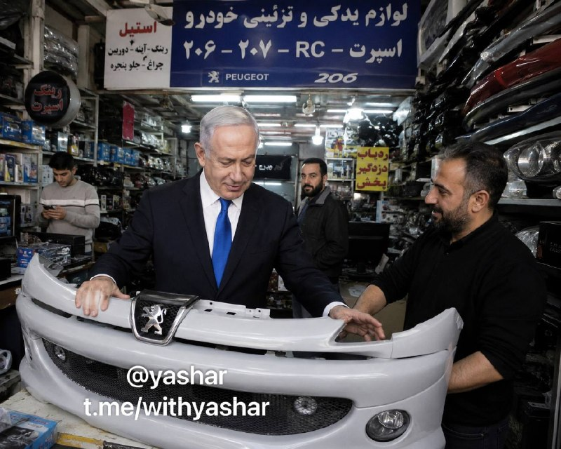
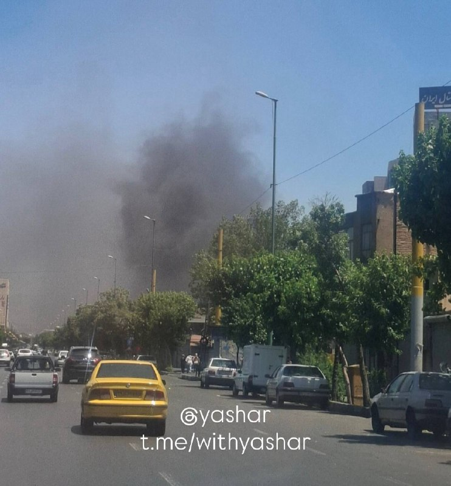
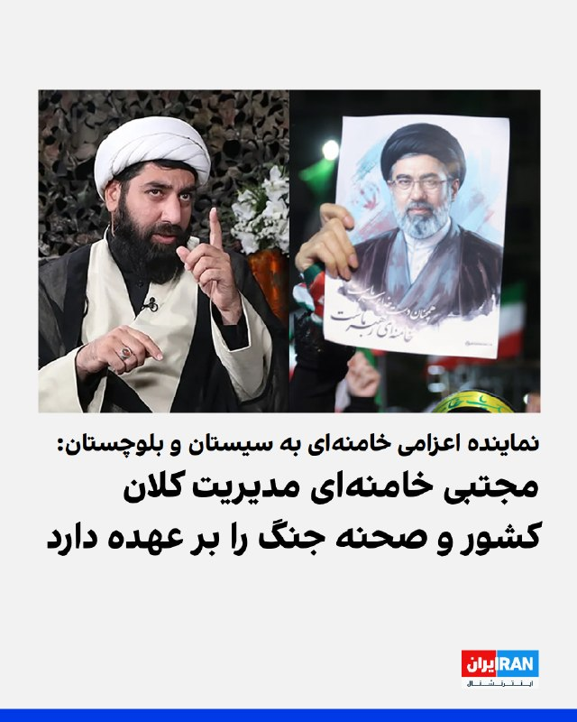
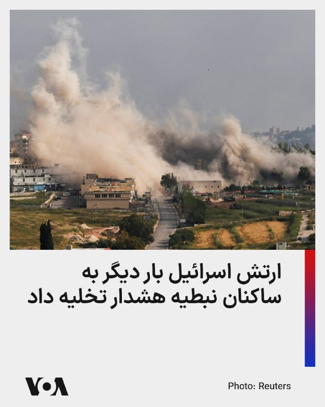
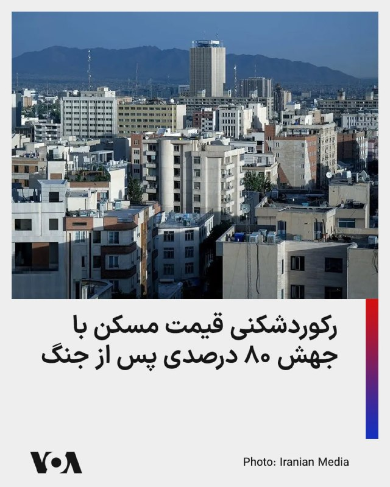
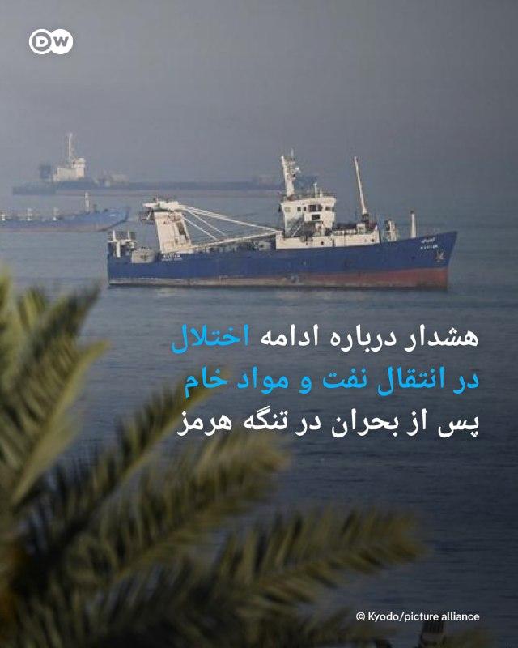
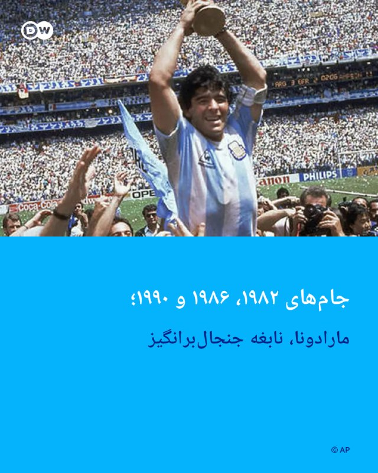
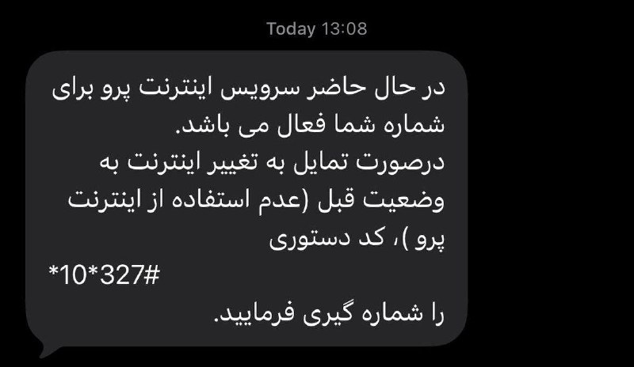
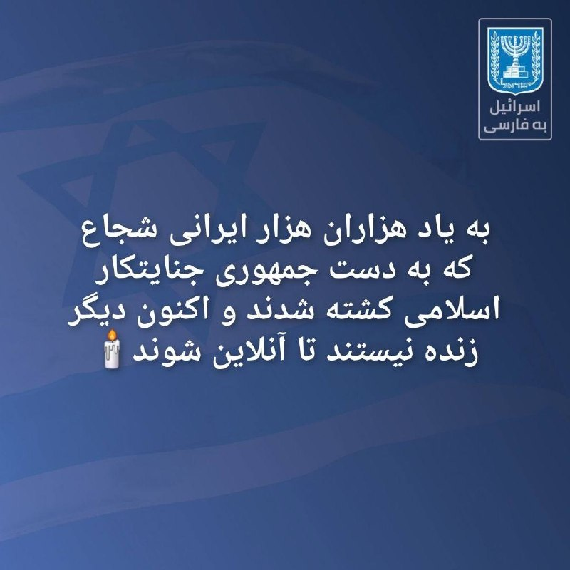

# خواننده تلگرام

<!-- TOP_NAV START -->

<a href="https://github.com/kaminarinokoky/aio-downloader/blob/main/telegram/content/archive_1.md" style="display:inline-block; padding:6px 12px; margin:0 4px; background-color:#2ea44f; color:white; text-decoration:none; border-radius:4px; font-weight:bold;">صفحه بعد</a>

<!-- TOP_NAV END -->

<!-- MSG START -->

---
📅 بروزرسانی: 1405/03/06 14:09
---

## VahidOOnLine — post 242404

  <a href="telegram/content/VahidOOnLine_242404_1779878390.mp4" target="_blank">🎬 Download video</a>

♦️سخنگوی سازمان آتش‌نشانی تهران روز چهارشنبه ششم خردادماه از وقوع آتش‌سوزی در پشت‌بام یک مجتمع تجاری در خیابان شوش خبر داد.
به گفته این سازمان، آتش‌نشانان موفق شدند حریق را پیش از سرایت به انبارهای مجتمع مهار و افراد حاضر در ساختمان را در همان دقایق اولیه تخلیه کنند.
این حادثه بدون مصدومیت پایان یافت.
‌🇸🇦 Indypersian

🤖 @VahidOOnLine

## VahidOOnLine — post 242403

  

مسعود پزشکیان، رییس‌جمهور دولت جمهوری اسلامی، عامل بحران اقتصادی در کشور را «جنگ اقتصادی دشمن» خواند و گفت میدان اصلی تقابل امروز، جنگ اقتصادی و هدف‌گیری تاب‌آوری کشور است.

او افزود: «میدان اصلی تقابل امروز، جنگ اقتصادی و هدف‌گیری تاب‌آوری کشور است.»

پزشکیان ادامه داد: «دشمن پس از ناکامی در تحقق اهداف خود در عرصه نظامی، تمرکز خود را بر آسیب‌زدن به تاب‌آوری اقتصادی کشور و ایجاد اخلال در معیشت مردم قرار داده است.»
‌🏁 🇬🇧 IranintlTV

🤖 @VahidOOnLine

## VahidOOnLine — post 242402

  

♦️وزارت اطلاعات جمهوری اسلامی ایران روز چهارشنبه ششم خردادماه با صدور بیانیه‌ای معترضان و مخالفان حکومت را به پیگرد قانونی تهدید کرد.

این بیانیه که با عنوان «سخنی با ولی‌نعمتان و هشداری به دشمنان» در رسانه‌های داخلی ایران منتشر شده، ادعا می‌کند که «دشمن شکست خورده در جنگ نظامی، بدنبال تولید دستآورد برای خویش، گرچه از طریق جنگ نرم، می‌باشد.»

وزارت اطلاعات در این بیانیه علاوه بر اسرائیل و آمریکا، بریتانیا و اروپا را به همراهی با این دو قدرت متهم و کشورهای عرب حاشیه خلیج فارس را به‌عنوان «غلامان متمول» مسئول تامین مالی «جنگ ترکیبی تمام عیار» علیه «مردم قهرمان ایران» معرفی کرده است.

این بیانیه در حالی صادر می‌شود که اسماعیل خطیب، وزیر اطلاعات جمهوری اسلامی در سومین هفته جنگ در حمله اسرائیل کشته شد و دولت هنوز جانشینی برای او معرفی نکرده است.

در بیانیه وزارت اطلاعات که همزمان با افزایش گمانه‌زنی‌ها درباره توافق احتمالی میان تهران و واشنگتن صادر شده، آمده است: «دشمن شکست خورده در جنگ نظامی، بدنبال تولید دستاورد برای خویش، گرچه از طریق جنگ نرم، میباشد. اکنون دشمن، هدف براندازی و تجزیه کشور را که در ابتدای جنگ اخیر آشکارا اعلان کرده و با حمله نظامی نتوانست محقق سازد، از راههای دیگری پی می‌جوید. لذا و طبق اطلاعات موثقِ حاصل از مجاری مختلف، دشمن کینه‌توز نه تنها در صدد اجرای شگردهای گوناگون جنگ ترکیبی علیه ایران عزیز می‌باشد، بلکه با توقف جنگ سخت، قطعا تمرکز بیشتر و سنگین‌تری بر انواع شیوه‌های جنگ نرم، جنگ شناختی و توطئه‌های جنگ ترکیبی خواهد داشت.»

وزارت اطلاعات در این بیانیه معترضان و مخالفان جمهوری اسلامی در خارج از ایران را تهدید کرد و نوشت: «مزدوران ضد انقلاب و تروریست‌های مقیم خارج کشور و حامیان آن‌ها نیز از آتشی که می‌افروزند در امان نخواهند بود.»

در حالی که اعتراضات سراسری دی‌ماه ۱۴۰۴ با هزاران کشته یکی از بزرگ‌ترین و مرگ‌بارترین سرکوب‌های نیم قرن اخیر جهان به شمار می‌رود، وزارت اطلاعات ادعا کرد «طبق اطلاعات موثق و متواتر، امروز اولویت محورهای جنگ ترکیبی دشمن، انجام تحریکات اجتماعی حول محورهای اقتصادی و برخی کمبودها، و تلاش برای پیشگیری از خدمت‌رسانی دولت خدمتگزار و طراحی برای تولید و تهییج معترضین و کشاندن آنها به خیابان‌ها، در برابر نهادهای حاکمیتی و امت خداجویی است که تجمعات خیابانی را به «سنگر سراسری مقاومت ملی» تبدیل نموده‌اند.»

 وزارت اطلاعات در همین بیانیه هرگونه ارتباط با رسانه‌های مخالف که آن‌ها را «تروریستی» توصیف کرده است و «ایجاد اغتشاش و اختلاف مذهبی و قومی» و «ارتباط با کانال‌های ارتباطی» اسرائیل در شبکه‌های اجتماعی، مورد پیگرد قرار خواهد گرفت.
‌🇸🇦 Indypersian

🤖 @VahidOOnLine

## VahidOOnLine — post 242401

  

پس از گذشت حدود سه ماه از کشته شدن علی خامنه‌ای، رهبر جمهوری اسلامی، و اعضای خانواده او در حمله مشترک اسرائیل و آمریکا، رسانه‌های ایران اعلام کردند مراسم ختم خانواده علی و مجتبی خامنه‌ای هفته جاری در مصلای عبدالعظیم حسنی در شهر ری برگزار می‌شود.

بر اساس اعلامیه منتشرشده از سوی خانواده رهبر جمهوری اسلامی، این مراسم برای بشری حسینی خامنه‌ای، دختر علی خامنه‌ای، مصباح‌الهدی باقری، همسر بشری حسینی خامنه‌ای، زهرا حداد عادل، همسر مجتبی خامنه‌ای، و زهرا محمدی گلپایگانی، نوه علی خامنه‌ای، برگزار خواهد شد.

علی خامنه‌ای نهم اسفند‌ماه به همراه بخشی از خانواده و همراهانش در حملات مشترک اسرائیل و آمریکا کشته شد. با وجود گذشت سه ماه، هنوز مراسم تشییع جنازه او برگزار نشده است.
‌🏁 🇬🇧 IranintlTV

🤖 @VahidOOnLine

## VahidOOnLine — post 242400

  

علی باقری‌کنی، معاون دبیر شورای عالی امنیت ملی، با بیان اینکه «تماس‌های غیرمستقیم میان جمهوری اسلامی و آمریکا ادامه دارد» گفت: «موضوع ذخایر اورانیوم غنی‌شده در دستور کار مذاکرات نیست.»

او افزود جمهوری اسلامی و عمان در حال مذاکره درباره رویه جدید عبور کشتی‌ها از تنگه هرمز هستند.
‌🏁 🇬🇧 IranintlTV

🤖 @VahidOOnLine

## VahidOOnLine — post 242399

🗣روایت شما پس از بازگشت به اینترنت بین‌المللی- چهارشنبه ۶ خرداد

🔹با وجود باز شدن اینترنت در ایران، حتی با فیلترشکن‌های قوی هم هیچ‌یک از اپلیکیشن‌ها باز نمی‌شود.
🔹بالاخره بعد از سه ماه وصل شدم ولی احساس غریبی می‌کنم. اینستاگرام شده مثل قبرستون هزاران هزار اکانت که دیگه صاحبی نداره.
🔹نابود شدیم از گرونی وحشتناک. این گرونی و تورم رو هیچ‌کجای دنیا نمی‌تونن حتی چند روز تحمل کنن. اینترنت که حقمونه رو با ده‌ها شرط و منت باز کردن.
🔹بعد ۳ ماه وصل شدم. تلگرام روی آپدیت می‌مونه، پیام‌ها خیلی دیر ارسال و دریافت میشه و گوگل‌پلی هنوز برای همه کار نمی‌کنه. فقط دیشب به سختی تونستم آپدیت اندروید گوشیم رو انجام بدم.
🔹بالاخره اینترنت در ایران وصل شده و خیلی خوشحال شدیم، ولی یاد جاویدنامان از ذهن ما نمیره.
🔹هر کی میگه اینترنت در ایران وصل شده واقعا مغزش خرابه. کجا وصل شده؟ گوگل‌پلی وارد نمیشه و حتی نمی‌شه برنامه‌های سامسونگ رو آپدیت کرد.
🔹اینترنت وصل شده ولی خوشحال نیستم چون وقتی اینترنت وصل بشه یعنی اینکه هیچ اتفاقی قرار نیست بیافته و جمهوری اسلامی قراره بمونه.
🔹نگران اینترنت نباش چون برمی‌گرده، نگران جوونی‌مون باش که مفت رفت.
🔹کاش همین‌جوری که اینترنت‌ها برگشت، جوون‌هامون از زیر خاک برمی‌گشتن.
🔹ببین ما چقدر بدبخت شدیم که در عصر تکنولوژی، بعد از ۸۸ روز برای بازگشت اینترنت شادی می‌کنیم.
🔹اینها اینترنت‌ها رو وصل کردن که ما لال بشیم.
🔹درک نمی‌کنم یه سری‌ها خوشحالن و هیجانی شدن از وصل شدن اینترنت. الان یعنی بدبختی‌هاتون تموم شد؟
🔹برای من عجیبه که بعضی‌ها وصل شدن اینترنت رو تبریک میگن. این حق اولیه هر انسانیه و تبریک گفتن نداره.
🔹باورم نمیشه که میگین آزاد شدیم و خوشحالیم. این فقط فیلترنت هست و هیچی عوض نشده. زندگی ما و جوونیمون به باد رفت. فیلترنت خیلی محدود وصل شده ولی زندگی ما و اون همه جاویدنام دیگه برنمی‌گرده.
‌🏁 🇬🇧 IranintlTV

🤖 @VahidOOnLine

## VahidOOnLine — post 242398

🗣روایت شما از بحران اقتصادی و زندگی در آتش‌بس- چهارشنبه ۶ خرداد:

🔹بچه‌ام در بخش کودکان بیمارستان ۱۷ شهریور رشت بستری است. داروهای سرطان نیست. بسته ۱۰۰ عددی قرص مرکاپتوپرین به سختی و فقط در بازار سیاه با قیمت چند برابری پیدا می‌شود.

🔹خیلی در فشاریم. اجاره خانه ۳ برابر شده. گوشت و مرغ را که خیلی وقت است نمی‌توانیم بخریم. روغن ۲ لیتری شده ۹۰۰ هزار تومان.

🔹من لوازم خانگی دارم. قیمت وسایل خانه از قبل عید تا الان به شدت افزایش داشته. یخچال دوقلو هیمالیا ۱۲۰ میلیون تومان بود الان شده ۲۵۰ میلیون، ماشین لباسشویی پاکشوما ۹ کیلویی ۶۰ میلیون بود، شده ۱۰۰ میلیون تومان. جوان‌هایی که می‌خواهند تازه زندگی مشترکشان را شروع کنند می‌آیند قیمت می‌کنند، با چشمان خیس از در خارج می‌شوند.

🔹فروشنده موبایلم؛ قیمت موبایل‌ها خیلی رفته بالا. عملا مشتری فقط برای خرید قاب و گلس مراجعه می‌کند و به ندرت گوشی می‌فروشیم.

🔹گرانی به شدت بیداد می‌کند. یک روغن، نوشابه و زردچوبه خریدم شد یک میلیون و ۲۰۰ هزار تومان.

🔹همه چیز گران شده. روغن پنج لیتری شده ۷۰۰ هزار تومان، چیپس ۵۵۰ هزار تومان، گوشت قرمز یک میلیون و ۳۰۰ هزار تومان.

🔹با خانه میانگین متری ۳۰۰ میلیون تومان در اصفهان چه‌کار کنیم؟ تازه کسی هم نمی‌فروشد و منتظرند گران‌تر شود.
‌🏁 🇬🇧 IranintlTV

🤖 @VahidOOnLine

## VahidOOnLine — post 242397

  

همزمان با گزارش‌ها درباره رایزنی‌ها برای دستیابی به توافق میان جمهوری اسلامی و آمریکا، علی‌اکبر ولایتی، مشاور رهبر جمهوری اسلامی در امور بین‌الملل، گفت ضامن عینی بقای توافق، تنگه هرمز است.

او در ایکس نوشت: «خط قرمز ایران روشن است، این بار کاغذها و امضاها تضمین نیستند، ضامن عینی بقای توافق، تنگه هرمز است. جغرافیا دروغ نمی‌گوید و قاضی نهایی عهدنامه، روی کاغذ نیست.»

او همچنین گفت: «تاریخ گواهی می‌دهد همه مهاجمانی که با سودای سلطه آمدند، از اسکندر تا چنگیز و ترامپ، همگی در هاضمه تمدن غنی ایران هضم شدند.»
‌🏁 🇬🇧 IranintlTV

🤖 @VahidOOnLine

## VahidOOnLine — post 242396

  

♦️دولت کره‌جنوبی روز چهارشنبه ششم خردادماه اعلام کرد سفیر جمهوری اسلامی در سئول را در اعتراض به حمله به یک کشتی احضار خواهد کرد.

مقام‌های کره‌جنوبی جزئیات بیشتری درباره این حادثه منتشر نکرده‌اند، اما تاکید کرده‌اند امنیت کشتیرانی و آزادی تردد دریایی برای سئول اهمیت حیاتی دارد.

این خبر در حالی اعلام شد که حدود چهار هفته پیش یک کشتی باری کره جنوبی در تنگه هرمز هدف حمله پهپادی قرار گرفت و به‌شدت آسیب دید.
دفتر ریاست جمهوری کره جنوبی اعلام کرد بسیار بعید است این حمله از جایی به‌جز ایران انجام شده باشد.
‌🇸🇦 Indypersian

🤖 @VahidOOnLine

## VahidOOnLine — post 242395

  

♦️علی باقری کنی، معاون دبیر شورای عالی امنیت ملی جمهوری اسلامی روز چهارشنبه ششک خرداد در حاشیه مجمع بین‌المللی امنیتی در مسکو با اشاره به مذاکرات نمایندگان تهران و واشنگتن گفت: «ذخایر اورانیوم غنی‌شده ایران در دستور کار مذاکرات نیست».

به گزارش ریانووستی، باقری کنی همچنین با بیان اینکه تماس‌های غیرمستقیم میان تهران و واشنگتن ادامه دارد، افزود: ایران و ایالات متحده هنوز در مورد رفع انسداد تنگه هرمز به توافق نرسیده‌اند.

این اظهارات در حالی مطرح می‌‌شود که دونالد ترامپ، رئیس‌جمهوری ایالات متحده، روز دوشنبه با انتشار پیامی در شبکه اجتماعی تروث نوشت: «اورانیوم غنی‌شده (گرد‌وغبار هسته‌ای) یا باید فورا به ایالات متحده تحویل داده شود تا به آمریکا منتقل و نابود گردد، یا اینکه ترجیحا در بستر همکاری و هماهنگی با جمهوری اسلامی، در همان محل یا در مکان قابل‌قبول دیگری، در حضور و با نظارت کمیسیون انرژی اتمی یا نهاد معادل آن نابود شود.»

 مقام‌های آمریکایی به سی‌ان‌ان گفته‌اند، اختلاف‌ها بر سر نحوه پرداختن به برنامه هسته‌ای ایران و لغو تحریم‌ها، نهایی شدن توافق برای پایان جنگ را به تاخیر انداخته است.
‌🇸🇦 Indypersian

🤖 @VahidOOnLine

## VahidOOnLine — post 242394

  

وزارت خارجه کره جنوبی چهارشبنه شش خرداد اعلام کرد که حمله به کشتی باری اچ‌ام‌ام نامو در تنگه هرمز ، احتمالا با استفاده از یک موشک ایرانی انجام شده است.

به گزارش رویترز، یک مقام دفتر ریاست‌جمهوری کره جنوبی ۲۱ اردیبهشت اعلام کرد سئول در حال بررسی نقش احتمالی جمهوری اسلامی در حمله به نفتکش کره‌ای «اچ‌ام‌ام نامو» در هفته گذشته است.

او با تاکید بر این که کره جنوبی قصد دارد به عامل حمله به این کشتی پاسخ دهد در عین حال گفت عامل این حمله تاکنون شناسایی نشده و تحقیقات در این زمینه ادامه دارد.
‌🏁 🇬🇧 IranintlTV

🤖 @VahidOOnLine

## VahidOOnLine — post 242393

  <a href="telegram/content/VahidOOnLine_242393_1779878397.mp4" target="_blank">🎬 Download video</a>

⭕️آتش‌‌سوزی گسترده در فروشگاه بزرگ غذای حلال یهودیان در محله «گلدرز گرین» لندن

♦️یک فروشگاه بزرگ کوشر (غذای حلال یهودیان) در محله گلدرز گرین لندن روز چهارشنبه ششم خرداد دچار آتش‌‌سوزی گسترده شد.
برخی رسانه‌های محلی گرازش دادند که این آتش‌سوزی احتمالا عمدی و به دلایل یهودستیزانه رخ داده است.
گروه‌های امدادی و آتش‌نشانی با حضور در محل حادثه مشغول خاموش کردن آتش هستند.
پلیس لندن تاکنون گزارشی درباره این حادثه منتشر نکرده است.
‌🇸🇦 Indypersian

🤖 @VahidOOnLine

## VahidOOnLine — post 242392

  

⭕️معاون سیاسی نیروی دریایی سپاه: احتمال جنگ دوباره با آمریکا پایین است اما برای پاسخ به هر حمله‌ای آماده‌ایم

♦️محمد اکبرزاده، معاون سیاسی نیروی دریایی سپاه پاسداران روز چهارشنبه ششم خرداد اعلام کرد احتمال ازسرگیری جنگ با آمریکا پایین است، اما جمهوری اسلامی برای هرگونه حمله احتمالی آمادگی کامل دارد.

او در گفتگو با خبرگزاری تسنیم افزود: «دشمن در موضع ضعف قرار دارد و نیروهای مسلح ایران با خشاب‌های پر آماده مقابله هستند».

اکبرزاده همچنین اضافه کرد: «در صورت هرگونه حمله نظامی، مناطقی از چابهار تا ماهشهر به گورستان متجاوزان تبدیل خواهد شد.»

این اظهارات در حالی مطرح می‌شود که تنش‌ها میان تهران و واشنگتن همچنان ادامه دارد.
‌🇸🇦 Indypersian

🤖 @VahidOOnLine

## VahidOOnLine — post 242391

  

محمدتقی وکیل‌پور، نماینده اعزامی رهبر جمهوری اسلامی به استان سیستان و بلوچستان، شامگاه سه‌شنبه در سخنانی در چابهار گفت مجتبی خامنه‌ای «اکنون با تمام توان در میدان ایستاده و مدیریت کلان کشور و صحنه جنگ را بر عهده دارند».

او افزود: «شرایط امروز منطقه بسیار حساس است و دشمن با تمام توان عملیاتی خود به میدان آمده است.»
‌🏁 🇬🇧 IranintlTV

🤖 @VahidOOnLine

## VahidOOnLine — post 242390

  

آتش‌سوزی گسترده‌ای صبح چهارشنبه در یک فروشگاه مواد غذایی یهودیان در منطقه گولدرز گرین در شمال غرب لندن رخ داد و ده‌ها آتش‌نشان را به محل حادثه کشاند.

به گفته سازمان آتش‌نشانی لندن، حدود ۱۰۰ آتش‌نشان با ۱۵ خودرو در حال مهار حریقی هستند که گمان می‌رود از انبار فروشگاه «کوشر کینگدام» آغاز شده و به ساختمان اصلی نیز سرایت کرده است.

مقام‌های آتش‌نشانی گفتند آتش‌سوزی «حجم قابل توجهی دود» تولید کرده و از ساکنان منطقه خواستند در و پنجره‌های خود را بسته نگه دارند.

پلیس متروپولیتن نیز اعلام کرد در این حادثه کسی آسیب ندیده است.

گولدرز گرین یکی از محله‌های شناخته‌شده لندن با جمعیت قابل توجه یهودیان است و فروشگاه‌های عرضه‌کننده محصولات «کوشر» در این منطقه فعال هستند.
‌🏁 🇬🇧 IranintlTV

🤖 @VahidOOnLine

## VahidOOnLine — post 242389

  

هیلل نیومن، سفیر اسرائیل در استرالیا، در گفت‌وگوی اختصاصی با ایران‌اینترنشنال گفت آمریکا و اسرائیل در یک عملیات مشترک، کارزار نظامی را برای مقابله با آنچه تهدیدهای موجود از سوی جمهوری اسلامی خواند، آغاز کردند. او تاکید کرد هدف این کارزار، از بین بردن یا کاهش تهدیدهای هسته‌ای و موشکی حکومت ایران بوده است.

نیومن با اشاره به برنامه هسته‌ای جمهوری اسلامی گفت: «ما نمی‌توانیم اجازه دهیم حکومت اسلامی به توانایی هسته‌ای دست پیدا کند.» او افزود تهدیدهای موجود شامل موضوع غنی‌سازی اورانیوم، نبود اورانیوم غنی‌شده در ایران و حذف کامل توانایی هسته‌ای است.

نیومن در عین حال تاکید کرد اسرائیل مخالف راه‌حل دیپلماتیک نیست و اگر از طریق مذاکرات بتوان به اهداف تعیین‌شده رسید و جان انسان‌ها حفظ شود، این مسیر مطلوب خواهد بود. او گفت: «اگر مذاکرات موفق نشود، ممکن است مجبور شویم دوباره به کارزار نظامی بازگردیم.»

سفیر اسرائیل در استرالیا افزود درک مشترکی میان اسرائیل و ایالات متحده درباره این اهداف وجود دارد و دونالد ترامپ، رییس‌جمهوری آمریکا، نیز گفته است درباره موضوع غنی‌سازی اورانیوم و توانایی هسته‌ای ایران مصالحه نخواهد کرد.
‌🏁 🇬🇧 IranintlTV

🤖 @VahidOOnLine

## VahidOOnLine — post 242388

  

♦️قیمت نفت در بازارهای جهانی روز چهارشنبه ششم خرداد پس از چند ساعت افزایش و با «خوش‌بینی محتاطانه» به توافق احتمالی میان جمهوری اسلامی ایران و ایالات متحده، بیش از دو درصد کاهش یافت.

بهای نفت خام برنت دریای شمال، قیمت معیار نفت، صبح چهارشنبه و همزمان با آغاز کار بازارهای اروپایی با ۲و۴۲ درصد کاهش به ۹۷ دلار و ۱۹ سنت رسید. این در حالی است که بامداد چهارشنبه و همزمان با آغاز به کار بورس‌های آسیایی، قیمت نفت از مرز ۹۹ دلار عبور کرده بود.
‌🇸🇦 Indypersian

🤖 @VahidOOnLine

## VahidOOnLine — post 242387

  

♦️مقام‌های سازمان دریانوردی هند شامگاه سه‌شنبه پنجم خرداد از آزادی ۱۰ ملوان این کشور که تابستان سال گذشته در آب‌های جنوب ایران بازداشت شده بودند، خبر دادند.

به گزارش خبرگزاری فرانسه  اداره ناوبری دریایی هند در بیانیه‌ای اعلام کرد که این ملوانان که سوار بر کشتی »ام‌وی هاربر فینیکس» بودند، پس از توقیف این کشتی در نزدیکی بندر جاسک در ژوئیه ۲۰۲۵ در ایران بازداشت و زندانی شدند.

به گفته این نهاد نیمه‌دولتی هند، «اکنون همه آن‌ها آزاد شده و در سلامت هستند و تمهیدات لازم برای بازگشت آن‌ها به کشورشان در حال فراهم شدن است.»

به گزارش خبرگزاری فرانسه، دولت هند برای جلوگیری از ایجاد حساسیت، مذاکرات راجع به آزادی این ملوانان را در سکوت رسانه‌ای برگزار کرد.

هند روابط با جمهوری اسلامی ایران را با وجود تنش‌های منطقه و مناسبات بسیار نزدیک با آمریکا و اسرائیل، همچنان حفظ کرده است.
‌🇸🇦 Indypersian

🤖 @VahidOOnLine

## VahidOOnLine — post 242386

🗣روایت شما از زندگی در آتش‌بس- چهارشنبه ۶ خرداد

🔹بعد از سه ماه قطعی وصل شدم ولی اینترنت هیچ سرعتی نداره.

🔹 الان اینترنت وصل شده. باید تبریک بگیم؟ باید تسلیت بگیم. بهتر که نشده، حتی بدتر هم شده.

🔹اینترنت وصل شده ولی سرعتش همچنان خیلی پایینه. حوصله‌مون سر میره تا بتونیم اینستاگرام رو باز کنیم.

🔹اینترنت‌ها رو وصل کردن ولی اون ۴۰ هزار نفر و پدر و مادرهای داغدار چی میشن؟

🔹به عنوان یک جوان که در قرن ۲۱ زندگی می‌کنه، ۹۰ روز نداشتن دسترسی به اینترنت از اسارت هم بدتر بود. به امید روزی که دیگه چنین چیزهایی رو تجربه نکنیم.

🔹 من یک دانش‌آموز ۱۲ ساله‌ هستم. اینکه اینترنت رو وصل کردن برای ما دانش‌آموزان خوبه، ولی برای مردم چه فایده وقتی که قیمت‌ها هر روز بالاتر میره، تورم بالاست و مردم رو بدبخت کردن.

🔹خیلی خوشحالم که اینترنت‌ها وصل شده چون می‌تونم راحت‌تر درس بخونم.
🔹از دیشب که اینترنت وصل شده، اکثرا نگران هستن که نکنه این به معنای تموم شدن جنگ باشه.

🔹این‌قدر نگویید اینترنت بین‌الملل وصل شده، اپ‌استور و خیلی از اپلیکیشن‌ها فیلتر هستن. شدیم مثل کشور چین.

🔹اینترنت عادی‌ترین حق ماست که اون رو از ما می‌گیرن، ولی ما شکست نمی‌خوریم.

🔹اینترنت‌ها وصل شد ولی به چه قیمتی؟ همه‌چی رو از دست دادیم.
‌🏁 🇬🇧 IranintlTV

🤖 @VahidOOnLine

## VahidOOnLine — post 242385

  

احمد خاتمی، امام جمعه موقت تهران در خطبه‌های نماز «عید قربان» در تهران با تاکید بر ضرورت صرفه‌جویی، گفت صرفه‌جویی در آب، برق و دیگر عرصه‌ها در راستای «مقاومت ملی» است.

او با استناد به روایتی از جعفر صادق، امام ششم شیعیان، گفت: «خداوند صرفه‌جویی را دوست دارد و اسراف را نمی‌پسندد. لذا ضرورتی به روشن نگه داشتن چراغ‌های اضافی نیست.»

خاتمی افزود که می‌توان با کمترین میزان آب وضو و غسل انجام داد و بر پرهیز از اسراف در مصرف منابع تاکید کرد.
‌🏁 🇬🇧 IranintlTV

🤖 @VahidOOnLine

## WithYashar — post 12661

  <a href="telegram/content/WithYashar_12661_1779878404.mp4" target="_blank">🎬 Download video</a>

عضو شورای اطلاع رسانی دولت : چرا رسانه‌های ضدحکومت دچار سردرگمی و بی‌برنامگی شدند؟
@withyashar
یاشار: چرتو پرتاشو کات کردم ولی اگه ویس های دیشبم رو گوش‌کرده باشید این قسمت حرفش درسته ! ما باید تغییر‌تاکتیکی‌بدیم یا منتظر همون معجزه باشیم که منم گفتم !!! ادب ازکه آموختی از بی ادبان !

## WithYashar — post 12660

رسانه I24 NEWS: نیروهای دفاعی اسرائیل (IDF) و فرماندهی مرکزی ارتش آمریکا (سنتکام) در حالت آماده‌باش بالا باقی مانده‌اند، در شرایطی که احتمال شکست مذاکرات میان واشنگتن و تهران و صدور دستور اقدام نظامی از سوی رئیس‌جمهور دونالد ترامپ وجود دارد.
@withyashar

## WithYashar — post 12659

الان نزدیک مجتمع صنایع فولاد مبارکه @withyashar

## WithYashar — post 12658

## WithYashar — post 12657

  <a href="telegram/content/WithYashar_12657_1779878405.mp4" target="_blank">🎬 Download video</a>

الان نزدیک مجتمع صنایع فولاد مبارکه
@withyashar

## WithYashar — post 12656

## WithYashar — post 12655

  <a href="telegram/content/WithYashar_12655_1779878407.mp4" target="_blank">🎬 Download video</a>

@withyashar مخصوص‌ پیرمردا

## WithYashar — post 12654

## WithYashar — post 12653

## WithYashar — post 12652

یاشار جان
اینترنشنالیا دارن میتوپن به ترامپ که بزدله و به ج ا باج داره میده و عقب نشینی کرده

تقریبا رسانه ها شدن این.

ولی من هنوز یادمه که میگفتی ترامپ فوتبالی بازی میکنه که توپشو نمیشه دید
هنوز این جملات و حرفاتو یادمه

بگو، خواهش میکنم بگو، که این رسانه ها همه دارن اشتباه می‌کنن و هنوز ما اتاق جنگی های قدیمی دارین درست میریم به سمت قاهره.
مرسی ازت❤️
#دیکتاتور_مهربون❤️

## WithYashar — post 12651

وال‌استریت‌ژورنال: دولت ترامپ در حال کاهش نیروهاییه که در صورت بحران به اروپا اعزام میشن؛ اقدامی تازه در راستای کاهش حمایت نظامی آمریکا از متحدان ناتو.
@withyashar

## WithYashar — post 12650

  

الان ، تهران شوش @withyashar

## WithYashar — post 12649

وزارت اطلاعات ایران: دشمن برای دامن زدن به اختلافات ملی و فرقه‌ای و انجام عملیات تروریستی در کشور تلاش خواهد کرد.
@withyashar

## WithYashar — post 12648

باقری: ذخایر اورانیوم غنی‌شده ایران در دستورکار مذاکرات نیست
ریانووستی به نقل از معاون دبیر شورای عالی امنیت ملی ایران:
ایران و ایالات متحده هنوز در مورد رفع انسداد تنگه هرمز به توافق نرسیده‌اند.
ایران و عمان در حال مذاکره درباره رویه جدید عبور کشتی‌ها از تنگه هرمز هستند.
تماس‌های غیرمستقیم میان ایران و آمریکا ادامه دارد.
ذخایر اورانیوم غنی‌شده ایران در دستور کار مذاکرات نیست.
@withyashar

## WithYashar — post 12647

  

الان ، تهران شوش
@withyashar

## WithYashar — post 12646

شبکه ۱۲ اسرائیل : تو نهاد امنیتی، هلاکت محمد عودة تأیید شد @withyashar

## WithYashar — post 12644

درود یا منظورت حمله اس یا که اب و هوایه سطح کشور مثل تهران اصفهان هوا خوبه یه بررسی بکن ممنون ازت

## WithYashar — post 12643

درود یا منظورت حمله اس یا که اب و هوایه سطح کشور مثل تهران اصفهان هوا خوبه یه بررسی بکن ممنون ازت

## WithYashar — post 12642

@withyashar

## WithYashar — post 12641

اتاق جنگ با یاشار : کمربند ها رو ببندید
@withyashar

## mwarmonitor — post 9800

🔴کره جنوبی چشم به ساخت زیردریایی هسته‌ای دوخته است

🔰کره جنوبی در نظر دارد اولین زیردریایی با سوخت هسته‌ای خود را تا اواسط دهه ۲۰۳۰ ساخته و به آب بیندازد؛ اقدامی که بخشی از هدف آن، مقابله با زرادخانه رو به رشد همسایه شمالی‌اش، کره شمالی است.

🔸چرا این موضوع اهمیت دارد؟ این پروژه عظیم، بخش کشتی‌سازی این کشور را (که اغلب در ایالات متحده مورد تمجید قرار می‌گیرد) و همچنین تعهدات بین‌المللی آن در زمینه عدم اشاعه تسلیحات هسته‌ای را محک خواهد زد. اگر این طرح با موفقیت همراه شود، می‌تواند وضعیت امنیتی موجود در آسیا را بازتعریف کند. در حال حاضر تنها انگشت‌شماری از کشورهای جهان زیردریایی‌های هسته‌ای در اختیار دارند.

رویداد جاری: وزارت دفاع کره جنوبی روز سه‌شنبه از «طرح اساسی توسعه زیردریایی‌های با سوخت هسته‌ای» رونمایی کرد. این برنامه، تعهدی چند دهه‌ای را ترسیم می‌کند و به ایجاد بیش از ۴۰ هزار موقعیت شغلی منجر خواهد شد.
جزئیات بیشتر: انتظار می‌رود سئول از سوخت اورانیوم با غنای پایین استفاده کند.
پیشینه (فلش‌بک): ایالات متحده در ماه نوامبر اعلام کرد که «مجوز ساخت زیردریایی‌های تهاجمی با سوخت هسته‌ای را به جمهوری کره (ROK) اعطا کرده است.» این تصمیم در پی دیدار رؤسای جمهور آمریکا و کره جنوبی اتخاذ شد.

@mwarmonitor

## mwarmonitor — post 9799

📌نشریه تلگراف ؛ از نظر سیاسی و تصویری، وضعیت برای یک رئیس‌جمهور نمی‌تواند بدتر از این باشد: واگذاری میلیاردها دلار به همان رژیمی که آمریکا با آن در حال جنگ بوده است.

🔸پول نقد در ازای یک تفاهم‌نامه (Memorandum of Understanding) آسیب‌پذیری رئیس‌جمهور را در برابر خشم رأی‌دهندگان آشکار می‌کند

@mwarmonitor

## mwarmonitor — post 9798

🔴اختصاصی آکسیوس : آزمایش «کامپیوتر صورت مبتنی بر هوش مصنوعیِ» شرکت ریوت توسط لشکر ۴ پیاده‌نظام ارتش آمریکا

📝نویسنده: کالین دمارست AXIOS

🔰شرکت ریوت اینداستریز (Rivet Industries) تعداد ۷۰ فروند از «سیستم‌های فرماندهی مأموریت سربازپایه» (SBMC) خود را به ارتش ایالات متحده تحویل داده و انتظار دارد ظرف کمتر از یک سال آینده، صدها فروند دیگر از این سیستم را نیز تحویل دهد.

🔸این شرکت نوپا (استارتاپ) همچنین ژنرال بازنشسته، جیمز مینگاس (James Mingus)، جانشین سابق رئیس ستاد مشترک ارتش آمریکا را به عنوان مشاور به خدمت گرفته است.

چرا این موضوع اهمیت دارد؟
رقابت بر سر پروژه SBMC که شرکت اندوریل اینداستریز (Anduril Industries) نیز در آن حضور دارد، به‌دقت زیر ذره‌بین کارشناسان قرار دارد. پروژه قبلی ارتش در این زمینه، یعنی سیستم واقعیت افزوده بصری یکپارچه (IVAS)، به یک کیسه بوکس میلیارد دلاری برای انتقادها تبدیل شده بود (شکست بزرگی خورده بود).
آخرین وضعیت
به گفته دیوید مارا (David Marra)، مدیرعامل شرکت ریوت، سربازان لشکر ۴ پیاده‌نظام ارتش آمریکا، محصول پیشنهادی این شرکت را به‌طور گسترده مورد آزمایش قرار داده‌اند.
بازخوردهای دریافتی در مجموع مثبت بوده است. برخی از سربازان خواستار عملکرد بهتر حسگر نور ضعیف (دید در شب) دستگاه شدند؛ برخی دیگر نیز خواهان مدیریت تمیزتر کابل‌ها و اصلاحاتی در رابط کاربری (UI) سیستم بودند.
دیوید مارا در گفتگو با اکسیوس گفت: «آن‌ها تا جایی که می‌توانستند، به‌طور مداوم و تا مرز نابودی از این دستگاه کار کشیدند.»
«طراحی این سیستم از یک صفحه سفید و از صفر مطلق شروع شد؛ با این پرسش‌ها که: سرباز چگونه می‌خواهد سیستم را روی سرش بگذارد؟ چگونه می‌خواهد آن را بردارد؟ چگونه آن را حمل خواهد کرد؟ تجهیزاتش را کجا می‌خواهد قرار دهد؟ و سوالاتی از این دست.»
وضعیت مالی پروژه
ارتش آمریکا سال گذشته یک قرارداد ۱۹۵ میلیون دلاری برای پروژه SBMC به شرکت ریوت واگذار کرد. این استارتاپ به‌طور جداگانه نیز موفق به جذب میلیون‌ها دلار سرمایه شده است.
نمای کلی از وضعیت شرکت
شرکت ریوت حدود ۶۰ کارمند دارد که در سواحل شرقی و غربی آمریکا مستقر هستند. این استارتاپ همکاری نزدیکی با شرکت پالانتیر تکنولوژیز (Palantir Technologies) دارد (دفاتر هر دو شرکت در محله جورج‌تاون واقع شده است).
کلام آخر
مارا در پایان اشاره کرد: «ما هیچ چیز دیگری به جز این نوع "کامپیوتر صورت مبتنی بر هوش مصنوعی" نمی‌سازیم.»
«من در ۱۸ سال گذشته هیچ کار دیگری جز فعالیت تخصصی در این دسته از فناوری انجام نداده‌ام؛ هیچ چیز دیگر.»

@mwarmonitor

## mwarmonitor — post 9797

🔴نگرانی تایوان از به تعویق افتادن ارسال تسلیحات توسط ایالات متحده

📝نویسنده: کالین دمارست AXIOS

🔰تایپه — یک بسته تسلیحاتی ۱۴ میلیارد دلاری برای تایوان که پیش از این به تصویب قانون‌گذاران آمریکایی رسیده بود، اکنون در برزخِ دولت دوم ترامپ گیر کرده است؛ وضعیتی که مقامات تایپه را به شدت نگران و مضطرب کرده است.

🔸چرا این موضوع اهمیت دارد؟ منطقه هند-آرام (ایندو‌پاسیفیک) مانند یک انبار باروت است. دولت تایوان استدلال می‌کند که تحویل این تسلیحات به حفظ صلح منطقه‌ای کمک خواهد کرد.

عامل اصلی جریان: تردید و نوسان در تصمیم‌گیری‌های پرزیدنت ترامپ و پافشاری «هانگ کائو»، سرپرست وزارت نیروی دریایی آمریکا، مبنی بر اینکه جنگ ایران باعث ارزیابی مجدد مهمات موجود شده، موجی از نگرانی را در واشنگتن و سراسر جامعه دفاعی جهان ایجاد کرده است.
در همین حال: هفته گذشته هزاران نفر در تایپه راهپیمایی کردند و خواستار سرمایه‌گذاری بیشتر در صنایع دفاعی داخلی شدند.
این راهپیمایی پس از آن صورت گرفت که حزب اپوزیسیون «کومینتانگ» (KMT) موفق شد پیشنهاد بودجه برای هزینه‌های تسلیحاتی بیشتر را تعدیل و کم‌اثر کند؛ نشانه‌ای از اینکه این موضوع حتی در سطح داخلی تا چه حد می‌تواند بحث‌برانگیز باشد.
مقامات چه می‌گویند؟
«چن مینگ-چی»، معاون وزیر امور خارجه تایوان، در جریان صرف ناهار در وزارتخانه این جزیره به آکسیوس گفت:
«جاه‌طلبی نظامی چین بسیار فراتر از تایوان است. اگر از دوستان ژاپنی ما بپرسید، یا از دوستانمان در فیلیپین جویا شوید، آن‌ها نیز تهدید چین را احساس می‌کنند.»
پس از دیدار این ماه ترامپ و همتای چینی‌اش، شی جین‌پینگ در پکن، موجی از «بیانیه‌ها برای یادآوری اهمیت فروش تسلیحات به دولت آمریکا» سرازیر شد.
چن افزود: «ما اولویت‌های خود را داریم و آن‌ها هم اولویت‌های تحویل خود را دارند. من فکر می‌کنم می‌توانیم این تلاش‌ها را همسو کنیم.»
نگاه نزدیک‌تر (بررسی جزئیات)
واشنگتن مدت‌هاست که علی‌رغم اعتراضات بیرونی، تایپه را مسلح کرده است.
ترامپ در ماه دسامبر یک توافق ۱۱ میلیارد دلاری را تایید کرد.
قراردادهای قبلی شامل جنگنده‌های F-16، هلیکوپترهای تهاجمی AH-64D، سیستم‌های پدافند هوایی پاتریوت و نسخه‌هایی از پهپاد آلتیوس (Altius) بوده است.
اما یک مشکل وجود دارد: به گزارش «دیده‌بان امنیت تایوان»، حجم سفارش‌های معوقه (تحویل داده نشده) تا ماه آوریل و به‌دنبال آخرین محموله تانک‌های M1A2T آبرامز، در مرز ۳۰ میلیارد دلار قرار داشت. محموله‌های قبلی در اواخر سال ۲۰۲۴ و اواسط ۲۰۲۵ وارد شده بودند.
چن گفت: «ما در حال رایزنی نزدیک با همتایان آمریکایی خود در مورد اولویت‌بندی هستیم. در این روند، نیاز ایالات متحده و ظرفیت آن در نظر گرفته می‌شود.»
او همچنین اضافه کرد: «همه ما باید در پایگاه صنعتی-دفاعی سرمایه‌گذاری کنیم. ما برای مدتی طولانی از مواهب و سود صلح بهره‌مند بوده‌ایم و سرمایه‌گذاری را فراموش کرده‌ایم.»
چه مواردی را زیر نظر داریم؟
به گزارش خبرگزاری «فوکوس تایوان»، انتظار می‌رود «چنگ لی-وون»، رئیس حزب کومینتانگ (KMT)، ماه آینده از بوستون، نیویورک و واشنگتن بازدید کند. او در ماه آوریل با شی جین‌پینگ دیدار کرده بود.
کلام آخر
«فرانسوا چیه‌چونگ وو»، یکی دیگر از مقامات امور خارجه تایوان، در همان ضیافت ناهار به آکسیوس گفت:
«اگر در اینجا جنگ رخ دهد، همه چیز خیلی دیر خواهد شد. بهترین کار این است که اجازه ندهیم جنگی اتفاق بیفتد.»
او گفت: «سؤال شما درباره این است که آیا این پیشرفته‌ترین سلاح آمریکایی برای دفاع ما حیاتی یا کاملاً ضروری است؟ بله، هست. اما این تنها عامل نیست. ما آن‌قدر که دنیا تصور می‌کند، ضعیف نیستیم.»

@mwarmonitor

## mwarmonitor — post 9796

📝 سوالی دارید دایرکت جواب میدم

## mwarmonitor — post 9795

🔴 در همین حال، نیروهای دفاعی اسرائیل (IDF) و فرماندهی مرکزی ارتش آمریکا (سنتکام) در حالت آماده‌باش بالا باقی مانده‌اند، در شرایطی که احتمال شکست مذاکرات میان واشنگتن و تهران و صدور دستور اقدام نظامی از سوی رئیس‌جمهور دونالد ترامپ وجود دارد.

🔹به گفته یک منبع آگاه از موضوع، هماهنگی میان دو ارتش همچنان ادامه دارد، از جمله ارتباطات مداوم میان رئیس ستاد کل ارتش اسرائیل، ایال زمیر، و فرمانده سنتکام، برد کوپر.

🔸این منبع گفته است: «در حال حاضر سطح بالایی از آمادگی، برنامه‌ریزی مستمر و هماهنگی جاری میان دو ارتش وجود دارد. همه منتظر تصمیم‌های رئیس‌جمهور ترامپ هستند، اما برخلاف آنچه برخی ممکن است تصور کنند، هماهنگی‌های امنیتی به‌صورت عادی و بدون وقفه ادامه دارد.» i24 news

@mwarmonitor

## mwarmonitor — post 9794

🔴ایالات متحده در حال کاهش نیروهایی است که در صورت بروز بحران قصد دارد به اروپا اعزام کند؛ اقدامی تازه از سوی دولت ترامپ برای کوچک‌تر کردن حمایت نظامی خود از متحدان ناتو. وال‌استریت ژورنال

@mwarmonitor

## mwarmonitor — post 9793

  

✈️پرواز هم‌زمان دو فروند Boeing P-8A Poseidon آمریکایی در دریای عرب , پایش دریایی سنگین آمریکا در نزدیکی خلیج عدن و دریای عمان

@mwarmonitor

## mwarmonitor — post 9792

  

🔴سخنگوی عرب زبان ارتش اسرائیل ؛ «به چه حال و روزی برگشتی ای عید؟ قطعاً بدون آن‌ها، عید بهتر و امن‌تر است!

🔸ترور فرمانده شاخه نظامی جدید حماس، تروریستی به نام محمد عوده، بار دیگر تأیید می‌کند: هر کسی که دستش به خون ۷ اکتبر آلوده است، و هر کسی که تمام عمرش را در ترویج ترور و ویرانی گذرانده، اکنون یکی‌یکی مانند مهره‌های دومینو سقوط می‌کنند. هر کسی که ترور را شیوه زندگی خود قرار داده باشد، از حسابرسی فرار نخواهد کرد.

🔹عید قربان امسال طعم عدالت در حال تحقق را دارد.»

@mwarmonitor

## mwarmonitor — post 9791

🔸رسانه‌های قبرس: پلیس محلی در حال تحقیق درباره یک حمله خشونت‌آمیز به سه اسرائیلی در شهر قدیمی نیکوزیا در روز دوشنبه بعدازظهر است. در این حادثه، یک نفر زخمی شده است.

🔸سفیر اسرائیل در قبرس این حادثه را «خشونت یهودستیزانه» توصیف کرد.

@mwarmonitor

## mwarmonitor — post 9790

🔴 شبکه NBC News به نقل از معاون رئیس‌جمهور آمریکا: «من خوش‌بین هستم که ایران در هر توافقی، با عدم توسعه سلاح‌های هسته‌ای موافقت خواهد کرد.»

@mwarmonitor

## mwarmonitor — post 9789

🔴دولت‌های اتحادیه اروپا با تصویب قوانین لازم، راه را برای اجرای کاهش تعرفه‌های وارداتی بر کالاهای آمریکایی هموار کردند؛ اقدامی که بخش کلیدی توافق تجاری میان اتحادیه اروپا و ایالات متحده به شمار می‌رود — به گزارش Reuters.

@mwarmonitor

## mwarmonitor — post 9788

🔴بر اساس گزارش کانال ۱۲ ، وزرای اسرائیل در یک نشست امنیتی خواستار واکنشی سخت‌تر علیه حزب‌الله و لبنان شدند.

🔸وزیر کوهن گفت اسرائیل نباید در حالی که حزب‌الله آتش‌بس را نقض می‌کند، خویشتنداری نشان دهد و تأکید کرد لبنان به‌عنوان یک کشور مستقل مسئول حملات از خاک خود است و باید بهای آن را بپردازد.

🔸وزیر بن گویر نیز گفت لبنان وزرایی مرتبط با حزب‌الله دارد و هشدار داد اسرائیل باید «ضاحیه را با خاک یکسان کند» و غیرنظامیان را جابه‌جا کند.

🔸در همین حال، وزیر دفاع اظهار داشت که «گرفتن/تصرف قلمرو» همان چیزی است که به حزب‌الله ضربه می‌زند.

@mwarmonitor

## mwarmonitor — post 9787

  

🔸به‌نظر می‌رسد روسیه قصد ندارد شانس خود را برای تأمین سوختِ موردنیاز کوبا در بحبوحهٔ محاصرهٔ سوختی به رهبری آمریکا امتحان کند.
پس از پنج هفته سرگردانی در دریای سارگاسو، نفتکش «هندی‌مکس» با پرچم روسیه و تحت تحریم آمریکا به نام UNIVERSAL (9384306) اکنون مسیر خود را ۱۲۰۰ مایل دریایی به سمت جنوب‌شرق تغییر داده است. TANKER TRACKER

@mwarmonitor

## mwarmonitor — post 9786

📌یک حرکت جدید – Coronet East 024 ✈️هواپیماهای سوخت رسان KC-46A با نام «BOBBY81» به شماره 19-46061 AE5FA8 و KC-46A با نام «BOBBY82» به شماره 19-46007 AE574D ✈️با کد مأموریت Coronet East 024 از خاک‌ آمریکا به پرواز درآمده‌اند. مشخص نیست که آیا از قبل هواپیمایی…

## pm_afshaa — post 91636

vless://406d8436-0eb9-4eb2-84fb-960e076ffba6@162.159.38.183:2083?encryption=none&security=tls&sni=de.lezzatzone.ir&fp=chrome&alpn=h2%2Chttp%2F1.1&insecure=0&allowInsecure=0&type=xhttp&host=de.lezzatzone.ir&path=%2Fde&mode=stream-one#PMTV%20NEWS%20%F0%9F%A6%81%E2%98%80%EF%B8%8F

نامحدود پر سرعت

💧 Rainbet.com the #1 Non-KYC Crypto Casino & Sportsbook @rainbetcom

😁 @Pm_Afshaa

## pm_afshaa — post 91635

vless://76bc8e3d-0e6b-4a35-b1a7-7f5158042666@45.76.83.35:54985?encryption=none&security=none&type=tcp&headerType=none#PMTV%20NEWS%20%F0%9F%A6%81%E2%98%80%EF%B8%8F

نپسترنت نا محدود سرعت بالا

💧 Rainbet.com the #1 Non-KYC Crypto Casino & Sportsbook @rainbetcom

😁 @Pm_Afshaa

## pm_afshaa — post 91634

vless://6af5890f-5267-40ed-bc60-1bd3ee31a88b@45.38.23.87:8080?encryption=none&security=none&type=ws&path=%2F#PMTV%20NEWS%20%F0%9F%A6%81%E2%98%80%EF%B8%8F

نامحدود سرعت موشکی
🚀

💧 Rainbet.com the #1 Non-KYC Crypto Casino & Sportsbook @rainbetcom

😁 @Pm_Afshaa

## pm_afshaa — post 91633

علم‌ الگدا: نبود گوشت تو یخچال مردم مشکل بزرگی نیست چون وضعیت کشور جنگیه و اگر گوشت هم نداشته باشن که بخورن اشکالی نداره

💧 Rainbet.com the #1 Non-KYC Crypto Casino & Sportsbook @rainbetcom

😁 @Pm_Afshaa

## pm_afshaa — post 91632

🔴معاون وزیر امور خارجه روسیه:ما آمادگی خود را برای انتقال اورانیوم غنی‌شده از ایران به واشنگتن اطلاع داده‌ایم و این پیشنهاد همچنان روی میز است

💧 Rainbet.com the #1 Non-KYC Crypto Casino & Sportsbook @rainbetcom

😁 @Pm_Afshaa

## pm_afshaa — post 91631

tg://proxy?server=r10.proxytg.space&port=8443&secret=ee65032756d1cfb78ebbd0ea8db83d43937231302e70726f787974672e7370616365

پروکسی متصل سرعت بالا

💧 Rainbet.com the #1 Non-KYC Crypto Casino & Sportsbook @rainbetcom

😁 @Pm_Afshaa

## pm_afshaa — post 91630

🔴خبر هایی داره توسط رسانه های آمریکایی پخش میشه که جی دی ونس اطلاعاتی که ترامپ فقط با اون در میون گذاشته بوده رو لو میداده

💧 Rainbet.com the #1 Non-KYC Crypto Casino & Sportsbook @rainbetcom

😁 @Pm_Afshaa

## pm_afshaa — post 91629

https://t.me/proxy?server=172.65.38.26&port=9443&secret=ee09db815a6d82a31fda76f872230c69d7706b676275696c642e6f7267 پروکسی متصل 
💧 Rainbet.com the #1 Non-KYC Crypto Casino & Sportsbook @rainbetcom 
😁 @Pm_Afshaa

## pm_afshaa — post 91628

https://t.me/proxy?server=172.65.38.26&port=9443&secret=ee09db815a6d82a31fda76f872230c69d7706b676275696c642e6f7267

پروکسی متصل

💧 Rainbet.com the #1 Non-KYC Crypto Casino & Sportsbook @rainbetcom

😁 @Pm_Afshaa

## pm_afshaa — post 91627

https://t.me/proxy?server=49.13.35.164&port=8443&secret=dd104462821249bd7ac519130220c25d09

پروکسی متصل خوراک دانلود

💧 Rainbet.com the #1 Non-KYC Crypto Casino & Sportsbook @rainbetcom

😁 @Pm_Afshaa

## pm_afshaa — post 91626

https://t.me/proxy?server=195.254.165.4&port=8443&secret=EERighJJvXrFGRMCIMJdCQ==

پروکسی متصل

💧 Rainbet.com the #1 Non-KYC Crypto Casino & Sportsbook @rainbetcom

😁 @Pm_Afshaa

## pm_afshaa — post 91625

https://t.me/proxy?server=91.107.182.200&port=8443&secret=dd104462821249bd7ac519130220c25d09

پروکسی متصل

💧 Rainbet.com the #1 Non-KYC Crypto Casino & Sportsbook @rainbetcom

😁 @Pm_Afshaa

## pm_afshaa — post 91624

https://t.me/proxy?server=49.13.35.164&port=8443&secret=dd104462821249bd7ac519130220c25d09

پروکسی متصل

💧 Rainbet.com the #1 Non-KYC Crypto Casino & Sportsbook @rainbetcom

😁 @Pm_Afshaa

## pm_afshaa — post 91623

vmess://ew0KICAidiI6ICIyIiwNCiAgInBzIjogIlBNVFYgTkVXUyBcdUQ4M0VcdUREODFcdTI2MDBcdUZFMEYiLA0KICAiYWRkIjogIjIxMi44Ny4xOTguNzkiLA0KICAicG9ydCI6ICI0NTI1NSIsDQogICJpZCI6ICJkZDVmZmQyMy1jZWY1LTQ0ZGQtYTE0My02NThiZDdmMzk0M2EiLA0KICAiYWlkIjogIjAiLA0KICAic2N5IjogImF1dG8iLA0KICAibmV0IjogInRjcCIsDQogICJ0eXBlIjogImh0dHAiLA0KICAiaG9zdCI6ICJiYWxlLmFpIiwNCiAgInBhdGgiOiAiLyIsDQogICJ0bHMiOiAiIiwNCiAgInNuaSI6ICIiLA0KICAiYWxwbiI6ICIiLA0KICAiZnAiOiAiIg0KfQ==

متصل سرعت بالا برای تمامی سرور ها

💧 Rainbet.com the #1 Non-KYC Crypto Casino & Sportsbook @rainbetcom

😁 @Pm_Afshaa

## pm_afshaa — post 91622

vless://01ea3b87-b7b1-4aef-b24a-9c43fbd3b26f@fr-tx.sbrf-cdn342.ru:443?encryption=none&flow=xtls-rprx-vision-udp443&security=tls&sni=sub.sbrf-cdn342.ru&type=tcp&headerType=none#PMTV%20NEWS%20%F0%9F%A6%81%E2%98%80%EF%B8%8F

نامحدود متصل سرعت بالا

💧 Rainbet.com the #1 Non-KYC Crypto Casino & Sportsbook @rainbetcom

😁 @Pm_Afshaa

## pm_afshaa — post 91621

کسی که تا 12:45 بیشترین استارز رو روی این پست بزنه 10 گیگ اختصاصی برنده میشه
😉

✉️ @Glitch_Config

## pm_afshaa — post 91620

vless://41f37ced-2021-4111-93a8-82d57ff2eb5b@63.141.128.5:2083?encryption=none&security=tls&sni=mzaxmc.lizardshop.org&fp=chrome&type=ws&path=%2F%3Fed#PMTV%20NEWS%20%F0%9F%A6%81%E2%98%80%EF%B8%8F

سرور فوق العاده پرسرعت و قوی مخصوص اینستا و یوتیوب سرعت بالا

💧 Rainbet.com the #1 Non-KYC Crypto Casino & Sportsbook @rainbetcom

😁 @Pm_Afshaa

## pm_afshaa — post 91619

vless://ae0dd58e-e222-40bf-84ae-365a97532737@8.35.211.138:2096?encryption=none&security=tls&sni=pagescm.freen20.cc.cd&type=ws&host=pagescm.freen20.cc.cd&path=%2Fitem#PMTV%20NEWS%20%F0%9F%A6%81%E2%98%80%EF%B8%8F

v2 سرعت بالا

💧 Rainbet.com the #1 Non-KYC Crypto Casino & Sportsbook @rainbetcom

😁 @Pm_Afshaa

## pm_afshaa — post 91618

https://t.me/proxy?server=91.107.182.200&port=8443&secret=dd104462821249bd7ac519130220c25d09

پروکسی متصل سرعت بالا

💧 Rainbet.com the #1 Non-KYC Crypto Casino & Sportsbook @rainbetcom

😁 @Pm_Afshaa

## pm_afshaa — post 91617

  <a href="https://t.me/pm_afshaa/91617" target="_blank">📎 Download file</a>

نپسترنت سرعت بالا برا تمامی اوپراتورها

بفرستین برا بقیه هم وصل شن

💧 Rainbet.com the #1 Non-KYC Crypto Casino & Sportsbook @rainbetcom

😁 @Pm_Afshaa

## iaghapour — post 2636

🔻بچه ها میگن انقدر پهنای باند دیتاسنتر ها پایین هستش که اکثر روش های تانل که اجرا میکنن سرعت بدی داره یا دچار قطع و وصلی و اختلال زیاد هستش.

خیلی به روش تانل بستگی نداره بیشتر مشکل پهنای باند ضعیف دیتاسنتر ها مربوط هست.

امیدوارم در روزهای آینده وضعیت بهتر بشه.

## DEJradio — post 5017

  <a href="telegram/content/DEJradio_5017_1779878411.mp4" target="_blank">🎬 Download video</a>

🚨📢 تصاویر ماهواره‌ای از ویرانه‌های فرودگاه مهرآباد در جنگ ۴۰ روزه

#جنگ۴۰روزه #فرودگاه_مهرآباد
@DEJradio

## DEJradio — post 5016

  <a href="telegram/content/DEJradio_5016_1779878413.mp4" target="_blank">🎬 Download video</a>

🔺🎥 با اتصال نسبی اینترنت در ایران، ویدیوهای زیادی از روزهای جنگ توسط شهروندان به رسانه‌ها ارسال شده است؛ یکی از آنها انهدام انبار مهمات پایگاه شکاری دزفول است. اول فروردین ۱۴۰۵ این پایگاه بمباران شد. این ویدیو در چند رسانه منتشر شده بود.
براساس گزارش‌های میدانی تقریبا تمام ظرفیت پایگاه دزفول از بین رفته است.

#اینترنت #جنگ #دزفول
@DEJradio

## DEJradio — post 5015

  <a href="telegram/content/DEJradio_5015_1779878415.webm" target="_blank">🎬 Download video</a>

🚨📢 کمک عمان و عراق به جمهوری اسلامی در دور زدن محاصره دریایی آمریکا

یک منبع داخلی به دژ می‌گوید دولت عمان از طریق بنادر صلاله، صحار و دقم به کشتی‌های جمهوری اسلامی در دور زدن محاصره دریایی بنادر ایران توسط آمریکا کمک می‌کند. شماری از عوامل سـ.ـپاه پاسداران به اسم نمایندگان گمرک و کشترانی ایران در این بنادر مستقر شدند و روند ترخیص و جابجایی کالاها را مدیریت می‌کنند. کشتی‌هی وابسته به جمهوری اسلامی با مدارک و اطلاعات جعلی در این بنادر پهلو می‌گیرند. همین وضعیت در بندر بندر ام‌القصر عراق برقرار است.
طبق اعلام سنتکام از آغاز محاصره دریایی ایران تا پنجم خرداد ۱۴۰۵ بیش از ۱۰۸ کشتی تجاری مجبور به تغییر مسیر شده‌اند.

#محاصره_دریایی #جنگ
@DEJradio

## DEJradio — post 5014

  <a href="telegram/content/DEJradio_5014_1779878416.webm" target="_blank">🎬 Download video</a>

🔺📢 انفجار هزینه‌ها در بازارهای قفل شده ایران؛

*عطا حسینیان، روزنامه‌نگار اقتصادی

#تورم #جنگ
@DEJradio

## DEJradio — post 5013

  <a href="telegram/content/DEJradio_5013_1779878416.mp4" target="_blank">🎬 Download video</a>

🔺🎥 یک شهروند در ویدیویی می‌گوید: «اینجا جاده همدان قزوینه، سیلوی گندم که تا قبل از جنگ محل کار من و برادرم بود الان بسته شد، نه نون داریم نه کار، خسته شدیم از این حکومت، تو رو خدا به فکر مردم باشید.»

#تورم #جنگ
@DEJradio

## DEJradio — post 5012

  <a href="telegram/content/DEJradio_5012_1779878418.webm" target="_blank">🎬 Download video</a>

🔺📢 با اتصال دوباره اینترنت ایران، منابع گزارش‌های تازه‌ای از جنگ ۴۰ روزه ارسال کرده‌اند. در ایام جنگ تعدادی از فرماندهان سـ.ـپاه و انتظامی شب‌ها در گورستان زرتشتیان قصرفیروزه در شرق تهران می‌خوابیدند. در همان دوران چهره‌های برجسته جامعه زرتشتی تلاش کردند مانع این کار شوند اما راه به جایی نبردند.

پیش‌تر موارد زیادی از از استقرار فرماندهان در بیمارستان‌ها، مدارس، باشگاه‌های ورزشی و مساجد گزارش شده بود.

#اینترنت #جنگ۴۰روزه
@DEJradio

## DEJradio — post 5011

  <a href="telegram/content/DEJradio_5011_1779878419.webm" target="_blank">🎬 Download video</a>

🔺📢 بر اثر برخورد یک خودرو به ایست بازرسی بـ.ـسیج در شهر عقدا اردکان استان یزد حداقل یک نفر از نیروها کشته شده است.

خبرگزاری فارس وابسته به سـ.ـپاه پاسداران گزارش داد محمد معراج نظری سرباز بسیـ.ـجی «در مسیر تأمین امنیت» کشته شد اما اشاره‌ای به دلیل آن نکرده است اما خبرگزاری صداوسیما به نقل از فرماندهی پادگان آموزشی «ولیعصر» اردکان نوشت نوشت نظری «چند روز پیش در حین انجام وظیفه بر اثر برخورد یک خودروی متواری به شدت مجروح و به کما رفته بود.»

#بسیجی #IRGCterrorists
@DEJradio

## IranIntlTV — post 339222

  <a href="telegram/content/IranIntlTV_339222_1779878419.mp4" target="_blank">🎬 Download video</a>

سرخط خبرهای چهارشنبه ۶ خرداد
@iranintltv

## IranIntlTV — post 339221

  

مسعود پزشکیان، رییس‌جمهور دولت جمهوری اسلامی، عامل بحران اقتصادی در کشور را «جنگ اقتصادی دشمن» خواند و گفت میدان اصلی تقابل امروز، جنگ اقتصادی و هدف‌گیری تاب‌آوری کشور است.

او افزود: «میدان اصلی تقابل امروز، جنگ اقتصادی و هدف‌گیری تاب‌آوری کشور است.»

پزشکیان ادامه داد: «دشمن پس از ناکامی در تحقق اهداف خود در عرصه نظامی، تمرکز خود را بر آسیب‌زدن به تاب‌آوری اقتصادی کشور و ایجاد اخلال در معیشت مردم قرار داده است.»
https://iranintl.com/202605273352

## IranIntlTV — post 339220

  <a href="telegram/content/IranIntlTV_339220_1779878421.mp4" target="_blank">🎬 Download video</a>

اتحادیه اروپا اعلام کرد وزیران امور خارجه این اتحادیه در یک نشست غیررسمی در شهر لیماسول قبرس درباره جنگ آمریکا و اسرائیل با جمهوری اسلامی، امنیت تنگه هرمز و ادامه جنگ در اوکراین گفت‌وگو می‌کنند.
لی‌لی نیکفر، خبرنگار ایران‌اینترنشنال، گزارش می‌دهد
@iranintltv

## IranIntlTV — post 339219

کره جنوبی: حمله به کشتی نامو در تنگه هرمز احتمالا با موشک ایرانی انجام شده است

وزارت خارجه کره جنوبی چهارشنبه ششم خرداد اعلام کرد حمله به کشتی باری نامو متعلق به شرکت کشتیرانی اچ‌ام‌ام در تنگه هرمز در اوایل ماه جاری میلادی، احتمالا با یک موشک ضدکشتی ایرانی انجام شده است.

خبرگزاری رویترز اعلام کرد که سفارت جمهوری اسلامی در سئول هنوز به درخواست این خبرگزاری برای اظهار نظر درباره این موضوع، پاسخ نداده است.

وزارت خارجه کره جنوبی این ارزیابی را هم‌زمان با اعلام نتایج تحقیقات دولتی درباره حمله ۱۴ اردیبهشت به کشتی فله‌بر «نامو» منتشر کرد. حمله‌ای که باعث آتش‌سوزی و آسیب به بخش پایینی بدنه عقب کشتی شد.

بررسی بقایای موشک
تحقیقات انجام شده بر بررسی قطعات و بقایای اشیای ناشناخته‌ای متمرکز بوده است که پس از حمله در داخل کشتی نامو پیدا شدند.

بر اساس نتایج این بررسی، کشتی دو بار هدف قرار گرفته است؛ به‌طوری‌که کلاهک نخست منفجر نشده اما کلاهک دوم انفجار ایجاد کرده است.

وزارت خارجه کره جنوبی اعلام کرد قطعات به‌دست‌‌آمده نشان می‌دهند این تسلیحات احتمالا در ایران ساخته شده‌اند.

پارک یون‌جو، معاون اول وزیر خارجه کره جنوبی، گفت موتورهای این قطعات به موتورهای توربوجت ساخت ایران شباهت دارند و یکی از قطعات نیز دارای نشانه‌هایی است که به نظر می‌رسد متعلق به یک تولیدکننده ایرانی باشد.

او افزود کلاهک‌های استفاده‌شده به نمونه‌های به‌کار رفته در موشک‌های ضدکشتی ایرانی «نور» یا «قادر» شباهت دارند.

احضار سفیر جمهوری اسلامی
پارک گفت دولت کره جنوبی سفیر جمهوری اسلامی را احضار خواهد کرد تا نتایج تحقیقات را با او در میان بگذارد و پیام اعتراضی سئول را منتقل کند.

به گفته او، سئول همچنین از تهران خواهد خواست اقدام‌های مسئولانه‌ای برای جلوگیری از تکرار چنین حادثه‌ای انجام دهد.

دونالد ترامپ، رییس‌جمهوری آمریکا، اندکی پس از این حادثه گفته بود جمهوری اسلامی به کشتی کره جنوبی شلیک کرده و از سئول خواسته بود به تلاش‌های تحت رهبری آمریکا برای تامین امنیت کشتیرانی در تنگه هرمز بپیوندد.

تهران پیش‌تر هرگونه مسئولیت در این حمله را رد کرده بود.

پس از وقوع این حمله، دفتر ریاست‌جمهوری کره‌جنوبی اعلام کرده بود در حال بررسی دقیق علت انفجار است.

در بیانیه دفتر ریاست جمهوری کره جنوبی تاکید شده بود: «شناسایی علت دقیق حادثه در اولویت قرار دارد.»

یکی از مقامات کره جنوبی به خبرگزاری دولتی یان‌هپ گفته بود: «علت آتش‌سوزی کشتی هنوز تایید نشده و به نظر می‌رسد تنها پس از انجام تحقیقات بیشتر (پس از یدک‌کشی بدنه کشتی به بندر) مشخص شود.»
 
🔗وب‌سایت ایران‌اینترنشنال
@iranintltv

## IranIntlTV — post 339218

  

پس از گذشت حدود سه ماه از کشته شدن علی خامنه‌ای، رهبر جمهوری اسلامی، و اعضای خانواده او در حمله مشترک اسرائیل و آمریکا، رسانه‌های ایران اعلام کردند مراسم ختم خانواده علی و مجتبی خامنه‌ای هفته جاری در مصلای عبدالعظیم حسنی در شهر ری برگزار می‌شود.

بر اساس اعلامیه منتشرشده از سوی خانواده رهبر جمهوری اسلامی، این مراسم برای بشری حسینی خامنه‌ای، دختر علی خامنه‌ای، مصباح‌الهدی باقری، همسر بشری حسینی خامنه‌ای، زهرا حداد عادل، همسر مجتبی خامنه‌ای، و زهرا محمدی گلپایگانی، نوه علی خامنه‌ای، برگزار خواهد شد.

علی خامنه‌ای نهم اسفند‌ماه به همراه بخشی از خانواده و همراهانش در حملات مشترک اسرائیل و آمریکا کشته شد. با وجود گذشت سه ماه، هنوز مراسم تشییع جنازه او برگزار نشده است.
https://iranintl.com/202605273113

## IranIntlTV — post 339217

  <a href="telegram/content/IranIntlTV_339217_1779878423.mp4" target="_blank">🎬 Download video</a>

کاربران به ایران‌اینترنشنال گزارش دادند که پس از حدود سه ماه قطع سراسری، دسترسی به اینترنت بین‌المللی در ایران به‌تدریج و با سرعت محدود برقرار شده است. آن‌ها با اشاره به آسیب به کسب‌وکارهای آنلاین، این وضعیت را عامل فشار اقتصادی دانسته و اینترنت را حق طبیعی خود توصیف کرده‌اند.
@iranintltv

## IranIntlTV — post 339216

  <a href="telegram/content/IranIntlTV_339216_1779878425.mp4" target="_blank">🎬 Download video</a>

شهروندان در ایران پس از اتصال دوباره به اینترنت بین‌الملل، پیام‌های زیادی برای مدیابات ایران‌اینترنشنال ارسال کردند. آنها می‌گویند اینترنت همچنان کند است و به وضعیت پیش از دی‌ماه بازنگشته است.

لیلا سعادتی، عضو تحریریه ایران‌اینترنشنال، گزارش می‌دهد
@iranintltv

## IranIntlTV — post 339215

  

🔻روزنامه آس اسپانیا در گزارشی نوشت باشگاه رئال مادرید در آستانه ثبت یک رکورد مالی بی‌سابقه در تاریخ ورزش جهان قرار دارد. بر اساس پیش‌بینی‌های اولیه، درآمد کهکشانی‌ها در سال جاری از مرز ۱ میلیارد و ۲۰۰ میلیون یورو عبور کرده است؛ رقمی که تاکنون هیچ باشگاه ورزشی در جهان به آن دست نیافته است.

🔹رئال مادرید که طبق آمار «دلویت» سه فصل متوالی پردرآمدترین باشگاه جهان بوده، بخش عمده این موفقیت را مدیون جهش چشمگیر در بخش تجاری است. مادریدی‌ها در فصل ۲۵-۲۰۲۴ با رشد ۲۳ درصدی، ۵۹۴ میلیون یورو از بازاریابی و فروش محصولات باشگاه درآمد کسب کردند. همچنین بازسازی ورزشگاه سانتیاگو برنابئو باعث شد درآمد ورزشگاه به ۲۳۳ میلیون یورو برسد.

🔹حضور در جام جهانی باشگاه‌ها با هدایت ژابی آلونسو و صعود به یک‌چهارم نهایی اروپا با آربلوآ نیز به این سودآوری کمک کرد. «آس» در پایان گزارش خود نوشت مادریدی‌ها با تمدید قرارداد با شرکت هواپیمایی امارات تا سال ۲۰۳۱ و مذاکره با آدیداس، به دنبال افزایش ارزش اسپانسرهای پیراهن خود به ۳۰۰ میلیون یورو در سال هستند.
@iranintltvsport

## IranIntlTV — post 339214

  <a href="telegram/content/IranIntlTV_339214_1779878427.mp4" target="_blank">🎬 Download video</a>

در حالی که برخی بازی‌های تدارکاتی پیش‌بینی‌شده تیم فوتبال ایران لغو شده‌اند، این تیم قرار است برابر گامبیا و مالی به میدان برود. همزمان، انتخاب تیخوانا در مکزیک به‌عنوان محل اقامت ایران در جام جهانی با انتقادهایی درباره موقعیت جغرافیایی و شرایط امنیتی این شهر همراه شده است.

ارزیابی بیشتر با رها پوربخش، عضو تحریریه ورزشی ایران‌اینترنشنال
@iranintltv

## IranIntlTV — post 339213

  

علی باقری‌کنی، معاون دبیر شورای عالی امنیت ملی، با بیان اینکه «تماس‌های غیرمستقیم میان جمهوری اسلامی و آمریکا ادامه دارد» گفت: «موضوع ذخایر اورانیوم غنی‌شده در دستور کار مذاکرات نیست.»

او افزود جمهوری اسلامی و عمان در حال مذاکره درباره رویه جدید عبور کشتی‌ها از تنگه هرمز هستند.
https://iranintl.com/202605272209

## IranIntlTV — post 339212

🗣روایت شما پس از بازگشت به اینترنت بین‌المللی- چهارشنبه ۶ خرداد

🔹با وجود باز شدن اینترنت در ایران، حتی با فیلترشکن‌های قوی هم هیچ‌یک از اپلیکیشن‌ها باز نمی‌شود.
🔹بالاخره بعد از سه ماه وصل شدم ولی احساس غریبی می‌کنم. اینستاگرام شده مثل قبرستون هزاران هزار اکانت که دیگه صاحبی نداره.
🔹نابود شدیم از گرونی وحشتناک. این گرونی و تورم رو هیچ‌کجای دنیا نمی‌تونن حتی چند روز تحمل کنن. اینترنت که حقمونه رو با ده‌ها شرط و منت باز کردن.
🔹بعد ۳ ماه وصل شدم. تلگرام روی آپدیت می‌مونه، پیام‌ها خیلی دیر ارسال و دریافت میشه و گوگل‌پلی هنوز برای همه کار نمی‌کنه. فقط دیشب به سختی تونستم آپدیت اندروید گوشیم رو انجام بدم.
🔹بالاخره اینترنت در ایران وصل شده و خیلی خوشحال شدیم، ولی یاد جاویدنامان از ذهن ما نمیره.
🔹هر کی میگه اینترنت در ایران وصل شده واقعا مغزش خرابه. کجا وصل شده؟ گوگل‌پلی وارد نمیشه و حتی نمی‌شه برنامه‌های سامسونگ رو آپدیت کرد.
🔹اینترنت وصل شده ولی خوشحال نیستم چون وقتی اینترنت وصل بشه یعنی اینکه هیچ اتفاقی قرار نیست بیافته و جمهوری اسلامی قراره بمونه.
🔹نگران اینترنت نباش چون برمی‌گرده، نگران جوونی‌مون باش که مفت رفت.
🔹کاش همین‌جوری که اینترنت‌ها برگشت، جوون‌هامون از زیر خاک برمی‌گشتن.
🔹ببین ما چقدر بدبخت شدیم که در عصر تکنولوژی، بعد از ۸۸ روز برای بازگشت اینترنت شادی می‌کنیم.
🔹اینها اینترنت‌ها رو وصل کردن که ما لال بشیم.
🔹درک نمی‌کنم یه سری‌ها خوشحالن و هیجانی شدن از وصل شدن اینترنت. الان یعنی بدبختی‌هاتون تموم شد؟
🔹برای من عجیبه که بعضی‌ها وصل شدن اینترنت رو تبریک میگن. این حق اولیه هر انسانیه و تبریک گفتن نداره.
🔹باورم نمیشه که میگین آزاد شدیم و خوشحالیم. این فقط فیلترنت هست و هیچی عوض نشده. زندگی ما و جوونیمون به باد رفت. فیلترنت خیلی محدود وصل شده ولی زندگی ما و اون همه جاویدنام دیگه برنمی‌گرده.

## IranIntlTV — post 339211

🗣روایت شما از بحران اقتصادی و زندگی در آتش‌بس- چهارشنبه ۶ خرداد:

🔹بچه‌ام در بخش کودکان بیمارستان ۱۷ شهریور رشت بستری است. داروهای سرطان نیست. بسته ۱۰۰ عددی قرص مرکاپتوپرین به سختی و فقط در بازار سیاه با قیمت چند برابری پیدا می‌شود.

🔹خیلی در فشاریم. اجاره خانه ۳ برابر شده. گوشت و مرغ را که خیلی وقت است نمی‌توانیم بخریم. روغن ۲ لیتری شده ۹۰۰ هزار تومان.

🔹من لوازم خانگی دارم. قیمت وسایل خانه از قبل عید تا الان به شدت افزایش داشته. یخچال دوقلو هیمالیا ۱۲۰ میلیون تومان بود الان شده ۲۵۰ میلیون، ماشین لباسشویی پاکشوما ۹ کیلویی ۶۰ میلیون بود، شده ۱۰۰ میلیون تومان. جوان‌هایی که می‌خواهند تازه زندگی مشترکشان را شروع کنند می‌آیند قیمت می‌کنند، با چشمان خیس از در خارج می‌شوند.

🔹فروشنده موبایلم؛ قیمت موبایل‌ها خیلی رفته بالا. عملا مشتری فقط برای خرید قاب و گلس مراجعه می‌کند و به ندرت گوشی می‌فروشیم.

🔹گرانی به شدت بیداد می‌کند. یک روغن، نوشابه و زردچوبه خریدم شد یک میلیون و ۲۰۰ هزار تومان.

🔹همه چیز گران شده. روغن پنج لیتری شده ۷۰۰ هزار تومان، چیپس ۵۵۰ هزار تومان، گوشت قرمز یک میلیون و ۳۰۰ هزار تومان.

🔹با خانه میانگین متری ۳۰۰ میلیون تومان در اصفهان چه‌کار کنیم؟ تازه کسی هم نمی‌فروشد و منتظرند گران‌تر شود.

## IranIntlTV — post 339210

  <a href="telegram/content/IranIntlTV_339210_1779878429.mp4" target="_blank">🎬 Download video</a>

یسرائیل کاتز، وزیر دفاع اسرائیل، چهارشنبه در بیانیه‌ای اعلام کرد محمد عوده، فرمانده جدید گردان‌های نظامی حماس، کشته شده است. در این بیانیه آمده است: «اسرائیل اجازه نخواهد داد حماس، چه در عرصه نظامی و چه در عرصه غیرنظامی، بر غزه حکومت کند.»

بابک اسحاقی، خبرنگار ایران‌اینترنشنال، گزارش می‌دهد
@iranintltv

## IranIntlTV — post 339209

  

همزمان با گزارش‌ها درباره رایزنی‌ها برای دستیابی به توافق میان جمهوری اسلامی و آمریکا، علی‌اکبر ولایتی، مشاور رهبر جمهوری اسلامی در امور بین‌الملل، گفت ضامن عینی بقای توافق، تنگه هرمز است.

او در ایکس نوشت: «خط قرمز ایران روشن است، این بار کاغذها و امضاها تضمین نیستند، ضامن عینی بقای توافق، تنگه هرمز است. جغرافیا دروغ نمی‌گوید و قاضی نهایی عهدنامه، روی کاغذ نیست.»

او همچنین گفت: «تاریخ گواهی می‌دهد همه مهاجمانی که با سودای سلطه آمدند، از اسکندر تا چنگیز و ترامپ، همگی در هاضمه تمدن غنی ایران هضم شدند.»
https://iranintl.com/202605278676

## IranIntlTV — post 339208

  

وزارت خارجه کره جنوبی چهارشبنه شش خرداد اعلام کرد که حمله به کشتی باری اچ‌ام‌ام نامو در تنگه هرمز ، احتمالا با استفاده از یک موشک ایرانی انجام شده است.

به گزارش رویترز، یک مقام دفتر ریاست‌جمهوری کره جنوبی ۲۱ اردیبهشت اعلام کرد سئول در حال بررسی نقش احتمالی جمهوری اسلامی در حمله به نفتکش کره‌ای «اچ‌ام‌ام نامو» در هفته گذشته است.

او با تاکید بر این که کره جنوبی قصد دارد به عامل حمله به این کشتی پاسخ دهد در عین حال گفت عامل این حمله تاکنون شناسایی نشده و تحقیقات در این زمینه ادامه دارد.
https://iranintl.com/202605274355

## IranIntlTV — post 339207

  <a href="telegram/content/IranIntlTV_339207_1779878432.mp4" target="_blank">🎬 Download video</a>

هیلل نیومن، سفیر اسرائیل در استرالیا، در گفت‌وگوی اختصاصی با علیرضا محبی، خبرنگار ایران‌اینترنشنال، هشدار داد اگر مذاکرات آمریکا با جمهوری اسلامی به نتیجه نرسد، اسرائیل ممکن است دوباره به کارزار نظامی بازگردد. او همچنین گفت دولت اسرائیل بر سر توقف کامل غنی‌سازی اورانیوم، برنامه موشک‌های بالستیک و حمایت حکومت ایران از نیروهای نیابتی مصالحه نخواهد کرد.
@iranintltv

## IranIntlTV — post 339206

فرمانده شاخه نظامی حماس در حمله اسرائیل به نوار غزه کشته شد

یسرائیل کاتز، وزیر دفاع اسرائیل، اعلام کرد محمد عوده، فرمانده شاخه نظامی حماس، در حمله اسرائیل به نوار غزه کشته شده است.

کاتز چهارشنبه ششم خرداد با انتشار پیامی در شبکه اجتماعی ایکس، به ارتش و سازمان امنیت داخلی اسرائیل، شین‌بت، تبریک گفت و اعلام کرد فرمانده شاخه نظامی حماس در حمله سه‌شنبه پنجم خرداد به غزه از پا درآمد.
 
او تاکید کرد اسرائیل به حذف همه افرادی که در حمله هفتم اکتبر نقش داشتند، ادامه خواهد داد.
 
به گفته کاتز، اسرائیل اجازه نخواهد داد حماس دوباره به‌صورت نظامی یا غیرنظامی بر غزه حکومت کند و طرح «مهاجرت داوطلبانه» از غزه نیز «در زمان و به شیوه مناسب» انجام خواهد شد.

آژانس دفاع مدنی غزه پیش‌تر اعلام کرد در حمله به محله ریمال در غرب شهر غزه، دست‌کم سه نفر کشته و ۲۰ نفر زخمی شدند.

رسانه‌های وابسته به حماس نیز گزارش دادند عوده به همراه همسر و پسرانش کشته شده‌اند.

با این حال، حماس تاکنون در این باره اظهار نظر نکرده است.

محمد عوده که بود؟
ارتش اسرائیل و شین‌بت در بیانیه مشترکی اعلام کردند عوده پس از کشته شدن عزالدین حداد، فرماندهی شاخه نظامی حماس را بر عهده گرفته بود و طی سال‌های اخیر نیز ریاست دستگاه اطلاعاتی این گروه را بر عهده داشت.

بر اساس این بیانیه، نیروهای اسرائیلی پس از ماه‌ها «ردیابی اطلاعاتی» و زیر نظر گرفتن رفت‌وآمدهای عوده و نزدیکانش، چند ساختمان در مرکز شهر غزه را که به‌عنوان مخفیگاه استفاده می‌شد، هدف قرار دادند.

ارتش اسرائیل ۲۵ اردیبهشت حداد را در حمله‌ای هوایی هدف قرار داد و از پا درآورد.

به گزارش روزنامه الشرق الاوسط، عوده از روابط نزدیکی با حداد برخوردار بود و پس از ترور رهبران سابق حماس، محمد ضیف و محمد سنوار، با او برای «تجدید ساختار سازمانی» این پروه همکاری می‌کرد.

ارتش اسرائیل همچنین اعلام کرد آپارتمان متعلق به یکی از اعضای حماس که در حمله هفتم اکتبر مشارکت داشت و از نزدیکان عوده بود نیز هدف قرار گرفت.

بر اساس این بیانیه، عوده از آخرین فرماندهان ارشد شاخه نظامی حماس بود که در طراحی و اجرای حمله هفتم اکتبر و هدایت نبرد علیه نیروهای اسرائیلی نقش داشت و کشته شدنش «ضربه‌ای مهم» به تلاش‌های حماس برای بازسازی ساختار نظامی خود محسوب می‌شود.
 
🔗وب‌سایت ایران‌اینترنشنال
@iranintltv

## IranIntlTV — post 339205

  

🔻حزب ایران نوین با ارسال نامه‌ای رسمی به فیفا، به ممنوعیت ورود پرچم شیر و خورشید به ورزشگاه‌های جام جهانی ۲۰۲۶ اعتراض کرد. در این نامه تاکید شده است: «نشان شیر و خورشید نه یک نماد سیاسی، بلکه بخشی جدایی‌ناپذیر از تاریخ، فرهنگ و هویت ملی ایران است؛ نشانی که قرن‌ها پیش از حکومت کنونی وجود داشته و نماد وحدت و تمامیت ارضی ایران است.»

🔹این حزب تصمیم فیفا را مغایر با اصول بی‌طرفی این نهاد دانست و افزود: «جام جهانی باید عرصه احترام به ملت‌ها باشد، نه بستری برای حذف نمادهای تاریخی.»

🔹پیش‌تر، «موسسه صداهای آزادی» در آمریکا نیز با ارسال نامه‌ای به فیفا، برگزارکنندگان را به اقدام قضایی در دادگاه‌های فدرال و عالی کالیفرنیا تهدید کرده بود. مشاور حقوقی این نهاد اعلام کرد در صورت اصرار فیفا بر سیاسی دانستن این پرچم و ممنوعیت آن، به دلیل نقض آزادی بیان، روند رسمی دادرسی علیه فیفا را آغاز خواهند کرد.
@iranintltvsport

## IranIntlTV — post 339204

  

محمدتقی وکیل‌پور، نماینده اعزامی رهبر جمهوری اسلامی به استان سیستان و بلوچستان، شامگاه سه‌شنبه در سخنانی در چابهار گفت مجتبی خامنه‌ای «اکنون با تمام توان در میدان ایستاده و مدیریت کلان کشور و صحنه جنگ را بر عهده دارند».

او افزود: «شرایط امروز منطقه بسیار حساس است و دشمن با تمام توان عملیاتی خود به میدان آمده است.»
https://iranintl.com/202605270034

## IranIntlTV — post 339203

  

آتش‌سوزی گسترده‌ای صبح چهارشنبه در یک فروشگاه مواد غذایی یهودیان در منطقه گولدرز گرین در شمال غرب لندن رخ داد و ده‌ها آتش‌نشان را به محل حادثه کشاند.

به گفته سازمان آتش‌نشانی لندن، حدود ۱۰۰ آتش‌نشان با ۱۵ خودرو در حال مهار حریقی هستند که گمان می‌رود از انبار فروشگاه «کوشر کینگدام» آغاز شده و به ساختمان اصلی نیز سرایت کرده است.

مقام‌های آتش‌نشانی گفتند آتش‌سوزی «حجم قابل توجهی دود» تولید کرده و از ساکنان منطقه خواستند در و پنجره‌های خود را بسته نگه دارند.

پلیس متروپولیتن نیز اعلام کرد در این حادثه کسی آسیب ندیده است.

گولدرز گرین یکی از محله‌های شناخته‌شده لندن با جمعیت قابل توجه یهودیان است و فروشگاه‌های عرضه‌کننده محصولات «کوشر» در این منطقه فعال هستند.
https://iranintl.com/202605276930

## FarsiVOA — post 218789

  

ارتش اسرائیل بار دیگر برای شهر نبطیه در جنوب لبنان هشدار تخلیه صادر کرد و اعلام کرد این هشدار پیش از حملات هوایی علیه زیرساخت‌های حزب‌الله داده شده است.

به گزارش تایمز اسرائیل، ساکنان نبطیه دستور گرفته‌اند به سمت شمال رودخانه زهرانی تخلیه شوند. سخنگوی عربی‌زبان ارتش اسرائیل اعلام کرد به‌دلیل نقض توافق آتش‌بس از سوی حزب‌الله، ارتش اسرائیل ناچار است با قدرت علیه این گروه اقدام کند و قصد آسیب رساندن به غیرنظامیان را ندارد.

بر اساس این گزارش، هشدار مشابهی نیز روز گذشته برای نبطیه صادر شده بود.
@FarsiVOA

## FarsiVOA — post 218788

  

شرکت صنایع نظامی «البیت سیستمز» اسرائیل از قرارداد ۱.۴ میلیارد دلاری فروش تسلیحات به یک کشور اروپایی خبر داد.

این شرکت نام کشور اروپایی را فاش نکرد، اما می‌گوید قرارداد یاد شده شامل خودروهای بدون سرنشین، تجهیزات جنگ الکترونیک زمینی، توپخانه هدایت‌شونده دقیق و سیستم‌های شناسایی پیشرفته است و طی پنج سال عملیاتی خواهد شد.

البیت می‌گوید این پلتفرم‌ها با سیستم‌های تعیین و شناسایی الکترواپتیکی همراه خواهند شد و تمام اجزا از طریق رادیوهای نرم‌افزاری شرکت به یکدیگر متصل می‌شوند.

درآمد این شرکت اسرائیلی در سه ماهه ابتدایی امسال با رشدی ۱۵ درصدی به ۲.۲ میلیارد دلار رسیده و ۳۰ میلیارد دلار سفارش تسلیحاتی معوقه دارد.
@FarsiVOA

## FarsiVOA — post 218787

🔺کره جنوبی تهران را عامل حمله به کشتی خود دانست؛ سفیر تهران احضار می‌شود

▪️کره جنوبی قصد دارد سفیر جمهوری اسلامی در سئول را در اعتراض به حمله به کشتی «اچ‌ام‌ام نامو» احضار کند؛ کشتی باری تحت بهره‌برداری شرکت کره‌ای اچ‌ام‌ام که اوایل ماه مه در نزدیکی تنگه هرمز هدف قرار گرفت.

▪️شبکه کی‌بی‌اس کره جنوبی روز چهارشنبه گزارش داد دولت سئول اکنون تهران را در این حمله دخیل می‌داند و برای احضار سفیر تهران برنامه‌ریزی کرده است.

▪️دونالد ترامپ بلافاصله پس از حادثه گفته بود که جمهوری اسلامی به کشتی کره‌ای «شلیک کرده» و از سئول خواست به تلاش‌های دریایی تحت رهبری آمریکا برای تأمین امنیت عبور کشتی‌ها در تنگه هرمز بپیوندد.

▪️جمهوری اسلامی پیشتر هرگونه نقش در این حادثه را رد کرده است.

⬇️ بیشتر بخوانید:
https://ir.voanews.com/a/8154430.html

## FarsiVOA — post 218786

  

دو گزارش تازه از وال‌استریت ژورنال و رویترز نشان می‌دهد نگرانی اروپا از روسیه دیگر فقط به جنگ اوکراین محدود نیست؛ مقام‌های اروپایی هم‌زمان از احتمال گسترش جغرافیای جنگ به سوی قلمرو ناتو و افزایش عملیات سایبری، جاسوسی و خرابکاری روسیه در بریتانیا و اروپا سخن می‌گویند.

وال‌استریت ژورنال نوشت در پایتخت‌های اروپایی این نگرانی جدی‌تر شده که ولادیمیر پوتین، در صورت ادامه بن‌بست در اوکراین، برای تغییر موازنه جنگ به تشدید افقی بحران روی آورد؛ از جمله با تهدید کشورهای بالتیک.

این گزارش به تهدیدهای اخیر روسیه علیه لتونی و لیتوانی، هشدار مسکو درباره شرکت‌های اروپایی همکار با اوکراین در تولید پهپاد، و رزمایش‌های هسته‌ای ناگهانی روسیه اشاره کرده است.

کایا کالاس، مسئول سیاست خارجی اتحادیه اروپا، به وال‌استریت ژورنال گفته اگر کرملین برای ادامه جنگ به بسیج تازه نیاز پیدا کند، ممکن است برای توجیه آن به تشدید تنش نیاز داشته باشد؛ نقطه‌ای که او «بسیار خطرناک» توصیف کرده است.
@FarsiVOA

## FarsiVOA — post 218785

  

عضو هیئت مدیره اتحادیه مشاوران املاک از جهش ۷۰ تا ۸۰ درصدی قیمت‌های پیشنهادی مسکن پس از جنگ خبر داد.

تورج سرباز به خبرگزاری ایسنا گفته است: «مسکن» که از رشد دلار و سکه عقب مانده بود، اکنون با تورم ناشی از جنگ، جاماندگی خود را جبران کرده است.

او اعلام کرد که در حال حاضر ۷۰ درصد معاملات توسط سوداگران انجام می‌شود و متقاضی واقعی به دلیل قیمت‌های نجومی عملاً از صحنه رقابت حذف شده است.

پیش از اعلام افزایش ۸۰ درصدی قیمت خرید مسکن، خبرگزاری ایسنا از افزایش اجاره‌بها نیز خبر داده و اعلام کرده بود که در شهرهای بزرگ و مراکز استان‌ها، بین ۵۰ تا ۷۰ درصد درآمد خانوار صرف اجاره می‌شود.
@FarsiVOA

## FarsiVOA — post 218784

  

وزیر خارجه چین می‌گوید هر گام رو به جلو در مذاکرات جمهوری اسلامی و آمریکا روزنه‌ امیدی برای بازگشت صلح به خاورمیانه است.

وانگ یی در ادامه گفت حل‌وفصل اختلافات دیرینه یک‌شبه ممکن نیست، اما پکن در تلاش برای حل بن‌بست میان آمریکا و جمهوری اسلامی است.

او گفت پکن در تماس مستمر با بازیگران اصلی این پرونده - آمریکا، ایران و پاکستان ــ است و امیدواریم طرف‌ها با قاطعیت به آتش‌بس و توقف درگیری‌ها پایبند بمانند.

وانگ یی روز دوشنبه با عاصم منیر فرمانده ارتش پاکستان، از مهمترین چهره‌های میانجی مذاکرات آمریکا و جمهوری اسلامی، دیدار و پیرامون مذاکرات صلح رایزنی کرده بود.
@FarsiVOA

## FarsiVOA — post 218783

🔺اسرائیل از کشته شدن فرمانده تازه شاخه نظامی حماس در غزه خبر داد

▪️ارتش اسرائیل و سازمان امنیت داخلی این کشور، شاباک، اعلام کردند محمد عوده، فرمانده تازه شاخه نظامی حماس در نوار غزه، در حمله هوایی سه‌شنبه شب در شمال غزه کشته شده است.

▪️به گفته مقام‌های اسرائیلی، محمد عوده هفته گذشته و پس از کشته شدن عزالدین حداد، به این جایگاه رسیده بود.

▪️ساعاتی پیش از تأیید رسمی کشته شدن عوده، بنیامین نتانیاهو در بیانیه‌ای اعلام کرده بود ارتش اسرائیل، محمد عوده را در غزه هدف قرار داده است.

▪️در آن بیانیه، عوده «یکی از طراحان حمله هفتم اکتبر» معرفی شده و گفته شده بود او مسئول کشته، ربوده و زخمی شدن شماری از شهروندان اسرائیلی و نیروهای ارتش اسرائیل بوده است.

⬇️ بیشتر بخوانید:
https://ir.voanews.com/a/idf-confirm-hamas-new-military-chief-killed-in-gaza-strike/8154428.html

## FarsiVOA — post 218782

  <a href="telegram/content/FarsiVOA_218782_1779878438.mp4" target="_blank">🎬 Download video</a>

حمله ارتش آمریکا به یک قایق مظنون به قاچاق مواد مخدر در اقیانوس آرام؛

ارتش آمریکا اعلام کرد روز سه‌شنبه یک قایق را در شرق اقیانوس آرام هدف حمله نظامی قرار داده است؛ حمله‌ای که به گفته فرماندهی جنوبی آمریکا، علیه شناوری انجام شد که توسط «سازمان‌های تروریستی تعیین‌شده» اداره می‌شد و در مسیرهای شناخته‌شده قاچاق مواد مخدر حرکت می‌کرد.

در این حمله یک مرد کشته شد و دو نفر زنده ماندند. ساوتکام می‌گوید پس از حمله، گارد ساحلی آمریکا برای عملیات جست‌وجو و نجات دو بازمانده حاضر شد و هیچ نیروی آمریکایی آسیب ندید.

در بیانیه آمریکا، نام گروه، هویت افراد یا شواهد مربوط به ادعای قاچاق منتشر نشده است. آسوشیتدپرس نوشت این حمله بخشی از کارزار دولت ترامپ از سپتامبر علیه قایق‌های مظنون به قاچاق مواد مخدر در آب‌های آمریکای لاتین است؛ کارزاری که تاکنون دست‌کم ۱۹۴ کشته داشته است.
@FarsiVOA

## FarsiVOA — post 218781

🔺سرانه مصرف لبنیات در ایران به کمتر از ۵۰ کیلوگرم رسید

▪️رئیس اتحادیه تعاونی‌های صنایع لبنی کشور می‌گوید سرانه مصرف لبنیات در ایران به کمتر از ۵۰ کیلوگرم رسیده است؛ نشانه‌ای تازه از کوچک‌تر شدن سفره خانوارها و حذف تدریجی اقلام ضروری از سبد غذایی ایرانیان.

▪️به گفته علی احسان مظفری، افزایش قیمت شیر خام، مواد بسته‌بندی، حقوق و دستمزد و هزینه حامل‌های انرژی، بهای تمام‌شده تولید محصولات لبنی را بالا برده است.

▪️لبنیات یکی از منابع اصلی کلسیم، پروتئین و مواد مغذی برای کودکان، سالمندان و خانوارهای کم‌درآمد است که اثر کوتاه‌مدت حذف آن در سبد خرید دیده می‌شود و در بلندمدت در سلامت عمومی، رشد کودکان و افزایش هزینه‌های درمانی خود را نشان می‌دهد.

⬇️ بیشتر بخوانید:
https://ir.voanews.com/a/8154429.html

## FarsiVOA — post 218780

  

آتش‌سوزی بزرگی در سوپرمارکت «کوشر کینگدام» در محله گولدرز گرین لندن، یکی از مناطق پرجمعیت یهودیان در پایتخت بریتانیا، رخ داده است.

بر اساس گزارش تایمز اسرائیل، ویدئوهای منتشرشده در شبکه‌های اجتماعی دود غلیظ و شعله‌هایی را نشان می‌دهد که از بخش پشتی این فروشگاه بالا می‌رود. این فروشگاه بزرگترین سوپرمارکت کوشر در گولدرز گرین معرفی شده است.

سازمان آتش‌نشانی لندن اعلام کرده علت آتش‌سوزی هنوز مشخص نشده است.
@FarsiVOA

## FarsiVOA — post 218779

  

کانادا و باهاما اعلام کردند در پی شیوع ابولا، ورود افراد مقیم جمهوری دموکراتیک کنگو، اوگاندا و سودان جنوبی را به‌طور موقت محدود می‌کنند.

به گزارش رویترز، محدودیت کانادا از چهارشنبه و به مدت ۹۰ روز اجرا می‌شود و هدف آن کاهش خطر ورود و گسترش ابولا در این کشور اعلام شده است. باهاما نیز گفته محدودیت ورود را فوراً و برای ۳۰ روز، با امکان بازنگری وزارت بهداشت، اعمال می‌کند.

بر اساس این گزارش، شهروندان و دارندگان اقامت دائم کانادا که در هفته‌های اخیر در مناطق درگیر بوده‌اند و علائم ندارند، از ۳۰ مه باید ۲۱ روز قرنطینه شوند.

آمریکا نیز هفته گذشته ورود غیرشهروندانی را که اخیراً به کنگو، اوگاندا یا سودان جنوبی سفر کرده‌اند، ممنوع کرده بود.

سازمان جهانی بهداشت خطر گسترش سویه «بوندیبوگیو» ابولا در کنگو را «بسیار بالا» ارزیابی کرده و شیوع آن در کنگو و اوگاندا را وضعیت اضطراری بین‌المللی دانسته است.

تاکنون موردی از ابولا در آمریکا، کانادا یا باهاما گزارش نشده است.
@FarsiVOA

## FarsiVOA — post 218778

  

شرکت اطلاعات کالا، کپلر، می‌گوید در پی انسداد تنگه هرمز، واردات روزانه نفت چین در ماه جاری میلادی به ۶.۶ میلیون بشکه سقوط کرده که کمترین میزان از سال ۲۰۱۶ است.

واردات روزانه نفت چین در سال گذشته ۱۱ میلیون و ۵۵۰ هزار بشکه بود که حدود ۴۵ درصد آن از کشورهای حوزه خلیج فارس تأمین شده بود؛ موضوعی که با انسداد تنگه هرمز توسط جمهوری اسلامی به شدت مختل شده است.

چین در ماه‌های مارس و آوریل نیز واردات نفت را ۲۰ درصد کاهش داده بود.

کپلر می‌گوید سقوط خرید نفت چین در ماه جاری باعث شده نفت بیشتری برای پالایشگاه‌های دیگر کشورهای آسیایی در دسترس باشد.
@FarsiVOA

## FarsiVOA — post 218777

🔺بازداشت هشتمین نفر در پرونده حمله مرگبار به کنیسه‌ای در منچستر

▪️پلیس بریتانیا اعلام کرد مردی ۴۹ ساله را در ارتباط با حمله تروریستی مرگبار به کنیسه‌ای در منچستر بازداشت کرده است.

▪️پلیس تأکید کرده است که این بازداشت مستقیماً با حمله دوم اکتبر ۲۰۲۵ به کنیسه هیتون پارک مرتبط است. با این بازداشت، شمار کل افراد بازداشت‌شده در این پرونده به هشت نفر رسید.

▪️این حمله روز «یوم کیپور»، مقدس‌ترین روز تقویم یهودی، دو کشته و سه زخمی جدی برجا گذاشت.

▪️در حمله به کنیسه هیتون پارک، جهاد الشامی، شهروند بریتانیایی متولد سوریه، ابتدا با خودرو به عابران کوبید، سپس با چاقو به افراد حمله کرد و تلاش کرد وارد ساختمان کنیسه شود. او در نهایت با شلیک پلیس کشته شد.

⬇️ بیشتر بخوانید:
https://ir.voanews.com/a/8154427.html

## FarsiVOA — post 218776

  

تامی پیگوت، سخنگوی وزارت خارجه آمریکا، در پیامی در ایکس نوشت دونالد ترامپ «از روز نخست» به‌روشنی اعلام کرده است که جمهوری اسلامی نباید به سلاح هسته‌ای دست یابد.

او افزود ترامپ برای اطمینان از اینکه جمهوری اسلامی هرگز به چنین هدفی نرسد، «اقدام‌های قاطع» انجام داده است.

این پیام در ادامه موضع‌گیری‌های دولت ترامپ درباره برنامه هسته‌ای جمهوری اسلامی منتشر شده است؛ موضعی که بر جلوگیری از دستیابی تهران به سلاح هسته‌ای و حفظ فشار سیاسی و امنیتی بر حکومت ایران تأکید دارد.

پیام پیگوت نشان می‌دهد واشنگتن همچنان پرونده هسته‌ای جمهوری اسلامی را یکی از محورهای اصلی سیاست خود در قبال تهران می‌داند.
@FarsiVOA

## DW_Farsi — post 125187

  

🔶 نشست ترامپ با اعضای کابینه در کاخ سفید؛ ایران در محور بحث‌ها

واشنگتن تایید کرده که قرار است دونالد ترامپ، رئیس‌جمهور آمریکا روز چهارشنبه ۲۷ مه در کاخ سفید با اعضای کابینه خود دیدار کند؛ نشستی که یک روز پس از اظهارات مارکو روبیو، وزیر خارجه آمریکا، درباره نزدیک بودن توافق برگزار می‌شود.

با این حال، هنوز مشخص نیست که توافق احتمالی چه دستاورد سیاسی مشخصی برای دولت ترامپ خواهد داشت. پیشتر گزارش شده بود که این نشست قرار است در کمپ دیوید برگزار شود اما به دلیل شرایط آب‌وهوایی، مکان برگزاری این نشست به کاخ سفید تغییر یافت.

یکی از محورهای اصلی این توافق، بازگشایی تنگه هرمز عنوان شده است؛ مسیری راهبردی برای انتقال نفت و گاز که در جریان جنگ اخیر با محدودیت‌هایی روبه‌رو شده بود.

دونالد ترامپ، رئیس‌جمهور آمریکا، گفته است توافق آتش‌بس میان ایران و آمریکا "تا حد زیادی" نهایی شده، هرچند به گفته او، جزئیات پایانی همچنان در حال بررسی است.

@dw_farsi

## DW_Farsi — post 125186

🔶 اسرائیل از کشته‌شدن "فرمانده جدید شاخه نظامی حماس" خبر داد

اسرائیل از حمله به حزب‌الله لبنان و همچنین کشته‌شدن فرمانده جدید شاخه نظامی حماس خبر داد. حزب‌الله در روزهای اخیر حملات پهپادی به اسرائیل را افزایش داد و ارتش اسرائیل هم عملیات‌هایی علیه مواضع این گروه انجام داده است.

حدود یک‌ونیم هفته پس از کشته شدن فرمانده "گردان‌های عزالدین قسام"، شاخه نظامی حماس، اسرائیل اکنون می‌گوید جانشین او را نیز در نوار غزه هدف قرار داده و کشته است.

طبق گزارش‌ها محمد عوده نه‌تنها فرمانده جدید شاخه نظامی حماس بود، بلکه یکی از طراحان حملات ۷ اکتبر نیز به شمار می‌رفت.

@dw_farsi

## DW_Farsi — post 125185

  

🔶 ده‌ها دانشجوی دانشگاه شریف با احکام "اخراج و محرومیت از تحصیل" روبه‌رو شده‌اند

گزارش‌ها از ایران حاکی از آن است که دست‌کم ۳۰ دانشجوی دانشگاه صنعتی شریف در ارتباط با فعالیت‌های مجازی و پرونده‌های مرتبط با اعتراضات سراسری سال گذشته، با احکام انضباطی روبه‌رو شده‌اند.

خبرگزاری هرانا به نقل از شورای صنفی دانشگاه صنعتی شریف نوشته است که ؛حکم بدوی دست‌کم شش دانشجو، اخراج از دانشگاه همراه با پنج سال محرومیت از تحصیل در تمامی دانشگاه‌های کشور بوده است؛.

بر اساس این گزارش، برای شماری دیگر از دانشجویان نیز احکامی مانند "منع موقت از تحصیل" برای یک یا چند نیم‌سال صادر شده است.

در گزارش منتشر شده آمده که برخی از این دانشجویان با اتهام‌هایی مانند "برنامه‌ریزی برای ایجاد آشوب در دانشگاه" به کمیته انضباطی احضار شده‌اند.

همچنین گفته شده، بخش قابل توجهی از پرونده‌ها به ؛فعالیت دانشجویان در فضای مجازی، از جمله محتوای پروفایل، پیام در گروه‌های خصوصی یا بازنشر مطالب در شبکه‌های اجتماعی؛ مربوط بوده است.

@dw_farsi

## DW_Farsi — post 125184

  

🔶ولایتی: ضامن عینی بقای توافق، تنگه هرمز است

علی‌اکبر ولایتی، مشاور رهبر جمهوری اسلامی در امور بین‌الملل، در پیامی در شبکه اجتماعی ایکس نوشته است که "ضامن عینی بقای توافق، تنگه هرمزاست". او تاکید کرده که ایران این بار تنها به "کاغذها و امضاها" تکیه نخواهد کرد.

او همچنین نوشت، "ملت بودن" ریشه‌ای تمدنی دارد و "کالایی نیست که با دلار نفتی بتوان خرید یا اجاره کرد".

اظهارات ولایتی در حالی مطرح می‌شود که تنش‌ها در منطقه و بحث درباره امنیت تنگه هرمز، یکی از مهم‌ترین مسیرهای انتقال نفت جهان، بار دیگر افزایش یافته است. شمار زیادی از مقام‌های حکومت ایران، از جمله مجتبی خامنه‌ای، رهبر کنونی جمهوری اسلامی، در ادبیاتی تهدیدآمیز گفته‌اند که وضعیت تنگه هرمز به گذشته بازنخواهد گشت.

@dw_farsi

## DW_Farsi — post 125183

  

🔶 هشدار درباره ادامه اختلال در انتقال نفت و مواد خام پس از بحران در تنگه هرمز

مدیر پیشین شرکت انرژی وینترشال آلمان هشدار داده است که حتی در صورت بازگشایی تنگه هرمز، بازگشت زنجیره‌های تأمین جهانی به وضعیت عادی "ماه‌ها" زمان خواهد برد.

راینر زیله، مدیر پیشین وینترشال و از مدیران ارشد کنونی شرکت نفتی ادنوک امارات، در گفت‌وگو با روزنامه "هاندلزبلات" گفته است که اختلال‌های ایجادشده در انتقال نفت و گاز، به سرعت جبران نخواهد شد.

او گفت: «احیای زنجیره‌های تامین یک‌شبه اتفاق نمی‌افتد، بلکه ماه‌ها طول خواهد کشید.»

به گفته او، حتی پس از بازگشایی مسیر حیاتی تنگه هرمز، نفتکش‌ها زمان زیادی نیاز خواهند داشت تا محموله‌ها را به بازارهای آسیایی برسانند. او همچنین افزود، بسیاری از کشورها ابتدا تلاش خواهند کرد ذخایر راهبردی نفت و گاز خود را دوباره پر کنند.

این مدیر صنعت انرژی هشدار داد که "کمبود مواد خام و فشار بر زنجیره تامین احتمالا تا پایان سال ادامه خواهد داشت و این موضوع به‌ویژه بر صنایع شیمیایی آسیا تاثیر خواهد گذاشت".

@dw_farsi

## DW_Farsi — post 125182

  

📸 عکس روز: پرواز بالن‌ها بر فراز "دره عشق"

شهر کاپادوکیا در ترکیه از مناطق تاریخی این کشور به‌شمار می‌رود که هر سال گردشگران فراوانی را به خود جذب می‌کند.

از جمله محبوب‌ترین مناطق آن "دره عشق" است که به گفته زمین‌شناسان، قدمت آن به میلیون‌ها سال می‌رسد. در این تصویر، پرواز بالن‌ها بر فراز "دره عشق" دیده می‌شوند؛ همزمان با طلوع آفتاب در آسمانی نیمه‌ابری.

@dw_farsi

## DW_Farsi — post 125181

  

🔶 تهدید تازه مقام سپاه علیه آمریکا؛ "خشاب‌ها پُر است"

سردار محمد اکبرزاده، معاون سیاسی نیروی دریایی سپاه پاسداران، با اشاره به تنش‌های اخیر میان ایران و آمریکا گفته است در صورت هرگونه حمله، "از چابهار تا ماهشهر را برای متجاوزان آمریکایی به قبرستان تبدیل خواهیم کرد".

او این اظهارات را در تجمعی در شهر زنجان مطرح کرد و گفت، نیروهای مسلح ایران در تنگه هرمز و خطوط ساحلی "به طور کامل" مستقر هستند.

اکبرزاده همچنین آمریکا را به "خطای محاسباتی" متهم کرد و گفت: «گویا هنوز نیاموخته‌اند که با "ایرانی جماعت" نباید با زبان تهدید صحبت کرد.»

معاون سیاسی نیروی دریایی سپاه در بخش دیگری از سخنانش مدعی شد که آمریکا در جریان جنگ اخیر، از طریق میانجی‌ها خواهان آتش‌بس شده بود و ایران "با موشک" به حملات پاسخ داده است.

او همچنین گفت نیروهای مسلح ایران با "خشاب پُر" آماده مقابله با هرگونه اقدام نظامی هستند.

مقام‌های آمریکایی تاکنون واکنشی به این اظهارات نشان نداده‌اند.

@dw_farsi

## DW_Farsi — post 125180

  

🔶 وریشه مرادی در زندان اوین "از تماس تلفنی محروم شد"

براساس گزارش خبرگزاری هرانا، ارگان خبری مجموعه فعالان حقوق بشر در ایران، وریشه مرادی، زندانی سیاسی محبوس در زندان اوین، "به صورت تنبیهی از دسترسی به تلفن زندان محروم شده است".

هرانا به نقل از یک منبع مطلع نوشته، این محدودیت پس از آن اعمال شد که او در محوطه هواخوری زندان، در اعتراض به اجرای احکام اعدام شعار اعتراضی سر داده بود.

بر اساس این گزارش، وریشه مرادی پیش از این نیز از ملاقات با خانواده و وکلای خود محروم شده بود و این محدودیت همچنان ادامه دارد.

این زندانی سیاسی که در بند زنان زندان اوین نگهداری می‌شود، پیش‌تر توسط شعبه ۱۵ دادگاه انقلاب تهران به ریاست قاضی ابوالقاسم صلواتی، با اتهام "بغی" به اعدام محکوم شده بود. این حکم بعداً از سوی دیوان عالی کشور نقض و پرونده برای رسیدگی دوباره به شعبه هم‌عرض ارجاع شد.

او همچنین در پرونده‌های دیگر، از جمله به اتهام "تبلیغ علیه نظام" و "تمرد و درگیری با ماموران"، به احکام جداگانه حبس محکوم شده است.

@dw_farsi

## DW_Farsi — post 125179

  

🔶باقری در مسکو: ریشه تهدیدها علیه ایران در عراق باید خشکانده شود

علی باقری کنی، معاون دبیر شورای عالی امنیت ملی ایران، در دیدار با قاسم الاعرجی، مشاور امنیت ملی عراق، خواستار اقدام "قاطع" بغداد برای جلوگیری از تبدیل خاک عراق به "منشا تهدید" علیه جمهوری اسلامی شد.

به گزارش رسانه‌های دولتی در ایران، این دیدار در حاشیه چهاردهمین کنفرانس بین‌المللی امنیتی مسکو برگزار شده است.

باقری در این دیدار تاکید کرده است که "ریشه این تهدیدها باید خشکانده شود" و جمهوری اسلامی برای همکاری با عراق در این زمینه آمادگی دارد.

رسانه‌های نزدیک به دولت ایران جزئیات بیشتری درباره ماهیت این تهدیدها منتشر نکرده‌اند، اما تهران در سال‌های گذشته بارها گروه‌های مسلح مخالف جمهوری اسلامی در اقلیم کردستان عراق را به فعالیت علیه ایران متهم کرده است.

قاسم الاعرجی، مشاور امنیت ملی عراق، تا کنون جزئیاتی از این گفت‌وگو منتشر نکرده است.

علی باقری برای شرکت در کنفرانس امنیتی مسکو به روسیه سفر کرده؛ نشستی که هر سال با حضور مقامات امنیتی و سیاسی کشورهای مختلف برگزار می‌شود.

@dw_farsi

## DW_Farsi — post 125178

  

🔶 لیندسی گراهام: نقش پاکستان در مذاکرات بیش از حد مسئله‌ساز است

لیندسی گراهام، سناتور جمهوری‌خواه آمریکا، با انتقاد از نقش پاکستان در تحولات اخیر خاورمیانه، گفته است که ایفای نقش میانجی از سوی اسلام‌آباد [در مذاکرات میان تهران و واشنگتن] "بیش از حد مسئله‌ساز" به نظر می‌رسد و خصومت این کشور با اسرائیل، سابقه‌ای طولانی دارد.

او در پیامی در شبکه اجتماعی ایکس (توییتر سابق) نوشت: «غیرقابل انکار است که هواپیماهای نظامی ایران در پایگاه‌های هوایی پاکستان نگهداری می‌شوند.»

او همچنین به اظهارات گذشته مقامات پاکستانی علیه اسرائیل اشاره کرد و آن‌ها را "نگران‌کننده" خواند.

این سناتور جمهوری‌خواه در ادامه به سخنان پیشین وزیر دفاع پاکستان درباره توافق‌ ابراهیم اشاره کرد؛ توافقی که در سال‌های اخیر به عادی‌سازی روابط برخی کشورهای عربی با اسرائیل منجر شده است.

گراهام نوشت اگرچه ویدیوی مربوط به اظهارات وزیر دفاع، پاکستان مربوط به حدود یک سال پیش است، اما به گفته او، "احتمالا این نگاه همچنان پابرجاست".

@dw_farsi

## DW_Farsi — post 125177

  

🔶 مارادونا، نابغه جنجال‌برانگیز

تکنیک، سرعت، شوت‌هاى دقیق و سرکش و هم‌چنین نبوغ و خلاقیت مارادونا در بازی‌گردانى، او را به ستاره‌اى درخشان تبدیل کرد

دیگو آرماندو مارادونا در روز ۳۰ اکتبر سال ۱۹۶۰ در منطقه‌ی فقیرنشین "ویلا فیوریتو" در حوالی بوئنوس آیرس، پایتخت آرژانتین به دنیا آمد. خانواده‌ پرجمعیت (۸ فرزند) او اصلیتی ایتالیایی داشت.

دیگو که از همان کودکى شیفته‌ توپ و فوتبال بود، در اواسط دهه ۱۹۷۰ میلادى به باشگاه Argentinos Juniors پیوست؛ باشگاهی که نقطه‌ آغاز راه و فعالیت بسیاری از بزرگان فوتبال آرژانتین است.

مارادونا در روز بیستم اکتبر سال ۱۹۷۶، زمانی ‌که تنها ۱۶ سال داشت، اولین بازی خود را براى این تیم در لیگ دسته اول آرژانتین انجام داد. این بازى سرآغاز پروازی فراموش‌نشدنى بود که پس از حدود ۲۱ سال، در ۲۹ اکتبر ۱۹۹۷، با پیروزى ۲ بر یک بوکا جونیورز مقابل ریور پلاته به پایان رسید.

@dw_farsi

## Persian_Trend_Official — post 15117

  <a href="telegram/content/Persian_Trend_Official_15117_1779878448.mp4" target="_blank">🎬 Download video</a>

لحظه‌ ترور محمد عوده و فرماندهان شاخه نظامی حماس

👩‍💻@PhantomDirective

🆔@persian_trend_official
پرشین ترند | متفاوت‌ترین کانال نظامی

## Persian_Trend_Official — post 15116

  <a href="telegram/content/Persian_Trend_Official_15116_1779878450.webm" target="_blank">🎬 Download video</a>

https://youtube.com/live/IsX9PiIhoW4?feature=share

## Persian_Trend_Official — post 15115

  <a href="telegram/content/Persian_Trend_Official_15115_1779878450.webm" target="_blank">🎬 Download video</a>

https://t.me/c/2818485288/592142

چت روی 4 روزه تا امنیت شما حفظ بشه و حرفاتون ازبین بره تا خدایی نکرده در داخل ایران اگر نیروهای امنیتی به گوشی شما دسترسی پیدا کردن نتونن کامنتهاتون رو ببینن و خدایی نکرده براتون پرونده سازی بشه .
اما حرف های ما که اینجا ثبته و کسی هم پاکش نمیکنه !

## Persian_Trend_Official — post 15114

تا دقایقی دیگه یک لایو در مورد نامه نبویان به قالیباف و ذوالقدر میریم برای ثبت در تاریخ و بررسی شرایط توافق جدید !!!

## Persian_Trend_Official — post 15113

https://t.me/persian_trend_official/15109?comment=591960

زمان مشخص میکنه دوست خوبم
در مورد توافق کاش شما هم پیشبینی دقیق بکنید
توافق با چه کیفیتی؟

## Persian_Trend_Official — post 15112

https://t.me/persian_trend_official/15109?comment=591948

## Persian_Trend_Official — post 15111

https://t.me/persian_trend_official/15109?comment=591948

## Persian_Trend_Official — post 15110

  <a href="telegram/content/Persian_Trend_Official_15110_1779878451.webm" target="_blank">🎬 Download video</a>

🎬 Video

## Persian_Trend_Official — post 15109

## Persian_Trend_Official — post 15108

سازمان هواپیمایی کشوری اعلام کرد ۱۰ فرودگاه ایران از این پس به‌صورت ۲۴ ساعته فعال‌ هستند.

با تصمیم این سازمان، فرودگاه‌های مهرآباد و خمینی تهران، ساری، بیرجند، گرگان، بجنورد، کرمان، زاهدان، سبزوار و مشهد از این پس به‌صورت شبانه‌روزی فعالیت خواهند کرد

پ.ن: گویا نظام تصمیمش رو گرفته بده بره ...

📌 @persian_trend_official
پرشین ترند | متفاوت‌ترین کانال نظامی

## RadioFarda — post 157603

استارلینک و جنگ ایران؛ «چانه‌زنی اسپیس‌ایکس با پنتاگون بر سر اینترنت ماهواره‌ای»

🔸جنگ آمریکا و ایران فقط در آسمان، دریا و خاک جریان ندارد؛ بخشی از آن در مدارهای پایین زمین می‌گذرد؛ جایی که هزاران ماهواره کوچک استارلینک، متعلق به شرکت اسپیس‌اکس ایلان ماسک، به یکی از حلقه‌های حیاتی عملیات نظامی آمریکا تبدیل شده‌اند.

🔸گزارشی اختصاصی از خبرگزاری رویترز نشان می‌دهد که در همان هفته‌هایی که پهپادهای انتحاری آمریکا، با اتکا به ارتباط ماهواره‌ای استارلینک، در جنگ علیه ایران دستاوردهای ملموس‌تری پیدا می‌کردند، مدیران ارشد اسپیس‌ایکس به این نتیجه رسیدند که پنتاگون باید برای این دسترسی پول بیشتری بپردازد.

🔸به گفته دو منبع آگاه و بر اساس اسناد پنتاگون که رویترز دیده است، اسپیس‌ایکس گفته ارتش آمریکا برای هر پایانه حدود پنج هزار دلار می‌پردازد، در حالی که در عمل از سطحی از خدمات استفاده می‌کند که به گفته این شرکت، به ماهانه حدود ۲۵ هزار دلار نزدیک‌تر است.

🔸پس از انتشار گزارش رویترز، ایلان ماسک اعلام کرد سامانه غیرنظامی استارلینک به‌طور نادرست «برای اهداف نظامی» استفاده شده و «شرکت» مقصر بوده، نه پنتاگون.

🔸سخنگوی پنتاگون نیز گزارش رویترز را «غلط» خواند، اما جزئیات بیشتری ارائه نکرد و گفت اسپیس‌اکس همچنان «شریکی قوی و ارزشمند» برای وزارت جنگ آمریکا است.

🔸 گزارش کامل را در وب‌سایت رادیوفردا بخوانید.

@RadioFarda

## RadioFarda — post 157602

  

📷 Photo

## RadioFarda — post 157601

بازگشت تدریجی و محدود اینترنت در ایران؛ «خوشحالی ایرانیان دو سوی مرز»

🔸سرانجام، پس از ۸۸ روز قطع سراسری اینترنت در ایران، شهروندان کشور توانستند به‌طور نسبی و محدود به اینترنت جهانی دست پیدا کنند و از دل خاموشی دیجیتال به جهان آزاد سرک بکشند.

🔸از بعدازظهر سه‌شنبه پنجم خرداد ۱۴۰۵ گزارش‌های شهروندی و رسمی حاکی از امکان دستیابی به اینترنت بین‌الملل در سرویس خانگی و ثابت مخابرات و بعدتر در تلفن‌های همراه بود.

🔸نت‌بلاکس، نهاد پایش وضعیت اینترنت در جهان، نیز اگرچه این خبر را تأیید کرد، اما خبر داد برخی کاربران هنوز به اینترنت دسترسی ندارند و افزود: «فیلترنت همچنان پابرجاست اما می‌توان آن را دور زد. واتس‌اپ نیز اکنون محدود شده و نیاز به دور زدن فیلتر دارد.»

🔸قطع اینترنت در ایران که بیش از ۲۰۹۳ ساعت ادامه داشت، و طولانی‌ترین قطع سراسری اینترنت در تاریخ معاصر نام گرفت، بعد از حملات مشترک آمریکا و اسرائیل به ایران در نهم اسفند ۱۴۰۴ و کشته‌شدن علی خامنه‌ای، دومین رهبر جمهوری اسلامی آغاز شد.

🔸اگرچه قطع اینترنت و فیلترینگ در ایران مسبوق به سابقه است، اما انزوای اینترنتی شهروندان ایران هرگز تا این اندازه به طول نینجامیده و هزینه‌های مالی، اجتماعی و روانی به بار نیاورده بود.

🔸آن‌چه حکومت ایران در حدود ۹۰ روز گذشته انجام داد، دیگر صرفاً محدودسازی یا کندی اینترنت نبود، بلکه قطع تقریباً کامل دسترسی عمومی به اینترنت جهانی بود؛ وضعیتی که به‌گفتۀ نت‌بلاکس، از نظر شدت و مدت، از همهٔ نمونه‌های مشابه در ایران و حتی در سطح جهانی پیشی گرفته است.

🔸افشین کلاهی، رئیس کمیسیون اقتصاد دانش‌بنیان اتاق بازرگانی ایران، اخیراً خسارت مستقیم ناشی از اختلال اینترنت را روزانه ۳۰ تا ۴۰ میلیون دلار برآورد کرده و گفته بود با احتساب خسارت‌های غیرمستقیم، این رقم می‌تواند به حدود ۸۰ میلیون دلار در روز برسد.

🔸 گزارش کامل را در وب‌سایت رادیوفردا بخوانید.

@RadioFarda

## RadioFarda — post 157600

  

🔸پس از بازگشایی اینترنت در ایران، به شهروندان توضیه شد سیستم‌عامل‌ها و نرم‌افزارهای خود را فوری به‌روز کنند، اما شماری از کاربران از اختلال در دسترسی به فروشگاه گوگل‌پلی و ناتوانی در دریافت آپدیت اپلیکیشن‌ها خبر داده‌اند.

🔸پایگاه خبری سیتنا، یک روز پس از اعلام بازگشایی اینترنت در ایران، گزارش داد امکان ورود به گوگل‌پلی و دریافت یا نصب به‌روزرسانی برنامه‌ها برای شماری از کاربران همچنان فراهم نیست.

🔸پیش‌تر توصیه شده بود که کاربران در ساعات ابتدایی پس از بازگشت اینترنت جهانی، سیستم‌عامل‌ها، مرورگرها، آنتی‌ویروس‌ها و سایر نرم‌افزارهای کاربردی خود را به‌روزرسانی کنند تا خطر آسیب‌پذیری‌های احتمالی کاهش یابد.

🔸مسدود شدن واتس‌اپ به‌رغم باز شدن اینترنت موضوع دیگری است که ایرانیان با بازگشایی اینترنت پس از ۸۸ روز با آن مواجه شده‌اند. تا پیش از قطع اینترنت به‌بهانهٔ جنگ، از میان شبکه‌های اجتماعی و پیام‌رسان‌های پرکاربر، این تنها پیام‌رسان بین‌المللی بود که فیلتر نبود و در دسترس کاربران قرار داشت.

@RadioFarda

## RadioFarda — post 157599

آن‌چه ایران و آمریکا را به سمت توافق سوق داده است؛ گفت‌گو با سفیر پیشین آمریکا

🔸مجموعه‌ای از پیام‌های متناقض از تهران و واشینگتن، از سیال و نامطمئن بودن روند مذاکرات میان آمریکا و ایران حکایت دارد. پس از چند روز پر از گمانه‌زنی، چشم‌انداز دستیابی به یک چارچوب دیپلماتیک همچنان زیر ذره‌بین

🔸بازارهای جهانی و متحدان منطقه‌ای قرار دارد.
رادیو اروپای آزاد/رادیو آزادی برای بررسی محاسبات راهبردی، فشارهای سیاسی و واقعیت‌های میدانی در حوزهٔ دریایی، با

🔸کریستوفر هنزل، سفیر پیشین آمریکا، گفت‌وگو کرده است.
هنزل دیپلماتی باسابقه با دهه‌ها تجربه در سیاست خاورمیانه است که پیش‌تر به‌عنوان مدیر دفتر امور اسرائیل و فلسطین در میز ایران وزارت خارجهٔ آمریکا و همچنین به‌عنوان رئیس هیئت دیپلماتیک آمریکا در یمن و عربستان سعودی در دورهٔ نخست ریاست‌جمهوری دونالد ترامپ فعالیت کرده است.

🔸 گزارش کامل را در وب‌سایت رادیوفردا بخوانید.

@RadioFarda

## RadioFarda — post 157598

فرمانده جدید شاخه نظامی حماس در «حمله هدفمند» اسرائیل کشته شد

🔸اسرائیل روز چهارشنبه ششم خرداد اعلام کرد محمد عوده، فرمانده جدید شاخه نظامی گروه افراطی حماس در غزه را در حمله‌ای در روز سه‌شنبه کشته است؛ رخدادی که پس از کشته شدن سلف او در حمله‌ای مشابه در ماه جاری روی داد.

🔸اسرائیل کاتز، وزیر دفاع اسرائیل، گفت «فرمانده شاخه نظامی سازمان تروریستی حماس در غزه دیروز حذف شد و به دیدار همدستانش در اعماق جهنم فرستاده شد».

🔸گروه حماس که در فهرست تروریستی آمریکا و اتحادیه اروپا هم قرار دارد، مرگ محمد عوده در آپارتمانی در شهر غزه را تأیید کرد.

🔸ارتش اسرائیل خبر داد که این اقدام «پس از ماه‌ها رصد اطلاعاتی برای شناسایی الگوهای رفت‌وآمد او و همکارانش انجام شد.»

🔸آقای کاتز در پیامی در شبکه اجتماعی ایکس نوشت: «ما خود را متعهد کرده‌ایم همه کسانی را که کشتار هفتم اکتبر را رهبری کردند از میان برداریم، و همین کار را خواهیم کرد: همه آن‌ها، هر جا که باشند، نشان شده‌اند.»

🔸اسرائیل کاتز و بنیامین نتانیاهو، نخست‌وزیر اسرائیل، پس از اعلام حمله در روز سه‌شنبه در بیانیه‌ای مشترک گفتند محمد عوده «در جریان کشتار هفتم اکتبر رئیس اطلاعات حماس بود و حدود یک هفته پیش به‌عنوان جانشین عزالدین حداد منصوب شد».

🔸عزالدین حداد روز ۲۵ اردیبهشت در حمله اسرائیل کشته شد.

🔸کاتز و نتانیاهو گفتند محمد عوده «مسئول قتل، ربودن و زخمی کردن شمار زیادی از غیرنظامیان اسرائیلی و سربازان ارتش اسرائیل» بوده است.

🔸منابع عربی می‌گویند در حمله هوایی روز سه‌شنبه که منجر به مرگ محمد عوده شده، ۳ نفر کشته و ۲۰ نفر هم زخمی شده‌اند.

🔸پس از حمله حماس به اسرائیل در هفتم اکتبر ۲۰۲۳ (۱۵ مهر ۱۴۰۲)، بنیامین نتانیاهو وعده داد رهبران پشت این حمله را هدف قرار داده و از میان بردارد.

🔸 گزارش کامل را در وب‌سایت رادیوفردا بخوانید.

@RadioFarda

## RadioFarda — post 157596

  

🔸 گزارش‌ها از ایران حاکی است که پس از برقراری اینترنت بین‌الملل روی برخی سرویس‌های ثابت، دسترسی کاربران تلفن همراه نیز به اینترنت جهانی به‌تدریج در حال بازگشت است.

🔸 منابع خبری داخلی روز سه‌شنبه گزارش دادند که کاربران از برقراری اینترنت بین‌الملل روی تلفن‌های همراه خود خبر داده‌اند. همزمان گزارش‌هایی نیز از دسترسی دوباره به چت‌جی‌پی‌تی روی خطوط همراه اول و ایرانسل منتشر شده است.

🔸 بعد از وصل‌شدن نسبی اینترنت در ایران، به چه پلتفرم‌ها و سرویس‌هایی دسترسی دارید و کیفیت اتصال چطور است؟

🔸پیام‌های صوتی خود را به نشانی‌های زیر می‌توانید برای ما ارسال کنید:

🔸Telegram: @Fardagram
🔸WhatsApp: +420 725 970 000

@RadioFarda

## IranianMinds — post 20866

  

کیر خوردن اگه قیافه داشت :

همراه اول امروز در پیامی به کاربران اینترنت پرو اعلام کرد در صورت تمایل می‌توانید اینترنت خود را به حالت قبل برگردانید

@IranianMinds

## IranianMinds — post 20865

  

پست جدید کاخ سفید :
مامویت سادست؛ صلح از طریق قدرت

@IranianMinds

## IranianMinds — post 20864

  

وضعیت تجمع های حکومتی :

@IranianMinds

## IranianMinds — post 20863

🔴 وزیر ارتباطات: اهتمام رئیس‌جمهور به بازگشایی اینترنت و احیای ثبات ارتباطی، نشانه‌ای روشن از عقلانیت و ایستادن در کنار مردم است

ملت ایران شایسته ارتباط آزاد، آینده‌ای روشن و اقتصادی پویاست

@IranianMinds

## IranianMinds — post 20862

🔴 علم‌الهدی: نبود گوشت تو یخچال مردم مشکل بزرگی نیست چون وضعیت کشور جنگیه و اگر گوشت هم نداشته باشن که بخورن اشکالی نداره.

@IranianMinds

## IranianMinds — post 20861

خوبه خودشونم اعتراف میکنن زیر زمین بودن این مدت.

🔴صداسیما:
هر مسئولی که تو جنگ زیرزمین بود رو نتونستن ترور کنن، جاشونو پیدا میکنن ولی نمیتونن بزننش، حتی با ۲۸ سنگر شکن.

@IranianMinds

## IranianMinds — post 20860

❌دیگه فریب بونوس سایت های متفرقه رو نخورید!

💖توی این سایت که مورد #تایید ماست، با عضویت 500 هزارتومان بگیر!

🌐 Winro.io

🌐 Winro.io

## IranianMinds — post 20859

  <a href="telegram/content/IranianMinds_20859_1779878454.webm" target="_blank">🎬 Download video</a>

⭕️ تنها جایی که در لحظه عضویت بهت 500 هزارتومان موجودی میده اینجاس 
❌

🎉 کافیه فقط عضو بشی تا #وینرو بهت 
🤩 
🤩 
🤩 هزارتومان جایزه بده ، نیازی هم به واریز نیست.

⌛ پشتیبانی 24 ساعته

🍆تنها سایت مورد اعتماد ما با بونوس های کاملا واقعی و رویایی:

🌐 Winro.io

🌐 Winro.io
کانال بونوس های رایگان r6

📱 @winro_io

## IranianMinds — post 20858

معاون وزیر امور خارجه روسیه:

ما آمادگی خود را برای انتقال اورانیوم غنی‌شده از ایران به واشنگتن اطلاع داده‌ایم و این پیشنهاد همچنان روی میز است

@IranianMinds

## IranianMinds — post 20857

  <a href="telegram/content/IranianMinds_20857_1779878455.mp4" target="_blank">🎬 Download video</a>

لحظه‌ ترور محمد عوده و فرماندهان شاخه نظامی حماس

@IranianMinds

## IranianMinds — post 20856

  

اکانت اسرائیل به فارسی:
به یاد هزاران هزار ایرانی شجاع که به دست جمهوری جنایتکار اسلامی کشته شدند و اکنون دیگر زنده نیستند تا آنلاین شوند🕯️

@IranianMinds

## IranianMinds — post 20855

🔴 رویترز:

پاکستان از میانجیگری عقب‌نشینی می‌کند در حالی که قطر به مرکز اصلی بین تهران و واشنگتن تبدیل می‌شود و تمرکز بر دارایی‌های مسدود شده ایران در دوحه است.

@IranianMinds

## IranianMinds — post 20852

  <a href="telegram/content/IranianMinds_20852_1779878457.mp4" target="_blank">🎬 Download video</a>

با وصل شدن اینترنت
داره ویدیو های جالبی از اتفاقای روزای جنگ داره میاد بیرون

@IranianMinds

## BBCPersian — post 282181

🔻حماس کشته شدن فرمانده شاخه نظامی‌ خود را تایید کرد

🔻حماس کشته شدن محمد عوده، فرمانده شاخه نظامی این گروه در حمله اسرائیل را تایید کرد.

حماس در بیانیه‌ای گفته است که در حمله اخیر اسرائیل در کنار محمد عوده معروف به ابوعمرو، مادرش، همسر و سه فرزندش نیز کشته شده‌اند.

اسرائیل کاتس، وزیر دفاع اسرائیل، گفت که محمد عوده «برای دیدار با هم‌قطارانش به اعماق جهنم فرستاده شده است.»

او همچنین می‌گوید که «طرح مهاجرت داوطلبانه» ساکنان غزه، اجرا خواهد شد.

محمد عوده پس از کشته شدن عزالدین حداد، فرمانده قبلی حماس در حمله‌ مشابهی در اوایل همین ماه میلادی به این سمت منصوب شده بود.

https://bbc.in/49nK9Vw
@BBCPersian

## BBCPersian — post 282180

🔻نماینده مجتبی خامنه‌ای با سفر به چابهار، پیام او به مردم سیستان و بلوچستان را به آنها رساند

🔻بنا به گزارش رسانه‌های داخلی ایران مجتبی خامنه‌ای، رهبر جمهوری اسلامی در پیام ویژه‌ای به سیستان و بلوچستان «بر وحدت میان شیعه و سنی» تاکید کرده است.

این پیام مجتبی خامنه‌ای را محمدتقی وکیل‌پور در دیدار با روحانیان چابهار ابلاغ کرده است.

او ضمن تبریک عید قربان، به نقل از آقای خامنه‌ای به این روحانیان گفته است: «وحدت میان مردم شیعه و سنی و حضور آگاهانه آنان در میدان، ریشه دشمنی‌ها را خشک خواهد کرد.»

آقای وکیل پور گفته است برای قدردانی از مردم سیستان و بلوچستان به این استان سفر کرده و اضافه کرده است: «مردم این دیار در دوران دفاع مقدس خدمات ارزنده‌ای به کشور ارائه دادند و امروز نیز با اقدامات پرخیر و برکت خود، موجب خرسندی رهبر معظم انقلاب شده‌اند.»

مجتبی خامنه‌ای از زمان آغاز به کارش در اسفند تاکنون در انظار عمومی ظاهر نشده است. روز گذشته (سه‌شنبه) نیز یک پیام کتبی به مناسبت برگزاری مراسم حج از او منتشر شد.

https://bbc.in/4dSgnK3
@BBCPersian

## BBCPersian — post 282170

🔻احمد شرع، رئیس‌جمهور سوریه، تصویری را در حساب خود در شبکه ایکس منتشر کرد که خیلی زود خبرساز شد: دو شیشه عطر «ویکتوری ۴۷-۴۵» از برند ترامپ، همراه با یادداشتی امضاشده از دونالد ترامپ، رئیس‌جمهور آمریکا.

در این یادداشت نوشته شده است: «احمد، همه درباره عکسی صحبت می‌کنند که هنگام هدیه دادن این عطر فوق‌العاده به تو گرفتیم. این را هم می‌فرستم تا اگر عطر قبلی تمام شد، داشته باشی.»

بعضی از این هدایا بعدها به دلایل سیاسی و بعضی دیگر، بیشتر به دلیل نامتعارف بودن یا حاشیه‌هایشان در حافظه عمومی ماندگار شدند.

در ادامه، نگاهی می‌کنیم به شماری از هدایایی که رهبران جهان در دهه‌های اخیر به یکدیگر داده‌اند.

لینک خبر کامل:
https://bbc.in/4dOiBdu

📸GettyImages/ Contributor via Getty Images/ AFP via Getty Images/ Heritage Images via Getty Images/ Bloomberg via Getty Images

@BBCPersian

## BBCPersian — post 282162

‌🖊لوئیس باروچو و جولیا براون
سرویس جهانی بی‌بی‌سی

🔻وقتی جنگ آمریکا و اسرائیل با ایران در پایان ماه فوریه آغاز شد، تنها خاورمیانه نبود که پیامدهای آن را احساس کرد.

با مختل شدن حمل‌ونقل تجاری و جریان انتقال کالا در جهان بر اثر این درگیری، قیمت نفت به شدت بالا رفت و باعث افزایش تورم و تلاطم در بازارهای جهانی شد.

همان‌طور که معمولا در دوره‌های بی‌ثباتی رخ می‌دهد، برخی از سرمایه‌گذاران از بازارهای نوظهور که پرریسک‌تر تلقی می‌شوند، فاصله گرفتند و سرمایه خود را به دلار آمریکا منتقل کردند که به طور سنتی پناهگاه امن سرمایه‌گذاری محسوب می‌شود.

این روند بر بسیاری از ارزها اثر گذاشته است. ارزش برخی از آن‌ها سقوط کرده، در حالی که بعضی دیگر نوسان شدید داشته‌اند و حتی تعدادی از ارزها تقویت شده‌اند.

آندره پرفیتو، اقتصاددان برزیلی و مدیر یک شرکت مشاوره مالی،‌ می‌گوید: «قیمت نفت بر همه تاثیر می‌گذارد، اما نوسانات ارزی می‌تواند این تاثیر را تشدید یا تعدیل کند.»

متن کامل خبر را از لینک زیر بخوانید:

https://bbc.in/4e76itW
📸GettyImages/ AFP via Getty Images/ NurPhoto via Getty Images

@BBCPersian

## Dirty_Kids — post 390299

خبر مهم و‌ فوری
جلسه کمپ دیوید که قرار بود چهارشنبه برگزار بشه، در واقع تله بوده برای گرفتن کسی که اطلاعات محرمانه رو لو می‌داد!
بالاخره گیر افتاد 😂
حدس بزنید کی بوده؟
جی‌دی ونس

@Dirty_Kids 👻

## Dirty_Kids — post 390298

  

تو چین یه بالشت بغل‌کردنی با شکل عجیب ساخته شده که کلی سر و صدا کرده؛

این بالشت واسه آدماییه که استرس، اضطراب یا افسردگی دارن و جوری طراحی شده که انگار یکی بغلت کرده. جالب‌تر اینکه خودش مثل آدم نفس می‌کشه و با نفس کشیدن طرف هماهنگ میشه تا آرومش کنه.
اول خیلیا به خاطر ظاهرش مسخره‌ش می‌کردن، ولی بعد کلی آدم گفتن باهاش راحت‌تر و آروم‌تر می‌خوابن.

@Dirty_Kids 👻

## Dirty_Kids — post 390297

  

بادبان با همراهی شما 110 هزار نفری شد!
🎉

🎁 کد تخفیف خرید اول دوباره ریست شد و همه میتونن ازش استفاده کنن:
BadBan4k

💸 با این کد، 50 هزار تومان تخفیف روی اولین خریدت بگیر!

🔥و مهم‌تر از همه...
سیستم معرفی بادبان فعال‌تر از همیشه‌ست!
از تمام خریدهای کاربرانی که معرفی میکنی، 10% خریدشون رو پورسانت دائمی دریافت کن و موجودی کیف پولت رو افزایش بده 
💼

وقتی بادبان داری،
هیچ بادی مانع نیست… حتی وقتی اینترنت ملیه
⛵️

R6

🛡@BadBan_VPN | کانال 

🤖@BadBan_VPNBot | ربات 

📞@BadBan_VPNSupport | پشتیبانی

## Dirty_Kids — post 390296

  

من دیگه برخط نیستم اسکایلر
من خود آنلاینم

@Dirty_Kids 👻

## Dirty_Kids — post 390295

  <a href="telegram/content/Dirty_Kids_390295_1779878461.mp4" target="_blank">🎬 Download video</a>

#علیرضا_فیروزجا، زیر پرچم فرانسه، مگنوس کارلسن نفر اول رنکینگ رو تو دور اول شطرنج کلاسیک شکست داد!
افتخاری بزرگ که میتونست به پای ایران نوشته بشه ولی...

@Dirty_Kids 👻

## Dirty_Kids — post 390294

  

گوله نمک

@Dirty_Kids 👻

## Dirty_Kids — post 390293

  

‏جهت اطلاع بهزاد فراهانی. اینجا ایران

‏شیر دختر مازنی
خرداد ۲۵۸۵ شام تنهاجاویدشاه

@Dirty_Kids 👻

## Dirty_Kids — post 390292

اگه تازه وصل شدید
بدونید صدف بیوتی یک مادر جنده حکومتیه

تازه بابای گلشیفته هم بیضه‌هاشو حوالمون داد ☹️

@Dirty_Kids 👻

## Dirty_Kids — post 390291

  <a href="telegram/content/Dirty_Kids_390291_1779878463.mp4" target="_blank">🎬 Download video</a>

عزیزانی که نت نداشتن در جریان نیستن
این ویدیوی این خانم عزیز بعد از مردن خامنه‌ای ترکوند، در حدی که خارجی پشمامشون ریخته بود میگفتن واقعا ایرانیه!؟ گفتم درجریان باشید

@Dirty_Kids 👻

## Dirty_Kids — post 390290

  <a href="telegram/content/Dirty_Kids_390290_1779878465.mp4" target="_blank">🎬 Download video</a>

این دختره باحال حرف میرنه

@Dirty_Kids 👻

## Dirty_Kids — post 390289

  

اسراییل هیوم: رستم قاسمی با افشا تصویر خصوصی او توسط موساد اخراج شد و مدتی بعد مرد. او وزیر نفت دولت احمدی نژاد بود‌. وی از فرماندهان سپاه محسوب می شد که پولشویی می‌کرد‌. موساد بدون ترور او را به این روش حذف کرد

@Dirty_Kids 👻

## Hranews — post 113192

  

محمد طریقت اسفنجانی، وکیل دادگستری به حبس محکوم شد

❗️
❗️
❗️
❗️
❗️– محمد طریقت اسفنجانی، وکیل دادگستری و عضو کانون وکلای آذربایجان شرقی توسط دادگاه انقلاب شهرستان اسکو به سه سال حبس تعزیری محکوم شد.

به گزارش خبرگزاری هرانا، ارگان خبری مجموعه فعالان حقوق بشر در ایران، محمد طریقت اسفنجانی، وکیل دادگستری به حبس محکوم شد.

بر اساس این حکم که اخیرا توسط دادگاه انقلاب شهرستان اسکو صادر و به محمد طریقت اسفنجانی ابلاغ شده، وی از بابت اتهامات تبلیغ علیه نظام به یک سال حبس و توهین به رهبری و بنیانگذار جمهوری اسلامی به دو سال حبس تعزیری محکوم شده است.

#محمد_طریقت_اسفنجانی

ادامه مطلب

↘️
@hranews_bot تماس ✉️ - @Hranews کانال هرانا 🆑

## Hranews — post 113191

  

میان موشک و سرکوب؛ گزارش مجموعه فعالان حقوق بشر درباره مخاصمه نظامی ایالات متحده-اسرائیل و ایران منتشر شد 
💥
💥
💥
💥
💥 – امروز، مجموعه فعالان حقوق بشر در ایران گزارش جدیدی را در ۲۴۰ صفحه و دو زبان منتشر کرد که به بررسی کارزار نظامی ایالات متحده و اسرائیل در ایران…

## Hranews — post 113190

  

با پایان دوران حبس؛ علی پویان مقدم از زندان تربت حیدریه آزاد شد

❗️
❗️
❗️
❗️
❗️– علی پویان مقدم، زندانی سیاسی با پایان دوران محکومیت از زندان تربت حیدریه آزاد شد.

به گزارش خبرگزاری هرانا، ارگان خبری مجموعه فعالان حقوق بشر در ایران، علی پویان مقدم از زندان آزاد شد.

بر اساس اطلاعات دریافتی هرانا، آزادی آقای پویان مقدم در تاریخ ۳ خردادماه، پس از اتمام دوران حبس وی صورت گرفته است. بنا بر اطلاعات رسیده، در جریان جنگ و همزمان با انتقال زندانیان زندان سبزوار، او نیز به زندان تربت حیدریه منتقل شده بود.

#علی_پویان_مقدم

ادامه مطلب

↘️
@hranews_bot تماس ✉️ - @Hranews کانال هرانا 🆑

## Hranews — post 113189

دانشگاه صنعتی شریف؛ ده‌ها دانشجو با احکام اخراج و محرومیت از تحصیل مواجه شدند

❗️
❗️
❗️
❗️
❗️– دستکم ۳۰ نفر از دانشجویان دانشگاه صنعتی شریف توسط کمیته انضباطی این دانشگاه در ارتباط با فعالیت در فضای مجازی و پرونده‌های مرتبط با اعتراضات سراسری سال گذشته، محکوم شده‌اند. احکام بدوی صادرشده برای این #دانشجویان شامل اخراج همراه با پنج سال محرومیت از تحصیل در تمامی دانشگاه‌ها برای شماری از آنان و منع موقت از تحصیل برای تعدادی دیگر است.

ادامه مطلب

↘️
@hranews_bot تماس ✉️ - @Hranews کانال هرانا 🆑

## Hranews — post 113188

بیش از یک میلیون دانش آموز در کشور از تحصیل بازمانده‌اند

❗️
❗️
❗️
❗️
❗️– رئیس سازمان بهزیستی از وجود بیش از یک میلیون دانش آموز بازمانده از تحصیل در کشور خبر داد.

ادامه مطلب

↘️
@hranews_bot تماس ✉️ - @Hranews کانال هرانا 🆑

## alonews — post 123024

  <a href="telegram/content/alonews_123024_1779878468.mp4" target="_blank">🎬 Download video</a>

👈70 میلیارد نخ سیگار در طول یک سال در کشور مصرف می‌شود...

✅ @AloNews خبر جنگ

## alonews — post 123023

  <a href="telegram/content/alonews_123023_1779878470.webm" target="_blank">🎬 Download video</a>

👈همراه اول امروز در پیامی به کاربران اینترنت پرو اعلام کرد در صورت تمایل می‌توانید اینترنت خود را به حالت قبل برگردانید

✅ @AloNews خبر جنگ

## alonews — post 123022

  <a href="telegram/content/alonews_123022_1779878470.webm" target="_blank">🎬 Download video</a>

👈 ایالات متحده در حال کاهش حجم نیروهایی است که برای اعزام به اروپا در مواقع بحران برنامه‌ریزی کرده بود؛ این اقدام، گام جدیدی از سوی دولت ترامپ در راستای کاهش حمایت‌های نظامی خود از متحدان ناتو محسوب می‌شود

✅ @AloNews خبر جنگ

## alonews — post 123021

  <a href="telegram/content/alonews_123021_1779878470.webm" target="_blank">🎬 Download video</a>

👈 رسانه I24 NEWS: نیروهای دفاعی اسرائیل (IDF) و فرماندهی مرکزی ارتش آمریکا (سنتکام) در حالت آماده‌باش بالا باقی مانده‌اند، در شرایطی که احتمال شکست مذاکرات میان واشنگتن و تهران و صدور دستور اقدام نظامی از سوی رئیس‌جمهور دونالد ترامپ وجود دارد.

✅ @AloNews خبر جنگ

## alonews — post 123020

  <a href="telegram/content/alonews_123020_1779878471.webm" target="_blank">🎬 Download video</a>

👈با تصاویر ماهواره‌ای سنتینل-۲ ناو آبی‌خاکی تریپولی آمریکا رو تو دریای عرب دیده شده

🔴 الانم با اسکورت یه ناوشکن داره حرکت می‌کنه

✅ @AloNews خبر جنگ

## alonews — post 123019

  <a href="telegram/content/alonews_123019_1779878471.webm" target="_blank">🎬 Download video</a>

👈 پارلمان مجارستان امروز قانونی را تصویب کرد که عضویت این کشور در دادگاه کیفری بین‌المللی را حفظ می‌کند، و بدین ترتیب تصمیم دولت سابق اوربان در سال ۲۰۲۵ برای خروج از این دادگاه را معکوس کرد

✅ @AloNews خبر جنگ

## alonews — post 123018

  <a href="telegram/content/alonews_123018_1779878471.webm" target="_blank">🎬 Download video</a>

👈نتانیاهو دیشب در جلسه کابینه: محدودیتی برای حملات در بیروت نداریم

✅ @AloNews خبر جنگ

## alonews — post 123017

  <a href="telegram/content/alonews_123017_1779878471.webm" target="_blank">🎬 Download video</a>

👈امتحانات پایه‌های هفتم تا دهم به صورت غیرحضوری و از طریق سامانه جدید شاد برگزار می‌شود.

✅ @AloNews خبر جنگ

## alonews — post 123016

  <a href="telegram/content/alonews_123016_1779878471.mp4" target="_blank">🎬 Download video</a>

👈رئیس‌جمهور ترکیه اردوغان: ان‌شاءالله این دیکتاتور به نام نتانیاهو، درسی که شایسته‌اش است را از مسلمانان جهان خواهد گرفت

✅ @AloNews خبر جنگ

## alonews — post 123015

  <a href="telegram/content/alonews_123015_1779878474.mp4" target="_blank">🎬 Download video</a>

👈 لحظه هدف قرار گرفتن انبار تسلیحاتی پایگاه شکاری دزفول در ایام جنگ

✅ @AloNews خبر جنگ

## alonews — post 123014

  <a href="telegram/content/alonews_123014_1779878475.webm" target="_blank">🎬 Download video</a>

👈سالود کارباجال، نماینده کنگره با انتشار نظرسنجی مبنی بر اینکه ۷۷٪ آمریکایی‌ها معتقدند سیاست‌های ترامپ زندگی را گران‌تر کرده نوشت:

🔴«مردم آمریکا به‌حق از این موضوع ناراضی‌اند که قیمت خواربار، بنزین و دیگر کالاهای ضروری به دلیل جنگ غیرقانونی ترامپ سر به فلک کشیده است. این دولت خانواده‌ها را زیر فشار گذاشته بدون اینکه پایانی برای آن در چشم باشد، و جمهوری‌خواهان هم دارند اجازه می‌دهند این اتفاق بیفتد.»

✅ @AloNews خبر جنگ

## alonews — post 123013

  <a href="telegram/content/alonews_123013_1779878475.webm" target="_blank">🎬 Download video</a>

👈معاون وزیر امور خارجه روسیه: ما آمادگی خود را برای انتقال اورانیوم غنی‌شده از ایران به واشنگتن اطلاع داده‌ایم و این پیشنهاد همچنان روی میز است.

✅ @AloNews خبر جنگ

## alonews — post 123012

  <a href="telegram/content/alonews_123012_1779878476.webm" target="_blank">🎬 Download video</a>

👈منبع آگاه نزدیک به تیم مذاکره کننده:
منابع بلوکه شده ایران که باید در طول مذاکرات آزاد شود، ۲۴ میلیارد دلار برآورد شده

🔴ایران تاکید دارد که نصف این مبلغ باید با شروع اعلام یادداشت تفاهم در دسترس قرار گیرد و بقیه در طول ۶۰ روز منتقل شود.

✅ @AloNews خبر جنگ

## alonews — post 123011

  <a href="telegram/content/alonews_123011_1779878476.webm" target="_blank">🎬 Download video</a>

🔴فوری / منتسب به تهران

✅ @AloNews خبر جنگ

## alonews — post 123010

  <a href="telegram/content/alonews_123010_1779878476.webm" target="_blank">🎬 Download video</a>

👈کانال ۱۲ عبری تهدید پهپادهای بمب‌گذاری شده خطرناک‌تر از آن است که «اسرائیل» تصور می‌کند، و راه‌حل‌های فعلی مانع فاجعه بعدی نخواهند شد.

✅ @AloNews خبر جنگ

## alonews — post 123009

  <a href="telegram/content/alonews_123009_1779878476.webm" target="_blank">🎬 Download video</a>

👈وزیر ارتباطات: اهتمام رئیس‌جمهور به بازگشایی اینترنت و احیای ثبات ارتباطی، نشانه‌ای روشن از عقلانیت و ایستادن در کنار مردم است

🔴ملت ایران شایسته ارتباط آزاد، آینده‌ای روشن و اقتصادی پویاست

✅ @AloNews خبر جنگ

## alonews — post 123008

  <a href="telegram/content/alonews_123008_1779878476.webm" target="_blank">🎬 Download video</a>

👈وزارت امور خارجه کره جنوبی: احتمالاً یک موشک ایران اوایل این ماه یک کشتی باری کره را در تنگه هرمز هدف قرار داد.

🔴ما سفیر ایران را احضار خواهیم کرد و خواستار اتخاذ اقدامات مسئولانه برای جلوگیری از تکرار این حمله خواهیم شد.

✅ @AloNews خبر جنگ

## alonews — post 123007

  <a href="telegram/content/alonews_123007_1779878477.webm" target="_blank">🎬 Download video</a>

👈یدیعوت آحارونوت: وتوی آمریکا مانع حمله ارتش اسرائیل به بیروت شد.

✅ @AloNews خبر جنگ

## alonews — post 123006

  <a href="telegram/content/alonews_123006_1779878477.mp4" target="_blank">🎬 Download video</a>

👈زهران ممدانی، شهردار نیویورک، گفت مردم در سراسر آمریکا، از شرق تا غرب کشور، هر ماه با استرس پرداخت اجاره خانه زندگی می‌کنند و نمی‌دانند می‌توانند اجاره را بپردازند یا نه

🔴او تأکید کرد: چشم‌انداز ما شهری است که مردم نه تنها توان پرداخت اجاره، بلکه رویای خانه‌دار شدن را هم داشته باشند.

🔴ممدانی افزود: بیشتر صحبت‌های سیاست فدرال ربطی به نگرانی واقعی مردم ندارد؛ نگرانی واقعی مقرون‌به‌صرفه کردن شهر و ساختن مسکن قابل دسترس است.

✅ @AloNews خبر جنگ

## alonews — post 123005

  <a href="telegram/content/alonews_123005_1779878479.webm" target="_blank">🎬 Download video</a>

👈 شبکه NBC News به نقل از معاون رئیس‌جمهور آمریکا: «من خوش‌بین هستم که ایران در هر توافقی، با عدم توسعه سلاح‌های هسته‌ای موافقت خواهد کرد.»

✅ @AloNews خبر جنگ

<!-- MSG END -->

<!-- NAV START -->

<a href="https://github.com/kaminarinokoky/aio-downloader/blob/main/telegram/content/archive_1.md" style="display:inline-block; padding:6px 12px; margin:0 4px; background-color:#2ea44f; color:white; text-decoration:none; border-radius:4px; font-weight:bold;">صفحه بعد</a>

<!-- NAV END -->
