# خواننده تلگرام

<!-- TOP_NAV START -->

<a href="https://github.com/kaminarinokoky/aio-downloader/blob/main/telegram/content/archive_1.md" style="display:inline-block; padding:6px 12px; margin:0 4px; background-color:#2ea44f; color:white; text-decoration:none; border-radius:4px; font-weight:bold;">صفحه بعد</a>

<!-- TOP_NAV END -->

<!-- MSG START -->

---
📅 بروزرسانی: 1405/03/01 13:52
---

## VahidOOnLine — post 241498

  <a href="telegram/content/VahidOOnLine_241498_1779445342.mp4" target="_blank">🎬 Download video</a>

تصویر رسیده به ایران اینترنشنال نشان می‌دهد بستگان و خانواده سعید یعقوبی، از جوانان اعدام‌شده در پرونده مشهور به «خانه اصفهان» بر سر مزارش برگزار شد. این پرونده بر سر مرگ یک مامور انتظامی و دو بسیجی در اعتراضات سال ۱۴۰۱ در محله «خانه اصفهان» تشکیل و در آن صالح میرهاشمی و مجید کاظمی نیز اعدام شده بودند.
‌🏁 🇬🇧 IranintlTV

🤖 @VahidOOnLine

## VahidOOnLine — post 241497

  <a href="telegram/content/VahidOOnLine_241497_1779445344.mp4" target="_blank">🎬 Download video</a>

⭕️روبیو: ناامیدی ترامپ از واکنش ناتو در جنگ ایران باید بررسی شود

♦️مارک روبیو، وزیر خارجه آمریکا، اعلام کرد «ناامیدی» دونالد ترامپ از برخی متحدان ناتو به‌دلیل حمایت‌نکردن از عملیات آمریکا در جنگ با ایران، موضوعی است که «باید مورد رسیدگی قرار گیرد».
او پیش از نشست وزیران خارجه ناتو در سوئد گفت، دیدگاه‌های ترامپ درباره واکنش متحدان اروپایی «کاملا مستند» است.

روبیو در عین حال تاکید کرد جابه‌جایی نیروهای آمریکایی در اروپا با هدف «تنبیه» متحدان انجام نمی‌شود و گفت واشنگتن به‌طور مداوم آرایش نظامی خود را بر اساس تعهدات جهانی بازبینی می‌کند.
این اظهارات در حالی مطرح می‌شود که اختلاف‌نظرها میان آمریکا و برخی اعضای ناتو بر سر جنگ ایران و نقش اروپا در امنیت منطقه‌ای افزایش یافته است.
‌🇸🇦 Indypersian

🤖 @VahidOOnLine

## VahidOOnLine — post 241496

  

♦️روابط عمومی نیروی دریایی سپاه، روز جمعه یکم خرداد اعلام کرد که در ۲۴ ساعت گذشته، ۳۵ کشتی از تنگه هرمز عبور کرده‌اند.
سپاه بدون اعلام آمار دقیق انواع شناورهای عبوری گفت که این کشتی‌ها شامل نفتکش، کانتینربر و سایر کشتی‌های تجاری بوده است.
نیروی دریایی سپاه، روز پنجشنبه هم از عبور ۳۱ کشتی از تنگه هرمز خبر داده بود.

این خبر درحالی اعلام شده است که  بلومبرگ روز پنجشنبه ۳۱ اردیبهشت گزارش داد، جمهوری اسلامی در حال رایزنی با عمان است تا یک سازوکار دایمی وضع عوارض را برای رسمی کردن کنترل خود بر تردد دریایی در تنگه هرمز ایجاد کند.
‌🇸🇦 Indypersian

🤖 @VahidOOnLine

## VahidOOnLine — post 241495

  

حسنعلی اخلاقی‌امیری، عضو کمیسیون فرهنگی مجلس، به دیده‌بان ایران گفت جمهوری اسلامی بنا ندارد در حوزه خلیج فارس و تنگه هرمز از «حقوق» خود کوتاه بیاید و افزود: «قانون دریافت عوارض از تنگه هرمز را تصویب می‌کنیم.»

او اضافه کرد: «تمام مسئولان اتفاق نظر دارند که تنگه هرمز از منافع جمهوری اسلامی است. هر مذاکره‌ای هم صورت بگیرد، کشتی‌های دشمن و کشورهای همکار دشمن حق عبور نداشته و بقیه کشتی‌ها باید عوارض بپردازند.»

اخلاقی‌امیری همچنین با اشاره به تهدید دونالد ترامپ درباره بازگشایی تنگه هرمز گفت آمریکا می‌خواهد با باز کردن این تنگه «خود را از این معرکه خلاص کند»، اما پس از «تحمیل جنگ اخیر» و وارد شدن هزینه‌های سنگین به جمهوری اسلامی، «دیگر قرار نیست از حق خود بگذریم.»
‌🏁 🇬🇧 IranintlTV

🤖 @VahidOOnLine

## VahidOOnLine — post 241494

  

انور قرقاش، مشاور دیپلماتیک رییس امارات متحده عربی، روز جمعه هشدار داد دور دوم درگیری میان آمریکا و جمهوری اسلامی می‌تواند وضعیت منطقه را پیچیده‌تر کند اما تاکید کرد که هر راه‌حل سیاسی باید به «ریشه‌های» بحران بپردازد تا از ایجاد پیچیدگی‌های جدید در آینده جلوگیری شود.

قرقاش همچنین هشدار داد هرگونه تغییر در وضعیت کنترل تنگه هرمز پیامدهای جدی خواهد داشت.

او از کشورهای اروپایی خواست تنگه هرمز را نه مسئله‌ای دوردست، بلکه موضوعی مرتبط با امنیت انرژی و تجارت خود بدانند.
‌🏁 🇬🇧 IranintlTV

🤖 @VahidOOnLine

## VahidOOnLine — post 241493

  

♦️مارکو روبیو، وزیر امور خارجه آمریکا روز جمعه اول خردادماه گفت پیشرفت‌های اندکی در مذاکرات با جمهوری اسلامی ایران حاصل شده است.
روبیو که برای شرکت در اجلاس وزاری خارجه ناتو به هلسینبورگ سوئد رفته است،‌ یک روز پیش از این هم گفته بود که «نشانه‌هایی از پیشرفت در مذاکرات با تهران دیده می‌شود.»

این سخنان در حالی عنوان می‌شود که تلویزیون الجزیره قطر روز جمعه به نقل از یک مقام آگاه پاکستان گزارش داد که کوتاه نیامدن تهران و واشنگتن درباره ذخایر اورانیوم و تنگه هرمز، باعث بن‌بست در مذاکرات شده است.
‌🇸🇦 Indypersian

🤖 @VahidOOnLine

## VahidOOnLine — post 241492

بحران جمعیت برای جمهوری اسلامی؛ چرا ایرانی‌ها دیگر فرزند نمی‌آورند؟
نعیمه دوستدار- کاهش تعداد تولدها در ایران و سقوط آمار موالید به زیر یک میلیون، بحران جمعیتی را به مرکز سیاست‌گذاری جمهوری اسلامی بازگردانده است. مساله جمعیت دیگر فقط یک نگرانی آماری نیست، بلکه موضوعی سیاسی، امنیتی و ایدئولوژیک برای حکومت است.
در روزهای اخیر، بحث جمعیت بار دیگر به یکی از موضوعات مهم در فضای سیاسی و رسانه‌ای ایران تبدیل شده است. این موج تازه پس از انتشار پیامی منتسب به مجتبی خامنه‌ای، رهبر غایب جمهوری اسلامی، درباره ضرورت افزایش جمعیت آغاز شد. پیامی که در آن، رشد جمعیت به‌عنوان مساله‌ای راهبردی برای آینده ایران توصیف شده است.
تقریبا هم‌زمان با این پیام، علیرضا رئیسی، معاون بهداشت وزارت بهداشت، درمان و آموزش پزشکی، در اظهاراتی هشدار داد تعداد موالید در سال ۱۴۰۳ نسبت به سال قبل حدود هفت درصد کاهش یافته و برای نخستین بار به زیر یک میلیون رسیده است.
بر اساس آمار ارائه‌شده از سوی مقام‌های وزارت بهداشت، تعداد تولدهای ثبت‌شده در سال ۱۴۰۳ حدود ۹۷۹ هزار مورد بوده است. رقمی که نسبت به دهه‌های گذشته کاهش چشمگیری نشان می‌دهد.
رئیسی همچنین گفت که اگر روند فعلی ادامه پیدا کند، رشد جمعیت ایران در دو دهه آینده به نزدیکی صفر خواهد رسید.
این هم‌زمانی معنادار است. از یک سو رهبر دیده نشده جمهوری اسلامی بر ضرورت افزایش جمعیت تاکید می‌کند و از سوی دیگر، مقام‌های رسمی دولت درباره کاهش موالید هشدار می‌دهند.
همین مساله نشان می‌دهد موضوع جمعیت برای جمهوری اسلامی تا چه اندازه جدی است.

‌🏁 🇬🇧 IranintlTV

🤖 @VahidOOnLine

## VahidOOnLine — post 241491

  

مارک روته، دبیرکل ناتو، در نشست وزیران خارجه این ائتلاف در سوئد گفت هرگونه تهدید علیه گذرگاه‌های راهبردی دریایی، از جمله تنگه هرمز، می‌تواند پیامدهای گسترده‌ای برای امنیت بین‌المللی و اقتصاد جهانی داشته باشد.

روته جمعه اول خرداد در دومین روز نشست وزیران خارجه سازمان پیمان نظامی آتلانتیک شمالی (ناتو) در هلسینبورگ سوئد، گفت که این سازمان تحولات مربوط به تنگه هرمز را با دقت دنبال می‌کند و بر حفظ آزادی کشتیرانی و امنیت خطوط انتقال انرژی تاکید دارد.

او همچنین گفت آزادی کشتیرانی در تنگه هرمز موضوعی مهم برای همه اعضای ناتو است، اما ممکن است مستقیما در چارچوب ماموریت رسمی این ائتلاف قرار نگیرد.

روته در عین حال بر ادامه نقش کلیدی آمریکا در امنیت اروپا تاکید کرد و گفت ارسال تجهیزات حیاتی آمریکایی به اوکراین، از جمله سامانه‌های پاتریوت، همچنان برای ناتو اهمیت اساسی دارد.
‌🏁 🇬🇧 IranintlTV

🤖 @VahidOOnLine

## VahidOOnLine — post 241490

  

♦️مارکو روبیو، وزیر خارجه ایالات متحده، روز جمعه یکم خرداد در حاشیه نشست ناتو اظهارات روز پنجشنبه خود در خصوص تلاش تهران برای دریافت عوارض عبور از تنگه هرمز را تکرار کرد و گفت: ایران در پی ایجاد نظامی اختصاصی برای اخذ عوارض در یک آبراه بین‌المللی است و این اقدام «غیرقابل قبول» است.

روبیو با اشاره به اینکه جمهوری اسلامی تلاش می‌کند عمان را نیز برای پیوستن به این سازوکار متقاعد کند، افزود: «من کشوری را نمی‌شناسم که جز ایران از آن حمایت کند و هیچ کشوری در جهان نباید چنین چیزی را بپذیرد.»

وزیر خارجه آمریکا با اشاره به قطعنامه‌ پیشنهادی بحرین در شورای امنیت درباره تنگه هرمز تاکید کرد که واشنگتن برای دستیابی به اجماع جهانی جهت جلوگیری از اجرای چنین طرحی تلاش می‌کند و گفت: «باید دید آیا سازمان ملل همچنان کارآمد است یا نه. ما می‌کوشیم از این مسیر به نتیجه برسیم.»

او همچنین ابراز نگرانی کرد که اگر اخذ عوارض در تنگه هرمز اجرایی شود، ممکن است این رویه در دیگر آبراه‌های مهم جهان نیز تکرار شود.
‌🇸🇦 Indypersian

🤖 @VahidOOnLine

## VahidOOnLine — post 241489

  

یوهان واده‌فول، وزیر خارجه آلمان، اعلام کرد برلین در حال آماده‌سازی برای مشارکت در تلاش‌هایی به رهبری بریتانیا برای تامین امنیت تنگه هرمز است، اما ماموریتی از سوی ناتو به این شکل وجود ندارد.

او گفت گفت‌وگوهای انجام‌شده با آمریکا نشان می‌دهد واشینگتن هرگونه انتقال مسئولیت را با متحدان اروپایی هماهنگ خواهد کرد.

واده‌فول همچنین از تصمیم دونالد ترامپ، رییس‌جمهوری آمریکا، برای اعزام ۵ هزار نیروی اضافی آمریکایی به لهستان استقبال کرد و آن را نشانه‌ای از تداوم تعهدات امنیتی آمریکا دانست.

وزیر خارجه آلمان افزود برلین از آمریکا دعوت کرده است به برنامه اولیه خود برای استقرار موشک‌های دوربرد در آلمان پایبند بماند.
‌🏁 🇬🇧 IranintlTV

🤖 @VahidOOnLine

## VahidOOnLine — post 241488

  

خبرگزاری رویترز گزارش داد یک مقام ارشد آمریکایی اعلام کرد واشینگتن برای اطمینان از تامین مهمات مورد نیاز در جنگ علیه جمهوری اسلامی، به‌طور موقت در روند فروش تسلیحات به تایوان وقفه ایجاد کرده است.

هانگ کائو، سرپرست وزارت نیروی دریایی آمریکا، در جلسه‌ای در سنای آمریکا گفت ایالات متحده می‌خواهد مطمئن شود مهمات کافی برای عملیات «خشم حماسی» علیه جمهوری اسلامی در اختیار دارد، اما فروش‌های نظامی خارجی، هر زمان دولت آمریکا لازم بداند، ادامه خواهد یافت.

دفتر ریاست‌جمهوری تایوان اعلام کرد تاکنون هیچ اطلاعاتی درباره تغییر در روند فروش تسلیحات آمریکا دریافت نکرده است.

رویترز نوشت تایوان در انتظار تایید بسته جدید فروش تسلیحات آمریکاست که ممکن است ارزش آن تا ۱۴ میلیارد دلار باشد.
‌🏁 🇬🇧 IranintlTV

🤖 @VahidOOnLine

## VahidOOnLine — post 241487

  

سعید جلالی‌قدیری، دبیر اتحادیه تولید و صادرات نساجی و پوشاک ایران، گفت کوچک شدن جیب مردم به افت فروش در صنعت پوشاک و نساجی منجر شده است.

او «شرایط نه جنگ نه صلح، نوسانات نرخ ارز و اختلال در تامین مواد اولیه» را از دیگر دلایل افت فروش در این صنعت عنوان کرد.

جلالی‌قدیری افزود صنعت نساجی و پوشاک ایران در آغاز سال جاری با مواردی از جمله انباشت بحران‌های اقتصادی، کاهش قدرت خرید مردم، دشواری در فروش و اختلال در تامین مواد اولیه مواجه است.
‌🏁 🇬🇧 IranintlTV

🤖 @VahidOOnLine

## VahidOOnLine — post 241486

  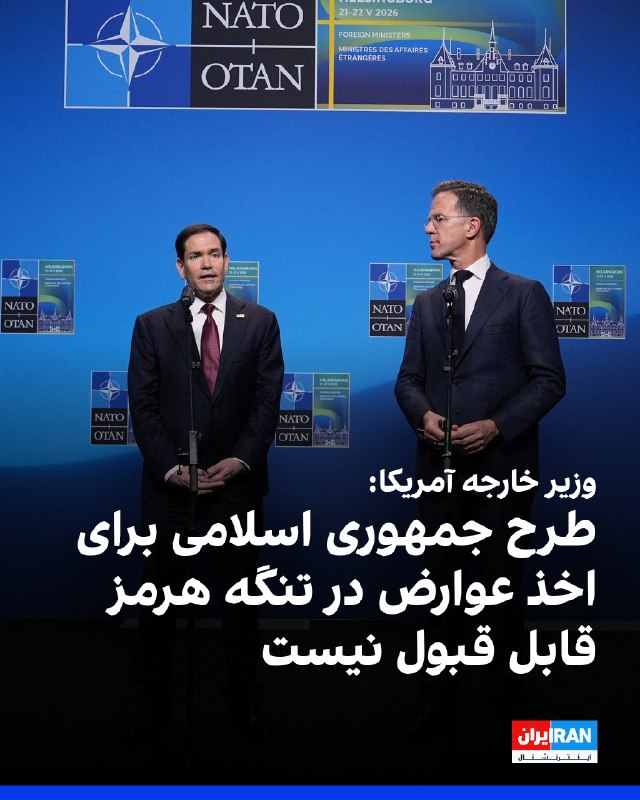

مارکو روبیو، وزیر خارجه آمریکا، جمعه یکم خرداد در حاشیه نشست ناتو گفت جمهوری اسلامی در پی ایجاد نظامی اختصاصی برای اخذ عوارض در یک آبراه بین‌المللی است و تلاش می‌کند عمان را نیز به پیوستن به این سازوکار متقاعد کند. روبیو تاکید کرد که این اقدام «غیرقابل قبول» است.

او افزود: «هیچ کشوری در جهان نباید چنین چیزی را بپذیرد. من کشوری را نمی‌شناسم که جز ایران از آن حمایت کند.»

روبیو با اشاره به تحرکات دیپلماتیک در سازمان ملل متحد گفت قطعنامه‌ای با پیشنهاد بحرین در شورای امنیت مطرح شده که آمریکا در آن نقش فعالی داشته و به گفته او، بیشترین تعداد هم‌پیشنهاددهنده را در تاریخ شورای امنیت دارد. او هشدار داد چند کشور در حال بررسی وتوی این قطعنامه هستند و افزود: «این مایه تاسف خواهد بود.»

وزیر خارجه آمریکا تاکید کرد واشینگتن برای دستیابی به اجماع جهانی جهت جلوگیری از اجرای چنین طرحی تلاش می‌کند و گفت: «باید دید آیا سازمان ملل همچنان کارآمد است یا نه. ما می‌کوشیم از این مسیر به نتیجه برسیم.»

او تصریح کرد اگر اخذ عوارض در تنگه هرمز اجرایی شود، ممکن است در دیگر آبراه‌های مهم جهان نیز تکرار شود.
‌🏁 🇬🇧 IranintlTV

🤖 @VahidOOnLine

## VahidOOnLine — post 241485

  

♦️ابراهیم رضایی، سخنگوی کمیسیون امنیت ملی مجلس شورای اسلامی روز جمعه اول خرداد در واکنش به تحریم سفیر جمهوری اسلامی در لبنان از سوی ایالات متحده با «شیطان» خواندن آمریکا گفت: «به جای دیپلمات‌ها، موشک‌ها را برای مذاکره با شیطان بفرستید تا حساب کار دستش بیاید.»
رضایی در پیامی در شبکه اجتماعی ایکس نوشت: «تحریم کردن دیپلمات وزارت امور خارجه یعنی تحریم کردن دیپلماسی، این مذاکره هم احتمالا فریب است و آمریکایی‌ها تمایلی به دیپلماسی ندارند. حالا که دیپلمات ایرانی را هم تحریم کرده‌اند به جای دیپلمات‌ها، موشک‌ها را برای مذاکره با شیطان بفرستید تا حساب کار دستش بیاید.»
پیشتر وزارت خارجه جمهوری اسلامی نیز تحریم محمدرضا رئوف شیبانی، سفیر اخراجی این کشور در لبنان از سوی آمریکا را «غیرقانونی» و «ناموجه» خواند و آن را «بی‌اعتنایی هیئت حاکمه آمریکا به اصول مسلم حقوق بین الملل و منشور سازمان ملل متحد» دانست.
وزارت خزانه‌داری آمریکا روز پنجشنبه اعلام کرد که سفیر جمهوری اسلامی در لبنان را همراه با ۹ نفر مرتبط با حزب‌الله که حاکمیت لبنان را تضعیف می‌کنند تحریم کرده است.
‌🇸🇦 Indypersian

🤖 @VahidOOnLine

## VahidOOnLine — post 241484

روایت شما از زندگی در آتش‌بس- جمعه ۱ خرداد ۱۴۰۵

🔹 کارگر شرکت کروز هستم از تهران. اینجا ماهی چند میلیون بابت غذا از حقوقمون کم می‌کنن، اما فقط برنج خالی می‌دن بخوریم و گاهی وقت‌ها تخم‌مرغ آب‌پز. آب معدنی، نوشابه و تنقلات کنار غذا رو کلاً حذف کردن.
🔹 امروز (۱ خرداد) یک دونه مرغ بسته‌ای خریدم؛ چهار تا سینه مرغ شد یک میلیون و ۳۶۰ هزار تومان. آخه چجوری دیگه میشه زندگی کرد؟
🔹 از کمال‌شهر کرج پیام می‌دم، خواستم بگم زندگی تو ایران اون‌قدری به ما بدهکاره که با پولش می‌شه سه‌تا زندگی دیگه خرید.
🔹 حقوق‌ها کفاف برطرف کردن نیازهای اولیه رو به زور می‌ده. هر روز داره سفره مردم کوچیک‌تر می‌شه، هر روز از دلخوشی‌های کوچیک و از خریدهای روزمره مردم کم می‌شه.
🔹 خدایا ما چه گناهی کردیم که باید تاوان نسل ۵۷ رو بدیم؟ ما جوونایی که اول راه زندگی بودیم، حالا زیر سایه جنگ، خفقان، فقر و ترس له می‌شیم. چرا ظالم‌ها آسوده حکومت می‌کنن و مردمی که فقط زندگی می‌خواستن، هر روز بیشتر تو تاریکی و ناامیدی فرو می‌رن؟
🔹 کارخانه لاستیک بارز کرمان به‌خاطر نداشتن مواد اولیه داره تعدیل نیرو می‌کنه و شیفت‌هاش رو یک‌سوم کرده.
🔹 از کرمان، من یک دانش‌آموز کلاس هشتم هستم. الان معلوم نیست امتحانات حضوریه یا نه؛ از یک طرف می‌گن حضوریه، از یک طرف می‌گن نیست. بعد از ۳ ماه درس نخوندن چطوری امتحان بدم؟
🔹 علی هستم از شاندیز مشهد. اینجا هم مثل بقیه کشور همه‌چی گرون شده و نمیشه خرید کرد. اینا فقط سر و صدا می‌کنن، آب هم جیره‌بندی شده.
🔹 از اهواز پیام می‌دم. اینجا یعنی کل ایران اوضاع اصلاً خوب نیست. مردم به معیشت و زندگی روزمره خودشون نمی‌رسن. عمو ترامپ لطفاً کارو تموم کن، مذاکره نمی‌خوایم دیگه، ما طاقت نداریم.
🔹 از گله‌دار استان فارس پیام می‌دم. می‌خوان مجسمه خمینی رو که مردم قبلاً آتیشش زده بودن بازسازی کنن. ما دوباره خرابش می‌کنیم.
‌🏁 🇬🇧 IranintlTV

🤖 @VahidOOnLine

## VahidOOnLine — post 241483

  

مارکو روبیو، وزیر خارجه آمریکا، در حاشیه نشست ناتو درباره مذاکرات جاری با جمهوری اسلامی گفت که واشینگتن در انتظار نتایج گفت‌وگوهای در حال انجام است؛ گفت‌وگوهایی که به گفته او نشانه‌هایی از پیشرفت داشته‌اند.

او افزود: «ما در انتظار نتایج این گفت‌وگوها هستیم که نشانه‌هایی از پیشرفت دارد. نمی‌خواهم در این باره اغراق کنم؛ تحرک محدودی صورت گرفته و این مثبت است، اما اصول اساسی تغییری نکرده است.»

وزیر خارجه آمریکا تاکید کرد که حکومت ایران هرگز نباید به سلاح هسته‌ای دست یابد و گفت: «برای تحقق این هدف، باید به مسئله غنی‌سازی و نیز موضوع اورانیوم با غنای بالا رسیدگی کنیم و افزون بر آن، موضوع تنگه هرمز را نیز مد نظر قرار دهیم.»
‌🏁 🇬🇧 IranintlTV

🤖 @VahidOOnLine

## VahidOOnLine — post 241482

  <a href="telegram/content/VahidOOnLine_241482_1779445357.mp4" target="_blank">🎬 Download video</a>

سازمان نظارت بر اینترنت نت‌بلاکس اعلام کرد خاموشی گسترده اینترنت در ایران وارد هشتاد و چهارمین روز شده و دسترسی به شبکه جهانی اینترنت برای بیش از ۱۹۹۲ ساعت همچنان به‌طور گسترده مختل است.
نت‌بلاکس در گزارشی نوشت ادامه این محدودیت‌ها شکاف‌های اجتماعی و اقتصادی را عمیق‌تر کرده و ارتباط با جهان خارج بیش از پیش به «امتیاز، تبعیت و دسترسی ویژه» وابسته شده است.
‌🏁 🇬🇧 ManotoTV

🤖 @VahidOOnLine

## VahidOOnLine — post 241481

  <a href="telegram/content/VahidOOnLine_241481_1779445358.mp4" target="_blank">🎬 Download video</a>

روزنامه وال‌استریت ژورنال گزارش داد هم‌زمان با آماده شدن ایران برای احتمال درگیری با آمریکا، بابک زنجانی، بازرگان ایرانی که خود را «ضدتحریم» معرفی می‌کند، یک شبکه مخفی پرداخت برای تأمین مالی نیروهای نظامی جمهوری اسلامی ایجاد کرده بود که محور اصلی آن صرافی ارز دیجیتال بایننس بوده است.
بر اساس این گزارش، این شبکه تا ماه دسامبر گذشته طی دو سال حدود ۸۵۰ میلیون دلار تراکنش را عمدتاً از طریق یک حساب معاملاتی در بزرگ‌ترین صرافی رمزارز جهان انجام داده است. گزارش‌های داخلی بایننس نشان می‌دهد نزدیکان زنجانی، از جمله خواهرش، شریک عاطفی او و یکی از مدیران شرکتش، حساب‌های دیگری را نیز اداره می‌کردند که همگی از دستگاه‌های مشترک استفاده می‌کردند؛ موضوعی که بازرسان بایننس آن را نشانه‌ای از تلاش برای دور زدن تحریم‌های آمریکا علیه ایران دانسته‌اند.
وال‌استریت ژورنال نوشت با وجود هشدارهای داخلی متعدد، حساب اصلی این شبکه دست‌کم ۱۵ ماه همچنان فعال مانده و تا ژانویه امسال نیز باز بوده است. این گزارش همچنین می‌گوید میلیاردها دلار تراکنش رمزارزی طی دو سال گذشته از طریق بایننس به شبکه‌های مالی مرتبط با سپاه پاسداران منتقل شده است.
مقام‌های خارجی مسئول پیگیری تأمین مالی تروریسم گفته‌اند امسال نیز انتقال پول از طریق حساب‌های بایننس به نهادهای وابسته به جمهوری اسلامی ادامه داشته و تراکنش‌هایی حتی در همین ماه شناسایی شده است.
‌🏁 🇬🇧 ManotoTV

🤖 @VahidOOnLine

## VahidOOnLine — post 241480

  <a href="telegram/content/VahidOOnLine_241480_1779445359.mp4" target="_blank">🎬 Download video</a>

رییس اورژانس پیش‌بیمارستانی و مدیریت حوادث دانشگاه علوم پزشکی البرز اعلام کرد بر اثر تصادف زنجیره‌ای در آزادراه کرج قزوین، سه نفر جان باختند و چهار نفر دیگر مجروح شدند.
به گزارش رسانه‌های داخلی، در این سانحه دو مرد و یک زن کشته شدند و سه مرد و یک زن دیگر نیز مجروح شدند.
مصدومان توسط نیروهای اورژانس به بیمارستان امام جعفر صادق نظرآباد منتقل شدند.
‌🏁 🇬🇧 ManotoTV

🤖 @VahidOOnLine

## VahidOOnLine — post 241479

  <a href="telegram/content/VahidOOnLine_241479_1779445360.mp4" target="_blank">🎬 Download video</a>

وزارت خارجه جمهوری اسلامی تحریم محمدرضا رئوف شیبانی، سفیر ایران در لبنان، از سوی آمریکا را «غیرقانونی» و «ناموجه» توصیف کرد و آن را نشانه «بی‌اعتنایی هیئت حاکمه آمریکا به اصول حقوق بین‌الملل و منشور سازمان ملل» دانست.
این وزارتخانه همچنین تحریم تعدادی از نمایندگان حزب‌الله و مسئولان لبنانی را محکوم کرد و اقدامات آمریکا را «سخیف» و در راستای تضعیف حاکمیت ملی لبنان و «فتنه‌انگیزی در جامعه لبنان» خواند.
‌🏁 🇬🇧 ManotoTV

🤖 @VahidOOnLine

## WithYashar — post 11934

  

تصاویر ماهواره‌ای که امروز ثبت شده‌اند، آنچه به نظر می‌رسد بیش از یک دوجین هواپیمای سوخت‌رسان در محوطهٔ پایگاه هوایی شاهزاده سلطان را نشان می‌دهد، همچنین چندین هواپیمای شناسایی E-3 سنتری و دست‌کم ۲۰ جنگنده، به‌همراه چندین هواپیمای سوخت‌رسان که در وضعیت آمادهٔ برخاست هستند.

واشنگتن در حالی که دیپلمات‌ها در حال مذاکره هستند، ماشین جنگی خود را در وضعیت آماده شلیک نگه داشته است.
@withyashar

## WithYashar — post 11933

کانال ۱۲ اسرائیل : بر اساس گزارش، پیش‌نویس توافق‌نامه در مجموع شامل ۹ ماده است
از جمله توقف عملیات نظامی و جنگ رسانه‌ای بین کشورها، احترام به حاکمیت و خودداری از دخالت در امور داخلی و همچنین رعایت قوانین بین‌المللی و منشور سازمان ملل.
@withyashar

## WithYashar — post 11932

امروز ۲۲ می (۱ خرداد) روز جهانی پیتزای بیت‌کوین است . این روز به یادبود اولین تراکنش واقعی برای خرید یک کالای فیزیکی با بیت‌کوین در سال ۲۰۱۰ نام‌گذاری شده است که در آن کاربری به نام لازلو هانیچ (Laszlo Hanyecz) دو پیتزا را در ازای ۱۰,۰۰۰ بیت‌کوین خریداری کرد.
@withyashar

## WithYashar — post 11931

وزیر امور خارجه آلمان: ما در حال آماده شدن برای مشارکت در تأمین امنیت تنگه هرمز تحت رهبری بریتانیا هستیم، اما انتظار ماموریتی مشابه ناتو را ندارم
@withyashar

## WithYashar — post 11930

وال استریت ژورنال: میلیاردها دلار از طریق پلتفرم بایننس به شبکه‌هایی که نظام ایران را تامین مالی می‌کنند، جریان یافته است بابک زنجانی شخص مسئول ایرانی در معاملات از طریق پلتفرم بایننس است @withyashar

## WithYashar — post 11929

رسانه‌های داخلی ایران تصاویری منتشر کرده‌اند که نشان می‌دهد نیروهای سپاه به غیرنظامیان و کودکان آموزش باز و بسته کردن سلاح می‌دهند. خبرگزاری «آسوشیتدپرس» نیز گزارش داده نیروهای سپاه به‌طور منظم نحوه استفاده از تفنگ‌های تهاجمی مانند کلاشینکف به غیرنظامیان آموزش می‌دهند. پایتخت ایران همچنین شاهد رژه خودروهای نظامی مجهز به مسلسل‌های قدیمی ساخت شوروی است.
@withyashar

## WithYashar — post 11928

بلومبرگ : پوتین می‌خواهد جنگ اوکراین را تا پایان امسال به پایان برساند، اما فقط با شرایطی که روسیه بتواند آن‌ها را به عنوان پیروزی معرفی کند.

این شرایط شامل کنترل کامل منطقه دونباس و تضمین‌های امنیتی گسترده‌تر از اروپا است که به طور موثر کسب‌های ارضی روسیه در اوکراین را به رسمیت می‌شناسد.
@withyashar

## WithYashar — post 11927

سنتکام: ناو هواپیمابر آبراهام لینکلن در بالاترین سطح آمادگی عملیاتی قرار دارد
@withyashar

## WithYashar — post 11926

سخنگوی کمیسیون امنیت ملی: موشک‌ها را برای مذاکره با شیطان بفرستید.
@withyashar

## WithYashar — post 11925

ترامپ فروش ۱۴ میلیارد دلار سلاح به تایوان را متوقف کرده تا مهمات آمریکا برای جنگ با ایران حفظ شود؛ به‌گفتهِ هانگ کائو، سرپرست وزارت نیروی دریایی آمریکا.

او به سناتورها گفت: “در حال حاضر ما این فروش را متوقف کرده‌ایم تا مطمئن شویم مهماتی که برای عملیات اِپیک فیوری لازم داریم در اختیارمان باشد.” کائو اضافه کرد که آمریکا همچنان “به‌قدرِ کافی” سلاح در اختیار دارد.
@withyashar

## WithYashar — post 11924

وال استریت ژورنال:
میلیاردها دلار از طریق پلتفرم بایننس به شبکه‌هایی که نظام ایران را تامین مالی می‌کنند، جریان یافته است
بابک زنجانی شخص مسئول ایرانی در معاملات از طریق پلتفرم بایننس است
@withyashar

## WithYashar — post 11923

رویترز به نقل از یک منبع پاکستانی:

نگرانی‌هایی وجود دارد که صبر ترامپ رو به پایان باشد، اما ما در حال تلاش برای تسریع روند انتقال پیام‌ها میان دو طرف هستیم
@withyashar

## WithYashar — post 11922

جروزالم پست: مقامات اطلاعاتی اسرائیل هشدار دادند که ایران ممکن است در حال برنامه‌ریزی برای حمله موشکی و پهپادی غافلگیرکننده علیه اسرائیل و کشورهای خلیج فارس باشد
@withyashar

## mwarmonitor — post 9469

🚨 خبرنگار الجزیره: شورای اروپا تحریم‌های خود علیه ایران را گسترش داده و افراد و نهادهایی را نیز شامل کرده است که به تهدید کشتیرانی در خاورمیانه متهم هستند.

@mwarmonitor

## mwarmonitor — post 9468

🔴 منبع پاکستانی به الجزیره:
«آمریکا و ایران درگیر و اسیر مواضع سخت‌گیرانه و سقف‌های بالای خواسته‌های خود درباره اورانیوم، بستن تنگه هرمز و محاصره بنادر هستند.»

@mwarmonitor

## mwarmonitor — post 9467

📝 اظهار نظر تو شرایط فعلی بیشتر شبیه به شرط‌بندی روی مسابقات اسب‌دوانی است تا تحلیل سیاسی؛ با این حال، نظر من همچنان مانند گذشته است: توافقی در کار نخواهد بود و جنگ شروع خواهد شد.

@mwarmonitor

## mwarmonitor — post 9466

🔴 فوری | پیش‌نویس نهایی یک توافق احتمالی میان ایالات متحده و ایران با میانجی‌گری پاکستان، طبق منابع العربیه، انتظار می‌رود ظرف چند ساعت آینده اعلام شود. مفاد اصلی آن به شرح زیر است: 🔴 پیش‌نویس نهایی توافق احتمالی آمریکا–ایران با میانجی‌گری پاکستان ممکن است…

## mwarmonitor — post 9465

  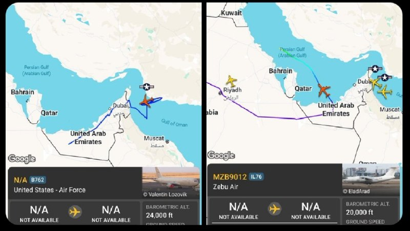

✈️🛰 تداخل GPS بر فراز امارات/خلیج عمان باعث می‌شود هواپیما در Flightradar24 در موقعیت‌های اشتباه نمایش داده شود.

✈️هواپیمای KC-46A نیروی هوایی آمریکا در واقع بر فراز خلیج عمان است، نه بر فراز ایران.

✈️هواپیمای Il-76TD اماراتی در واقع در امارات فرود آمده و در خلیج فارس نیست.

@mwarmonitor

## mwarmonitor — post 9464

🔴خبر اختصاصی: ترامپ سرکوب شهروندی را تشدید می‌کند

📝نویسنده: بریتانی گیبسون AXIOS

🔰دولت ترامپ به منظور سرعت بخشیدن به تلاش‌ها برای سلب شهروندی از آمریکایی‌های هیسپانیک‌تبار و سایر مهاجرانی که تابعیت گرفته‌اند (Naturalized Americans)، وکلای مهاجرت را به طور موقت به وزارت دادگستری منتقل می‌کند؛ موضوعی که اکسیوس به آن پی برده است.

چرا این موضوع اهمیت دارد؟
پرونده‌های «سلب تابعیت» (Denaturalization) نیاز به بار اثبات (مدارک و شواهد) بسیار سنگینی دارند، اما این موضوع به یکی از اولویت‌های اصلی مقامات دولت ترامپ تبدیل شده است که به دنبال کشف و ردیابی کلاهبرداری در سیستم مهاجرت قانونی هستند.
نگاهی دقیق‌تر (بزرگ‌نمایی)
چهار مقام سابق آژانس مهاجرت به اکسیوس اعلام کردند که وکلای اداره شهروندی و مهاجرت ایالات متحده (USCIS) — که دفتر اصلی خدمات مهاجرت قانونی است — به طور موقت به دفاتر دادستانی ایالات متحده منتقل می‌شوند تا روی پرونده‌های سلب تابعیت کار کنند.
یکی از منابع گفت که به کارمندان گفته شده به این دفاتر منتقل شوند (انتقال‌های اجباری در قالب داوطلبانه). منبع دوم این جابه‌جایی‌ها را مجبور کردن وکلا به «داوطلب شدن اجباری» توصیف کرد.
منبع سوم اشاره کرد که نیازی نیست این وکلا سابقه قبلی در دادگاه یا پرونده‌های سلب تابعیت داشته باشند؛ بلکه تنها داشتن پروانه وکالت فعال کافی است.
زک کالر، سخنگوی اداره شهروندی و مهاجرت آمریکا (USCIS) در این باره گفت: «ما مفتخریم که با اعزام تیمی از ماهرترین وکلای مهاجرتی خود به وزارت دادگستری، از این تلاش حیاتی حمایت می‌کنیم.»
پشت پرده ماجرا
دولت ترامپ در دوره اول ریاست‌جمهوری خود نیز تلاش کرد تا آمار پرونده‌های سلب تابعیت را افزایش دهد و تیمی اختصاصی متشکل از ۱۰ تا ۱۵ وکیل تشکیل داد. جو ادلو، رئیس سابق USCIS، سپتامبر گذشته گفت پرونده‌هایی که توسط آن تیم شناسایی شده‌اند «هنوز در دست بررسی و جریان هستند.»
یکی از منابع گفت: «دلیلی وجود دارد که چرا پرونده‌های سلب تابعیت هیچ‌وقت واقعاً اوج نگرفته‌اند. اثبات این موارد بسیار سخت است... معیارها بسیار سخت‌گیرانه هستند و شما به مدارک محکمی نیاز دارید. در بسیاری از پرونده‌ها، چنین مدارکی اصلاً وجود ندارد.»
بار حقوقی اثبات جرم: در پرونده‌های حقوقی (مدنی) که فرد به طور عمدی در درخواست خود دروغ گفته است، قانون نیاز به اثبات از طریق «شواهد واضح، متقاعدکننده و بدون ابهام دارد که هیچ شک و شبهه‌ای باقی نگذارد.»
در مواردی که فرد به طور غیرقانونی شهروندی کشوری را گرفته که واجد شرایط آن نبوده است، ممکن است اتهامات کیفری نیز علیه او مطرح شود.
تصویر کلی
بر اساس گزارش ماه آوریل روزنامه نیویورک تایمز، مقامات وزارت دادگستری نام ۳۸۵ نفر را در فهرست نهایی برای اتهامات سلب تابعیت قرار داده‌اند. در دوره اول ترامپ، اداره USCIS ادعا کرد که ۲۵۰۰ پرونده بالقوه را شناسایی کرده، اما تنها بخش کوچکی از آن‌ها را به وزارت دادگستری ارجاع داد.
به گفته سخنگوی وزارت دادگستری (DOJ)، دولت ترامپ از زمان آغاز دوره دوم خود ۳۵ پرونده سلب تابعیت تشکیل داده است که ۱۲ مورد آن همین ماه گذشته انجام شده است.
همچنین یادداشت وزارت دادگستری در ژوئن ۲۰۲۵، سلب تابعیت را به عنوان یکی از اولویت‌های اصلی دولت ترامپ فهرست کرده بود. در این یادداشت با اشاره به مزایای پیگیری این پرونده‌ها آمده است که این اقدام «از یکپارچگی و سلامت کل برنامه اعطای تابعیت حمایت می‌کند.»
سخنگوی وزارت دادگستری در بیانیه‌ای به اکسیوس گفت که این وزارتخانه از کمک وکلای USCIS «برای پیشبرد مأموریت رئیس‌جمهور جهت ارتقای امنیت عمومی و ریشه‌کن کردن کلاهبرداری» استقبال می‌کند.

📌افزایش پرونده‌های سلب تابعیت، مدت‌هاست که هدف اصلی جو ادلو در مبارزه او علیه درخواست‌های مهاجرتی مشکوک به کلاهبرداری بوده است.
ادلو سپتامبر گذشته در رویدادی که توسط «مرکز مطالعات مهاجرت» برگزار شد، در پاسخ به سؤالی درباره واحد سلب تابعیت در دوره اول ترامپ گفت: «فکر می‌کنم غیرمتمرکز کردن فرآیند سلب تابعیت نیز به همان اندازه مفید است.»
او افزود: «اگر موردی پیش بیاید که نیاز به سلب تابعیت داشته باشد، ما اقدام خواهیم کرد. نیازی ندارم که پرونده حتماً به یک دفتر خاص فرستاده شود؛ من می‌خواهم هر دفتری از این موضوع به عنوان یک معیار استاندارد استفاده کند.»

@mwarmonitor

## mwarmonitor — post 9463

مغزهای متفکر این یک پیش نویس نه توافق

## mwarmonitor — post 9462

استادان رسانه‌ ای این خبر الان نه دیشب

## mwarmonitor — post 9461

🔴 فوری | پیش‌نویس نهایی یک توافق احتمالی میان ایالات متحده و ایران با میانجی‌گری پاکستان، طبق منابع العربیه، انتظار می‌رود ظرف چند ساعت آینده اعلام شود. مفاد اصلی آن به شرح زیر است:

🔴 پیش‌نویس نهایی توافق احتمالی آمریکا–ایران با میانجی‌گری پاکستان ممکن است ظرف چند ساعت اعلام شود

🔴 آتش‌بس فوری، جامع و بدون قید و شرط در تمام جبهه‌ها شامل زمین، دریا و هوا

🔴 تعهد متقابل به عدم هدف قرار دادن زیرساخت‌های نظامی، غیرنظامی یا اقتصادی

🔴 پایان عملیات نظامی و توقف جنگ رسانه‌ای

🔴 تعهد به احترام به حاکمیت، تمامیت ارضی و عدم مداخله در امور داخلی

🔴 تضمین آزادی کشتیرانی در خلیج فارس، تنگه هرمز و خلیج عمان

🔴 ایجاد سازوکار مشترک برای نظارت بر اجرای توافق و حل اختلافات

🔴 آغاز مذاکرات درباره مسائل باقی‌مانده ظرف هفت روز

🔴 لغو تدریجی تحریم‌های آمریکا در ازای پایبندی ایران به مفاد توافق

🔴 پیش‌نویس توافق بر پایبندی به قوانین بین‌المللی و منشور سازمان ملل تأکید می‌کند

🔴 این توافق بلافاصله پس از اعلام رسمی از سوی هر دو طرف اجرایی خواهد شد

@mwarmonitor

## mwarmonitor — post 9460

🔴وزیر خارجه بریتانیا:
«این شرم‌آور است که ایران تلاش می‌کند با جلوگیری از حرکت کشتیرانی بین‌المللی، کل اقتصاد جهانی را به گروگان بگیرد.»

@mwarmonitor

## mwarmonitor — post 9459

🔴منبع پاکستانی به الجزیره:
«اسلام‌آباد همچنان نسبت به امکان رسیدن به یک تفاهم مرحله‌ای میان واشنگتن و تهران خوش‌بین است.»

@mwarmonitor

## mwarmonitor — post 9458

  <a href="telegram/content/mwarmonitor_9458_1779445362.mp4" target="_blank">🎬 Download video</a>

📝 خفه شو نطفه حرامیِ دوزاری، تو رو چه به این گنده‌گوزی‌ها؟ نهایتاً تخصص و سقف پروازت این بوده که سهمیه بگیری و برای خرید باتوم تا حسن‌آباد بدوی، حالا واسه ما تزِ دو سال زندگی و خونه خریدن تو آلمان می‌دی؟ هرچی بیشتر اون دهنِ نجست رو باز می‌کنی، گندِ دروغات بیشتر بالا می‌زنه و بوی تعفنِ جیره‌خوری و اون پایگاه بسیجِ صاحاب‌مرده‌ات از پشت این گوشی بیشتر دنیا رو برمی‌داره. آخه انگلِ ساندیس‌خور، تو رو چه به فرنگ و عکاسی؟ تو نهایتاً بتونی جفت پا بری رو اعصابِ خلق‌الله و لای کفتارها سهمیه گشتِ شبانه‌ات رو بگیری. اینقدر به این آمار و ارقامِ تخیلی و مغزِ شستشو داده‌ات نناز، نطفهٔ ناپاک! تهِ حماسه و تخصص تو همون پرچم گردانی شبانه، پس بتمرگ سر جات و اون دهنِ کثیفت رو ببند!

@mwarmonitor

## mwarmonitor — post 9457

🔸 سخنگوی وزارت امور خارجه پاکستان اعلام کرد: چین از تلاش‌های ما برای میانجی‌گری حمایت می‌کند و به‌همراه ما یک ابتکار پنج‌بندی ارائه داده است.

@mwarmonitor

## mwarmonitor — post 9456

🔴 به نقل از رویترز و به گفته یک منبع پاکستانی:
🔸نگرانی‌هایی وجود دارد که صبر ترامپ رو به پایان باشد، اما ما در حال تلاش برای تسریع روند انتقال پیام‌ها میان دو طرف هستیم.

📝 یعنی هر لحظه امکانش هست دستور حمله بده
@mwarmonitor

## pm_afshaa — post 91186

  <a href="telegram/content/pm_afshaa_91186_1779445365.webm" target="_blank">🎬 Download video</a>

🔴وال‌استریت ژورنال:
میلیاردها دلار رمزارز از طریق بایننس به شبکه‌های مالی مرتبط با جمهوری اسلامی و سپاه منتقل شده و این روند ادامه داره.

طبق این گزارش، بابک زنجانی طی دو سال حدود 850 میلیون دلار تراکنش در بایننس داشته که گفته میشه صرف تامین مالی ساختار نظامی جمهوری اسلامی شده باشه.

وزارت دادگستری آمریکا تحقیقاتی رو درباره استفاده جمهوری اسلامی از پلتفرم بایننس به‌منظور دور زدن احتمالی تحریم‌ها آغاز کرده.

💧 Rainbet.com the #1 Non-KYC Crypto Casino & Sportsbook @rainbetcom

😁 @Pm_Afshaa

## pm_afshaa — post 91185

  <a href="telegram/content/pm_afshaa_91185_1779445365.webm" target="_blank">🎬 Download video</a>

🔴الجزیره به نقل از منبع پاکستانی:
اصرار آمریکا و ایران بر بالا بردن سقف خواسته‌هایشان درباره اورانیوم و تنگه هرمز، به بن‌بست در مذاکرات منجر شده.

💧 Rainbet.com the #1 Non-KYC Crypto Casino & Sportsbook @rainbetcom

😁 @Pm_Afshaa

## pm_afshaa — post 91184

  <a href="telegram/content/pm_afshaa_91184_1779445366.webm" target="_blank">🎬 Download video</a>

🔴رویترز به نقل از یک منبع پاکستانی:
نگرانی وجود داره که صبر ترامپ در حال تمام شدن است، اما ما در تلاشیم تا سرعت انتقال پیام بین دو طرف رو افزایش بدیم.

💧 Rainbet.com the #1 Non-KYC Crypto Casino & Sportsbook @rainbetcom

😁 @Pm_Afshaa

## pm_afshaa — post 91183

🔴جروزالم پست: مقامات اطلاعاتی اسرائیل هشدار دادند که ایران ممکن است در حال برنامه‌ریزی برای حمله موشکی و پهپادی غافلگیرکننده علیه اسرائیل و کشورهای خلیج فارس باشد

💧 Rainbet.com the #1 Non-KYC Crypto Casino & Sportsbook @rainbetcom

😁 @Pm_Afshaa

## pm_afshaa — post 91182

🔴وال استریت ژورنال: وزارت دادگستری آمریکا تحقیقات خود را درباره استفاده ایران از پلتفرم بایننس برای احتمالا دور زدن تحریم‌ها آغاز کرده

💧 Rainbet.com the #1 Non-KYC Crypto Casino & Sportsbook @rainbetcom

😁 @Pm_Afshaa

## DEJradio — post 4836

  <a href="telegram/content/DEJradio_4836_1779445367.webm" target="_blank">🎬 Download video</a>

🚨📢 محاصره دریایی ایران؛
ذخیره‎سازی نفت در نفتکش‌های قدیمی و کوچک

روزنامه فایننشال‌تایمز گزارش داد جمهوری اسلامی در پی محاصره دریایی توسط آمریکا و کاهش شدید امکان صادرات نفت، به ذخیره‌سازی نفت روی نفتکش‌های فرسوده در خلیج فارس روی آورده است. این اقدام نشان‌دهنده فشار فزاینده بر صادرات نفت ایران در هفته‌های اخیر است.

براساس آخرین داده‌ها مخازن نفتکش‌های قدیمی هم پر شده و برای ذخیره نفت تولیدی از شناورهای کوچک‌تر استفاده می‌شود.
بر اساس تحلیل تصاویر ماهواره‌ای آژانس فضایی اروپا، تعداد نفتکش‌های متوقف‌شده در اطراف جزیره خارک، مهم‌ترین پایانه صادرات نفت ایران، از شش کشتی در یک ماه پیش به ۲۰ کشتی رسیده است. بسیاری از این کشتی‌ها سامانه‌های موقعیت‌یاب خود را خاموش کرده‌اند و در داده‌های معمول کشتیرانی قابل مشاهده نیستند.

نیما منصفی تحلیلگر «اطلاعات ژئوفضایی» با استناد به تصاویر ماهواره‌ای از ترمینال نفتی خارگ در «ایکس» نوشت، «دو نفتکش کوچک که سابقا مصرف داخلی داشتند در حال بارگیری در جزیره خارگ هستند. ظرفیت آنها حداکثر ۱۵۰ هزار بشکه است».

#محاصره_دریایی #خلیج_فارس #تنگه_هرمز
@DEJradio

## DEJradio — post 4835

  <a href="telegram/content/DEJradio_4835_1779445367.mp4" target="_blank">🎬 Download video</a>

🤡
🔺 چادری‌ها بی‌حجاب‌های حکومتی را تحمل نمی‌کنند.

#حجاب #چادری #تجمعات_حکومتی
@DEJradio

## DEJradio — post 4834

  <a href="telegram/content/DEJradio_4834_1779445369.webm" target="_blank">🎬 Download video</a>

🚨
⭕️ منابع مطلع به دژ می‌گویند، بامداد آدینه ابتدای خرداد، حوالی ساعت ۰۲:۰۰ در بهشهر استان مازندران محله «سارو»، فردی به‌نام حسین محمدی توسط ماموران نیروی انتظامی کشته شده است.

ایست بازرسی و گشت محله‌محور که توسط ماموران نیروی انتظامی [یگان امداد] برقرار شده بود یک ماشین پژو پارس را متوقف می‌کند و با بدرفتاری و توهین دو سرنشین را بازرسی بدنی می‌شوند.

شاهدان می‌گویند پلیس به دو جوان حرف‌های تحقیرآمیز زده‌اند.

حسین محمدی (پدر یکی از سرنشینان) برای آرام کردن قضیه وارد می‌شود اما ماموران به او نیز توهین می‌کنند و درگیر می‌شوند که یکی از ماموران او را با تیر مستقیم کلت به قتل می‌رساند. در پی این اقدام مردم و نیروی انتظامی درگیر شدند.

#مازندران #قتل #حسین_محمدی
@DEJradio

## DEJradio — post 4833

  <a href="telegram/content/DEJradio_4833_1779445370.webm" target="_blank">🎬 Download video</a>

🔺📢 اعتصاب مرغ‌داران بهبهان در استان خوزستان موجب کمبود مرغ در شهر شده است.
مرغ‌داران که ۸ روز است در اعتصاب به سر می‌برند، علت اعتصاب خود را بالا بودن هزینه‌ها عنوان کرده‌اند.
در مرغ‌فروشی‌ها تنها ران یخ زده مرغ که از شهرهای دیگر آورده می‌شود موجود است و هر کیلو نزدیک به ۴۰۰ هزار تومان به فروش می‌رسد که توان خرید آن برای اقشار ضعیف اصلا ممکن نیست.
مرغ‌داران می‌گویند توان تامین ذرت و سویا را ندارند و بدهکارند.

#مرغ #تورم
@DEJradio

## DEJradio — post 4832

  <a href="telegram/content/DEJradio_4832_1779445371.webm" target="_blank">🎬 Download video</a>

🚨📢 منابع غیررسمی می‌گویند احتمال دارد آمریکا برای آن‌دسته بازیکنان و اعضای کادر فنی تیم فوتبال جمهوری اسلامی که پیشینه حضور در تیم‌های سـ.ـپاه و بـ.ـسیج را دارند ویزا صادر نکند.

سوشا مکانی دروازه‌بان سابق تیم پرسپولیس و تیم ملی فوتبال، با اشاره به حضور بازیکنان تیم فوتبال در سفارت آمریکا در آنکارا برای دریافت ویزا، در استوری اینستاگرامش نوشت: «اگر فشار جیانی اینفانتینو [رئیس فیفا] به آمریکا نتیجه نده، مهدی طارمی، شجاع خلیل‌زاده، احسان حاج‌صفی و... به دلیل سربازی در سـ.ـپاه جام جهانی رو از دست میدن. روزبه چشمی هم سربازیش تو باشگاه مقاومت بـ.ـسیج بوده... سعید الهویی و آندرو تیموریان هم سرباز ســ.ـپاه بودند. اگر آمریکا تهدیدات کلامی چند بازیکن در تجمعات شبانه رو مبنا قرار بده چند بازیکن دیگه هم جا می‌مونند.»

بر اساس آخرین گزارش‌ها ادعا شد روزبه چشمی در اردوی آنتالیا مصدوم شده و احتمالا از فهرست تیم خط می‌خورد.
اعضای تیم فوتبال پنجشنبه ۳۱ اردیبهشت برای دریافت ویزا به سفارت آمریکا در آنکارا رفتند.

#تیم_ملی #تحریم
@DEJradio

## DEJradio — post 4831

  <a href="telegram/content/DEJradio_4831_1779445371.webm" target="_blank">🎬 Download video</a>

🔺📢 بر اساس اطلاعات دریافتی از ایران، حقوق اردیبهشت بازنشستگان صندوق بازنشستگی نیرو‌های مسلح واریز شده است اما برخلاف اعلام قبلی، مبلغ «فوق‌العاده خاص» افزایش نیافته است.
این مبلغ اضافه فقط ۶۰۰ هزار تومان (برابر با ۵ دلار) بود!

منابع نظامی می‌گویند سازمان برنامه و بودجه به علت ناکافی بودن منابع، با تامین اعتبار برای افزایش این مولفه مزدی موافقت نکرده است.

گفتنی است حقوق اردیبهشت پرسنل نیروهای مسلح بازنشسته‌های لشکری با تأخیر طولانی واریز شده است. همچنین پرسنل ارتش می‌گویند «بسیاری از داروها حتی آنهایی که در داخل تولید می‌شود از فهرست بیمه خدمات درمانی خارج شده‌ است و حتی آنتی‌بیوتیک‌ها و مُسکن‌ها آزاد حساب می‌شوند.»

دو ماه بعد از جنگ ۴۰ روزه باوجود اینکه نیروهای مسلح با تلفات سنگینی روبه‌رو شدند اما حکومت کمترین توجه را به آنها ندارد و نارضایتی بین آنها تشدید شده است.

#نیرو‌های_مسلح #ارتش
@DEJradio

## kianmeli1 — post 87552

  <a href="telegram/content/kianmeli1_87552_1779445372.mp4" target="_blank">🎬 Download video</a>

🔴میلیاردها دلار از طریق بابک زنجانی و صرافی بایننس برای تامین مالی سپاه پاسداران جابجا کرده است

ایران طی سال‌های اخیر میلیاردها دلار را از طریق صرافی رمزارزی «بایننس» جابه‌جا کرده تا شبکه‌های مالی مرتبط با سپاه پاسداران را تامین کند؛ تراکنش‌هایی که به گفته این رسانه، حتی تا همین ماه نیز ادامه داشته‌اند.

بر اساس گزارش وال استریست ژورنال، این انتقال‌ها شامل حدود ۸۵۰ میلیون دلار تنها از طریق یک حساب کاربری در بایننس بوده که طی دو سال توسط بابک زنجانی، تاجر ایرانی و آنچه در اسناد داخلی «اپراتور ضدتحریم» خوانده شده، اداره می‌شد.

گزارش می‌گوید سیستم‌های نظارتی داخلی بایننس دست‌کم ۱۲ بار این حساب را به‌عنوان حساب مشکوک علامت‌گذاری کرده بودند، اما این حساب بیش از ۱۵ ماه پس از نخستین هشدار همچنان فعال باقی ماند.

این گزارش همچنین از انتقال ۲۱۸ میلیون دلار به شبکه مالی وابسته به حکومت ایران از طریق یک کیف‌پول مرتبط با بایننس خبر می‌دهد. وال‌استریت ژورنال پیش‌تر گزارش داده بود که حدود ۱.۷ میلیارد دلار از طریق بایننس به همین شبکه مالی ایرانی منتقل شده است.
https://t.me/kianmeli1

## kianmeli1 — post 87551

  <a href="telegram/content/kianmeli1_87551_1779445374.mp4" target="_blank">🎬 Download video</a>

🔴صدای #بنیامین_نقدی و #منوچهر_فلاح باشیم

بنیامین نقدی، از معترضان بازداشت شده در ۱۳ دی‌ماه خونین در شهر شیراز است. وضعیت پرونده‌سازی، اخذ اعتراف اجباری و کینه‌ی قضات شیراز در تسریع اجرای حکم اعدام، جان او را در خطر جدی قرار داده است. همچنین منوچهر فلاح توسط قاضی مرگ گیلان «احمد درویش گفتار» پس از رد اعاده‌ی دادرسی دوباره به اعدام محکوم شده.

در روزها و ساعاتی که ماشین سرکوب جمهوری اسلامی، هر جان و نام بازداشتی محکوم به اعدام را تنها به عددی در کارنامه‌ی خونین خود بدل میکند، نام‌شان را فریاد بزنیم، آنها جز ما فریادرسی ندارند
https://t.me/kianmeli1

## kianmeli1 — post 87550

  <a href="telegram/content/kianmeli1_87550_1779445376.mp4" target="_blank">🎬 Download video</a>

🔴حزب‌الله با پهپاد انتحاری، یکی از باتری‌های گنبد آهنین اسرائیل را هدف قرار داده است

دقیقا مشخص نیست این نوع پهپادهای سبک از کجا تامین میشوند
https://t.me/kianmeli1

## kianmeli1 — post 87549

  

🔴درگیری در ایران به هند ضربه سختی وارد کرده است. این کشور به نفت وارداتی متکی است که بخش عمده آن از طریق تنگه هرمز وارد می‌شود، بنابراین افزایش قیمت انرژی باعث تضعیف رشد، افزایش تورم و ترساندن سرمایه‌گذاران می‌شود.

مودیز در حال حاضر پیش‌بینی رشد هند را به ۶ درصد کاهش داده است - بسیار کمتر از ۸ درصدی که مودی می‌گوید برای تبدیل هند به یک کشور توسعه‌یافته تا سال ۲۰۴۷ لازم است.

در عین حال، ترامپ به چین و پاکستان، دو رقیب اصلی هند، نزدیک‌تر شده است و سال‌ها تلاش مودی برای ایجاد روابط قوی‌تر با واشنگتن را تضعیف می‌کند.
https://t.me/kianmeli1

## IranIntlTV — post 338390

  <a href="telegram/content/IranIntlTV_338390_1779445380.mp4" target="_blank">🎬 Download video</a>

مارکو روبیو، وزیر خارجه آمریکا، در دومین روز نشست وزیران خارجه کشورهای عضو ناتو در هلسینبرگ سوئد، هشدار داد هرگونه اقدام جمهوری اسلامی درباره محدودیت تردد یا دریافت عوارض در تنگه هرمز، می‌تواند روند رسیدن به توافق را با خطر مواجه کند.
گفت‌وگو با علی‌حسین قاضی‌زاده، عضو تحریریه ایران‌اینترنشنال
@iranintltv

## IranIntlTV — post 338389

  <a href="telegram/content/IranIntlTV_338389_1779445382.mp4" target="_blank">🎬 Download video</a>

تصویر رسیده به ایران اینترنشنال نشان می‌دهد بستگان و خانواده سعید یعقوبی، از جوانان اعدام‌شده در پرونده مشهور به «خانه اصفهان» بر سر مزارش برگزار شد. این پرونده بر سر مرگ یک مامور انتظامی و دو بسیجی در اعتراضات سال ۱۴۰۱ در محله «خانه اصفهان» تشکیل و در آن صالح میرهاشمی و مجید کاظمی نیز اعدام شده بودند.

## IranIntlTV — post 338388

  

حسنعلی اخلاقی‌امیری، عضو کمیسیون فرهنگی مجلس، به دیده‌بان ایران گفت جمهوری اسلامی بنا ندارد در حوزه خلیج فارس و تنگه هرمز از «حقوق» خود کوتاه بیاید و افزود: «قانون دریافت عوارض از تنگه هرمز را تصویب می‌کنیم.»

او اضافه کرد: «تمام مسئولان اتفاق نظر دارند که تنگه هرمز از منافع جمهوری اسلامی است. هر مذاکره‌ای هم صورت بگیرد، کشتی‌های دشمن و کشورهای همکار دشمن حق عبور نداشته و بقیه کشتی‌ها باید عوارض بپردازند.»

اخلاقی‌امیری همچنین با اشاره به تهدید دونالد ترامپ درباره بازگشایی تنگه هرمز گفت آمریکا می‌خواهد با باز کردن این تنگه «خود را از این معرکه خلاص کند»، اما پس از «تحمیل جنگ اخیر» و وارد شدن هزینه‌های سنگین به جمهوری اسلامی، «دیگر قرار نیست از حق خود بگذریم.»
https://iranintl.com/202605223337

## IranIntlTV — post 338387

  

انور قرقاش، مشاور دیپلماتیک رییس امارات متحده عربی، روز جمعه هشدار داد دور دوم درگیری میان آمریکا و جمهوری اسلامی می‌تواند وضعیت منطقه را پیچیده‌تر کند اما تاکید کرد که هر راه‌حل سیاسی باید به «ریشه‌های» بحران بپردازد تا از ایجاد پیچیدگی‌های جدید در آینده جلوگیری شود.

قرقاش همچنین هشدار داد هرگونه تغییر در وضعیت کنترل تنگه هرمز پیامدهای جدی خواهد داشت.

او از کشورهای اروپایی خواست تنگه هرمز را نه مسئله‌ای دوردست، بلکه موضوعی مرتبط با امنیت انرژی و تجارت خود بدانند.
https://iranintl.com/202605227157

## IranIntlTV — post 338386

  

🔻کنفدراسیون فوتبال آسیا سهمیه کشورهای حاضر در رقابت‌های آسیایی فصل ۲۰۲۸-۲۰۲۷ را اعلام کرد که بر اساس آن، ایران سه سهمیه مستقیم در لیگ نخبگان آسیا و یک سهمیه در لیگ قهرمانان آسیا خواهد داشت.

🔹این در حالی است که عربستان سعودی ۲+۳ و امارات متحده عربی ۱+۳ سهمیه برای لیگ نخبگان آسیا و هر کدام یک سهمیه برای لیگ قهرمانان آسیا توانستند کسب کنند.

🔹در شرق آسیا نیز ژاپن و کره جنوبی به ترتیب سهمیه‌هایی مشابه عربستان سعودی و امارات متحده عربی به دست آوردند و تایلند هم مانند ایران سه سهمیه لیگ نخبگان و یک سهمیه لیگ قهرمانان آسیا کسب کرد.

🔹فوتبال ایران در سال‌های اخیر، به دلیل نتایج ضعیف نمایندگانش و ناکامی در صعود به مراحل پایانی رقابت‌های آسیایی، نتوانسته سهمیه بیشتری به دست آورد. همچنین بیش از ۳۰ سال از آخرین قهرمانی یک تیم ایرانی در رقابت‌های باشگاهی آسیا می‌گذرد.

@iranintltvsport

## IranIntlTV — post 338385

بحران جمعیت برای جمهوری اسلامی؛ چرا ایرانی‌ها دیگر فرزند نمی‌آورند؟
نعیمه دوستدار- کاهش تعداد تولدها در ایران و سقوط آمار موالید به زیر یک میلیون، بحران جمعیتی را به مرکز سیاست‌گذاری جمهوری اسلامی بازگردانده است. مساله جمعیت دیگر فقط یک نگرانی آماری نیست، بلکه موضوعی سیاسی، امنیتی و ایدئولوژیک برای حکومت است.
در روزهای اخیر، بحث جمعیت بار دیگر به یکی از موضوعات مهم در فضای سیاسی و رسانه‌ای ایران تبدیل شده است. این موج تازه پس از انتشار پیامی منتسب به مجتبی خامنه‌ای، رهبر غایب جمهوری اسلامی، درباره ضرورت افزایش جمعیت آغاز شد. پیامی که در آن، رشد جمعیت به‌عنوان مساله‌ای راهبردی برای آینده ایران توصیف شده است.
تقریبا هم‌زمان با این پیام، علیرضا رئیسی، معاون بهداشت وزارت بهداشت، درمان و آموزش پزشکی، در اظهاراتی هشدار داد تعداد موالید در سال ۱۴۰۳ نسبت به سال قبل حدود هفت درصد کاهش یافته و برای نخستین بار به زیر یک میلیون رسیده است.
بر اساس آمار ارائه‌شده از سوی مقام‌های وزارت بهداشت، تعداد تولدهای ثبت‌شده در سال ۱۴۰۳ حدود ۹۷۹ هزار مورد بوده است. رقمی که نسبت به دهه‌های گذشته کاهش چشمگیری نشان می‌دهد.
رئیسی همچنین گفت که اگر روند فعلی ادامه پیدا کند، رشد جمعیت ایران در دو دهه آینده به نزدیکی صفر خواهد رسید.
این هم‌زمانی معنادار است. از یک سو رهبر دیده نشده جمهوری اسلامی بر ضرورت افزایش جمعیت تاکید می‌کند و از سوی دیگر، مقام‌های رسمی دولت درباره کاهش موالید هشدار می‌دهند.
همین مساله نشان می‌دهد موضوع جمعیت برای جمهوری اسلامی تا چه اندازه جدی است.

https://www.iranintl.com/fa/202605206473

## IranIntlTV — post 338384

  

مارک روته، دبیرکل ناتو، در نشست وزیران خارجه این ائتلاف در سوئد گفت هرگونه تهدید علیه گذرگاه‌های راهبردی دریایی، از جمله تنگه هرمز، می‌تواند پیامدهای گسترده‌ای برای امنیت بین‌المللی و اقتصاد جهانی داشته باشد.

روته جمعه اول خرداد در دومین روز نشست وزیران خارجه سازمان پیمان نظامی آتلانتیک شمالی (ناتو) در هلسینبورگ سوئد، گفت که این سازمان تحولات مربوط به تنگه هرمز را با دقت دنبال می‌کند و بر حفظ آزادی کشتیرانی و امنیت خطوط انتقال انرژی تاکید دارد.

او همچنین گفت آزادی کشتیرانی در تنگه هرمز موضوعی مهم برای همه اعضای ناتو است، اما ممکن است مستقیما در چارچوب ماموریت رسمی این ائتلاف قرار نگیرد.

روته در عین حال بر ادامه نقش کلیدی آمریکا در امنیت اروپا تاکید کرد و گفت ارسال تجهیزات حیاتی آمریکایی به اوکراین، از جمله سامانه‌های پاتریوت، همچنان برای ناتو اهمیت اساسی دارد.
https://iranintl.com/202605229748

## IranIntlTV — post 338383

  <a href="telegram/content/IranIntlTV_338383_1779445388.mp4" target="_blank">🎬 Download video</a>

بر اساس تصاویر رسیده به ایران‌اینترنشنال، تجمع دانش‌آموزان و خانواده‌هایشان در اعتراض به حضوری شدن امتحانات در شهرکرد که تا ساعات پایانی شب ادامه داشت، با دخالت نیروهای حکومتی مواجه شد. ماموران در تاریکی شب با استفاده از شوکر به دانش‌آموزان و خانواده‌های معترض حمله کردند.
جزییات بیشتر با لیلا سعادتی، عضو تحریریه ایران‌اینترنشنال
@iranintltv

## IranIntlTV — post 338382

  

یوهان واده‌فول، وزیر خارجه آلمان، اعلام کرد برلین در حال آماده‌سازی برای مشارکت در تلاش‌هایی به رهبری بریتانیا برای تامین امنیت تنگه هرمز است، اما ماموریتی از سوی ناتو به این شکل وجود ندارد.

او گفت گفت‌وگوهای انجام‌شده با آمریکا نشان می‌دهد واشینگتن هرگونه انتقال مسئولیت را با متحدان اروپایی هماهنگ خواهد کرد.

واده‌فول همچنین از تصمیم دونالد ترامپ، رییس‌جمهوری آمریکا، برای اعزام ۵ هزار نیروی اضافی آمریکایی به لهستان استقبال کرد و آن را نشانه‌ای از تداوم تعهدات امنیتی آمریکا دانست.

وزیر خارجه آلمان افزود برلین از آمریکا دعوت کرده است به برنامه اولیه خود برای استقرار موشک‌های دوربرد در آلمان پایبند بماند.
https://iranintl.com/202605225671

## IranIntlTV — post 338381

  <a href="telegram/content/IranIntlTV_338381_1779445391.mp4" target="_blank">🎬 Download video</a>

یک شهروند با ارسال پیامی به ایران اینترنشنال گفت که ماموران ایست بازرسی از اموال مردم هنگام توقف سرقت می‌کنند. پیام او با هوش مصنوعی خوانده شده است.

## IranIntlTV — post 338380

🔻پاکستان در تلاش برای دستیابی به پیشرفت در مذاکرات واشینگتن و تهران

هم‌زمان با ادامه اختلاف‌ها میان تهران و واشینگتن بر سر ذخایر اورانیوم غنی‌شده در ایران و کنترل تنگه هرمز، پاکستان در تلاش است زمینه دستیابی به توافقی برای پایان جنگ آمریکا و اسرائیل با جمهوری اسلامی را فراهم کند.

خبرگزاری رویترز جمعه اول خرداد در گزارشی نوشت عباس عراقچی، وزیر امور خارجه جمهوری اسلامی، با محسن نقوی، وزیر کشور پاکستان، در تهران دیدار کرد تا درباره پیشنهادهای مربوط به پایان جنگ آمریکا و اسرائیل علیه حکومت ایران گفت‌وگو کند.

بر اساس گزارش رسانه‌ها در ایران، این دومین دور گفت‌وگوهای نقوی با مقام‌های ایرانی در دو روز گذشته بوده است.

رویترز نوشت اسلام‌آباد در تلاش است ارتباط میان تهران و واشینگتن را تسهیل کند تا چارچوبی برای پایان جنگ و حل اختلاف‌ها شکل بگیرد.
نشانه‌های مثبت

مارکو روبیو، وزیر خارجه آمریکا، ۳۱ اردیبهشت گفت در مذاکرات «نشانه‌های مثبتی» دیده می‌شود، اما هشدار داد اگر جمهوری اسلامی طرح دریافت عوارض از کشتی‌های عبوری از تنگه هرمز را اجرا کند، دستیابی به توافق ممکن نخواهد بود.

او گفت: «ما می‌خواهیم این مسیر باز و آزاد باشد. تنگه هرمز یک آبراه بین‌المللی است.»

یک منبع ارشد ایرانی نیز به رویترز گفت اختلاف‌ها میان دو طرف کاهش یافته، اما موضوع غنی‌سازی اورانیوم و تنگه هرمز همچنان از اصلی‌ترین موانع توافق هستند.

جنگ جاری شوک بزرگی به اقتصاد جهانی وارد کرده و افزایش قیمت نفت، نگرانی‌ها را درباره تورم تشدید کرده است.

پیش از آغاز جنگ، حدود یک‌پنجم صادرات جهانی نفت و گاز طبیعی مایع از تنگه هرمز عبور می‌کرد.

هم‌زمان ارزش دلار آمریکا به بالاترین سطح شش هفته گذشته نزدیک شده و قیمت نفت نیز در پی تردید بازارها نسبت به موفقیت مذاکرات، افزایش یافته است.
اورانیوم و تنگه هرمز

دونالد ترامپ، رییس‌جمهوری آمریکا، ۳۱ اردیبهشت گفت واشینگتن در نهایت ذخایر اورانیوم غنی‌شده ایران را در اختیار خواهد گرفت.

او گفت: «آن را به دست خواهیم آورد. به آن نیاز نداریم و احتمالا بعد از به دست آوردنش نابودش خواهیم کرد، اما اجازه نمی‌دهیم ایران آن را داشته باشد.»

دو منبع ارشد ایرانی پیش‌تر به رویترز گفته بودند مجتبی خامنه‌ای، رهبر سوم جمهوری اسلامی، دستور داده ذخایر اورانیوم غنی‌شده از ایران خارج نشود.
پیشنهاد تازه جمهوری اسلامی که این هفته به آمریکا ارائه شده، شامل درخواست‌هایی مانند کنترل تنگه هرمز، دریافت غرامت جنگ، لغو تحریم‌ها، آزادسازی دارایی‌های بلوکه‌شده و خروج نیروهای آمریکایی از منطقه است. درخواست‌هایی که ترامپ پیش‌تر آن‌ها را رد کرده بود.

هم‌زمان آژانس بین‌المللی انرژی اعلام کرد جنگ جاری «بدترین شوک انرژی جهان» را ایجاد کرده است.

این نهاد هشدار داد هم‌زمانی اوج تقاضای تابستانی و کمبود عرضه جدید از خاورمیانه، ممکن است بازار انرژی را در ماه‌های ژوییه و اوت وارد «منطقه قرمز» کند.
🔗وب‌سایت ایران‌اینترنشنال
@iranintltv

## IranIntlTV — post 338379

  <a href="telegram/content/IranIntlTV_338379_1779445393.mp4" target="_blank">🎬 Download video</a>

دادستانی فدرال آلمان اعلام کرد علیه یک شهروند دانمارکی با اصالت افغانستانی به اتهام جاسوسی برای جمهوری اسلامی اعلام جرم کرده‌ است. این فرد متهم است که به دستور نهادهای اطلاعاتی جمهوری اسلامی، اقدام به جمع‌آوری اطلاعات درباره یهودیان ساکن آلمان با هدف آماده‌سازی برای عملیات ترور و آتش‌سوزی کرده‌ است.
جزییات بیشتر با احمد صمدی، خبرنگار ایران‌اینترنشنال
@iranintltv

## IranIntlTV — post 338378

  

خبرگزاری رویترز گزارش داد یک مقام ارشد آمریکایی اعلام کرد واشینگتن برای اطمینان از تامین مهمات مورد نیاز در جنگ علیه جمهوری اسلامی، به‌طور موقت در روند فروش تسلیحات به تایوان وقفه ایجاد کرده است.

هانگ کائو، سرپرست وزارت نیروی دریایی آمریکا، در جلسه‌ای در سنای آمریکا گفت ایالات متحده می‌خواهد مطمئن شود مهمات کافی برای عملیات «خشم حماسی» علیه جمهوری اسلامی در اختیار دارد، اما فروش‌های نظامی خارجی، هر زمان دولت آمریکا لازم بداند، ادامه خواهد یافت.

دفتر ریاست‌جمهوری تایوان اعلام کرد تاکنون هیچ اطلاعاتی درباره تغییر در روند فروش تسلیحات آمریکا دریافت نکرده است.

رویترز نوشت تایوان در انتظار تایید بسته جدید فروش تسلیحات آمریکاست که ممکن است ارزش آن تا ۱۴ میلیارد دلار باشد.
https://iranintl.com/202605228754

## IranIntlTV — post 338377

  <a href="telegram/content/IranIntlTV_338377_1779445396.mp4" target="_blank">🎬 Download video</a>

اسماعیل بقایی، سخنگوی وزارت خارجه جمهوری اسلامی، گمانه‌زنی‌های مطرح‌شده درباره ابعاد مذاکرات با آمریکا و خروج اورانیوم غنی‌شده از ایران را فاقد اعتبار توصیف کرد. رویترز به نقل از یک مقام ارشد جمهوری اسلامی گزارش داده بود اختلافات تهران و واشینگتن کاهش یافته، اما هنوز توافقی حاصل نشده است.
گفت‌وگو با حسین آقایی، عضو تحریریه ایران‌اینترنشنال
@iranintltv

## IranIntlTV — post 338376

  

سعید جلالی‌قدیری، دبیر اتحادیه تولید و صادرات نساجی و پوشاک ایران، گفت کوچک شدن جیب مردم به افت فروش در صنعت پوشاک و نساجی منجر شده است.

او «شرایط نه جنگ نه صلح، نوسانات نرخ ارز و اختلال در تامین مواد اولیه» را از دیگر دلایل افت فروش در این صنعت عنوان کرد.

جلالی‌قدیری افزود صنعت نساجی و پوشاک ایران در آغاز سال جاری با مواردی از جمله انباشت بحران‌های اقتصادی، کاهش قدرت خرید مردم، دشواری در فروش و اختلال در تامین مواد اولیه مواجه است.
https://iranintl.com/202605222663

## IranIntlTV — post 338375

  

مارکو روبیو، وزیر خارجه آمریکا، جمعه یکم خرداد در حاشیه نشست ناتو گفت جمهوری اسلامی در پی ایجاد نظامی اختصاصی برای اخذ عوارض در یک آبراه بین‌المللی است و تلاش می‌کند عمان را نیز به پیوستن به این سازوکار متقاعد کند. روبیو تاکید کرد که این اقدام «غیرقابل قبول» است.

او افزود: «هیچ کشوری در جهان نباید چنین چیزی را بپذیرد. من کشوری را نمی‌شناسم که جز ایران از آن حمایت کند.»

روبیو با اشاره به تحرکات دیپلماتیک در سازمان ملل متحد گفت قطعنامه‌ای با پیشنهاد بحرین در شورای امنیت مطرح شده که آمریکا در آن نقش فعالی داشته و به گفته او، بیشترین تعداد هم‌پیشنهاددهنده را در تاریخ شورای امنیت دارد. او هشدار داد چند کشور در حال بررسی وتوی این قطعنامه هستند و افزود: «این مایه تاسف خواهد بود.»

وزیر خارجه آمریکا تاکید کرد واشینگتن برای دستیابی به اجماع جهانی جهت جلوگیری از اجرای چنین طرحی تلاش می‌کند و گفت: «باید دید آیا سازمان ملل همچنان کارآمد است یا نه. ما می‌کوشیم از این مسیر به نتیجه برسیم.»

او تصریح کرد اگر اخذ عوارض در تنگه هرمز اجرایی شود، ممکن است در دیگر آبراه‌های مهم جهان نیز تکرار شود.
https://iranintl.com/2026052

## IranIntlTV — post 338374

روایت شما از زندگی در آتش‌بس- جمعه ۱ خرداد ۱۴۰۵

🔹 کارگر شرکت کروز هستم از تهران. اینجا ماهی چند میلیون بابت غذا از حقوقمون کم می‌کنن، اما فقط برنج خالی می‌دن بخوریم و گاهی وقت‌ها تخم‌مرغ آب‌پز. آب معدنی، نوشابه و تنقلات کنار غذا رو کلاً حذف کردن.
🔹 امروز (۱ خرداد) یک دونه مرغ بسته‌ای خریدم؛ چهار تا سینه مرغ شد یک میلیون و ۳۶۰ هزار تومان. آخه چجوری دیگه میشه زندگی کرد؟
🔹 از کمال‌شهر کرج پیام می‌دم، خواستم بگم زندگی تو ایران اون‌قدری به ما بدهکاره که با پولش می‌شه سه‌تا زندگی دیگه خرید.
🔹 حقوق‌ها کفاف برطرف کردن نیازهای اولیه رو به زور می‌ده. هر روز داره سفره مردم کوچیک‌تر می‌شه، هر روز از دلخوشی‌های کوچیک و از خریدهای روزمره مردم کم می‌شه.
🔹 خدایا ما چه گناهی کردیم که باید تاوان نسل ۵۷ رو بدیم؟ ما جوونایی که اول راه زندگی بودیم، حالا زیر سایه جنگ، خفقان، فقر و ترس له می‌شیم. چرا ظالم‌ها آسوده حکومت می‌کنن و مردمی که فقط زندگی می‌خواستن، هر روز بیشتر تو تاریکی و ناامیدی فرو می‌رن؟
🔹 کارخانه لاستیک بارز کرمان به‌خاطر نداشتن مواد اولیه داره تعدیل نیرو می‌کنه و شیفت‌هاش رو یک‌سوم کرده.
🔹 از کرمان، من یک دانش‌آموز کلاس هشتم هستم. الان معلوم نیست امتحانات حضوریه یا نه؛ از یک طرف می‌گن حضوریه، از یک طرف می‌گن نیست. بعد از ۳ ماه درس نخوندن چطوری امتحان بدم؟
🔹 علی هستم از شاندیز مشهد. اینجا هم مثل بقیه کشور همه‌چی گرون شده و نمیشه خرید کرد. اینا فقط سر و صدا می‌کنن، آب هم جیره‌بندی شده.
🔹 از اهواز پیام می‌دم. اینجا یعنی کل ایران اوضاع اصلاً خوب نیست. مردم به معیشت و زندگی روزمره خودشون نمی‌رسن. عمو ترامپ لطفاً کارو تموم کن، مذاکره نمی‌خوایم دیگه، ما طاقت نداریم.
🔹 از گله‌دار استان فارس پیام می‌دم. می‌خوان مجسمه خمینی رو که مردم قبلاً آتیشش زده بودن بازسازی کنن. ما دوباره خرابش می‌کنیم.

## IranIntlTV — post 338373

  

مارکو روبیو، وزیر خارجه آمریکا، در حاشیه نشست ناتو درباره مذاکرات جاری با جمهوری اسلامی گفت که واشینگتن در انتظار نتایج گفت‌وگوهای در حال انجام است؛ گفت‌وگوهایی که به گفته او نشانه‌هایی از پیشرفت داشته‌اند.

او افزود: «ما در انتظار نتایج این گفت‌وگوها هستیم که نشانه‌هایی از پیشرفت دارد. نمی‌خواهم در این باره اغراق کنم؛ تحرک محدودی صورت گرفته و این مثبت است، اما اصول اساسی تغییری نکرده است.»

وزیر خارجه آمریکا تاکید کرد که حکومت ایران هرگز نباید به سلاح هسته‌ای دست یابد و گفت: «برای تحقق این هدف، باید به مسئله غنی‌سازی و نیز موضوع اورانیوم با غنای بالا رسیدگی کنیم و افزون بر آن، موضوع تنگه هرمز را نیز مد نظر قرار دهیم.»
https://iranintl.com/202605229378

## IranIntlTV — post 338372

  <a href="telegram/content/IranIntlTV_338372_1779445401.mp4" target="_blank">🎬 Download video</a>

بر اساس اطلاعات رسیده به ایران‌اینترنشنال، فدراسیون فوتبال جمهوری اسلامی برای دریافت ویزای آمریکا، خبرنگاران و عکاسانی را انتخاب کرده که در سوابق حرفه‌ای خود هیچ انتقادی از این فدراسیون نداشته‌اند. همچنین گفته می‌شود برای هر یک از این ۱۵ نفر، روزانه ۵۰ دلار کمک‌هزینه در نظر گرفته شده است.
جزییات بیشتر با رها پوربخش، عضو تحریریه ایران‌اینترنشنال
@iranintltv

## IranIntlTV — post 338371

  

سایت اقتصادنیوز گزارش داد تورم و کاهش قدرت خرید خانوارها در سال ۱۴۰۵، الگوی خرید مردم را تغییر داده و خرید قسطی را از کالاهای گران‌قیمت به مواد غذایی، اقلام ضروری، لبنیات، شوینده‌ها و اقلام بهداشتی کشانده است.

اقتصادنیوز نوشت خرید قسطی دیگر محدود به کالاهای لوکس یا بزرگ نیست و حتی مواد غذایی و بسته‌های سوپرمارکتی نیز در قالب پرداخت چندمرحله‌ای عرضه می‌شوند؛ تغییری که نشانه کاهش قدرت نقدینگی خانوارهاست.

بر اساس این گزارش، فشار تورمی باعث شده بسیاری از خانوارها به‌جای خرید نقدی کالاهای نو، به خرید قسطی یا کالاهای دست‌دوم روی بیاورند. فروشندگان کالاهای دست‌دوم نیز از افزایش ۴۰ تا ۶۰ درصدی تقاضا در این بازار خبر داده‌اند.
https://iranintl.com/202605229077

## Shin_Persian — post 6132

  

NetBlocks ✓ @netblocks
Fri, 22 May 2026 07:34:28 UTC

⌚️ #Iran's internet blackout has just entered its 84th day with international networks largely cut off for over 1992 hours.

Each passing hour widens social and economic divides as any contact with the outside world is gated by status, compliance and privilege.

فارسی

⌚️ قطعی اینترنت #ایران وارد هشتاد و چهارمین روز خود شد و شبکه‌های بین‌المللی برای بیش از ۱۹۹۲ ساعت به طور گسترده قطع شده‌اند.

با گذشت هر ساعت، شکاف‌های اجتماعی و اقتصادی عمیق‌تر می‌شوند، چرا که هرگونه تماس با دنیای خارج بر اساس وضعیت، پیروی [از قوانین] و امتیازات، محدود و فیلتر شده است.

𝕏 · @shin_persian

## Shin_Persian — post 6131

  

UKMTO Operations Centre @UK_MTO
Fri, 22 May 2026 07:34:45 UTC

UKMTO WARNING 059-26

Click here to view the full warning.⤵️
http://ukmto.org/-/media/ukmto/products/20260522-ukmto-warning_059.pdf?rev=dabf455285254d228052e96c4558d649

#MaritimeSecurity #MarSec

فارسی

هشدار UKMTO (عملیات تجارت دریایی بریتانیا) ۰۵۹-۲۶

برای مشاهده متن کامل هشدار اینجا کلیک کنید.⤵️
http://ukmto.org/-/media/ukmto/products/20260522-ukmto-warning_059.pdf?rev=dabf455285254d228052e96c4558d649

#MaritimeSecurity #MarSec

𝕏 · @shin_persian

## ManotoTV — post 105738

  <a href="telegram/content/ManotoTV_105738_1779445406.mp4" target="_blank">🎬 Download video</a>

سازمان نظارت بر اینترنت نت‌بلاکس اعلام کرد خاموشی گسترده اینترنت در ایران وارد هشتاد و چهارمین روز شده و دسترسی به شبکه جهانی اینترنت برای بیش از ۱۹۹۲ ساعت همچنان به‌طور گسترده مختل است.
نت‌بلاکس در گزارشی نوشت ادامه این محدودیت‌ها شکاف‌های اجتماعی و اقتصادی را عمیق‌تر کرده و ارتباط با جهان خارج بیش از پیش به «امتیاز، تبعیت و دسترسی ویژه» وابسته شده است.

## ManotoTV — post 105737

  <a href="telegram/content/ManotoTV_105737_1779445406.mp4" target="_blank">🎬 Download video</a>

روزنامه وال‌استریت ژورنال گزارش داد هم‌زمان با آماده شدن ایران برای احتمال درگیری با آمریکا، بابک زنجانی، بازرگان ایرانی که خود را «ضدتحریم» معرفی می‌کند، یک شبکه مخفی پرداخت برای تأمین مالی نیروهای نظامی جمهوری اسلامی ایجاد کرده بود که محور اصلی آن صرافی ارز دیجیتال بایننس بوده است.
بر اساس این گزارش، این شبکه تا ماه دسامبر گذشته طی دو سال حدود ۸۵۰ میلیون دلار تراکنش را عمدتاً از طریق یک حساب معاملاتی در بزرگ‌ترین صرافی رمزارز جهان انجام داده است. گزارش‌های داخلی بایننس نشان می‌دهد نزدیکان زنجانی، از جمله خواهرش، شریک عاطفی او و یکی از مدیران شرکتش، حساب‌های دیگری را نیز اداره می‌کردند که همگی از دستگاه‌های مشترک استفاده می‌کردند؛ موضوعی که بازرسان بایننس آن را نشانه‌ای از تلاش برای دور زدن تحریم‌های آمریکا علیه ایران دانسته‌اند.
وال‌استریت ژورنال نوشت با وجود هشدارهای داخلی متعدد، حساب اصلی این شبکه دست‌کم ۱۵ ماه همچنان فعال مانده و تا ژانویه امسال نیز باز بوده است. این گزارش همچنین می‌گوید میلیاردها دلار تراکنش رمزارزی طی دو سال گذشته از طریق بایننس به شبکه‌های مالی مرتبط با سپاه پاسداران منتقل شده است.
مقام‌های خارجی مسئول پیگیری تأمین مالی تروریسم گفته‌اند امسال نیز انتقال پول از طریق حساب‌های بایننس به نهادهای وابسته به جمهوری اسلامی ادامه داشته و تراکنش‌هایی حتی در همین ماه شناسایی شده است.

## ManotoTV — post 105736

  <a href="telegram/content/ManotoTV_105736_1779445407.mp4" target="_blank">🎬 Download video</a>

رییس اورژانس پیش‌بیمارستانی و مدیریت حوادث دانشگاه علوم پزشکی البرز اعلام کرد بر اثر تصادف زنجیره‌ای در آزادراه کرج قزوین، سه نفر جان باختند و چهار نفر دیگر مجروح شدند.
به گزارش رسانه‌های داخلی، در این سانحه دو مرد و یک زن کشته شدند و سه مرد و یک زن دیگر نیز مجروح شدند.
مصدومان توسط نیروهای اورژانس به بیمارستان امام جعفر صادق نظرآباد منتقل شدند.

## ManotoTV — post 105735

  <a href="telegram/content/ManotoTV_105735_1779445408.mp4" target="_blank">🎬 Download video</a>

وزارت خارجه جمهوری اسلامی تحریم محمدرضا رئوف شیبانی، سفیر ایران در لبنان، از سوی آمریکا را «غیرقانونی» و «ناموجه» توصیف کرد و آن را نشانه «بی‌اعتنایی هیئت حاکمه آمریکا به اصول حقوق بین‌الملل و منشور سازمان ملل» دانست.
این وزارتخانه همچنین تحریم تعدادی از نمایندگان حزب‌الله و مسئولان لبنانی را محکوم کرد و اقدامات آمریکا را «سخیف» و در راستای تضعیف حاکمیت ملی لبنان و «فتنه‌انگیزی در جامعه لبنان» خواند.

## ManotoTV — post 105734

  <a href="telegram/content/ManotoTV_105734_1779445409.mp4" target="_blank">🎬 Download video</a>

روزنامه نیویورک‌تایمز گزارش داد ایران و عمان درباره ایجاد یک نظام پرداخت برای عبور کشتی‌ها از تنگه هرمز مذاکره کرده‌اند؛ اقدامی که می‌تواند به معنای دریافت هزینه از کشتی‌های عبوری در یکی از حیاتی‌ترین آبراه‌های جهان باشد.
بر اساس این گزارش، تهران و مسقط تأکید دارند موضوع مطرح‌شده «کارمزد خدمات» است، نه «عوارض عبور»؛ زیرا دریافت عوارض صرف برای عبور از تنگه‌های بین‌المللی طبق حقوق دریاها غیرقانونی تلقی می‌شود. با این حال، کارشناسان حقوقی می‌گویند اگر این کارمزد در عمل همان عوارض باشد، مشروعیت نخواهد داشت.
مقام‌های آمریکایی، از جمله دونالد ترامپ و مارکو روبیو، هرگونه دریافت پول برای عبور از تنگه هرمز را «غیرقابل قبول» توصیف کرده‌اند. کارشناسان نیز هشدار داده‌اند تغییر نام عوارض به «کارمزد» مانع چالش‌های حقوقی بین‌المللی نخواهد شد.

## ManotoTV — post 105733

  <a href="telegram/content/ManotoTV_105733_1779445410.mp4" target="_blank">🎬 Download video</a>

فرماندهی مرکزی آمریکا، سنتکام، در حساب کاربری خود در شبکه ایکس اعلام کرد جنگنده‌های نیروی دریایی آمریکا از ناو هواپیمابر «آبراهام لینکلن» در دریای عرب به پرواز درآمده‌اند.
سنتکام افزود گروه ضربتی ناو «آبراهام لینکلن» در بالاترین سطح آمادگی عملیاتی قرار دارد و در چارچوب اجرای محاصره دریایی آمریکا علیه بنادر ایران فعالیت می‌کند.

## FarsiVOA — post 218351

🔺۸۴ روز قطعی اینترنت؛ ایران و شکاف‌های عمیق اجتماعی و اقتصادی

▪️قطعی اینترنت در ایران وارد هشتاد و چهارمین روز خود شد و دسترسی شهروندان به شبکه‌های بین‌المللی عملاً برای بیش از ۱۹۹۲ ساعت قطع شده است.

▪️این وضعیت به گفته نت‌بلاکس زمینه‌ساز تعمیق شکاف‌های اقتصادی و اجتماعی بوده است. چرا که هرگونه ارتباط با جهان خارج، مشروط به جایگاه، همسویی (هم‌صدایی با حکومت) و داشتن امتیاز ویژه شده است.

▪️قطع دسترسی عادی به اینترنت، عملاً جامعه را به دو دسته تقسیم کرده است؛ یک اقلیت برخوردار که پول یا نفوذ دارند و ارتباطشان با جهان حفظ می‌شود، و یک اکثریت محروم، که بدنه اصلی جامعه و کسب‌وکار‌های خرد را شامل می‌شود و متأثر از قطع دسترسی در انزوای کامل قرار می‌گیرند.

⬇️ بیشتر بخوانید:
https://ir.voanews.com/a/8152734.html

## FarsiVOA — post 218350

🔺مدیر عامل آبفا: پولی برای کاهش تلفات آب وجود ندارد

▪️مدیرعامل شرکت مهندسی آب و فاضلاب ایران از هدرفت «۱۲ درصدی» آب در شبکه «فرسوده» انتقال و توزیع در کشور خبر داد و اعلام کرد اعتبارات لازم برای کاهش تلفات آب وجود ندارد.

▪️این مقام آبفا گفت اگر بخواهیم فقط یک درصد از هدررفت آب در شبکه را کاهش دهیم، سالانه حدود ۲۱ همت اعتبار نیاز خواهد بود؛ رقمی که با توجه به تورم، در سال‌های آینده افزایش نیز پیدا می‌کند.

▪️مقامات جمهوری اسلامی بارها شهروندان را به استفاده بی‌رویه در مصرف آب شرب متهم کرده و سال گذشته قطعی و جیره‌بندی آب در بخش گسترده‌ای از کشور اجرا شد.

▪️طبق ارزیابی‌های بین‌المللی ایران رتبه ۱۳ را در بین کشورهای جهان از منظر تنش آبی دارد.

⬇️ بیشتر بخوانید:
https://ir.voanews.com/a/8152733.html

## FarsiVOA — post 218349

🔺سفیر جنجالی جمهوری اسلامی در بیروت که آمریکا او را تحریم کرد، کیست؟

▪️محمدرضا رئوف ‌شیبانی، سفیر جمهوری اسلامی در بیروت، که به تازگی از سوی وزارت خزانه‌داری آمریکا تحریم شده است، نقش کلیدی در پیشبرد سیاست‌های مداخله‌جویانه حکومت ایران در لبنان داشته است.

▪️آمریکا روز چهارشنبه ۳۱ اردیبهشت اعلام کرد واشنگتن ۹ نفر از جمله رئوف شیبانی را به دلیل حمایت از «حزب‌الله» و کمک به تضعیف حاکمیت دولت لبنان تحریم کرده است.

▪️رئوف‌شیبانی، پس از پایان مأموریت مجتبی امانی، سفیر پیشین جمهوری اسلامی در بیروت، جایگزین او شد.

▪️رئوف شیبانی پیش از اعزام به بیروت، سوابقی سفارتخانه‌های جمهوری اسلامی در سوریه، تونس و لیبی داشت و از مهر ۱۴۰۳، نماینده ویژه وزیر خارجه جمهوری اسلامی در خاورمیانه شد.

⬇️ بیشتر بخوانید:
https://ir.voanews.com/a/who-is-raouf-sheibani-iranian-controversial-ambassador-to-lebanon/8152732.html

## FarsiVOA — post 218348

  

مرکز آمار اتحادیه اروپا گزارش داده که تراز مثبت تجاری این اتحادیه از ۳۴ میلیارد یورو در مارس پارسال به زیر شش میلیارد یورو در ماه مشابه امسال سقوط کرده است.

اتحادیه اروپا در اولین ماه آغاز عملیات مشترک آمریکا و اسرائیل علیه جمهوری اسلامی و انسداد تنگه هرمز توسط سپاه پاسداران، ۲۳۴ میلیارد یورو صادرات داشته که تقریباً ۹ درصد کمتر از مارس پارسال بوده و وارداتش با افزایشی نزدیک ۳ درصدی به ۲۲۸ میلیارد یورو رسیده است.

بیشترین افت صادرات اتحادیه اروپا به ایالات متحده آمریکا بوده که سقوطی ۳۷ درصدی را تجربه کرده و به ۴۵ میلیارد یورو رسیده، اما کماکان تراز اقتصادی به میزان ۱۳.۵ میلیارد یورو به نفع اتحادیه اروپا است. بیشترین شکاف تراز تجاری اتحادیه نیز با چین بوده و به منفی ۳۲.۶ میلیارد یورو اوج گرفته است.
@FarsiVOA

## FarsiVOA — post 218347

  

▪️دبیرکل ناتو در آستانه نشست وزرای خارجه کشورهای عضو این ائتلاف اعلام کرد که بحران کنونی تنگه هرمز برای ناتو موضوعیتی ندارد.

▪️مارک روته، جمعه گفت که آزادی ناوبری در تنگه هرمز به هر یک از کشورهای عضو ائتلاف ناتو مربوط می‌شود، اما به‌ خود ناتو به‌طور خاص به عنوان یک ائتلاف، مربوط نمی‌شود.

▪️این اظهارات در حالی است که دونالد ترامپ پیشتر به‌شدت از اعضای ناتو به دلیل عدم تلاش بیشتر برای کمک به عملیات نظامی آمریکا و اسرائیل، انتقاد کرده بود.

▪️مارکو روبیو هم اعلام کرد که آقای ترامپ از اعضای ناتو که به آمریکا اجازه نداده‌اند از پایگاه‌هایشان برای جنگ علیه جمهوری اسلامی استفاده کند، «بسیار ناامید» است.

⬇️ بیشتر بخوانید:
https://ir.voanews.com/a/nato-secretary-general-mark-hormuz-strait/8152731.html

## DW_Farsi — post 124993

🔶 دیدار دوباره وزیر کشور پاکستان با عراقچی

سفارت پاکستان در ایران روز جمعه ۲۲ مه (اول خرداد) از دیدار دوباره محسن نقوی، وزیر کشور پاکستان با عباس عراقچی، وزیر خارجه جمهوری اسلامی در تهران خبر داد.

خبرگزاری فارس، بر اساس اعلام سفارت پاکستان در تهران گزارش داد، "وزیر کشور پاکستان برای بررسی پیشنهادهایی جهت حل اختلافات دیدار کرده است".

روز گذشته سیدمحسن نقوی برای دومین بار در هفته جاری به تهران سفر کرده و روز گذشته نیز با عراقچی دیدار و گفت‌وگو کرده بود.

اسماعیل بقائی سخنگوی، وزارت امور خارجه جمهوری اسلامی چهارشنبه شب در یک گفت‌وگوی تلوزیونی گفت: «تبادل پیام‌ها همچنان بین ایران و آمریکااز طریق واسطه پاکستانی ادامه دارد و بر اساس همان متن اولیه ۱۴ بندی ایران تبادل پیام‌ها چند نوبت انجام شده است. نقطه نظرات طرف آمریکایی را دریافت کردیم و در حال بررسی است.»

بقایی گفته بود: «حضور وزیر کشور پاکستان برای تسهیل این تبادل پیام‌هاست.»

سخنگوی وزارت امور خارجه جمهوری اسلامی با اشاره به جزئیات فنی این مذاکرات گفت: «خیلی وقت‌ها طرف‌های واسطه ترجیح می‌دهند همراه با متونی که تبادل می‌شود خودشان هم حضور داشته باشند و کمک کنند، اگر جایی لازم است توضیحی داده شود و اگر لازم است با هر یک از طرفین تماسی بگیرند و برای روشن شدن برخی نکات این کار را انجام دهند.»

وزیر کشور پاکستان در هفته جاری در نخستین سفر خود به تهران با مسعود پزشکیان، رئیس ‌دولت جمهوری اسلامی، محمدباقر قالیباف، رئیس مجلس شورای اسلامی، اسکندر مومنی، وزیر کشور نیز دیدار و گفت‌وگو کرده بود.
@dw_farsi

## DW_Farsi — post 124992

🔶 ۱.۲ میلیارد نفر از مردم جهان به بیماری‌های روحی مبتلا هستند

یک مطالعه جدید که در نشریه تخصصی لنست منتشر شده حاکی از آن است که در سراسر جهان تقریبا ۱.۲ میلیارد نفر با مشکلات و نارحتی‌های روحی و روانی زندگی می‌کنند. به گفته دانشمندان، این رقم تقریبا دو برابر تعداد سال ۱۹۹۰ است.

در این مطالعه همچنین آمده است که به دلیل این افزایش شدید، بیماری‌های روانی اکنون شایع‌ترین علت اختلالات سلامتی هستند و از بیماری‌های قلبی‌عروقی، سرطان و بیماری‌های دستگاه حرکتی پیشی گرفته‌اند.

دانشمندان موسسه سنجش و ارزیابی سلامت و پژوهشگران دانشگاه کوئینزلند برای انجام این مطالعه، این موضوع را بررسی کردند که بیماری‌های روانی تا چه اندازه شایع‌اند و بار ناشی از آن‌ها تا چه اندازه شدید است. آن‌ها داده‌های به‌دست‌آمده را بر اساس جنسیت، در ۲۵ گروه سنی، ۲۱ منطقه و ۲۰۴ کشور و قلمرو در بازه زمانی ۱۹۹۰ تا ۲۰۲۳ ارزیابی کردند.

پژوهشگران می‌گویند این بررسی که گسترده‌ترین ارزیابی از نوع خود تا کنون به شمار می‌رود، حاکی از آن است که زنان و همچنین افراد ۱۵ تا ۱۹ ساله به صورتی محسوس بیشتر تحت تاثیر این روند قرار گرفته‌اند.
@dw_farsi

## DW_Farsi — post 124991

🔶 ترامپ از اعزام ۵ هزار نیروی بیشتر به لهستان خبر داد

دونالد ترامپ، رئیس‌ جمهور آمریکا، اعلام کرد ۵ هزار نیروی دیگر این کشور به لهستان اعزام خواهند شد. او جزئیات بیشتری درباره زمان اعزام یا محل استقرار این نیروها ارائه نکرد، اما این تصمیم را با مناسبات خوب خود با کارول ناوروتسکی، همتای لهستانی خود مرتبط دانست.

به گزارش خبرگزاری آلمان، ترامپ در حالی از اعزام نیروهای بیشتر به لهستان خبر داده که در روزهای گذشته گزارش‌هایی درباره توقف اعزام یک تیپ رزمی آمریکایی به اروپا و احتمال تاثیر آن بر لهستان منتشر شده بود. این گزارش‌ها در ورشو نگرانی ایجاد کرد، اما مقام‌های لهستانی آن را رد کردند.

ولادیسلاو کوشینیاک کامیش، وزیر دفاع لهستان، تصریح کرده بود که شمار نیروهای آمریکایی در لهستان کاهش نخواهد یافت و کشورش همچنان برای افزایش این حضور تلاش می‌کند. او همچنین گفته بود خروج حدود ۵ هزار نیروی آمریکایی از آلمان می‌تواند به بازآرایی نیروهای ایالات متحده در اروپا منجر شود.
@dw_farsi

## DW_Farsi — post 124990

  

📸 عکس روز: چیده‌مان "غار پونت نوف"

پل پونت نوف قدیمی‌ترین پل بر روی رودخانه سن در پاریس محسوب می‌شود. غار پونت-نوفِ چیدمان هنری چالش‌برانگیز جی‌آر (JR) هنرمند خیابانی و عکاس مشهور فرانسوی روز پنجشنبه ۲۱ مه (۳۱ اردیبهشت) رونمایی شد. ساختار این غار که ۱۲۰ متر امتداد دارد و در بالاترین نقطه به ۱۸ متر ارتفاع می‌رسد، در طول شب بر روی قدیمی‌ترین پل پاریس شکل گرفت.
@dw_farsi

## DW_Farsi — post 124989

  

🔶 مذاکرات ایران و عمان برای "دریافت عوارض در تنگه هرمز"

روزنامه آمریکایی نیویورک‌تایمز گزارش داده که جمهوری اسلامی، با عمان در خصوص همکاری برای دریافت عوارض در تنگه هرمز گفت‌وگو کرده است.

طبق این گزارش، "صرف مطرح شدن چنین مذاکراتی می‌تواند نشانه‌ای باشد از این که ایالات متحده و جمهوری اسلامی هنوز تا پایان دادن به درگیری، فاصله زیادی دارند".

همچنین دو منبع دخیل در این مذاکرات گفته‌اند که حکومت ایران "قصد ندارد برای عبور از تنگه مستقیما پول دریافت کند، بلکه به دنبال اخذ پرداخت‌ها و هزینه‌هایی در ازای خدمات است".

دو منبع مرتبط با جمهوری اسلامی نیز به این روزنامه گفته‌اند که "عمان مایل است از نفوذ خود بر همسایگانش در منطقه، از جمله بحرین، کویت، قطر، عربستان سعودی، امارات متحده عربی و همچنین ایالات متحده، برای پیشبرد این طرح استفاده کند؛ زیرا این طرح از نظر اقتصادی سودآور است".
@dw_farsi

## Persian_Trend_Official — post 14655

  <a href="telegram/content/Persian_Trend_Official_14655_1779445413.mp4" target="_blank">🎬 Download video</a>

🔴ارتش اسرائیل

💢نیروهای تیپ ۵۵۱ تروریست‌های حزب‌الله را در حال ورود به مقر این سازمان شناسایی کرده و آن‌ها را به هلاکت رساندند

⭕️نیروهای تیم رزمی تیپ ۵۵۱ تحت فرماندهی لشکر ۱۴۶، روز گذشته (پنج‌شنبه) پنج تروریست از سازمان تروریستی حزب‌الله را شناسایی کردند که وارد مقر این سازمان در شمال خط دفاعی مقدم در جنوب لبنان شده بودند. در یک واکنش سریع، این نیروها نیروی هوایی را هدایت کردند که ساختمان را مورد حمله قرار داده و تروریست‌ها را به هلاکت رساند.

🫆:Tony

📌 @persian_trend_official
پرشین ترند | متفاوت‌ترین کانال نظامی

## Persian_Trend_Official — post 14654

  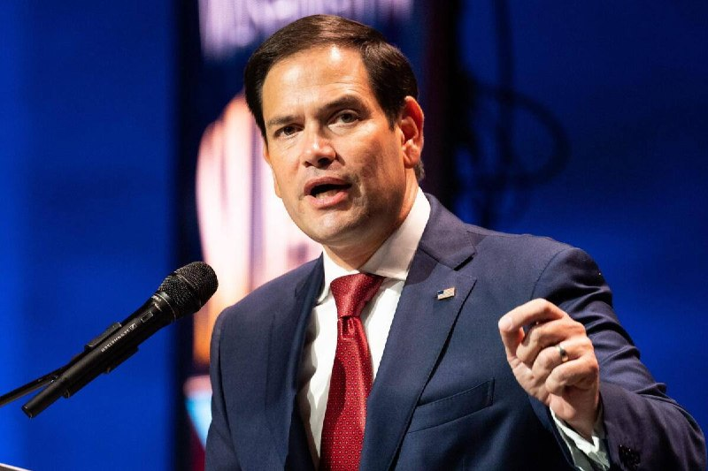

💢مارکو روبیو: ایالات متحده و ایران در مذاکرات صلح پیشرفت محدودی داشته‌اند

💢روبیو، وزیر امور خارجه ایالات متحده در جریان نشست وزرای امور خارجه ناتو گفت: «پیشرفت‌هایی حاصل شده است. نمی‌خواهم اغراق کنم، اما حرکت‌هایی رو به جلو وجود دارد و این خوب است.»

💢به گفته وی، موضوع غنی‌سازی اورانیوم همچنان یک موضوع مهم در مذاکرات با ایران است.

🫆:Tony

📌 @persian_trend_official
پرشین ترند | متفاوت‌ترین کانال نظامی

## Persian_Trend_Official — post 14653

https://youtube.com/live/zMW0RhvWank?feature=share

## Persian_Trend_Official — post 14652

  <a href="telegram/content/Persian_Trend_Official_14652_1779445415.webm" target="_blank">🎬 Download video</a>

UKMTO
گزارش داد که یک تانکر توسط یک قایق کوچک حامل پنج نفر در ۹۸ مایل دریایی شمال سوکوترا نزدیک یمن در حال نزدیک شدن به تانکر مورد نظر بود که با شلیک هشدار تیم امنیتی کشتی مواجه شدکه قایق را مجبور به تغییر مسیر کردند.

🚢PhantomDirective
🚢

📌 @persian_trend_official
پرشین ترند | متفاوت‌ترین کانال نظامی

## Persian_Trend_Official — post 14651

  <a href="telegram/content/Persian_Trend_Official_14651_1779445416.webm" target="_blank">🎬 Download video</a>

توئیت ابراهیم رضایی سخنگوی کمیسیون امنیت ملی:

موشک‌ها را برای مذاکره با شیطان بفرستید .

👑PhantomDirective
👑

📍 @persian_trend_official
پرشین ترند | متفاوت‌ترین کانال نظامی

## Persian_Trend_Official — post 14650

  <a href="telegram/content/Persian_Trend_Official_14650_1779445417.mp4" target="_blank">🎬 Download video</a>

📰گزارش‌های تایید نشده از وقوع انفجار در امارات

🔺برخی منابع عربی مدعی وقوع انفجار در ابوظبی، پایتخت امارات متحده عربی شدند.

🔺هنوز جزئیاتی از این انفجارها منتشر نشده است.

خبر گزاری مهر

👑PhantomDirective
👑

📌 @persian_trend_official
پرشین ترند | متفاوت‌ترین کانال نظامی

## Persian_Trend_Official — post 14649

  <a href="telegram/content/Persian_Trend_Official_14649_1779445417.mp4" target="_blank">🎬 Download video</a>

اندر احوالات مذاکرات ایران-آمریکا

📌 @persian_trend_official
پرشین ترند | متفاوت‌ترین کانال نظامی

## RadioFarda — post 157449

🔸انور قرقاش، مشاور رئیس امارات متحده عربی در امور خارجی، می‌گوید هرگونه تغییر در وضعیت تنگه هرمز پیامدهای جدی برای منطقه و حتی اروپا خواهد داشت و هرگونه کنترل بر تنگه هرمز «سابقه‌ای خطرناک» ایجاد خواهد کرد. 🔸انور قرقاش که روز جمعه یکم خرداد در نشست امنیتی…

## RadioFarda — post 157448

  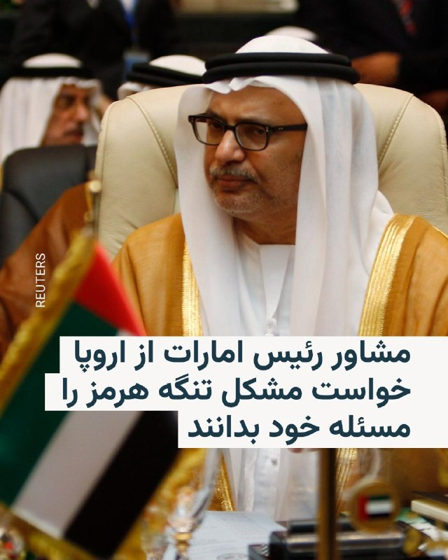

🔸انور قرقاش، مشاور رئیس امارات متحده عربی در امور خارجی، می‌گوید هرگونه تغییر در وضعیت تنگه هرمز پیامدهای جدی برای منطقه و حتی اروپا خواهد داشت و هرگونه کنترل بر تنگه هرمز «سابقه‌ای خطرناک» ایجاد خواهد کرد.

🔸انور قرقاش که روز جمعه یکم خرداد در نشست امنیتی گلوبسک در پراگ سخن می‌گفت، همچنین به‌نمایندگی از ابوظبی از اروپایی‌ها خواست این موضوع را نه مشکلی دوردست، بلکه مسئله‌ای مرتبط با انرژی و تجارت خود بدانند.

🔸او همچنین گفت شانس دستیابی آمریکا و ایران به توافقی که به باز شدن مسیر تنگه هرمز منجر شود «پنجاه پنجاه» است و افزود مقامات جمهوری اسلامی طی سال‌های گذشته فرصت‌های زیادی را از دست داده‌اند، «زیرا معمولاً توان و اهرم‌های خود را بیش از اندازه واقعی برآورد می‌کنند». او ابراز امیدواری کرد که «این بار چنین اشتباهی تکرار نشود».

🔸قرقاش در عین حال تأکید کرد که هرگونه کنترل بر تنگه هرمز «سابقه‌ای خطرناک» ایجاد می‌کند و مدعی شد این موضوع در دست ایران «سیاسی خواهد شد».

@RadioFarda

## RadioFarda — post 157447

  

🔸سازمان جهانی کشتی که مقر آن در سوئیس است روز جمعه، اول خرداد، در بیانیه‌ای مشترک با کمیته المپیک بحرین و فدراسیون کشتی این کشور اعلام کرد که مسابقات جهانی این ورزش که قرار بود در سال جاری میلادی در بحرین برگزار شود فعلا به تعویق می‌افتد.

🔸بر اساس این بیانیه، مسابقات جهانی کشتی در سال ۲۰۲۶ که برای روزهای دوم تا دهم آبان‌ماه ۱۴۰۵ برنامه‌ریزی شده بود به دلیل جنگ ایران که مستقیما بر کشورهای حاشیه خلیج فارس نیز اثر گذاشته عقب می‌افتد.

🔸این بیانیه آشکارا به «وضعیت ژئوپولیتیکی منطقه» و «عدم قطعیت» پیرامون آینده درگیری و آثار آن بر ثبات در منطقه و دشواری سفر اشاره می‌کند.

🔸در این بیانیه تأکید شده است که هدف از اعلام زودهنگام این تصمیم آن بوده است که شاید به این ترتیب فرصت کافی برای انتخاب میزبانی دیگر برای مسابقات جهانی کشتی در سال جاری میلادی فراهم شود.

🔸بحرین یکی از کشورهایی است که از آغاز جنگ مشترک آمریکا و اسرائیل علیه جمهوری اسلامی مستقیما هدف حملات سپاه پاسداران قرار گرفته است. این کشور میزبان یکی از بزرگ‌ترین پایگاه‌های نظامی آمریکا در منطقه است.

@RadioFarda

## RadioFarda — post 157446

🔸تنکرترکرز، شرکت ردیابی نفتکش‌ها، روز جمعه اول خرداد اعلام کرد نیروی دریایی آمریکا شمار بسیاری از نفتکش‌های تحت تحریم آمریکا را در سواحل شرقی عمان متوقف کرده و در تازه‌ترین مورد، نفتکش لوین را که معمولاً برای حمل نفت ایران استفاده می‌شود، پس از تغییر مسیر…

## RadioFarda — post 157445

  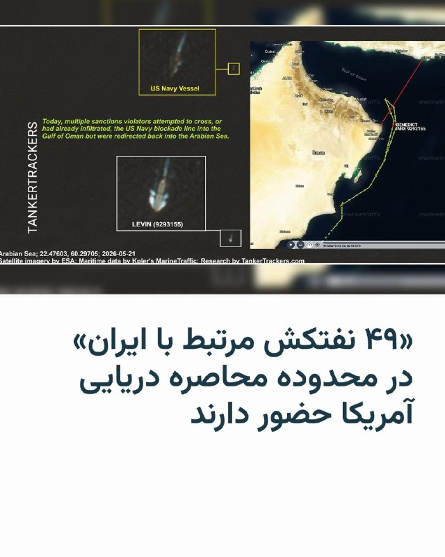

🔸تنکرترکرز، شرکت ردیابی نفتکش‌ها، روز جمعه اول خرداد اعلام کرد نیروی دریایی آمریکا شمار بسیاری از نفتکش‌های تحت تحریم آمریکا را در سواحل شرقی عمان متوقف کرده و در تازه‌ترین مورد، نفتکش لوین را که معمولاً برای حمل نفت ایران استفاده می‌شود، پس از تغییر مسیر به‌سمت دریای عرب، تحت تعقیب قرار داده است.

🔸این شرکت در پیامی همراه با تصاویر ماهواره‌ای و دریایی نوشت که نفتکش آفراماکس «لوین» با شناسهٔ ۹۲۹۳۱۵۵، که در زمان تعقیب فاقد محموله بود و معمولاً برای حمل نفت ایران استفاده می‌شود، پس از تغییر مسیر به‌سمت دریای عرب، از سوی یک شناور نیروی دریایی آمریکا تعقیب شده است.

🔸این نفتکش پیش‌تر، بهمن ۱۴۰۴، به‌عنوان یکی از شناورهای «ناوگان سایه» ایران برای دور زدن تحریم‌ها در فهرست تحریم‌های ایالات متحده قرار گرفته بود.

@RadioFarda

## RadioFarda — post 157444

اعلام خبر افزایش نیروهای آمریکا در لهستان در آستانه اجلاس وزرای خارجه ناتو در سوئد

🔸دونالد ترامپ، رئیس‌جمهور آمریکا، با اعلام خبر افزایش پنج هزار نفری نیروهای نظامی ایالات متحده در لهستان در قلب اروپا به شک و تردید در این باره پایان داد؛ خبری که با استقبال رئیس‌جمهور لهستان روبه‌رو شد.

🔸هفته گذشته مقام‌های آمریکایی از لغو اعزام چهار هزار نیروی آمریکایی به لهستان خبر داده بودند؛ خبری که بعداً توسط معاون ترامپ تکذیب شد. جی‌دی‌ ونس اعلام کرد که این اعزام نیرو لغو نشده، به تعویق افتاده است.

🔸حال دونالد ترامپ در روز پنج‌شنبه، ۳۱ اردیبهشت، اعلام کرده است که پنج هزار نیرو به این کشور اروپایی خواهد فرستاد.

🔸او در پیامی در شبکه اجتماعی خود نوشت که بر اساس رابطهٔ خوبش با کارول ناوروکی، همتای لهستانی‌اش، به این تصمیم رسیده است.

🔸ناوروکی هم پنج‌شنبه شب در پیامی در شبکه ایکس چنین به ترامپ پاسخ داد:‌ «ائتلاف خوب ائتلافی است مبتنی بر همکاری و احترام متقابل و تعهد به امنیت طرفین.»

🔸تصمیم تازه آمریکا برای اعزام نیرو به اروپا کمتر از یک ماه پس از آن اعلام می‌شود که پیت هگست، وزیر دفاع این کشور، روز ۱۱ اردیبهشت دستور داد حدود پنج هزار نیروی نظامی این کشور طی یک سال آینده از آلمان خارج شوند.

🔸 گزارش کامل را در وب‌سایت رادیوفردا بخوانید.

@RadioFarda

## IranianMinds — post 20520

  

اکانت اسرائیل به فارسی:

چرخ روزگار… از پارسال تا امسال.

@IranianMinds

## IranianMinds — post 20519

🔴 خبرگزاری فارس :

بمولا ابرقدرت دنیا خودمونیم.

@IranianMinds

## IranianMinds — post 20518

🔴 وزیر خارجه انگلیس:

ما با ایالات متحده در تصمیمش برای بازگشایی تنگه هرمز برای ناوبری هم‌نظر هستیم.

@IranianMinds

## IranianMinds — post 20517

  <a href="telegram/content/IranianMinds_20517_1779445423.mp4" target="_blank">🎬 Download video</a>

🔴 مارکو‌ روبیو:

ایران در تلاش است یک سیستم عوارض در تنگه هرمز ایجاد کند و سعی دارد عمان را قانع کند تا به این سیستم عوارض بپیوندد.

@IranianMinds

## IranianMinds — post 20516

  

ایران دهه ۱۹۷۰ میلادی …

@IranianMinds

## IranianMinds — post 20515

🔴 مارکو روبیو وزیر خارجه آمریکا:

در مذاکرات با ایران پیشرفت هایی حاصل شده است.

@IranianMinds

## IranianMinds — post 20514

  

🔴 ابراهیم رضایی ، سخنگوی کمیسیون امنیت ملی :

آمریکایی ها هیچ تمایلی به دیپلماسی ندارن و مذاکرات فریب است، به جای دیپلمات موشک ها را برای مذاکره با شیطان بفرستید تا آدم شه.

@IranianMinds

## BBCPersian — post 281780

  <a href="telegram/content/BBCPersian_281780_1779445426.mp4" target="_blank">🎬 Download video</a>

🔻بیش از ۱۰۰ نفر در پی شیوع آخرین نوع ویروس ابولا در جمهوری دموکراتیک کنگو جان خود را از دست داده‌اند.
همچنین در همسایگی آن کشور، در اوگاندا هم مرگ یک نفر گزارش شده است.

سازمان جهانی بهداشت هشدار داده که شیوع این ویروس ممکن است سریع‌تر از آنچه در ابتدا تصور می‌شد در حال گسترش باشد.
بی‌بی‌سی با ساکنان استان ایتوری در شرق جمهوری دموکراتیک کنگو گفتگو کرده تا دریابد آن‌ها چگونه با این ویروس خطرناک که دائما هم در حال گسترش است مقابله می‌کنند.

@BBCPersian

## BBCPersian — post 281779

‌ ‌ ‌ مارکو روبیو، وزیر خارجه آمریکا، می‌گوید که واشنگتن در انتظار شنیدن نتیجه گفت‌وگوهایی است که در تهران در جریان است. آقای روبیو که برای شرکت در اجلاس وزرای خارجه کشورهای عضو ناتو به سوئد رفته همچنین گفت: «پیشرفت‌های اندکی حاصل شده» و «نمی‌خواهم اغراق…

## BBCPersian — post 281778

  

‌ ‌ ‌
مارکو روبیو، وزیر خارجه آمریکا، می‌گوید که واشنگتن در انتظار شنیدن نتیجه گفت‌وگوهایی است که در تهران در جریان است.

آقای روبیو که برای شرکت در اجلاس وزرای خارجه کشورهای عضو ناتو به سوئد رفته همچنین گفت: «پیشرفت‌های اندکی حاصل شده» و «نمی‌خواهم اغراق کنم، اما کمی تغییر در وضعیت وجود داشته است و این خوب است.»

عباس عراقچی، وزیر خارجه ایران، امروز در تهران با محسن نقوی، وزیر کشور پاکستان دیدار کرد. به گزارش رسانه‌های ایران این دیدار برای بررسی پیشنهادهایی جهت حل اختلافات میان تهران و واشنگتن است.

آقای روبیو تاکید کرد که «اصول اولیه همچنان یکسان است. ایران هرگز نمی‌تواند سلاح هسته‌ای داشته باشد، این حکومت هرگز نمی‌تواند سلاح هسته‌ای داشته باشد و برای رسیدن به این هدف، ما باید به موضوع غنی‌سازی در مذاکرات بپردازیم. لازم است که به موضوع اورانیوم غنی شده با خلوص بالا رسیدگی کنیم.»

https://bbc.in/49L7L6C
📷Reuters
@BBCPersian

## BBCPersian — post 281777

🔻 نت‌بلاکس: قطع اینترنت در ایران وارد هشتادوچهارمین روز شد

نت‌بلاکس که وضعیت اینترنت در جهان را ارزیابی می‌کند می‌گوید خاموشی اینترنت در ایران اکنون وارد هشتاد‌وچهارمین روز شده و دسترسی عمومی به شبکه‌های بین‌المللی برای بیش از ۱۹۹۲ ساعت عملا قطع مانده است.

نت‌بلاکس می‌گوید: «با گذشت هر ساعت، شکاف‌های اجتماعی و اقتصادی عمیق‌تر می‌شود؛ چرا که هرگونه ارتباط با جهان خارج اکنون به امتیاز، میزان تبعیت و برخورداری از رانت وابسته شده است.»

یک روز پیش از این، علی یزدی‌خواه، نماینده و عضو کمیسیون فرهنگی مجلس ایران گفته بود که «مسئولان به این نتیجه رسیده‌اند که وصل کردن اینترنت به صلاح همه نیست.»

دولت ایران گفته است که اتصال مجدد اینترنت منوط به تصمیم شورای عالی امنیت ملی است.

ایران استفاده از اینترنت ماهواره‌ای همچون استارلینک را هم ممنوع کرده و کاربران آن را تحت تعقیب قرار می‌دهد.

https://bbc.in/4dJqX69
@BBCPersian

## BBCPersian — post 281768

🖊 هیلکن دواچ بوران، بی‌بی‌سی ترکی، استانبول

🔻رونمایی مرکز تحقیق و توسعه وزارت دفاع ترکیه از موشک ییلدیریم‌هان در ۵ مه، نقطه عطفی برای صنایع دفاعی ترکیه به شمار می‌رود.

ترکیه با رونمایی از ییلدیریم‌هان، برای نخستین بار رسما اعلام کرد که قصد دارد موشک بالستیک قاره‌پیما تولید کند.

در مراسم معرفی این موشک که در نمایشگاه دفاعی ساها ۲۰۲۶ در استانبول برگزار شد، ماکتی از موشک همراه با مشخصات فنی‌ آن به نمایش در آمد.

کارشناسانی که با بخش ترکی بی‌بی‌سی گفت‌وگو کرده‌اند، ییلدیریم‌هان را بخشی از تلاش ترکیه برای تثبیت جایگاه خود به‌عنوان یک بازیگر بین‌المللی ارزیابی می‌کنند.

برخی کارشناسان با تاکید بر اینکه برد اعلام‌شده این موشک فراتر از نیازهای دفاعی ترکیه است، می‌گویند این موضوع می‌تواند در ذهن «رقبای بالقوه» آنکارا پرسش‌هایی ایجاد کند.

بیشتر بخوانید:

https://bbc.in/4tNsFcs
📸Getty Images/ Reuters/ Anadolu via Getty Images/ AFP via Getty Images/ Bloomberg via Getty Images
@BBCPersian

## BBCPersian — post 281767

🔻این هفته در پرگار: آینده دانشگاه در عصر هوش مصنوعی

🔻دانشگاه در جوامع بشری قدمتی بیش از هزار سال دارد و دغدغه‌ راه یافتن به آن یا بهره‌‌ شغلی از امتیاز آن به دی‌ان‌ای بشر راه یافته. آیا همه‌ اینها قرار است با هوش مصنوعی تغییر کند؟ دانشگاه آینده‌ای دارد؟

میهمان‌ها:
سپهر وکیل، استاد دانشگاه
مهدی گنجوی، استاد دانشگاه

@BBCPersian

## BBCPersian — post 281766

🔻 سازمان عملیات دریایی بریتانیا از یک حادثه دریایی در آب‌های یمن خبر داد

سازمان عملیات تجارت دریایی بریتانیا روز جمعه اعلام کرد که گزارشی درباره یک حادثه در ۹۸ مایل دریایی شمال جزیره سقطرا یمن دریافت کرده است.

در این حادثه، یک کشتی گفته است که یک قایق کوچک با پنج نفر سرنشین به آن نزدیک شده است.

مقام‌های مسئول در حال بررسی ماجرا هستند.

منطقه اطراف یمن، دریای عرب، خلیج عدن و تنگه باب‌المندب یکی از حساس‌ترین مسیرهای دریایی جهان است و طی سال‌های اخیر بارها شاهد حوادث امنیتی بوده است.

https://bbc.in/4usJUkA
@BBCPersian

## BBCPersian — post 281765

🔻 سه زخمی در حمله هوایی اسرائیل به جنوب لبنان

خبرگزاری ملی لبنان گزارش کرده در حمله هوایی اسرائیل به منطقه الحفور در جنوب لبنان سه نفر زخمی شده‌اند.

به گفته این خبرگزاری، حملات پهپادی همچنین شهر جنوبی دیر قانون النهر را هدف قرار داده است.

https://bbc.in/3RG0Y85
@BBCPersian

## BBCPersian — post 281755

🖊 سعید جعفری، روزنامه‌‌نگار

🔻محمدباقر قالیباف به‌عنوان «نماینده ویژه ایران در امور چین» منصوب شده است؛ سمتی که به باور برخی تحلیلگران، فراتر از یک عنوان تشریفاتی است.

در شرایطی که چین به یکی از مهم‌ترین بازیگران در معادلات جنگ، تحریم، انرژی و روابط تهران و واشنگتن تبدیل شده، افزایش نقش قالیباف می‌تواند نشانه‌ای از تغییر در نحوه مدیریت پرونده‌های راهبردی در جمهوری اسلامی باشد.

آیا این انتصاب فقط درباره رابطه با پکن است یا نشانه‌ای از بازآرایی در ساختار قدرت ایران؟

بیشتر بخوانید:
https://bbc.in/4dF0YMS
📸 Getty Images/ Reuters
@BBCPersian

## idfinfarsi — post 11623

  <a href="telegram/content/idfinfarsi_11623_1779445429.mp4" target="_blank">🎬 Download video</a>

‼️ویدئو را تماشا کنید: نیروهای تیپ ۵۵۱ تروریست‌های حزب‌الله را در حال ورود به مقر این سازمان شناسایی کرده و آن‌ها را به هلاکت رساندند

⭕️نیروهای تیم رزمی تیپ ۵۵۱ تحت فرماندهی لشکر ۱۴۶، روز گذشته (پنج‌شنبه) پنج تروریست از سازمان تروریستی حزب‌الله را شناسایی کردند که وارد مقر این سازمان در شمال خط دفاعی مقدم در جنوب لبنان شده بودند. در یک واکنش سریع، این نیروها نیروی هوایی را هدایت کردند که ساختمان را مورد حمله قرار داده و تروریست‌ها را به هلاکت رساند.

⭕️در طول ۲۴ ساعت گذشته، انبارهای تسلیحات و زیرساخت‌های تروریستی مورد استفاده سازمان تروریستی حزب‌الله هدف قرار گرفتند و تروریست‌های دیگری که تهدیدی برای نیروهای ما بودند نیز به هلاکت رسیدند.

🔻ارتش اسرائیل به فعالیت خود برای رفع تهدیدها علیه نیروهای ارتش اسرائیل و غیرنظامیان کشور ادامه خواهد داد.

## Dirty_Kids — post 389927

  <a href="telegram/content/Dirty_Kids_389927_1779445431.mp4" target="_blank">🎬 Download video</a>

جلوی رگبار مسلسل جاوید شاه گفتن و کشته شدن.
من کی باشم که حرف دیگه‌ای بزنم!

@Dirty_Kids 👻

## Dirty_Kids — post 389926

  

عروسیه یا جشن تعیین جنسیت با تفنگ؟

@Dirty_Kids 👻

## Dirty_Kids — post 389925

  <a href="telegram/content/Dirty_Kids_389925_1779445433.mp4" target="_blank">🎬 Download video</a>

این جلوه‌های ویژه سال ۱۹۸۱ روی دختر بریتانیایی بنام سوزانا ویلیس انجام شده توی فیلم "باشگاه هیولاها"

@Dirty_Kids 👻

## Dirty_Kids — post 389924

  

امریکا هیچ غلطی نمی‌تونه بکنه:

نمونه کوچکی از غلطاش:

@Dirty_Kids 👻

## Dirty_Kids — post 389923

  

مهريه دخترانشان «پهپاد»
اسباب بازى كودكانشان «كلاشينكف»
لق لقه‌ى زبانشان مرگ بر «اين و آن».
اما هسته‌اى را فقط براى «برق» مى خواهند!
بجّه زرنگهاى تروريست از درِ عقب.

@Dirty_Kids 👻

## Hranews — post 113090

  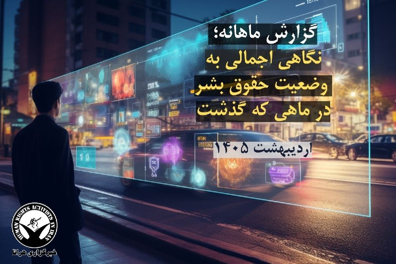

گزارش ماهانه؛ نگاهی اجمالی به وضعیت حقوق بشر – اردیبهشت ماه ۱۴۰۵

❗️
❗️
❗️
❗️
❗️– آنچه در پی می‌آید گزارش ماهانه و اجمالی از وضعیت حقوق بشر در ایران در دوره زمانی اردیبهشت ماه ۱۴۰۵ است که به همت نهاد آمار، نشر و آثار مجموعه فعالان حقوق بشر در ایران تهیه شده است، این گزارش، تصویری گسترده و تکان‌دهنده از نقض حقوق بشر در ابعاد مختلف ارائه می‌دهد. از اجرای حکم اعدام تا نقض آزادی‌های فردی و اجتماعی، از خشونت نظامی و قضایی تا مشکلات کارگری و اعتراضات، همگی نشان‌دهنده چالش‌های جدی در زمینه رعایت حقوق بشر در ایران هستند. این گزارش همچنین بر میزان بالای اعدام‌ها، بازداشت‌ها، و محکومیت‌های سنگین بر اساس اتهامات مختلف تاکید دارد و نشان می‌دهد که این رویدادها در سراسر کشور گسترده‌اند.

خلاصه اجرایی

در طول اردیبهشت ماه ۱۴۰۵، شاهد گستره‌ای از نقض‌های #حقوق_بشر در سراسر ایران بودیم. با ارزیابی‌های دقیق و گزارش‌های دریافتی، مجموعاً صدها مورد نقض حقوق بشر شناسایی و ثبت شده است که شامل نقض حقوق زندانیان، آزادی بیان، حقوق کودک، خشونت‌های خانگی، خشونت مبتنی بر جنسیت، بهداشت و محیط زیست، حقوق کار، و خشونت نظامی و قضایی می‌شود.

یافته‌های کلیدی این گزارش عبارت‌اند از:
⚫️ اجرای حکم اعدام در مواردی که فرآیندهای عدالتی منصفانه رعایت نشده است.

⚫️ سرکوب گسترده آزادی بیان و بازداشت‌های خودسرانه.

⚫️ افزایش نگران‌کننده خشونت علیه زنان.

⚫️ تداوم نقض حقوق کار و شرایط کاری ناعادلانه.

⚫️ استفاده بی‌رویه از زور توسط نیروهای انتظامی و امنیتی

دوره گزارش‌دهی این گزارش اردیبهشت ۱۴۰۵ است و تعداد کل موارد نقض گزارش شده بیانگر یک وضعیت نگران‌کننده و فوریت برای توجه جامعه بین‌المللی و دولت ایران به این مسائل است.

ادامه مطلب

↘️
@hranews_bot تماس ✉️ - @Hranews کانال هرانا 🆑

## Hranews — post 113089

  

اعتراضات ۱۴۰۴؛ دیوان عالی احکام اعدام محمدرضا مجیدی‌اصل و بیتا همتی را نقض کرد

❗️
❗️
❗️
❗️
❗️– احکام اعدام محمدرضا مجیدی‌اصل و همسرش بیتا همتی از بازداشت‌شدگان اعتراضات دی‌ماه ۱۴۰۴، توسط دیوان عالی کشور نقض شد. این افراد پیشتر با حکم قاضی ایمان افشاری به #اعدام محکوم شده بودند.

به گزارش خبرگزاری هرانا، ارگان خبری مجموعه فعالان حقوق بشر در ایران، دیوان عالی کشور احکام اعدام دو تن از بازداشت‌شدگان اعتراضات دی‌ماه ۱۴۰۴، را نقض کرد.

بر این اساس، پرونده محمدرضا مجیدی‌اصل و بیتا همتی جهت رسیدگی مجدد به شعبه هم عرض ارجاع داده شده است.

#محمدرضا_مجیدی‌اصل #بیتا_همتی #اعتراضات_دی‌ماه

ادامه مطلب

↘️
@hranews_bot تماس ✉️ - @Hranews کانال هرانا 🆑

## Hranews — post 113088

  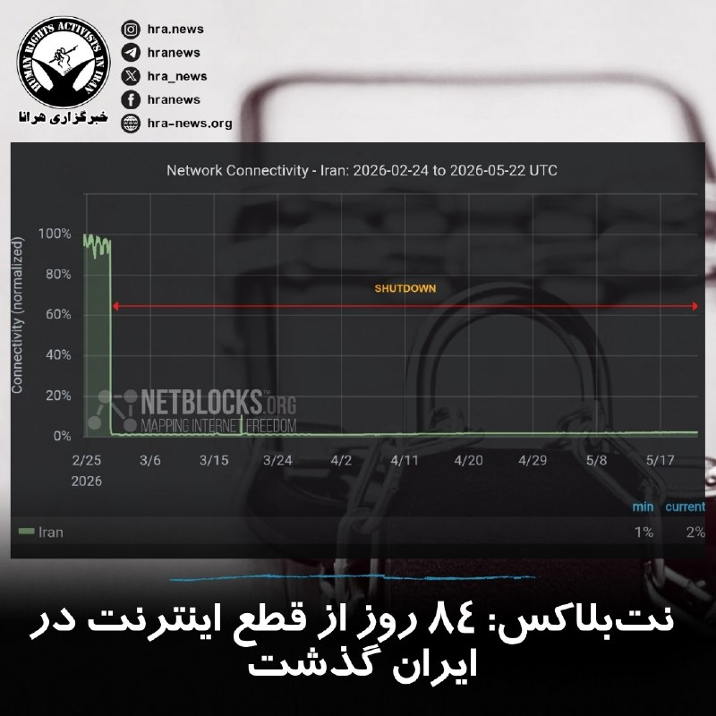

آخرین داده‌های نت‌بلاکس نشان می‌دهد که قطع اینترنت در ایران پس از گذشت بیش از ۱۹۹۲ ساعت، وارد هشتاد و چهارمین روز خود شده و شبکه‌های بین‌المللی همچنان تا حد زیادی قطع هستند. این نهاد ناظر بر وضعیت دسترسی به #اینترنت در جهان همچنین اعلام کرد: با گذشت هر ساعت از قطع اینترنت در ایران، شکاف‌های اجتماعی و اقتصادی عمیق‌تر می‌شود، چرا که هرگونه ارتباط با جهان خارج به جایگاه، میزان تبعیت و برخورداری از امتیازات ویژه محدود شده است.

↘️
@hranews_bot تماس ✉️ - @Hranews کانال هرانا 🆑

## Hranews — post 113087

  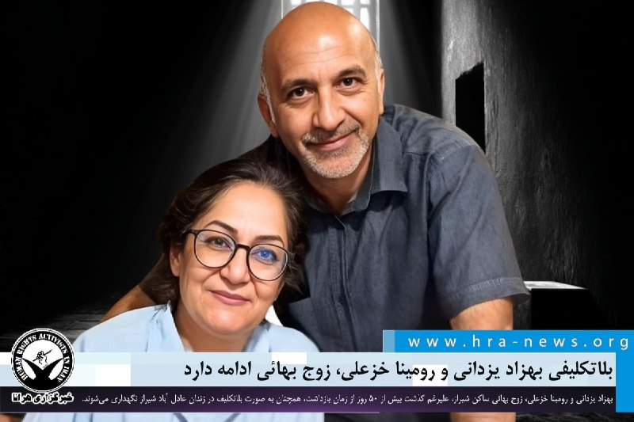

حبس بدون تصمیم؛ بلاتکلیفی بهزاد یزدانی و رومینا خزعلی، زوج بهائی ادامه دارد

❗️
❗️
❗️
❗️
❗️– بهزاد یزدانی و رومینا خزعلی، زوج #بهائی ساکن شیراز، علیرغم گذشت بیش از ۵۰ روز از زمان بازداشت، همچنان به صورت بلاتکلیف در زندان عادل آباد شیراز نگهداری می‌شوند.

به گزارش خبرگزاری هرانا، ارگان خبری مجموعه فعالان حقوق بشر در ایران، رومینا خزعلی و بهزاد یزدانی، کماکان در بازداشت و بلاتکلیفی به‌سر می‌برند.

یک منبع مطلع نزدیک به خانواده این زوج بهائی، ضمن تایید این خبر به هرانا گفت: “خانم خزعلی پیش از بازداشت با مشکلات جسمی متعددی از جمله میگرن و درد معده مواجه بوده، در آخرین تماس خود از وضعیت روحی نامساعداش خبر داده است. همچنین او پیش از بازداشت تحت عمل جراحی معده قرار گرفته بود. از سوی دیگر، با وجود پیگیری‌های مکرر بستگان این شهروندان از مراجع قضایی، مسئولان مربوطه تاکنون با آزادی آنان با قرار وثیقه موافقت نکرده‌اند. تداوم این وضعیت به افزایش نگرانی های خانواده این زوج بهائی منجر شده است.”

#بهزاد_یزدانی #رومینا_خزعلی

ادامه مطلب

↘️
@hranews_bot تماس ✉️ - @Hranews کانال هرانا 🆑

## manototv — post 105738

  <a href="telegram/content/manototv_105738_1779445439.mp4" target="_blank">🎬 Download video</a>

سازمان نظارت بر اینترنت نت‌بلاکس اعلام کرد خاموشی گسترده اینترنت در ایران وارد هشتاد و چهارمین روز شده و دسترسی به شبکه جهانی اینترنت برای بیش از ۱۹۹۲ ساعت همچنان به‌طور گسترده مختل است.
نت‌بلاکس در گزارشی نوشت ادامه این محدودیت‌ها شکاف‌های اجتماعی و اقتصادی را عمیق‌تر کرده و ارتباط با جهان خارج بیش از پیش به «امتیاز، تبعیت و دسترسی ویژه» وابسته شده است.

## manototv — post 105737

  <a href="telegram/content/manototv_105737_1779445439.mp4" target="_blank">🎬 Download video</a>

روزنامه وال‌استریت ژورنال گزارش داد هم‌زمان با آماده شدن ایران برای احتمال درگیری با آمریکا، بابک زنجانی، بازرگان ایرانی که خود را «ضدتحریم» معرفی می‌کند، یک شبکه مخفی پرداخت برای تأمین مالی نیروهای نظامی جمهوری اسلامی ایجاد کرده بود که محور اصلی آن صرافی ارز دیجیتال بایننس بوده است.
بر اساس این گزارش، این شبکه تا ماه دسامبر گذشته طی دو سال حدود ۸۵۰ میلیون دلار تراکنش را عمدتاً از طریق یک حساب معاملاتی در بزرگ‌ترین صرافی رمزارز جهان انجام داده است. گزارش‌های داخلی بایننس نشان می‌دهد نزدیکان زنجانی، از جمله خواهرش، شریک عاطفی او و یکی از مدیران شرکتش، حساب‌های دیگری را نیز اداره می‌کردند که همگی از دستگاه‌های مشترک استفاده می‌کردند؛ موضوعی که بازرسان بایننس آن را نشانه‌ای از تلاش برای دور زدن تحریم‌های آمریکا علیه ایران دانسته‌اند.
وال‌استریت ژورنال نوشت با وجود هشدارهای داخلی متعدد، حساب اصلی این شبکه دست‌کم ۱۵ ماه همچنان فعال مانده و تا ژانویه امسال نیز باز بوده است. این گزارش همچنین می‌گوید میلیاردها دلار تراکنش رمزارزی طی دو سال گذشته از طریق بایننس به شبکه‌های مالی مرتبط با سپاه پاسداران منتقل شده است.
مقام‌های خارجی مسئول پیگیری تأمین مالی تروریسم گفته‌اند امسال نیز انتقال پول از طریق حساب‌های بایننس به نهادهای وابسته به جمهوری اسلامی ادامه داشته و تراکنش‌هایی حتی در همین ماه شناسایی شده است.

## manototv — post 105736

  <a href="telegram/content/manototv_105736_1779445441.mp4" target="_blank">🎬 Download video</a>

رییس اورژانس پیش‌بیمارستانی و مدیریت حوادث دانشگاه علوم پزشکی البرز اعلام کرد بر اثر تصادف زنجیره‌ای در آزادراه کرج قزوین، سه نفر جان باختند و چهار نفر دیگر مجروح شدند.
به گزارش رسانه‌های داخلی، در این سانحه دو مرد و یک زن کشته شدند و سه مرد و یک زن دیگر نیز مجروح شدند.
مصدومان توسط نیروهای اورژانس به بیمارستان امام جعفر صادق نظرآباد منتقل شدند.

## manototv — post 105735

  <a href="telegram/content/manototv_105735_1779445441.mp4" target="_blank">🎬 Download video</a>

وزارت خارجه جمهوری اسلامی تحریم محمدرضا رئوف شیبانی، سفیر ایران در لبنان، از سوی آمریکا را «غیرقانونی» و «ناموجه» توصیف کرد و آن را نشانه «بی‌اعتنایی هیئت حاکمه آمریکا به اصول حقوق بین‌الملل و منشور سازمان ملل» دانست.
این وزارتخانه همچنین تحریم تعدادی از نمایندگان حزب‌الله و مسئولان لبنانی را محکوم کرد و اقدامات آمریکا را «سخیف» و در راستای تضعیف حاکمیت ملی لبنان و «فتنه‌انگیزی در جامعه لبنان» خواند.

## manototv — post 105734

  <a href="telegram/content/manototv_105734_1779445442.mp4" target="_blank">🎬 Download video</a>

روزنامه نیویورک‌تایمز گزارش داد ایران و عمان درباره ایجاد یک نظام پرداخت برای عبور کشتی‌ها از تنگه هرمز مذاکره کرده‌اند؛ اقدامی که می‌تواند به معنای دریافت هزینه از کشتی‌های عبوری در یکی از حیاتی‌ترین آبراه‌های جهان باشد.
بر اساس این گزارش، تهران و مسقط تأکید دارند موضوع مطرح‌شده «کارمزد خدمات» است، نه «عوارض عبور»؛ زیرا دریافت عوارض صرف برای عبور از تنگه‌های بین‌المللی طبق حقوق دریاها غیرقانونی تلقی می‌شود. با این حال، کارشناسان حقوقی می‌گویند اگر این کارمزد در عمل همان عوارض باشد، مشروعیت نخواهد داشت.
مقام‌های آمریکایی، از جمله دونالد ترامپ و مارکو روبیو، هرگونه دریافت پول برای عبور از تنگه هرمز را «غیرقابل قبول» توصیف کرده‌اند. کارشناسان نیز هشدار داده‌اند تغییر نام عوارض به «کارمزد» مانع چالش‌های حقوقی بین‌المللی نخواهد شد.

## manototv — post 105733

  <a href="telegram/content/manototv_105733_1779445443.mp4" target="_blank">🎬 Download video</a>

فرماندهی مرکزی آمریکا، سنتکام، در حساب کاربری خود در شبکه ایکس اعلام کرد جنگنده‌های نیروی دریایی آمریکا از ناو هواپیمابر «آبراهام لینکلن» در دریای عرب به پرواز درآمده‌اند.
سنتکام افزود گروه ضربتی ناو «آبراهام لینکلن» در بالاترین سطح آمادگی عملیاتی قرار دارد و در چارچوب اجرای محاصره دریایی آمریکا علیه بنادر ایران فعالیت می‌کند.

## alonews — post 121744

  <a href="telegram/content/alonews_121744_1779445444.mp4" target="_blank">🎬 Download video</a>

👈یه ویدیو از خرابی‌های بعد حمله‌ ارتش اسرائیل به لبنان

✅ @AloNews خبر جنگ

## alonews — post 121743

  <a href="telegram/content/alonews_121743_1779445446.webm" target="_blank">🎬 Download video</a>

👈سی‌ان‌ان: آمریکا نگران موشک‌های کروز ساحلی ایران است، زیرا این موشک‌ها می‌توانند کشتی‌رانی در تنگه هرمز را تهدید کنند؛ ارزیابی‌های اطلاعاتی نشان می‌دهد که حدود دو سوم لانچرهای موشکی و بخش بزرگی از موشک‌های کروز ساحلی ایران همچنان فعال هستند.

✅ @AloNews خبر جنگ

## alonews — post 121742

  <a href="telegram/content/alonews_121742_1779445446.webm" target="_blank">🎬 Download video</a>

👈اسلام‌آباد به شدت روی چین حساب باز کرده است تا به پیشبرد توافق احتمالی آمریکا و ایران کمک کند، و انتظار می‌رود نخست‌وزیر پاکستان، شہباز شریف، در مرحله‌ای بعدی به چین سفر کند، طبق گزارش العربیه که به منبعی پاکستانی استناد می‌کند

✅ @AloNews خبر جنگ

## alonews — post 121741

  <a href="telegram/content/alonews_121741_1779445446.webm" target="_blank">🎬 Download video</a>

👈وزیر نیرو: با وجود بارش‌های خوب امسال، استان مرکزی و استان تهران در وضعیت ضعیف آب قرار دارند

✅ @AloNews خبر جنگ

## alonews — post 121740

  <a href="telegram/content/alonews_121740_1779445446.webm" target="_blank">🎬 Download video</a>

👈الحدث به نقل از یک منبع پاکستانی:
هیچ جایگزینی برای توافق موقت بین واشنگتن و تهران وجود ندارد

🔴کاهش فاصله‌ها آسان نیست زیرا هر طرف سقف بالایی از خواسته‌ها دارد

🔴 مسائل بزرگ در توافق به بازه زمانی طولانی در مذاکره نیاز دارند

🔴آمریکا و ایران بر مواضع خود درباره اورانیوم پایبند هستند

✅ @AloNews خبر جنگ

## alonews — post 121739

  <a href="telegram/content/alonews_121739_1779445447.mp4" target="_blank">🎬 Download video</a>

👈مارکو روبیو: "درحال حاضر، در سازمان ملل متحد، قطعنامه‌ای داریم که توسط بحرین ارائه شده است. ما بسیار درگیر آن بوده‌ایم. این قطعنامه بالاترین تعداد همکاران ارائه‌دهنده را در تاریخ هر قطعنامه‌ای در شورای امنیت داشته است. متأسفانه، چند کشور در شورای امنیت به وتوی آن فکر می‌کنند که این امر تأسف‌بار خواهد بود."

✅ @AloNews خبر جنگ

## alonews — post 121738

  <a href="telegram/content/alonews_121738_1779445449.webm" target="_blank">🎬 Download video</a>

👈نیروی دریایی سپاه: طی شبانه روز گذشته ۳۵ فروند کشتی اعم از نفتکش، کانتینربر و سایر کشتی های تجاری پس از کسب مجوز با هماهنگی و تامین امنیت نیروی دریایی سپاه از تنگه هرمز عبور کردند.

✅ @AloNews خبر جنگ

## alonews — post 121737

  <a href="telegram/content/alonews_121737_1779445449.webm" target="_blank">🎬 Download video</a>

👈عربستان: با هرگونه تلاش برای سیاسی‌کردن حج با قاطعیت برخورد می‌کنیم

✅ @AloNews خبر جنگ

## alonews — post 121736

  <a href="telegram/content/alonews_121736_1779445449.mp4" target="_blank">🎬 Download video</a>

👈مارک روته، دبیرکل ناتو : اینکه آمریکا داره توان هسته‌ای و موشک‌های دوربرد ایران رو تضعیف می‌کنه

🔴 برای خاورمیانه، اروپا و کل دنیا خیلی مهمه

✅ @AloNews خبر جنگ

## alonews — post 121735

  <a href="telegram/content/alonews_121735_1779445451.webm" target="_blank">🎬 Download video</a>

👈انور قرقاش، مشاور رئیس امارات: دور دیگری از درگیری میان آمریکا و ایران فقط مسائل را پیچیده‌تر خواهد کرد

✅ @AloNews خبر جنگ

## alonews — post 121734

  <a href="telegram/content/alonews_121734_1779445451.webm" target="_blank">🎬 Download video</a>

👈زلنسکی : یه پالایشگاه نفت روسیه تو یاروسلاول رو زدیم

✅ @AloNews خبر جنگ

## alonews — post 121733

  <a href="telegram/content/alonews_121733_1779445451.webm" target="_blank">🎬 Download video</a>

👈 ادعای فارن افرز: «رهبران خلیج فارس از قبل، شروع به تنوع بخشیدن به تأمین‌کنندگان سلاح و مشارکت‌های امنیتی خود کرده‌اند.

🔴 برای اینکه بتوانند در مورد آنچه برایشان اتفاق می‌افتد، حرف بیشتری برای گفتن داشته باشند، باید هماهنگی بهتری بین خود، چه از نظر نظامی و چه از نظر دیپلماتیک، برقرار کنند.»

✅ @AloNews خبر جنگ

## alonews — post 121731

  <a href="telegram/content/alonews_121731_1779445452.webm" target="_blank">🎬 Download video</a>

👈ارتش اسرائیل به "میفدون" لبنان حمله کرد

✅ @AloNews خبر جنگ

## alonews — post 121730

  <a href="telegram/content/alonews_121730_1779445452.webm" target="_blank">🎬 Download video</a>

👈 تلگراف: قرار بود ترامپ با اتخاذ موضعی سختگیرانه‌ تر در قبال چین به پیشرفت هند کمک کند.

🔴 در عوض، جنگ‌ها و غیرقابل‌پیش‌بینی بودن او به جاه‌طلبی‌های نارندرا مودی برای تبدیل هند به یک ابرقدرت جهانی آسیب می‌رساند.

🔴 درگیری در ایران به هند ضربه سختی وارد کرده است. این کشور به نفت وارداتی متکی است که بخش عمده آن از طریق تنگه هرمز وارد می‌شود، بنابراین افزایش قیمت انرژی باعث تضعیف رشد، افزایش تورم و ترساندن سرمایه‌گذاران می‌شود.

🔴 مودیز در حال حاضر پیش‌بینی رشد هند را به ۶ درصد کاهش داده است - بسیار کمتر از ۸ درصدی که مودی می‌گوید برای تبدیل هند به یک کشور توسعه‌یافته تا سال ۲۰۴۷ لازم است.

🔴 در عین حال، ترامپ به چین و پاکستان، دو رقیب اصلی هند، نزدیک‌تر شده است و سال‌ها تلاش مودی برای ایجاد روابط قوی‌تر با واشنگتن را تضعیف می‌کند.

🔴 مودی اکنون در تلاش است تا با جستجوی قراردادهای جدید انرژی در خارج از کشور، کاهش فشارهای هزینه‌ای در داخل و حتی منصرف کردن هندی‌ها از خرید طلا و سفر به خارج از کشور، آسیب‌ها را محدود کند.

🔴 این بحران مشکل عمیق‌تری را آشکار کرده است: با وجود رشد سریع، هند هنوز فاقد قدرت تولید، زیرساخت‌ها و نفوذ اقتصادی لازم برای رقابت با چین است.

✅ @AloNews خبر جنگ

## alonews — post 121729

  <a href="telegram/content/alonews_121729_1779445452.webm" target="_blank">🎬 Download video</a>

👈مارکو روبیو، وزیر امور خارجه آمریکا مدعی شد که فکر نمی‌کنم هیچ کشوری موافقت کند که برای عبور از تنگه هرمز هزینه پرداخت کند.

✅ @AloNews خبر جنگ

## alonews — post 121728

  <a href="telegram/content/alonews_121728_1779445452.webm" target="_blank">🎬 Download video</a>

👈ادعای وزیر امور خارجه بریتانیا: ما با عزم ایالات متحده برای بازگشایی تنگه هرمز به روی کشتیرانی موافقیم

🔴 شرم‌آور است که ایران با مسدود کردن کشتیرانی بین‌المللی سعی در ربودن کل اقتصاد جهانی دارد.

✅ @AloNews خبر جنگ

## alonews — post 121727

  <a href="telegram/content/alonews_121727_1779445453.mp4" target="_blank">🎬 Download video</a>

👈مارکو روبیو می‌گوید تصمیمات در مورد نیروهای نظامی ایالات متحده در اروپا «تنبیهی» نیستند.

✅ @AloNews خبر جنگ

## alonews — post 121726

  <a href="telegram/content/alonews_121726_1779445455.webm" target="_blank">🎬 Download video</a>

👈ادعای منبع پاکستانی به الجزیره: اصرار آمریکا و ایران بر بالا بردن سقف خواسته‌هایشان درباره اورانیوم و تنگه هرمز، به بن‌بست در مذاکرات انجامیده

🔴اسلام‌آباد همچنان نسبت به امکان دستیابی به یک توافق موقت بین واشنگتن و تهران خوش‌بین است

✅ @AloNews خبر جنگ

## alonews — post 121725

  <a href="telegram/content/alonews_121725_1779445455.webm" target="_blank">🎬 Download video</a>

👈وزارت خارجه پاکستان: نخست‌وزیر پاکستان در سفر فردای خود به چین درباره ابتکاری مشترک برای پایان دادن به جنگ گفت‌وگو خواهد کرد

✅ @AloNews خبر جنگ

---
📅 بروزرسانی: 1405/03/01 10:15
---

## VahidOOnLine — post 241467

  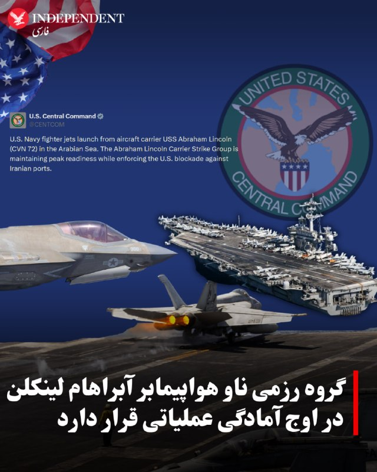

⭕️گروه رزمی ناو هواپیمابر آبراهام لینکلن در اوج آمادگی عملیاتی قرار دارد

♦️ستاد فرماندهی ارتش آمریکا، سنتکام  روز جمعه اول خرداد با انتشار تصاویری از پرواز جنگنده‌های نیروی دریایی آمریکا از ناو هواپیمابر «یواس‌اس آبراهام لینکلن» در دریای عرب، نوشت: «گروه رزمی ناو هواپیمابر آبراهام لینکلن در حالی که محاصره دریایی آمریکا علیه بنادر ایران را اجرا می‌کند، در بالاترین سطح آمادگی عملیاتی قرار دارد.»

 فرماندهی مرکزی ایالات متحده روز پنجشنبه ۳۱ اردیبهشت اعلام کرد که در جریان محاصره دریایی بنادر ایران، ۹۴ کشتی تجاری تغییر مسیر داده شده‌اند و چهار کشتی دیگر نیز «زمین‌گیر و ناگزیر به توقف» شده‌اند.

دولت ترامپ با هدف تحت فشار قرار دادن تهران برای دستیابی به توافقی جهت پایان دادن به جنگ، بنادر ایران را تحت محاصره دریایی قرار داده است. سنتکام روز چهارشنبه ویدیویی از ورود نیروهای آمریکایی به یکی از کشتی‌هایی که قصد داشت از خط محاصره عبور کند را منتشر کرد.
‌🇸🇦 Indypersian

🤖 @VahidOOnLine

## VahidOOnLine — post 241466

  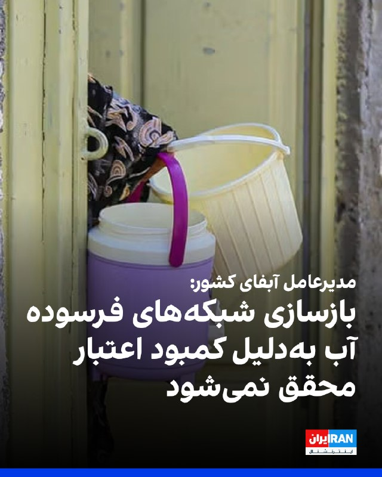

هاشم امینی، مدیرعامل شرکت مهندسی آب و فاضلاب کشور، به ایرنا گفت برآوردها نشان می‌دهد در هر شهر و روستا باید سالانه حدود ۱۰ درصد از شبکه‌های فرسوده آب بازسازی شود، اما محدودیت اعتبارات اجازه تحقق کامل این هدف را نمی‌دهد.

او افزود متوسط عمر لوله‌های آب حدود ۳۰ سال است و برای کاهش تنها یک درصد از هدررفت واقعی آب در شبکه، سالانه حدود ۲۱ هزار میلیارد تومان اعتبار نیاز است.

امینی میزان آب بدون درآمد در شبکه‌های آب شرب کشور را بیش از ۲۸ درصد اعلام کرد و گفت هدررفت واقعی آب در شبکه‌ها حدود ۱۲ درصد است.
‌🏁 🇬🇧 IranintlTV

🤖 @VahidOOnLine

## VahidOOnLine — post 241465

  

سنتکام با انتشار تصاویری از پرواز جنگنده‌های نیروی دریایی آمریکا از ناو هواپیمابر «یواس‌اس آبراهام لینکلن» در دریای عرب، نوشت: «گروه رزمی ناو هواپیمابر آبراهام لینکلن در حالی که محاصره دریایی آمریکا علیه بنادر ایران را اجرا می‌کند، در بالاترین سطح آمادگی عملیاتی قرار دارد.»
‌🏁 🇬🇧 IranintlTV

🤖 @VahidOOnLine

## VahidOOnLine — post 241464

⭕️نیروی دریایی ژاپن ناوچه پیشرفته «جی‌اس ناتوری» را به خدمت گرفت

♦️ناوچه «جی‌اس ناتوری» از کلاس پیشرفته و رادارگریز «موگامی» پس از مراسم تحویل و برافراشته‌شدن پرچم، به ناوگان نیروی دریایی دفاع‌ازخود ژاپن پیوست. این مراسم در شهر ناگاساکی برگزار شد.

شرکت میتسوبیشی هوی اینداستریز تاکنون ۱۲ ناوچه از کلاس موگامی برای نیروی دریایی ژاپن ساخته و نسخه ارتقایافته این طراحی نیز از سوی ژاپن و نیروی دریایی سلطنتی استرالیا سفارش داده شده است.
ناوهای رده «موگامی» به‌دلیل فناوری پنهان‌کاری، سامانه‌های پیشرفته رزمی و توان عملیات چندمنظوره شناخته می‌شوند.
‌🇸🇦 Indypersian

🤖 @VahidOOnLine

## VahidOOnLine — post 241463

  

♦️سفارت پاکستان در ایران اعلام کرد که محسن نقوی، وزیر کشور پاکستان، روز جمعه یکم خرداد با عباس عراقچی، وزیر امور خارجه جمهوری اسلامی جلسه‌ای را برای بررسی پیشنهادات در راستای حل اختلافات میان تهران و واشنگتن برگزار کرده است.
این خبر درحالی اعلام شد که العربیه به نقل از یک منبع بلندپایه گزارش داد سفر عاصم منیر، فرمانده ارتش پاکستان، که قرار بود پنجشنبه ۳۱ اردیبهشت به تهران سفر کند به تاخیر افتاده است.
العربیه همچنین گزارش داد سفر احتمالی منیر به تهران ممکن است در صورت دستیابی دو طرف به «چارچوب توافق» انجام شود.
رویترز روز پنجشنبه به نقل از یک منبع ارشد ایرانی نوشت هنوز توافق نهایی میان تهران و واشنگتن حاصل نشده، اما اختلاف‌ها کاهش یافته است.
‌🇸🇦 Indypersian

🤖 @VahidOOnLine

## VahidOOnLine — post 241462

  

سفارت پاکستان در تهران اعلام کرد محسن نقوی، وزیر خارجه این کشور، بار دیگر با عباس عراقچی، وزیر خارجه جمهوری اسلامی، در تهران دیدار کرد. سفارت پاکستان در ایران از این دیدار با عنوان «جلسه بررسی پیشنهادات برای حل اختلافات» یاد کرده است.
‌🏁 🇬🇧 IranintlTV

🤖 @VahidOOnLine

## VahidOOnLine — post 241461

  

♦️وزارت خارجه جمهوری اسلامی تحریم محمدرضا رئوف شیبانی، سفیر اخراجی این کشور در لبنان از سوی آمریکا را «غیرقانونی» و «ناموجه» خواند و آن را «بی‌اعتنایی هیئت حاکمه آمریکا به اصول مسلم حقوق بین الملل و منشور سازمان ملل متحد» دانست.
این وزارتخانه در بیانیه‌ای که روز جمعه منتشر شد همچنین اقدام آمریکا در تحریم تعدادی از نمایندگان حزب‌الله در مجلس و مسئولان لبنانی را محکوم کرد.
وزارت خزانه‌داری آمریکا روز پنجشنبه اعلام کرد که محمدرضا رئوف شیبانی، سفیر جمهوری اسلامی در لبنان را همراه با ۹ نفر مرتبط با حزب‌الله که حاکمیت لبنان را تضعیف می‌کنند تحریم کرده است.
‌🇸🇦 Indypersian

🤖 @VahidOOnLine

## VahidOOnLine — post 241460

  

بر اساس اطلاعات رسیده به ایران‌اینترنشنال، بهزاد یزدانی و رومینا خزعلی، زوج بهائی ساکن شیراز و والدین دو نوجوان، بیش از ۵۰ روز است بدون دسترسی به وکیل و در وضعیت بلاتکلیف در زندان عادل‌آباد شیراز نگهداری می‌شوند.

یک منبع آگاه درباره وضعیت این زوج به ایران‌اینترنشنال گفت با وجود پیگیری‌های مکرر خانواده و نزدیکان، مقام‌های قضایی تاکنون به درخواست‌ها برای تبدیل قرار بازداشت به وثیقه پاسخی نداده‌اند.

به گفته این منبع آگاه، رومینا خزعلی که پیش از بازداشت با مشکلات جسمی متعددی از جمله میگرن و معده‌درد شدید مواجه بوده، در آخرین تماس خود از وضعیت نامساعد روحی نیز خبر داده است. او پیش از بازداشت تحت عمل جراحی معده قرار گرفته بود و ادامه بازداشت در چنین شرایطی، نگرانی خانواده درباره وضعیت جسمی و روانی این زوج را افزایش داده است.

بهزاد یزدانی، مترجم و ویراستار، و همسرش رومینا خزعلی، نقاش، به‌ترتیب در روزهای ۸ و ۹ فروردین‌ماه، از سوی ماموران اطلاعات سپاه در منزل شخصی‌شان در شیراز بازداشت شدند.
‌🏁 🇬🇧 IranintlTV

🤖 @VahidOOnLine

## VahidOOnLine — post 241459

♦️باشگاه النصر عربستان سعودی ویدیویی از کریستیانو رونالدو در حال طبل‌زنی و همراهی با تشویق هماهنگ هواداران پس از قهرمانی این تیم در لیگ عربستان سعودی منتشر کرد.

النصر در دیدار پایانی ۴ بر ۱ ضمک را شکست داد و قهرمان شد. رونالدو نیز با دو گل در این مسابقه، شمار گل‌های دوران حرفه‌ای خود را به ۹۷۳ رساند.

این سی‌وهفتمین جام دوران حرفه‌ای رونالدو و نخستین قهرمانی لیگ او از زمان قهرمانی با یوونتوس در سری‌آ ایتالیا در سال ۲۰۲۰ است.
‌🇸🇦 Indypersian

🤖 @VahidOOnLine

## VahidOOnLine — post 241458

  

نیویورک تایمز به نقل از مقام‌های ایرانی و افراد آگاه گزارش داد جمهوری اسلامی با عمان درباره مشارکت در ایجاد سامانه‌ای برای دریافت هزینه از کشتی‌های عبوری از تنگه هرمز گفت‌وگو کرده است.
دو فرد آگاه از این مذاکرات گفتند تهران قصد ایجاد نظام عوارض عبور که صرفا برای گذر کشتی‌ها هزینه دریافت کند، ندارد و گفت‌وگوها بر طرحی متمرکز است که از کشتی‌ها بابت ارائه خدمات هزینه دریافت شود.
به گفته دو مقام ایرانی آگاه، عمان در ابتدا مشارکت با ایران درباره تنگه را رد کرده بود، اما اکنون درباره سهمی از درآمدها وارد مذاکره شده است.
این مقام‌ها گفتند عمان به جمهوری اسلامی اعلام کرده حاضر است از نفوذ خود نزد همسایگان در خلیج فارس، از جمله بحرین، کویت، قطر، عربستان سعودی و امارات متحده عربی، و نیز نزد آمریکا استفاده کند تا این طرح را پیش ببرد، زیرا به مزایای اقتصادی بالقوه نظام دریافت هزینه پی برده است.
طبق این گزارش، جمهوری اسلامی و عمان تاکید دارند که بحث بر سر «کارمزد خدمات» است نه «عوارض عبور» و این یک تمایز حقوقی مهم ایجاد می‌کند، زیرا دریافت عوارض صرف برای عبور از تنگه‌های بین‌المللی طبق حقوق دریاها غیرقانونی تلقی می‌شود.
‌🏁 🇬🇧 IranintlTV

🤖 @VahidOOnLine

## VahidOOnLine — post 241457

  

♦️منابع آگاه به سی‌ان‌ان گفتند دونالد ترامپ جونیور (کوچک) آخر این هفته در جزیره‌ای کوچک در باهاما با بتینا اندرسون ازدواج خواهد کرد.
به گفته این منابع، انتظار نمی‌رود رئیس‌جمهور دونالد ترامپ در این مراسم حضور داشته باشد، هرچند او به خبرنگاران گفته بود تلاش می‌کند شرکت کند.
به گفته منابع، این زوج برای حفظ خصوصی و صمیمی بودن مراسم، فهرست مهمانان را به کمتر از ۵۰ نفر محدود کرده‌اند.
دو منبع آگاه به سی‌ان‌ان گفتند پسر ارشد رئیس‌جمهوری، آخر این هفته با بتینا اندرسون، چهره اجتماعی شناخته‌شده پالم‌بیچ، در جزیره‌ای کوچک در باهاما ازدواج خواهد کرد.
به گفته منابع، یکی از افرادی که انتظار نمی‌رود در این مراسم خصوصی حضور داشته باشد، خود رئیس‌جمهوری دونالد ترامپ است.
آن‌ها گفتند فهرست مهمانان عمدا کوچک نگه داشته شده است. تنها اعضای درجه‌یک خانواده و نزدیک‌ترین دوستان این زوج در مراسم حضور خواهند داشت و شمار کل مهمانان کمتر از ۵۰ نفر خواهد بود.
با این حال، ترامپ روز پنجشنبه بعدازظهر در دفتر بیضی کاخ سفید، هنگام پاسخ به پرسشی درباره این مراسم، موضعی مبهم اتخاذ کرد.
ترامپ به خبرنگاران گفت: «او دوست دارد من بروم، اما قرار است مراسمی کوچک و خصوصی باشد و من تلاش می‌کنم خودم را برسانم.»
او افزود: «الان زمان مناسبی برای من نیست. همه چیز مربوط به ایران و مسائل دیگر است.»
یکی از منابع به سی‌ان‌ان گفت، برنامه عمومی رئیس‌جمهوری نیز نشان نمی‌دهد که او قصد شرکت در مراسم را داشته باشد. سی‌ان‌ان برای دریافت نظر کاخ سفید و نماینده ترامپ جونیور تماس گرفته است.
منابع گفتند پسر ارشد و عروس ترامپ امیدوار بودند جزئیات مراسم ازدواج به رسانه‌ها درز نکند تا مراسم همچنان خصوصی و دور از توجه عمومی باقی بماند. این موضوع همچنین نگرانی‌های امنیتی را کاهش می‌دهد و مهمانان را از دردسرهای ناشی از تدابیر شدید امنیتی مرتبط با حضور رئیس‌جمهوری دور نگه می‌دارد.
به گفته منابع، خواهر و برادرهای ترامپ پسر قرار است در مراسم حضور داشته باشند.
این مراسم دومین ازدواج پسر ارشد ترامپ خواهد بود. او پیش‌تر ۱۲ سال با ونسا ترامپ ازدواج کرده بود و این دو در سال ۲۰۱۸ از هم جدا شدند. ونسا ترامپ روز چهارشنبه اعلام کرد که به سرطان پستان مبتلا شده است.
او پیش‌تر از سال ۲۰۲۰ تا ۲۰۲۴ با کیمبرلی گیلفویل، سفیر کنونی آمریکا در یونان و همسر سابق گوین نیوسام، فرماندار کالیفرنیا، نامزد بود.
‌🇸🇦 Indypersian

🤖 @VahidOOnLine

## VahidOOnLine — post 241456

  

وال‌استریت ژورنال گزارش داد میلیاردها دلار رمزارز از طریق صرافی بایننس به شبکه‌های مالی مرتبط با جمهوری اسلامی و سپاه پاسداران منتقل شده و این روند حتی تا ماه کنونی نیز ادامه داشته است. از جمله بابک زنجانی طی دو سال حدود ۸۵۰ میلیون دلار تراکنش در بایننس انجام داده است.
به گفته منابع آگاه، از ۸۵۰ میلیون دلار تراکنش بابک زنجانی در بایننس، حدود ۴۲۵ میلیون دلار آن می‌تواند صرف تامین مالی ساختار نظامی ایران شده باشد.
طبق این گزارش، علاوه بر زنجانی، بانک مرکزی ایران و نهادهای مرتبط با حکومت نیز صدها میلیون دلار رمزارز از طریق حساب‌های بایننس جابه‌جا کرده‌اند و برخی حساب‌ها با وجود هشدارهای داخلی، ماه‌ها فعال مانده‌اند.
این گزارش افزود که انتقال‌ها حتی پس از اعتراف بایننس در سال ۲۰۲۳ به نقض قوانین ضدپولشویی و پرداخت جریمه ۴.۳ میلیارد دلاری ادامه یافته و اکنون وزارت دادگستری آمریکا در حال بررسی دوباره این موضوع است.
بایننس ضمن تکذیب این اتهامات تاکید کرده است که فعالیت‌های غیرقانونی را تحمل نمی‌کند و هیچ تراکنش مستقیمی با نهادهای تحریم‌شده انجام نداده است.

‌🏁 🇬🇧 IranintlTV

🤖 @VahidOOnLine

## VahidOOnLine — post 241455

  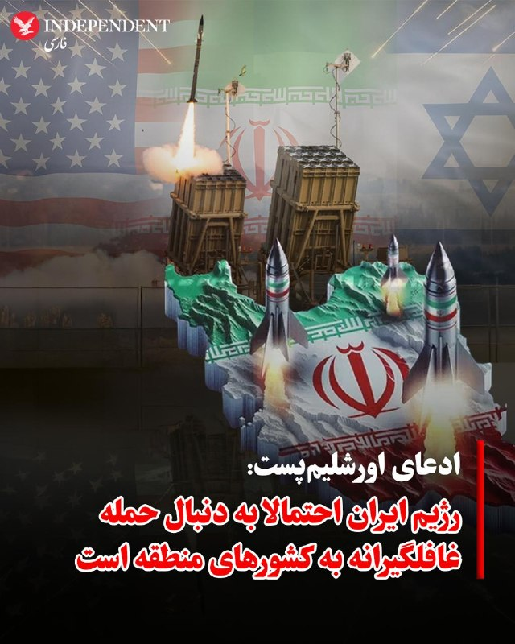

♦️اورشلیم‌پست به نقل از مقام‌های اطلاعاتی اسرائیل گزارش داد که تهران ممکن است در حال برنامه‌ریزی برای یک حمله غافلگیرانه با موشک و پهپاد علیه کشورهای خلیج فارس و اسرائیل باشد.
این هشدار در پی ارزیابی‌های امنیتی در بالاترین سطوح نظامی اسرائیل مطرح شده است. بر اساس این گزارش، تهران ممکن است پیش از آنکه مذاکرات آتش‌بس با ایالات متحده به نتیجه نهایی برسد، با هدف پیش‌دستی، عملیاتی مشابه با درگیری‌های گذشته انجام دهد.
در واکنش به این تهدید، ارتش اسرائیل همکاری‌های نظامی و اطلاعاتی خود با آمریکا را به شکل چشمگیری افزایش داده است. علاوه بر تبادل اطلاعات درباره فعالیت‌های غیرعادی، حجم انتقال تجهیزات نظامی از سوی ایالات متحده به اسرائیل در ماه اخیر افزایش یافته تا سامانه‌های رهگیری موشکی و توان دفاعی دو طرف برای هرگونه سناریوی احتمالی تقویت شود.
‌🇸🇦 Indypersian

🤖 @VahidOOnLine

## WithYashar — post 11921

سفارت پاکستان در تهران اعلام کرد، وزیر کشور پاکستان بار دیگر با عباس عراقچی وزیر خارجه ایران دیدار کرد تا پیشنهادات برای حل اختلافات در مذاکرات با آمریکا را بررسی کنند.
@withyashar

## WithYashar — post 11920

رأی‌گیری درباره اختیارات جنگی ترامپ، به دست جمهوری‌خواهان به تعویق افتاد.
@withyashar

## mwarmonitor — post 9455

انفجار در ابوظبی

## mwarmonitor — post 9454

🔴جمهوری‌خواهان مجلس نمایندگان رای‌گیری برای محدود کردن جنگ ترامپ در ایران را لغو کردند

🔰رهبری جمهوری‌خواه مجلس نمایندگان روز پنجشنبه رای‌گیری برنامه‌ریزی‌شده برای محدود کردن مبارزات نظامی پرزیدنت ترامپ در ایران را پس از آنکه مشخص شد آرای کافی برای شکست دادن آن را ندارند، لغو کرد (از دستور کار خارج کرد).

چرا این موضوع اهمیت دارد: این اقدام می‌توانست اولین توبیخ و سرزنش موفقیت‌آمیز تلاش‌های جنگی ترامپ علیه ایران از سوی کنگره باشد؛ آن هم پس از آنکه چندین تلاش دموکرات‌ها برای تصویب قطعنامه اختیارات جنگی شکست خورده بود.
جرد گلدن (نماینده دموکرات از ایالت مین)، تنها دموکراتی که به طور مداوم علیه قطعنامه‌های اختیارات جنگی ایران رای داده بود، قصد داشت این بار رای خود را به «بله» تغییر دهد.
چهار نماینده جمهوری‌خواه به نام‌های برایان فیتزپاتریک (از پنسیلوانیا)، توماس مسی (از کنتاکی)، وارن دیویدسون و تام بارت (از میشیگان) پیش از این از این طرح حمایت کرده بودند.
البته این رای‌گیری تا حد زیادی نمادین است، چرا که ترامپ می‌تواند این مصوبه را وتو کند.
عامل اصلی خبر: رهبران حزب جمهوری‌خواه در نظر دارند پس از بازگشت نمایندگان از تعطیلات یک‌هفته‌ای «روز یادبود» (Memorial Day)، این طرح را دوباره در صحن مجلس مطرح کنند.
رهبران حزب، رای‌گیری مربوط به تاسیس یک موزه زنان را ۴۵ دقیقه باز نگه داشتند تا در این فاصله بتوانند نمایندگان را برای رای دادن علیه قطعنامه اختیارات جنگی متقاعد و بسیج کنند (اصطلاحاً شلاق حزبی بزنند).
این اقدام خشم دموکرات‌ها را برانگیخت؛ تا جایی که وقتی جیم مک‌گاورن (نماینده دموکرات از ماساچوست و عضو ارشد کمیته قوانین مجلس) تلاش کرد این اقدام را زیر سوال ببرد، توسط رئیس جلسه با فریاد ساکت شد.
جرد هافمن (نماینده دموکرات از کالیفرنیا) در این رابطه به اکسیوس (Axios) گفت: «ما هفته گذشته از باخت با اختلاف یک رای به نتیجه مساوی رسیدیم و حالا به این عقب‌نشینی بزدلانه آن‌ها در امشب رسیده‌ایم.»
پشت پرده: غیبت برخی از نمایندگان جمهوری‌خواه باعث می‌شد که این طرح در روز پنجشنبه به تصویب برسد.
وقتی همه اعضای مجلس نمایندگان حضور کامل داشته باشند، مایک جانسون (رئیس مجلس نمایندگان از حزب جمهوری‌خواه) در رای‌گیری‌های کاملاً حزبی، تنها می‌تواند نافرمانی و ریزش تعداد انگشت‌شماری از هم‌حزبی‌هایش را تحمل کند.
مرور سریع: تلاش‌های قبلی برای محدود کردن اختیارات جنگی ترامپ در قبال ایران بارها شکست خورده بود.
انتظار می‌رفت مجلس نمایندگان روز چهارشنبه در مورد این قطعنامه رای‌گیری کند، اما رهبران جمهوری‌خواه به دلیل نگرانی از وضعیت حضور نمایندگان خود، این اقدام را به تاخیر انداختند.
آخرین تلاش دموکرات‌ها هفته گذشته در یک رای‌گیری بی‌سابقه با نتیجه مساوی ۲۱۲–۲۱۲ شکست خورد.
در آن رای‌گیری قبلی، گلدن رای منفی داده بود، در حالی که مسی، فیتزپاتریک و بارت از آن حمایت کردند و چندین قانون‌گذار نیز غایب بودند.
نگاه نزدیک‌تر: ترامپ روز چهارشنبه حملات خود را متوجه برایان فیتزپاتریک (نماینده جمهوری‌خواه) کرد و به خبرنگاران گفت: «او دوست دارد علیه ترامپ رای دهد. می‌دانید نتیجه این کار چیست؟ عاقبت خوبی ندارد.»
با این حال، فیتزپاتریک روز چهارشنبه به اکسیوس گفت که با وجود تهدیدهای رئیس‌جمهور، همچنان قصد دارد به این طرح رای مثبت دهد. او گفت: «ما در واشنگتن به هیچ حزب یا شخص خاصی گزارش نمی‌دهیم و بله‌قربان‌گو نیستیم.»
تصویر بزرگ‌تر: اگرچه جمهوری‌خواهان تا حد زیادی از کارزار نظامی ترامپ حمایت کرده‌اند، اما با طولانی شدن این درگیری بدون مجوز کنگره، نارضایتی و بی‌اعتمادی در میان آن‌ها افزایش یافته است.
برخی از جمهوری‌خواهان به ضرب‌الاجل ۶۰ روزه قانون اختیارات جنگی اشاره می‌کنند که اکنون منقضی شده است؛ قانونی که بر اساس آن در صورت عدم تایید کنگره، نیروهای آمریکایی ملزم به عقب‌نشینی هستند و این موضوع اکنون به یک نقطه عطف تبدیل شده است.

📌در مقابل، کاخ سفید استدلال می‌کند که این الزام به دلیل برقراری آتش‌بس با ایران، دیگر نافذ و قابل اجرا نیست.

@mwarmonitor

## mwarmonitor — post 9453

🔸دو فرد مطلع از گفتگوها درباره مدیریت این آبراه گفتند که ایران برنامه‌ای برای ایجاد یک سیستم عوارض که صرفاً برای عبور و مرور هزینه دریافت کند، ندارد. در عوض، در گفتگوها با عمان، پیشنهاد دریافت هزینه از کشتی‌ها در قبال ارائه «خدمات» مورد بررسی قرار گرفته است.

🔹به گفته دو مقام ایرانی مطلع از این گفتگوها که مجاز به مصاحبه علنی نبودند، عمان در ابتدا مشارکت مشترک با ایران در این تنگه را رد کرده بود، اما اکنون در حال گفتگو درباره سهمی از درآمدها است. این مقامات گفتند که عمان به ایرانی‌ها اعلام کرده است با درک منافع اقتصادی بالقوه یک سیستم کارمزد، حاضر است از نفوذ خود بر همسایگانش در خلیج [فارس] از جمله بحرین، کویت، قطر، عربستان سعودی و امارات متحده عربی و همچنین ایالات متحده برای پیشبرد این طرح استفاده کند. «نیویورک تایمز »

@mwarmonitor

## mwarmonitor — post 9452

  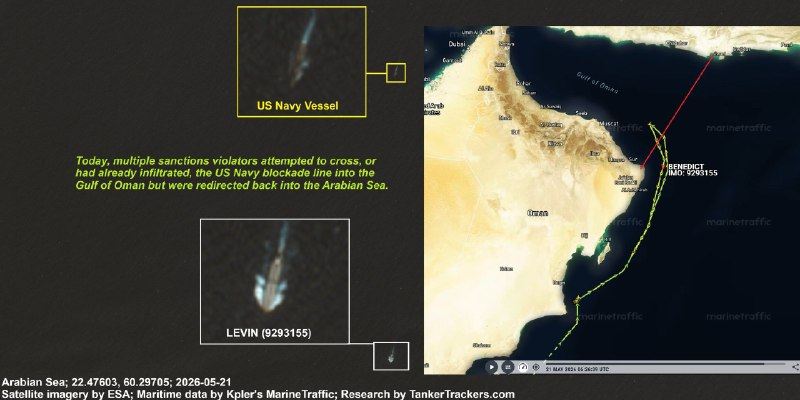

🔴نیروی دریایی ایالات متحده نیروی دریایی ایالات متحده با موفقیت شماری از ناقضان تحریم‌ها را در سواحل شرقی عمان متوقف کرد. در یک نمونه قابل مشاهده، نفتکش آفراماکس LEVIN (شماره IMO: 9293155) که معمولاً مقادیر زیادی نفت ایران را حمل می‌کند، پس از هدایت مجدد به دریای عرب، توسط یک شناور نیروی دریایی آمریکا تعقیب شد؛ این کشتی در زمان تعقیب بدون محموله بود.

🔸با این حال، مشاهده شد که چندین نفتکشِ بدون تحریم اما مرتبط با ایران وارد محدوده محاصره شده‌اند، زیرا دفتر کنترل دارایی‌های خارجی وزارت خزانه‌داری آمریکا (OFAC) هنوز آن‌ها را تحریم نکرده است. در حال حاضر، ۴۹ نفتکش از این دست در داخل این محدوده حضور دارند.

@mwarmonitor

## mwarmonitor — post 9451

  

🔴پدافند هوایی در امارات متحده عربی در حالت آماده‌باش بالا قرار دارد. شب گذشته، جنگنده‌های آمریکایی بر فراز ابوظبی ترانسپوندرهای خود را روشن کردند تا از هدف قرار گرفتن اشتباهی (آتشِ خودی) جلوگیری شود:

✈️یک فروند• F-16CG Fighting Falcon (شماره ثبت 89-2047، هگز AE26CC)
✈️• یک جنگنده نامشخص با کال‌ساین VIPER82 (هگز 15C4DA)

🔸این پروازها با پشتیبانی یک هواپیمای سوخت‌رسان KC-46A از تل‌آویو انجام شده‌اند.

@mwarmonitor

## mwarmonitor — post 9450

🔴روزنامه وال‌استریت ژورنال گزارش داد: وزارت دادگستری ایالات متحده تحقیقاتی را درباره استفاده ایران از پلتفرم بایننس به‌منظور دور زدن احتمالی تحریم‌ها آغاز کرده است.

@mwarmonitor

## pm_afshaa — post 91181

🔴سخنگوی کاخ کرملین: پوتین طرح انتقال اورانیوم ایران به روسیه رو با شی‌جی پینگ در میون گذاشته

💧 Rainbet.com the #1 Non-KYC Crypto Casino & Sportsbook @rainbetcom

😁 @Pm_Afshaa

## IranIntlTV — post 338354

🔻واشینگتن فری‌بیکن: گرجستان به پایگاه نفوذ سپاه پاسداران تبدیل شده است

واشینگتن فری بیکن در گزارشی نوشت گرجستان که زمانی متحد آمریکا بود، در دوران حاکمیت حزب اقتدارگرای «رویای گرجستان» به دولتی وابسته به جمهوری اسلامی تبدیل شده و به سپاه پاسداران امکان داده است نیروهای اطلاعاتی گرجی جذب کند؛ نیروهایی که آزادانه در اروپا و حتی آمریکا تردد می‌کنند.

این رسانه محافظه‌کار مستقر در واشینگتن دی‌سی، در گزارشی از یک جلسه که پنج‌شنبه ۳۱ اردیبهشت در اندیشکده هادسن برگزار شد، به نقل از کارشناسان شرکت‌کننده در این جلسه نوشت که این رابطه از سال‌ها پیش با حمایت رهبری حزب رویای گرجستان به‌تدریج شکل گرفته بود، اما در جریان جنگ ایران به شکل نگران‌کننده‌ای تشدید شد.

به نوشته این رسانه، این اتحاد میان رهبران کنونی گرجستان و سپاه نه‌تنها موضع مسکو در منطقه را تقویت کرده، بلکه به محور مقاومت بین‌المللی به رهبری چین، روسیه و جمهوری اسلامی نیز نیرویی تازه بخشیده است.

این رسانه به نقل از جو ویلسون، عضو جمهوری‌خواه کمیته روابط خارجی مجلس نمایندگان آمریکا از ایالت کارولینای جنوبی، نوشت: «رویای گرجستان در جنگ کنونی با اجازه دادن به هواپیماهای راهبردی ترابری روسیه برای عبور از حریم هوایی این کشور در مسیر ایران، به ایران کمک کرده است؛ هواپیماهایی که حامل تدارکاتی برای کمک به رژیم ایران و تضعیف رییس‌جمهوری ترامپ بودند.»
در این جلسه، چرخش تند گرجستان به سوی حکومت ایران، تهدیدی جدی برای امنیت ملی آمریکا عنوان شد، به‌ویژه که سپاه کارزارهای فعال و گسترده جذب نیرو در سراسر این کشور دارد. به گفته آنها گرجستان اکنون «سکوی راهبردی تازه‌ای در اوراسیا» در اختیار ایران قرار داده است؛ سکویی که به‌عنوان «زمینی حاصلخیز برای جذب نیروهای اطلاعاتی و بسیج شبه‌نظامی» عمل می‌کند.

لوک کافی، پژوهشگر ارشد اندیشکده هادسن در بخش اروپای مرکزی و اوراسیا، گفت: «شهروندان گرجستان می‌توانند آسان‌تر به ایالات متحده سفر کنند و آسان‌تر در منطقه شنگن اروپا رفت‌وآمد داشته باشند. به همین دلیل است که ایرانی‌ها این شهروندان گرجستانیِ آذری‌تبار را هدف قرار می‌دهند.»
رد پای جامعه المصطفی در گرجستان

اندیشکده هادسن به‌تازگی پژوهشی در این باره منتشر کرده است. در بخشی از این پژوهش آمده است: «حکومت ایران مدت‌هاست که جامعه گرجی‌های آذری‌تبار را که یک گروه قومی شیعه هستند، هدفی راهبردی می‌داند و شعبه‌هایی از مجمع جهانی اهل بیت و جامعه‌المصطفی را که تحت تحریم آمریکا قرار دارد، در داخل گرجستان راه‌اندازی کرده است.»

این گزارش افزود: «بنیادهای خیریه مرتبط با ایران نه‌تنها خدمات رفاهی اجتماعی ارائه می‌کنند، بلکه به ایران کمک می‌کنند نفوذ خود را افزایش دهد، منابع را منتقل کند و قدرت نرم خود را گسترش دهد.»

آمریکا سال ۱۳۹۹، جامعه‌ المصطفی را به اتهام ارتباط با فعالیت‌های نظامی-اطلاعاتی نیروی قدس سپاه تحریم کرد. در بیانیه وزارت خزانه‌داری ایالات متحده به تلاش جامعه المصطفی در تسهیل فعالیت‌های نیروی قدس سپاه پاسداران در جذب نیرو اشاره شده بود.
در بخشی از این بیانیه آمده بود: «مرکز آموزشی بین‌المللی جامعه المصطفی که در سراسر جهان شعبه دارد، به بستری برای جذب نیرو از سوی یگان قدس سپاه تبدیل شده است. از این نیروها برای جمع‌آوری اطلاعات . اجرای عملیات استفاده می‌شود؛ از جمله برای جذب نیروهای شبه‌نظامی با هدف اعزام به جنگ در سوریه.»

گیورگی کاندلاکی، عضو پیشین پارلمان گرجستان که یکی از نویسندگان این مقاله است، گفت که جامعه المصطفی در گرجستان سه پردیس دارد «موارد تاییدشده‌ای» وجود دارد که نشان می‌دهد پایگاه‌های المصطفی «برای جذب افراد یا انجام عملیات علیه آمریکا» مورد استفاده قرار گرفته‌اند.
🔗وب‌سایت ایران‌اینترنشنال
@iranintltv

## IranIntlTV — post 338353

🔻آمریکا سفیر اخراج‌شده جمهوری اسلامی در لبنان را به اتهام ارتباط با حزب‌الله تحریم کرد

وزارت خزانه‌داری آمریکا ۹ فرد در لبنان را به اتهام ارتباط با حزب‌الله و به دلیل آنچه «مانع‌تراشی در روند صلح در لبنان و جلوگیری از خلع سلاح حزب‌الله» خواند، تحریم کرد. محمدرضا شیبانی، سفیر اخراج‌شده جمهوری اسلامی در لبنان، در میان افراد تحریم‌شده قرار دارد.

وزارت خزانه‌داری ایالات متحده در بیانیه‌ای که پنجشنبه ۳۱ اردیبهشت در وب‌سایت این وزارت‌خانه منتشر شد، افراد تحریم‌شده را «مقام‌های هم‌سو با حزب‌الله» توصیف کرد که در «بخش‌های مختلف پارلمان، ارتش و نهادهای امنیتی لبنان نفوذ کرده‌اند و می‌کوشند نفوذ این گروه تروریستی مورد حمایت ایران را بر نهادهای کلیدی حکومت لبنان حفظ کنند.»

علاوه بر شیبانی، محمد عبداللطیف فنیچ، شورای اجرایی حزب‌الله و مسئول سازمان‌دهی مجدد ساختار اداری و نهادی این گروه؛ ابراهیم الموسوی، از مقام‌های ارشد حزب‌الله، نماینده این گروه در مجلس لبنان و رییس کنونی کمیته رسانه‌ای حزب‌الله؛ احمد اسعد بعلبکی و علی احمد صفوی، از مقام‌های امنیتی جنبش امل؛ حسن نظام‌الدین فضل‌الله، از نمایندگان منتخب حزب‌الله در پارلمان لبنان و مدیر ارشد شبکه تلویزیونی المنار؛ سمیر حمادی، رییس شعبه ضاحیه در اداره اطلاعات نیروهای مسلح لبنان؛ حسین الحاج حسن، از نمایندگان پارلمان لبنان و چهره کلیدی مخالف خلع سلاح؛ و خطار ناصرالدین، رییس اداره امنیت ملی در اداره کل امنیت عمومی لبنان در فهرست تحریمی قرار دارند.
اسکات بسنت، وزیر خزانه‌داری آمریکا، در این بیانیه‌ای دوباره بر الزام خلع سلاح حزب‌الله تاکید کرد و افزود: «وزارت خزانه‌داری به اقدام علیه مقام‌هایی که در دولت لبنان نفوذ کرده‌اند و به حزب‌الله امکان می‌دهند کارزار بی‌معنای خشونت خود را علیه مردم لبنان به راه بیندازد و مانع صلح پایدار شود، ادامه خواهد داد.»

وزارت امور خارجه لبنان چهارم فروردین اعتبار محمدرضا شیبانی، سفیر جمهوری اسلامی، را لغو و او را عنصر نامطلوب اعلام کرد. این وزارتخانه به شیبانی پنج روز وقت داد تا خاک لبنان را ترک کند.

۹ فروردین خبرگزاری فرانسه به نقل از یک منبع دیپلماتیک نوشت که شیبانی با وجود آنکه از سوی دولت لبنان «عنصر نامطلوب» خوانده شده، حاضر به ترک این کشور نیست.

بعدتر، جوزف عون، رییس‌جمهوری لبنان، درباره اخراج سفیر جمهوری اسلامی از این کشور گفت: «فرستاده ایران به‌عنوان سفیر شناخته نمی‌شود، زیرا استوارنامه خود را ارائه نکرده و بدون داشتن نقش رسمی در سفارت حضور دارد.»
گیدئون سعار، وزیر امور خارجه اسرائیل نیز با اشاره به اخراج محمدرضا شیبانی، سفیر جمهوری اسلامی در لبنان، گفته بود او هنوز این کشور را ترک نکرده و این نشان می‌دهد که لبنان کشوری مجازی است و عملا از سوی حکومت ایران اشغال شده است.

دولت لبنان اوایل اردیبهشت در اقدامی کم‌سابقه، با ارسال نامه‌ای به سازمان ملل متحد، جمهوری اسلامی ایران را به سوءاستفاده از مصونیت دیپلماتیک، دخالت در امور داخلی لبنان و انتقال نیروهای سپاه پاسداران به این کشور «در پوشش فعالیت دیپلماتیک» متهم کرد.

اورشلیم‌پست در ادامه این تنش‌ها در گزارشی درباره شیبانی، نوشت که او پیش از سقوط حکومت بشار اسد در سوریه فعال بود، و پس از آن، در ژانویه ۲۰۲۶ به‌عنوان سفیر در لبنان منصوب شد.

او پیش‌تر در سال‌های ۲۰۰۵ تا ۲۰۰۹ نیز در بیروت خدمت می‌کرد. دوره‌ای که به نوشته این روزنامه اسرائیلی با رشد نفوذ حزب‌الله، جنگ ۲۰۰۶ با اسرائیل و تصرف بخش‌هایی از بیروت به‌وسیله این گروه در سال ۲۰۰۸ شناخته می‌شود.
🔗وب‌سایت ایران‌اینترنشنال
@iranintltv

## IranIntlTV — post 338352

  <a href="telegram/content/IranIntlTV_338352_1779432338.mp4" target="_blank">🎬 Download video</a>

فرمانده ارتش پاکستان که قرار بود برای نهایی کردن متن مذاکرات میان آمریکا و جمهوری اسلامی عازم تهران شود، سفر خود را به تعویق انداخته است. پیشتر رویترز گزارش داده بود غنی‌سازی در ایران و کنترل بر تنگه هرمز، همچنان از جمله نکات مورد اختلاف در رسیدن به توافق است.
مریم رحمتی، خبرنگار ایران‌اینترنشنال، گزارش می‌دهد
@iranintltv

## IranIntlTV — post 338351

🔻وال‌استریت ژورنال: شبکه بابک زنجانی از طریق بایننس ۸۵۰ میلیون دلار برای سپاه جابه‌جا کرد

وال‌استریت ژورنال در گزارشی تحقیقی نوشت که شبکه‌ای محرمانه تحت مدیریت بابک زنجانی، طی دو سال و با وجود هشدارهای مکرر، از طریق بایننس ۸۵۰ میلیون دلار تراکنش برای تامین مالی نیروهای نظامی جمهوری اسلامی انجام داد. این تراکنش‌ها دست‌کم تا بهمن ۱۴۰۴ ادامه داشت.

این روزنامه در گزارشی که بامداد جمعه یکم خرداد منتشر شد، نوشت که همزمان با آماده شدن جمهوری اسلامی برای درگیری با آمریکا، بابک زنجانی که خود را «فعال ضدتحریم» معرفی می‌کند، یک شبکه محرمانه مالی به مرکزیت بایننس، بزرگ‌ترین صرافی رمزارز جهان، ایجاد کرد تا جریان پول به سوی نیروهای نظامی حکومت ایران ادامه یابد.

این رسانه افزود این شبکه تا دی ۱۴۰۴ فعال بود و طی دو سال ۸۵۰ میلیون دلار تراکنش از طریق بایننس انجام داد. بخش عمده این نقل و انتقال‌ها از طریق یک حساب معاملاتی واحد انجام شده است.

در بخشی از این گزارش آمده است: «همراهان زنجانی در این عملیات مالی، از جمله اخواهرش، شریک عاطفی‌اش و یکی از مدیران شرکت او، حساب‌های دیگری را اداره می‌کردند که همه‌شان از دستگاه‌های یکسانی مورد استفاده قرار می‌گرفتند. بازرسان بایننس در گزارش‌های خود این الگو را نشانه‌ای از تلاش این گروه برای دور زدن تحریم‌های آمریکا علیه ایران دانستند.»
وال‌استریت‌ ژورنال همچنین بر اساس گزارش‌های بایننس نوشت که حساب اصلی، حتی پس از چندین هشدار داخلی درباره این فعالیت‌ها، دست‌کم به مدت ۱۵ ماه به فعالیت خود ادامه داد و تا ژانویه (حدفاصل ۱۱ دی تا ۱۱ بهمن ۱۴۰۴) همچنان باز بود. استفاده زنجانی از بایننس پیش‌تر گزارش نشده بود.

زنجانی به دلیل مشارکت در تامین مالی سپاه و گروهی از ناقضان حقوق بشر در جمهوری اسلامی از سوی بریتانیا و ایالات متحده تحریم شده است.

بریتانیا ۱۳ بهمن ۱۴۰۴ در بیانیه‌ای اعلام کرد که زنجانی را به دلیل ارائه خدمات مالی و تامین اقتصادی مسئولان نقض‌های آشکار حقوق بشر در ایران، تحریم کرد.

سه روز پیش از آن، وزارت خزانه‌داری آمریکا نیز اعلام کرده بود که زنجانی در یک بسته تحریمی در چارچوب مقابله با تروریسم علیه هفت شهروند و یک نهاد ایرانی تحریم شده است.

زنجانی در دوره ریاست‌جمهوری محمود احمدی‌نژاد (۱۳۸۴-۱۳۹۲) خود را «بسیجی اقتصادی» معرفی می‌کرد و در حوزه‌های متنوعی چون فروش نفت، جابجایی پول، ساختمان‌سازی، هواپیماداری، خرید باشگاه فوتبال و سینما فعالیت داشت، اما پاییز ۱۳۹۲ در پی متهم شدن به فساد مالی بازداشت شد.

در آذر ۱۳۹۵، دیوان عالی کشور حکم اعدام او را تایید کرد، با این شرط مهم که «اگر محکوم‌علیه، کلیه اموال را مسترد کرده و خسارات را جبران کند، می‌تواند از ارفاقات قانونی ذیل ماده ۱۱۴ قانون مجازات اسلامی بهره‌مند شود.»

این شرط مسیر تخفیف حکم را فراهم کرد.

شهریور ۱۴۰۴ رسانه‌های ایران نوشتند که زنجانی با وجود دو میلیارد یورو بدهی به شرکت ملی نفت ایران، با وثیقه‌گذاری رمزارز فاقد اعتبار مجددا از وزارت نفت خرید کرده و آن‌گونه که خود گفته یک تن طلا هم وارد کشور کرده است.

با انتشار این خبر روشن شد که زنجانی پس از گذشت حدود یک دهه از صدور حکم اعدام و سپس عفو از سوی علی خامنه‌ای، بار دیگر به فعالیت‌های اقتصادی بازگشته است. توقیف ۱۳ کیلوگرم شمش طلای منتسب به زنجانی از سوی گمرک ایران، یکی از حواشی مهم همین حضور دوباره بود.
وال‌استریت ژورنال در بخش دیگری از این گزارش بر اساس اسناد تطبیق مقررات بایننس، گفته‌های مقام‌های مجری قانون خارجی و اسناد غیرعلنی، نوشت که حجم عظیم این مبالغ نشان می‌دهد بایننس چگونه به‌عنوان یک شریان مالی برای سپاه پاسداران به کار رفته است.

🔗ادامه این گزارش را اینجا بخوانید
@iranintltv

## IranIntlTV — post 338350

  <a href="telegram/content/IranIntlTV_338350_1779432340.mp4" target="_blank">🎬 Download video</a>

با ادامه تنش‌ها در خاورمیانه و اختلال در عبور نفتکش‌ها از تنگه هرمز، آژانس بین‌المللی انرژی با انتشار گزارشی هشدار داد بازار جهانی نفت ممکن است تابستان امسال با کمبود شدید عرضه روبه‌رو شود.
گفت‌وگو با علی دادپی، اقتصاددان
@iranintltv

## IranIntlTV — post 338349

  <a href="telegram/content/IranIntlTV_338349_1779432342.mp4" target="_blank">🎬 Download video</a>

العربیه در گزارشی اعلام کرد سفر عاصم منیر، فرمانده ارتش پاکستان به تهران لغو شده است. این مقام نظامی قرار بود پس از دیدار وزیر کشور پاکستان با همتای ایرانی خود، برای نهایی کردن متن مذاکرات میان آمریکا و جمهوری اسلامی به تهران سفر کند.

جواد همدانی، خبرنگار ایران‌اینترنشنال، گزارش می‌دهد
@iranintltv

## IranIntlTV — post 338348

🔻بلومبرگ: انهدام ۲۰ پهپاد ام‌کیو-۹ ریپر در جنگ ایران، یک میلیارد دلار به آمریکا خسارت زد

بلومبرگ به نقل از منابع آگاه گزارش داد در «جنگ ایران» بیش از ۲۰ پهپاد ام‌کیو-۹ ریپر آمریکا که برای شناسایی، نظارت و حمله به کار می‌روند، منهدم شده‌اند و در نتیجه نزدیک به یک میلیارد دلار خسارت به ناوگان پهپادی آمریکا وارد شده است.

طبق این گزارش، بسیاری از این پهپادها با پدافند هوایی جمهوری اسلامی سرنگون شدند و برخی دیگر در حملات به پایگاه‌های آمریکا یا در حوادث عملیاتی از بین رفتند که این وضعیت نشان‌دهنده چالش‌های عملیاتی در برابر سامانه‌های دفاع هوایی تهران است.

با وجود این، ژنرال کنت ویلزباخ، فرمانده نیروی هوایی آمریکا، اعلام کرده است پهپاد‌های «ام‌کیو-۹ ریپر» (MQ-9 Reaper) در جریان عملیات «خشم حماسی» علیه جمهوری اسلامی، «باارزش‌ترین بازیگر» میدان جنگ بوده‌اند.

وب‌سایت تخصصی «ایر اند اسپیس فورسز» (Air & Space Forces Magazine) گزارش داد ویلزباخ ۳۰ اردیبهشت در جلسه کمیته نیروهای مسلح مجلس نمایندگان آمریکا، گفت: «شاید ارزشمندترین بازیگر عملیات خشم حماسی، یک سامانه بدون سرنشین بود: ام‌کیو-۹.»

این اظهارات از سوی فرمانده‌ای مطرح می‌شود که خود خلبان جنگنده است و نیروی هوایی آمریکا در سال‌های اخیر بارها درباره کنار گذاشتن تدریجی ریپرها صحبت کرده بود.

مقام‌های آمریکایی گفته‌اند که «جنگ ایران» باعث شده واشینگتن به‌دنبال خرید تعداد بیشتری از پهپادهای ام‌کیو-۹ ریپر باشد.

ژنرال دیوید تابور، معاون برنامه‌ریزی نیروی هوایی آمریکا، ۲۳ اردیبهشت به سناتورها گفت ارتش آمریکا در حال بررسی گزینه‌هایی برای خرید فوری ریپرهای بیشتر است.

بر اساس آمار رسمی، نیروی هوایی آمریکا در پایان سال ۲۰۲۵ حدود ۱۵۸ فروند ریپر فعال داشت، اما اکنون این تعداد به حدود ۱۳۵ فروند کاهش یافته است.

تروی مینک، وزیر نیروی هوایی آمریکا، نیز ۳۰ اردیبهشت گفت واشینگتن قصد کنار گذاشتن ریپرها را ندارد و هم‌زمان در حال بررسی نسل بعدی پهپادهای رزمی است.

شرکت «جنرال اتمیکس» (General Atomics)، سازنده ریپر، اعلام کرده کمتر از ۱۰ فروند ریپر جدید آماده تحویل فوری دارد، اما برخی پهپادهای از رده خارج‌شده نیز می‌توانند بازسازی و دوباره عملیاتی شوند.
سودآوری کلان صنایع نظامی اسرائیل

از سوی دیگر به دنبال جنگ اخیر با جمهوری اسلامی، صنایع هوافضای اسرائیل در سه‌ماهه نخست سال ۲۰۲۶ رکوردهای تازه‌ای را به ثبت رساند. فروش این شرکت از مرز تاریخی دو میلیارد دلار عبور کرد، سود خالص آن حدود ۳۴ درصد افزایش یافت و حجم سفارشات ثبت‌شده به رکورد حدود ۳۳ میلیارد دلار رسید.

روزنامه معاریو پنج‌شنبه ۳۱ اردیبهشت با استناد به گزارش‌های مالی شرکت صنایع هوافضای اسرائیل برای سه‌ماهه نخست سال ۲۰۲۶، نوشت که «بزرگ‌ترین سفارش‌ها در تاریخ شرکت» در این بازه زمانی به ثبت رسیده‌اند.

بر اساس این گزارش، حجم سفارشات انباشته با جهشی محسوس از ۲۹ میلیارد دلار در پایان سال ۲۰۲۵، به رقم بی‌سابقه ۳۳ میلیارد دلار افزایش یافت.

این حجم از سفارشات، تداوم فعالیت عملیاتی شرکت را برای ۴.۴ سال آینده تضمین می‌کند.

حجم فروش در این دوره به حدود ۲.۱ میلیارد دلار رسید. رقمی که در مقایسه با ۱.۶ میلیارد دلار ثبت‌شده در دوره مشابه سال گذشته، افزایش قابل توجهی نشان می‌دهد.

سود خالص نیز با افزایش ۳۴ درصدی به حدود ۲۲۰ میلیون دلار رسید، در حالی که این رقم در سه‌ماهه نخست ۲۰۲۵، حدود ۱۶۴ میلیون دلار بود.

🔗وب‌سایت ایران‌اینترنشنال
@iranintltv

## IranIntlTV — post 338347

  

هاشم امینی، مدیرعامل شرکت مهندسی آب و فاضلاب کشور، به ایرنا گفت برآوردها نشان می‌دهد در هر شهر و روستا باید سالانه حدود ۱۰ درصد از شبکه‌های فرسوده آب بازسازی شود، اما محدودیت اعتبارات اجازه تحقق کامل این هدف را نمی‌دهد.

او افزود متوسط عمر لوله‌های آب حدود ۳۰ سال است و برای کاهش تنها یک درصد از هدررفت واقعی آب در شبکه، سالانه حدود ۲۱ هزار میلیارد تومان اعتبار نیاز است.

امینی میزان آب بدون درآمد در شبکه‌های آب شرب کشور را بیش از ۲۸ درصد اعلام کرد و گفت هدررفت واقعی آب در شبکه‌ها حدود ۱۲ درصد است.
https://iranintl.com/202605221058

## IranIntlTV — post 338346

  <a href="telegram/content/IranIntlTV_338346_1779432344.mp4" target="_blank">🎬 Download video</a>

سرخط خبرهای جمعه ۱ خرداد
@iranintltv

## IranIntlTV — post 338345

  

سنتکام با انتشار تصاویری از پرواز جنگنده‌های نیروی دریایی آمریکا از ناو هواپیمابر «یواس‌اس آبراهام لینکلن» در دریای عرب، نوشت: «گروه رزمی ناو هواپیمابر آبراهام لینکلن در حالی که محاصره دریایی آمریکا علیه بنادر ایران را اجرا می‌کند، در بالاترین سطح آمادگی عملیاتی قرار دارد.»
https://iranintl.com/202605224244

## IranIntlTV — post 338344

  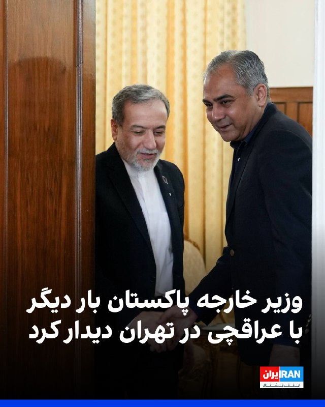

سفارت پاکستان در تهران اعلام کرد محسن نقوی، وزیر خارجه این کشور، بار دیگر با عباس عراقچی، وزیر خارجه جمهوری اسلامی، در تهران دیدار کرد. سفارت پاکستان در ایران از این دیدار با عنوان «جلسه بررسی پیشنهادات برای حل اختلافات» یاد کرده است.
https://iranintl.com/202605228409

## IranIntlTV — post 338343

  

بر اساس اطلاعات رسیده به ایران‌اینترنشنال، بهزاد یزدانی و رومینا خزعلی، زوج بهائی ساکن شیراز و والدین دو نوجوان، بیش از ۵۰ روز است بدون دسترسی به وکیل و در وضعیت بلاتکلیف در زندان عادل‌آباد شیراز نگهداری می‌شوند.

یک منبع آگاه درباره وضعیت این زوج به ایران‌اینترنشنال گفت با وجود پیگیری‌های مکرر خانواده و نزدیکان، مقام‌های قضایی تاکنون به درخواست‌ها برای تبدیل قرار بازداشت به وثیقه پاسخی نداده‌اند.

به گفته این منبع آگاه، رومینا خزعلی که پیش از بازداشت با مشکلات جسمی متعددی از جمله میگرن و معده‌درد شدید مواجه بوده، در آخرین تماس خود از وضعیت نامساعد روحی نیز خبر داده است. او پیش از بازداشت تحت عمل جراحی معده قرار گرفته بود و ادامه بازداشت در چنین شرایطی، نگرانی خانواده درباره وضعیت جسمی و روانی این زوج را افزایش داده است.

بهزاد یزدانی، مترجم و ویراستار، و همسرش رومینا خزعلی، نقاش، به‌ترتیب در روزهای ۸ و ۹ فروردین‌ماه، از سوی ماموران اطلاعات سپاه در منزل شخصی‌شان در شیراز بازداشت شدند.
https://iranintl.com/202605220152

## IranIntlTV — post 338342

  

نیویورک تایمز به نقل از مقام‌های ایرانی و افراد آگاه گزارش داد جمهوری اسلامی با عمان درباره مشارکت در ایجاد سامانه‌ای برای دریافت هزینه از کشتی‌های عبوری از تنگه هرمز گفت‌وگو کرده است.
دو فرد آگاه از این مذاکرات گفتند تهران قصد ایجاد نظام عوارض عبور که صرفا برای گذر کشتی‌ها هزینه دریافت کند، ندارد و گفت‌وگوها بر طرحی متمرکز است که از کشتی‌ها بابت ارائه خدمات هزینه دریافت شود.
به گفته دو مقام ایرانی آگاه، عمان در ابتدا مشارکت با ایران درباره تنگه را رد کرده بود، اما اکنون درباره سهمی از درآمدها وارد مذاکره شده است.
این مقام‌ها گفتند عمان به جمهوری اسلامی اعلام کرده حاضر است از نفوذ خود نزد همسایگان در خلیج فارس، از جمله بحرین، کویت، قطر، عربستان سعودی و امارات متحده عربی، و نیز نزد آمریکا استفاده کند تا این طرح را پیش ببرد، زیرا به مزایای اقتصادی بالقوه نظام دریافت هزینه پی برده است.
طبق این گزارش، جمهوری اسلامی و عمان تاکید دارند که بحث بر سر «کارمزد خدمات» است نه «عوارض عبور» و این یک تمایز حقوقی مهم ایجاد می‌کند، زیرا دریافت عوارض صرف برای عبور از تنگه‌های بین‌المللی طبق حقوق دریاها غیرقانونی تلقی می‌شود.

## IranIntlTV — post 338341

  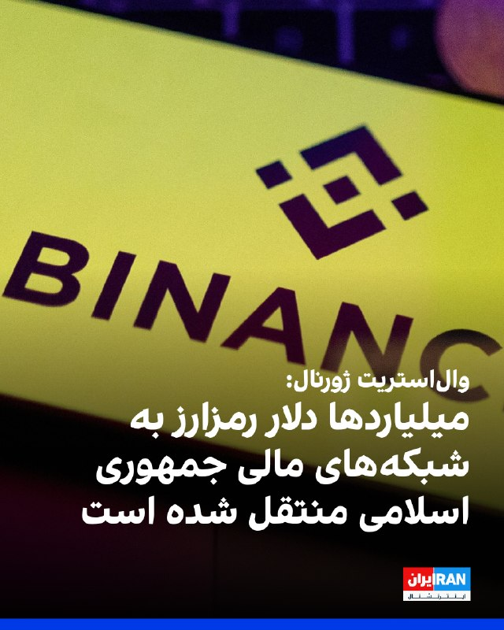

وال‌استریت ژورنال گزارش داد میلیاردها دلار رمزارز از طریق صرافی بایننس به شبکه‌های مالی مرتبط با جمهوری اسلامی و سپاه پاسداران منتقل شده و این روند حتی تا ماه کنونی نیز ادامه داشته است. از جمله بابک زنجانی طی دو سال حدود ۸۵۰ میلیون دلار تراکنش در بایننس انجام داده است.
به گفته منابع آگاه، از ۸۵۰ میلیون دلار تراکنش بابک زنجانی در بایننس، حدود ۴۲۵ میلیون دلار آن می‌تواند صرف تامین مالی ساختار نظامی ایران شده باشد.
طبق این گزارش، علاوه بر زنجانی، بانک مرکزی ایران و نهادهای مرتبط با حکومت نیز صدها میلیون دلار رمزارز از طریق حساب‌های بایننس جابه‌جا کرده‌اند و برخی حساب‌ها با وجود هشدارهای داخلی، ماه‌ها فعال مانده‌اند.
این گزارش افزود که انتقال‌ها حتی پس از اعتراف بایننس در سال ۲۰۲۳ به نقض قوانین ضدپولشویی و پرداخت جریمه ۴.۳ میلیارد دلاری ادامه یافته و اکنون وزارت دادگستری آمریکا در حال بررسی دوباره این موضوع است.
بایننس ضمن تکذیب این اتهامات تاکید کرده است که فعالیت‌های غیرقانونی را تحمل نمی‌کند و هیچ تراکنش مستقیمی با نهادهای تحریم‌شده انجام نداده است.

https://iranintl.com/202605222445

## FarsiVOA — post 218346

  

ارتش اسرائیل اعلام کرد که دو مظنون مسلح را پیش از نزدیک شدن به مرز این کشور با لبنان، هدف قرار داده و کشته است.

تایمز اسرائیل وقوع این حادثه را صبح روز جمعه اول خرداد ماه اعلام کرد، اما جزئیاتی بیشتری از هویت این مظنونان ارائه نداد.

ارتش اسرائیل اعلام کرده است که حرکات مشکوک این دو فرد مسلح را از چند صد متر دورتر از مرز اسرائیل رصد کرده است. این دو مظنون مسلح پس از نزدیک شدن به مرز از سمت جنوب لبنان‌، هدف حملات هوایی قرار گرفته‌اند.

ارتش اسرائیل همچنین اعلام کرد که مظنون دیگری در این منطقه وجود ندارد و این حادثه پایان یافته است.
@FarsiVOA

## FarsiVOA — post 218345

🔺روبیو پیام «ناامیدی» ترامپ از موضع ناتو درباره جنگ ایران را به اعضای ناتو اعلام می‌کند

▪️وزیر خارجه آمریکا اعلام کرد که دونالد ترامپ از اعضای ناتو که به آمریکا اجازه نداده‌اند از پایگاه‌هایشان برای جنگ علیه جمهوری اسلامی استفاده کند، «بسیار ناامید» است و به‌طور مشخص از اسپانیا نام برد.

▪️مارکو روبیو به خبرنگاران گفت: «کشورهایی مثل اسپانیا هستند که اجازه استفاده از این پایگاه‌ها را به ما نمی‌دهند؛ خب، پس چرا عضو ناتو هستند؟ این سؤال کاملاً منصفانه‌ای است.»

▪️آقای روبیو جمعه در هلسینگبورگ سوئد با همتایان خود در کشورهای عضو ناتو دیدار خواهد کرد.

▪️دونالد ترامپ پیشتر از اعضای ناتو به دلیل این‌که برای کمک به عملیات نظامی آمریکا و اسرائیل تلاش بیشتری نکرده‌اند، انتقاد کرده است.

⬇️ بیشتر بخوانید:
https://ir.voanews.com/a/8152730.html

## FarsiVOA — post 218344

  

شرکت ردیابی نفتکش‌ها، تانکر ترکرز، می‌گوید نیروی دریایی آمریکا با موفقیت جلوی فعالیت شمار زیادی از ناقضان تحریم‌های جمهوری اسلامی را در سواحل شرقی عمان گرفت.

این گزارش به مورد نفتکش «لوین» اشاره می‌کند که از سواحل شرقی عمان در تلاش برای عبور از محاصره دریایی آمریکا بود، اما توسط یک شناور نیروی دریایی آمریکا تعقیب شد.

سنتکام می‌گوید تاکنون ۹۴ کشتی مرتبط با ایران را وادار به تغییر مسیر کرده است.

با این حال، تانکر ترکرز می‌گوید چندین نفتکش مرتبط با ایران که تحت تحریم نیستند، وارد محدوده محاصره شده‌اند و در حال حاضر ۴۹ نفتکش از این نوع در داخل این محدوده در آب‌های ایران حضور دارند.
@FarsiVOA

## DW_Farsi — post 124988

🔶 آلمان: بخشی از پرونده‌های ویزای ایرانیان به ایروان منتقل شد

🔻 گزارشی از دانیال بابایانی

تعطیلی طولانی سفارت آلمان در ایران، به‌ویژه پس از جنگ و تشدید شرایط امنیتی، باعث شده روند مصاحبه‌های ویزا برای بسیاری از متقاضیان عملا متوقف شود. برخی از آن‌ها از دی‌ماه ۱۴۰۴ در صف انتظار هستند و هنوز نمی‌دانند آیا باید منتظر بمانند، به کشور ثالث بروند یا از ابتدا مسیر تازه‌ای را شروع کنند؟

در این میان، دانشجویان، متقاضیان دوره‌های آموزشی و نیروهای متخصص ایرانی می‌گویند، ماه‌هاست میان پاسخ‌های مبهم، ایمیل‌های خودکار و نبود اطلاع‌رسانی روشن گرفتار شده‌اند؛ وضعیتی که برای بسیاری از آن‌ها فقط یک تاخیر اداری نیست، بلکه می‌تواند به معنای از دست رفتن پذیرش دانشگاهی، قرارداد کاری، اعتبار مدرک زبان و پس‌انداز چند ساله باشد.

دویچه‌ وله برای روشن شدن وضعیت متقضایان، در تماس با وزارت خارجه آلمان درباره احتمال ازسرگیری روند صدور ویزا، معرفی کشور ثالث و ارائه راه‌حل موقت برای متقاضیان ایرانی پرسش‌هایی را مطرح کرد.
 
این وزارتخانه اکنون در پاسخ به دویچه‌ وله اعلام کرده است که "در مواردی" امکان بررسی درخواست ویزای شهروندان ایرانی در نمایندگی‌های آلمان در کشور همسایه فراهم شده است.

بر اساس این پاسخ، روند بررسی پرونده برخی متقاضیان، به‌ویژه دانشجویان و نیروهای متخصصی که پیش از آغاز درگیری‌های نظامی درخواست خود را در تهران ثبت کرده بودند، در هفته‌های اخیر از سر گرفته شده است.
@dw_farsi

## DW_Farsi — post 124987

🔶 جام‌های ۱۹۶۶ تا ۱۹۷۴؛ فرانتس بکن‌باوئر، "قیصر" مستطیل سبز

🔻 گزارشی از شهرام احدی

بکن‌باوئر در روز یازدهم سپتامبر ۱۹۴۵ در یکی از محله‌های شهر مونیخ در ایالت بایرن در جنوب آلمان به ‌دنیا آمد. او فوتبال را در باشگاه "اس ث مونیخ ۱۹۰۶"، یکی از تیم‌های محلی زادگاهش، آغاز کرد و سپس در ۱۳ سالگی به بایرن مونیخ پیوست؛ تیمی که در آن زمان دومین تیم بزرگ و موفق شهر بود.

بکن‌باوئر در ۱۹ سالگی سه بازی ملی در تیم جوانان را در کارنامه‌ خود ثبت کرده بود. او که به "قیصر" عالم فوتبال شهرت دارد، در پانزدهمین بازی ملی خود در پیراهن تیم ملی بزرگسالان آلمان، در فینال به‌یادماندنی جام جهانی ۱۹۶۶، در ورزشگاه ویمبلی لندن در برابر تیم میزبان، انگلیس به میدان رفت.
@dw_farsi

## DW_Farsi — post 124986

🔶 سنتکام: ناو آبراهام لینکلن در محاصره بنادر ایران در آماده‌باش کامل است

ستاد فرماندهی مرکزی آمریکا (سنتکام) با انتشار تصاویری از جنگنده‌های نیروی دریایی ایالات متحده بر روی ناو هواپیمابر آبراهام لینکلن در دریای عرب، اعلام کرد که در بالاترین سطح آمادگی عملیاتی به سر می‌برد.

سنتکام در این اطلاعیه که در شبکه اجتماعی ایکس منتشر شده تاکید کرده است که ‌ناو آبراهام لینکلن در قالب عملیات‌های کنونی، وضعیت آماده‌باش خود را به طور کامل حفظ می‌کند.

سنتکام پیش از این در روز چهارشنبه ۲۰ مه (۳۰ اردیبهشت) اعلام کرده بود که تفنگداران دریایی این کشور یک نفتکش با پرچم جمهوری اسلامی را که مظنون به تلاش برای نقض محاصره دریایی بود، در دریای عمان متوقف و بازرسی کردند.

ستاد فرماندهی مرکزی آمریکا با انتشار ویدئویی در شبکه‌ اجتماعی ایکس اعلام کرده بود که این نفتکش با نام "ام/‌تی سلستیال سی" که مظنون به تلاش به نقض محاصره دریایی و حرکت به سوی یکی از بنادر ایران بود، متوقف شد و تحت بازرسی قرار گرفت و سپس مسیر آن تغییر داده شد.

در بیانیه سنتکام آمده بود که نیروهای آمریکایی "پس از جستجو و هدایت، خدمه را برای تغییر مسیر کشتی آزاد کردند". سنتکام در بیانیه خود همچنین اعلام کرده بود که "نیروهای آمریکایی همچنان به اجرای کامل محاصره دریایی ادامه می‌دهند، تاکنون ۹۱ کشتی تجاری را برای اطمینان از رعایت آن، تغییر مسیر داده‌اند".

پس از اعمال محاصره دریایی آمریکا علیه بنادر ایران که اواسط آوریل، چند روز پس از برقراری آتش‌بس، صورت گرفت تا کنون دستکم پنج کشتی تجاری توقیف شده یا مورد بازرسی قرار گرفته‌اند.
@dw_farsi

## DW_Farsi — post 124985

🔶 هشدار مقام‌های امنیتی اسرائیل در خصوص حمله غافلگیرانه ایران

مقام‌های اطلاعاتی اسرائیل روز پنج‌شنبه ۲۱ مه (۳۱ اردیبهشت) هشدار دادند که جمهوری اسلامی ممکن است در حال برنامه‌ریزی برای یک حمله غافلگیرانه با استفاده از موشک‌ها و پهپادها علیه کشورهای حاشیه خلیج فارس و اسرائیل باشد.

احتمال انجام حمله پیش‌دستانه از سوی جمهوری اسلامی در پی برگزاری یک نشست ارزیابی وضعیت، با حضور فرماندهان ارشد نظامی و یسرائیل کاتس، وزیر دفاع اسرائیل، مطرح شد.

این هشدارها در حالی مطرح می‌شوند که مذاکرات آتش‌بس میان ایالات متحده و حکومت ایران همچنان ادامه دارد و گزارش‌ها حاکی از آن است که دونالد ترامپ، رئیس‌ جمهور ایالات متحده آمریکا، و بنیامین نتانیاهو، نخست‌وزیر اسرائیل، درباره نحوه ادامه مسیر در قبال ایران اختلاف نظر دارند.

به گزارش نشریه جروزالم پست مقام‌های امنیتی اسرائیلی اشاره کرده‌اند که جمهوری اسلامی ممکن است تلاش کند پیش از آنکه ایالات متحده و اسرائیل به این نتیجه برسند که مسیر دیپلماتیک دیگر کارآمد نیست و حمله‌ای غافلگیرانه مشابه حمله آغازین عملیات "خشم حماسی" و عملیات "غرش شیران" را آغاز کنند، دست به اقدام بزند.

این منبع اسرائیلی همچنین گزارش داده که نیروی هوایی اسرائیل و اداره عملیات ارتش این کشور، مجموعه‌ای از گفت‌وگوها را با همتایان آمریکایی خود به منظور افزایش سطح آمادگی انجام دادند و از جمله اطلاعات خود درباره فعالیت‌های غیرعادی جمهوری اسلامی را نیز به یکدیگر انتقال داده‌اند.

علاوه بر این، ایال زمیر، رئیس ستاد کل ارتش اسرائیل، در چارچوب یک ارزیابی کلی از وضعیت، نشست‌های امنیتی با فرماندهان نظامی درباره جنبه‌های دفاعی و تهاجمی برگزار کرده است.

زمیر همچنین برای هماهنگی پاسخ احتمالی در صورت حمله از سوی جمهوری اسلامی، گفت‌وگوهایی با همتایان آمریکایی خود انجام داده است. برخی منابع گزارش داده‌اند که شرایط موجود، احتمال انجام عملیات مشترک ارتش اسرائیل و ایالات متحده را تقویت می‌کند.

بر اساس گزارش جروزالم پست، برگزاری نشست ارزیابی وضعیت، به تقویت عملیات مشترک نظامی آتی اسرائیل و ایالات متحده، به خصوص در در زمینه رهگیری موشک‌ها، همکاری میان نهادهای دولتی و نظامی، یکپارچه‌سازی فناوری‌ها و بهبود نرم‌افزارها و همچنین تقویت نیروها کمک می‌کند. همچنین در طول یک ماه گذشته، حجم تجهیزات نظامی آمریکا که به اسرائیل منتقل شده است به‌طور چشمگیری افزایش یافته است.
@dw_farsi

## Persian_Trend_Official — post 14648

  

📷 Photo

## Persian_Trend_Official — post 14647

  

🔴 بلومبرگ: ایران بیش از ۲۴ پهپاد MQ-9 آمریکا را نابود کرده است

💢بلومبرگ گزارش داد ایران از آغاز جنگ تاکنون بیش از دو دوجین پهپاد آمریکایی MQ-9 Reaper را منهدم کرده است.

🔹بر اساس این گزارش:

▪️ ارزش این خسارات نزدیک به یک میلیارد دلار برآورد می‌شود
▪️ این میزان حدود ۲۰ درصد از موجودی پیش از جنگ پنتاگون از پهپادهای MQ-9 را شامل می‌شود
▪️ بسیاری از این پهپادها در جریان عملیات‌ها با آتش پدافند ایران سرنگون شده‌اند

همچنین گزارش شده:

▪️ تعدادی از پهپادها در حملات موشکی روی زمین نابود شده‌اند
▪️ برخی دیگر نیز در حوادث و سوانح عملیاتی از بین رفته‌اند

پهپاد MQ-9 Reaper یکی از مهم‌ترین پهپادهای تهاجمی و شناسایی ارتش آمریکا محسوب می‌شود و جایگزینی آن زمان‌بر و پرهزینه ارزیابی می‌شود.

🫆:Tony

📌 @persian_trend_official
پرشین ترند | متفاوت‌ترین کانال نظامی

## RadioFarda — post 157443

تلاش ایران برای رسمیت دادن به کنترل خود بر تنگۀ هرمز، به‌رغم مخالفت‌های بین‌المللی

🔸کوتاه‌زمانی پس از آغاز جنگ آمریکا و اسرائیل با ایران، تهران کنترل تنگۀ هرمز، این آبراه حیاتی انتقال حامل‌های انرژی به بازارهای بین‌المللی را در اختیار گرفت.

🔸حکومت ایران با تهدید حمله به کشتی‌ها و نفتکش‌های بین‌المللی، عملاً عبور و مرور شناورها از این منطقه را متوقف کرد؛ اقدامی که اهرم فشار قابل توجهی را در اختیار تهران گذاشت.

🔸حالا جمهوری اسلامی قصد دارد با به اجرا گذاشتن یک رژیم جدید ترابری، سیطره‌اش بر این گذرگاه راهبردی را رسمیت ببخشد. این در حالی‌ است که ایالات متحده، که خود به نحوی دیگر آب‌های منطقه را به محاصره در آورده، بارها با اعمال قدرت و تعرفه از سوی جمهوری اسلامی مخالفت کرده است.

🔸روز ۲۸ اردیبهشت‌ماه ایران «نهاد مدیریت آبراه خلیج فارس» را با هدف بررسی و دریافت تعرفه از کشتی‌های عبوری از تنگۀ هرمز معرفی کرد.

🔸این نهاد روز چهارشنبه ۳۰ اردیبهشت‌ماه با انتشار یک نقشه در شبکۀ ایکس، محدودۀ مدیریت ایران بر تنگۀ‌هرمز را اعلام کرد.

🔸بر اساس این مطلب، این محدوده، ناحیۀ مابین دو خط، یکی خط اتصال کوه مبارک در ایران و جنوب فجیره در امارات متحدۀ‌ عربی در شرق تنگه، تا خط اتصال انتهاى جزیره قشم در ایران و ام‌القیوین در امارات در غرب تنگه هرمز را در برمی‌گیرد.

🔸این نهاد تأکید کرده که عبور از این منطقه، نیازمند هماهنگی با مقام‌های ایرانی و دریافت مجوز خواهد بود.

🔸 گزارش کامل را در وب‌سایت رادیوفردا بخوانید.

@RadioFarda

## RadioFarda — post 157442

نماینده مجلس: با تصمیم نهادهای بالادستی، فعلاً نیاز به باز کردن اینترنت وجود ندارد

🔸نایب‌رئیس کمیسیون فرهنگی مجلس شورای اسلامی می‌گوید بر اساس تصمیم «نهادهای بالادستی، فعلاً نیازی به باز کردن اینترنت وجود ندارد» و مدعی شد دلیل آن «خطرات امنیتی و تهدید شخصیت‌ها و کشور» است.

🔸علی یزدی‌خواه روزپنجشنبه، ۳۱ اردیبهشت، به پایگاه خبری سیتنا همچنین گفت نمایندگان مجلس مراجعات مردمی گسترده‌ای دربارهٔ اعتراض به قطع اینترنت دریافت نکرده‌اند و مدعی شد «تقریباً بیش از ۹۰ درصد نیازها و احتیاجات مردم در شبکهٔ ملی اطلاعات برآورده می‌شود».

🔸اظهارات یزدی‌خواه در حالی مطرح می‌شود که منتقدان و شماری از کارشناسان حوزهٔ فناوری، استناد مقام‌های جمهوری اسلامی به ملاحظات امنیتی را بارها زیر سؤال برده‌اند و می‌گویند حکومت ایران از آغاز جنگ، اجرای عملی طرحی را سرعت بخشیده که سال‌ها با عنوان «شبکهٔ ملی اطلاعات» و محدودسازی اینترنت جهانی دنبال می‌کرد.

🔸حکومت ایران اینترنت را از نهم اسفند سال گذشته، همزمان با آغاز جنگ آمریکا و اسرائیل با ایران، قطع کرد و با گذشت بیش از ۸۳ روز، دسترسی عمومی همچنان برقرار نشده است. این به‌عنوان طولانی‌ترین قطع سراسری اینترنت یک کشور در جهان ثبت شده است.

🔸این نمایندهٔ مجلس همچنین گفت تاکنون «بالغ بر یک میلیون نفر» به اینترنت پرو دسترسی یافته‌اند و به‌گفتۀ او، در صورت نیاز، افراد یا سازمان‌ها می‌توانند دسترسی محدود به اینترنت دریافت کنند.

🔸این در حالی است که در هفته‌های اخیر فروش دسترسی‌ طبقاتی تحت عنوان «اینترنت پرو» خود به موضوعی بحث‌برانگیز تبدیل شده است. بر اساس گزارش وب‌سایت خبرآنلاین، بازار سیاهی برای فروش این نوع دسترسی شکل گرفته و برخی واسطه‌ها در ازای دریافت مبالغ میلیونی، متقاضیان را به‌عنوان کارمند شرکت‌ها یا اعضای اصناف ثبت می‌کنند تا امکان دریافت اینترنت جهانی برای آن‌ها فراهم شود.

🔸 گزارش کامل را در وب‌سایت رادیوفردا بخوانید.

@RadioFarda

## RadioFarda — post 157441

🔸شرکت‌های فناوری مرتبط با هوش مصنوعی در اروپا، با وجود پیامدهای اقتصادی جنگ ایران، در هفته‌های اخیر رشد قابل توجهی را تجربه کرده‌اند. 🔸خبرگزاری رویترز روز جمعه یکم خرداد گزارش داد که شوک انرژی ناشی از جنگ ایران و افزایش بهای نفت، چشم‌انداز اقتصاد اروپا را…

## RadioFarda — post 157440

  

🔸شرکت‌های فناوری مرتبط با هوش مصنوعی در اروپا، با وجود پیامدهای اقتصادی جنگ ایران، در هفته‌های اخیر رشد قابل توجهی را تجربه کرده‌اند.

🔸خبرگزاری رویترز روز جمعه یکم خرداد گزارش داد که شوک انرژی ناشی از جنگ ایران و افزایش بهای نفت، چشم‌انداز اقتصاد اروپا را تضعیف کرده و باعث شده بازار سهام این قاره نسبت به بازار آمریکا عملکرد ضعیف‌تری داشته باشد.

🔸بر اساس این گزارش، فعالیت اقتصادی در منطقه یورو در ماه مه به پایین‌ترین سطح خود در بیش از دو سال و نیم گذشته رسیده است.

🔸با این حال، بررسی‌های مؤسسه تحقیقاتی تی‌اس لمبارد نشان می‌دهد بخش بزرگی از رشد اخیر بازار سهام اروپا به شرکت‌های فعال در حوزهٔ هوش مصنوعی مربوط می‌شود.

🔸این شرکت‌ها عمدتاً در دو بخش فعالیت دارند: تولید تجهیزات و تراشه‌های نیمه‌رسانا، و توسعه زیرساخت‌های هوش مصنوعی مانند مراکز داده و شبکه‌های انتقال برق.

🔸به‌گفتهٔ مدیر بخش اقتصاد کلان اروپا در تی‌اس لمبارد، عملکرد سهام شرکت‌های اروپایی فعال در حوزهٔ هوش مصنوعی از ماه آوریل تاکنون تقریباً هم‌سطح شاخص فناوری نزدک آمریکا (دومین بازار بزرگ سهام جهان) بوده است.

@RadioFarda

## RadioFarda — post 157439

  <a href="https://t.me/radiofarda/157439" target="_blank">📎 Download file</a>

📻بشنوید: سرخط خبرها با رادیوفردا، اول خرداد ۱۴۰۵‌

@RadioFarda

## BBCPersian — post 281753

🔻 وزیر کشور پاکستان مجددا با وزیر خارجه ایران دیدار کرد

سفارت اسلام‌آباد در تهران گزارش کرده که محسن نقوی، وزیر کشور پاکستان برای دومین بار در دو روز گذشته با عباس عراقچی، وزیر خارجه ایران دیدار کرده است.

خبرگزاری فارس گفته این دیدار «برای بررسی پیشنهادهایی جهت حل اختلاف» در خصوص توافق میان ایران و آمریکا بوده است.

آقای نقوی روز چهارشنبه به تهران آمد و تاکنون با مقامات ارشد جمهوری اسلامی دیدار کرده است.

ایران اعلام کرده که در حال بررسی تازه‌ترین پیشنهادهای آمریکا برای پایان دادن به جنگ است.

احتمال می‌رود فیلد مارشال عاصم منیر،‌ فرمانده ارتش پاکستان، نیز برای کمک به میانجی‌گری میان ایران و آمریکا به تهران سفر کند.

https://bbc.in/4nJmQv7
@BBCPersian

## BBCPersian — post 281752

🔻 چهار کشته در حمله هوایی اسرائیل به یک مرکز پزشکی در جنوب لبنان

خبرگزاری ملی لبنان گزارش کرده که در حمله هوایی شبانه به یک مرکز بهداشت در شهر هناویه، در منطقه صور، چهار نفر کشته شده‌اند.

این خبرگزاری همچنین گفته در این حمله دو امدادگر نیز زخمی شده‌اند.
https://bbc.in/4v0i7rr
@BBCPersian

## BBCPersian — post 281751

  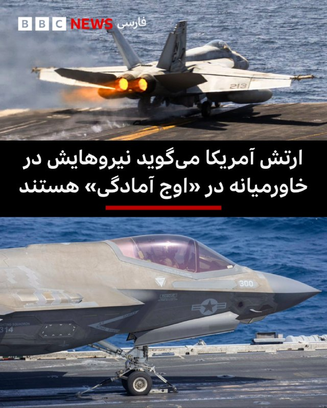

🔻سنتکام، سرفرماندهی مرکزی ارتش آمریکا، که بر عملیات جنگ علیه ایران نظارت دارد، اعلام کرد که گروه ضربت ناو هواپیمابر آبراهام لینکلن در دریای عرب «در اوج آمادگی» است.

سنتکام در پستی در شبکه‌های اجتماعی تصاویری از هواپیماهای جنگی آمریکا، از جمله جت‌های جنگنده رادارگریز اف‌۳۵ که از عرشه یک ناو هواپیمابر به پرواز درآمدند را به اشتراک گذاشت و گفت که نیروهایش در حالی که «محاصره آمریکا علیه بنادر ایران را اجرا می‌کنند»، آماده هستند.

📸CENTCOM
@BBCPersian

## BBCPersian — post 281750

  

🔻جمعیت هلال احمر ایران می‌گوید در طول جنگ آمریکا و اسرائیل با ایران توانسته «بیش از ۷۲۰۰ نفر را زنده از زیر آوار نجات» دهد.

این نهاد در پستی در شبکه‌ اجتماعی ایکس نوشته «حملات هوایی آمریکا و اسرائیل به مناطق مسکونی ... نقض مکرر قوانین جنگی و کشتار غیرنظامیان خصوصان کودکان و زنان» بوده است.

در این پست همچنین ویدیویی از کمک رسانی امدادگران هلال احمر منتشر شده که در حال بیرون آوردن آسیب‌دیدگان از زیر آوار هستند.

📸Getty Images
@BBCPersian

## BBCPersian — post 281749

  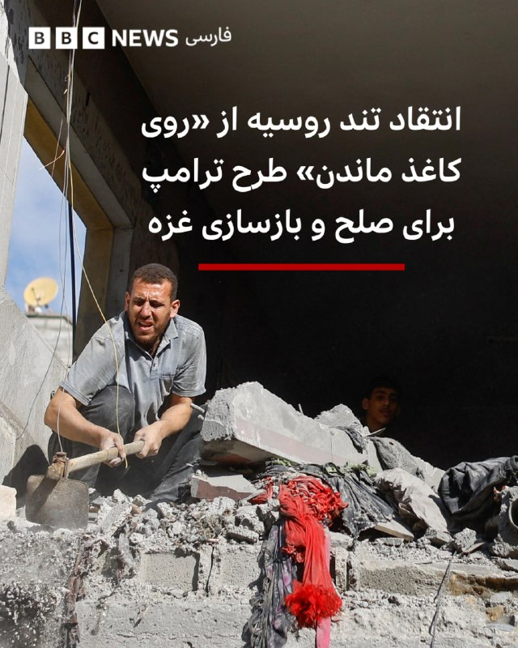

‌ ‌ ‌
با گذشت شش ماه از تصویب قطعنامه ۲۸۰۳ شورای امنیت سازمان ملل و آغاز اجرای آنچه «طرح ترامپ» برای غزه نامیده شد، انتقادها از ناکامی این ابتکار افزایش یافته است.

در حالی که واشنگتن و متحدانش این طرح را راهی برای پایان جنگ و بازسازی غزه معرفی می‌کردند، بسیاری از ناظران می‌گویند بخش عمده وعده‌های مطرح‌شده هرگز عملی نشده و وضعیت انسانی و امنیتی در این منطقه همچنان بحرانی باقی مانده است.

در تازه‌ترین انتقاد، سفیر روسیه در جلسه روز پنجشنبه شورای امنیت سازمان ملل متحد گفت طرح آقای ترامپ «روی کاغذ مانده» و عملا وعده‌های آن توخالی از آب در آمده است.

واسیلی نبنزیا، سفیر مسکو در سازمان ملل متحد گفت: «خواسته‌های اسرائیل برای آزادی همه گروگان‌ها و بازگرداندن اجساد کشته‌شدگان به‌طور کامل در این طرح گنجانده شد. شماری از فلسطینی‌ها نیز آزاد شدند. اما در مقابل، بسیاری دیگر از مفاد طرح همگی به گفته منتقدان، چیزی جز وعده‌های توخالی نبوده‌اند.»

https://bbc.in/42KXwLQ
📷Reuters
@BBCPersian

## BBCPersian — post 281748

  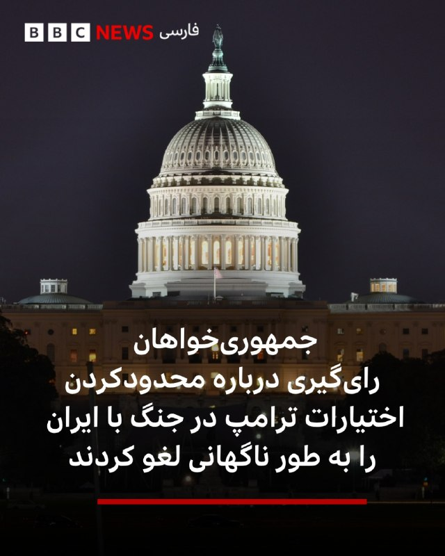

🔻رهبران جمهوری‌خواه مجلس نمایندگان آمریکا روز پنج‌شنبه به‌طور ناگهانی رای‌گیری درباره قطعنامه‌ای برای محدود کردن اختیارات جنگی دونالد ترامپ در قبال ایران را لغو کردند؛ آن هم در شرایطی که جمهوری‌خواهان به دلیل غیبت برخی نمایندگان در آستانه شکست در این رای‌گیری قرار داشتند.

این قطعنامه از سوی گرگوری میکس، نماینده دموکرات ایالت نیویورک و عضو ارشد کمیته روابط خارجی مجلس نمایندگان، ارائه شده بود.

این نماینده کنگره روز چهارشنبه به خبرنگاران گفته بود تصور می‌کند مایک جانسون، رئیس مجلس نمایندگان، در تلاش است رای‌گیری درباره این طرح را به تعویق بیندازد.

لغو ناگهانی این رای‌گیری در حالی رخ داد که شکاف‌ها در داخل حزب جمهوری‌خواه بر سر نحوه برخورد با ایران و اختیارات نظامی رئیس‌جمهور به‌تدریج آشکارتر شده است. برخی جمهوری‌خواهان معتقدند هرگونه اقدام نظامی گسترده علیه ایران باید با مجوز رسمی کنگره انجام شود، در حالی که متحدان دونالد ترامپ تاکید دارند رئیس‌جمهور برای دفاع از منافع آمریکا اختیار کافی دارد.

لینک خبر کامل:
https://bbc.in/3PEKeNZ
📷Getty Images

## BBCPersian — post 281747

  

🔻استان آلبرتا قرار است همه‌پرسی‌ای درباره ماندن در کانادا یا حرکت به سوی برگزاری دومین رای‌گیری الزام‌آور درباره جدایی برگزار کند؛ اقدامی که نخستین آزمون مهم وحدت کانادا در چند دهه اخیر به شمار می‌رود.

اعلام این تصمیم روز پنج‌شنبه از سوی دنیل اسمیت، نخست‌وزیر آلبرتا، پس از آن صورت گرفت که یک کارزار مردمی حامی جدایی اوایل امسال بیش از ۳۰۰ هزار امضا جمع‌آوری کرد. هم‌زمان، کارزار دیگری که خواهان باقی ماندن آلبرتا در کانادا بود نیز بیش از ۴۰۰ هزار امضا به دست آورد.

جنبش استقلال‌طلبی در این استان نفت‌خیز در سال‌های اخیر رشد کرده؛ جنبشی که بر پایه این احساس دیرینه شکل گرفته که تصمیم‌گیرندگان در اتاوا به آلبرتا بی‌توجه هستند.

با این حال، نظرسنجی‌ها نشان می‌دهد اکثریت مردم آلبرتا احتمالا به جدایی رای منفی خواهند داد.

به گفته نخست‌وزیر استان، همه‌پرسی برای ۱۹ اکتبر برنامه‌ریزی شده است.

لینک خبر:
https://bbc.in/4dpEGzV
📷Reuters

@BBCPersian

## BBCPersian — post 281746

🔻آمریکا ۵ هزار نیروی دیگر به لهستان اعزام می‌کند

🔻دونالد ترامپ، رئیس‌جمهور آمریکا، اعلام کرد ایالات متحده ۵ هزار نیروی نظامی دیگر به لهستان اعزام خواهد کرد؛ اقدامی که تنها یک هفته پس از لغو برنامه پنتاگون برای اعزام ۴ هزار نیرو به این کشور صورت می‌گیرد.

آقای ترامپ روز پنجشنبه در پیامی در شبکه اجتماعی تروث سوشال نوشت این تصمیم بر پایه روابط آمریکا با کارول ناوروتسکی، رئیس‌جمهور لهستان، اتخاذ شده؛ فردی که ترامپ در انتخابات ریاست‌جمهوری سال گذشته از او حمایت کرده بود.

رئیس‌جمهور آمریکا جزئیات بیشتری ارائه نکرد که آیا این نیروهای جدید بخشی از همان برنامه قبلی اعزام هستند یا در قالب عملیاتی جداگانه به لهستان فرستاده خواهند شد.

کاخ سفید در هفته‌های اخیر بارها اعلام کرده قصد دارد در چارچوب سیاست «اول آمریکا»، سطح کلی حضور نیروهای آمریکایی در اروپا را کاهش دهد.

اوایل همین ماه نیز آمریکا اعلام کرد ۵ هزار نیروی خود را از آلمان خارج خواهد کرد؛ اقدامی که پس از تنش لفظی میان آقای ترامپ و فریدریش مرتس، صدراعظم آلمان، بر سر جنگ با ایران مطرح شد.

او پیش‌تر از اظهارات مرتس که گفته بود آمریکا از سوی مذاکره‌کنندگان ایرانی «تحقیر شده»، انتقاد کرده بود.

هنوز مشخص نیست نیروهای اضافی اعزامی به لهستان بخشی از نیروهای خارج‌شده از آلمان خواهند بود یا گروهی جداگانه محسوب می‌شوند.

https://bbc.in/3RBCBIE
@BBCPersian

## Dirty_Kids — post 389921

وقتی بردی که زنت بخاطرت یه پله پایین وایمیسه که قدش تو عکس از تو بلندتر نشه

@Dirty_Kids 👻

## Dirty_Kids — post 389920

  

هر روز مردم سوریه در حال کشف یک گور دسته جمعی دیگر و سطح دیگری از ظلم و جنایت عوامل رژیم اسد، قاسم سلیمانی و سپاه پاسداران هستند.

اجسادی در داخل این بلوکهای بتنی وجود دارد که زنده زنده دفن شده اند.

@Dirty_Kids 👻

## alonews — post 121699

  <a href="telegram/content/alonews_121699_1779432359.webm" target="_blank">🎬 Download video</a>

👈منابع عربی: انفجار در ابوظبی

✅ @AloNews خبر جنگ

## alonews — post 121698

  <a href="telegram/content/alonews_121698_1779432359.webm" target="_blank">🎬 Download video</a>

👈رویترز نوشت: ایران با ایجاد ایست‌های بازرسی جزیره‌ای، توافق‌های دیپلماتیک و گاهی دریافت «هزینه عبور»، در حال تثبیت کنترل خود بر تنگه هرمز است

🔴 در حالی که کشورها تلاش می‌کنند ذخایر انرژی رو به کاهش خود را که در پی جنگ مختل شده، دوباره تأمین کنند، ایران یک سازوکار چندلایه برای عبور کشتی‌ها از تنگه هرمز اجرا می‌کند.

✅ @AloNews خبر جنگ

## alonews — post 121697

  <a href="telegram/content/alonews_121697_1779432360.webm" target="_blank">🎬 Download video</a>

👈ثبات انس جهانی طلا در محدوده ۴۵۰۰ دلار

✅ @AloNews خبر جنگ

## alonews — post 121696

  <a href="telegram/content/alonews_121696_1779432360.webm" target="_blank">🎬 Download video</a>

👈 اعلام وضعیت اضطراری بین‌المللی در پی شیوع ابولای بوندیبوگیو

🔴 سازمان جهانی بهداشت شیوع ابولای بوندیبوگیو در کنگو و اوگاندا را وضعیت اضطراری بین‌المللی اعلام کرد. این سویه که واکسنی برای آن وجود ندارد، از طریق تماس مستقیم با خون یا مایعات آلوده منتقل می‌شود و نرخ مرگ‌ومیر آن ۳۰ تا ۵۰ درصد گزارش شده است.

🔴 دوره نهفتگی این بیماری ۲ تا ۲۱ روز است که با علائم اولیه تب، سردرد و گلودرد آغاز شده و در مراحل پیشرفته به استفراغ، اسهال، اختلال عملکرد کلیه و کبد و خونریزی‌های داخلی و خارجی منجر می‌شود. در حال حاضر درمان این بیماری تنها محدود به آبرسانی حمایتی است.

✅ @AloNews خبر جنگ

## alonews — post 121695

  <a href="telegram/content/alonews_121695_1779432360.webm" target="_blank">🎬 Download video</a>

👈نظرسنجی نیویورک تایمز: ۹۵ درصد رأی‌دهندگان دموکرات با جنگ آمریکا و اسرائیل علیه ایران مخالف هستند

🔴 سه‌چهارم آنها نیز مخالف کمک به اسرائیل هستند

✅ @AloNews خبر جنگ

## alonews — post 121694

  <a href="telegram/content/alonews_121694_1779432360.webm" target="_blank">🎬 Download video</a>

👈 استولتنبرگ، وزیر دارایی نروژ و دبیرکل پیشین ناتو:  ناتو بدون آمریکا دوام نخواهد آورد، اتحادیه اروپا باید در مسائل امنیت جمعی و تضمین‌های دفاعی جایگزین ناتو شود.

✅ @AloNews خبر جنگ

## alonews — post 121693

  <a href="telegram/content/alonews_121693_1779432361.webm" target="_blank">🎬 Download video</a>

👈نخست‌وزیر عراق: دستور بررسی ابعاد حملات به عربستان و امارات صادر شد

✅ @AloNews خبر جنگ

## alonews — post 121692

  <a href="telegram/content/alonews_121692_1779432361.webm" target="_blank">🎬 Download video</a>

👈بزرگ‌ترین شرکت انرژی آمریکا، اکسون موبیل، در حال مذاکره با دولت ونزوئلا برای بازپس‌گیری حقوق تولید نفت در ونزوئلا است، پس از اینکه تقریباً ۲۰ سال پیش زمانی که هوگو چاوز، رئیس‌جمهور وقت، صنعت نفت ونزوئلا را ملی کرد، از این کشور اخراج شده بود.

✅ @AloNews خبر جنگ

## alonews — post 121691

  <a href="telegram/content/alonews_121691_1779432361.webm" target="_blank">🎬 Download video</a>

👈کمیسیون اروپا پیش‌بینی قیمت نفت در سال ۲۰۲۶ را نسبت به تخمین‌های پیشین، ۴۶ درصد افزایش داد.

🔴کمیسیون اروپا در گزارش «چشم‌انداز اقتصادی بهار ۲۰۲۶» خود تأکید کرده است که شوک انرژی ناشی از جنگ در خاورمیانه و بسته شدن عملی تنگهٔ هرمز، مهم‌ترین عامل این بازنگری صعودی در قیمت‌های نفت است.

✅ @AloNews خبر جنگ

## alonews — post 121690

  <a href="telegram/content/alonews_121690_1779432361.webm" target="_blank">🎬 Download video</a>

👈عربستان سعودی قراردادهای جدید با شرکت‌های مشاوره غربی را متوقف کرده و برخی پرداخت‌ها را به تعویق انداخته است، زیرا این پادشاهی با کسری بودجه فزاینده و تأثیرات اقتصادی جنگ با ایران مواجه است، گزارش فایننشال تایمز.

🔴 این پادشاهی در چارچوب طرح چشم‌انداز ۲۰۳۰ خود، هزینه‌ها را محدود می‌کند و به وزارتخانه‌های سعودی دستور داده شده است که بدون مجوز ویژه از وزارت دارایی، قراردادهای مشاوره جدید را تأیید نکنند، در حالی که برخی پرداخت‌های فاکتور حداقل تا ژوئیه به تعویق افتاده‌اند.

🔴 عربستان سعودی قبلاً پروژه‌های عظیم و پرهزینه‌ای مانند نئوم را کاهش داده یا به تعویق انداخته است، در حالی که نگرانی‌ها درباره هزینه‌های بیش از حد افزایش یافته است.

✅ @AloNews خبر جنگ

## alonews — post 121689

  <a href="telegram/content/alonews_121689_1779432362.webm" target="_blank">🎬 Download video</a>

👈دیدار مجدد وزیر کشور پاکستان با عراقچی برای بررسی پیشنهادات

✅ @AloNews خبر جنگ

## alonews — post 121688

  <a href="telegram/content/alonews_121688_1779432362.webm" target="_blank">🎬 Download video</a>

👈فایننشال‌تایمز به نقل از وزیر دارایی فرانسه: ما نمی‌توانیم ذخایر نفت بیشتری را بدون دانستن اینکه این درگیری چقدر طول خواهد کشید، آزاد کنیم.

🔴 حتی پس از بازگشایی تنگه هرمز، چندین هفته طول خواهد کشید تا منابع نفتی به اروپا و آسیا برسند.

✅ @AloNews خبر جنگ

## alonews — post 121687

  <a href="telegram/content/alonews_121687_1779432362.webm" target="_blank">🎬 Download video</a>

👈بلومبرگ: ادامه بسته ماندن تنگه هرمز تا ماه اوت، خطر رکود اقتصادی نزدیک به رکود سال ۲۰۰۸ را افزایش می‌دهد

✅ @AloNews خبر جنگ

## alonews — post 121686

  <a href="telegram/content/alonews_121686_1779432362.webm" target="_blank">🎬 Download video</a>

👈فاکس نیوز اعلام کرد که جمهوری خواهان در مجلس نمایندگان آمریکا رأی‌گیری درباره قطعنامه اختیارات جنگی رئیس‌جمهور این کشور را به تعویق انداختند.

✅ @AloNews خبر جنگ

## alonews — post 121685

  <a href="telegram/content/alonews_121685_1779432363.webm" target="_blank">🎬 Download video</a>

👈کپلر: احتمالا هزینه واردات LNG ژاپن از حدود ۱۰.۷۴ دلار به ازای ۲۸ مترمکعب گاز طبیعی در مارس به حدود ۱۷.۵ دلار در ژوئیه برسد.

🔴 این افزایش تحت تاثیر تاخیر در انتقال و رشد قیمت گاز در آسیا رخ داده است.

✅ @AloNews خبر جنگ

## alonews — post 121684

  <a href="telegram/content/alonews_121684_1779432363.webm" target="_blank">🎬 Download video</a>

👈قیمت نفت برنت با افزایش ۲.۳۸ دلاری (۲.۳ درصد) به ۱۰۴.۹۶ دلار در هر بشکه رسید.

✅ @AloNews خبر جنگ

## alonews — post 121683

  <a href="telegram/content/alonews_121683_1779432363.webm" target="_blank">🎬 Download video</a>

👈بلومبرگ: ایران حدود یک میلیارد دلار به توان پهپادی واشنگتن خسارت‌ وارد کرده

🔴 ایران از آغاز جنگ بیش از ۲۰ فروند پهپاد MQ-9 Reaper متعلق به نیروهای آمریکایی را منهدم کرده که حدود ۲۰ درصد از موجودی پیش از جنگ پنتاگون را شامل می‌شود

✅ @AloNews خبر جنگ

## alonews — post 121682

  <a href="telegram/content/alonews_121682_1779432363.webm" target="_blank">🎬 Download video</a>

👈سرپرست وزارت نیروی دریایی آمریکا میگوید ایالات متحده ارسال محموله‌های تسلیحاتی به تایوان را به منظور حفظ مهمات مورد نیاز برای جنگ با ایران متوقف کرده است

✅ @AloNews خبر جنگ

## alonews — post 121681

  <a href="telegram/content/alonews_121681_1779432364.webm" target="_blank">🎬 Download video</a>

👈عمان، متحد ایالات متحده، پیش از این علناً همکاری با ایران در مورد تنگه هرمز را رد کرده بود، اما اکنون در حال مذاکره در مورد دریافت بخشی از درآمد است. دیروز، ترامپ ایده پرداخت هزینه عبور از تنگه را رد کرد: "ما می‌خواهیم رایگان باشد، عوارض نمی‌خواهیم. این یک آبراه بین‌المللی است."

✅ @AloNews خبر جنگ

<!-- MSG END -->

<!-- NAV START -->

<a href="https://github.com/kaminarinokoky/aio-downloader/blob/main/telegram/content/archive_1.md" style="display:inline-block; padding:6px 12px; margin:0 4px; background-color:#2ea44f; color:white; text-decoration:none; border-radius:4px; font-weight:bold;">صفحه بعد</a>

<!-- NAV END -->
